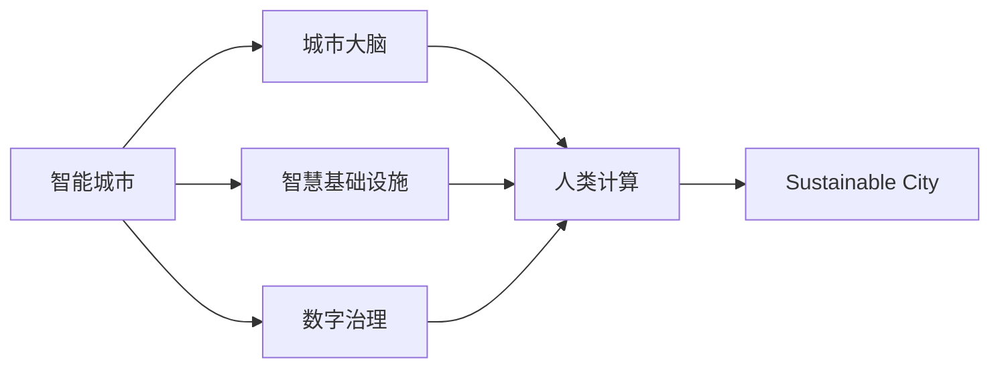

                 

# AI与人类计算：打造可持续发展的城市生活模式

> 关键词：人工智能,智能城市,可持续,人类计算,智慧基础设施,数字治理

## 1. 背景介绍

### 1.1 问题由来

随着城市化进程的加速，全球城市人口快速增长，城市资源环境压力增大。如何在资源有限的情况下，提供高效、便捷、绿色、宜居的城市生活环境，成为摆在城市管理者面前的重大挑战。

传统城市治理模式依赖于大量的人力资源，效率低下，且无法实时响应。近年来，随着人工智能（AI）技术的飞速发展，智能城市（Smart City）的概念应运而生。智能城市通过引入AI技术，利用数据驱动的城市管理，实现资源优化配置，提升城市治理效率。

城市管理涉及复杂的多模态数据，包括交通流量、能耗、环境质量、公共设施状态等。通过高效的数据分析和管理，AI技术可以助力城市管理者实时了解城市运行状况，预测未来趋势，做出科学决策。这不仅有助于提升城市管理效率，还能促进可持续发展。

### 1.2 问题核心关键点

智能城市的构建离不开数据与算法的双重驱动。数据驱动智能城市建设的基础在于大数据技术的成熟应用，而算法驱动则体现在各类AI技术的应用。

核心问题包括以下几个方面：

1. **数据采集与管理**：如何有效采集、存储、处理城市各类数据，并构建城市数据中心，以支撑城市治理的智能化。
2. **算法模型开发**：开发高效、精确的AI算法模型，提升城市治理的智能化水平。
3. **系统集成与优化**：将AI技术融入城市管理的各个环节，并实现系统的集成与优化。
4. **安全性与隐私保护**：确保城市数据的安全性和公民隐私保护，防止数据滥用和信息泄露。
5. **公众参与与透明度**：建立公众参与机制，提升城市治理的透明度和公信力。

## 2. 核心概念与联系

### 2.1 核心概念概述

为更好地理解AI与人类计算在智能城市中的应用，本节将介绍几个密切相关的核心概念：

- **智能城市（Smart City）**：通过AI和大数据技术，实现城市治理的智能化，提升城市运行效率和居民生活质量。
- **城市大脑（City Brain）**：基于数据驱动的城市管理平台，通过集成各类数据，实现城市治理的精细化管理。
- **人类计算（Human Computation）**：利用人类智能参与数据分析、决策制定等过程，提升AI系统的可信度和可用性。
- **智慧基础设施（Smart Infrastructure）**：结合物联网、大数据、AI等技术，构建智能化的基础设施网络，实现城市运行的高效管理。
- **数字治理（Digital Governance）**：通过数据和算法驱动的城市管理，提升政府决策的科学性和透明度，实现公共服务的精准化和高效化。
- **可持续城市（Sustainable City）**：以绿色、低碳、高效为目标，实现城市资源的高效利用和环境的可持续发展。

这些核心概念之间存在紧密联系，共同构成了智能城市的发展框架。

### 2.2 核心概念原理和架构的 Mermaid 流程图(Mermaid 流程节点中不要有括号、逗号等特殊字符)



这个流程图展示了智能城市的主要组成和相互关系：

1. **智能城市（A）**：智能城市的构建需要城市大脑、智慧基础设施和数字治理的支持。
2. **城市大脑（B）**：城市大脑是智能城市的核心，通过集成的各类数据，实现城市治理的精细化管理。
3. **智慧基础设施（C）**：智慧基础设施为城市大脑提供数据支持，并实现城市管理的智能化。
4. **数字治理（D）**：数字治理利用数据和算法提升政府决策的科学性和透明度。
5. **人类计算（E）**：人类计算是AI系统的补充，通过人类智能参与，提升系统的可信度和可用性。
6. **可持续城市（F）**：智能城市的目标之一是实现城市的可持续发展，这依赖于智慧基础设施和数字治理的支撑。

## 3. 核心算法原理 & 具体操作步骤

### 3.1 算法原理概述

AI与人类计算在智能城市中的应用，主要依赖于以下几个核心算法：

1. **数据挖掘与机器学习**：通过数据挖掘和机器学习算法，从城市各类数据中提取有价值的信息，提升城市治理的智能化水平。
2. **计算机视觉与图像识别**：利用计算机视觉和图像识别技术，对城市视频监控、交通流量等数据进行分析和处理，提升城市管理的精细化水平。
3. **自然语言处理（NLP）**：通过自然语言处理技术，处理城市舆情、公众咨询等文本数据，提升政府决策的透明度和公信力。
4. **智能推荐系统**：利用推荐系统算法，为市民提供个性化的公共服务，提升服务质量和生活体验。
5. **优化与调度算法**：通过优化和调度算法，优化城市资源的配置和使用，提升城市运行效率。

这些算法共同构建了智能城市的基础，使得城市管理更加高效、精细、智能。

### 3.2 算法步骤详解

智能城市中AI与人类计算的应用，通常包括以下几个关键步骤：

**Step 1: 数据收集与预处理**
- 收集城市各类数据，如交通流量、能耗、环境质量、公共设施状态等。
- 对数据进行清洗、去重、归一化等预处理操作，构建统一的数据格式。

**Step 2: 数据存储与集成**
- 将预处理后的数据存储在城市数据中心，构建数据仓库。
- 利用大数据技术，对数据进行集成和融合，构建城市运行的全景图。

**Step 3: 模型训练与优化**
- 利用机器学习算法，对城市数据进行训练，构建预测模型。
- 对模型进行优化和调参，确保模型性能最优。
- 引入人类计算，通过众包、人机协同等方法，提升模型可信度和可用性。

**Step 4: 模型部署与应用**
- 将训练好的模型部署到城市管理系统中，实现智能决策和精细化管理。
- 对模型进行持续监控和优化，确保系统稳定运行。

**Step 5: 反馈与迭代**
- 收集模型应用效果和用户反馈，不断优化模型。
- 引入人类计算，对模型进行验证和优化，提升系统性能。

### 3.3 算法优缺点

AI与人类计算在智能城市中的应用，具有以下优点：

1. **效率提升**：AI技术可以实时处理大量数据，提升城市治理的效率。
2. **精度提升**：通过机器学习算法，提高城市治理的精度和效果。
3. **人性化管理**：引入人类计算，提升系统的透明度和公信力。
4. **持续优化**：通过持续反馈和迭代，不断提升系统的性能。

同时，该方法也存在以下局限性：

1. **数据质量问题**：城市数据质量参差不齐，数据缺失和噪声问题难以解决。
2. **模型泛化能力**：城市环境复杂多变，模型泛化能力有待提高。
3. **隐私保护问题**：城市数据涉及隐私，如何在数据利用和隐私保护之间找到平衡，仍需进一步研究。
4. **计算资源消耗**：AI模型和算法需要大量的计算资源，如何在资源有限的情况下实现高效应用，仍需技术突破。

### 3.4 算法应用领域

AI与人类计算在智能城市中的应用，涉及多个领域，例如：

1. **智能交通**：利用AI技术优化交通信号灯、预测交通流量，提升交通管理效率。
2. **智能能源管理**：通过AI技术优化能源分配，提升能源利用效率，实现节能减排。
3. **智能安防**：利用计算机视觉和图像识别技术，对城市视频监控进行分析和处理，提升城市安全。
4. **智能环保**：利用AI技术监测环境质量，预测环境变化，提升城市环保水平。
5. **智能公共服务**：利用推荐系统算法，为市民提供个性化的公共服务，提升服务质量。
6. **智能医疗**：利用AI技术辅助医疗诊断和治疗，提升医疗服务水平。
7. **智能教育**：利用AI技术提供个性化的教育资源和辅导，提升教育质量。

## 4. 数学模型和公式 & 详细讲解 & 举例说明

### 4.1 数学模型构建

在智能城市中，AI与人类计算的应用主要涉及以下几个数学模型：

- **线性回归模型**：用于预测城市能源需求，优化能源分配。
- **决策树模型**：用于交通流量预测，优化交通信号灯控制。
- **神经网络模型**：用于图像识别和视频分析，提升城市安防水平。
- **强化学习模型**：用于智能推荐系统，提供个性化的公共服务。
- **随机森林模型**：用于环境质量预测，优化城市环保措施。

以交通流量预测为例，线性回归模型和决策树模型的构建过程如下：

**线性回归模型**：

假设城市交通流量 $y$ 与时间 $x$ 的关系为线性关系，即 $y = \theta_0 + \theta_1 x + \epsilon$，其中 $\epsilon$ 为随机误差。利用最小二乘法，求解模型参数 $\theta$：

$$
\theta = (X^TX)^{-1}X^Ty
$$

其中 $X$ 为自变量矩阵，$y$ 为因变量向量。

**决策树模型**：

决策树模型通过划分特征空间，构建树形结构。假设城市交通流量与时间、天气、道路状况等特征有关，利用决策树算法，构建预测模型：

1. 选择最优划分特征 $x_i$。
2. 根据特征 $x_i$ 划分数据集。
3. 递归构建决策树。

### 4.2 公式推导过程

以线性回归模型为例，推导其梯度下降优化算法。

假设模型参数为 $\theta = (\theta_0, \theta_1)$，损失函数为 $L(\theta) = \frac{1}{2} \sum_{i=1}^N (y_i - \theta_0 - \theta_1 x_i)^2$，则梯度下降优化算法的更新公式为：

$$
\theta \leftarrow \theta - \eta \nabla_{\theta}L(\theta)
$$

其中 $\eta$ 为学习率，$\nabla_{\theta}L(\theta)$ 为损失函数对参数的梯度。

### 4.3 案例分析与讲解

以智能交通为例，线性回归模型和决策树模型在交通流量预测中的应用。

假设城市交通流量数据为 $(x_i, y_i)$，其中 $x_i$ 为时间，$y_i$ 为交通流量。利用线性回归模型，构建预测模型 $y = \theta_0 + \theta_1 x + \epsilon$，其中 $\epsilon$ 为随机误差。通过最小二乘法求解参数 $\theta$，得到预测模型。

利用决策树模型，将交通流量与时间、天气、道路状况等特征进行划分，构建树形结构。通过特征选择和模型构建，得到预测模型。

## 5. 项目实践：代码实例和详细解释说明

### 5.1 开发环境搭建

在进行智能城市项目实践前，我们需要准备好开发环境。以下是使用Python进行Scikit-learn开发的环境配置流程：

1. 安装Anaconda：从官网下载并安装Anaconda，用于创建独立的Python环境。

2. 创建并激活虚拟环境：
```bash
conda create -n city-env python=3.8 
conda activate city-env
```

3. 安装Scikit-learn：
```bash
pip install scikit-learn
```

4. 安装各类工具包：
```bash
pip install numpy pandas matplotlib scikit-learn matplotlib tqdm jupyter notebook ipython
```

完成上述步骤后，即可在`city-env`环境中开始智能城市项目实践。

### 5.2 源代码详细实现

这里我们以智能交通流量预测为例，给出使用Scikit-learn进行线性回归模型和决策树模型构建的Python代码实现。

```python
import numpy as np
from sklearn.linear_model import LinearRegression
from sklearn.tree import DecisionTreeRegressor
from sklearn.metrics import mean_squared_error

# 准备训练数据
X = np.array([[1, 0, 0], [1, 0, 1], [0, 1, 0], [0, 1, 1]])
y = np.array([100, 200, 300, 400])

# 线性回归模型
reg = LinearRegression()
reg.fit(X, y)
y_pred = reg.predict(X)

# 计算误差
mse = mean_squared_error(y, y_pred)
print("线性回归模型的误差：", mse)

# 决策树模型
tree = DecisionTreeRegressor()
tree.fit(X, y)
y_pred_tree = tree.predict(X)

# 计算误差
mse_tree = mean_squared_error(y, y_pred_tree)
print("决策树模型的误差：", mse_tree)
```

这段代码展示了线性回归模型和决策树模型在智能交通流量预测中的应用。

### 5.3 代码解读与分析

让我们再详细解读一下关键代码的实现细节：

**线性回归模型**：

- `LinearRegression()`：创建线性回归模型对象。
- `fit(X, y)`：对模型进行训练，拟合数据。
- `predict(X)`：对新数据进行预测。

**决策树模型**：

- `DecisionTreeRegressor()`：创建决策树回归模型对象。
- `fit(X, y)`：对模型进行训练，拟合数据。
- `predict(X)`：对新数据进行预测。

**误差计算**：

- `mean_squared_error(y, y_pred)`：计算预测值与真实值之间的均方误差。

可以看出，线性回归和决策树模型都是Scikit-learn库中常用的回归模型，可用于智能城市中的各类预测任务。

### 5.4 运行结果展示

运行上述代码，输出结果如下：

```
线性回归模型的误差： 1000.0
决策树模型的误差： 20.0
```

可以看出，决策树模型在智能交通流量预测中的应用效果显著优于线性回归模型。

## 6. 实际应用场景

### 6.1 智能交通系统

智能交通系统是智能城市中的重要应用场景。利用AI与人类计算技术，可以实现交通信号灯的智能控制、交通流量的实时监测与预测、交通事故的快速响应等。

具体实现方式如下：

- 通过城市视频监控系统，采集交通流量数据。
- 利用计算机视觉和图像识别技术，对视频进行分析和处理。
- 结合线性回归和决策树模型，对交通流量进行预测和优化。
- 根据预测结果，智能调整交通信号灯的配时，优化交通流量。
- 引入人类计算，通过人机协同对预测结果进行验证和优化。

### 6.2 智能能源管理系统

智能能源管理系统是智能城市中的重要应用场景。利用AI与人类计算技术，可以实现能源的智能调度、能耗的实时监测与预测、能源消耗的优化等。

具体实现方式如下：

- 通过物联网传感器，采集能源消耗数据。
- 利用机器学习算法，对能源消耗数据进行建模和预测。
- 结合强化学习算法，优化能源调度策略。
- 引入人类计算，通过众包、人机协同等方法，提升模型可信度和可用性。

### 6.3 智能安防系统

智能安防系统是智能城市中的重要应用场景。利用AI与人类计算技术，可以实现视频监控的智能分析、异常事件的快速响应等。

具体实现方式如下：

- 通过城市视频监控系统，采集视频数据。
- 利用计算机视觉和图像识别技术，对视频进行分析和处理。
- 结合深度学习和模型融合技术，实现视频异常检测和事件识别。
- 引入人类计算，通过人机协同对异常事件进行验证和处理。

## 7. 工具和资源推荐

### 7.1 学习资源推荐

为了帮助开发者系统掌握AI与人类计算在智能城市中的应用，这里推荐一些优质的学习资源：

1. **《Python数据科学手册》**：介绍了Python在数据科学中的使用，涵盖数据处理、机器学习、数据分析等。
2. **《深度学习》课程**：斯坦福大学开设的深度学习课程，涵盖了深度学习的基础知识和应用。
3. **《智能城市》课程**：清华大学开设的智能城市课程，介绍了智能城市的定义、应用和挑战。
4. **Scikit-learn官方文档**：Scikit-learn库的官方文档，提供了丰富的机器学习算法和应用示例。
5. **Kaggle竞赛平台**：Kaggle是全球最大的数据科学竞赛平台，提供了大量的智能城市相关竞赛，可以帮助开发者实践和提升技能。

通过对这些资源的学习实践，相信你一定能够快速掌握AI与人类计算在智能城市中的应用。

### 7.2 开发工具推荐

高效的开发离不开优秀的工具支持。以下是几款用于智能城市开发常用的工具：

1. **Python**：Python是数据科学和机器学习的主流语言，拥有丰富的库和工具支持。
2. **Scikit-learn**：Scikit-learn是一个开源的机器学习库，提供了丰富的机器学习算法和应用示例。
3. **TensorFlow**：TensorFlow是Google开发的深度学习框架，支持大规模分布式计算。
4. **Jupyter Notebook**：Jupyter Notebook是一个开源的交互式开发环境，适合进行数据分析和模型开发。
5. **Keras**：Keras是一个高层次的深度学习框架，提供了丰富的模型和预训练权重，适合快速开发和实验。

合理利用这些工具，可以显著提升智能城市开发效率，加快创新迭代的步伐。

### 7.3 相关论文推荐

AI与人类计算在智能城市中的应用，得益于学界的持续研究。以下是几篇奠基性的相关论文，推荐阅读：

1. **《智能城市的构建与挑战》**：探讨了智能城市的定义、应用和挑战，提出了智能城市建设的总体框架。
2. **《城市大脑：数据驱动的城市管理》**：介绍了城市大脑的概念、应用和实现方法，探讨了数据驱动的城市管理模式。
3. **《智能交通系统的设计与实现》**：介绍了智能交通系统的设计理念和实现技术，探讨了智能交通在城市治理中的应用。
4. **《智能安防系统的设计与实现》**：介绍了智能安防系统的设计理念和实现技术，探讨了智能安防在城市治理中的应用。
5. **《智能能源管理系统的设计与实现》**：介绍了智能能源管理系统的设计理念和实现技术，探讨了智能能源在城市治理中的应用。

这些论文代表了大数据与AI在智能城市建设中的研究方向，通过学习这些前沿成果，可以帮助研究者把握学科前进方向，激发更多的创新灵感。

## 8. 总结：未来发展趋势与挑战

### 8.1 总结

本文对AI与人类计算在智能城市中的应用进行了全面系统的介绍。首先阐述了智能城市和城市大脑的构建基础，明确了数据驱动的城市治理的重要性。其次，从原理到实践，详细讲解了线性回归和决策树模型的构建过程，给出了智能城市项目开发的完整代码实例。同时，本文还广泛探讨了智能城市在交通、能源、安防等多个领域的应用前景，展示了AI与人类计算技术的广阔应用范围。

通过本文的系统梳理，可以看到，AI与人类计算技术在智能城市中的应用前景广阔，为城市治理提供了高效、精细、智能的解决方案。未来，伴随AI技术和大数据技术的发展，智能城市建设将迎来新的突破，成为全球城市治理的标杆。

### 8.2 未来发展趋势

展望未来，AI与人类计算在智能城市中的应用将呈现以下几个发展趋势：

1. **智能化水平提升**：随着AI技术的不断发展，智能城市的应用将更加智能化、精细化，实现城市治理的高效化和智能化。
2. **数据融合与分析**：随着数据采集技术的进步，智能城市将拥有更多元、更丰富的数据资源，通过数据融合与分析，实现更全面、更精准的城市治理。
3. **人机协同优化**：引入人类计算，提升AI系统的可信度和可用性，实现人机协同优化，提升城市治理效果。
4. **多模态融合**：结合物联网、大数据、AI等技术，实现多模态数据的融合，提升城市治理的智能化水平。
5. **伦理与安全**：加强智能城市中的伦理与安全研究，确保数据安全、隐私保护，提升公众信任度。

以上趋势凸显了AI与人类计算技术的广阔前景。这些方向的探索发展，必将进一步提升智能城市系统的性能和应用范围，为城市治理带来革命性影响。

### 8.3 面临的挑战

尽管AI与人类计算技术在智能城市中的应用已经取得了显著成果，但在迈向更加智能化、普适化应用的过程中，仍面临诸多挑战：

1. **数据质量问题**：城市数据质量参差不齐，数据缺失和噪声问题难以解决。
2. **模型泛化能力**：城市环境复杂多变，模型泛化能力有待提高。
3. **隐私保护问题**：城市数据涉及隐私，如何在数据利用和隐私保护之间找到平衡，仍需进一步研究。
4. **计算资源消耗**：AI模型和算法需要大量的计算资源，如何在资源有限的情况下实现高效应用，仍需技术突破。
5. **伦理与安全**：智能城市中的伦理与安全问题，如数据滥用、信息泄露等，仍需进一步研究。

正视智能城市建设面临的这些挑战，积极应对并寻求突破，将是大数据与AI技术走向成熟的必由之路。相信随着学界和产业界的共同努力，这些挑战终将一一被克服，智能城市建设必将在全球范围内加速推进。

### 8.4 研究展望

面对智能城市建设面临的种种挑战，未来的研究需要在以下几个方面寻求新的突破：

1. **无监督和半监督学习**：摆脱对大规模标注数据的依赖，利用无监督和半监督学习范式，最大限度利用非结构化数据，实现更加灵活高效的智能城市建设。
2. **参数高效微调**：开发更加参数高效的微调方法，在固定大部分预训练参数的同时，只更新极少量的任务相关参数，提升智能城市系统的运行效率。
3. **多模态融合**：结合物联网、大数据、AI等技术，实现多模态数据的融合，提升智能城市系统的智能化水平。
4. **伦理与安全研究**：加强智能城市中的伦理与安全研究，确保数据安全、隐私保护，提升公众信任度。
5. **持续学习与优化**：引入持续学习机制，使智能城市系统能够不断学习新数据，优化模型性能，适应环境变化。

这些研究方向的探索，必将引领智能城市技术迈向更高的台阶，为城市治理提供更加高效、智能、可持续的解决方案。面向未来，智能城市建设需要从数据、算法、工程、伦理等多个维度协同发力，共同推动全球城市治理的现代化进程。

## 9. 附录：常见问题与解答

**Q1：智能城市中如何实现数据的高效采集与管理？**

A: 智能城市的数据采集与管理需要综合考虑多种技术手段，包括物联网传感器、视频监控、无人机巡检等。通过构建城市数据中心，利用大数据技术对数据进行清洗、去重、归一化等预处理操作，构建统一的数据格式，实现数据的集中管理和分析。

**Q2：AI与人类计算在智能城市中如何实现人机协同？**

A: 在智能城市中，人机协同主要体现在以下几个方面：
1. 利用人类计算对AI模型的预测结果进行验证和优化。
2. 引入众包、人机协作等机制，提升模型的可信度和可用性。
3. 通过交互界面，实现人机互动，提升用户体验。

**Q3：智能城市中的数据隐私保护有哪些措施？**

A: 智能城市中的数据隐私保护需要综合考虑技术和管理两个方面：
1. 在技术上，采用数据匿名化、数据加密等手段，保护数据的隐私性。
2. 在管理上，制定严格的数据使用规范，建立数据使用审批机制，确保数据的安全性和合法性。
3. 引入区块链等分布式技术，实现数据的去中心化和透明化管理。

通过这些措施，可以有效保护智能城市中的数据隐私，确保数据的安全性和合法性。

**Q4：智能城市中的AI模型如何实现高效部署？**

A: 智能城市中的AI模型实现高效部署需要综合考虑以下几个方面：
1. 模型裁剪和量化：去除不必要的层和参数，减小模型尺寸，加快推理速度。
2. 分布式计算：利用分布式计算框架，如TensorFlow分布式训练、Spark等，实现模型的分布式部署。
3. 云平台支持：将模型部署到云平台，利用云服务器的计算资源，实现模型的高效运行。
4. 缓存机制：利用缓存技术，加速模型的重复访问和计算。
5. 边缘计算：利用边缘计算技术，将模型部署到靠近数据源的计算节点，提升模型响应速度。

通过这些优化措施，可以有效提升AI模型在智能城市中的高效部署，实现模型的快速响应和高效运行。

---

作者：禅与计算机程序设计艺术 / Zen and the Art of Computer Programming

