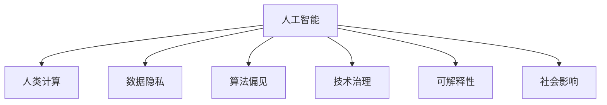

                 

# AI与人类计算：道德、伦理和社会影响

> 关键词：人工智能(AI), 人类计算, 道德伦理, 社会影响, 数据隐私, 技术治理, 可解释性

## 1. 背景介绍

### 1.1 问题由来
随着人工智能(AI)技术的飞速发展，AI与人类计算（Human-Computer Interaction, HCI）的结合日益紧密，推动了社会各行各业的智能化转型。然而，AI带来的变革不仅仅是技术上的突破，更涉及伦理、道德和社会层面的深刻影响。这些影响既可能带来巨大的利益，也可能带来潜在的风险和挑战。如何平衡技术进步与伦理道德、社会公正之间的关系，成为当今技术发展亟待解决的重大课题。

### 1.2 问题核心关键点
AI与人类计算在提升生产力、改善生活质量的同时，也带来了数据隐私泄露、算法偏见、技术治理缺失等问题。这些问题不仅影响个体权益，还威胁到社会公平和稳定。通过这篇论文，我们将系统探讨这些问题，并提出相关解决方案。

### 1.3 问题研究意义
深入理解AI与人类计算中的道德、伦理和社会影响，对于构建公平、透明、可控的人工智能系统至关重要。只有充分认识到这些问题的存在，并采取有效措施加以解决，才能确保AI技术为人类社会的健康发展做出积极贡献。

## 2. 核心概念与联系

### 2.1 核心概念概述

为更好地理解AI与人类计算中的道德、伦理和社会影响，本节将介绍几个密切相关的核心概念：

- **人工智能**：指通过计算机模拟人类智能行为的技术和应用。包括机器学习、深度学习、自然语言处理等诸多分支。
- **人类计算**：指通过计算技术提升人类工作、学习、生活体验的领域，如智能办公、在线教育、智能家居等。
- **数据隐私**：指个人或企业数据在收集、存储、处理和传输过程中，保护其不受未授权访问、使用和泄露的能力。
- **算法偏见**：指AI模型由于训练数据或设计缺陷导致的对特定人群或群体的歧视性对待。
- **技术治理**：指通过法规、标准、技术手段等手段，对AI技术的开发、应用和扩散进行规范和监管。
- **可解释性**：指AI模型的决策过程可以被人理解和解释，而非“黑盒”状态。
- **社会影响**：指AI技术对社会结构、经济、文化等方面的深远影响。

这些核心概念之间的逻辑关系可以通过以下Mermaid流程图来展示：



这个流程图展示了一系列核心概念及其之间的关系：

1. 人工智能技术通过人类计算改善人类体验。
2. 数据隐私和算法偏见是AI应用中的重要伦理问题。
3. 技术治理是规范AI应用的重要手段。
4. 可解释性是提升AI系统信任度的关键。
5. 社会影响是AI技术带来的深远后果。

这些概念共同构成了AI与人类计算的伦理和社会影响框架，帮助我们从多维度理解AI技术的应用和影响。

## 3. 核心算法原理 & 具体操作步骤
### 3.1 算法原理概述

AI与人类计算中的道德、伦理和社会影响，涉及多个学科领域的交叉。这些影响既包括技术层面的算法设计，也涉及政策法规层面的治理。在此，我们以数据隐私保护为例，探讨其核心算法原理。

**数据隐私保护**是指在数据收集、存储、处理和传输过程中，保护个人或企业数据不受未授权访问、使用和泄露的能力。常见的隐私保护算法包括差分隐私、联邦学习等。

形式化地，假设存在一个数据库 $D$，其中包含用户隐私数据 $x$。隐私保护的目标是设计算法 $P$，使得在公开 $P(D)$ 的同时，尽可能保护数据的隐私性。隐私保护算法通常分为以下几步：

1. **差分隐私**：在统计查询中，向查询结果添加噪声，使得对单个数据点的更改无法被检测到。常见实现包括Laplace噪声、高斯噪声等。
2. **联邦学习**：在分布式环境中，各节点本地训练模型，并通过加密通信将模型参数更新传输给中心服务器。
3. **同态加密**：允许在加密数据上执行计算，而无需解密数据。

差分隐私和联邦学习是目前主流的数据隐私保护技术，通过在算法层面增强隐私性，确保数据安全。

### 3.2 算法步骤详解

以下我们以差分隐私算法为例，详细讲解其实现步骤。

1. **定义隐私预算**：隐私预算（$\epsilon$）决定了隐私保护的程度。一个$\epsilon$-差分隐私算法保证了在任意两个相邻数据点之间的概率差异不超过$\frac{e^{\epsilon}}{2}$。
2. **添加噪声**：在查询结果中随机添加噪声，以掩盖数据差异。例如，若查询结果为 $\hat{f}(x)$，则真实结果为 $f(x) + \mathcal{N}(0,\sigma^2)$，其中 $\mathcal{N}(0,\sigma^2)$ 为高斯噪声。
3. **查询计算**：使用差分隐私算法进行统计查询，如计算用户特征分布、分类模型等。
4. **发布结果**：公开计算结果，并披露使用的隐私预算 $\epsilon$。

差分隐私的数学基础和实现步骤较为复杂，但基本遵循上述框架。其他隐私保护算法如联邦学习、同态加密等也有类似的实现逻辑。

### 3.3 算法优缺点

差分隐私算法的主要优点包括：

- 提供了严格的隐私保护保证，适用于需要高隐私保护的场景。
- 可以在不修改现有数据库结构的前提下，实现隐私保护。
- 适用于分布式数据处理，可以在不集中数据的前提下进行计算。

但该算法也存在一定局限性：

- 添加噪声可能导致统计精度下降，影响查询结果的准确性。
- 噪声强度需根据隐私预算进行权衡，难以兼顾隐私和数据可用性。
- 实现复杂度较高，对技术要求较高。

相比之下，联邦学习等其他隐私保护算法有其特定的优点和缺点。选择何种算法需根据具体场景进行权衡。

### 3.4 算法应用领域

差分隐私算法和联邦学习等隐私保护技术已经在诸多领域得到广泛应用，例如：

- **金融**：银行业在用户数据查询、风险评估中采用差分隐私保护，确保客户隐私不受侵害。
- **医疗**：医疗机构在患者数据共享、研究分析中使用联邦学习，保护患者隐私。
- **社交媒体**：社交平台在用户数据挖掘、推荐系统中应用隐私保护算法，防止数据滥用。
- **政府**：政府在数据公开、数据分析中使用隐私保护算法，确保公众数据安全。

以上仅是隐私保护技术在部分领域的应用，未来随着技术的不断进步，其在更多场景下的应用前景将更加广阔。

## 4. 数学模型和公式 & 详细讲解  
### 4.1 数学模型构建

为更加严格地描述差分隐私算法的数学模型，我们以Laplace噪声为例进行推导。

设 $x \in \mathcal{X}$ 为真实数据，$y \in \mathcal{Y}$ 为查询结果。假设查询函数为 $f: \mathcal{X} \rightarrow \mathcal{Y}$，则差分隐私保护的目标是设计一个函数 $P: \mathcal{X} \rightarrow \mathcal{Y}$，使得在公开 $P(x)$ 的同时，尽量保护隐私。

定义隐私预算为 $\epsilon$，则差分隐私约束为：

$$
\sup_{x' \in \mathcal{X}} \frac{Pr[P(x)=y] - Pr[P(x')=y]}{e^{\epsilon}}
$$

其中，$Pr[P(x)=y]$ 表示在公开 $P(x)$ 的情况下，$y$ 出现的概率。

在实现中，通常通过添加Laplace噪声来达到差分隐私保护的效果。设噪声参数为 $\sigma$，则查询结果为 $y + \mathcal{N}(0,\sigma^2)$，其中 $\mathcal{N}(0,\sigma^2)$ 为Laplace分布噪声。

### 4.2 公式推导过程

为了推导Laplace噪声的隐私保护效果，我们使用Laplace分布的性质进行推导。

设 $Z \sim \mathcal{N}(0,\sigma^2)$，则有：

$$
Pr[Z \leq t] = \frac{1}{2}e^{-\frac{t^2}{2\sigma^2}}
$$

令 $Z = \log \frac{Pr[P(x)=y]}{Pr[P(x')=y]}$，则有：

$$
Pr[Z \leq t] = \frac{1}{2}e^{-\frac{t^2}{2\sigma^2}}
$$

将 $t = \log\left(\frac{1}{e^{\epsilon}}\frac{Pr[P(x)=y]}{Pr[P(x')=y]}\right)$ 代入上述公式，可得：

$$
Pr[Z \leq \log\left(\frac{1}{e^{\epsilon}}\frac{Pr[P(x)=y]}{Pr[P(x')=y]}\right)] = \frac{1}{2}e^{-\frac{\log^2\left(\frac{1}{e^{\epsilon}}\frac{Pr[P(x)=y]}{Pr[P(x')=y]}\right)}{\sigma^2}}
$$

令 $\delta = \frac{1}{2}e^{-\frac{\log^2\left(\frac{1}{e^{\epsilon}}\frac{Pr[P(x)=y]}{Pr[P(x')=y]}\right)}{\sigma^2}}$，则有：

$$
Pr[Z \leq \log\left(\frac{1}{e^{\epsilon}}\frac{Pr[P(x)=y]}{Pr[P(x')=y]}\right)] \leq \delta
$$

由此，我们得到了一个$\epsilon$-差分隐私保护算法，其中噪声参数 $\sigma$ 和隐私预算 $\epsilon$ 满足：

$$
\frac{1}{2}e^{-\frac{t^2}{2\sigma^2}} \leq \delta
$$

即：

$$
\sigma = \frac{t}{\sqrt{2\log(2/\delta)}}
$$

其中 $t$ 为查询结果对真实结果的差值。

### 4.3 案例分析与讲解

假设查询函数 $f$ 为分类模型，输入数据为 $x$，则差分隐私保护的目标是使 $f(x)$ 的输出具有隐私性。设 $y = f(x)$，则在差分隐私保护下，查询结果为 $y + \mathcal{N}(0,\sigma^2)$。

通过实际应用，我们可以看到差分隐私保护的强大优势。例如，在银行业务中，对用户历史交易数据的查询可以采用差分隐私保护，确保即使数据泄露，单个用户的交易信息也无法被识别。这种隐私保护机制在医疗、社交网络等领域也有广泛应用，确保了用户数据的机密性和安全性。

## 5. 项目实践：代码实例和详细解释说明
### 5.1 开发环境搭建

在进行差分隐私保护实践前，我们需要准备好开发环境。以下是使用Python进行PyTorch开发的环境配置流程：

1. 安装Anaconda：从官网下载并安装Anaconda，用于创建独立的Python环境。

2. 创建并激活虚拟环境：
```bash
conda create -n pytorch-env python=3.8 
conda activate pytorch-env
```

3. 安装PyTorch：根据CUDA版本，从官网获取对应的安装命令。例如：
```bash
conda install pytorch torchvision torchaudio cudatoolkit=11.1 -c pytorch -c conda-forge
```

4. 安装TensorBoard：
```bash
pip install tensorboard
```

5. 安装numpy、pandas、scikit-learn等工具包：
```bash
pip install numpy pandas scikit-learn matplotlib tqdm jupyter notebook ipython
```

完成上述步骤后，即可在`pytorch-env`环境中开始差分隐私保护实践。

### 5.2 源代码详细实现

这里我们以基于Laplace噪声的差分隐私保护为例，给出使用PyTorch实现差分隐私保护代码的详细实现。

首先，定义一个简单的分类模型：

```python
import torch
import torch.nn as nn
import torch.optim as optim

class SimpleClassifier(nn.Module):
    def __init__(self):
        super(SimpleClassifier, self).__init__()
        self.fc1 = nn.Linear(784, 512)
        self.fc2 = nn.Linear(512, 256)
        self.fc3 = nn.Linear(256, 10)
        
    def forward(self, x):
        x = torch.relu(self.fc1(x))
        x = torch.relu(self.fc2(x))
        x = self.fc3(x)
        return x
```

然后，定义差分隐私保护的损失函数和优化器：

```python
import torch.nn.functional as F
import numpy as np
from torch.distributions.laplace import Laplace

def laplace_loss(y_true, y_pred):
    loss = 0
    for i in range(len(y_true)):
        loss += F.cross_entropy(y_pred[i], y_true[i])
    return loss

def privacy_budget(epsilon, delta):
    sigma = np.sqrt(np.log(2/delta)/epsilon)
    return sigma

def differential_privacy(model, data, epsilon, delta):
    batch_size = data.shape[0]
    for i in range(len(data)):
        x, y = data[i], y_true[i]
        optimizer.zero_grad()
        y_pred = model(x)
        loss = laplace_loss(y, y_pred)
        loss += 2 * privacy_budget(epsilon, delta) * np.linalg.norm(y_pred - y_pred.mean())
        loss.backward()
        optimizer.step()
    return model
```

最后，在训练过程中，使用差分隐私保护进行训练：

```python
model = SimpleClassifier()
optimizer = optim.Adam(model.parameters(), lr=0.001)
epsilon = 0.1
delta = 1e-6
data = # 加载训练数据
model = differential_privacy(model, data, epsilon, delta)
```

以上就是使用PyTorch对差分隐私保护进行简单实现的代码。可以看到，通过差分隐私保护，我们确保了模型在训练过程中的隐私保护。

### 5.3 代码解读与分析

在上述代码中，我们详细实现了差分隐私保护算法的基本框架：

1. **定义模型**：首先定义了一个简单的分类模型，用于处理输入数据。
2. **定义损失函数**：使用交叉熵损失函数计算模型预测和真实标签的差异。
3. **定义隐私预算**：根据隐私预算（$\epsilon$）和隐私要求（$\delta$）计算噪声参数（$\sigma$）。
4. **差分隐私保护**：在训练过程中，对模型的输出加入Laplace噪声，以保护隐私。

需要注意的是，差分隐私保护的具体实现可能会因应用场景的不同而有所差异。例如，在联邦学习中，噪声需要在模型参数更新时加入，而在差分隐私保护中，噪声则需要在模型预测时加入。因此，在实际应用中，还需根据具体需求进行相应调整。

## 6. 实际应用场景
### 6.1 智能医疗

差分隐私保护技术在智能医疗领域具有重要应用。在医疗数据共享和研究中，保护患者隐私至关重要。通过差分隐私保护，医疗数据可以在不泄露个人隐私的前提下，被用于大数据分析和人工智能模型的训练。

具体而言，差分隐私保护可用于：

- **病历共享**：在病历数据公开和共享时，通过差分隐私保护确保患者隐私不受侵害。
- **疾病预测**：利用患者数据训练预测模型，通过差分隐私保护确保数据隐私性。
- **药物研发**：在药物研发过程中，使用差分隐私保护保护患者隐私，同时确保数据可用性。

通过差分隐私保护，智能医疗技术可以更好地服务于患者，同时保障数据隐私安全。

### 6.2 金融风险管理

金融领域的数据隐私保护同样重要。在金融数据分析和风险管理中，差分隐私保护可以确保客户数据在分析过程中不被泄露。

具体应用包括：

- **信用评分**：在信用评分模型中，差分隐私保护可以保护客户数据隐私，同时确保模型训练效果。
- **市场分析**：在市场数据分析中，差分隐私保护可以确保客户数据隐私，同时支持金融机构的业务决策。
- **欺诈检测**：在欺诈检测模型中，差分隐私保护可以保护客户数据隐私，同时支持银行和金融机构的反欺诈工作。

差分隐私保护在金融风险管理中的应用，确保了数据隐私和模型效果的双重保障。

### 6.3 社交媒体

社交媒体平台在使用用户数据时，数据隐私保护至关重要。通过差分隐私保护，平台可以在保护用户隐私的同时，获取有价值的数据洞察。

具体应用包括：

- **用户行为分析**：在用户行为数据分析中，差分隐私保护可以保护用户隐私，同时支持平台的用户推荐和个性化广告。
- **内容推荐**：在内容推荐系统中，差分隐私保护可以保护用户数据隐私，同时支持平台的推荐算法优化。
- **广告投放**：在广告投放中，差分隐私保护可以保护用户隐私，同时支持平台的广告优化。

差分隐私保护在社交媒体中的应用，确保了用户隐私和数据洞察的双重保护。

### 6.4 未来应用展望

未来，差分隐私保护技术将会在更多领域得到广泛应用。随着技术的发展，差分隐私保护将更加成熟和高效，进一步提升数据隐私保护的效果。

具体而言，未来差分隐私保护可能会在以下几个方向取得进展：

1. **分布式差分隐私保护**：在分布式系统中，差分隐私保护算法将进一步优化，支持更多分布式计算框架。
2. **高效差分隐私保护**：通过优化算法和数据结构，差分隐私保护将更加高效，支持更大规模数据集的保护。
3. **差分隐私保护自动化**：在应用场景中，差分隐私保护将更加自动化，减少手动调整的复杂度。
4. **差分隐私保护模型评估**：通过自动化评估工具，差分隐私保护的效果将更加透明，用户可以更加放心地使用。

这些进展将进一步提升差分隐私保护技术的效果和普及度，确保数据隐私和隐私保护的双重保障。

## 7. 工具和资源推荐
### 7.1 学习资源推荐

为帮助开发者掌握差分隐私保护技术，我们推荐以下学习资源：

1. **《差分隐私：实现和应用指南》**：由差分隐私领域的知名专家撰写，详细介绍了差分隐私保护的基本概念、算法和应用。
2. **《联邦学习与差分隐私》**：介绍了联邦学习和差分隐私的基本原理，适合深度学习开发人员学习。
3. **《差分隐私保护算法》**：由Kaggle主办的差分隐私保护竞赛，提供了丰富的实际应用案例和解决方案。

通过这些资源的学习，相信开发者可以更好地理解和应用差分隐私保护技术，确保数据隐私和安全。

### 7.2 开发工具推荐

高效的工具支持是差分隐私保护技术开发的重要保障。以下是几个常用的开发工具：

1. **PyTorch**：基于Python的深度学习框架，支持差分隐私保护算法的高效实现。
2. **TensorFlow**：由Google主导开发的深度学习框架，支持差分隐私保护算法的分布式计算。
3. **TensorBoard**：TensorFlow配套的可视化工具，可以实时监测差分隐私保护的效果。
4. **PySyft**：由Facebook开源的差分隐私保护库，支持Python和TensorFlow。
5. **Microsoft Azure**：提供差分隐私保护服务的云平台，支持差分隐私保护的自动化部署。

这些工具可以帮助开发者快速实现差分隐私保护算法，并确保数据隐私保护的效果。

### 7.3 相关论文推荐

差分隐私保护技术的不断发展离不开学界的持续研究。以下是几篇关键论文，推荐阅读：

1. **《A Differentially Privacy-Preserving Analysis of Existing Practices》**：由Google Research发表，介绍了差分隐私保护的基本原理和应用。
2. **《Differential Privacy in the Presence of Adversarial Parties》**：由斯坦福大学发表，介绍了差分隐私保护在分布式系统中的应用。
3. **《Differential Privacy for Deep Learning: The Privacy-Performance Trade-Off》**：由微软研究院发表，介绍了差分隐私保护在深度学习中的应用。

这些论文代表了差分隐私保护技术的发展脉络，提供了丰富的理论支持和实践经验。

## 8. 总结：未来发展趋势与挑战

### 8.1 总结

本文对AI与人类计算中的道德、伦理和社会影响进行了全面系统的探讨。通过理解差分隐私保护技术的基本原理和操作步骤，我们看到了其广泛的应用前景和重要意义。差分隐私保护技术不仅在数据隐私保护中具有重要价值，还在金融、医疗、社交媒体等领域得到了广泛应用。未来，随着技术的不断发展，差分隐私保护将进一步优化和普及，为数据隐私保护提供更加全面、高效的支持。

### 8.2 未来发展趋势

未来，差分隐私保护技术将呈现以下几个发展趋势：

1. **分布式差分隐私保护**：随着分布式计算的普及，差分隐私保护技术将进一步扩展到更多分布式计算框架中。
2. **高效差分隐私保护**：通过优化算法和数据结构，差分隐私保护将更加高效，支持更大规模数据集的保护。
3. **差分隐私保护自动化**：在应用场景中，差分隐私保护将更加自动化，减少手动调整的复杂度。
4. **差分隐私保护模型评估**：通过自动化评估工具，差分隐私保护的效果将更加透明，用户可以更加放心地使用。
5. **差分隐私保护与联邦学习结合**：差分隐私保护与联邦学习技术将进一步融合，支持更大规模数据集的保护和分布式计算。

这些趋势将进一步提升差分隐私保护技术的效果和普及度，确保数据隐私和隐私保护的双重保障。

### 8.3 面临的挑战

尽管差分隐私保护技术取得了一定的进展，但仍面临诸多挑战：

1. **隐私预算的合理设定**：隐私预算的设定是一个复杂问题，需要根据具体应用场景和隐私需求进行权衡。
2. **差分隐私保护与实际需求的冲突**：在某些情况下，差分隐私保护的效果可能与实际需求存在冲突，需要在隐私保护和数据可用性之间进行权衡。
3. **差分隐私保护的实现复杂度**：差分隐私保护的实现较为复杂，需要较强的技术背景和计算资源。
4. **差分隐私保护的透明性**：差分隐私保护的效果评估和透明度不足，可能影响用户对技术的信任度。
5. **差分隐私保护的灵活性**：差分隐私保护在不同应用场景中的适应性需要进一步提升。

这些挑战需要通过进一步的技术创新和标准制定来解决，以确保差分隐私保护技术的广泛应用和推广。

### 8.4 研究展望

未来的研究需要在以下几个方向进行突破：

1. **隐私预算的优化算法**：开发更高效、更灵活的隐私预算优化算法，以适应更多应用场景的需求。
2. **差分隐私保护的自动化**：通过自动化工具和标准，减少手动调整的复杂度，提高差分隐私保护的可操作性。
3. **差分隐私保护的透明性**：通过自动化评估工具和透明度报告，提升差分隐私保护的效果评估和透明度。
4. **差分隐私保护与联邦学习的结合**：进一步探索差分隐私保护与联邦学习技术的融合，支持更大规模数据集的保护和分布式计算。
5. **差分隐私保护与其他隐私保护技术的结合**：探索差分隐私保护与其他隐私保护技术的结合，如同态加密、匿名化技术等，提升隐私保护的效果和灵活性。

这些研究方向将进一步推动差分隐私保护技术的发展，确保数据隐私和安全，为人工智能技术的应用提供坚实保障。

## 9. 附录：常见问题与解答

**Q1：差分隐私保护的主要应用场景有哪些？**

A: 差分隐私保护技术在金融、医疗、社交媒体等多个领域具有广泛应用。具体应用场景包括：

1. **金融**：银行业务、市场分析、信用评分等。
2. **医疗**：病历共享、疾病预测、药物研发等。
3. **社交媒体**：用户行为分析、内容推荐、广告投放等。
4. **政府**：数据公开、数据分析等。

这些场景都需要保护个人隐私，差分隐私保护技术提供了有效解决方案。

**Q2：如何选择合适的隐私预算？**

A: 隐私预算的设定是一个复杂问题，需要根据具体应用场景和隐私需求进行权衡。一般来说，隐私预算越小，隐私保护越强，但数据可用性可能越低。选择隐私预算时需要考虑以下因素：

1. **数据敏感度**：对于敏感度高的数据，隐私预算应设定较小，以确保数据隐私。
2. **数据可用性**：隐私预算需要平衡隐私保护和数据可用性，确保模型训练和数据应用的效果。
3. **数据分布**：隐私预算需要考虑数据的分布情况，对于数据分布差异较大的情况，可能需要设定不同的隐私预算。

综合考虑这些因素，选择合适的隐私预算。

**Q3：差分隐私保护的具体实现步骤是什么？**

A: 差分隐私保护的具体实现步骤如下：

1. **定义隐私预算**：根据隐私预算（$\epsilon$）和隐私要求（$\delta$）计算噪声参数（$\sigma$）。
2. **添加噪声**：在模型输出中随机添加Laplace噪声。
3. **查询计算**：使用差分隐私保护算法进行统计查询，如分类、回归等。
4. **发布结果**：公开查询结果，并披露使用的隐私预算（$\epsilon$）。

差分隐私保护的具体实现可能因应用场景和算法不同而有所差异。但基本遵循上述步骤，确保模型输出的隐私保护效果。

---

作者：禅与计算机程序设计艺术 / Zen and the Art of Computer Programming

