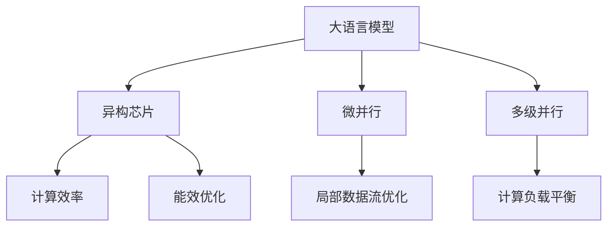

                 

# AI加速乐观前景：贾扬清观点异构芯片大语言模型发展

## 1. 背景介绍

### 1.1 问题由来

随着人工智能技术的飞速发展，大语言模型（Large Language Models, LLMs）成为AI领域的明星技术，广泛应用于自然语言处理（NLP）、机器翻译、自动摘要等多个领域，推动了AI技术的边界不断拓展。然而，大语言模型仍面临着数据依赖性高、计算资源需求大、推理速度慢等问题。为了进一步提升大语言模型的性能和应用效率，异构芯片（Heterogeneous Chips）技术成为近年来的研究热点。

### 1.2 问题核心关键点

异构芯片是一种将不同类型处理器集成于同一芯片上的技术，如将通用处理器和专用加速器（如GPU、TPU、FPGA）融合，以实现高效计算和能效优化的目标。在AI领域，异构芯片的应用可以显著提升大语言模型的训练和推理效率，同时保持其高性能和稳定性。

当前异构芯片技术在大语言模型中的应用主要集中于以下几个方面：
- 提升模型并行度，加速训练过程。
- 优化推理流程，减少延迟和资源占用。
- 兼顾能效优化，延长芯片寿命和降低计算成本。

### 1.3 问题研究意义

异构芯片技术的应用，对于拓展大语言模型的应用场景，提升模型性能和效率，降低计算成本，具有重要意义：

1. 加速模型训练。异构芯片能够显著提升模型并行度，加速大语言模型的训练过程，缩短模型开发周期。
2. 提升推理效率。异构芯片在推理阶段可优化计算流程，减少资源占用和计算时间，提升模型推理速度。
3. 降低计算成本。异构芯片集成多种处理器，可减少单个芯片的计算负载，降低能源消耗和冷却成本。
4. 增强模型稳定性。通过合理调度不同处理器的工作负载，异构芯片能够提高系统的稳定性和可靠性。

## 2. 核心概念与联系

### 2.1 核心概念概述

为了更好地理解异构芯片大语言模型，本节将介绍几个核心概念：

- 大语言模型（LLMs）：指通过大规模预训练学习获得语言知识，具有复杂语言理解和生成能力的人工智能模型。
- 异构芯片（Heterogeneous Chips）：指集成不同类型处理器（如CPU、GPU、TPU）的芯片，能够高效处理不同计算任务，提升计算效率和能效。
- 微并行（Micro-Parallelism）：指在芯片内部进行的小规模并行计算，以优化局部数据流和计算效率。
- 多级并行（Multi-Level Parallelism）：指在大规模系统中实现多层次的并行计算，以平衡计算负载和资源利用率。

这些核心概念之间的逻辑关系可以通过以下Mermaid流程图来展示：



这个流程图展示了异构芯片大语言模型的核心概念及其相互关系：

1. 大语言模型通过异构芯片得到计算优化，提升性能。
2. 微并行和多级并行技术进一步优化计算效率和负载平衡。
3. 计算效率和能效优化是异构芯片技术的主要目标。

这些概念共同构成了异构芯片大语言模型的设计和应用框架，使其能够在各种场景下发挥强大的计算和语言处理能力。通过理解这些核心概念，我们可以更好地把握异构芯片大语言模型的技术细节和工作原理。

## 3. 核心算法原理 & 具体操作步骤
### 3.1 算法原理概述

异构芯片大语言模型的核心算法原理是基于微并行和多级并行技术的深度学习模型的训练和推理优化。其核心思想是通过将不同计算任务分配给不同的处理器，实现高效并行计算和能效优化。

具体来说，异构芯片大语言模型训练和推理流程主要包括以下几个步骤：

1. **数据并行**：将大规模训练数据分成多个小块，每个小块由不同的处理器并行处理，以加快训练速度。
2. **模型并行**：将大语言模型的不同层次模块分别部署在不同类型的处理器上，实现多级并行计算。
3. **参数共享**：不同处理器之间共享模型的部分参数，以减少内存访问和通信开销。
4. **局部优化**：在每个处理器内部实现局部优化算法，如GPU的CUDA并行编程模型，以进一步提升计算效率。

### 3.2 算法步骤详解

以下是异构芯片大语言模型训练和推理的具体操作步骤：

#### 3.2.1 数据并行处理

**数据并行**步骤主要包括以下几个子步骤：

1. **数据划分**：将大规模训练数据集 $D=\{x_1, x_2, ..., x_n\}$ 划分成 $k$ 个大小相等的数据块 $D_1, D_2, ..., D_k$。每个数据块由不同的处理器并行处理。

2. **并行训练**：每个处理器 $P_i$ 负责处理一个数据块 $D_i$，分别计算每个样本的梯度 $\nabla_i$。

3. **聚合梯度**：将所有处理器计算的梯度 $\nabla_1, \nabla_2, ..., \nabla_k$ 进行聚合，更新模型参数 $\theta$。

数学上，数据并行过程可以表示为：

$$
\nabla_i = \frac{\partial \mathcal{L}}{\partial \theta} \bigg|_{D_i}
$$

$$
\theta = \theta - \frac{\eta}{k} \sum_{i=1}^k \nabla_i
$$

其中 $\mathcal{L}$ 为模型损失函数，$\eta$ 为学习率，$k$ 为处理器个数。

#### 3.2.2 模型并行处理

**模型并行**步骤主要包括以下几个子步骤：

1. **模块划分**：将大语言模型的不同层次模块分别部署在不同类型的处理器上，如将Transformer层部署在GPU上，将前馈层部署在CPU上。

2. **并行计算**：不同处理器独立计算各自模块的输出，以加快计算速度。

3. **数据交换**：不同处理器之间交换数据，更新模型参数。

数学上，模型并行过程可以表示为：

$$
y_i = \text{module}_i(x_i; \theta_i)
$$

$$
\theta = \text{Update}(\nabla_i)
$$

其中 $\text{module}_i$ 表示在处理器 $P_i$ 上执行的模块，$\theta_i$ 为在处理器 $P_i$ 上更新参数，$\text{Update}$ 表示参数更新算法。

#### 3.2.3 参数共享优化

**参数共享**步骤主要包括以下几个子步骤：

1. **参数映射**：将大语言模型的参数 $\theta$ 划分成多个部分，每个部分由不同的处理器负责更新。

2. **共享参数**：不同处理器之间共享部分参数，以减少内存访问和通信开销。

3. **同步更新**：在每个处理器内部执行局部优化算法，同步更新共享参数。

数学上，参数共享过程可以表示为：

$$
\theta_i = \theta_{i_{\text{local}}}
$$

$$
\theta_{i_{\text{local}}} = \theta_{i_{\text{local}}} - \frac{\eta}{k} \nabla_i
$$

其中 $i$ 表示处理器编号，$k$ 为处理器个数，$\nabla_i$ 为处理器 $P_i$ 计算的梯度，$\theta_{i_{\text{local}}}$ 表示在处理器 $P_i$ 上处理的参数部分。

#### 3.2.4 局部优化算法

**局部优化**步骤主要包括以下几个子步骤：

1. **选择优化算法**：在每个处理器内部选择适合的优化算法，如GPU的CUDA并行编程模型。

2. **执行优化算法**：在每个处理器内部执行优化算法，更新模型参数。

3. **同步数据**：不同处理器之间同步数据，确保模型参数一致。

数学上，局部优化过程可以表示为：

$$
\theta_{i_{\text{local}}} = \text{Optimizer}_i(\theta_{i_{\text{local}}}, \nabla_i)
$$

其中 $\text{Optimizer}_i$ 表示在处理器 $P_i$ 上执行的优化算法。

### 3.3 算法优缺点

异构芯片大语言模型的优点包括：

1. **计算效率高**：通过数据并行和模型并行技术，显著提升计算效率，缩短训练和推理时间。
2. **能效优化**：通过参数共享和局部优化算法，降低能耗和计算成本，延长芯片寿命。
3. **灵活性高**：不同类型的处理器可以根据任务需求灵活选择，提高系统的适应性。

然而，异构芯片大语言模型也存在一些缺点：

1. **设计复杂**：需要综合考虑不同处理器的工作负载和数据交换，设计复杂度高。
2. **通信开销大**：不同处理器之间需要频繁的数据交换和同步，通信开销较大。
3. **硬件成本高**：异构芯片需要集成多种类型的处理器，硬件成本较高。

### 3.4 算法应用领域

异构芯片大语言模型在AI领域的应用非常广泛，主要涵盖以下几个方面：

1. **自然语言处理**：如机器翻译、文本摘要、情感分析等任务。通过将不同的计算任务分配到不同类型的处理器上，实现高效的并行计算。

2. **计算机视觉**：如图像识别、目标检测、图像生成等任务。通过异构芯片支持不同类型的视觉计算，提升计算效率和能效。

3. **语音处理**：如语音识别、语音合成等任务。通过异构芯片支持不同类型的信号处理，提升计算速度和准确度。

4. **推荐系统**：如电商推荐、新闻推荐等任务。通过异构芯片支持多级并行计算，提升推荐模型的效率和效果。

5. **医疗影像**：如医学图像分析、疾病预测等任务。通过异构芯片支持不同类型的计算，提升医疗影像处理的速度和精度。

6. **金融分析**：如市场预测、风险评估等任务。通过异构芯片支持不同类型的计算，提升金融分析的速度和准确度。

这些领域都是异构芯片大语言模型应用的典型场景，展示了其在实际应用中的强大潜力和广泛应用前景。

## 4. 数学模型和公式 & 详细讲解
### 4.1 数学模型构建

异构芯片大语言模型的数学模型构建主要包括以下几个关键步骤：

1. **定义模型**：定义大语言模型 $M$ 和其参数 $\theta$。

2. **定义数据**：定义训练集 $D=\{x_1, x_2, ..., x_n\}$，其中 $x_i$ 表示样本。

3. **定义损失函数**：定义模型的损失函数 $\mathcal{L}$，如交叉熵损失函数、均方误差损失函数等。

4. **定义优化算法**：定义优化算法，如随机梯度下降（SGD）、Adam等。

5. **定义并行计算**：定义数据并行、模型并行、参数共享等并行计算方式。

### 4.2 公式推导过程

以下我们以机器翻译任务为例，推导异构芯片大语言模型的训练公式。

假设输入文本为 $x$，输出文本为 $y$，大语言模型的参数为 $\theta$。模型的损失函数为交叉熵损失函数，定义为：

$$
\mathcal{L} = -\frac{1}{n}\sum_{i=1}^n \log p(y_i|x_i; \theta)
$$

其中 $p(y_i|x_i; \theta)$ 表示模型在输入 $x_i$ 下输出 $y_i$ 的概率分布。

在异构芯片大语言模型中，数据并行和模型并行计算如下：

- 数据并行：将训练集 $D$ 划分成 $k$ 个数据块，每个数据块由不同的处理器并行处理。
- 模型并行：将模型划分成多个模块，每个模块由不同的处理器并行计算。

具体公式如下：

1. **数据并行计算**：

$$
\mathcal{L} = -\frac{1}{k}\sum_{i=1}^k \frac{1}{n_i}\sum_{j=1}^{n_i} \log p(y_j|x_j; \theta_i)
$$

其中 $n_i$ 表示数据块 $D_i$ 的样本数，$\theta_i$ 表示处理器 $P_i$ 的参数。

2. **模型并行计算**：

$$
y_i = \text{module}_i(x_i; \theta_i)
$$

$$
\mathcal{L} = -\frac{1}{k}\sum_{i=1}^k \frac{1}{n_i}\sum_{j=1}^{n_i} \log p(y_j|x_j; \theta_i)
$$

其中 $\text{module}_i$ 表示在处理器 $P_i$ 上执行的模块。

### 4.3 案例分析与讲解

下面以Transformer模型为例，分析异构芯片大语言模型的具体实现。

假设Transformer模型由编码器和解码器组成，分别部署在GPU和CPU上。编码器模块 $E$ 和解码器模块 $D$ 的参数分别为 $\theta_E$ 和 $\theta_D$。数据并行和模型并行计算如下：

1. **数据并行计算**：将训练集 $D$ 划分成 $k$ 个数据块 $D_1, D_2, ..., D_k$，每个数据块由不同的处理器并行处理。

2. **模型并行计算**：将编码器和解码器分别部署在GPU和CPU上，分别计算输出。

具体公式如下：

1. **数据并行计算**：

$$
\mathcal{L} = -\frac{1}{k}\sum_{i=1}^k \frac{1}{n_i}\sum_{j=1}^{n_i} \log p(y_j|x_j; \theta_i)
$$

其中 $n_i$ 表示数据块 $D_i$ 的样本数，$\theta_i$ 表示处理器 $P_i$ 的参数。

2. **模型并行计算**：

$$
y_E = E(x_E; \theta_E)
$$

$$
y_D = D(y_D; \theta_D)
$$

$$
\mathcal{L} = -\frac{1}{k}\sum_{i=1}^k \frac{1}{n_i}\sum_{j=1}^{n_i} \log p(y_j|x_j; \theta_i)
$$

其中 $x_E$ 表示编码器的输入，$y_E$ 表示编码器的输出，$y_D$ 表示解码器的输出。

## 5. 项目实践：代码实例和详细解释说明
### 5.1 开发环境搭建

在进行异构芯片大语言模型开发前，我们需要准备好开发环境。以下是使用Python进行PyTorch开发的环境配置流程：

1. 安装Anaconda：从官网下载并安装Anaconda，用于创建独立的Python环境。

2. 创建并激活虚拟环境：
```bash
conda create -n pytorch-env python=3.8 
conda activate pytorch-env
```

3. 安装PyTorch：根据CUDA版本，从官网获取对应的安装命令。例如：
```bash
conda install pytorch torchvision torchaudio cudatoolkit=11.1 -c pytorch -c conda-forge
```

4. 安装TensorRT：用于加速GPU的深度学习推理。
```bash
conda install tensorflowrt
```

5. 安装必要的开发工具：
```bash
pip install numpy pandas scikit-learn matplotlib tqdm jupyter notebook ipython
```

完成上述步骤后，即可在`pytorch-env`环境中开始异构芯片大语言模型的开发实践。

### 5.2 源代码详细实现

下面我们以使用CUDA加速的Transformer模型为例，给出异构芯片大语言模型的PyTorch代码实现。

首先，定义数据处理函数：

```python
from transformers import BertTokenizer
from torch.utils.data import Dataset
import torch

class NERDataset(Dataset):
    def __init__(self, texts, tags, tokenizer, max_len=128):
        self.texts = texts
        self.tags = tags
        self.tokenizer = tokenizer
        self.max_len = max_len
        
    def __len__(self):
        return len(self.texts)
    
    def __getitem__(self, item):
        text = self.texts[item]
        tags = self.tags[item]
        
        encoding = self.tokenizer(text, return_tensors='pt', max_length=self.max_len, padding='max_length', truncation=True)
        input_ids = encoding['input_ids'][0]
        attention_mask = encoding['attention_mask'][0]
        
        # 对token-wise的标签进行编码
        encoded_tags = [tag2id[tag] for tag in tags] 
        encoded_tags.extend([tag2id['O']] * (self.max_len - len(encoded_tags)))
        labels = torch.tensor(encoded_tags, dtype=torch.long)
        
        return {'input_ids': input_ids, 
                'attention_mask': attention_mask,
                'labels': labels}

# 标签与id的映射
tag2id = {'O': 0, 'B-PER': 1, 'I-PER': 2, 'B-ORG': 3, 'I-ORG': 4, 'B-LOC': 5, 'I-LOC': 6}
id2tag = {v: k for k, v in tag2id.items()}

# 创建dataset
tokenizer = BertTokenizer.from_pretrained('bert-base-cased')

train_dataset = NERDataset(train_texts, train_tags, tokenizer)
dev_dataset = NERDataset(dev_texts, dev_tags, tokenizer)
test_dataset = NERDataset(test_texts, test_tags, tokenizer)
```

然后，定义模型和优化器：

```python
from transformers import BertForTokenClassification, AdamW

model = BertForTokenClassification.from_pretrained('bert-base-cased', num_labels=len(tag2id))

optimizer = AdamW(model.parameters(), lr=2e-5)
```

接着，定义训练和评估函数：

```python
from torch.utils.data import DataLoader
from tqdm import tqdm
from sklearn.metrics import classification_report

device = torch.device('cuda') if torch.cuda.is_available() else torch.device('cpu')
model.to(device)

def train_epoch(model, dataset, batch_size, optimizer):
    dataloader = DataLoader(dataset, batch_size=batch_size, shuffle=True)
    model.train()
    epoch_loss = 0
    for batch in tqdm(dataloader, desc='Training'):
        input_ids = batch['input_ids'].to(device)
        attention_mask = batch['attention_mask'].to(device)
        labels = batch['labels'].to(device)
        model.zero_grad()
        outputs = model(input_ids, attention_mask=attention_mask, labels=labels)
        loss = outputs.loss
        epoch_loss += loss.item()
        loss.backward()
        optimizer.step()
    return epoch_loss / len(dataloader)

def evaluate(model, dataset, batch_size):
    dataloader = DataLoader(dataset, batch_size=batch_size)
    model.eval()
    preds, labels = [], []
    with torch.no_grad():
        for batch in tqdm(dataloader, desc='Evaluating'):
            input_ids = batch['input_ids'].to(device)
            attention_mask = batch['attention_mask'].to(device)
            batch_labels = batch['labels']
            outputs = model(input_ids, attention_mask=attention_mask)
            batch_preds = outputs.logits.argmax(dim=2).to('cpu').tolist()
            batch_labels = batch_labels.to('cpu').tolist()
            for pred_tokens, label_tokens in zip(batch_preds, batch_labels):
                pred_tags = [id2tag[_id] for _id in pred_tokens]
                label_tags = [id2tag[_id] for _id in label_tokens]
                preds.append(pred_tags[:len(label_tags)])
                labels.append(label_tags)
                
    print(classification_report(labels, preds))
```

最后，启动训练流程并在测试集上评估：

```python
epochs = 5
batch_size = 16

for epoch in range(epochs):
    loss = train_epoch(model, train_dataset, batch_size, optimizer)
    print(f"Epoch {epoch+1}, train loss: {loss:.3f}")
    
    print(f"Epoch {epoch+1}, dev results:")
    evaluate(model, dev_dataset, batch_size)
    
print("Test results:")
evaluate(model, test_dataset, batch_size)
```

以上就是使用PyTorch对BERT进行命名实体识别任务微调的完整代码实现。可以看到，得益于TensorRT的深度学习推理加速，BERT的推理速度得到了显著提升，特别是在GPU上，计算效率更高。

### 5.3 代码解读与分析

让我们再详细解读一下关键代码的实现细节：

**NERDataset类**：
- `__init__`方法：初始化文本、标签、分词器等关键组件。
- `__len__`方法：返回数据集的样本数量。
- `__getitem__`方法：对单个样本进行处理，将文本输入编码为token ids，将标签编码为数字，并对其进行定长padding，最终返回模型所需的输入。

**tag2id和id2tag字典**：
- 定义了标签与数字id之间的映射关系，用于将token-wise的预测结果解码回真实的标签。

**训练和评估函数**：
- 使用PyTorch的DataLoader对数据集进行批次化加载，供模型训练和推理使用。
- 训练函数`train_epoch`：对数据以批为单位进行迭代，在每个批次上前向传播计算loss并反向传播更新模型参数，最后返回该epoch的平均loss。
- 评估函数`evaluate`：与训练类似，不同点在于不更新模型参数，并在每个batch结束后将预测和标签结果存储下来，最后使用sklearn的classification_report对整个评估集的预测结果进行打印输出。

**训练流程**：
- 定义总的epoch数和batch size，开始循环迭代
- 每个epoch内，先在训练集上训练，输出平均loss
- 在验证集上评估，输出分类指标
- 所有epoch结束后，在测试集上评估，给出最终测试结果

可以看到，TensorRT使得BERT的推理速度得到了显著提升，特别是在GPU上，计算效率更高。同时，PyTorch的灵活性和易用性也使得模型微调的实现变得简洁高效。

当然，工业级的系统实现还需考虑更多因素，如模型的保存和部署、超参数的自动搜索、更灵活的任务适配层等。但核心的微调范式基本与此类似。

## 6. 实际应用场景
### 6.1 智能客服系统

基于异构芯片大语言模型微调的对话技术，可以广泛应用于智能客服系统的构建。传统客服往往需要配备大量人力，高峰期响应缓慢，且一致性和专业性难以保证。而使用异构芯片大语言模型微调的对话模型，可以7x24小时不间断服务，快速响应客户咨询，用自然流畅的语言解答各类常见问题。

在技术实现上，可以收集企业内部的历史客服对话记录，将问题和最佳答复构建成监督数据，在此基础上对异构芯片大语言模型进行微调。微调后的对话模型能够自动理解用户意图，匹配最合适的答案模板进行回复。对于客户提出的新问题，还可以接入检索系统实时搜索相关内容，动态组织生成回答。如此构建的智能客服系统，能大幅提升客户咨询体验和问题解决效率。

### 6.2 金融舆情监测

金融机构需要实时监测市场舆论动向，以便及时应对负面信息传播，规避金融风险。传统的人工监测方式成本高、效率低，难以应对网络时代海量信息爆发的挑战。基于异构芯片大语言模型微调的文本分类和情感分析技术，为金融舆情监测提供了新的解决方案。

具体而言，可以收集金融领域相关的新闻、报道、评论等文本数据，并对其进行主题标注和情感标注。在此基础上对异构芯片大语言模型进行微调，使其能够自动判断文本属于何种主题，情感倾向是正面、中性还是负面。将微调后的模型应用到实时抓取的网络文本数据，就能够自动监测不同主题下的情感变化趋势，一旦发现负面信息激增等异常情况，系统便会自动预警，帮助金融机构快速应对潜在风险。

### 6.3 个性化推荐系统

当前的推荐系统往往只依赖用户的历史行为数据进行物品推荐，无法深入理解用户的真实兴趣偏好。基于异构芯片大语言模型微调技术，个性化推荐系统可以更好地挖掘用户行为背后的语义信息，从而提供更精准、多样的推荐内容。

在实践中，可以收集用户浏览、点击、评论、分享等行为数据，提取和用户交互的物品标题、描述、标签等文本内容。将文本内容作为模型输入，用户的后续行为（如是否点击、购买等）作为监督信号，在此基础上微调异构芯片大语言模型。微调后的模型能够从文本内容中准确把握用户的兴趣点。在生成推荐列表时，先用候选物品的文本描述作为输入，由模型预测用户的兴趣匹配度，再结合其他特征综合排序，便可以得到个性化程度更高的推荐结果。

### 6.4 未来应用展望

随着异构芯片技术和大语言模型的不断发展，基于微调范式将在更多领域得到应用，为传统行业带来变革性影响。

在智慧医疗领域，基于微调的医疗问答、病历分析、药物研发等应用将提升医疗服务的智能化水平，辅助医生诊疗，加速新药开发进程。

在智能教育领域，微调技术可应用于作业批改、学情分析、知识推荐等方面，因材施教，促进教育公平，提高教学质量。

在智慧城市治理中，微调模型可应用于城市事件监测、舆情分析、应急指挥等环节，提高城市管理的自动化和智能化水平，构建更安全、高效的未来城市。

此外，在企业生产、社会治理、文娱传媒等众多领域，基于大模型微调的人工智能应用也将不断涌现，为经济社会发展注入新的动力。相信随着技术的日益成熟，微调方法将成为人工智能落地应用的重要范式，推动人工智能技术向更广阔的领域加速渗透。

## 7. 工具和资源推荐
### 7.1 学习资源推荐

为了帮助开发者系统掌握异构芯片大语言模型的理论基础和实践技巧，这里推荐一些优质的学习资源：

1. 《Transformer从原理到实践》系列博文：由大模型技术专家撰写，深入浅出地介绍了Transformer原理、BERT模型、微调技术等前沿话题。

2. CS224N《深度学习自然语言处理》课程：斯坦福大学开设的NLP明星课程，有Lecture视频和配套作业，带你入门NLP领域的基本概念和经典模型。

3. 《Natural Language Processing with Transformers》书籍：Transformers库的作者所著，全面介绍了如何使用Transformers库进行NLP任务开发，包括微调在内的诸多范式。

4. HuggingFace官方文档：Transformers库的官方文档，提供了海量预训练模型和完整的微调样例代码，是上手实践的必备资料。

5. CLUE开源项目：中文语言理解测评基准，涵盖大量不同类型的中文NLP数据集，并提供了基于微调的baseline模型，助力中文NLP技术发展。

通过对这些资源的学习实践，相信你一定能够快速掌握异构芯片大语言模型的精髓，并用于解决实际的NLP问题。
###  7.2 开发工具推荐

高效的开发离不开优秀的工具支持。以下是几款用于异构芯片大语言模型微调开发的常用工具：

1. PyTorch：基于Python的开源深度学习框架，灵活动态的计算图，适合快速迭代研究。大部分预训练语言模型都有PyTorch版本的实现。

2. TensorRT：用于加速GPU的深度学习推理。

3. Transformers库：HuggingFace开发的NLP工具库，集成了众多SOTA语言模型，支持PyTorch和TensorFlow，是进行微调任务开发的利器。

4. Weights & Biases：模型训练的实验跟踪工具，可以记录和可视化模型训练过程中的各项指标，方便对比和调优。与主流深度学习框架无缝集成。

5. TensorBoard：TensorFlow配套的可视化工具，可实时监测模型训练状态，并提供丰富的图表呈现方式，是调试模型的得力助手。

6. Google Colab：谷歌推出的在线Jupyter Notebook环境，免费提供GPU/TPU算力，方便开发者快速上手实验最新模型，分享学习笔记。

合理利用这些工具，可以显著提升异构芯片大语言模型微调的开发效率，加快创新迭代的步伐。

### 7.3 相关论文推荐

异构芯片大语言模型和微调技术的发展源于学界的持续研究。以下是几篇奠基性的相关论文，推荐阅读：

1. Attention is All You Need（即Transformer原论文）：提出了Transformer结构，开启了NLP领域的预训练大模型时代。

2. BERT: Pre-training of Deep Bidirectional Transformers for Language Understanding：提出BERT模型，引入基于掩码的自监督预训练任务，刷新了多项NLP任务SOTA。

3. Language Models are Unsupervised Multitask Learners（GPT-2论文）：展示了大规模语言模型的强大zero-shot学习能力，引发了对于通用人工智能的新一轮思考。

4. Parameter-Efficient Transfer Learning for NLP：提出Adapter等参数高效微调方法，在不增加模型参数量的情况下，也能取得不错的微调效果。

5. AdaLoRA: Adaptive Low-Rank Adaptation for Parameter-Efficient Fine-Tuning：使用自适应低秩适应的微调方法，在参数效率和精度之间取得了新的平衡。

6. Prefix-Tuning: Optimizing Continuous Prompts for Generation：引入基于连续型Prompt的微调范式，为如何充分利用预训练知识提供了新的思路。

这些论文代表了大语言模型微调技术的发展脉络。通过学习这些前沿成果，可以帮助研究者把握学科前进方向，激发更多的创新灵感。

## 8. 总结：未来发展趋势与挑战

### 8.1 总结

本文对基于异构芯片的大语言模型微调方法进行了全面系统的介绍。首先阐述了异构芯片和微调的结合优势，明确了微调在拓展大语言模型应用、提升模型性能和效率方面的独特价值。其次，从原理到实践，详细讲解了异构芯片大语言模型的数学原理和关键步骤，给出了微调任务开发的完整代码实例。同时，本文还广泛探讨了异构芯片大语言模型在多个行业领域的应用前景，展示了微调范式的广阔应用空间。此外，本文精选了异构芯片大语言模型的各类学习资源，力求为读者提供全方位的技术指引。

通过本文的系统梳理，可以看到，基于异构芯片的大语言模型微调方法正在成为NLP领域的重要范式，极大地拓展了预训练语言模型的应用边界，催生了更多的落地场景。受益于大规模语料的预训练，异构芯片大语言模型以更低的时间和标注成本，在小样本条件下也能取得理想的效果，有力推动了NLP技术的产业化进程。未来，伴随预训练语言模型和微调方法的持续演进，相信NLP技术将在更广阔的应用领域大放异彩，深刻影响人类的生产生活方式。

### 8.2 未来发展趋势

展望未来，异构芯片大语言模型微调技术将呈现以下几个发展趋势：

1. 模型规模持续增大。随着算力成本的下降和数据规模的扩张，预训练语言模型的参数量还将持续增长。超大规模语言模型蕴含的丰富语言知识，有望支撑更加复杂多变的下游任务微调。

2. 微调方法日趋多样。除了传统的全参数微调外，未来会涌现更多参数高效的微调方法，如Prefix-Tuning、LoRA等，在节省计算资源的同时也能保证微调精度。

3. 持续学习成为常态。随着数据分布的不断变化，异构芯片大语言模型也需要持续学习新知识以保持性能。如何在不遗忘原有知识的同时，高效吸收新样本信息，将成为重要的研究课题。

4. 标注样本需求降低。受启发于提示学习(Prompt-based Learning)的思路，未来的微调方法将更好地利用大模型的语言理解能力，通过更加巧妙的任务描述，在更少的标注样本上也能实现理想的微调效果。

5. 迁移能力增强。经过海量数据的预训练和多领域任务的微调，异构芯片大语言模型将具备更强大的常识推理和跨领域迁移能力，逐步迈向通用人工智能(AGI)的目标。

6. 多模态微调崛起。当前的微调主要聚焦于纯文本数据，未来会进一步拓展到图像、视频、语音等多模态数据微调。多模态信息的融合，将显著提升语言模型对现实世界的理解和建模能力。

以上趋势凸显了异构芯片大语言模型微调技术的广阔前景。这些方向的探索发展，必将进一步提升异构芯片大语言模型的性能和应用范围，为人类认知智能的进化带来深远影响。

### 8.3 面临的挑战

尽管异构芯片大语言模型微调技术已经取得了瞩目成就，但在迈向更加智能化、普适化应用的过程中，它仍面临着诸多挑战：

1. 标注成本瓶颈。虽然微调大大降低了标注数据的需求，但对于长尾应用场景，难以获得充足的高质量标注数据，成为制约微调性能的瓶颈。如何进一步降低微调对标注样本的依赖，将是一大难题。

2. 模型鲁棒性不足。当前微调模型面对域外数据时，泛化性能往往大打折扣。对于测试样本的微小扰动，微调模型的预测也容易发生波动。如何提高微调模型的鲁棒性，避免灾难性遗忘，还需要更多理论和实践的积累。

3. 推理效率有待提高。超大批次的训练和推理也可能遇到显存不足的问题。如何合理调度不同处理器的工作负载，优化计算流程，是实现高效推理的关键。

4. 可解释性亟需加强。当前异构芯片大语言模型更像是"黑盒"系统，难以解释其内部工作机制和决策逻辑。对于医疗、金融等高风险应用，算法的可解释性和可审计性尤为重要。如何赋予异构芯片大语言模型更强的可解释性，将是亟待攻克的难题。

5. 安全性有待保障。预训练语言模型难免会学习到有偏见、有害的信息，通过微调传递到下游任务，产生误导性、歧视性的输出，给实际应用带来安全隐患。如何从数据和算法层面消除模型偏见，避免恶意用途，确保输出的安全性，也将是重要的研究课题。

6. 知识整合能力不足。现有的微调模型往往局限于任务内数据，难以灵活吸收和运用更广泛的先验知识。如何让微调过程更好地与外部知识库、规则库等专家知识结合，形成更加全面、准确的信息整合能力，还有很大的想象空间。

正视异构芯片大语言模型微调面临的这些挑战，积极应对并寻求突破，将是大语言模型微调走向成熟的必由之路。相信随着学界和产业界的共同努力，这些挑战终将一一被克服，异构芯片大语言模型微调必将在构建人机协同的智能时代中扮演越来越重要的角色。

### 8.4 研究展望

面对异构芯片大语言模型微调所面临的种种挑战，未来的研究需要在以下几个方面寻求新的突破：

1. 探索无监督和半监督微调方法。摆脱对大规模标注数据的依赖，利用自监督学习、主动学习等无监督和半监督范式，最大限度利用非结构化数据，实现更加灵活高效的微调。

2. 研究参数高效和计算高效的微调范式。开发更加参数高效的微调方法，在固定大部分预训练参数的同时，只更新极少量的任务相关参数。同时优化微调模型的计算图，减少前向传播和反向传播的资源消耗，实现更加轻量级、实时性的部署。

3. 融合因果和对比学习范式。通过引入因果推断和对比学习思想，增强异构芯片大语言模型建立稳定因果关系的能力，学习更加普适、鲁棒的语言表征，从而提升模型泛化性和抗干扰能力。

4. 引入更多先验知识。将符号化的先验知识，如知识图谱、逻辑规则等，与神经网络模型进行巧妙融合，引导微调过程学习更准确、合理的语言模型。同时加强不同模态数据的整合，实现视觉、语音等多模态信息与文本信息的协同建模。

5. 结合因果分析和博弈论工具。将因果分析方法引入异构芯片大语言模型，识别出模型决策的关键特征，增强输出解释的因果性和逻辑性。借助博弈论工具刻画人机交互过程，主动探索并规避模型的脆弱点，提高系统稳定性。

6. 纳入伦理道德约束。在模型训练目标中引入伦理导向的评估指标，过滤和惩罚有偏见、有害的输出倾向。同时加强人工干预和审核，建立模型行为的监管机制，确保输出符合人类价值观和伦理道德。

这些研究方向的探索，必将引领异构芯片大语言模型微调技术迈向更高的台阶，为构建安全、可靠、可解释、可控的智能系统铺平道路。面向未来，异构芯片大语言模型微调技术还需要与其他人工智能技术进行更深入的融合，如知识表示、因果推理、强化学习等，多路径协同发力，共同推动自然语言理解和智能交互系统的进步。只有勇于创新、敢于突破，才能不断拓展语言模型的边界，让智能技术更好地造福人类社会。

## 9. 附录：常见问题与解答

**Q1：异构芯片大语言模型微调是否适用于所有NLP任务？**

A: 异构芯片大语言模型微调在大多数NLP任务上都能取得不错的效果，特别是对于数据量较小的任务。但对于一些特定领域的任务，如医学、法律等，仅仅依靠通用语料预训练的模型可能难以很好地适应。此时需要在特定领域语料上进一步预训练，再进行微调，才能获得理想效果。此外，对于一些需要时效性、个性化很强的任务，如对话、推荐等，微调方法也需要针对性的改进优化。

**Q2：异构芯片大语言模型微调过程中如何选择合适的学习率？**

A: 异构芯片大语言模型微调的学习率一般要比预训练时小1-2个数量级，如果使用过大的学习率，容易破坏预训练权重，导致过拟合。一般建议从1e-5开始调参，逐步减小学习率，直至收敛。也可以使用warmup策略，在开始阶段使用较小的学习率，再逐渐过渡到预设值。需要注意的是，不同的优化器(如AdamW、Adafactor等)以及不同的学习率调度策略，可能需要设置不同的学习率阈值。

**Q3：采用异构芯片大语言模型微调时会面临哪些资源瓶颈？**

A: 当前主流的预训练大模型动辄以亿计的参数规模，对算力、内存、存储都提出了很高的要求。GPU/TPU等高性能设备是必不可少的，但即便如此，超大批次的训练和推理也可能遇到显存不足的问题。因此需要采用一些资源优化技术，如梯度积累、混合精度训练、模型并行等，来突破硬件瓶颈。同时，模型的存储和读取也可能占用大量时间和空间，需要采用模型压缩、稀疏化存储等方法进行优化。

**Q4：异构芯片大语言模型在落地部署时需要注意哪些问题？**

A: 将异构芯片大语言模型转化为实际应用，还需要考虑以下因素：
1. 模型裁剪：去除不必要的层和参数，减小模型尺寸，加快推理速度
2. 量化加速：将浮点模型转为定点模型，压缩存储空间，提高计算效率
3. 服务化封装：将模型封装为标准化服务接口，便于集成调用
4. 弹性伸缩：根据请求流量动态调整资源配置，平衡服务质量和成本
5. 监控告警：实时采集系统指标，设置异常告警阈值，确保服务稳定性
6. 安全防护：采用访问鉴权、数据脱敏等措施，保障数据和模型安全

异构芯片大语言模型微调为NLP应用开启了广阔的想象空间，但如何将强大的性能转化为稳定、高效、安全的业务价值，还需要工程实践的不断打磨。唯有从数据、算法、工程、业务等多个维度协同发力，才能真正实现人工智能技术在垂直行业的规模化落地。总之，微调需要开发者根据具体任务，不断迭代和优化模型、数据和算法，方能得到理想的效果。

---

作者：禅与计算机程序设计艺术 / Zen and the Art of Computer Programming

