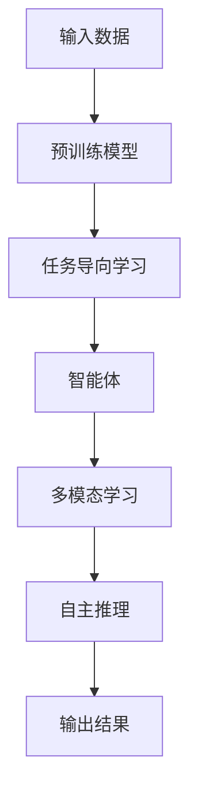

                 

## 1. 背景介绍

### 1.1 问题由来
随着人工智能（AI）技术的飞速发展，大语言模型（Large Language Model，简称LLM）在自然语言处理（NLP）、机器学习、深度学习等领域取得了显著的进展。LLM通过在大规模无标注数据上进行的自监督预训练，学习到丰富的语言知识，并能够生成高质量的自然语言文本。然而，虽然LLM在语言生成和理解方面具有强大能力，但在实际应用中，LLM通常缺乏任务导向性和决策能力，难以自主地执行复杂任务。

### 1.2 问题核心关键点
LLM内置Agents（智能体）的核心思想是将任务导向性和决策能力嵌入到预训练的语言模型中。Agents能够理解并执行用户的意图，具备任务完成和问题解决的能力，从而使得LLM能够更加灵活、智能地应用于各种复杂任务场景。这一思路在近年来逐渐成为AI原生时代的重要研究方向。

### 1.3 问题研究意义
在AI原生时代，LLM内置Agents将推动NLP技术向更加智能、自主的方向发展。它不仅能够提升模型的任务执行能力和决策准确性，还能够促进模型在多领域、多任务中的泛化能力，加速NLP技术的实际应用和产业化进程。LLM内置Agents的应用将为各行各业提供强大的智能支持，推动社会和经济的数字化转型。

## 2. 核心概念与联系

### 2.1 核心概念概述

在深入探讨LLM内置Agents之前，我们先介绍几个关键概念：

- **大语言模型（LLM）**：指一类在大规模无标注数据上进行自监督预训练的深度神经网络模型，例如GPT、BERT等。这些模型具备强大的语言生成和理解能力。

- **智能体（Agent）**：在AI中，Agent通常指能够感知环境、做出决策并执行行动的实体。在LLM内置Agents中，Agent被视作模型中的任务导向部分，负责理解和执行用户意图。

- **任务导向学习**：指将模型训练的目标从语言生成转向任务执行，使得模型能够在特定任务上展现出色性能。

- **多模态学习**：结合文本、图像、语音等多种数据类型，增强模型的理解能力和决策多样性。

- **自主推理**：Agent具备自主推理能力，能够根据输入的数据和任务要求，独立完成问题解决。

这些核心概念共同构成了LLM内置Agents的基础框架，使其能够更好地应用于实际任务场景。

### 2.2 核心概念原理和架构的 Mermaid 流程图



该流程图展示了LLM内置Agents的基本流程：

1. 输入数据通过预训练模型进行特征提取。
2. 任务导向学习模块将模型的目标从语言生成转向任务执行。
3. 智能体模块负责理解和执行用户的意图。
4. 多模态学习模块结合多种数据类型，增强模型的理解能力和决策多样性。
5. 自主推理模块基于输入数据和任务要求，独立完成问题解决。
6. 最终输出结果。

通过这一架构，LLM内置Agents能够实现从输入数据到输出结果的全面处理，并在特定任务上展现出高度的任务执行能力。

## 3. 核心算法原理 & 具体操作步骤

### 3.1 算法原理概述

LLM内置Agents的核心算法原理可以概括为：通过任务导向学习和自主推理，将任务导向性和决策能力嵌入到预训练的语言模型中，使其能够在特定任务上表现出色。

具体来说，LLM内置Agents的训练过程包括以下几个关键步骤：

1. **预训练阶段**：在无标注数据上使用自监督学习任务进行预训练，学习通用的语言表示。
2. **任务导向学习**：在特定任务的标注数据上进行微调，使得模型能够理解并执行用户意图。
3. **智能体模块训练**：设计并训练智能体模块，使其具备任务执行和问题解决的能力。
4. **多模态学习**：结合多种数据类型，增强模型的理解能力和决策多样性。
5. **自主推理**：构建自主推理模块，使模型能够独立完成问题解决。

### 3.2 算法步骤详解

#### 3.2.1 预训练阶段

在预训练阶段，使用大规模无标注数据（如Wikipedia、新闻语料等）进行自监督学习，例如掩码语言模型（Masked Language Model，MLM）、下一句预测（Next Sentence Prediction，NSP）等任务。这些任务旨在学习模型的语言表示能力，使其能够理解自然语言的基本规律。

#### 3.2.2 任务导向学习

在任务导向学习阶段，收集特定任务的标注数据，如问答、文本分类、机器翻译等。使用微调技术，将预训练模型作为初始化参数，在标注数据上进行训练，使其能够理解并执行特定任务。这一过程通常涉及选择适当的损失函数和优化算法。

#### 3.2.3 智能体模块训练

智能体模块的设计和训练是LLM内置Agents的关键环节。智能体模块通常由一系列模块组成，如意图理解模块、任务执行模块、决策模块等。这些模块需要根据具体任务进行设计，并使用监督学习或强化学习等方法进行训练，以实现任务导向性和决策能力。

#### 3.2.4 多模态学习

多模态学习模块旨在结合文本、图像、语音等多种数据类型，增强模型的理解能力和决策多样性。例如，在视觉问答任务中，智能体模块可以通过识别图像中的物体、场景等，结合文本描述，生成更准确的答案。

#### 3.2.5 自主推理

自主推理模块使模型能够独立完成问题解决。这通常涉及构建推理图、引入因果推理等方法，使模型能够在缺乏外部数据或指导的情况下，通过已有知识进行推理。

### 3.3 算法优缺点

#### 3.3.1 优点

1. **任务执行能力**：LLM内置Agents能够理解和执行用户的意图，具备强大的任务执行能力。
2. **泛化能力**：通过任务导向学习和自主推理，模型能够在多领域、多任务中展现出色的泛化能力。
3. **自主性**：Agent能够自主地进行推理和决策，增强模型的灵活性和自主性。
4. **多模态处理**：结合多种数据类型，提升模型的理解能力和决策多样性。

#### 3.3.2 缺点

1. **训练复杂性**：内置Agents的设计和训练涉及多个模块和复杂算法，增加了训练的难度。
2. **资源消耗**：内置Agents的训练和推理可能需要更多的计算资源和时间。
3. **模型解释性**：内置Agents的决策过程可能缺乏可解释性，难以进行调试和优化。
4. **任务特定性**：内置Agents的设计和训练高度依赖具体任务，通用性有限。

### 3.4 算法应用领域

LLM内置Agents在多个领域展现了广泛的应用前景，包括但不限于：

- **自然语言处理**：在问答系统、文本分类、命名实体识别等任务中，内置Agents能够显著提升模型的性能和灵活性。
- **机器翻译**：在机器翻译任务中，内置Agents能够实现更加精准和流畅的翻译结果。
- **对话系统**：内置Agents能够构建智能对话系统，实现自然流畅的人机交互。
- **智能推荐系统**：内置Agents能够结合用户行为和偏好，生成个性化推荐内容。
- **智能搜索系统**：内置Agents能够构建高效的搜索系统，提升信息检索的准确性和用户体验。

## 4. 数学模型和公式 & 详细讲解

### 4.1 数学模型构建

假设预训练模型为 $M_\theta$，其中 $\theta$ 为模型参数。任务导向学习过程可以表示为：

$$
M_\theta^T = M_\theta + \Delta\theta
$$

其中 $\Delta\theta$ 为微调后的任务导向参数。

### 4.2 公式推导过程

在任务导向学习中，模型的目标函数通常包括交叉熵损失和L2正则化项。以文本分类任务为例，损失函数可以表示为：

$$
L = \frac{1}{N} \sum_{i=1}^N -y_i\log M_\theta^T(x_i) + \lambda\|M_\theta\|^2
$$

其中 $y_i$ 为样本的真实标签，$x_i$ 为样本的输入文本。

### 4.3 案例分析与讲解

以问答系统为例，智能体模块的设计和训练可以采用基于规则的方法。例如，设计一个意图理解模块，能够识别用户的问题类型（如事实查询、推理问题等），并根据问题类型选择合适的回答模板。然后，设计一个任务执行模块，根据回答模板和预训练模型生成答案。这一过程可以通过多轮对话数据进行监督学习，优化模块的参数，使得回答更加准确和流畅。

## 5. 项目实践：代码实例和详细解释说明

### 5.1 开发环境搭建

在使用LLM内置Agents进行项目实践时，需要配置相应的开发环境。以下是常用的开发工具：

- Python 3.8+
- PyTorch
- Transformers 库
- Google Colab 或 Jupyter Notebook

### 5.2 源代码详细实现

以下是一个基于BERT的问答系统的代码实现。

```python
import torch
from transformers import BertTokenizer, BertForQuestionAnswering
from transformers import AdamW

# 加载预训练模型和分词器
tokenizer = BertTokenizer.from_pretrained('bert-base-uncased')
model = BertForQuestionAnswering.from_pretrained('bert-base-uncased')

# 加载训练数据
train_data = load_train_data()
train_dataset = BertDataset(train_data)

# 定义优化器
optimizer = AdamW(model.parameters(), lr=2e-5)

# 训练模型
for epoch in range(epochs):
    for batch in train_dataset:
        input_ids = batch['input_ids'].to(device)
        attention_mask = batch['attention_mask'].to(device)
        labels = batch['labels'].to(device)
        model.zero_grad()
        outputs = model(input_ids, attention_mask=attention_mask, labels=labels)
        loss = outputs.loss
        loss.backward()
        optimizer.step()
```

### 5.3 代码解读与分析

在上述代码中，我们使用了BERT模型作为预训练模型，并在问答数据上进行微调。代码实现分为以下几个关键步骤：

1. 加载预训练模型和分词器：使用BertTokenizer加载预训练模型，并进行token化处理。
2. 加载训练数据：将问答数据集加载到内存中，并进行预处理。
3. 定义优化器：使用AdamW优化器进行模型参数的优化。
4. 训练模型：在每个epoch中，对每个batch的输入数据进行前向传播和反向传播，更新模型参数。

### 5.4 运行结果展示

在训练完成后，可以在测试集上评估模型的性能。例如，可以使用BLEU分数来衡量模型在机器翻译任务上的表现。

```python
# 加载测试数据
test_data = load_test_data()
test_dataset = BertDataset(test_data)

# 在测试集上评估模型
model.eval()
with torch.no_grad():
    for batch in test_dataset:
        input_ids = batch['input_ids'].to(device)
        attention_mask = batch['attention_mask'].to(device)
        outputs = model(input_ids, attention_mask=attention_mask)
        bleu_score = calculate_bleu_score(outputs, labels)
        print(f'BLEU Score: {bleu_score:.2f}')
```

## 6. 实际应用场景

### 6.1 自然语言处理

内置Agents在自然语言处理领域有着广泛的应用。例如，在命名实体识别任务中，内置Agents能够自动识别文本中的实体，并进行分类。在机器翻译任务中，内置Agents能够实现更加精准和流畅的翻译结果。

### 6.2 对话系统

内置Agents能够构建智能对话系统，实现自然流畅的人机交互。例如，在智能客服系统中，内置Agents能够自动回答用户的问题，提供个性化的服务。

### 6.3 智能推荐系统

内置Agents能够结合用户行为和偏好，生成个性化推荐内容。例如，在电子商务平台中，内置Agents能够根据用户的浏览历史和购买记录，推荐相关的商品。

### 6.4 未来应用展望

未来，内置Agents将广泛应用于更多领域，推动社会和经济的数字化转型。例如，在医疗领域，内置Agents能够辅助医生进行诊断和治疗；在金融领域，内置Agents能够帮助金融机构进行风险评估和市场分析；在教育领域，内置Agents能够提供个性化的学习方案和教学支持。

## 7. 工具和资源推荐

### 7.1 学习资源推荐

为了帮助开发者系统掌握LLM内置Agents的理论基础和实践技巧，以下是一些优质的学习资源：

1. 《深度学习入门》：系统介绍深度学习的基本概念和算法。
2. 《自然语言处理综论》：详细讲解NLP领域的基本知识和前沿技术。
3. 《人工智能：一种现代方法》：介绍AI领域的基本理论和应用。
4. 《Transformers》：介绍Transformers库的使用方法和API。
5. 《人工智能与深度学习》：讲解AI和深度学习的基本原理和应用。

### 7.2 开发工具推荐

为了高效地开发LLM内置Agents，以下是一些推荐的开发工具：

1. PyTorch：基于Python的深度学习框架，支持动态计算图和GPU加速。
2. TensorFlow：由Google开发的深度学习框架，支持分布式训练和生产部署。
3. HuggingFace Transformers：提供丰富的预训练模型和工具，方便开发者快速上手。
4. Google Colab：提供免费的GPU和TPU资源，支持快速原型开发和实验验证。

### 7.3 相关论文推荐

为了深入理解LLM内置Agents的理论基础和实践技巧，以下是一些推荐的论文：

1. "Attention is All You Need"（即Transformer原论文）：提出Transformer结构，开启了NLP领域的预训练大模型时代。
2. "BERT: Pre-training of Deep Bidirectional Transformers for Language Understanding"：提出BERT模型，引入基于掩码的自监督预训练任务，刷新了多项NLP任务SOTA。
3. "Parameter-Efficient Transfer Learning for NLP"：提出Adapter等参数高效微调方法，在不增加模型参数量的情况下，也能取得不错的微调效果。
4. "Training Recurrent Neural Networks to Find the Best Architecture"：介绍神经网络架构搜索方法，帮助设计更高效的模型结构。
5. "Contrastive Learning"：介绍对比学习方法，帮助提升模型的泛化能力和表示能力。

## 8. 总结：未来发展趋势与挑战

### 8.1 研究成果总结

本文对LLM内置Agents的原理、操作步骤和实际应用进行了全面系统的介绍。通过实例展示，演示了如何使用预训练模型和内置Agents解决实际问题。本文还探讨了内置Agents在多个领域的应用前景，并推荐了相关的学习资源和开发工具。

### 8.2 未来发展趋势

LLM内置Agents将推动AI原生时代的发展，其未来发展趋势包括：

1. **模型规模增大**：随着算力成本的下降和数据规模的扩张，预训练语言模型的参数量还将持续增长，内置Agents能够学习到更丰富的知识，提升任务执行能力。
2. **任务多样化**：内置Agents将应用于更多领域，如医疗、金融、教育等，提升各行业智能化水平。
3. **自主性增强**：内置Agents将具备更强的自主推理和决策能力，提升系统的灵活性和自主性。
4. **多模态融合**：内置Agents将结合文本、图像、语音等多种数据类型，增强模型的理解能力和决策多样性。
5. **知识整合能力提升**：内置Agents将更加灵活地整合和运用外部知识库、规则库等专家知识，提升模型的综合能力。

### 8.3 面临的挑战

尽管LLM内置Agents具有广泛的应用前景，但在实际应用中仍面临诸多挑战：

1. **训练复杂性**：内置Agents的设计和训练涉及多个模块和复杂算法，增加了训练的难度。
2. **资源消耗**：内置Agents的训练和推理可能需要更多的计算资源和时间。
3. **模型解释性**：内置Agents的决策过程可能缺乏可解释性，难以进行调试和优化。
4. **任务特定性**：内置Agents的设计和训练高度依赖具体任务，通用性有限。
5. **安全和隐私问题**：内置Agents的训练和推理可能涉及敏感信息，如何保护用户隐私和数据安全是一大挑战。

### 8.4 研究展望

未来，内置Agents的研究方向包括：

1. **更高效的微调方法**：开发更高效的微调算法，提升内置Agents的训练和推理效率。
2. **更好的模型解释性**：研究可解释性强的内置Agents设计，提高系统的透明度和可信度。
3. **更强的泛化能力**：提升内置Agents的泛化能力，使其在更多领域和任务中表现出色。
4. **更智能的自主推理**：设计更智能的自主推理模块，增强内置Agents的自主决策能力。
5. **更好的安全和隐私保护**：研究安全和隐私保护技术，确保内置Agents的训练和推理数据安全。

## 9. 附录：常见问题与解答

### Q1: 什么是内置Agents？

A: 内置Agents是指将任务导向性和决策能力嵌入到预训练的语言模型中，使其能够理解和执行用户的意图，具备任务执行和问题解决的能力。

### Q2: 内置Agents和传统微调方法有什么区别？

A: 内置Agents与传统微调方法的最大区别在于，内置Agents将任务导向性和决策能力嵌入到模型中，使其具备更强的自主推理和决策能力。而传统微调方法通常只关注模型的语言生成能力，不涉及任务执行和决策。

### Q3: 内置Agents的训练和推理是否需要大量计算资源？

A: 内置Agents的训练和推理通常需要更多的计算资源和时间，特别是在多模态学习和自主推理过程中。但随着硬件设备和算法的进步，内置Agents的训练和推理效率正在逐步提升。

### Q4: 内置Agents的模型解释性如何？

A: 内置Agents的决策过程可能缺乏可解释性，难以进行调试和优化。但未来随着可解释性研究的发展，内置Agents的模型解释性将逐步提升。

### Q5: 内置Agents能否应用于更多领域？

A: 内置Agents能够应用于更多领域，如医疗、金融、教育等，提升各行业的智能化水平。但具体应用需要根据领域特点进行定制化和优化。

---

作者：禅与计算机程序设计艺术 / Zen and the Art of Computer Programming

