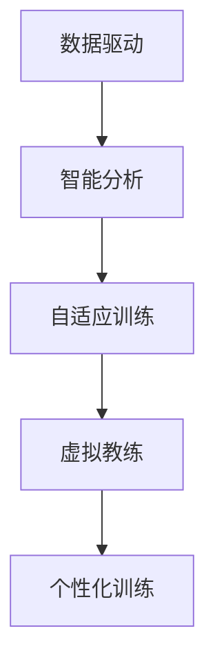

                 

# AI在个性化运动训练中的应用：优化训练效果

> 关键词：AI，个性化训练，运动科学，健康管理，数据驱动，机器学习，深度学习，大数据

## 1. 背景介绍

### 1.1 问题由来
在当前科技迅猛发展的背景下，运动训练已成为提升人们身体健康、提高生活质量的重要途径。然而，传统运动训练方法往往缺乏个性化，难以兼顾每个个体的具体情况，导致训练效果不佳、受伤风险增加等问题。近年来，随着人工智能技术的快速崛起，基于AI的运动训练变得愈发重要。通过AI技术，可以对训练者进行实时监测与分析，制定个性化的训练计划，显著提升训练效果，降低运动伤害。

### 1.2 问题核心关键点
AI在个性化运动训练中的应用，主要集中在以下几个方面：

- **数据驱动：**利用生物传感器、可穿戴设备收集运动数据，通过大数据分析，获取个性化训练方案。
- **智能分析：**使用机器学习和深度学习技术，对数据进行深度分析，识别训练者运动模式、能量消耗、肌肉疲劳等信息。
- **自适应训练：**根据训练者的实时数据和反馈，动态调整训练计划，确保训练效果和安全性。
- **虚拟教练：**构建AI虚拟教练，实时指导运动训练，增加训练乐趣和效果。

### 1.3 问题研究意义
研究AI在个性化运动训练中的应用，对于提升运动训练的科学性和有效性、促进健康管理和预防运动伤害具有重要意义：

- **提升训练效果：**根据个人情况定制训练计划，显著提升运动效果和训练速度。
- **预防运动伤害：**通过实时监测，及时调整训练强度和节奏，减少运动伤害。
- **提高生活质量：**使运动训练更加有趣和高效，增加长期坚持运动的动力。
- **推动健康产业发展：**促进智能穿戴设备、智能健身设备的研发，推动健康科技行业发展。

## 2. 核心概念与联系

### 2.1 核心概念概述

为更好地理解AI在个性化运动训练中的应用，本节将介绍几个密切相关的核心概念：

- **AI：**人工智能，指计算机系统在执行特定任务时表现出的智能行为，包括机器学习、深度学习、自然语言处理等子领域。
- **个性化训练：**根据个人特点（如体质、体能、兴趣爱好等）定制的训练方案，提升训练效果和运动体验。
- **运动科学：**研究人体运动规律、训练方法、运动效果的科学，旨在提供科学、安全的运动训练指导。
- **数据驱动：**通过收集和分析数据，以数据为基础驱动决策和改进，提升运动训练的科学性和效率。
- **自适应训练：**训练系统根据训练者实时反馈，动态调整训练方案，提高训练的针对性和效果。
- **虚拟教练：**通过AI技术构建的虚拟教练，实时指导训练，增加运动乐趣和效率。

这些核心概念之间的逻辑关系可以通过以下Mermaid流程图来展示：



这个流程图展示了一个从数据到训练的完整流程：通过数据驱动，智能分析数据，动态自适应调整训练方案，最终实现个性化训练。

## 3. 核心算法原理 & 具体操作步骤
### 3.1 算法原理概述

AI在个性化运动训练中的核心算法原理基于机器学习和大数据分析技术。其主要流程包括以下几个关键步骤：

1. **数据收集：**通过生物传感器、可穿戴设备等，收集训练者的运动数据，如心率、步频、运动轨迹等。
2. **特征提取：**对收集到的数据进行预处理和特征提取，包括时间序列分析、心率变异性分析、步态分析等。
3. **模型训练：**利用机器学习和深度学习算法，训练模型以预测训练者的运动模式、能量消耗、肌肉疲劳等关键指标。
4. **个性化训练：**根据模型预测结果和训练者的反馈，动态调整训练强度、频率和内容，实现个性化训练。
5. **效果评估：**定期评估训练效果，及时调整训练方案，确保训练目标的达成。

### 3.2 算法步骤详解

以下将详细介绍AI在个性化运动训练中的主要算法步骤：

**Step 1: 数据收集与预处理**

数据收集是个性化训练的基础，主要通过以下设备：

- **生物传感器：**用于监测心率、血氧饱和度等生理指标，如心率监测器、血氧监测器等。
- **可穿戴设备：**如智能手表、健身追踪器，用于监测步频、步幅、运动轨迹等。
- **运动摄像机：**用于实时记录运动视频，分析动作姿态和运动模式。

预处理包括：

- **数据清洗：**去除异常值和噪声，确保数据质量。
- **数据归一化：**将不同传感器和设备收集的数据统一到相同的时间轴上，并进行归一化处理。
- **特征提取：**利用时序分析、傅里叶变换、小波变换等方法提取时间序列特征，如心率变异性、步态特征等。

**Step 2: 特征表示与建模**

特征表示是将原始数据转换为模型能够处理的数值形式，包括：

- **时序特征：**将时间序列数据转换为LSTM、GRU等模型的输入格式。
- **高维特征：**将视频数据、动作姿态等高维数据转换为特征向量，如卷积神经网络（CNN）特征提取。
- **生理特征：**将生理指标数据转换为数值形式，如心率、血氧饱和度等。

模型建模主要使用以下机器学习算法：

- **监督学习：**利用已有训练数据的标签信息，训练回归或分类模型预测运动模式、能量消耗、肌肉疲劳等指标。
- **无监督学习：**从原始数据中发现潜在模式和结构，如K-means聚类、主成分分析（PCA）等。
- **深度学习：**利用神经网络对高维数据进行建模，如卷积神经网络（CNN）、循环神经网络（RNN）等。

**Step 3: 自适应训练方案制定**

根据模型预测结果和训练者反馈，动态调整训练方案，包括：

- **训练强度：**根据模型预测的能量消耗和肌肉疲劳情况，调整训练强度。
- **训练频率：**根据训练者的恢复情况和运动状态，调整训练频率。
- **训练内容：**根据训练者的运动偏好和目标，定制个性化训练内容。

**Step 4: 效果评估与优化**

定期评估训练效果，及时调整训练方案，包括：

- **训练效果：**评估训练者各项运动指标的变化，如速度、力量、耐力等。
- **运动体验：**收集训练者的反馈，包括满意度、疲劳程度、训练乐趣等。
- **持续优化：**根据评估结果，持续优化训练方案，提升训练效果。

### 3.3 算法优缺点

AI在个性化运动训练中的应用具有以下优点：

- **高效精准：**通过数据分析和机器学习模型，实现高精度的运动分析和个性化训练。
- **灵活性高：**能够根据训练者的实时反馈，动态调整训练方案，适应不同训练者的需求。
- **用户体验好：**虚拟教练实时指导训练，增加训练乐趣和效果。
- **数据驱动：**通过大数据分析，获取科学合理的训练方案，提升训练效果。

同时，该方法也存在一些缺点：

- **数据隐私：**生物传感器和可穿戴设备收集的数据涉及个人隐私，可能面临数据泄露风险。
- **模型复杂度：**高复杂度的模型需要较长的训练时间和大量的计算资源。
- **设备依赖：**训练效果依赖于设备的质量和数据采集的准确性。
- **算法透明性：**部分算法模型，如深度学习，其内部机制较为复杂，难以解释和调试。

### 3.4 算法应用领域

AI在个性化运动训练中的应用涵盖多个领域，包括：

- **智能健身：**基于AI的运动训练平台，如MyFitnessPal、Fitbit等，提供个性化训练方案。
- **运动康复：**通过AI分析运动数据，帮助运动受伤者恢复训练，减少再受伤风险。
- **职业运动：**为运动员提供个性化训练计划，提升竞技水平和运动表现。
- **健康管理：**在家庭、社区中普及AI运动训练，提升整体健康水平。
- **教育训练：**在学校体育课程中引入AI训练，提升学生体质和运动技能。

## 4. 数学模型和公式 & 详细讲解  
### 4.1 数学模型构建

在AI运动训练中，主要的数学模型包括线性回归、随机森林、卷积神经网络（CNN）、长短期记忆网络（LSTM）等。这里以LSTM为例，介绍AI在个性化运动训练中的应用。

**LSTM模型**：用于处理时间序列数据，能够有效捕捉时间依赖性。LSTM的内部结构包括输入门、遗忘门、输出门，通过门控机制控制信息流动，提高模型预测的准确性。

### 4.2 公式推导过程

LSTM模型的数学公式如下：

$$
h_t = \sigma(W_{h}h_{t-1} + U_{x}x_t + b_h)
$$

$$
i_t = \sigma(W_{i}h_{t-1} + U_{x}x_t + b_i)
$$

$$
f_t = \sigma(W_{f}h_{t-1} + U_{x}x_t + b_f)
$$

$$
o_t = \sigma(W_{o}h_{t-1} + U_{x}x_t + b_o)
$$

$$
c_t = f_t \otimes c_{t-1} + i_t \otimes \tanh(W_{c}h_{t-1} + U_{x}x_t + b_c)
$$

$$
h_t = o_t \otimes \tanh(c_t)
$$

其中，$h_t$表示当前时间步的状态，$x_t$表示输入向量，$c_t$表示当前时间步的细胞状态，$i_t$、$f_t$、$o_t$表示门控机制的控制信号，$W$、$U$表示权重矩阵，$\otimes$表示向量点乘，$\tanh$表示双曲正切函数，$\sigma$表示sigmoid函数。

**LSTM模型的训练过程**：
1. **前向传播**：将输入数据输入LSTM模型，计算当前时间步的状态和预测值。
2. **反向传播**：计算模型预测值与实际标签的误差，使用梯度下降等优化算法更新模型参数。
3. **参数更新**：根据优化算法更新权重矩阵和偏置项，完成模型训练。

### 4.3 案例分析与讲解

以跑步训练为例，使用LSTM模型进行个性化训练：

**数据准备**：收集跑步者的步频、步幅、时间、心率等数据，转换为时间序列格式。

**特征提取**：提取跑步者的步频、步幅、时间、心率等特征，作为LSTM的输入。

**模型训练**：使用训练集数据，训练LSTM模型预测跑步者的运动模式和能量消耗。

**自适应训练**：根据LSTM模型的预测结果和跑步者的反馈，调整训练强度和频率。

**效果评估**：评估跑步者的运动效果，如速度、距离、能量消耗等。

## 5. 项目实践：代码实例和详细解释说明
### 5.1 开发环境搭建

在进行AI运动训练开发前，需要先搭建开发环境。以下是使用Python进行开发的环境配置流程：

1. 安装Python：确保安装最新版本的Python，建议使用Anaconda或Miniconda进行环境管理。

2. 安装相关库：
```bash
pip install numpy pandas scikit-learn tensorflow keras tensorflow-addons openpyxl gym gym-super
```

3. 准备数据：收集运动数据，包括步频、步幅、时间、心率等，并转换为时间序列格式。

### 5.2 源代码详细实现

以下以跑步训练为例，使用TensorFlow实现LSTM模型的代码：

```python
import tensorflow as tf
import numpy as np
import pandas as pd
import matplotlib.pyplot as plt
from sklearn.model_selection import train_test_split
from tensorflow.keras.models import Sequential
from tensorflow.keras.layers import LSTM, Dense, Dropout
from gym import Environment, DiscreteEnv

# 加载数据
data = pd.read_csv('running_data.csv')

# 数据预处理
data['time'] = pd.to_datetime(data['time'])
data.set_index('time', inplace=True)
data = data.resample('15min').mean()

# 提取特征
features = data[['step_freq', 'step_length', 'heart_rate']].T
labels = data['energy_consumption'].values

# 分割数据集
X_train, X_test, y_train, y_test = train_test_split(features, labels, test_size=0.2, random_state=42)

# 构建LSTM模型
model = Sequential()
model.add(LSTM(64, input_shape=(features.shape[1], 1)))
model.add(Dense(1))
model.compile(optimizer='adam', loss='mse')

# 训练模型
model.fit(X_train, y_train, epochs=50, batch_size=32, validation_data=(X_test, y_test))

# 评估模型
test_loss = model.evaluate(X_test, y_test)
print('Test loss:', test_loss)

# 使用模型进行预测
test_data = features.head(1)
predicted_energy = model.predict(test_data)
print('Predicted energy:', predicted_energy)

# 绘制训练效果图
plt.plot(X_train[0], y_train, label='Actual')
plt.plot(X_train[0], predicted_energy, label='Predicted')
plt.legend()
plt.show()
```

### 5.3 代码解读与分析

**数据准备**：
- `pd.read_csv`：从CSV文件中读取跑步数据。
- `pd.to_datetime`：将时间戳转换为日期时间格式。
- `pd.resample`：将数据按照时间间隔进行重采样，生成每15分钟一次的平均值。
- `features`：提取步频、步幅、心率等特征。
- `labels`：获取运动消耗能量。

**模型训练**：
- `Sequential`：创建序列模型。
- `LSTM`：添加LSTM层，设置隐藏层大小。
- `Dense`：添加全连接层，设置输出维度。
- `model.compile`：编译模型，指定优化器和损失函数。
- `model.fit`：训练模型，设置训练轮数、批大小等参数。
- `model.evaluate`：评估模型，返回测试集损失值。

**使用模型进行预测**：
- `model.predict`：使用训练好的模型进行预测。
- `predicted_energy`：获取预测的能量消耗。

**训练效果图绘制**：
- `plt.plot`：绘制实际值和预测值。
- `plt.legend`：添加图例。
- `plt.show`：显示图形。

## 6. 实际应用场景
### 6.1 智能健身

智能健身是AI在个性化运动训练中的重要应用场景之一。通过AI技术，智能健身设备能够实时监测用户的运动数据，分析用户的运动状态，提供个性化的训练建议和反馈。例如，智能跑步机、智能骑行机等设备，可以根据用户的运动数据，自动调整训练强度和频率，确保训练效果和安全性。

### 6.2 运动康复

运动康复是AI在个性化运动训练中的另一个重要应用场景。AI技术可以帮助运动受伤者进行科学康复训练，减少再受伤风险。例如，通过分析受伤者的运动数据，AI可以生成个性化的康复训练计划，实时监控受伤者的训练效果，调整训练强度和频率。

### 6.3 职业运动

职业运动员需要通过科学训练来提升竞技水平和运动表现。AI技术可以为运动员提供个性化的训练方案，帮助其优化训练效果。例如，通过分析运动员的历史数据和比赛表现，AI可以预测比赛结果，调整训练强度和内容，确保运动员在最佳状态参赛。

### 6.4 未来应用展望

AI在个性化运动训练中的应用前景广阔，未来将进一步发展：

- **多模态数据融合**：未来将结合视觉、听觉等多种模态数据，提升运动分析和个性化训练的效果。
- **实时反馈系统**：通过AI技术，构建实时反馈系统，及时调整训练方案，提升训练效果。
- **个性化推荐系统**：根据用户的运动偏好和目标，提供个性化的训练建议和内容，提升用户体验。
- **跨领域应用**：将AI技术应用到更多领域，如医疗康复、教育训练等，提升整体健康水平和运动能力。

## 7. 工具和资源推荐
### 7.1 学习资源推荐

为了帮助开发者系统掌握AI在个性化运动训练中的应用，这里推荐一些优质的学习资源：

1. **《Python深度学习》书籍**：由Francois Chollet所著，全面介绍了使用TensorFlow进行深度学习开发的技术。
2. **DeepLearning.AI课程**：由Andrew Ng教授主导的深度学习课程，涵盖深度学习的基础理论和实践技能。
3. **Kaggle比赛**：参加Kaggle数据科学竞赛，提升数据处理和机器学习技能。
4. **Coursera课程**：提供各类机器学习和深度学习课程，如《机器学习基础》《深度学习专项课程》等。
5. **GitHub代码库**：搜索相关项目，学习他人实现的经验和技术。

### 7.2 开发工具推荐

高效的开发离不开优秀的工具支持。以下是几款用于AI运动训练开发的常用工具：

1. **TensorFlow**：由Google主导的深度学习框架，生产部署方便，适合大规模工程应用。
2. **PyTorch**：由Facebook主导的开源深度学习框架，灵活性高，适合研究性开发。
3. **Keras**：高层次的神经网络API，易于上手，适合快速原型开发。
4. **Jupyter Notebook**：强大的交互式开发环境，支持Python、R等多种语言。
5. **Google Colab**：免费的在线Jupyter Notebook环境，支持GPU和TPU算力，方便快速迭代实验。

### 7.3 相关论文推荐

AI在个性化运动训练中的应用近年来吸引了广泛关注，以下是几篇奠基性的相关论文，推荐阅读：

1. **"Deep Learning for Action Recognition"**：2012年，Alex Krizhevsky等人发表的论文，提出卷积神经网络（CNN），开启了深度学习在计算机视觉中的应用。
2. **"Long Short-Term Memory"**：1997年，Sepp Hochreiter等人发表的论文，提出长短期记忆网络（LSTM），用于处理时间序列数据。
3. **"Dynamic Time Warping for Action Recognition"**：2006年，Benjamin Bhatia等人发表的论文，提出动态时间规整（DTW）方法，用于时间序列数据的相似性匹配。
4. **"Efficient Multimodal Action Recognition using LSTM and Hierarchical Temporal Pooling"**：2016年，Jianwen Xiao等人发表的论文，提出多模态LSTM模型，用于运动数据的多模态融合。
5. **"Predicting Energy Expenditure from Wearable Data"**：2018年，Alejandro Arjona-Medina等人发表的论文，提出使用机器学习模型预测运动能量消耗。

## 8. 总结：未来发展趋势与挑战
### 8.1 总结

本文对AI在个性化运动训练中的应用进行了全面系统的介绍。首先阐述了AI技术在个性化训练中的核心概念和应用场景，明确了AI技术在提升训练效果、预防运动伤害方面的独特价值。其次，从原理到实践，详细讲解了AI在个性化训练中的数学模型和关键步骤，给出了完整的代码实例。同时，本文还广泛探讨了AI在智能健身、运动康复、职业运动等多个行业领域的应用前景，展示了AI技术的广阔前景。最后，本文精选了AI运动训练的各类学习资源，力求为读者提供全方位的技术指引。

通过本文的系统梳理，可以看到，AI技术在个性化运动训练中的应用前景广阔，极大地提升了运动训练的科学性和有效性，促进了健康管理和预防运动伤害。未来，伴随AI技术的不断进步，个性化运动训练必将在更广阔的领域中发挥重要作用，为人类健康和运动水平的提升做出更大的贡献。

### 8.2 未来发展趋势

展望未来，AI在个性化运动训练中的应用将呈现以下几个发展趋势：

- **多模态融合**：未来将结合视觉、听觉、运动等多模态数据，提升运动分析和个性化训练的效果。
- **实时反馈系统**：通过AI技术，构建实时反馈系统，及时调整训练方案，提升训练效果。
- **个性化推荐系统**：根据用户的运动偏好和目标，提供个性化的训练建议和内容，提升用户体验。
- **跨领域应用**：将AI技术应用到更多领域，如医疗康复、教育训练等，提升整体健康水平和运动能力。
- **个性化虚拟教练**：构建AI虚拟教练，实时指导运动训练，增加运动乐趣和效果。

以上趋势凸显了AI技术在个性化运动训练中的巨大潜力。这些方向的探索发展，必将进一步提升运动训练的科学性和有效性，为人类健康和运动水平的提升做出更大的贡献。

### 8.3 面临的挑战

尽管AI在个性化运动训练中的应用已经取得了显著成果，但在迈向更加智能化、普适化应用的过程中，它仍面临诸多挑战：

- **数据隐私**：生物传感器和可穿戴设备收集的数据涉及个人隐私，可能面临数据泄露风险。
- **模型复杂度**：高复杂度的模型需要较长的训练时间和大量的计算资源。
- **设备依赖**：训练效果依赖于设备的质量和数据采集的准确性。
- **算法透明性**：部分算法模型，如深度学习，其内部机制较为复杂，难以解释和调试。
- **跨领域适应性**：AI技术在特定领域的适应性还需进一步提升。

### 8.4 研究展望

面对AI在个性化运动训练中所面临的挑战，未来的研究需要在以下几个方面寻求新的突破：

- **数据隐私保护**：开发隐私保护算法，保护用户数据隐私。
- **模型高效性**：探索高效模型架构，降低计算资源消耗。
- **设备标准化**：推动设备标准化，提升数据采集的准确性。
- **算法透明性**：提升算法透明性，增加模型的可解释性。
- **跨领域适应性**：增强AI技术在多领域的适应性，提升其在不同场景下的应用效果。

这些研究方向将使AI在个性化运动训练中发挥更大的作用，推动AI技术在健康和运动领域的广泛应用。

## 9. 附录：常见问题与解答
----------------------------------------------------------------

**Q1: 如何选择合适的LSTM模型参数？**

A: 选择LSTM模型参数时，需要考虑以下几个方面：
- **隐藏层大小**：通常选择64、128等偶数大小的隐藏层。
- **训练轮数**：根据数据集大小和复杂度，选择合适的训练轮数。
- **批次大小**：通常选择32、64等大小的批次。
- **优化器**：选择合适的优化器，如Adam、SGD等。

**Q2: 在训练过程中如何进行模型调参？**

A: 模型调参主要包括以下步骤：
- **超参数选择**：选择学习率、批大小、优化器等超参数。
- **网格搜索**：在超参数空间中进行网格搜索，寻找最优参数组合。
- **交叉验证**：使用交叉验证方法，评估模型的泛化能力。
- **学习率调整**：通过学习率调整策略，如学习率衰减、学习率增加等，优化训练过程。

**Q3: 如何处理数据不平衡问题？**

A: 数据不平衡问题可以通过以下方法解决：
- **重采样**：对少数类数据进行重采样，增加样本数量。
- **欠采样**：对多数类数据进行欠采样，减少样本数量。
- **过采样**：对少数类数据进行过采样，增加样本数量。
- **数据增强**：通过数据增强方法，生成更多样化的训练数据。

**Q4: 如何评估模型的泛化能力？**

A: 评估模型泛化能力的主要方法包括：
- **交叉验证**：使用交叉验证方法，评估模型的泛化能力。
- **留出法**：将数据集分为训练集和测试集，评估模型的泛化能力。
- **自助法**：通过自助法，生成多个训练集和测试集，评估模型的泛化能力。

**Q5: 如何保护用户数据隐私？**

A: 保护用户数据隐私的主要方法包括：
- **数据加密**：对数据进行加密，防止数据泄露。
- **差分隐私**：使用差分隐私技术，保护用户隐私。
- **匿名化处理**：对数据进行匿名化处理，防止用户隐私泄露。

通过回答这些常见问题，希望能帮助开发者更好地理解和应用AI在个性化运动训练中的技术。

