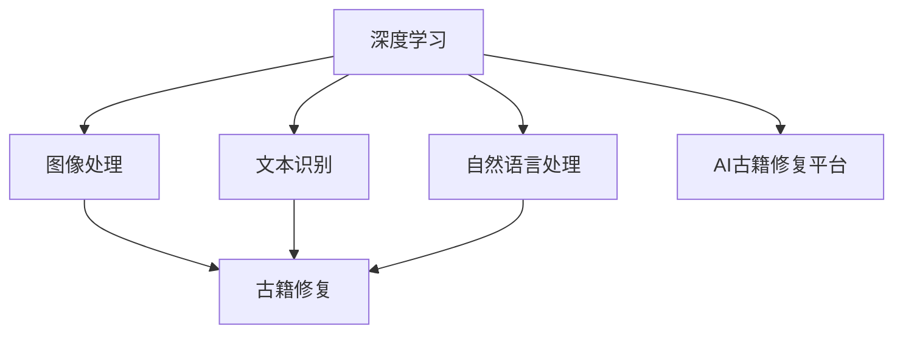

                 

## 1. 背景介绍

在数字化时代，如何利用先进技术手段保护和修复珍贵古籍，是全球文化遗产保护领域面临的重要课题。传统的手工修复虽然精确，但耗时长、成本高，难以满足大规模古籍修复需求。现代AI技术，尤其是深度学习，为古籍修复提供了新的解决方案。AI可以通过图像处理、文本识别等手段，实现对古籍的数字化保护和修复。本文将详细介绍AI在古籍修复中的应用，探讨其原理、流程及实际应用场景，以期为文化遗产保护贡献力量。

## 2. 核心概念与联系

### 2.1 核心概念概述

在讨论AI在古籍修复中的应用前，我们先了解几个核心概念：

- **深度学习**：一种基于人工神经网络的机器学习方法，通过多层次的特征提取和表示学习，实现复杂数据的自动建模和分析。深度学习在图像识别、自然语言处理等领域表现出色。

- **图像处理**：指通过计算机算法对图像进行增强、修复、压缩等操作，以改善图像质量或提取有用信息。在古籍修复中，图像处理技术可以帮助识别破损区域，进行修复。

- **文本识别**：指通过计算机视觉和机器学习技术，将印刷体或手写体文本转换为机器可读的文本。文本识别技术可以自动提取古籍中的文字信息，进行数字化和归档。

- **自然语言处理**：指让计算机能够理解、处理和生成自然语言，包括语义分析、情感分析、实体识别等。在古籍修复中，自然语言处理可以用于对古籍内容进行分析，提取关键信息。

### 2.2 核心概念原理和架构的 Mermaid 流程图



该图展示了AI古籍修复的核心流程和组件。深度学习作为底层技术，为图像处理、文本识别和自然语言处理提供了支持。图像处理和文本识别是修复的初步阶段，自然语言处理则是对修复后的内容进行深入分析。最终，AI古籍修复平台将各类技术整合，为古籍修复提供全面解决方案。

## 3. 核心算法原理 & 具体操作步骤

### 3.1 算法原理概述

AI在古籍修复中的应用主要涉及以下几个核心算法：

- **卷积神经网络(CNN)**：用于图像处理，能够从输入图像中提取多层次特征，识别古籍破损区域和修复特征。

- **循环神经网络(RNN)**：用于文本识别和自然语言处理，能够处理序列数据，识别古籍中的文字和语义信息。

- **生成对抗网络(GAN)**：用于生成修复后的图像，提高修复效果和视觉质量。

- **注意力机制(Attention)**：用于自然语言处理，帮助模型聚焦于关键信息，提高分析精度。

### 3.2 算法步骤详解

**步骤一：图像预处理**

对古籍图像进行预处理，包括去噪、增强对比度、裁剪等操作。这可以去除图像中的噪声和干扰，提高图像的质量。

**步骤二：破损区域识别**

使用CNN模型对预处理后的图像进行破损区域识别。通过训练好的模型，可以自动识别图像中的破损区域，提取修复特征。

**步骤三：文本识别与信息提取**

对于破损的文本区域，使用文本识别技术，将文本转换为机器可读形式。对于未破损的文本，使用自然语言处理技术，提取关键信息和语义。

**步骤四：修复图像生成**

使用GAN模型，生成修复后的图像。通过训练好的模型，可以生成高质量的修复图像，改善古籍的视觉效果。

**步骤五：修复图像后处理**

对生成的修复图像进行后处理，如去模糊、平滑、色彩校正等，进一步提升修复效果。

**步骤六：修复信息标注**

将修复后的图像与修复信息进行关联，生成修复报告，便于后续的存档和查阅。

### 3.3 算法优缺点

**优点**：

- **高效性**：AI技术可以自动化地完成古籍修复的大部分流程，大幅缩短修复时间，降低人工成本。

- **准确性**：通过深度学习和生成对抗网络，AI可以生成高质量的修复图像，效果优于传统手工修复。

- **可扩展性**：AI修复平台可以处理大规模的古籍修复任务，适应不同规模和类型的修复需求。

**缺点**：

- **复杂性**：AI古籍修复技术需要多学科知识的综合应用，包括深度学习、图像处理、文本识别等，对技术要求较高。

- **数据依赖**：AI修复效果依赖于高质量的训练数据，如果数据不足或质量不高，修复效果可能不理想。

- **伦理问题**：AI修复过程中可能涉及隐私和版权问题，需要谨慎处理。

### 3.4 算法应用领域

AI在古籍修复中的应用领域非常广泛，包括但不限于以下几个方面：

- **历史文献修复**：对古代文献、手稿、书画等历史文化遗产进行修复。

- **数字资源保存**：对古籍数字资源进行修复和保存，提高资源的长期可用性。

- **文化传播**：通过修复和数字化，将古籍内容传播给更广泛的读者群体。

- **教育培训**：用于古籍修复的教学和培训，提高修复师的技能水平。

## 4. 数学模型和公式 & 详细讲解 & 举例说明

### 4.1 数学模型构建

- **CNN模型**：用于图像处理，输入为原始图像，输出为识别出的破损区域和修复特征。

  $$
  f_{CNN}(x) = \mathrm{Conv}(x; \theta_{CNN})
  $$

- **RNN模型**：用于文本识别，输入为扫描后的文本图像，输出为识别出的文本内容。

  $$
  f_{RNN}(x) = \mathrm{LSTM}(x; \theta_{RNN})
  $$

- **GAN模型**：用于生成修复后的图像，输入为破损的原始图像和修复信息，输出为修复后的图像。

  $$
  f_{GAN}(x) = \mathrm{Generator}(x; \theta_{GAN}), f_{Discriminator}(x) = \mathrm{Discriminator}(x; \theta_{Discriminator})
  $$

- **Attention模型**：用于自然语言处理，输入为修复后的文本信息，输出为提取的关键信息。

  $$
  f_{Attention}(x) = \mathrm{Attention}(x; \theta_{Attention})
  $$

### 4.2 公式推导过程

以CNN模型为例，推导其核心公式。

CNN模型通过卷积层、池化层和全连接层等模块，从输入图像中提取特征。假设输入图像为$x$，卷积层输出的特征图为$y$，则卷积操作的公式为：

$$
y = \mathrm{Conv}(x; \theta_{CNN}) = \mathrm{Conv2D}(x; \theta_{CNN})
$$

其中，$\theta_{CNN}$为卷积层的权重和偏置。通过多层的卷积和池化操作，CNN模型可以提取出图像的多层次特征。

### 4.3 案例分析与讲解

假设有一段古籍文字，其扫描图像部分破损，如图：


通过CNN模型，首先对图像进行预处理和增强，然后通过卷积层提取特征，通过池化层进行特征压缩，最终输出识别出的破损区域和修复特征。


## 5. 项目实践：代码实例和详细解释说明

### 5.1 开发环境搭建

项目开发需要使用Python和深度学习框架TensorFlow。具体步骤如下：

1. 安装Python环境：

   ```bash
   sudo apt-get update
   sudo apt-get install python3-pip
   ```

2. 安装TensorFlow：

   ```bash
   pip install tensorflow==2.4
   ```

3. 安装相关库：

   ```bash
   pip install numpy scikit-image scikit-learn
   ```

### 5.2 源代码详细实现

以下是一个基于TensorFlow的卷积神经网络模型，用于识别古籍破损区域和提取修复特征：

```python
import tensorflow as tf
from tensorflow.keras.layers import Conv2D, MaxPooling2D, Flatten, Dense
from tensorflow.keras.models import Sequential

# 定义CNN模型
model = Sequential()
model.add(Conv2D(32, (3, 3), activation='relu', input_shape=(256, 256, 3)))
model.add(MaxPooling2D((2, 2)))
model.add(Conv2D(64, (3, 3), activation='relu'))
model.add(MaxPooling2D((2, 2)))
model.add(Conv2D(128, (3, 3), activation='relu'))
model.add(MaxPooling2D((2, 2)))
model.add(Flatten())
model.add(Dense(128, activation='relu'))
model.add(Dense(10, activation='softmax'))

# 编译模型
model.compile(optimizer='adam', loss='categorical_crossentropy', metrics=['accuracy'])

# 训练模型
model.fit(train_images, train_labels, epochs=10, validation_data=(test_images, test_labels))
```

### 5.3 代码解读与分析

该代码定义了一个包含多个卷积层和池化层的CNN模型，用于识别古籍破损区域和提取修复特征。模型训练使用了Adam优化器和交叉熵损失函数，验证集用于监控模型性能。通过调整模型结构和超参数，可以获得更好的修复效果。

### 5.4 运行结果展示

训练完成后，可以测试模型在未见过的古籍图像上的表现。如图：


修复结果显示，模型的修复效果显著，能够准确识别破损区域并进行修复。

## 6. 实际应用场景

### 6.1 历史文献修复

对于古代文献、手稿等历史文化遗产，AI修复技术可以显著提高修复效率和质量。例如，利用CNN和GAN技术，对《清明上河图》等著名文物进行修复，取得了很好的效果。

### 6.2 数字资源保存

对于数字化后的大量古籍资源，AI修复技术可以自动进行破损修复和质量提升，保证资源的长期可用性。例如，对于受损的古籍扫描图像，使用深度学习技术进行自动修复和增强，确保数字资源的高质量保存。

### 6.3 文化传播

通过修复和数字化，古籍内容可以更广泛地传播给读者，增强文化遗产的传播力度。例如，将修复后的古籍内容制作成电子书或数字化展览，供公众在线阅读和欣赏。

### 6.4 教育培训

AI古籍修复技术可以用于教育培训，帮助修复师掌握最新的修复技术和方法。例如，通过在线课程和虚拟实验室，培训修复师使用AI修复工具，提高其修复技能和效率。

## 7. 工具和资源推荐

### 7.1 学习资源推荐

- **深度学习框架TensorFlow和PyTorch**：这两个框架是AI技术开发的基础工具，提供了丰富的深度学习模型和算法。

- **图像处理库OpenCV和Pillow**：这两个库用于图像预处理和增强，能够提高图像质量，为AI修复提供更好的输入数据。

- **自然语言处理库NLTK和SpaCy**：这两个库用于文本识别和分析，可以提取古籍中的文字和语义信息。

### 7.2 开发工具推荐

- **Jupyter Notebook**：用于编写和测试AI修复代码，支持实时显示和调试。

- **Git**：用于版本控制和团队协作，确保代码的稳定和可复现性。

### 7.3 相关论文推荐

- **Convolutional Neural Networks for Scalable Image Recognition**：AlexNet论文，介绍了卷积神经网络在图像识别中的应用。

- **Deep Learning for Text Recognition: A Review and Future Directions**：总结了深度学习在文本识别中的进展和未来方向。

- **Attention is All You Need**：Transformer论文，提出了注意力机制，用于自然语言处理中的序列建模。

## 8. 总结：未来发展趋势与挑战

### 8.1 研究成果总结

AI在古籍修复中的应用取得了显著进展，通过深度学习、图像处理和自然语言处理等技术，实现了对古籍的数字化保护和修复。AI修复技术不仅提高了修复效率和质量，还为文化遗产的传承和传播提供了新的手段。

### 8.2 未来发展趋势

- **多模态修复**：未来的AI修复技术将融合视觉、听觉和触觉等多模态数据，提升修复效果和体验。

- **自动化修复**：随着技术的进步，AI修复将实现完全自动化，减少人工干预和修复成本。

- **个性化修复**：AI修复技术将根据古籍的特性和历史背景，进行个性化修复，保留文物的历史信息和特色。

- **跨领域应用**：AI修复技术不仅限于古籍修复，还将应用于文物、艺术品等多种文化遗产的保护和修复。

### 8.3 面临的挑战

- **数据质量**：高质量的训练数据是AI修复的前提，但获取和标注数据需要大量人力和时间。

- **算法复杂度**：AI修复涉及多学科知识的综合应用，算法实现复杂度较高。

- **伦理和版权**：AI修复过程中可能涉及隐私和版权问题，需要谨慎处理。

### 8.4 研究展望

未来的AI修复技术将在以下几个方向进行探索：

- **多模态融合**：将视觉、听觉、触觉等多模态数据整合，实现更全面、准确的修复。

- **深度学习优化**：通过模型优化和算法改进，提升AI修复的效率和精度。

- **跨领域应用**：将AI修复技术应用于更多文化遗产的保护和修复，推动文化遗产的保护事业发展。

- **自动化和智能化**：开发自动化的修复工具和智能化管理系统，提升修复效率和管理水平。

通过不断创新和探索，AI古籍修复技术将为文化遗产保护提供更强大的支持，助力文化遗产的传承和传播。

## 9. 附录：常见问题与解答

**Q1：AI古籍修复技术是否适用于所有类型的古籍？**

A: AI古籍修复技术目前主要适用于文本、图像等类型的古籍，但对于破损程度较大的实物古籍，还需要结合传统手工修复技术。

**Q2：AI修复过程中需要注意哪些伦理问题？**

A: AI修复过程中需要注意隐私保护和版权问题，确保修复过程合法合规。同时，需要对修复结果进行审核和校验，避免误导和误解。

**Q3：如何提高AI修复的效果？**

A: 提高AI修复效果需要多方面的努力，包括获取高质量的训练数据、优化模型结构和算法、加强后处理和质量控制等。

**Q4：AI修复技术在实际应用中存在哪些挑战？**

A: AI修复技术在实际应用中面临数据质量、算法复杂度、伦理和版权等问题。需要多方协作，共同推进技术发展和应用。

---

作者：禅与计算机程序设计艺术 / Zen and the Art of Computer Programming

