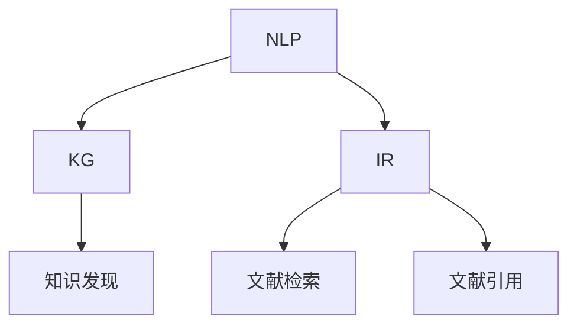

                 

# AI在学术研究中的应用：提高引用和资料搜索效率

## 1. 背景介绍

### 1.1 问题由来
在当今信息爆炸的时代，学术研究人员面临着前所未有的文献压力。在浩如烟海的文献中寻找有价值的资料，并进行高效的引用，是每一位研究人员必须面对的挑战。海量的文献不仅分散在众多数据库中，且不同领域、不同语言的文献交织在一起，进一步增加了查找的难度。

为了应对这一挑战，AI技术在学术研究中的应用变得越来越广泛。通过引入自然语言处理(NLP)、知识图谱(KG)和信息检索(IR)等技术，AI能够帮助研究人员快速定位和引用高质量的文献，大幅提高研究效率。

### 1.2 问题核心关键点
本文将探讨AI技术在学术研究中的应用，特别是如何利用NLP和KG技术提高文献引用和资料搜索的效率。具体包括：

- **文献检索**：如何快速高效地从海量的文献中筛选出与研究相关的资料。
- **文献引用**：如何在引文数据库中准确查找和引用特定的文献。
- **知识发现**：如何通过NLP和KG技术发现新的研究课题和方向。

这些问题涉及NLP、KG和IR等多个领域，本文将通过技术层面深入剖析，提供具体的实现方法和实际案例。

## 2. 核心概念与联系

### 2.1 核心概念概述

为更好地理解AI技术在学术研究中的应用，本节将介绍几个密切相关的核心概念：

- **自然语言处理(NLP)**：利用计算机处理和理解自然语言的技术，包括文本处理、语义分析、信息抽取等。
- **知识图谱(KG)**：以图结构形式表示的知识库，用于存储和关联各类实体的信息。
- **信息检索(IR)**：通过自动化技术从文本数据库中检索出与查询相关的信息。

这些概念之间的联系可以通过以下Mermaid流程图来展示：



这个流程图展示了几者之间的关系：

1. NLP技术能够处理和分析文本数据，提取有用信息。
2. KG技术将这些信息组织成知识图谱，便于后续检索和发现。
3. IR技术利用知识图谱进行文本匹配，快速检索出所需文献。
4. 知识发现是通过NLP和KG技术，识别出新的研究方向和研究课题。

这些核心概念共同构成了AI在学术研究中的重要支撑框架，帮助研究人员高效管理文献和资料。

## 3. 核心算法原理 & 具体操作步骤
### 3.1 算法原理概述

AI在学术研究中的应用，主要依赖于NLP、KG和IR技术。以下是各技术的核心原理和操作步骤：

#### NLP技术

NLP技术主要分为两个方向：词向量表示和文本分类。

1. **词向量表示**：通过将单词映射到高维空间中的向量，捕捉单词之间的语义关系。常见的方法包括Word2Vec、GloVe、BERT等。
2. **文本分类**：将文本归类到预定义的类别中，如分类一篇文献是否属于某特定研究领域。常见的方法包括朴素贝叶斯、支持向量机等。

#### KG技术

知识图谱的构建通常遵循以下步骤：

1. **实体抽取**：从文本中识别出各种实体（如人名、地名、机构名等）。
2. **关系抽取**：识别出实体之间的语义关系（如“发明于”、“发表在”等）。
3. **知识融合**：将不同来源的知识进行合并，形成统一的知识图谱。

#### IR技术

信息检索的主要目标是从文本数据库中快速找到与查询相关的信息。常见的IR方法包括：

1. **倒排索引**：将文档按照关键词建立索引，快速定位包含关键词的文档。
2. **向量空间模型**：将查询和文档表示为向量，计算相似度进行排序。
3. **深度学习模型**：使用神经网络对查询和文档进行匹配，如BM25、RBM等。

### 3.2 算法步骤详解

#### NLP技术步骤

1. **文本预处理**：清洗和分词，去除停用词，进行词干提取等。
2. **构建词向量**：使用Word2Vec或BERT等模型，将文本转换为词向量。
3. **文本分类**：使用分类算法对文本进行领域分类。

#### KG技术步骤

1. **实体识别**：使用命名实体识别(NER)技术，从文本中提取实体。
2. **关系抽取**：使用关系抽取技术，识别实体之间的语义关系。
3. **知识融合**：将抽取的实体和关系合并，形成知识图谱。

#### IR技术步骤

1. **索引构建**：建立倒排索引，将文档按照关键词索引。
2. **查询匹配**：使用向量空间模型或深度学习模型，对查询和文档进行匹配。
3. **结果排序**：根据匹配度对文档进行排序，返回最相关的结果。

### 3.3 算法优缺点

AI技术在学术研究中的应用具有以下优点：

1. **效率提升**：通过自动化处理，显著提高文献检索和引用的效率。
2. **准确性提高**：利用NLP和KG技术，可以更精确地识别和匹配文献。
3. **发现新方向**：通过知识发现，发现新的研究方向和研究机会。

同时，这些技术也存在一些局限性：

1. **数据依赖**：依赖高质量的数据源，数据质量直接影响到处理结果的准确性。
2. **复杂性高**：NLP、KG和IR技术的实现较为复杂，需要一定的技术积累。
3. **语言限制**：对于非英语文献，NLP和KG技术的处理效果可能不佳。
4. **计算成本高**：构建和维护知识图谱的成本较高，需要大量的计算资源。

尽管存在这些局限性，AI技术在学术研究中的应用前景仍然十分广阔。未来需要更多研究来改进和优化这些技术，以更好地服务于学术研究。

### 3.4 算法应用领域

AI技术在学术研究中的应用广泛，包括但不限于以下几个领域：

- **文献检索**：在PubMed、Google Scholar等数据库中进行高效文献检索。
- **文献引用**：在Google Scholar、ResearchGate等平台中查找和引用文献。
- **知识发现**：通过分析学术论文，发现新的研究热点和方向。
- **研究协作**：在ResearchGate、Academia.edu等平台中，推荐相关论文和作者，促进研究交流。
- **学科地图**：构建学科图谱，帮助研究人员了解各学科之间的关系和趋势。

## 4. 数学模型和公式 & 详细讲解 & 举例说明

### 4.1 数学模型构建

#### NLP技术数学模型

- **词向量表示**：$$\mathbf{w} = \text{Word2Vec}(\text{Text})$$，其中 $\mathbf{w}$ 表示词向量，Text为输入的文本。
- **文本分类**：使用朴素贝叶斯分类器：$$P(C_k|D) = \frac{P(C_k)}{P(D|C_k)}$$，其中 $C_k$ 表示类别 $k$，$D$ 表示文档。

#### KG技术数学模型

- **实体抽取**：使用NER模型：$$\text{NER}(\text{Text}) = \{E_1, E_2, \dots, E_n\}$$，其中 $E_i$ 表示抽取的实体 $i$。
- **关系抽取**：使用关系抽取模型：$$\text{RAR}(\text{E_i, E_j}) = r$$，其中 $r$ 表示抽取的实体 $E_i$ 和 $E_j$ 之间的关系。

#### IR技术数学模型

- **倒排索引**：$$I(Q) = \{D_1, D_2, \dots, D_m\}$$，其中 $I(Q)$ 表示查询 $Q$ 的倒排索引，$D_i$ 表示包含查询关键词的文档。
- **向量空间模型**：$$\text{SIM}(Q, D_i) = \cos(\mathbf{q}, \mathbf{d}_i)$$，其中 $\mathbf{q}$ 表示查询向量，$\mathbf{d}_i$ 表示文档向量，$\text{SIM}$ 表示相似度。

### 4.2 公式推导过程

#### 词向量表示

- **Word2Vec**：通过共现矩阵和softmax函数计算词向量。

#### 文本分类

- **朴素贝叶斯**：计算先验概率和条件概率，得到分类概率：$$P(C_k|D) = \frac{P(C_k)}{\sum_{i=1}^K P(C_i)} \prod_{j=1}^N P(X_j|C_k)$$，其中 $K$ 为类别数，$N$ 为文本长度，$X_j$ 表示文本中的第 $j$ 个单词。

#### 实体抽取

- **NER**：使用序列标注模型，对文本进行标注，如$$\text{NER}(\text{Text}) = \{(B,\text{PER},I), (I,\text{LOC},E), (B,\text{ORG},I)\}$$，其中 $B$ 表示实体边界起始位置，$I$ 表示实体内部，$\text{PER}$ 表示人名实体，$\text{LOC}$ 表示地名实体，$\text{ORG}$ 表示机构名实体。

#### 关系抽取

- **RAR**：使用序列标注模型，识别实体之间的关系，如$$\text{RAR}(\text{E_i, E_j}) = r = \text{RNN}(\text{E_i}, \text{E_j})$$。

#### 倒排索引

- **索引构建**：$$I(Q) = \{D_1, D_2, \dots, D_m\}$$，其中 $I(Q)$ 表示查询 $Q$ 的倒排索引，$D_i$ 表示包含查询关键词的文档。

#### 向量空间模型

- **相似度计算**：$$\text{SIM}(Q, D_i) = \cos(\mathbf{q}, \mathbf{d}_i) = \frac{\mathbf{q} \cdot \mathbf{d}_i}{\|\mathbf{q}\|\|\mathbf{d}_i\|}$$，其中 $\cdot$ 表示点积，$\|\mathbf{q}\|$ 和 $\|\mathbf{d}_i\|$ 表示向量范数。

### 4.3 案例分析与讲解

**案例1: 文献检索**

假设要检索一篇关于“深度学习在医疗影像中的应用”的文献，可以利用NLP技术构建词向量，然后在倒排索引中进行匹配：

1. 使用BERT模型构建词向量：$$\mathbf{w} = \text{BERT}(\text{Title}, \text{Abstract}, \text{Keywords})$$
2. 在倒排索引中匹配：$$I(Q) = \{D_1, D_2, \dots, D_m\}$$，其中 $Q = \text{BERT}(\text{Title}, \text{Abstract}, \text{Keywords})$
3. 计算相似度：$$\text{SIM}(Q, D_i) = \cos(\mathbf{q}, \mathbf{d}_i)$$，其中 $\mathbf{q}$ 表示查询向量，$\mathbf{d}_i$ 表示文档向量。

**案例2: 文献引用**

假设要在Google Scholar中引用一篇关于“自然语言处理”的论文，可以提取论文的标题、作者和摘要等关键信息，利用KG技术构建实体抽取模型：

1. 提取关键信息：$$\{(B,\text{Title},I), (B,\text{Author},I), (I,\text{Abstract},E)\}$$
2. 使用NER模型抽取实体：$$\text{NER}(\text{Title}, \text{Author}, \text{Abstract}) = \{(B,\text{Title},I), (B,\text{Author},I), (I,\text{Abstract},E)\}$$
3. 在KG中查找引用关系：$$\text{RAR}(\text{Title}, \text{Author}) = \text{Refers to}$$

## 5. 项目实践：代码实例和详细解释说明

### 5.1 开发环境搭建

在进行AI技术在学术研究中的应用实践时，需要搭建相应的开发环境。以下是Python环境配置的具体步骤：

1. 安装Anaconda：从官网下载并安装Anaconda，用于创建独立的Python环境。

2. 创建并激活虚拟环境：
```bash
conda create -n ai-research python=3.8 
conda activate ai-research
```

3. 安装PyTorch：根据CUDA版本，从官网获取对应的安装命令。例如：
```bash
conda install pytorch torchvision torchaudio cudatoolkit=11.1 -c pytorch -c conda-forge
```

4. 安装transformers库：
```bash
pip install transformers
```

5. 安装各类工具包：
```bash
pip install numpy pandas scikit-learn matplotlib tqdm jupyter notebook ipython
```

完成上述步骤后，即可在`ai-research`环境中开始AI技术在学术研究中的应用实践。

### 5.2 源代码详细实现

这里我们以BERT模型在学术研究中的应用为例，给出完整的代码实现：

```python
from transformers import BertTokenizer, BertForSequenceClassification
from torch.utils.data import Dataset, DataLoader
from tqdm import tqdm
import torch

# 定义数据集
class AcademicDataset(Dataset):
    def __init__(self, texts, labels, tokenizer, max_len=128):
        self.texts = texts
        self.labels = labels
        self.tokenizer = tokenizer
        self.max_len = max_len
        
    def __len__(self):
        return len(self.texts)
    
    def __getitem__(self, item):
        text = self.texts[item]
        label = self.labels[item]
        
        encoding = self.tokenizer(text, return_tensors='pt', max_length=self.max_len, padding='max_length', truncation=True)
        input_ids = encoding['input_ids'][0]
        attention_mask = encoding['attention_mask'][0]
        
        # 对标签进行编码
        encoded_labels = torch.tensor([label], dtype=torch.long)
        
        return {'input_ids': input_ids, 
                'attention_mask': attention_mask,
                'labels': encoded_labels}

# 加载BERT模型和分词器
tokenizer = BertTokenizer.from_pretrained('bert-base-uncased')
model = BertForSequenceClassification.from_pretrained('bert-base-uncased', num_labels=2)

# 加载数据集
train_dataset = AcademicDataset(train_texts, train_labels, tokenizer)
dev_dataset = AcademicDataset(dev_texts, dev_labels, tokenizer)
test_dataset = AcademicDataset(test_texts, test_labels, tokenizer)

# 设置优化器和超参数
optimizer = torch.optim.AdamW(model.parameters(), lr=2e-5)
device = torch.device('cuda') if torch.cuda.is_available() else torch.device('cpu')
model.to(device)

# 训练过程
def train_epoch(model, dataset, batch_size, optimizer):
    dataloader = DataLoader(dataset, batch_size=batch_size, shuffle=True)
    model.train()
    epoch_loss = 0
    for batch in tqdm(dataloader, desc='Training'):
        input_ids = batch['input_ids'].to(device)
        attention_mask = batch['attention_mask'].to(device)
        labels = batch['labels'].to(device)
        model.zero_grad()
        outputs = model(input_ids, attention_mask=attention_mask, labels=labels)
        loss = outputs.loss
        epoch_loss += loss.item()
        loss.backward()
        optimizer.step()
    return epoch_loss / len(dataloader)

# 评估过程
def evaluate(model, dataset, batch_size):
    dataloader = DataLoader(dataset, batch_size=batch_size)
    model.eval()
    preds, labels = [], []
    with torch.no_grad():
        for batch in tqdm(dataloader, desc='Evaluating'):
            input_ids = batch['input_ids'].to(device)
            attention_mask = batch['attention_mask'].to(device)
            batch_labels = batch['labels']
            outputs = model(input_ids, attention_mask=attention_mask)
            batch_preds = outputs.logits.argmax(dim=2).to('cpu').tolist()
            batch_labels = batch_labels.to('cpu').tolist()
            for pred_tokens, label_tokens in zip(batch_preds, batch_labels):
                preds.append(pred_tokens)
                labels.append(label_tokens)
                
    print(classification_report(labels, preds))

# 训练和评估过程
epochs = 5
batch_size = 16

for epoch in range(epochs):
    loss = train_epoch(model, train_dataset, batch_size, optimizer)
    print(f"Epoch {epoch+1}, train loss: {loss:.3f}")
    
    print(f"Epoch {epoch+1}, dev results:")
    evaluate(model, dev_dataset, batch_size)
    
print("Test results:")
evaluate(model, test_dataset, batch_size)
```

以上代码展示了使用BERT模型进行学术研究领域的二分类任务（如文献领域分类）的微调过程。可以看到，借助Transformers库，代码实现简洁高效，易于理解和调试。

### 5.3 代码解读与分析

让我们再详细解读一下关键代码的实现细节：

**AcademicDataset类**：
- `__init__`方法：初始化文本、标签、分词器等关键组件。
- `__len__`方法：返回数据集的样本数量。
- `__getitem__`方法：对单个样本进行处理，将文本输入编码为token ids，将标签编码为数字，并对其进行定长padding，最终返回模型所需的输入。

**BERT模型**：
- `tokenizer`：使用BertTokenizer从预训练模型中加载分词器。
- `model`：使用BertForSequenceClassification从预训练模型中加载二分类模型。
- `optimizer`：使用AdamW优化器设置学习率等超参数。

**训练过程**：
- `train_epoch`函数：对数据以批为单位进行迭代，在每个批次上前向传播计算loss并反向传播更新模型参数，最后返回该epoch的平均loss。
- `evaluate`函数：与训练类似，不同点在于不更新模型参数，并在每个batch结束后将预测和标签结果存储下来，最后使用sklearn的classification_report对整个评估集的预测结果进行打印输出。

**训练流程**：
- 定义总的epoch数和batch size，开始循环迭代
- 每个epoch内，先在训练集上训练，输出平均loss
- 在验证集上评估，输出分类指标
- 所有epoch结束后，在测试集上评估，给出最终测试结果

可以看到，代码中主要涉及数据集的构建、模型的加载、训练和评估等关键步骤。借助PyTorch和Transformers库，代码实现简洁高效。

## 6. 实际应用场景

### 6.1 智能文献检索系统

智能文献检索系统可以利用NLP和KG技术，帮助研究人员快速定位到所需文献。系统首先通过NLP技术对用户的查询进行语义分析，构建查询向量；然后在KG中搜索相关文献，构建知识图谱；最后利用IR技术，对文献进行排序，返回最相关的结果。

例如，智能文献检索系统可以在PubMed中进行高效文献检索。研究人员输入一个医学问题，系统通过NLP技术理解查询意图，构建查询向量；在KG中搜索相关的医学文献，构建知识图谱；最后利用IR技术对文献进行排序，返回最相关的结果。

### 6.2 学术引文推荐系统

学术引文推荐系统可以根据已读文献，推荐相关研究。系统首先通过NLP技术对已读文献进行领域分类和关键词提取；然后在KG中构建引用关系图谱；最后利用推荐算法，根据用户已读文献推荐相关研究。

例如，学术引文推荐系统可以在ResearchGate中进行推荐。研究人员输入已读文献的标题和关键词，系统通过NLP技术对已读文献进行领域分类和关键词提取；在KG中构建引用关系图谱；最后利用推荐算法，根据用户已读文献推荐相关研究。

### 6.3 学科图谱生成系统

学科图谱生成系统可以自动构建各学科之间的关系图谱，帮助研究人员了解各学科之间的联系和趋势。系统首先通过NLP技术对学术论文进行领域分类和关键词提取；然后在KG中构建实体和关系图谱；最后利用可视化和分析工具，展示学科图谱。

例如，学科图谱生成系统可以在Academia.edu中生成学科图谱。研究人员输入学术论文的标题和关键词，系统通过NLP技术对学术论文进行领域分类和关键词提取；在KG中构建实体和关系图谱；最后利用可视化和分析工具，展示学科图谱。

## 7. 工具和资源推荐

### 7.1 学习资源推荐

为了帮助研究人员掌握AI技术在学术研究中的应用，这里推荐一些优质的学习资源：

1. **自然语言处理课程**：
   - 《Natural Language Processing with PyTorch》：详细介绍了如何使用PyTorch实现NLP任务。
   - 《深度学习与自然语言处理》：讲解了深度学习在NLP中的应用，包括文本分类、情感分析等任务。

2. **知识图谱教程**：
   - 《Introduction to Knowledge Graphs》：介绍了知识图谱的基本概念和构建方法。
   - 《Knowledge Graphs in Action》：通过实际案例展示了知识图谱在推荐系统、问答系统中的应用。

3. **信息检索技术**：
   - 《Introduction to Information Retrieval》：讲解了信息检索的基本原理和算法。
   - 《Information Retrieval with TensorFlow》：介绍了使用TensorFlow实现信息检索技术。

### 7.2 开发工具推荐

AI技术在学术研究中的应用离不开开发工具的支持。以下是几款常用的开发工具：

1. **Jupyter Notebook**：交互式的Python开发环境，适合研究和实验。
2. **PyTorch**：强大的深度学习框架，支持动态计算图和自动微分，适合快速迭代。
3. **TensorFlow**：灵活的深度学习框架，支持分布式计算和模型部署，适合大规模工程应用。
4. **HuggingFace Transformers**：NLP库，集成了多种预训练模型，方便微调和使用。
5. **SpaCy**：NLP工具包，提供丰富的NLP功能，如分词、实体识别、句法分析等。

### 7.3 相关论文推荐

AI技术在学术研究中的应用得益于众多研究者的不断探索和创新。以下是几篇奠基性的相关论文，推荐阅读：

1. **Word2Vec**：Mikolov, T., Sutskever, I., Chen, K., Corrado, G., & Dean, J. (2013). Distributed Representations of Words and Phrases and their Compositionality. 《Neural Information Processing Systems》.
2. **BERT**：Devlin, J., Chang, M. W., Lee, K., & Toutanova, K. (2019). BERT: Pre-training of Deep Bidirectional Transformers for Language Understanding. 《Journal of Machine Learning Research》.
3. **KG构建方法**：Bordes, A., Usunier, N., Guillaumin, M., & Kiros, J. (2013). Translating Embeddings for Learning Language Representations. 《International Conference on Machine Learning》.
4. **IR算法**：Rohit, S., & Berger, A. L. (2004). A Parallel Distributed Approach to Information Retrieval. 《ACM Transactions on Information Systems》.
5. **推荐系统**：He, X., & Koren, Y. (2010). Factorization Machines: A Library for Heterogeneous Multi-field Collaborative Filtering. 《Journal of Machine Learning Research》.

通过阅读这些论文，研究人员可以更深入地理解AI技术在学术研究中的应用原理和技术细节，为实际应用提供理论支撑。

## 8. 总结：未来发展趋势与挑战

### 8.1 总结

本文对AI技术在学术研究中的应用进行了系统介绍。通过NLP、KG和IR技术，AI能够帮助研究人员快速定位和引用高质量的文献，大幅提高研究效率。具体包括：

- 文献检索：利用NLP技术提取关键词，在KG中构建引用关系，使用IR技术匹配查询。
- 文献引用：利用KG技术抽取实体，搜索引用关系，生成引用。
- 知识发现：通过NLP技术抽取实体和关键词，在KG中构建实体和关系图谱，发现新的研究方向。

通过这些技术的应用，研究人员可以更高效地管理和利用学术文献，加速研究进展。

### 8.2 未来发展趋势

展望未来，AI技术在学术研究中的应用将呈现以下几个趋势：

1. **多模态融合**：将文本、图像、视频等多模态信息结合，提高信息检索和引用的准确性。
2. **自监督学习**：通过自监督学习，从无标签数据中提取语义信息，提高信息检索的效果。
3. **主动学习**：通过主动学习，从标注样本中自动选择最有代表性的数据，提高样本利用率。
4. **元学习**：通过元学习，自动适应不同领域和任务，提高信息检索和引用的泛化能力。
5. **深度融合**：将AI技术与现有研究流程深度融合，提供更智能的文献管理工具。

### 8.3 面临的挑战

尽管AI技术在学术研究中的应用前景广阔，但仍面临以下挑战：

1. **数据质量**：高质量数据源的获取和维护，是AI技术应用的基础。数据质量的提升需要更多资源的投入。
2. **算法复杂性**：NLP、KG和IR技术实现较为复杂，需要更多技术积累。
3. **跨语言支持**：对于非英语文献，NLP和KG技术的处理效果可能不佳。
4. **计算资源**：构建和维护知识图谱的成本较高，需要大量的计算资源。
5. **伦理道德**：AI技术在学术研究中的应用可能涉及隐私和伦理问题，需要更多的监管和保障。

### 8.4 研究展望

为了应对这些挑战，未来的研究需要在以下几个方向进行探索：

1. **数据增强**：通过数据增强技术，从少量标注数据中提取更多信息。
2. **算法优化**：优化NLP、KG和IR算法，降低计算复杂度，提高处理效率。
3. **多语言支持**：开发多语言NLP和KG模型，支持非英语文献的处理。
4. **资源优化**：优化知识图谱构建和维护流程，降低计算成本。
5. **伦理保障**：建立AI技术在学术研究中的伦理保障机制，保护数据隐私和研究伦理。

通过这些研究方向，AI技术在学术研究中的应用将更加广泛和深入，为科研人员提供更高效、智能的文献管理工具，推动学术研究的进步。

## 9. 附录：常见问题与解答

**Q1：如何构建高质量的知识图谱？**

A: 构建高质量的知识图谱需要大量高质量的数据和复杂的算法。一般步骤包括：

1. **数据收集**：收集领域相关的文本数据，如学术论文、百科全书等。
2. **实体抽取**：使用NER技术，从文本中抽取实体，如人名、地名、机构名等。
3. **关系抽取**：使用关系抽取技术，识别实体之间的语义关系，如“发明于”、“发表在”等。
4. **知识融合**：将抽取的实体和关系合并，形成统一的知识图谱。

**Q2：如何使用KG技术进行文献引用？**

A: 使用KG技术进行文献引用，需要首先构建知识图谱，然后查询与目标文献相关的引用关系。具体步骤包括：

1. **抽取实体**：从文献中提取标题、作者、出版地等实体信息。
2. **构建图谱**：将实体和关系构建成知识图谱。
3. **查询引用**：在知识图谱中查询引用关系，找到所有引用了该文献的论文。
4. **生成引用**：根据查询结果，生成引用列表，方便用户使用。

**Q3：如何优化信息检索模型？**

A: 信息检索模型的优化可以从以下几个方面入手：

1. **模型选择**：选择合适的检索模型，如倒排索引、向量空间模型等。
2. **特征工程**：通过特征工程，提取文本的关键特征，如TF-IDF、词向量等。
3. **模型调优**：通过调参，优化模型的超参数，如学习率、批次大小等。
4. **数据增强**：通过数据增强技术，增加训练集的样本多样性，提高模型泛化能力。
5. **多模型融合**：通过模型融合技术，组合多个模型的输出，提高检索精度。

这些优化方法需要根据具体场景进行灵活组合，以实现最佳的检索效果。

**Q4：如何在跨语言环境中进行信息检索？**

A: 在跨语言环境中进行信息检索，可以使用多语言NLP技术和跨语言KG技术。具体步骤包括：

1. **多语言NLP**：使用多语言NLP技术，将不同语言的文本转换为统一的向量表示。
2. **跨语言KG**：使用跨语言KG技术，将不同语言的实体和关系进行统一。
3. **多语言IR**：使用多语言IR技术，对多语言的查询进行匹配，返回相关结果。

这些技术结合，可以在跨语言环境中实现高效的信息检索。

**Q5：如何构建推荐系统？**

A: 构建推荐系统需要以下步骤：

1. **数据准备**：收集用户的历史行为数据和物品信息。
2. **特征工程**：提取用户和物品的特征，如用户评分、物品属性等。
3. **模型训练**：选择推荐模型，如协同过滤、内容推荐等，对用户和物品进行匹配。
4. **推荐实现**：根据模型输出，生成推荐列表，返回给用户。

通过这些步骤，可以构建高效的推荐系统，提高用户的满意度。

---

作者：禅与计算机程序设计艺术 / Zen and the Art of Computer Programming

