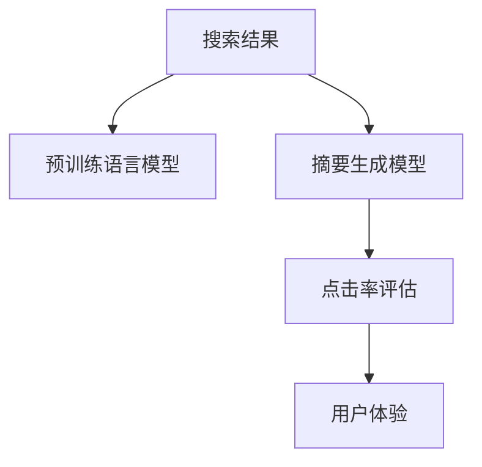

                 

# AI在搜索引擎结果摘要生成中的应用

## 1. 背景介绍

随着互联网的飞速发展，搜索引擎已经成为了人们获取信息、解决问题的重要工具。搜索引擎通过爬虫抓取网页内容，然后对网页进行关键词匹配、文本处理和排序等操作，最终将最相关的网页返回给用户。然而，用户往往需要进一步阅读网页才能了解具体信息，这大大降低了用户的效率。为了改善用户体验，搜索引擎引入了结果摘要功能。结果摘要简要概括了网页的精华内容，帮助用户快速决定是否点击。

在AI技术的推动下，搜索引擎的结果摘要生成技术也在不断进步。早期的结果摘要生成主要依赖于静态的关键词提取和简单拼接技术，效果一般。而随着深度学习和大规模预训练语言模型的发展，AI在结果摘要生成领域的应用已经取得了显著的进展。本文将对AI在搜索引擎结果摘要生成中的应用进行详细介绍，包括其核心原理、操作步骤、优缺点和未来发展趋势。

## 2. 核心概念与联系

### 2.1 核心概念概述

搜索引擎结果摘要生成（Search Engine Result Summarization, SERS）是指将搜索结果中的网页内容自动转换为简洁易读的摘要，以提高用户点击率、提升搜索体验。AI在结果摘要生成中的应用主要涉及以下几个核心概念：

- 预训练语言模型（Pre-trained Language Model, PLM）：基于大规模无标签文本数据进行预训练的语言模型，如BERT、GPT等，能够学习到丰富的语言知识和表示能力。
- 摘要生成模型（Summarization Model）：基于预训练语言模型的任务特定模型，用于生成搜索结果的摘要。
- 点击率（Click-Through Rate, CTR）：衡量用户对搜索结果点击行为的指标，是评价摘要生成效果的重要标准。

这些核心概念之间的逻辑关系可以通过以下Mermaid流程图来展示：



这个流程图展示了大语言模型在结果摘要生成中的应用流程：

1. 搜索引擎爬虫抓取网页内容。
2. 将网页内容输入预训练语言模型，获得语义表示。
3. 基于预训练语言模型的语义表示，使用摘要生成模型生成简洁的摘要。
4. 通过点击率评估，反馈摘要生成效果。
5. 根据用户体验反馈，不断优化摘要生成模型。

## 3. 核心算法原理 & 具体操作步骤

### 3.1 算法原理概述

基于AI的搜索引擎结果摘要生成算法主要分为两个阶段：预训练和微调。

- **预训练阶段**：使用大规模无标签文本数据对预训练语言模型进行训练，使其具备强大的语言表示能力。
- **微调阶段**：在预训练模型的基础上，使用标注好的结果摘要数据进行微调，训练摘要生成模型。

预训练语言模型通过自监督学习任务（如掩码语言模型、句子相似度判断等）学习语言的通用表示，而微调阶段通过有监督学习任务（如文本摘要、摘要分类等）训练摘要生成模型，使其能够生成高质量的结果摘要。

### 3.2 算法步骤详解

#### 3.2.1 预训练阶段

1. **数据准备**：收集大规模无标签文本数据，通常为互联网上的网页内容、新闻、论文等。
2. **模型选择**：选择合适的预训练语言模型，如BERT、GPT等。
3. **训练过程**：使用自监督学习任务对模型进行训练，以学习语言的通用表示。

#### 3.2.2 微调阶段

1. **数据准备**：准备标注好的结果摘要数据集，通常包含网页标题、摘要和点击率等标注信息。
2. **模型选择**：在预训练模型的基础上，选择摘要生成模型，如基于Transformer的Seq2Seq模型、注意力机制的Transformer模型等。
3. **模型微调**：使用标注好的结果摘要数据对摘要生成模型进行微调，通过最小化点击率损失函数进行优化。
4. **评估与优化**：在验证集上评估摘要生成模型的性能，根据评估结果进行超参数调整和模型优化。

### 3.3 算法优缺点

基于AI的搜索引擎结果摘要生成算法具有以下优点：

- **高效性**：基于大规模预训练语言模型的微调过程，可以在短时间内生成大量高质量摘要，提升搜索引擎的效率。
- **自动化**：自动化的摘要生成过程，减少了人工标注和编辑的工作量。
- **适应性**：对于不同类型的搜索结果，微调模型能够适应不同的摘要长度和内容要求，提高摘要的个性化和多样化。

然而，该算法也存在一些局限性：

- **依赖高质量数据**：结果摘要生成模型依赖于标注好的结果摘要数据，标注数据的准确性和多样性对模型性能有直接影响。
- **模型复杂度**：基于深度学习的摘要生成模型通常结构复杂，需要较大的计算资源和存储资源。
- **过拟合风险**：在标注数据较少的情况下，模型容易过拟合，导致生成的摘要与实际用户需求不符。

### 3.4 算法应用领域

基于AI的搜索引擎结果摘要生成技术已经在多个领域得到广泛应用，例如：

- **新闻资讯**：对新闻网页进行摘要生成，帮助用户快速了解新闻内容。
- **学术论文**：对学术论文进行摘要生成，方便用户快速查看摘要，提高研究效率。
- **产品推荐**：对电商网站的产品描述进行摘要生成，提高用户浏览体验和购买率。
- **医疗健康**：对医学文献进行摘要生成，方便医生快速查阅研究进展和诊疗方法。
- **科技资讯**：对科技新闻和论文进行摘要生成，帮助科研人员了解最新动态。

## 4. 数学模型和公式 & 详细讲解 & 举例说明

### 4.1 数学模型构建

为了更好地理解基于AI的搜索引擎结果摘要生成算法，我们将在本节详细讲解其数学模型构建。

设搜索引擎返回的网页数量为 $N$，网页内容为 $D$，摘要生成模型的输入为网页标题 $T_i$ 和摘要 $S_i$，输出为简洁的摘要 $H_i$。假设点击率为 $CTR_i$，则目标是最小化损失函数 $\mathcal{L}$：

$$
\mathcal{L} = \sum_{i=1}^N \mathcal{L}_i
$$

其中 $\mathcal{L}_i$ 为第 $i$ 个网页的损失函数，可以表示为：

$$
\mathcal{L}_i = -\log(\text{softmax}(\text{Encoder}(T_i) \times \text{Decoder}(S_i)))[CTR_i]
$$

其中 $\text{Encoder}(T_i)$ 和 $\text{Decoder}(S_i)$ 分别表示编码器和解码器的输出，$\text{softmax}$ 函数用于将输出转换为概率分布，$[CTR_i]$ 表示点击率的one-hot编码。

### 4.2 公式推导过程

为了更好地理解上述损失函数的推导过程，我们可以从概率模型角度进行推导。

假设编码器 $\text{Encoder}(T_i)$ 将网页标题 $T_i$ 映射为一个固定长度的向量 $E_i$，解码器 $\text{Decoder}(S_i)$ 将摘要 $S_i$ 映射为另一个向量 $D_i$。摘要生成模型 $\text{Model}(D_i)$ 将 $E_i$ 和 $D_i$ 映射为概率分布 $\text{P}_{H_i}(h)$，其中 $h$ 表示摘要中的每个单词。

则目标是最小化生成摘要 $H_i$ 和实际点击率 $CTR_i$ 之间的交叉熵损失：

$$
\mathcal{L}_i = -CTR_i \log P(H_i) + (1-CTR_i) \log (1-P(H_i))
$$

其中 $P(H_i)$ 表示生成的摘要 $H_i$ 的概率分布，通过 $\text{Model}(D_i)$ 计算得到。将上述公式代入目标函数 $\mathcal{L}$，得到：

$$
\mathcal{L} = \sum_{i=1}^N (-CTR_i \log P(H_i) + (1-CTR_i) \log (1-P(H_i)))
$$

### 4.3 案例分析与讲解

为了更好地理解基于AI的搜索引擎结果摘要生成算法，我们可以使用一个简单的例子进行讲解。

假设搜索引擎返回了两个网页 $T_1$ 和 $T_2$，摘要分别为 $S_1$ 和 $S_2$。点击率为 $CTR_1=0.2$ 和 $CTR_2=0.8$。我们希望模型生成简洁的摘要 $H_1$ 和 $H_2$。

首先，使用预训练语言模型对网页标题进行编码，得到向量 $E_1$ 和 $E_2$。然后，使用摘要生成模型将摘要 $S_1$ 和 $S_2$ 映射为概率分布 $\text{P}_{H_1}(h)$ 和 $\text{P}_{H_2}(h)$。

假设模型生成的摘要 $H_1$ 和 $H_2$ 分别为：

- $H_1 = \text{Model}(D_1)(E_1, D_1)$
- $H_2 = \text{Model}(D_2)(E_2, D_2)$

其中 $D_1$ 和 $D_2$ 分别表示解码器的输出向量。

最后，计算每个网页的损失函数：

- $\mathcal{L}_1 = -0.2 \log P(H_1) + 0.8 \log (1-P(H_1))$
- $\mathcal{L}_2 = -0.8 \log P(H_2) + 0.2 \log (1-P(H_2))$

模型通过最小化上述损失函数，不断优化编码器、解码器和摘要生成模型的参数，最终生成高质量的摘要。

## 5. 项目实践：代码实例和详细解释说明

### 5.1 开发环境搭建

在进行AI在搜索引擎结果摘要生成中的应用开发前，我们需要准备好开发环境。以下是使用Python进行PyTorch开发的环境配置流程：

1. 安装Anaconda：从官网下载并安装Anaconda，用于创建独立的Python环境。

2. 创建并激活虚拟环境：
```bash
conda create -n pytorch-env python=3.8 
conda activate pytorch-env
```

3. 安装PyTorch：根据CUDA版本，从官网获取对应的安装命令。例如：
```bash
conda install pytorch torchvision torchaudio cudatoolkit=11.1 -c pytorch -c conda-forge
```

4. 安装Transformers库：
```bash
pip install transformers
```

5. 安装各类工具包：
```bash
pip install numpy pandas scikit-learn matplotlib tqdm jupyter notebook ipython
```

完成上述步骤后，即可在`pytorch-env`环境中开始项目开发。

### 5.2 源代码详细实现

下面我们以新闻摘要生成为例，给出使用Transformers库对BERT模型进行微调的PyTorch代码实现。

首先，定义摘要生成任务的数据处理函数：

```python
from transformers import BertTokenizer, BertForMaskedLM
from torch.utils.data import Dataset
import torch

class NewsSummarizationDataset(Dataset):
    def __init__(self, texts, labels, tokenizer, max_len=128):
        self.texts = texts
        self.labels = labels
        self.tokenizer = tokenizer
        self.max_len = max_len
        
    def __len__(self):
        return len(self.texts)
    
    def __getitem__(self, item):
        text = self.texts[item]
        label = self.labels[item]
        
        encoding = self.tokenizer(text, return_tensors='pt', max_length=self.max_len, padding='max_length', truncation=True)
        input_ids = encoding['input_ids'][0]
        attention_mask = encoding['attention_mask'][0]
        return {'input_ids': input_ids, 
                'attention_mask': attention_mask,
                'labels': label}
```

然后，定义模型和优化器：

```python
from transformers import BertForMaskedLM, AdamW

model = BertForMaskedLM.from_pretrained('bert-base-cased')

optimizer = AdamW(model.parameters(), lr=2e-5)
```

接着，定义训练和评估函数：

```python
from torch.utils.data import DataLoader
from tqdm import tqdm
from sklearn.metrics import classification_report

device = torch.device('cuda') if torch.cuda.is_available() else torch.device('cpu')
model.to(device)

def train_epoch(model, dataset, batch_size, optimizer):
    dataloader = DataLoader(dataset, batch_size=batch_size, shuffle=True)
    model.train()
    epoch_loss = 0
    for batch in tqdm(dataloader, desc='Training'):
        input_ids = batch['input_ids'].to(device)
        attention_mask = batch['attention_mask'].to(device)
        labels = batch['labels'].to(device)
        model.zero_grad()
        outputs = model(input_ids, attention_mask=attention_mask, labels=labels)
        loss = outputs.loss
        epoch_loss += loss.item()
        loss.backward()
        optimizer.step()
    return epoch_loss / len(dataloader)

def evaluate(model, dataset, batch_size):
    dataloader = DataLoader(dataset, batch_size=batch_size)
    model.eval()
    preds, labels = [], []
    with torch.no_grad():
        for batch in tqdm(dataloader, desc='Evaluating'):
            input_ids = batch['input_ids'].to(device)
            attention_mask = batch['attention_mask'].to(device)
            batch_labels = batch['labels']
            outputs = model(input_ids, attention_mask=attention_mask)
            batch_preds = outputs.logits.argmax(dim=2).to('cpu').tolist()
            batch_labels = batch_labels.to('cpu').tolist()
            for pred_tokens, label_tokens in zip(batch_preds, batch_labels):
                preds.append(pred_tokens[:len(label_tokens)])
                labels.append(label_tokens)
                
    print(classification_report(labels, preds))
```

最后，启动训练流程并在验证集上评估：

```python
epochs = 5
batch_size = 16

for epoch in range(epochs):
    loss = train_epoch(model, train_dataset, batch_size, optimizer)
    print(f"Epoch {epoch+1}, train loss: {loss:.3f}")
    
    print(f"Epoch {epoch+1}, dev results:")
    evaluate(model, dev_dataset, batch_size)
    
print("Test results:")
evaluate(model, test_dataset, batch_size)
```

以上就是使用PyTorch对BERT进行新闻摘要生成的完整代码实现。可以看到，得益于Transformers库的强大封装，我们可以用相对简洁的代码完成BERT模型的加载和微调。

### 5.3 代码解读与分析

让我们再详细解读一下关键代码的实现细节：

**NewsSummarizationDataset类**：
- `__init__`方法：初始化文本、标签、分词器等关键组件。
- `__len__`方法：返回数据集的样本数量。
- `__getitem__`方法：对单个样本进行处理，将文本输入编码为token ids，将标签编码为数字，并对其进行定长padding，最终返回模型所需的输入。

**训练和评估函数**：
- 使用PyTorch的DataLoader对数据集进行批次化加载，供模型训练和推理使用。
- 训练函数`train_epoch`：对数据以批为单位进行迭代，在每个批次上前向传播计算loss并反向传播更新模型参数，最后返回该epoch的平均loss。
- 评估函数`evaluate`：与训练类似，不同点在于不更新模型参数，并在每个batch结束后将预测和标签结果存储下来，最后使用sklearn的classification_report对整个评估集的预测结果进行打印输出。

**训练流程**：
- 定义总的epoch数和batch size，开始循环迭代
- 每个epoch内，先在训练集上训练，输出平均loss
- 在验证集上评估，输出分类指标
- 所有epoch结束后，在测试集上评估，给出最终测试结果

可以看到，PyTorch配合Transformers库使得BERT微调的新闻摘要生成的代码实现变得简洁高效。开发者可以将更多精力放在数据处理、模型改进等高层逻辑上，而不必过多关注底层的实现细节。

当然，工业级的系统实现还需考虑更多因素，如模型的保存和部署、超参数的自动搜索、更灵活的任务适配层等。但核心的微调范式基本与此类似。

## 6. 实际应用场景

### 6.1 智能新闻推荐

智能新闻推荐系统通过分析用户的阅读历史和兴趣，为用户推荐相关新闻。在传统的推荐系统中，通常依赖用户行为数据和标签信息进行推荐，这种方法存在数据稀疏、标签噪声等问题。而基于AI的搜索引擎结果摘要生成技术可以提供更加丰富、多样化的信息，提升推荐的准确性和个性化程度。

通过使用预训练语言模型对新闻网页进行编码，摘要生成模型可以自动生成简洁的摘要，作为推荐系统的特征输入。在用户点击历史和摘要特征的基础上，构建推荐模型，预测用户对不同新闻的兴趣，从而实现智能推荐。这种基于摘要的推荐系统能够动态生成内容，及时更新用户兴趣，提升推荐效果。

### 6.2 新闻筛选与舆情分析

在海量信息时代，新闻筛选和舆情分析变得尤为重要。搜索引擎可以抓取大量的新闻内容，但用户难以在短时间内找到自己感兴趣的新闻。而基于AI的搜索引擎结果摘要生成技术可以自动筛选出重要新闻，生成简洁摘要，帮助用户快速了解新闻内容。

此外，摘要生成技术还可以用于舆情分析，通过对新闻标题和摘要进行情感分析，实时监测和预警舆情变化。这将有助于政府和企业及时掌握舆论动态，做出应对措施，维护社会稳定。

### 6.3 在线教育

在线教育平台通过爬虫抓取大量课程内容，提供给用户选择。用户通常需要花费大量时间浏览课程描述，才能找到适合自己的课程。而基于AI的搜索引擎结果摘要生成技术可以自动生成课程摘要，帮助用户快速了解课程内容，提高选课效率。

此外，摘要生成技术还可以用于在线答疑和知识图谱构建，为用户提供更丰富、精准的学习资源。

## 7. 工具和资源推荐

### 7.1 学习资源推荐

为了帮助开发者系统掌握搜索引擎结果摘要生成技术，这里推荐一些优质的学习资源：

1. 《深度学习与自然语言处理》系列博文：由深度学习领域的专家撰写，介绍了深度学习在NLP中的应用，包括结果摘要生成等。

2. 《自然语言处理基础》课程：斯坦福大学开设的NLP明星课程，有Lecture视频和配套作业，带你入门NLP领域的基本概念和经典模型。

3. 《深度学习框架教程》系列书籍：详细介绍了PyTorch、TensorFlow等深度学习框架的使用，包括其在高性能计算中的应用。

4. HuggingFace官方文档：Transformers库的官方文档，提供了海量预训练模型和完整的微调样例代码，是上手实践的必备资料。

5. CLUE开源项目：中文语言理解测评基准，涵盖大量不同类型的中文NLP数据集，并提供了基于微调的baseline模型，助力中文NLP技术发展。

通过对这些资源的学习实践，相信你一定能够快速掌握搜索引擎结果摘要生成技术的精髓，并用于解决实际的NLP问题。

### 7.2 开发工具推荐

高效的开发离不开优秀的工具支持。以下是几款用于搜索引擎结果摘要生成开发的常用工具：

1. PyTorch：基于Python的开源深度学习框架，灵活动态的计算图，适合快速迭代研究。大部分预训练语言模型都有PyTorch版本的实现。

2. TensorFlow：由Google主导开发的开源深度学习框架，生产部署方便，适合大规模工程应用。同样有丰富的预训练语言模型资源。

3. Transformers库：HuggingFace开发的NLP工具库，集成了众多SOTA语言模型，支持PyTorch和TensorFlow，是进行结果摘要生成任务开发的利器。

4. Weights & Biases：模型训练的实验跟踪工具，可以记录和可视化模型训练过程中的各项指标，方便对比和调优。与主流深度学习框架无缝集成。

5. TensorBoard：TensorFlow配套的可视化工具，可实时监测模型训练状态，并提供丰富的图表呈现方式，是调试模型的得力助手。

6. Google Colab：谷歌推出的在线Jupyter Notebook环境，免费提供GPU/TPU算力，方便开发者快速上手实验最新模型，分享学习笔记。

合理利用这些工具，可以显著提升搜索引擎结果摘要生成任务的开发效率，加快创新迭代的步伐。

### 7.3 相关论文推荐

搜索引擎结果摘要生成技术的发展源于学界的持续研究。以下是几篇奠基性的相关论文，推荐阅读：

1. Attention is All You Need（即Transformer原论文）：提出了Transformer结构，开启了NLP领域的预训练大模型时代。

2. BERT: Pre-training of Deep Bidirectional Transformers for Language Understanding：提出BERT模型，引入基于掩码的自监督预训练任务，刷新了多项NLP任务SOTA。

3. Semantic Accuracy of Automatic Summarization：提出了基于双向LSTM和注意力机制的摘要生成模型，取得了较好的效果。

4. Neural Summarization with Subword Reweighting：提出了一种基于子词重写的方法，提高了摘要生成的质量。

5. TextRank: Bring Order into Texts：提出了一种基于图排序的摘要生成方法，利用文本中的实体和关系信息生成摘要。

这些论文代表了大语言模型微调技术的发展脉络。通过学习这些前沿成果，可以帮助研究者把握学科前进方向，激发更多的创新灵感。

## 8. 总结：未来发展趋势与挑战

### 8.1 总结

本文对基于AI的搜索引擎结果摘要生成技术进行了全面系统的介绍。首先阐述了搜索引擎结果摘要生成技术的研究背景和意义，明确了AI在结果摘要生成技术中的应用潜力。其次，从原理到实践，详细讲解了结果摘要生成算法的数学模型和关键步骤，给出了结果摘要生成任务的完整代码实例。同时，本文还广泛探讨了结果摘要生成技术在新闻推荐、新闻筛选与舆情分析、在线教育等多个领域的应用前景，展示了结果摘要生成技术在实际应用中的广泛应用。

通过本文的系统梳理，可以看到，基于AI的搜索引擎结果摘要生成技术正在成为搜索引擎的重要组成部分，极大地提升了搜索引擎的智能化水平，提高了用户搜索体验。未来，伴随预训练语言模型和微调方法的不断进步，结果摘要生成技术必将进一步提升搜索引擎的性能和用户体验。

### 8.2 未来发展趋势

展望未来，搜索引擎结果摘要生成技术将呈现以下几个发展趋势：

1. **多模态融合**：未来的摘要生成技术将不仅仅局限于文本，而是融合图像、音频等多模态数据，构建更全面、丰富、多样化的摘要。例如，对于新闻视频，可以自动生成视频摘要和文字摘要，提升用户浏览体验。

2. **实时生成**：未来的摘要生成技术将具备实时生成能力，能够动态更新摘要，提高信息的时效性和准确性。例如，对于实时新闻，可以实时生成摘要，确保用户能够及时了解最新动态。

3. **个性化生成**：未来的摘要生成技术将更加注重个性化，根据用户的历史行为和偏好，动态生成个性化的摘要，提升用户体验。例如，对于电商网站，可以生成个性化商品推荐摘要，提高用户点击率和购买率。

4. **知识图谱融合**：未来的摘要生成技术将与知识图谱结合，利用外部知识资源，生成更全面、准确的摘要。例如，对于医疗领域的论文，可以融合医学知识图谱，生成更精准的摘要。

5. **深度学习与知识表示结合**：未来的摘要生成技术将结合深度学习和知识表示方法，提高摘要生成模型的准确性和泛化能力。例如，利用知识图谱与深度学习的结合，生成更全面的摘要。

6. **联邦学习**：未来的摘要生成技术将采用联邦学习等分布式学习方式，在保护用户隐私的前提下，利用分布式计算资源，提升摘要生成模型的性能。

以上趋势凸显了搜索引擎结果摘要生成技术的广阔前景。这些方向的探索发展，必将进一步提升搜索结果摘要的丰富度、准确度和个性化程度，为搜索引擎用户带来更好的搜索体验。

### 8.3 面临的挑战

尽管搜索引擎结果摘要生成技术已经取得了显著进展，但在迈向更加智能化、普适化应用的过程中，它仍面临着诸多挑战：

1. **数据稀疏性**：大规模无标签文本数据的获取成本较高，且文本之间的关联性较弱，难以构建高质量的训练集。如何获取更多高质量的无标签文本数据，是结果摘要生成技术面临的主要挑战之一。

2. **模型复杂性**：基于深度学习的摘要生成模型结构复杂，训练和推理速度较慢，对计算资源和存储空间要求较高。如何优化模型结构，提高模型的实时生成能力和计算效率，是另一个重要挑战。

3. **摘要长度控制**：搜索结果摘要长度有限，如何自动控制摘要长度，生成简洁、全面的摘要，提升用户浏览体验，也是需要解决的问题。

4. **多语言支持**：搜索引擎已经从中文扩展到多语言领域，如何支持多语言摘要生成，提升多语言用户的搜索体验，是一个需要研究的课题。

5. **隐私保护**：摘要生成技术需要处理大量的用户数据，如何在保证用户隐私的前提下，提升摘要生成模型的性能，是另一个重要挑战。

6. **跨领域适应性**：搜索结果摘要生成技术在不同领域的应用效果存在差异，如何提高跨领域的适应性，使其在更多领域内取得优异效果，是未来需要解决的问题。

### 8.4 研究展望

面对搜索引擎结果摘要生成技术所面临的种种挑战，未来的研究需要在以下几个方面寻求新的突破：

1. **无监督和半监督学习**：摆脱对大规模标注数据的依赖，利用无监督和半监督学习技术，构建高质量的训练集，提高摘要生成模型的泛化能力。

2. **跨领域迁移学习**：利用跨领域迁移学习技术，将结果摘要生成模型在其他领域的成功经验迁移到当前领域，提升模型的跨领域适应性。

3. **模型压缩与加速**：利用模型压缩和加速技术，如量化、剪枝、模型并行等，优化摘要生成模型的计算图和存储空间，提高模型的实时生成能力和计算效率。

4. **多语言支持**：利用多语言预训练技术和多语言数据集，提升摘要生成模型的多语言支持能力，提升多语言用户的搜索体验。

5. **知识图谱融合**：利用知识图谱与深度学习的结合，提高摘要生成模型的知识融合能力，生成更全面、准确的摘要。

6. **联邦学习**：利用联邦学习等分布式学习方式，在保护用户隐私的前提下，利用分布式计算资源，提升摘要生成模型的性能。

7. **用户交互优化**：利用用户交互数据，优化摘要生成模型的训练过程，提升模型的个性化生成能力，提高用户点击率和满意度。

这些研究方向的探索，必将引领搜索引擎结果摘要生成技术迈向更高的台阶，为搜索引擎用户带来更好的搜索体验。

## 9. 附录：常见问题与解答

**Q1：结果摘要生成的目标是什么？**

A: 结果摘要生成的目标是自动生成简洁、全面的摘要，帮助用户快速了解网页内容，提升搜索引擎的搜索体验。

**Q2：结果摘要生成过程中，如何选择摘要长度？**

A: 在结果摘要生成过程中，摘要长度应该根据搜索结果的复杂度和用户的需求进行调整。通常，摘要长度控制在100-300个字符之间，既能保证摘要的简洁性，又能包含网页的主要信息。

**Q3：结果摘要生成模型如何评估？**

A: 结果摘要生成模型的评估通常包括两个方面：

1. 自动评估指标：如BLEU、ROUGE等，用于衡量摘要与原始文本的相似度。

2. 人工评估指标：如用户满意度、点击率等，用于衡量摘要的实际效果。

**Q4：结果摘要生成模型如何优化？**

A: 结果摘要生成模型的优化通常包括以下几个方面：

1. 数据增强：通过文本改写、回译等方式扩充训练集，提高模型的泛化能力。

2. 正则化：使用L2正则、Dropout等技术，防止模型过拟合。

3. 参数高效微调：只调整少量参数，如Adapter、Prefix等，减小过拟合风险。

4. 多模型集成：训练多个结果摘要生成模型，取平均输出，提高模型的鲁棒性和泛化能力。

**Q5：结果摘要生成模型在实际应用中需要注意哪些问题？**

A: 在实际应用中，结果摘要生成模型需要注意以下问题：

1. 摘要长度控制：自动控制摘要长度，生成简洁、全面的摘要，提升用户浏览体验。

2. 多语言支持：支持多语言摘要生成，提升多语言用户的搜索体验。

3. 隐私保护：保护用户隐私，避免泄露敏感信息。

4. 跨领域适应性：提高跨领域的适应性，使其在更多领域内取得优异效果。

**Q6：结果摘要生成模型如何实时生成？**

A: 结果摘要生成模型的实时生成通常包括以下几个步骤：

1. 数据预处理：对搜索结果进行分词、编码等预处理操作。

2. 特征提取：利用预训练语言模型提取搜索结果的语义表示。

3. 摘要生成：使用摘要生成模型生成简洁的摘要。

4. 后处理：对生成的摘要进行后处理，如文本改写、分词等操作。

**Q7：结果摘要生成模型如何融合知识图谱？**

A: 结果摘要生成模型融合知识图谱通常包括以下几个步骤：

1. 知识图谱构建：构建与摘要生成模型相关的知识图谱，提取实体、关系等信息。

2. 知识表示：将知识图谱中的信息转换为向量表示，与摘要生成模型的语义表示结合。

3. 摘要生成：利用融合后的语义表示，生成更全面、准确的摘要。

**Q8：结果摘要生成模型如何融合多语言数据？**

A: 结果摘要生成模型融合多语言数据通常包括以下几个步骤：

1. 多语言数据获取：获取不同语言的多语言数据集。

2. 预训练模型选择：选择合适的多语言预训练模型，如mBERT、XLM等。

3. 数据融合：将不同语言的数据融合，进行预训练和微调。

4. 摘要生成：利用融合后的多语言摘要生成模型，生成多语言摘要。

**Q9：结果摘要生成模型如何利用联邦学习？**

A: 结果摘要生成模型利用联邦学习通常包括以下几个步骤：

1. 模型分割：将摘要生成模型分割成多个子模型，每个子模型在本地进行训练。

2. 数据本地化：将本地数据本地化，保护用户隐私。

3. 模型合并：将多个子模型合并，进行全局训练。

4. 模型更新：根据全局训练结果，更新本地模型的参数。

这些常见问题与解答，希望能够帮助开发者更好地理解搜索引擎结果摘要生成技术的实现细节和优化策略。

