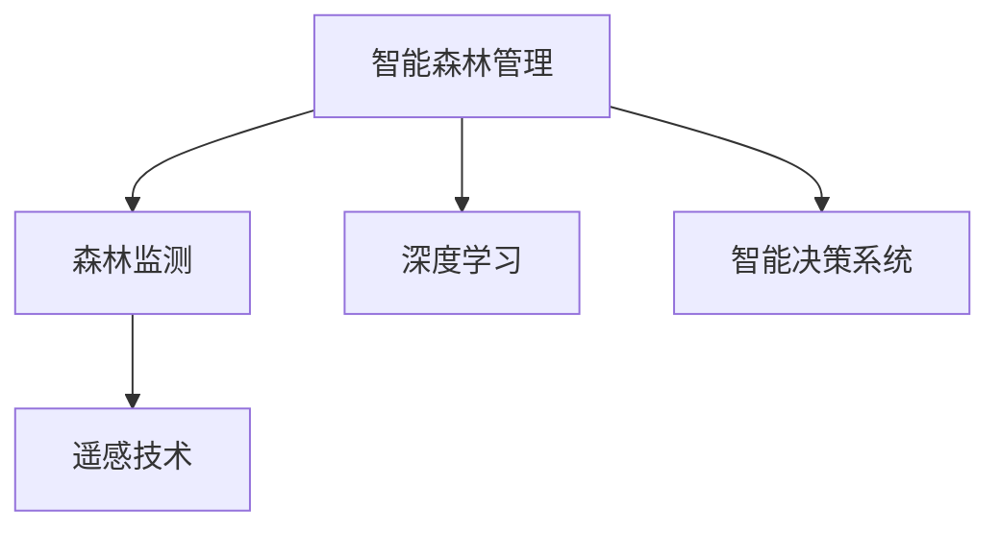

                 

# AI在智能森林管理中的应用：防止滥伐

> 关键词：智能森林管理, 森林监测, 遥感技术, 深度学习, 智能决策系统, 森林覆盖率预测, 数据驱动决策

## 1. 背景介绍

### 1.1 问题由来

随着全球气候变化、工业化进程的加速，森林资源的过度开发和滥伐问题日益严重，导致全球森林覆盖率持续下降，生态系统失衡。森林不仅是生物多样性的宝库，还对碳吸收、水循环、气候调节等环境功能起到至关重要的作用。

森林滥伐不仅直接影响了生态系统的稳定性和生物多样性，还加剧了全球气候变化，带来严重的生态和经济损失。防止森林滥伐、推动森林资源的可持续管理，成为全球环境保护的迫切需求。

### 1.2 问题核心关键点

森林管理的核心在于如何通过科技手段，实时监测森林状况，精准识别滥伐行为，及时采取管理措施。目前，森林监测主要依靠传统的人类巡查和卫星遥感数据，但这些方法效率低、成本高、时效性差，难以全面覆盖。

AI技术，尤其是深度学习和大数据处理技术，为森林管理带来了新的可能性。利用AI，可以从大量的遥感数据、地面监测数据中提取丰富的信息，构建智能决策系统，提升森林监测和管理的智能化水平。

本文将介绍一种基于深度学习技术构建的智能森林监测系统，并详细阐述其核心算法、模型构建、以及应用场景。通过AI技术，可以有效提高森林监测效率，降低滥伐风险，实现森林的智能、可持续管理。

## 2. 核心概念与联系

### 2.1 核心概念概述

为更好地理解AI在智能森林管理中的应用，本节将介绍几个密切相关的核心概念：

- **智能森林管理**：利用AI和大数据分析技术，实现森林资源的自动化监测、智能化管理。
- **森林监测**：通过遥感、地面监测等技术，实时获取森林覆盖率、植被健康、滥伐行为等数据。
- **深度学习**：一种基于神经网络的人工智能技术，通过大量数据训练，实现图像识别、语音识别、自然语言处理等任务。
- **遥感技术**：利用卫星、无人机等手段，获取高精度的遥感影像，实时监测森林状况。
- **智能决策系统**：基于数据驱动的决策模型，自动分析和预测森林状况，提供管理建议。

这些核心概念之间的逻辑关系可以通过以下Mermaid流程图来展示：



这个流程图展示了大语言模型的核心概念及其之间的关系：

1. 智能森林管理通过深度学习、遥感技术和智能决策系统，实现森林的自动化、智能化管理。
2. 森林监测是智能森林管理的基础，通过遥感技术实时获取森林数据。
3. 深度学习技术能够从遥感数据中提取丰富的信息，提升森林监测的准确性。
4. 智能决策系统通过深度学习构建的模型，自动分析森林状况，提供管理建议。

这些概念共同构成了智能森林管理的框架，使其能够实现森林的精准管理和有效保护。

## 3. 核心算法原理 & 具体操作步骤
### 3.1 算法原理概述

基于AI的森林智能管理系统，核心算法原理主要包括深度学习模型构建、遥感数据分析、以及智能决策模型的训练与应用。其基本流程如下：

1. **数据收集与预处理**：收集遥感影像、地面监测数据、历史遥感数据等，预处理为模型训练所需格式。
2. **模型训练**：使用深度学习模型训练森林监测和预测模型。
3. **实时监测**：将实时遥感数据输入模型，实时监测森林覆盖率、植被健康、滥伐行为等指标。
4. **智能决策**：根据实时监测结果，自动生成管理建议，及时预警和应对滥伐行为。

深度学习模型在森林管理中的应用，主要集中在图像分类、目标检测、预测建模等领域。通过训练深度学习模型，可以从遥感影像中识别出森林覆盖区、砍伐区等关键区域，实时监测森林资源的变化情况，预测未来的森林覆盖率等指标。

### 3.2 算法步骤详解

以下是AI在智能森林管理中的具体操作步骤：

**Step 1: 数据收集与预处理**
- 收集遥感影像数据、地面监测数据、历史遥感数据等。
- 对遥感影像进行校正、增强、裁剪等预处理，提高数据质量。
- 使用地理信息系统(GIS)技术，将数据标注为森林覆盖区、砍伐区等分类标签。

**Step 2: 模型训练**
- 选择合适深度学习模型，如卷积神经网络(CNN)、区域卷积神经网络(R-CNN)等。
- 在标注好的数据集上进行模型训练，调整超参数，优化模型性能。
- 使用交叉验证等方法评估模型性能，确保模型泛化能力。

**Step 3: 实时监测**
- 收集实时遥感数据，如卫星影像、无人机影像等。
- 对实时数据进行预处理，输入训练好的模型，输出森林覆盖率、植被健康等指标。
- 利用智能决策系统，对监测结果进行分析，及时生成管理建议。

**Step 4: 智能决策**
- 构建智能决策模型，如集成学习、决策树、支持向量机等。
- 将监测结果输入决策模型，生成森林管理建议，如禁伐区域、重点巡查区域等。
- 实时预警系统，及时通知相关管理部门，采取应对措施。

### 3.3 算法优缺点

基于AI的森林智能管理系统具有以下优点：
1. **高效监测**：AI模型可以从遥感数据中提取海量信息，实时监测森林覆盖率、植被健康等指标，减少人工巡查成本。
2. **精准识别**：深度学习模型能够自动识别出森林中的砍伐行为，提高监测准确性和效率。
3. **智能决策**：基于数据驱动的决策模型，自动分析森林状况，提供科学的管理建议。
4. **可扩展性**：AI系统可以轻松扩展到其他地理区域，提升森林管理系统的覆盖范围。

同时，该方法也存在一定的局限性：
1. **数据依赖**：系统的准确性和效果高度依赖于数据质量和标注精度。
2. **技术门槛**：深度学习和遥感技术的应用需要一定的专业知识和技能，门槛较高。
3. **数据隐私**：需要保护遥感数据的隐私和安全性，避免数据泄露和滥用。

尽管存在这些局限性，但AI技术在森林管理中的应用，已经成为提升森林监测和保护效率的重要手段。未来相关研究的重点在于如何进一步降低技术门槛，提高数据质量，提升系统的可扩展性和鲁棒性。

### 3.4 算法应用领域

基于AI的智能森林管理系统，已经在全球多个国家和地区得到了广泛应用，覆盖了从森林监测到智能决策的各个环节：

- **森林覆盖率预测**：使用深度学习模型预测未来森林覆盖率的变化趋势，为森林管理提供科学依据。
- **植被健康评估**：通过遥感影像，实时监测植被的健康状况，预警病虫害等异常情况。
- **滥伐行为识别**：自动识别遥感影像中的砍伐行为，及时预警和打击滥伐行为。
- **智能决策支持**：基于监测和预测结果，自动生成森林管理建议，提升森林管理的智能化水平。
- **灾害预警**：通过分析森林数据，预警自然灾害如森林火灾、病虫害等，减少灾害损失。

除了这些经典应用外，AI技术还被创新性地应用到更多场景中，如林木病虫害检测、森林碳汇监测、生态系统服务评估等，为森林管理带来了新的思路和方法。随着AI技术的不断进步，森林管理的智能化水平必将不断提升，实现更加高效、精准、可持续的管理模式。

## 4. 数学模型和公式 & 详细讲解 & 举例说明
### 4.1 数学模型构建

本节将使用数学语言对基于AI的森林智能管理系统进行更加严格的刻画。

假设遥感影像数据为 $X \in \mathbb{R}^{m\times n}$，其中 $m$ 和 $n$ 分别为图像的高度和宽度。森林覆盖率预测模型为 $f: \mathbb{R}^{m\times n} \rightarrow \mathbb{R}$，用于预测像素点的森林覆盖率。

定义模型 $f$ 在图像 $X$ 上的损失函数为 $L(f(X),y)$，其中 $y \in \mathbb{R}$ 为实际森林覆盖率。在训练数据集 $\mathcal{D}=\{(X_i,y_i)\}_{i=1}^N$ 上，经验风险为：

$$
\mathcal{L}(f) = \frac{1}{N} \sum_{i=1}^N L(f(X_i),y_i)
$$

目标是最小化经验风险，即找到最优模型参数 $\theta$：

$$
\theta^* = \mathop{\arg\min}_{\theta} \mathcal{L}(f_{\theta})
$$

其中 $f_{\theta}$ 为参数化模型，$\theta$ 为模型参数。

### 4.2 公式推导过程

以下我们以森林覆盖率预测模型为例，推导其训练过程和损失函数。

假设模型 $f_{\theta}$ 为卷积神经网络(CNN)结构，用于对遥感影像进行特征提取和森林覆盖率预测。假设训练数据集 $\mathcal{D}=\{(X_i,y_i)\}_{i=1}^N$，其中 $X_i \in \mathbb{R}^{m\times n}$ 为图像，$y_i \in \mathbb{R}$ 为标签。

模型的输出为 $\hat{y} = f_{\theta}(X)$，其中 $f_{\theta}$ 为模型参数化的前向传播过程。假设 $f_{\theta}$ 的输出层为线性回归模型，则损失函数为均方误差损失函数：

$$
L(f_{\theta}(X),y) = \frac{1}{2}(y - \hat{y})^2
$$

在训练数据集 $\mathcal{D}$ 上，经验风险为：

$$
\mathcal{L}(\theta) = \frac{1}{N} \sum_{i=1}^N L(f_{\theta}(X_i),y_i)
$$

目标是最小化经验风险，即找到最优模型参数 $\theta$：

$$
\theta^* = \mathop{\arg\min}_{\theta} \mathcal{L}(\theta)
$$

在得到损失函数后，可以通过梯度下降等优化算法，求解最小化问题，更新模型参数 $\theta$：

$$
\theta \leftarrow \theta - \eta \nabla_{\theta}\mathcal{L}(\theta)
$$

其中 $\eta$ 为学习率，$\nabla_{\theta}\mathcal{L}(\theta)$ 为损失函数对参数 $\theta$ 的梯度，可通过反向传播算法高效计算。

### 4.3 案例分析与讲解

以森林覆盖率预测为例，我们可以使用遥感影像数据进行模型训练和测试。具体步骤如下：

**Step 1: 数据收集与预处理**
- 收集遥感影像数据，如卫星影像、无人机影像等。
- 对遥感影像进行校正、增强、裁剪等预处理，提高数据质量。
- 将遥感影像转换为适合模型训练的格式，如TensorFlow的Tensor格式。

**Step 2: 模型训练**
- 设计合适的卷积神经网络(CNN)结构，包括卷积层、池化层、全连接层等。
- 在标注好的数据集上进行模型训练，调整超参数，优化模型性能。
- 使用交叉验证等方法评估模型性能，确保模型泛化能力。

**Step 3: 测试与评估**
- 收集测试集遥感影像数据。
- 对测试集遥感影像进行预处理，输入训练好的模型，输出预测结果。
- 计算预测结果与真实标签的均方误差，评估模型性能。

通过上述步骤，可以构建一个准确高效的森林覆盖率预测模型。该模型可以实时监测森林覆盖率的变化情况，为森林管理提供科学依据。

## 5. 项目实践：代码实例和详细解释说明
### 5.1 开发环境搭建

在进行森林智能管理系统开发前，我们需要准备好开发环境。以下是使用Python进行TensorFlow开发的环境配置流程：

1. 安装Anaconda：从官网下载并安装Anaconda，用于创建独立的Python环境。

2. 创建并激活虚拟环境：
```bash
conda create -n forest-env python=3.8 
conda activate forest-env
```

3. 安装TensorFlow：根据CUDA版本，从官网获取对应的安装命令。例如：
```bash
conda install tensorflow -c tensorflow -c conda-forge
```

4. 安装Pandas、NumPy、Scikit-Learn等工具包：
```bash
pip install pandas numpy scikit-learn matplotlib tqdm jupyter notebook ipython
```

完成上述步骤后，即可在`forest-env`环境中开始系统开发。

### 5.2 源代码详细实现

下面我们以森林覆盖率预测模型为例，给出使用TensorFlow进行深度学习模型开发的PyTorch代码实现。

首先，定义森林覆盖率预测模型：

```python
import tensorflow as tf
from tensorflow.keras import layers, models

# 定义模型结构
model = models.Sequential([
    layers.Conv2D(32, (3,3), activation='relu', input_shape=(224, 224, 3)),
    layers.MaxPooling2D((2,2)),
    layers.Conv2D(64, (3,3), activation='relu'),
    layers.MaxPooling2D((2,2)),
    layers.Conv2D(128, (3,3), activation='relu'),
    layers.MaxPooling2D((2,2)),
    layers.Flatten(),
    layers.Dense(128, activation='relu'),
    layers.Dense(1)
])

# 编译模型
model.compile(optimizer='adam', loss='mse', metrics=['mae'])
```

然后，加载和预处理遥感影像数据：

```python
import numpy as np
import cv2
import os

# 定义数据预处理函数
def preprocess_image(image_path):
    image = cv2.imread(image_path)
    image = cv2.resize(image, (224, 224))
    image = image / 255.0
    image = np.expand_dims(image, axis=0)
    return image

# 加载训练集和测试集数据
train_data = []
train_labels = []
test_data = []
test_labels = []

for folder in os.listdir('data/train'):
    folder_path = os.path.join('data/train', folder)
    for file in os.listdir(folder_path):
        image_path = os.path.join(folder_path, file)
        image = preprocess_image(image_path)
        label = float(folder)
        train_data.append(image)
        train_labels.append(label)

for folder in os.listdir('data/test'):
    folder_path = os.path.join('data/test', folder)
    for file in os.listdir(folder_path):
        image_path = os.path.join(folder_path, file)
        image = preprocess_image(image_path)
        label = float(folder)
        test_data.append(image)
        test_labels.append(label)

# 转换为TensorFlow格式
train_data = np.array(train_data)
train_labels = np.array(train_labels)
test_data = np.array(test_data)
test_labels = np.array(test_labels)
```

接着，训练森林覆盖率预测模型：

```python
# 训练模型
history = model.fit(train_data, train_labels, epochs=10, batch_size=16, validation_data=(test_data, test_labels))
```

最后，在测试集上评估模型：

```python
# 评估模型
test_loss, test_mae = model.evaluate(test_data, test_labels)
print(f"Test Loss: {test_loss}, Test MAE: {test_mae}")
```

以上就是使用TensorFlow进行森林覆盖率预测模型开发的完整代码实现。可以看到，得益于TensorFlow的强大封装，我们可以用相对简洁的代码完成模型的加载和训练。

### 5.3 代码解读与分析

让我们再详细解读一下关键代码的实现细节：

**定义模型结构**：
- 使用了卷积神经网络(CNN)结构，包含卷积层、池化层、全连接层等，适合对图像进行特征提取和分类预测。
- 通过设置不同的卷积核大小、池化大小等超参数，调整模型复杂度和性能。

**数据预处理函数**：
- 对遥感影像进行校正、增强、裁剪等预处理，提高数据质量。
- 将遥感影像转换为适合模型训练的格式，如TensorFlow的Tensor格式。

**数据加载与预处理**：
- 从训练集和测试集中加载遥感影像数据。
- 对遥感影像进行预处理，包括大小调整、归一化等操作。

**模型训练**：
- 使用TensorFlow的`Sequential`模型封装定义好的网络结构。
- 编译模型，设置优化器、损失函数和评估指标。
- 调用`fit`方法，对模型进行训练，调整超参数，优化模型性能。

**模型评估**：
- 使用`evaluate`方法在测试集上评估模型性能，输出损失和平均绝对误差(MAE)。

可以看到，TensorFlow在构建和训练深度学习模型方面提供了丰富的工具和接口，开发者可以更加专注于算法和模型设计，而无需过多关注底层实现细节。

当然，工业级的系统实现还需考虑更多因素，如模型的保存和部署、超参数的自动搜索、更多的数据增强方法等。但核心的模型构建和训练过程基本与此类似。

## 6. 实际应用场景
### 6.1 智能森林监测

基于AI的智能森林监测系统，已经在全球多个国家和地区得到了广泛应用，特别是在森林覆盖率监测和滥伐行为识别方面表现突出。

**森林覆盖率监测**：
- 使用深度学习模型对遥感影像进行分析和预测，实时监测森林覆盖率的变化情况。
- 根据监测结果，生成森林覆盖率地图，提供科学依据，指导森林管理决策。

**滥伐行为识别**：
- 自动分析和识别遥感影像中的砍伐行为，及时预警和打击滥伐行为。
- 利用实时监测数据，自动生成禁伐区域、重点巡查区域等信息，提升森林管理效率。

### 6.2 灾害预警与应急响应

森林灾害预警是智能森林管理的重要组成部分。基于AI的智能森林监测系统，可以实时监测森林状况，预警森林火灾、病虫害等灾害风险。

**森林火灾预警**：
- 通过分析遥感影像和地面监测数据，识别出可能的火灾风险区域。
- 根据历史火灾数据和实时监测数据，生成火灾预警地图，及时通知相关部门，采取应对措施。

**病虫害预警**：
- 自动分析和识别遥感影像中的病虫害信息，及时预警病虫害爆发风险。
- 生成病虫害预警地图，指导病虫害防治，减少经济损失。

### 6.3 生态系统服务评估

森林生态系统服务评估是智能森林管理的另一个重要应用。基于AI的智能森林监测系统，可以评估森林的生态系统服务功能，如碳汇、水源涵养、生物多样性等。

**碳汇评估**：
- 通过分析遥感影像和地面监测数据，计算森林的碳汇量。
- 评估森林的碳汇功能，为碳中和目标提供科学依据。

**生物多样性评估**：
- 自动分析和识别遥感影像中的生物多样性信息，评估森林的生物多样性水平。
- 生成生物多样性评估报告，指导生物多样性保护和恢复。

## 7. 工具和资源推荐
### 7.1 学习资源推荐

为了帮助开发者系统掌握AI在智能森林管理中的应用，这里推荐一些优质的学习资源：

1. TensorFlow官方文档：提供了丰富的深度学习资源，包括模型构建、训练、评估等各个环节的详细教程。

2. PyTorch官方文档：提供了最新的深度学习框架，支持动态图和静态图，适合研究和快速迭代。

3. Coursera《Deep Learning》课程：由斯坦福大学Andrew Ng教授主讲，涵盖深度学习的原理和应用，适合初学者入门。

4. 《Hands-On Machine Learning with Scikit-Learn, Keras, and TensorFlow》书籍：详细介绍了使用Scikit-Learn、Keras和TensorFlow进行深度学习开发的方法和技巧。

5. 《Deep Learning for Computer Vision》书籍：专注于计算机视觉领域的深度学习应用，适合对计算机视觉感兴趣的开发者。

通过对这些资源的学习实践，相信你一定能够快速掌握AI在智能森林管理中的应用，并用于解决实际的森林保护问题。

### 7.2 开发工具推荐

高效的开发离不开优秀的工具支持。以下是几款用于智能森林管理系统开发的常用工具：

1. TensorFlow：由Google主导开发的开源深度学习框架，生产部署方便，适合大规模工程应用。

2. PyTorch：基于Python的开源深度学习框架，灵活动态的计算图，适合快速迭代研究。

3. Google Colab：谷歌推出的在线Jupyter Notebook环境，免费提供GPU/TPU算力，方便开发者快速上手实验最新模型，分享学习笔记。

4. Weights & Biases：模型训练的实验跟踪工具，可以记录和可视化模型训练过程中的各项指标，方便对比和调优。

5. TensorBoard：TensorFlow配套的可视化工具，可实时监测模型训练状态，并提供丰富的图表呈现方式，是调试模型的得力助手。

6. Matplotlib：Python的绘图库，适合绘制图表和可视化结果，方便展示和分析模型性能。

合理利用这些工具，可以显著提升AI在智能森林管理中的应用开发效率，加快创新迭代的步伐。

### 7.3 相关论文推荐

AI在智能森林管理中的应用，源于学界的持续研究。以下是几篇奠基性的相关论文，推荐阅读：

1. ImageNet Classification with Deep Convolutional Neural Networks：ImageNet数据集上的深度学习分类任务，展示了卷积神经网络在图像分类中的强大能力。

2. Using Deep Learning for Wildlife Population Estimation：使用深度学习对野生动物种群进行估算，展示了AI在生态系统监测中的应用。

3. Deep Learning for Forest Fires Detection：使用深度学习对森林火灾进行检测，展示了AI在森林灾害预警中的应用。

4. Forest Inception: A Convolutional Neural Network for Multi-Class Forest Type Recognition：使用卷积神经网络对森林类型进行识别，展示了AI在森林覆盖率监测中的应用。

5. A Survey of Deep Learning Applications in Environmental Science：综述了深度学习在环境保护和生态监测中的应用，提供了丰富的参考和借鉴。

这些论文代表了大语言模型微调技术的发展脉络。通过学习这些前沿成果，可以帮助研究者把握学科前进方向，激发更多的创新灵感。

## 8. 总结：未来发展趋势与挑战
### 8.1 总结

本文对基于AI的森林智能管理系统进行了全面系统的介绍。首先阐述了AI在智能森林管理中的应用背景和意义，明确了智能森林管理的核心算法和实际应用。

通过深度学习模型对遥感数据进行分析和预测，可以实时监测森林覆盖率、植被健康、滥伐行为等指标，为森林管理提供科学依据。智能决策系统可以根据监测结果，自动生成管理建议，提升森林管理的智能化水平。

### 8.2 未来发展趋势

展望未来，AI在智能森林管理中的应用将呈现以下几个发展趋势：

1. **数据质量提升**：随着遥感技术的进步，获取更高分辨率、更丰富信息的数据将变得更加容易，提升模型的准确性和鲁棒性。
2. **多源数据融合**：结合卫星影像、无人机影像、地面监测数据等多源数据，提升森林监测的全面性和准确性。
3. **智能决策优化**：引入因果分析和博弈论工具，优化智能决策模型，提升决策的科学性和稳定性。
4. **知识图谱整合**：将符号化的先验知识与神经网络模型进行整合，提升模型的推理能力和泛化能力。
5. **多模态融合**：结合视觉、语音、文本等多种模态信息，实现更为全面的森林管理。

这些趋势将进一步提升AI在智能森林管理中的应用效果，推动森林保护事业的可持续发展。

### 8.3 面临的挑战

尽管AI在智能森林管理中的应用已经取得了显著进展，但在迈向更加智能化、普适化应用的过程中，仍面临诸多挑战：

1. **数据依赖**：系统的准确性和效果高度依赖于数据质量和标注精度，获取高质量数据成本较高。
2. **技术门槛**：深度学习和遥感技术的应用需要一定的专业知识和技能，门槛较高。
3. **模型可解释性**：AI模型往往具有黑盒特性，难以解释其内部工作机制和决策逻辑，不利于管理和维护。
4. **隐私保护**：遥感数据包含敏感信息，如何保护数据隐私和安全，避免数据泄露和滥用，是一大难题。

尽管存在这些挑战，但随着技术的不断进步和实践的积累，这些难题有望逐步得到解决。AI在智能森林管理中的应用将不断拓展，为全球森林保护事业做出更大贡献。

### 8.4 研究展望

面对AI在智能森林管理中所面临的挑战，未来的研究需要在以下几个方面寻求新的突破：

1. **数据增强技术**：通过数据增强技术，提高模型泛化能力和鲁棒性，减少对高质量数据的依赖。
2. **迁移学习**：将预训练模型迁移到新的森林监测任务，减少从头训练所需的时间和成本。
3. **自监督学习**：利用自监督学习任务，提升模型的泛化能力和鲁棒性，减少对人工标注数据的依赖。
4. **模型压缩和优化**：优化模型结构和参数，提高模型的推理速度和效率，降低硬件资源消耗。
5. **多模态融合技术**：结合多种模态信息，提升模型的综合能力和应用范围。

这些研究方向将进一步提升AI在智能森林管理中的应用效果，推动森林保护事业的可持续发展。

## 9. 附录：常见问题与解答
**Q1: 深度学习模型在森林管理中的作用是什么？**

A: 深度学习模型在森林管理中的应用主要体现在以下几个方面：
1. **森林覆盖率预测**：利用遥感影像数据进行训练，预测森林覆盖率的变化情况。
2. **滥伐行为识别**：自动识别遥感影像中的砍伐行为，及时预警和打击滥伐行为。
3. **灾害预警**：通过分析遥感影像和地面监测数据，预警森林火灾、病虫害等灾害风险。
4. **生态系统服务评估**：评估森林的碳汇、生物多样性等生态系统服务功能，提供科学依据。

通过深度学习模型，可以大幅提升森林监测的效率和准确性，为森林管理提供科学依据，推动森林保护事业的发展。

**Q2: 如何选择合适的深度学习模型？**

A: 选择合适的深度学习模型需要考虑以下几个因素：
1. **任务类型**：不同类型的森林管理任务，如森林覆盖率预测、滥伐行为识别等，需要不同类型的模型。
2. **数据特点**：不同的遥感数据、地面监测数据等特点，需要相应的模型结构。
3. **计算资源**：模型的复杂度和计算资源的限制，需要在模型大小和性能之间做出平衡。

常用的深度学习模型包括卷积神经网络(CNN)、区域卷积神经网络(R-CNN)、循环神经网络(RNN)等，根据具体任务选择合适的模型，并进行适当的调整和优化。

**Q3: 如何评估模型的性能？**

A: 评估模型性能需要考虑以下几个指标：
1. **准确率**：模型在测试集上的准确率，衡量模型对真实标签的预测能力。
2. **均方误差(MSE)**：用于回归任务的预测结果与真实标签之间的均方误差，衡量模型的预测精度。
3. **平均绝对误差(MAE)**：用于回归任务的预测结果与真实标签之间的平均绝对误差，衡量模型的预测精度。
4. **ROC曲线和AUC值**：用于二分类任务的评估指标，衡量模型的分类性能。

通过选择合适的评估指标，可以在训练过程中及时发现和优化模型性能，确保模型在实际应用中表现良好。

---

作者：禅与计算机程序设计艺术 / Zen and the Art of Computer Programming

