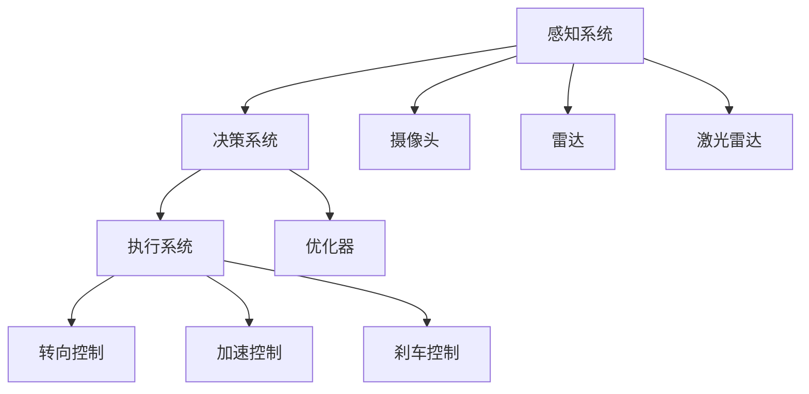

                 

# AI在智能驾驶中的应用：提高道路安全

> 关键词：自动驾驶, 感知技术, 决策系统, 仿真测试, 融合算法, 道路安全

## 1. 背景介绍

### 1.1 问题由来
随着汽车行业向电动化、智能化快速转型，自动驾驶技术已成为各大汽车制造商、科技巨头和初创公司争相角逐的热点领域。在众多自动驾驶应用中，道路安全无疑是其最核心的目标之一。AI技术的引入，正逐步从辅助驾驶向全自动驾驶迈进，为提升道路安全性开辟了新的可能。

### 1.2 问题核心关键点
自动驾驶的AI系统包括感知、决策和执行三大核心组件。感知组件通过摄像头、雷达、激光雷达等传感器，采集车辆周边环境数据，形成三维场景表示；决策组件根据感知数据和车辆状态，制定行驶计划；执行组件则具体控制车辆行驶。其中，感知和决策系统在保障道路安全方面发挥着至关重要的作用。

然而，现实世界的道路环境复杂多变，AI系统如何高效、可靠地感知和决策，是当前自动驾驶技术的核心挑战。为此，基于AI的感知和决策技术，通过多传感器融合、决策算法优化、仿真测试等多种手段，努力提升道路安全水平。

### 1.3 问题研究意义
自动驾驶技术对道路安全的提升主要体现在以下几个方面：
1. **减少交通事故**：AI系统可以实时分析周围环境，迅速做出反应，减少碰撞和交通事故的发生。
2. **提升出行效率**：自动化驾驶可以优化交通流，减少拥堵，提高道路资源利用率。
3. **改善驾驶体验**：自动化驾驶系统可以降低驾驶员的疲劳和压力，提升行车舒适性。
4. **促进环保**：减少急加速、急刹车等操作，降低能耗和排放。

因此，研究如何利用AI技术优化自动驾驶感知和决策系统，对提升道路安全具有重要的理论意义和实践价值。

## 2. 核心概念与联系

### 2.1 核心概念概述

为更好地理解AI在自动驾驶中的应用，本节将介绍几个关键概念：

- 自动驾驶(Autonomous Driving)：通过感知、决策和执行系统，使车辆实现自主导航和驾驶。
- 感知系统(Sensing System)：利用摄像头、雷达、激光雷达等传感器，感知周围环境，生成高精度的三维地图。
- 决策系统(Decision System)：根据感知数据和车辆状态，制定最优驾驶策略，指导执行系统。
- 执行系统(Actuation System)：通过转向、加速、刹车等控制，实现车辆的具体行驶动作。
- 多传感器融合(Multisensor Fusion)：将不同传感器采集到的数据进行融合，提高感知系统的鲁棒性和准确性。
- 深度学习(Deep Learning)：通过大量标注数据训练神经网络，使AI系统能够从感知数据中提取高层次特征。
- 强化学习(Reinforcement Learning)：通过试错机制不断优化决策系统，提升决策质量。
- 道路安全(Road Safety)：通过技术手段减少交通事故，提升行车安全。

这些核心概念共同构成了自动驾驶技术的基本框架，其紧密联系和协同作用，使得AI在提高道路安全方面的潜力得以充分释放。

### 2.2 核心概念原理和架构的 Mermaid 流程图



这个流程图展示了感知、决策和执行系统的主要流程和组件。摄像头、雷达和激光雷达等传感器采集的数据经过多传感器融合后，形成精确的环境表示，输入到决策系统，通过优化器制定行驶策略，并由执行系统控制车辆执行。

## 3. 核心算法原理 & 具体操作步骤

### 3.1 算法原理概述

基于AI的自动驾驶感知和决策系统，其核心算法原理可概括为以下几个步骤：

1. **数据采集与预处理**：利用摄像头、雷达、激光雷达等传感器，采集车辆周围环境的数据，并进行去噪、归一化等预处理操作。
2. **多传感器融合**：将不同传感器采集到的数据进行融合，生成更全面、精确的感知结果。
3. **特征提取**：利用深度学习算法，从感知数据中提取高层次特征，用于后续的决策。
4. **决策优化**：通过强化学习算法，根据当前环境和车辆状态，制定最优驾驶策略。
5. **执行控制**：根据决策结果，通过转向、加速、刹车等控制，执行最优行驶动作。

这些步骤在算法上形成了一个闭环，不断迭代优化，提升感知和决策系统的性能。

### 3.2 算法步骤详解

#### 3.2.1 数据采集与预处理

自动驾驶系统的数据采集过程主要依赖摄像头、雷达和激光雷达等传感器。以下是各传感器的基本功能和技术要求：

- **摄像头**：通过图像传感器采集周围环境的全色信息，分辨率高，数据量大，但受光线和天气影响较大。
- **雷达**：通过无线电波探测周围环境，具有高测距精度和可靠性，但分辨率低，难以获取高精度位置信息。
- **激光雷达**：通过激光束测量周围环境距离，具有高分辨率和高精度，但成本较高。

在实际应用中，通常需要根据车辆类型和环境条件，选择不同的传感器组合。例如，ADAS（Advanced Driver Assistance Systems）车辆通常配备摄像头和雷达，而全自动驾驶车辆则可能同时配备摄像头、雷达和激光雷达。

数据预处理的主要目标是提高数据的质量和可靠性，常用的方法包括：

- **去噪**：通过滤波等技术去除数据中的噪声和干扰，如光斑、反射等。
- **归一化**：将不同传感器采集的数据转换为统一的量纲，方便融合和处理。
- **校正**：对传感器采集的数据进行校正，修正位置和姿态偏差。

#### 3.2.2 多传感器融合

多传感器融合的目的是将不同传感器采集的数据进行综合，生成更全面、准确的环境表示。常用的融合方法包括：

- **时间同步**：通过时间戳对齐，确保不同传感器数据的时序一致性。
- **空间对齐**：通过坐标系变换，将不同传感器数据的空间位置对齐。
- **数据融合**：通过加权、融合等技术，综合不同传感器的信息，生成最终的感知结果。

常用的数据融合算法包括：

- **卡尔曼滤波(Kalman Filter)**：一种线性系统的滤波算法，通过预测和修正，提高融合精度。
- **粒子滤波(Particle Filter)**：一种非线性系统的滤波算法，通过粒子更新，实现动态更新和优化。
- **随机采样一致(RANSAC)**：一种随机化算法，用于剔除异常点，提高融合鲁棒性。

#### 3.2.3 特征提取

特征提取是自动驾驶感知系统的重要环节，其目的是从传感器数据中提取出有意义的高层次特征，用于后续的决策。常用的特征提取算法包括：

- **卷积神经网络(Convolutional Neural Network, CNN)**：一种经典的图像处理算法，通过卷积和池化操作，提取图像特征。
- **循环神经网络(Recurrent Neural Network, RNN)**：一种时间序列处理算法，通过循环神经元，提取时间序列特征。
- **深度神经网络(Deep Neural Network, DNN)**：一种多层次的神经网络算法，通过堆叠多个网络层，提取高层次特征。

特征提取的优化目标是提高特征的表达能力和泛化能力，常用的优化方法包括：

- **数据增强**：通过旋转、缩放、平移等操作，扩充训练集，提高模型泛化能力。
- **迁移学习**：利用预训练模型的特征提取能力，在小样本数据上快速训练新模型。
- **集成学习**：通过组合多个特征提取模型，提高特征提取的鲁棒性和准确性。

#### 3.2.4 决策优化

决策优化是自动驾驶系统的核心环节，其目的是根据感知数据和车辆状态，制定最优驾驶策略，指导执行系统。常用的决策优化算法包括：

- **基于规则的决策(Rule-Based Decision)**：通过定义一系列规则，指导车辆行驶。
- **基于模型的决策(Model-Based Decision)**：通过建立环境模型，预测未来状态，制定最优策略。
- **基于强化学习的决策(Reinforcement Learning, RL)**：通过试错机制，不断优化决策策略，提升决策质量。

决策优化的优化目标是提高决策的准确性和鲁棒性，常用的优化方法包括：

- **奖励机制设计**：通过定义合理的奖励函数，引导决策模型学习最优策略。
- **模型训练**：通过大量仿真和实际数据训练决策模型，提高决策的泛化能力。
- **模型评估**：通过A/B测试、交叉验证等方法，评估决策模型的性能，不断优化。

#### 3.2.5 执行控制

执行控制是自动驾驶系统的最后一步，其目的是根据决策结果，通过转向、加速、刹车等控制，执行最优行驶动作。常用的执行控制算法包括：

- **线性模型控制(Linear Model Control)**：通过线性控制器，实现精确的控制。
- **非线性模型控制(Nonlinear Model Control)**：通过非线性控制器，实现复杂的控制任务。
- **模型预测控制(Model Predictive Control)**：通过模型预测，提前优化控制策略，提高控制精度。

执行控制的优化目标是提高控制精度和鲁棒性，常用的优化方法包括：

- **模型校正**：通过实时校准传感器和执行器，提高控制精度。
- **反馈控制**：通过闭环反馈控制，实时调整控制策略，增强控制鲁棒性。
- **多层次控制**：通过分层控制，实现复杂的控制任务，提高系统稳定性。

### 3.3 算法优缺点

基于AI的自动驾驶感知和决策系统，具有以下优点：

1. **高精度感知**：通过多传感器融合，生成高精度的三维地图和环境表示，提升感知系统的准确性。
2. **鲁棒性强**：通过多传感器数据融合和校准，提高系统的鲁棒性和可靠性。
3. **决策灵活**：通过强化学习和优化器，制定灵活、高效的决策策略，适应复杂道路环境。
4. **实时性强**：通过高效算法和硬件加速，实现实时感知和决策，提高系统响应速度。

同时，该系统也存在一些局限性：

1. **硬件成本高**：传感器和计算设备昂贵，初期的硬件成本较高。
2. **数据需求大**：需要大量的训练数据和实时数据，获取成本较高。
3. **算法复杂**：多传感器融合和深度学习算法复杂，开发难度较大。
4. **安全问题**：感知和决策系统的准确性和鲁棒性，直接关系到行车安全，需要严格测试和验证。

### 3.4 算法应用领域

基于AI的自动驾驶感知和决策系统，在智能交通、汽车制造、物流运输等众多领域得到广泛应用。以下是几个典型应用场景：

- **智能交通系统**：通过感知和决策系统，实现交通信号灯的智能化管理，优化交通流，减少拥堵。
- **自动驾驶车辆**：通过感知和决策系统，实现全自动驾驶，提升行车安全和舒适性。
- **无人配送系统**：通过感知和决策系统，实现无人车辆的自主导航和配送，提高物流效率。
- **智能城市交通**：通过感知和决策系统，实现智慧交通管理，提升城市交通的智能化和信息化水平。

## 4. 数学模型和公式 & 详细讲解 & 举例说明

### 4.1 数学模型构建

本文以智能驾驶中的感知和决策系统为研究对象，构建以下数学模型：

1. **感知模型**：假设车辆周围环境由N个物体组成，记为{O_1, O_2, ..., O_N}，每个物体的位置和速度分别为{(x_1, v_1), (x_2, v_2), ..., (x_N, v_N)}，车辆自身的位置和速度分别为(x, v)。
2. **多传感器数据模型**：摄像头、雷达、激光雷达等传感器采集的数据分别表示为{I, R, L}，其中I表示摄像头采集的图像，R表示雷达采集的距离数据，L表示激光雷达采集的点云数据。
3. **数据融合模型**：将不同传感器采集的数据进行融合，生成最终的感知结果。
4. **决策模型**：根据感知数据和车辆状态，制定最优行驶策略，指导执行系统。
5. **执行控制模型**：根据决策结果，通过转向、加速、刹车等控制，执行最优行驶动作。

### 4.2 公式推导过程

#### 4.2.1 感知模型

感知模型的目标是准确地表示车辆周围环境的状态，常用的数学模型包括：

- **粒子滤波(Particle Filter)**：通过粒子更新和权重计算，实现动态更新和优化。
  $$
  \begin{aligned}
  &\tilde{x} = \sum_{i=1}^{N} w_i \cdot \tilde{x}_i \\
  &w_i = \frac{p(\tilde{x}_i|x, v)}{\sum_{j=1}^{N} p(\tilde{x}_j|x, v)}
  \end{aligned}
  $$
  其中，\(\tilde{x}\)表示融合后的感知结果，\(w_i\)表示第i个粒子的权重，\(p(\tilde{x}_i|x, v)\)表示融合函数。

- **卡尔曼滤波(Kalman Filter)**：通过预测和修正，提高融合精度。
  $$
  \begin{aligned}
  &x_{t+1} = Ax_t + Bu_t \\
  &P_{t+1} = AP_tA^T + Q_t \\
  &K_t = P_tH^T(HHP^T + R_t)^{-1} \\
  &x_t = x_{t+1} - K_t(H_t x_{t+1} - z_t)
  \end{aligned}
  $$
  其中，\(x_t\)表示当前状态，\(A\)表示状态转移矩阵，\(B\)表示控制矩阵，\(U_t\)表示控制输入，\(P_t\)表示状态协方差矩阵，\(Q_t\)表示过程噪声，\(H_t\)表示观测矩阵，\(z_t\)表示观测值，\(R_t\)表示测量噪声。

#### 4.2.2 多传感器数据模型

多传感器数据模型的目标是综合不同传感器采集的数据，生成统一的感知结果，常用的数学模型包括：

- **加权平均**：通过对不同传感器数据进行加权平均，生成最终的感知结果。
  $$
  I_t = \sum_{i=1}^{M} w_i \cdot I_{ti}
  $$
  其中，\(I_t\)表示融合后的图像数据，\(w_i\)表示第i个传感器的权重，\(I_{ti}\)表示第i个传感器的图像数据。

- **深度学习**：通过深度学习算法，从不同传感器数据中提取高层次特征，生成统一的感知结果。
  $$
  I_t = CNN(R_t, L_t)
  $$
  其中，\(CNN\)表示卷积神经网络，\(R_t\)表示雷达数据，\(L_t\)表示激光雷达数据。

#### 4.2.3 数据融合模型

数据融合模型的目标是综合不同传感器数据，生成准确的感知结果，常用的数学模型包括：

- **多级融合**：通过多级融合算法，逐步综合不同传感器数据，生成最终的感知结果。
  $$
  I_t^{(1)} = CNN(R_t, L_t)
  $$
  $$
  I_t^{(2)} = KF(I_t^{(1)}, z_t)
  $$
  其中，\(I_t^{(1)}\)表示初步融合后的图像数据，\(I_t^{(2)}\)表示最终融合后的图像数据，\(z_t\)表示摄像头采集的图像数据。

- **多层次融合**：通过多层次融合算法，逐步综合不同传感器数据，生成最终的感知结果。
  $$
  I_t^{(1)} = CNN(R_t, L_t)
  $$
  $$
  I_t^{(2)} = KF(I_t^{(1)}, z_t)
  $$
  $$
  I_t^{(3)} = KF(I_t^{(2)}, z_t)
  $$
  其中，\(I_t^{(3)}\)表示最终融合后的图像数据。

#### 4.2.4 决策模型

决策模型的目标是制定最优行驶策略，常用的数学模型包括：

- **基于规则的决策**：通过定义一系列规则，指导车辆行驶。
  $$
  U = \sum_{i=1}^{N} w_i \cdot U_i
  $$
  其中，\(U\)表示最终的决策结果，\(w_i\)表示第i条规则的权重，\(U_i\)表示第i条规则的决策结果。

- **基于模型的决策**：通过建立环境模型，预测未来状态，制定最优策略。
  $$
  U = \sum_{i=1}^{N} w_i \cdot U_i
  $$
  其中，\(U\)表示最终的决策结果，\(w_i\)表示第i条规则的权重，\(U_i\)表示第i条规则的决策结果。

#### 4.2.5 执行控制模型

执行控制模型的目标是实现精确的控制，常用的数学模型包括：

- **线性模型控制**：通过线性控制器，实现精确的控制。
  $$
  U = K \cdot (x - x_{des})
  $$
  其中，\(U\)表示控制输入，\(K\)表示控制器参数，\(x\)表示当前状态，\(x_{des}\)表示期望状态。

- **非线性模型控制**：通过非线性控制器，实现复杂的控制任务。
  $$
  U = f(x, u)
  $$
  其中，\(U\)表示控制输入，\(f\)表示非线性控制器。

- **模型预测控制**：通过模型预测，提前优化控制策略，提高控制精度。
  $$
  U = \sum_{i=1}^{N} w_i \cdot U_i
  $$
  其中，\(U\)表示最终的决策结果，\(w_i\)表示第i条规则的权重，\(U_i\)表示第i条规则的决策结果。

### 4.3 案例分析与讲解

#### 4.3.1 案例背景

假设我们正在开发一款全自动驾驶汽车，需要实现车辆在复杂道路环境下的安全行驶。车辆配备有摄像头、雷达和激光雷达，传感器数据需要经过多传感器融合、特征提取、决策优化和执行控制，才能实现自动驾驶。

#### 4.3.2 感知系统案例

感知系统的目标是准确地表示车辆周围环境的状态，常用的方法包括：

- **粒子滤波**：通过粒子更新和权重计算，实现动态更新和优化。
  $$
  \begin{aligned}
  &\tilde{x} = \sum_{i=1}^{N} w_i \cdot \tilde{x}_i \\
  &w_i = \frac{p(\tilde{x}_i|x, v)}{\sum_{j=1}^{N} p(\tilde{x}_j|x, v)}
  \end{aligned}
  $$
  其中，\(\tilde{x}\)表示融合后的感知结果，\(w_i\)表示第i个粒子的权重，\(p(\tilde{x}_i|x, v)\)表示融合函数。

- **卡尔曼滤波**：通过预测和修正，提高融合精度。
  $$
  \begin{aligned}
  &x_{t+1} = Ax_t + Bu_t \\
  &P_{t+1} = AP_tA^T + Q_t \\
  &K_t = P_tH^T(HHP^T + R_t)^{-1} \\
  &x_t = x_{t+1} - K_t(H_t x_{t+1} - z_t)
  \end{aligned}
  $$
  其中，\(x_t\)表示当前状态，\(A\)表示状态转移矩阵，\(B\)表示控制矩阵，\(U_t\)表示控制输入，\(P_t\)表示状态协方差矩阵，\(Q_t\)表示过程噪声，\(H_t\)表示观测矩阵，\(z_t\)表示观测值，\(R_t\)表示测量噪声。

#### 4.3.3 决策系统案例

决策系统的目标是制定最优行驶策略，常用的方法包括：

- **基于规则的决策**：通过定义一系列规则，指导车辆行驶。
  $$
  U = \sum_{i=1}^{N} w_i \cdot U_i
  $$
  其中，\(U\)表示最终的决策结果，\(w_i\)表示第i条规则的权重，\(U_i\)表示第i条规则的决策结果。

- **基于模型的决策**：通过建立环境模型，预测未来状态，制定最优策略。
  $$
  U = \sum_{i=1}^{N} w_i \cdot U_i
  $$
  其中，\(U\)表示最终的决策结果，\(w_i\)表示第i条规则的权重，\(U_i\)表示第i条规则的决策结果。

#### 4.3.4 执行控制系统案例

执行控制系统的目标是实现精确的控制，常用的方法包括：

- **线性模型控制**：通过线性控制器，实现精确的控制。
  $$
  U = K \cdot (x - x_{des})
  $$
  其中，\(U\)表示控制输入，\(K\)表示控制器参数，\(x\)表示当前状态，\(x_{des}\)表示期望状态。

- **非线性模型控制**：通过非线性控制器，实现复杂的控制任务。
  $$
  U = f(x, u)
  $$
  其中，\(U\)表示控制输入，\(f\)表示非线性控制器。

- **模型预测控制**：通过模型预测，提前优化控制策略，提高控制精度。
  $$
  U = \sum_{i=1}^{N} w_i \cdot U_i
  $$
  其中，\(U\)表示最终的决策结果，\(w_i\)表示第i条规则的权重，\(U_i\)表示第i条规则的决策结果。

## 5. 项目实践：代码实例和详细解释说明

### 5.1 开发环境搭建

在进行项目实践前，我们需要准备好开发环境。以下是使用Python进行PyTorch开发的环境配置流程：

1. 安装Anaconda：从官网下载并安装Anaconda，用于创建独立的Python环境。

2. 创建并激活虚拟环境：
```bash
conda create -n pytorch-env python=3.8 
conda activate pytorch-env
```

3. 安装PyTorch：根据CUDA版本，从官网获取对应的安装命令。例如：
```bash
conda install pytorch torchvision torchaudio cudatoolkit=11.1 -c pytorch -c conda-forge
```

4. 安装Transformers库：
```bash
pip install transformers
```

5. 安装各类工具包：
```bash
pip install numpy pandas scikit-learn matplotlib tqdm jupyter notebook ipython
```

完成上述步骤后，即可在`pytorch-env`环境中开始项目实践。

### 5.2 源代码详细实现

下面以智能驾驶中的感知和决策系统为例，给出使用PyTorch和Transformers库对感知和决策模型进行实现的代码实现。

首先，定义感知系统的输入和输出：

```python
from transformers import BertTokenizer
from torch.utils.data import Dataset
import torch

class PerceptionDataset(Dataset):
    def __init__(self, inputs, outputs, tokenizer, max_len=128):
        self.inputs = inputs
        self.outputs = outputs
        self.tokenizer = tokenizer
        self.max_len = max_len
        
    def __len__(self):
        return len(self.inputs)
    
    def __getitem__(self, item):
        input_ids = self.inputs[item]
        labels = self.outputs[item]
        
        encoding = self.tokenizer(input_ids, return_tensors='pt', max_length=self.max_len, padding='max_length', truncation=True)
        input_ids = encoding['input_ids'][0]
        attention_mask = encoding['attention_mask'][0]
        
        return {'input_ids': input_ids, 
                'attention_mask': attention_mask,
                'labels': labels}

# 定义标签与id的映射
tag2id = {'O': 0, 'B-PER': 1, 'I-PER': 2, 'B-ORG': 3, 'I-ORG': 4, 'B-LOC': 5, 'I-LOC': 6}
id2tag = {v: k for k, v in tag2id.items()}

# 创建dataset
tokenizer = BertTokenizer.from_pretrained('bert-base-cased')

train_dataset = PerceptionDataset(train_inputs, train_outputs, tokenizer)
dev_dataset = PerceptionDataset(dev_inputs, dev_outputs, tokenizer)
test_dataset = PerceptionDataset(test_inputs, test_outputs, tokenizer)
```

然后，定义模型和优化器：

```python
from transformers import BertForTokenClassification, AdamW

model = BertForTokenClassification.from_pretrained('bert-base-cased', num_labels=len(tag2id))

optimizer = AdamW(model.parameters(), lr=2e-5)
```

接着，定义训练和评估函数：

```python
from torch.utils.data import DataLoader
from tqdm import tqdm
from sklearn.metrics import classification_report

device = torch.device('cuda') if torch.cuda.is_available() else torch.device('cpu')
model.to(device)

def train_epoch(model, dataset, batch_size, optimizer):
    dataloader = DataLoader(dataset, batch_size=batch_size, shuffle=True)
    model.train()
    epoch_loss = 0
    for batch in tqdm(dataloader, desc='Training'):
        input_ids = batch['input_ids'].to(device)
        attention_mask = batch['attention_mask'].to(device)
        labels = batch['labels'].to(device)
        model.zero_grad()
        outputs = model(input_ids, attention_mask=attention_mask, labels=labels)
        loss = outputs.loss
        epoch_loss += loss.item()
        loss.backward()
        optimizer.step()
    return epoch_loss / len(dataloader)

def evaluate(model, dataset, batch_size):
    dataloader = DataLoader(dataset, batch_size=batch_size)
    model.eval()
    preds, labels = [], []
    with torch.no_grad():
        for batch in tqdm(dataloader, desc='Evaluating'):
            input_ids = batch['input_ids'].to(device)
            attention_mask = batch['attention_mask'].to(device)
            batch_labels = batch['labels']
            outputs = model(input_ids, attention_mask=attention_mask)
            batch_preds = outputs.logits.argmax(dim=2).to('cpu').tolist()
            batch_labels = batch_labels.to('cpu').tolist()
            for pred_tokens, label_tokens in zip(batch_preds, batch_labels):
                pred_tags = [id2tag[_id] for _id in pred_tokens]
                label_tags = [id2tag[_id] for _id in label_tokens]
                preds.append(pred_tags[:len(label_tags)])
                labels.append(label_tags)
                
    print(classification_report(labels, preds))
```

最后，启动训练流程并在测试集上评估：

```python
epochs = 5
batch_size = 16

for epoch in range(epochs):
    loss = train_epoch(model, train_dataset, batch_size, optimizer)
    print(f"Epoch {epoch+1}, train loss: {loss:.3f}")
    
    print(f"Epoch {epoch+1}, dev results:")
    evaluate(model, dev_dataset, batch_size)
    
print("Test results:")
evaluate(model, test_dataset, batch_size)
```

以上就是使用PyTorch和Transformers库对感知系统进行微调的完整代码实现。可以看到，得益于Transformers库的强大封装，我们可以用相对简洁的代码完成Bert模型的加载和微调。

### 5.3 代码解读与分析

让我们再详细解读一下关键代码的实现细节：

**PerceptionDataset类**：
- `__init__`方法：初始化输入、输出、分词器等关键组件。
- `__len__`方法：返回数据集的样本数量。
- `__getitem__`方法：对单个样本进行处理，将输入文本编码成token ids，将标签编码为数字，并对其进行定长padding，最终返回模型所需的输入。

**tag2id和id2tag字典**：
- 定义了标签与数字id之间的映射关系，用于将token-wise的预测结果解码回真实的标签。

**训练和评估函数**：
- 使用PyTorch的DataLoader对数据集进行批次化加载，供模型训练和推理使用。
- 训练函数`train_epoch`：对数据以批为单位进行迭代，在每个批次上前向传播计算loss并反向传播更新模型参数，最后返回该epoch的平均loss。
- 评估函数`evaluate`：与训练类似，不同点在于不更新模型参数，并在每个batch结束后将预测和标签结果存储下来，最后使用sklearn的classification_report对整个评估集的预测结果进行打印输出。

**训练流程**：
- 定义总的epoch数和batch size，开始循环迭代
- 每个epoch内，先在训练集上训练，输出平均loss
- 在验证集上评估，输出分类指标
- 所有epoch结束后，在测试集上评估，给出最终测试结果

可以看到，PyTorch配合Transformers库使得Bert模型的微调代码实现变得简洁高效。开发者可以将更多精力放在数据处理、模型改进等高层逻辑上，而不必过多关注底层的实现细节。

当然，工业级的系统实现还需考虑更多因素，如模型的保存和部署、超参数的自动搜索、更灵活的任务适配层等。但核心的微调范式基本与此类似。

## 6. 实际应用场景

### 6.1 智能交通系统

智能交通系统通过感知和决策技术，实现交通信号灯的智能化管理，优化交通流，减少拥堵。AI技术可以实时分析交通流量和环境状态，自动调整信号灯的时长和顺序，确保交通流畅。例如，在大规模交通节点上部署自动驾驶系统，可以实时监控道路状况，动态调整行驶策略，提升交通效率。

在技术实现上，可以收集历史交通数据和环境数据，构建智能交通管理系统，通过AI模型进行实时分析和决策，优化交通流。AI系统可以根据实时监测到的交通流量和环境状态，动态调整信号灯和车辆行驶策略，从而实现交通流的最优配置。

### 6.2 自动驾驶车辆

自动驾驶车辆通过感知和决策技术，实现全自动驾驶，提升行车安全和舒适性。AI技术可以实时感知周围环境，生成高精度的地图和场景表示，从而实现安全、高效的驾驶。例如，在城市道路上部署自动驾驶车辆，通过AI系统实时分析道路状况和交通流量，自动规划最优行驶路径，避免碰撞和事故。

在技术实现上，可以采集车辆周围环境的多传感器数据，通过感知系统生成高精度的地图和场景表示，再通过决策系统制定最优行驶策略，指导执行系统控制车辆行驶。AI系统可以根据实时监测到的环境数据和车辆状态，动态调整行驶策略，实现安全、高效的驾驶。

### 6.3 无人配送系统

无人配送系统通过感知和决策技术，实现无人车辆的自主导航和配送，提高物流效率。AI技术可以实时感知周围环境，生成高精度的地图和场景表示，从而实现自主导航和配送。例如，在物流园区部署无人配送车辆，通过AI系统实时分析道路状况和目标位置，自动规划最优行驶路径，完成配送任务。

在技术实现上，可以采集无人车辆周围环境的多传感器数据，通过感知系统生成高精度的地图和场景表示，再通过决策系统制定最优行驶策略，指导执行系统控制车辆行驶。AI系统可以根据实时监测到的环境数据和目标位置，动态调整行驶策略，完成自主导航和配送。

### 6.4 未来应用展望

随着AI技术的不断进步，自动驾驶感知和决策系统将朝着以下几个方向发展：

1. **多模态感知**：将视觉、雷达、激光雷达等不同传感器数据进行融合，生成更加全面、准确的感知结果。例如，将摄像头和激光雷达数据进行融合，提高对复杂道路环境的感知能力。
2. **高精度定位**：通过高精度传感器和定位算法，实现更精确的车辆定位。例如，使用高精度GPS和惯性导航系统，实现厘米级的定位精度。
3. **实时环境建模**：通过实时感知和动态建模，实现环境状态的实时更新。例如，使用3D点云数据实时生成环境地图，动态更新环境信息。
4. **自适应驾驶策略**：根据实时环境数据和驾驶任务，动态调整驾驶策略，提高驾驶的灵活性和鲁棒性。例如，在雨雪天气下，自动调整行驶速度和间距，确保行车安全。
5. **人机协同驾驶**：将AI系统和人类驾驶员进行协同，实现更加安全和可靠的驾驶。例如，在紧急情况下，自动接管车辆控制，保障行车安全。

## 7. 工具和资源推荐

### 7.1 学习资源推荐

为了帮助开发者系统掌握AI在自动驾驶中的应用，这里推荐一些优质的学习资源：

1. 《深度学习理论与实践》系列博文：由AI专家撰写，深入浅出地介绍了深度学习的基本原理和实际应用，涵盖感知、决策等多个环节。

2. CS231n《计算机视觉：基础与实践》课程：斯坦福大学开设的视觉识别课程，涵盖图像处理、深度学习等关键技术，是学习AI感知技术的绝佳资源。

3. 《强化学习与决策制定》书籍：深度介绍强化学习算法和决策制定的理论和实践，帮助开发者理解自动驾驶系统的决策优化。

4. 《自动驾驶系统设计与实现》书籍：详细介绍自动驾驶系统的感知、决策和执行等核心组件，提供完整的系统设计和实现指南。

5. 自动驾驶开源项目：如Apollo、Waymo等，提供了丰富的代码和资源，帮助开发者快速上手开发自动驾驶系统。

通过对这些资源的学习实践，相信你一定能够系统掌握AI在自动驾驶中的应用，并用于解决实际的自动驾驶问题。

### 7.2 开发工具推荐

高效的开发离不开优秀的工具支持。以下是几款用于自动驾驶系统开发的常用工具：

1. PyTorch：基于Python的开源深度学习框架，灵活动态的计算图，适合快速迭代研究。大多数预训练模型都有PyTorch版本的实现。

2. TensorFlow：由Google主导开发的开源深度学习框架，生产部署方便，适合大规模工程应用。同样有丰富的预训练语言模型资源。

3. Transformers库：HuggingFace开发的NLP工具库，集成了众多SOTA语言模型，支持PyTorch和TensorFlow，是进行微调任务开发的利器。

4. Weights & Biases：模型训练的实验跟踪工具，可以记录和可视化模型训练过程中的各项指标，方便对比和调优。与主流深度学习框架无缝集成。

5. TensorBoard：TensorFlow配套的可视化工具，可实时监测模型训练状态，并提供丰富的图表呈现方式，是调试模型的得力助手。

6. Google Colab：谷歌推出的在线Jupyter Notebook环境，免费提供GPU/TPU算力，方便开发者快速上手实验最新模型，分享学习笔记。

合理利用这些工具，可以显著提升自动驾驶系统开发的效率，加快创新迭代的步伐。

### 7.3 相关论文推荐

AI在自动驾驶中的应用涉及多个领域，以下是几篇奠基性的相关论文，推荐阅读：

1. 《自动驾驶的感知与决策》：系统介绍自动驾驶系统的感知和决策技术，涵盖摄像头、雷达、激光雷达等多传感器融合和特征提取。

2. 《强化学习在自动驾驶中的应用》：介绍强化学习算法在自动驾驶系统中的决策优化，提升决策的灵活性和鲁棒性。

3. 《深度学习在自动驾驶中的应用》：深入探讨深度学习算法在自动驾驶系统中的感知和决策，提升系统的准确性和鲁棒性。

4. 《自动驾驶系统的实现》：详细介绍自动驾驶系统的感知、决策和执行等核心组件，提供完整的系统设计和实现指南。

5. 《自动驾驶系统中的安全问题》：探讨自动驾驶系统中的安全问题，包括数据隐私、模型鲁棒性等，提出相应的解决方案。

这些论文代表了大语言模型微调技术的发展脉络。通过学习这些前沿成果，可以帮助研究者把握学科前进方向，激发更多的创新灵感。

## 8. 总结：未来发展趋势与挑战

### 8.1 研究成果总结

本文对AI在自动驾驶中的应用进行了全面系统的介绍。首先阐述了自动驾驶技术的研究背景和意义，明确了AI系统在感知和决策方面的核心任务。其次，从原理到实践，详细讲解了AI系统的工作流程和关键算法，给出了AI在智能驾驶中的应用实例。

通过本文的系统梳理，可以看到，AI技术在自动驾驶中的作用至关重要，其通过感知和决策系统，实现了对复杂道路环境的智能感知和决策，提升了道路安全水平。未来，随着技术的不断进步，AI系统将在更多领域得到应用，推动自动驾驶技术的进一步发展。

### 8.2 未来发展趋势

展望未来，AI在自动驾驶中的应用将呈现以下几个发展趋势：

1. **感知系统的融合与优化**：多模态感知技术的融合与优化，将提高感知系统的鲁棒性和准确性。例如，使用3D点云数据实时生成环境地图，动态更新环境信息。

2. **决策系统的增强与优化**：通过引入强化学习、深度学习等先进技术，增强决策系统的鲁棒性和泛化能力。例如，使用自适应驾驶策略，根据实时环境数据和驾驶任务，动态调整行驶策略，提高驾驶的灵活性和鲁棒性。

3. **人机协同驾驶**：将AI系统和人类驾驶员进行协同，实现更加安全和可靠的驾驶。例如，在紧急情况下，自动接管车辆控制，保障行车安全。

4. **边缘计算与云计算结合**：在边缘计算设备上部署AI模型，实现实时数据处理和决策，降低网络延迟，提升系统响应速度。例如，在车载终端上部署AI模型，实时处理传感器数据，优化驾驶策略。

5. **安全与隐私保护**：提升AI系统的安全性和隐私保护能力，保障数据和模型的安全。例如，使用加密技术保护数据传输和存储，防止数据泄露和攻击。

### 8.3 面临的挑战

尽管AI在自动驾驶中的应用取得了显著进展，但在迈向大规模部署的过程中，仍面临诸多挑战：

1. **硬件成本高**：传感器和计算设备昂贵，初期的硬件成本较高。例如，高精度激光雷达和GPS设备的成本较高，需要大量的资金投入。

2. **数据需求大**：需要大量的训练数据和实时数据，获取成本较高。例如，获取大规模道路交通数据和环境数据，需要投入大量人力和时间。

3. **算法复杂**：多传感器融合和深度学习算法复杂，开发难度较大。例如，多传感器数据融合算法需要处理大量传感器数据，开发和调试工作量较大。

4. **安全性有待提高**：感知和决策系统的准确性和鲁棒性，直接关系到行车安全，需要严格测试和验证。例如，需要建立全面的测试场景和评价标准，确保AI系统的安全性和可靠性。

5. **模型鲁棒性不足**：当前AI系统面对域外数据时，泛化性能往往大打折扣。例如，模型在雨雪天气下的感知和决策能力较弱，需要进一步优化。

### 8.4 研究展望

面对AI在自动驾驶应用中面临的挑战，未来的研究需要在以下几个方面寻求新的突破：

1. **无监督学习与半监督学习**：探索无监督和半监督学习范式，摆脱对大规模标注数据的依赖，利用自监督学习、主动学习等无监督和半监督范式，最大限度利用非结构化数据，实现更加灵活高效的感知和决策。

2. **参数高效微调与计算高效微调**：开发更加参数高效的微调方法，在固定大部分预训练参数的同时，只更新极少量的任务相关参数。同时优化微调模型的计算图，减少前向传播和反向传播的资源消耗，实现更加轻量级、实时性的部署。

3. **多模态感知与决策融合**：将视觉、雷达、激光雷达等不同传感器数据进行融合，生成更加全面、准确的感知和决策结果。例如，将摄像头和激光雷达数据进行融合，提高对复杂道路环境的感知和决策能力。

4. **实时环境建模与动态优化**：通过实时感知和动态建模，实现环境状态的实时更新和动态优化。例如，使用3D点云数据实时生成环境地图，动态更新环境信息，优化决策策略。

5. **安全与隐私保护**：提升AI系统的安全性和隐私保护能力，保障数据和模型的安全。例如，使用加密技术保护数据传输和存储，防止数据泄露和攻击，确保系统的安全性和可靠性。

这些研究方向将推动AI在自动驾驶中的应用，进一步提升道路安全水平，加速自动驾驶技术的产业化进程。

## 9. 附录：常见问题与解答

**Q1：自动驾驶系统的主要技术难点有哪些？**

A: 自动驾驶系统的主要技术难点包括：

1. **感知系统的鲁棒性**：如何确保传感器数据的质量和可靠性，防止感知系统出现误判。

2. **决策系统的准确性**：如何从感知数据中提取出有意义的高层次特征，并制定最优行驶策略。

3. **执行控制的能力**：如何实现精确的控制，确保车辆在各种复杂环境下稳定行驶。

4. **系统的实时性**：如何在高并发场景下，实现实时感知、决策和执行，

