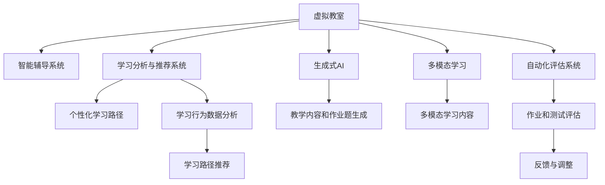

                 

# AI在虚拟教育中的应用：打破地理限制

## 1. 背景介绍

在数字化转型的大潮下，教育正在迎来一场深刻的变革。传统的教育模式正在逐渐被虚拟教育所替代，通过在线课程、虚拟教室、智能辅导系统等，学习者可以随时随地获取知识，打破了时间和空间的限制。AI技术的深度融入，更是为虚拟教育注入了强大的动力，使得个性化学习、智能化辅导、自动化评估等成为可能。

### 1.1 问题由来

当前，全球范围内的教育资源分配不均问题仍然严重。发达地区拥有先进的教育设施和丰富的教育资源，而欠发达地区则面临着师资匮乏、教育资源不足的困境。AI技术的应用，尤其是大语言模型和机器学习技术，为打破这种地理限制提供了可能。通过AI技术，可以有效优化教育资源的分配，实现教育的公平与普及。

### 1.2 问题核心关键点

AI在虚拟教育中的应用，主要包括以下几个关键点：
1. **个性化学习**：通过数据分析和学习推荐系统，为每个学习者定制个性化的学习路径。
2. **智能化辅导**：使用聊天机器人、虚拟助教等AI工具，提供全天候的在线辅导和答疑。
3. **自动化评估**：利用AI技术实现自动化的测试和作业评估，提高评估的效率和准确性。
4. **内容生成**：通过生成式AI技术，自动生成教学内容和作业题，丰富教学资源。
5. **多模态学习**：结合图像、视频、语音等多模态数据，增强学习体验和效果。

### 1.3 问题研究意义

AI在虚拟教育中的应用，不仅能够提高教育资源的利用效率，还能提升学习效果和学习者的满意度。通过AI技术，可以为更多学生提供高质量的教育资源，促进教育公平，加速教育创新。此外，AI技术的应用也能够推动教育产业的数字化转型，催生更多创新商业模式和应用场景。

## 2. 核心概念与联系

### 2.1 核心概念概述

在虚拟教育中，AI技术的应用主要围绕以下几个核心概念展开：

- **虚拟教室**：基于AI技术构建的在线教学平台，支持视频直播、文本互动、实时答疑等功能。
- **智能辅导系统**：使用AI技术提供的智能辅导和答疑服务，能够实时解答学生的疑问，提供个性化学习建议。
- **学习分析与推荐系统**：通过分析学习行为和成绩数据，推荐适合的学习内容和路径。
- **自动化评估系统**：利用AI技术自动评估学生的作业和测试，提供即时反馈。
- **生成式AI**：通过生成式模型生成教学内容、作业题等，丰富教学资源。
- **多模态学习**：结合图像、视频、语音等多模态数据，提升学习体验和效果。

这些核心概念之间通过数据流动和算法调用相互连接，共同构成了一个虚拟教育生态系统。

### 2.2 核心概念原理和架构的 Mermaid 流程图



这个Mermaid流程图展示了虚拟教育中各个核心概念之间的相互联系和数据流动。

## 3. 核心算法原理 & 具体操作步骤

### 3.1 算法原理概述

AI在虚拟教育中的应用，主要是基于机器学习和自然语言处理技术。其中，深度学习模型如卷积神经网络(CNN)、循环神经网络(RNN)、Transformer等，被广泛应用于图像识别、语音识别、自然语言理解等领域。以下是几个核心算法的概述：

- **深度学习模型**：用于处理结构化和非结构化数据，如图像、文本、音频等。通过多层神经网络结构，模型能够学习到数据的复杂特征，实现分类、识别、生成等任务。
- **自然语言处理模型**：用于处理文本数据，如分词、词向量表示、文本分类、情感分析、机器翻译等。Transformer模型因其优秀的性能在自然语言处理中得到广泛应用。
- **推荐系统算法**：用于分析用户行为数据，推荐个性化的学习内容和路径。协同过滤、矩阵分解等算法在推荐系统中得到广泛应用。

### 3.2 算法步骤详解

以下是AI在虚拟教育中常用的算法操作步骤：

**Step 1: 数据准备**
- 收集学生的学习行为数据，包括浏览记录、测试成绩、课堂互动等。
- 收集课程内容数据，如教学视频、文本、作业题等。
- 收集教育资源数据，如教材、论文、案例等。

**Step 2: 数据预处理**
- 对数据进行清洗、去重、归一化等处理，保证数据质量。
- 对文本数据进行分词、词向量化等预处理，方便后续模型训练。
- 对图像、视频等非结构化数据进行特征提取，用于分类、识别等任务。

**Step 3: 模型训练**
- 选择适合的深度学习模型，如CNN、RNN、Transformer等。
- 对模型进行训练，调整超参数，保证模型性能。
- 使用多模态数据进行联合训练，提升模型的泛化能力。

**Step 4: 模型部署与评估**
- 将训练好的模型部署到虚拟教室、智能辅导系统等应用中。
- 收集学生的反馈，评估模型的实际效果。
- 持续优化模型，提升用户体验和学习效果。

**Step 5: 持续学习与迭代**
- 收集更多数据，持续训练和优化模型。
- 引入新的AI技术，如强化学习、生成式AI等，提升系统的智能化水平。

### 3.3 算法优缺点

AI在虚拟教育中的应用，具有以下优点：
1. **个性化学习**：能够根据学生的学习行为和成绩，提供个性化的学习路径和推荐，提升学习效果。
2. **智能化辅导**：提供全天候的在线答疑和辅导，解放教师时间，提高教学效率。
3. **自动化评估**：快速、准确地评估学生的作业和测试，提供即时反馈。
4. **丰富学习资源**：通过生成式AI技术，自动生成教学内容和作业题，丰富教学资源。
5. **提升教学质量**：结合多模态数据，提升学习体验和效果，提高教学质量。

同时，也存在以下缺点：
1. **数据隐私问题**：学生的学习数据隐私保护需要特别注意，避免数据泄露和滥用。
2. **模型复杂度**：AI模型通常比较复杂，需要大量的计算资源和存储空间。
3. **教师角色**：AI技术的应用不能完全替代教师，教师仍然需要提供情感支持、人际互动等。
4. **技术门槛**：AI技术的应用需要一定的技术门槛，需要专业的技术人员进行维护和优化。

### 3.4 算法应用领域

AI在虚拟教育中的应用，已经在多个领域得到了广泛的应用：

- **K-12教育**：使用智能辅导系统、学习分析与推荐系统，提供个性化学习路径和即时反馈，提升学生学习效果。
- **高等教育**：结合虚拟教室、多模态学习等技术，提供灵活的在线课程和自主学习平台。
- **职业培训**：通过虚拟教室和智能辅导系统，提供针对特定职业的培训课程，提升职业能力。
- **终身学习**：利用在线课程和智能化辅导，提供灵活的学习资源和路径，满足不同年龄段学习者的需求。

## 4. 数学模型和公式 & 详细讲解 & 举例说明

### 4.1 数学模型构建

在虚拟教育中，常见的数学模型包括以下几种：

- **协同过滤模型**：用于推荐系统，通过分析用户和项目之间的相似度，推荐个性化的内容。
- **深度学习模型**：用于处理非结构化数据，如图像、文本等。
- **自然语言处理模型**：用于处理文本数据，如情感分析、文本分类等。
- **多模态模型**：结合图像、视频、语音等多模态数据，提升学习效果和体验。

### 4.2 公式推导过程

以协同过滤模型为例，介绍推荐系统中的基本公式推导过程。

协同过滤模型分为用户-物品评分矩阵分解和基于用户物品相似度的推荐。假设用户-物品评分矩阵为 $M$，用户 $u$ 的物品评分向量为 $r_u$，物品 $i$ 的用户评分向量为 $c_i$，则协同过滤模型的目标是最小化重构误差：

$$
\min_{r,c} \frac{1}{2N}\sum_{u=1}^N \sum_{i=1}^M (r_u^T c_i - m_{ui})^2
$$

其中 $m_{ui}$ 为实际评分。

通过求解上述优化问题，可以得到用户和物品的潜在评分向量 $r_u$ 和 $c_i$。然后，根据用户和物品之间的相似度，计算推荐结果。

### 4.3 案例分析与讲解

以自然语言处理模型BERT为例，介绍其在虚拟教育中的应用。

BERT模型通过自监督预训练和微调，学习到了丰富的语言知识。在虚拟教育中，可以使用BERT模型进行自然语言理解和生成任务。例如，在智能辅导系统中，可以使用BERT模型进行问题理解和生成，提高系统对学生问题的理解和解答能力。在虚拟教室中，可以使用BERT模型进行文本分类，自动标注学生的作业和测试答案，提升评估效率和准确性。

## 5. 项目实践：代码实例和详细解释说明

### 5.1 开发环境搭建

在进行虚拟教育应用的开发前，需要准备好开发环境。以下是使用Python进行TensorFlow开发的环境配置流程：

1. 安装Anaconda：从官网下载并安装Anaconda，用于创建独立的Python环境。

2. 创建并激活虚拟环境：
```bash
conda create -n tf-env python=3.8 
conda activate tf-env
```

3. 安装TensorFlow：根据CUDA版本，从官网获取对应的安装命令。例如：
```bash
conda install tensorflow
```

4. 安装各类工具包：
```bash
pip install numpy pandas scikit-learn matplotlib tqdm jupyter notebook ipython
```

完成上述步骤后，即可在`tf-env`环境中开始开发。

### 5.2 源代码详细实现

以下是使用TensorFlow进行虚拟教育应用的代码实现。

**Step 1: 数据准备**
- 使用TensorFlow的`tf.data`模块，加载和预处理数据。
- 将文本数据进行分词和词向量化处理。
- 将图像数据进行特征提取和预处理。

**Step 2: 模型训练**
- 定义深度学习模型，如CNN、RNN、Transformer等。
- 使用TensorFlow的`tf.keras`模块进行模型训练，调整超参数。
- 结合多模态数据进行联合训练。

**Step 3: 模型部署与评估**
- 将训练好的模型部署到虚拟教室、智能辅导系统等应用中。
- 收集学生的反馈，评估模型的实际效果。
- 持续优化模型，提升用户体验和学习效果。

以下是虚拟教育应用的代码示例：

```python
import tensorflow as tf
from tensorflow.keras import layers, models

# Step 1: 数据准备
# 加载和预处理数据，包括文本、图像等
# ...

# Step 2: 模型训练
# 定义深度学习模型，如CNN、RNN、Transformer等
# ...

# 使用TensorFlow的tf.keras模块进行模型训练
model = models.Sequential()
model.add(layers.Conv2D(32, (3, 3), activation='relu', input_shape=(32, 32, 3)))
model.add(layers.MaxPooling2D((2, 2)))
model.add(layers.Conv2D(64, (3, 3), activation='relu'))
model.add(layers.MaxPooling2D((2, 2)))
model.add(layers.Conv2D(64, (3, 3), activation='relu'))
model.add(layers.Flatten())
model.add(layers.Dense(64, activation='relu'))
model.add(layers.Dense(10, activation='softmax'))

model.compile(optimizer='adam', loss='categorical_crossentropy', metrics=['accuracy'])
model.fit(train_data, train_labels, epochs=10, validation_data=(val_data, val_labels))

# Step 3: 模型部署与评估
# 将训练好的模型部署到虚拟教室、智能辅导系统等应用中
# ...

# 收集学生的反馈，评估模型的实际效果
# ...
```

### 5.3 代码解读与分析

让我们再详细解读一下关键代码的实现细节：

**虚拟教育应用的代码示例**
- 使用TensorFlow的`tf.keras`模块定义深度学习模型，并进行训练。
- 使用`Sequential`模型定义多层次的神经网络结构，包括卷积层、池化层、全连接层等。
- 使用`compile`方法定义模型的优化器、损失函数和评估指标。
- 使用`fit`方法进行模型训练，设定训练轮数和验证数据集。
- 使用`predict`方法进行模型预测和评估。

**模型训练的优化技巧**
- 使用`compile`方法定义优化器、损失函数和评估指标，设定合适的学习率、批大小等超参数。
- 使用`fit`方法进行模型训练，设定训练轮数、验证数据集、回调函数等。
- 使用`EarlyStopping`回调函数，在模型性能不再提升时停止训练。
- 使用`model.save`方法将训练好的模型保存，方便后续部署。

## 6. 实际应用场景

### 6.1 智能辅导系统

智能辅导系统是虚拟教育中应用最广泛的AI技术之一。通过AI技术，智能辅导系统可以提供全天候的在线答疑和辅导，解放教师时间，提高教学效率。

**Step 1: 数据准备**
- 收集学生的学习行为数据，包括浏览记录、测试成绩、课堂互动等。
- 收集课程内容数据，如教学视频、文本、作业题等。

**Step 2: 模型训练**
- 选择适合的深度学习模型，如LSTM、Transformer等。
- 对模型进行训练，调整超参数，保证模型性能。
- 结合多模态数据进行联合训练，提升模型的泛化能力。

**Step 3: 模型部署与评估**
- 将训练好的模型部署到智能辅导系统中。
- 收集学生的反馈，评估模型的实际效果。
- 持续优化模型，提升用户体验和学习效果。

### 6.2 虚拟教室

虚拟教室是AI技术在虚拟教育中的另一大应用。通过AI技术，虚拟教室可以实现自动化的课堂管理、智能化的教学辅助等功能。

**Step 1: 数据准备**
- 收集学生的学习行为数据，包括浏览记录、测试成绩、课堂互动等。
- 收集课程内容数据，如教学视频、文本、作业题等。

**Step 2: 模型训练**
- 选择适合的深度学习模型，如CNN、RNN、Transformer等。
- 对模型进行训练，调整超参数，保证模型性能。
- 结合多模态数据进行联合训练，提升模型的泛化能力。

**Step 3: 模型部署与评估**
- 将训练好的模型部署到虚拟教室中。
- 收集学生的反馈，评估模型的实际效果。
- 持续优化模型，提升用户体验和学习效果。

### 6.3 学习分析与推荐系统

学习分析与推荐系统是AI技术在虚拟教育中的重要应用之一。通过学习分析，系统可以自动评估学生的学习效果，生成个性化的学习路径。

**Step 1: 数据准备**
- 收集学生的学习行为数据，包括浏览记录、测试成绩、课堂互动等。
- 收集课程内容数据，如教学视频、文本、作业题等。

**Step 2: 模型训练**
- 选择适合的推荐算法，如协同过滤、矩阵分解等。
- 对模型进行训练，调整超参数，保证模型性能。
- 结合多模态数据进行联合训练，提升模型的泛化能力。

**Step 3: 模型部署与评估**
- 将训练好的模型部署到学习分析与推荐系统中。
- 收集学生的反馈，评估模型的实际效果。
- 持续优化模型，提升用户体验和学习效果。

## 7. 工具和资源推荐

### 7.1 学习资源推荐

为了帮助开发者系统掌握虚拟教育中AI技术的应用，这里推荐一些优质的学习资源：

1. TensorFlow官方文档：详细的TensorFlow教程和API文档，帮助你快速上手深度学习。
2. PyTorch官方文档：详细的PyTorch教程和API文档，帮助你快速上手深度学习。
3. Google AI的教育资源：Google AI提供的在线课程和实践项目，帮助你了解AI在虚拟教育中的应用。
4. 《深度学习与数据挖掘》书籍：陈俊林、彭志辉著，系统讲解深度学习和数据挖掘技术。
5. 《自然语言处理综述》书籍：张荣刚、赵泽锋著，系统讲解自然语言处理技术。

通过对这些资源的学习实践，相信你一定能够快速掌握虚拟教育中AI技术的应用，并用于解决实际的虚拟教育问题。

### 7.2 开发工具推荐

高效的开发离不开优秀的工具支持。以下是几款用于虚拟教育应用开发的常用工具：

1. TensorFlow：由Google主导开发的开源深度学习框架，生产部署方便，适合大规模工程应用。
2. PyTorch：基于Python的开源深度学习框架，灵活动态的计算图，适合快速迭代研究。
3. Keras：高级深度学习API，提供了简单易用的API接口，方便快速开发模型。
4. Weights & Biases：模型训练的实验跟踪工具，可以记录和可视化模型训练过程中的各项指标，方便对比和调优。
5. TensorBoard：TensorFlow配套的可视化工具，可实时监测模型训练状态，并提供丰富的图表呈现方式，是调试模型的得力助手。

合理利用这些工具，可以显著提升虚拟教育应用的开发效率，加快创新迭代的步伐。

### 7.3 相关论文推荐

虚拟教育中AI技术的发展源于学界的持续研究。以下是几篇奠基性的相关论文，推荐阅读：

1. Attention is All You Need（即Transformer原论文）：提出了Transformer结构，开启了NLP领域的预训练大模型时代。
2. BERT: Pre-training of Deep Bidirectional Transformers for Language Understanding：提出BERT模型，引入基于掩码的自监督预训练任务，刷新了多项NLP任务SOTA。
3. Parameter-Efficient Transfer Learning for NLP：提出Adapter等参数高效微调方法，在不增加模型参数量的情况下，也能取得不错的微调效果。
4. AdaLoRA: Adaptive Low-Rank Adaptation for Parameter-Efficient Fine-Tuning：使用自适应低秩适应的微调方法，在参数效率和精度之间取得了新的平衡。
5. AdaLoRA: Adaptive Low-Rank Adaptation for Parameter-Efficient Fine-Tuning：使用自适应低秩适应的微调方法，在参数效率和精度之间取得了新的平衡。

这些论文代表了大语言模型微调技术的发展脉络。通过学习这些前沿成果，可以帮助研究者把握学科前进方向，激发更多的创新灵感。

## 8. 总结：未来发展趋势与挑战

### 8.1 总结

本文对AI在虚拟教育中的应用进行了全面系统的介绍。首先阐述了虚拟教育的背景和AI技术在其中的应用，明确了AI技术在打破地理限制、提升教育质量方面的独特价值。其次，从原理到实践，详细讲解了深度学习、自然语言处理等核心算法，给出了虚拟教育应用的完整代码实现。同时，本文还广泛探讨了智能辅导系统、虚拟教室、学习分析与推荐系统等实际应用场景，展示了AI技术在虚拟教育中的广阔应用前景。此外，本文精选了AI在虚拟教育中的应用所需的学习资源，力求为开发者提供全方位的技术指引。

通过本文的系统梳理，可以看到，AI技术在虚拟教育中的应用前景广阔，能够有效打破地理限制，促进教育公平，提升教育质量。未来，伴随AI技术的发展和虚拟教育应用的普及，教育行业必将迎来新的变革，人工智能将成为教育的重要推动力。

### 8.2 未来发展趋势

展望未来，AI在虚拟教育中的应用将呈现以下几个发展趋势：

1. **智能化水平提升**：随着AI技术的进步，智能辅导系统、虚拟教室、学习分析与推荐系统等将更加智能化，能够更好地理解和满足学习者的需求。
2. **多模态学习普及**：结合图像、视频、语音等多模态数据，提升学习体验和效果，成为未来学习的主流方式。
3. **个性化学习深入**：通过学习分析与推荐系统，提供更加个性化的学习路径和内容，提升学习效果。
4. **AI辅助教师**：AI技术能够解放教师时间，提高教师教学效率，教师将更多地扮演引导者和导师的角色。
5. **跨领域应用拓展**：AI技术在虚拟教育中的应用将拓展到更多领域，如职业培训、终身学习等。

### 8.3 面临的挑战

尽管AI在虚拟教育中的应用已经取得了显著成效，但在迈向更加智能化、普适化应用的过程中，仍面临诸多挑战：

1. **数据隐私问题**：学生的学习数据隐私保护需要特别注意，避免数据泄露和滥用。
2. **技术门槛高**：AI技术的应用需要一定的技术门槛，需要专业的技术人员进行维护和优化。
3. **师资不足**：教师的角色仍不能完全被AI替代，需要更多的专业教师来提供情感支持、人际互动等。
4. **系统稳定性**：AI系统的稳定性需要进一步提高，避免因模型失效导致教学中断。
5. **伦理和安全问题**：AI技术的应用需要考虑伦理和安全问题，避免算法偏见、有害信息等问题。

### 8.4 研究展望

面对AI在虚拟教育中所面临的挑战，未来的研究需要在以下几个方面寻求新的突破：

1. **隐私保护技术**：研究隐私保护技术，如差分隐私、联邦学习等，保护学生学习数据的隐私。
2. **技术普适化**：降低AI技术的应用门槛，开发更易用、易部署的工具和平台，让更多教育工作者能够使用AI技术。
3. **教师角色**：研究教师与AI技术的协同工作模式，发挥教师在教育中的关键作用。
4. **系统稳定性**：研究模型鲁棒性和系统稳定性技术，确保AI系统的稳定运行。
5. **伦理和安全**：研究AI伦理和安全问题，避免算法偏见、有害信息等问题，确保AI系统的公平性和安全性。

这些研究方向的探索，必将引领AI在虚拟教育中的应用走向更高的台阶，为教育行业带来新的变革和突破。面向未来，AI技术必将在虚拟教育中发挥越来越重要的作用，推动教育公平和教育质量的提升。

## 9. 附录：常见问题与解答

**Q1：AI在虚拟教育中的应用是否会替代传统教育？**

A: AI技术在虚拟教育中的应用，不会完全替代传统教育。AI技术可以提供个性化的学习路径和辅导，但教师的引导、人际互动和情感支持仍然不可或缺。传统教育中，教师与学生的面对面互动、学生之间的合作学习等，是AI难以替代的。AI技术可以辅助传统教育，提升教育质量和效率，但无法完全替代。

**Q2：AI在虚拟教育中的应用是否需要大量数据支持？**

A: AI在虚拟教育中的应用，需要大量的数据支持。数据质量、数据量和数据多样性对模型的性能和泛化能力有着重要影响。因此，在数据准备阶段，需要收集和预处理大量的教育数据，才能保证模型的训练效果。

**Q3：AI在虚拟教育中的应用是否需要高技术门槛？**

A: AI在虚拟教育中的应用，确实需要一定的技术门槛。开发者需要具备一定的深度学习、自然语言处理等技术基础，才能进行模型的训练和优化。然而，随着AI技术的普及和工具的易用化，越来越多的教育工作者和教师可以开始使用AI技术，提升教育质量和效率。

**Q4：AI在虚拟教育中的应用是否会影响学生的学习效果？**

A: AI在虚拟教育中的应用，可以显著提升学生的学习效果。通过智能辅导系统、学习分析与推荐系统等，AI技术能够提供个性化的学习路径和即时反馈，帮助学生更好地理解和掌握知识。然而，AI技术的应用也需要结合教师的引导和学生的自我努力，才能达到最佳的学习效果。

**Q5：AI在虚拟教育中的应用是否需要高昂的成本？**

A: AI在虚拟教育中的应用，需要一定的成本投入，如数据采集、模型训练、系统部署等。然而，随着AI技术的进步和应用平台的普及，AI技术的成本正在逐渐降低，许多开源工具和云平台提供了低成本的AI应用解决方案。因此，AI技术在虚拟教育中的应用，成本正在逐渐变得可控。

---

作者：禅与计算机程序设计艺术 / Zen and the Art of Computer Programming

