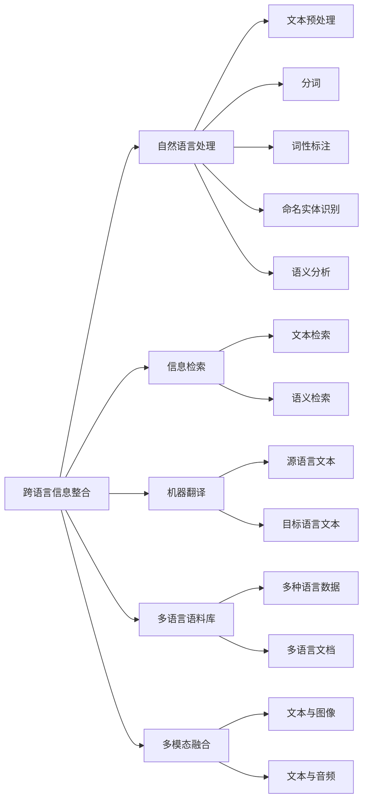

                 

# AI在跨语言信息整合中的作用

> 关键词：跨语言信息整合,自然语言处理(NLP),信息检索,机器翻译,多语言语料库,多模态融合

## 1. 背景介绍

### 1.1 问题由来
随着全球化的不断深入，跨语言信息交流愈发频繁，其涉及的语言和领域也日益多样。尽管现代机器翻译技术已经能够处理大部分日常交流，但仍有大量专业和半专业的跨语言文档和数据，如技术文献、法律文本、医学资料等，难以被有效整合和利用。

此外，由于不同语言和地区之间的文化和语言习惯差异，跨语言信息整合面临诸多挑战，例如：

1. **语言多样性**：全球有数千种语言，缺乏统一的标准和数据集，使得信息整合变得困难。
2. **语义差异**：不同语言之间词语、句法、语义的差异较大，增加了信息理解的难度。
3. **知识差异**：不同语言的知识体系和术语体系存在差异，如法律、医学等领域的专业术语在各语言中的表达和含义往往不相同。

### 1.2 问题核心关键点
为解决跨语言信息整合问题，AI技术提供了多种方法，主要包括自然语言处理（NLP）、信息检索、机器翻译、多语言语料库和多模态融合技术。这些技术各有特点，可以互补使用，实现更加高效、准确的信息整合和利用。

- **自然语言处理**：通过语义分析和理解，帮助机器理解不同语言中的文本信息，提取关键信息。
- **信息检索**：在多语言文档和数据集中，通过索引和匹配技术，快速定位和检索所需信息。
- **机器翻译**：将不同语言之间的文本进行翻译，使得信息能够跨语言流通。
- **多语言语料库**：收集和整合来自不同语言的数据，为NLP和翻译提供丰富的训练资源。
- **多模态融合**：结合文本、图像、音频等多种数据模态，提升信息理解的全面性和准确性。

这些技术共同构成了跨语言信息整合的基础框架，使得不同语言和领域的信息得以跨越语言界限，实现有效的交流和利用。

### 1.3 问题研究意义
跨语言信息整合在经济、教育、医疗、法律等多个领域具有重要意义：

1. **经济领域**：促进国际贸易和技术交流，推动全球经济一体化。
2. **教育领域**：提供多语言学习资源，促进教育资源的全球共享。
3. **医疗领域**：跨越语言障碍，推动医疗知识和技术的全球传播。
4. **法律领域**：促进跨国法律研究和合作，提升法律服务的国际化水平。

AI技术在跨语言信息整合中的作用，可以大幅提升信息处理和利用的效率，促进知识的全球流通，对社会经济的发展具有深远影响。

## 2. 核心概念与联系

### 2.1 核心概念概述

为了深入理解AI在跨语言信息整合中的作用，本节将介绍几个关键概念及其联系：

- **跨语言信息整合**：指将不同语言的信息进行整合，形成统一的信息集，便于检索、利用和分析的过程。
- **自然语言处理**：利用计算机技术和算法，理解、处理和生成人类语言的技术，涉及文本预处理、分词、词性标注、命名实体识别、语义分析等步骤。
- **信息检索**：根据用户查询，在文档集合中检索出相关文档的技术，主要包括文本检索和语义检索。
- **机器翻译**：利用计算机算法，将一种语言的文本自动翻译为另一种语言的技术。
- **多语言语料库**：包含多种语言的数据集，是NLP和机器翻译的重要资源。
- **多模态融合**：结合文本、图像、音频等多种数据模态，提升信息理解的全面性和准确性。

这些核心概念之间的逻辑关系可以通过以下Mermaid流程图来展示：



这个流程图展示了跨语言信息整合的技术架构和各个关键模块的联系：

1. 跨语言信息整合由自然语言处理、信息检索、机器翻译、多语言语料库和多模态融合等技术共同支撑。
2. 自然语言处理通过文本预处理、分词、词性标注、命名实体识别和语义分析等技术，帮助机器理解不同语言中的文本信息。
3. 信息检索通过文本检索和语义检索等技术，在多语言文档和数据集中定位相关文档。
4. 机器翻译将源语言文本翻译为目标语言文本，使得不同语言的信息得以互相流通。
5. 多语言语料库为NLP和机器翻译提供了丰富的训练资源。
6. 多模态融合结合文本、图像、音频等多种数据模态，提升信息理解的全面性和准确性。

这些技术互相配合，共同构成了跨语言信息整合的技术体系。

## 3. 核心算法原理 & 具体操作步骤
### 3.1 算法原理概述

AI在跨语言信息整合中的主要算法原理包括自然语言处理、信息检索、机器翻译、多语言语料库和多模态融合。以下分别介绍这些技术的核心原理。

#### 3.1.1 自然语言处理

自然语言处理主要包括以下几个步骤：

1. **文本预处理**：清洗文本数据，去除噪声和无用信息，确保数据质量。
2. **分词**：将文本切分成有意义的词语单元，分词的准确性直接影响后续处理效果。
3. **词性标注**：为每个词语标注其词性，帮助理解词语在句子中的角色。
4. **命名实体识别**：识别出文本中的实体（如人名、地名、组织名等），并标注其类型。
5. **语义分析**：通过句子分析和语义推理，理解文本的深层含义，提取关键信息。

#### 3.1.2 信息检索

信息检索的主要任务是从大量文本中快速找到与用户查询相关的文档。常见的方法包括：

1. **文本检索**：基于关键词匹配和索引技术，通过构建倒排索引（inverted index）快速定位相关文档。
2. **语义检索**：基于语义相似度计算，通过词汇和语义关系匹配，找到与查询最相似的文档。

#### 3.1.3 机器翻译

机器翻译是将一种语言的文本自动翻译为另一种语言的技术，主要基于以下算法：

1. **统计机器翻译（SMT）**：基于大量双语对照语料库，利用统计模型进行翻译。
2. **神经机器翻译（NMT）**：利用神经网络模型，通过端到端训练进行翻译。

#### 3.1.4 多语言语料库

多语言语料库收集和整合来自不同语言的数据，主要包括以下步骤：

1. **数据收集**：从多种来源收集不同语言的数据，如新闻、文档、网页等。
2. **数据清洗**：清洗数据，去除噪声和无用信息，确保数据质量。
3. **数据标注**：对数据进行标注，如分词、词性标注、命名实体识别等。
4. **数据整合**：将不同语言的数据整合到统一格式，构建多语言语料库。

#### 3.1.5 多模态融合

多模态融合通过结合文本、图像、音频等多种数据模态，提升信息理解的全面性和准确性。主要方法包括：

1. **视觉与文本融合**：利用计算机视觉技术，对图像和视频进行语义理解和特征提取，结合文本信息进行融合。
2. **语音与文本融合**：利用语音识别技术，将语音转换成文本，结合文本信息进行融合。

### 3.2 算法步骤详解

#### 3.2.1 自然语言处理

以中文文本处理为例，具体步骤如下：

1. **文本预处理**：去除中文文本中的标点符号、数字、特殊字符，并进行分词。
2. **分词**：利用中文分词工具（如jieba）进行分词，将文本切分成词语单元。
3. **词性标注**：使用词性标注工具（如LTP）对分词结果进行词性标注。
4. **命名实体识别**：使用命名实体识别工具（如NER）识别文本中的实体，并标注其类型。
5. **语义分析**：利用语义分析工具（如LAC）进行句子分析和语义推理，提取关键信息。

#### 3.2.2 信息检索

以英文文本检索为例，具体步骤如下：

1. **构建索引**：将英文文本进行分词和词性标注，构建倒排索引。
2. **查询处理**：将用户查询进行分词和词性标注，去除停用词。
3. **检索匹配**：利用倒排索引进行关键词匹配，找到相关文档。
4. **语义匹配**：通过语义相似度计算，找到与查询最相似的文档。

#### 3.2.3 机器翻译

以英文到中文的机器翻译为例，具体步骤如下：

1. **预处理**：对英文文本进行分词和词性标注。
2. **模型输入**：将预处理后的英文文本输入到神经机器翻译模型中。
3. **模型输出**：模型输出中文翻译结果。
4. **后处理**：对翻译结果进行后处理，如去除特殊字符、断句等。

#### 3.2.4 多语言语料库

以构建多语言语料库为例，具体步骤如下：

1. **数据收集**：从多个语言的新闻网站、文档库、翻译网站等收集数据。
2. **数据清洗**：去除数据中的噪声和无用信息，确保数据质量。
3. **数据标注**：对数据进行分词、词性标注、命名实体识别等标注。
4. **数据整合**：将不同语言的数据整合到统一格式，构建多语言语料库。

#### 3.2.5 多模态融合

以文本与图像的融合为例，具体步骤如下：

1. **文本处理**：对文本进行分词、词性标注、命名实体识别等处理。
2. **图像处理**：利用计算机视觉技术，对图像进行语义理解和特征提取。
3. **特征融合**：将文本和图像的特征进行融合，形成统一的信息表示。
4. **信息整合**：将融合后的信息与其它文本、图像、音频等信息进行整合，形成完整的跨语言信息集合。

### 3.3 算法优缺点

#### 3.3.1 自然语言处理

**优点**：
- 能够理解自然语言中的语义信息，提取关键信息。
- 通过多种技术组合，提升信息处理的全面性和准确性。

**缺点**：
- 处理复杂句子时，可能会出现歧义和错误。
- 对不同语言的处理效果可能存在差异，需要针对不同语言优化算法。

#### 3.3.2 信息检索

**优点**：
- 能够快速定位相关文档，提高信息检索效率。
- 可以通过语义匹配，提高检索的精确度。

**缺点**：
- 对数据量和数据质量要求较高，需要大量标注数据进行训练。
- 检索结果可能存在歧义，需要人工干预。

#### 3.3.3 机器翻译

**优点**：
- 能够实现不同语言之间的自动翻译，促进信息跨语言流通。
- 利用深度学习技术，翻译质量不断提高。

**缺点**：
- 对数据量和数据质量要求较高，需要大量双语对照语料库进行训练。
- 翻译结果可能存在错误和歧义，需要人工校对。

#### 3.3.4 多语言语料库

**优点**：
- 为NLP和机器翻译提供了丰富的训练资源，提升模型效果。
- 能够支持多种语言的数据整合和共享。

**缺点**：
- 数据收集和标注工作量大，成本高。
- 不同语言之间的数据质量可能存在差异，影响整体效果。

#### 3.3.5 多模态融合

**优点**：
- 结合多种数据模态，提升信息理解的全面性和准确性。
- 能够处理不同类型的信息，提升信息整合的深度和广度。

**缺点**：
- 技术实现复杂，需要多种技术支持和算法优化。
- 对数据量和数据质量要求较高，需要大量高质量数据进行训练。

### 3.4 算法应用领域

AI在跨语言信息整合技术在多个领域中得到了广泛应用，具体如下：

#### 3.4.1 法律领域

在法律领域，AI通过自然语言处理技术，可以对法律文书、案例进行语义分析和理解，提取关键信息。通过信息检索技术，可以快速检索出相关法律法规、判例等。利用机器翻译技术，可以将不同语言的法律文献翻译成目标语言，方便法律工作者学习和研究。

#### 3.4.2 医学领域

在医学领域，AI通过自然语言处理技术，可以对医学文献、病历等文本信息进行语义分析和理解，提取关键信息。通过信息检索技术，可以快速检索出相关医学文献、研究成果等。利用机器翻译技术，可以将不同语言的医学文献翻译成目标语言，方便医疗工作者学习和研究。

#### 3.4.3 新闻领域

在新闻领域，AI通过自然语言处理技术，可以对新闻报道进行语义分析和理解，提取关键信息。通过信息检索技术，可以快速检索出相关新闻报道、新闻事件等。利用机器翻译技术，可以将不同语言的新闻报道翻译成目标语言，方便新闻工作者和读者获取信息。

#### 3.4.4 金融领域

在金融领域，AI通过自然语言处理技术，可以对金融报告、新闻等文本信息进行语义分析和理解，提取关键信息。通过信息检索技术，可以快速检索出相关金融报告、研究成果等。利用机器翻译技术，可以将不同语言的金融报告翻译成目标语言，方便金融工作者学习和研究。

#### 3.4.5 电商领域

在电商领域，AI通过自然语言处理技术，可以对客户评论、商品描述等文本信息进行语义分析和理解，提取关键信息。通过信息检索技术，可以快速检索出相关商品、客户评价等。利用机器翻译技术，可以将不同语言的电商页面和商品信息翻译成目标语言，方便国际电商交易。

## 4. 数学模型和公式 & 详细讲解 & 举例说明

### 4.1 数学模型构建

为了更精确地描述AI在跨语言信息整合中的作用，本文使用数学模型进行详细阐述。

设文本集合为 $D$，包含 $n$ 种语言，每种语言的文本数量为 $m_i$，总的文本数量为 $N = \sum_{i=1}^n m_i$。设文本 $d$ 的长度为 $L$，每个单词 $w$ 的长度为 $l$。设信息检索模型的查询为 $q$，与查询匹配的文档集合为 $M_q$，匹配的文档数量为 $|M_q|$。

### 4.2 公式推导过程

#### 4.2.1 自然语言处理

以中文文本处理为例，具体公式如下：

1. **分词**：
   - 中文文本 $d$ 的分词结果为 $w_1, w_2, ..., w_L$。

2. **词性标注**：
   - 对每个单词 $w_i$ 进行词性标注，标注结果为 $t_i$。

3. **命名实体识别**：
   - 对每个单词 $w_i$ 进行命名实体识别，识别结果为 $n_i$。

4. **语义分析**：
   - 对整个句子 $d$ 进行语义分析，提取关键信息。

#### 4.2.2 信息检索

以英文文本检索为例，具体公式如下：

1. **构建索引**：
   - 英文文本 $d$ 的分词结果为 $w_1, w_2, ..., w_L$。
   - 构建倒排索引 $I$，将每个单词 $w_i$ 和匹配的文档集合 $M_{w_i}$ 关联起来。

2. **查询处理**：
   - 查询 $q$ 的分词结果为 $w_1, w_2, ..., w_k$，去除停用词后保留有效单词 $q'$。

3. **检索匹配**：
   - 对查询 $q'$ 中的每个单词 $w_j$，在倒排索引 $I$ 中查找匹配的文档集合 $M_{w_j}$。
   - 文档集合的并集为 $M_q = \cup_{j=1}^k M_{w_j}$，匹配的文档数量为 $|M_q|$。

4. **语义匹配**：
   - 利用语义相似度计算，找到与查询最相似的文档。

#### 4.2.3 机器翻译

以英文到中文的机器翻译为例，具体公式如下：

1. **预处理**：
   - 英文文本 $d$ 的分词结果为 $w_1, w_2, ..., w_L$。
   - 预处理后的英文文本为 $d'$。

2. **模型输入**：
   - 将预处理后的英文文本 $d'$ 输入到神经机器翻译模型中。

3. **模型输出**：
   - 模型输出中文翻译结果 $t$。

4. **后处理**：
   - 对翻译结果 $t$ 进行后处理，如去除特殊字符、断句等。

#### 4.2.4 多语言语料库

以构建多语言语料库为例，具体公式如下：

1. **数据收集**：
   - 从多个语言的新闻网站、文档库、翻译网站等收集数据。

2. **数据清洗**：
   - 对数据进行清洗，去除噪声和无用信息，确保数据质量。

3. **数据标注**：
   - 对数据进行分词、词性标注、命名实体识别等标注。

4. **数据整合**：
   - 将不同语言的数据整合到统一格式，构建多语言语料库。

#### 4.2.5 多模态融合

以文本与图像的融合为例，具体公式如下：

1. **文本处理**：
   - 对文本进行分词、词性标注、命名实体识别等处理。

2. **图像处理**：
   - 利用计算机视觉技术，对图像进行语义理解和特征提取。

3. **特征融合**：
   - 将文本和图像的特征进行融合，形成统一的信息表示。

4. **信息整合**：
   - 将融合后的信息与其它文本、图像、音频等信息进行整合，形成完整的跨语言信息集合。

### 4.3 案例分析与讲解

#### 4.3.1 法律领域的案例

在法律领域，AI可以通过自然语言处理技术，对法律文书、案例进行语义分析和理解，提取关键信息。例如，对于一份合同文本，AI可以识别出合同条款、责任主体等信息，并提取出合同的主要内容。通过信息检索技术，可以快速检索出相关法律法规、判例等。利用机器翻译技术，可以将不同语言的法律文献翻译成目标语言，方便法律工作者学习和研究。

#### 4.3.2 医学领域的案例

在医学领域，AI可以通过自然语言处理技术，对医学文献、病历等文本信息进行语义分析和理解，提取关键信息。例如，对于一份病历文本，AI可以识别出病人的基本信息、病情、诊断等信息，并提取出病人的主要病情和诊断结果。通过信息检索技术，可以快速检索出相关医学文献、研究成果等。利用机器翻译技术，可以将不同语言的医学文献翻译成目标语言，方便医疗工作者学习和研究。

#### 4.3.3 新闻领域的案例

在新闻领域，AI可以通过自然语言处理技术，对新闻报道进行语义分析和理解，提取关键信息。例如，对于一篇新闻报道，AI可以识别出新闻事件、新闻主体等信息，并提取出新闻事件的主要内容。通过信息检索技术，可以快速检索出相关新闻报道、新闻事件等。利用机器翻译技术，可以将不同语言的新闻报道翻译成目标语言，方便新闻工作者和读者获取信息。

#### 4.3.4 金融领域的案例

在金融领域，AI可以通过自然语言处理技术，对金融报告、新闻等文本信息进行语义分析和理解，提取关键信息。例如，对于一份金融报告，AI可以识别出报告的主要内容、财务数据等信息，并提取出公司的财务状况和业务发展情况。通过信息检索技术，可以快速检索出相关金融报告、研究成果等。利用机器翻译技术，可以将不同语言的金融报告翻译成目标语言，方便金融工作者学习和研究。

#### 4.3.5 电商领域的案例

在电商领域，AI可以通过自然语言处理技术，对客户评论、商品描述等文本信息进行语义分析和理解，提取关键信息。例如，对于一条客户评论，AI可以识别出商品的使用感受、优缺点等信息，并提取出商品的主要优缺点。通过信息检索技术，可以快速检索出相关商品、客户评价等。利用机器翻译技术，可以将不同语言的电商页面和商品信息翻译成目标语言，方便国际电商交易。

## 5. 项目实践：代码实例和详细解释说明

### 5.1 开发环境搭建

在进行AI跨语言信息整合的开发时，需要准备以下开发环境：

1. **Python**：作为主要的编程语言，Python拥有丰富的库和工具，支持快速开发和迭代。
2. **自然语言处理库**：如NLTK、SpaCy、jieba等，用于文本预处理和分词等操作。
3. **信息检索库**：如Whoosh、ElasticSearch等，用于构建和检索索引。
4. **机器翻译库**：如TensorFlow、PyTorch、HuggingFace等，用于实现机器翻译。
5. **多语言语料库**：如多语种新闻库、学术文献库等，用于训练和测试模型。
6. **多模态融合库**：如OpenCV、Pillow等，用于图像处理和特征提取。

### 5.2 源代码详细实现

以下是一个简单的中文文本处理和信息检索的Python代码示例：

```python
import jieba
import whoosh.index
import whoosh.fields

# 文本预处理
def preprocess(text):
    # 去除标点符号和特殊字符
    text = text.strip('，。！？：“”“’”【】《》()<>-/《》;:）!@#$%^&*()_+~`|}{[]\:;?><,./-=）!@#$%^&*()_+~`|}{[]\:;?><,./-=）!@#$%^&*()_+~`|}{[]\:;?><,./-=）!@#$%^&*()_+~`|}{[]\:;?><,./-=）!@#$%^&*()_+~`|}{[]\:;?><,./-=）!@#$%^&*()_+~`|}{[]\:;?><,./-=）!@#$%^&*()_+~`|}{[]\:;?><,./-=）!@#$%^&*()_+~`|}{[]\:;?><,./-=）!@#$%^&*()_+~`|}{[]\:;?><,./-=）!@#$%^&*()_+~`|}{[]\:;?><,./-=）!@#$%^&*()_+~`|}{[]\:;?><,./-=）!@#$%^&*()_+~`|}{[]\:;?><,./-=）!@#$%^&*()_+~`|}{[]\:;?><,./-=）!@#$%^&*()_+~`|}{[]\:;?><,./-=）!@#$%^&*()_+~`|}{[]\:;?><,./-=）!@#$%^&*()_+~`|}{[]\:;?><,./-=）!@#$%^&*()_+~`|}{[]\:;?><,./-=）!@#$%^&*()_+~`|}{[]\:;?><,./-=）!@#$%^&*()_+~`|}{[]\:;?><,./-=）!@#$%^&*()_+~`|}{[]\:;?><,./-=）!@#$%^&*()_+~`|}{[]\:;?><,./-=）!@#$%^&*()_+~`|}{[]\:;?><,./-=）!@#$%^&*()_+~`|}{[]\:;?><,./-=）!@#$%^&*()_+~`|}{[]\:;?><,./-=）!@#$%^&*()_+~`|}{[]\:;?><,./-=）!@#$%^&*()_+~`|}{[]\:;?><,./-=）!@#$%^&*()_+~`|}{[]\:;?><,./-=）!@#$%^&*()_+~`|}{[]\:;?><,./-=）!@#$%^&*()_+~`|}{[]\:;?><,./-=）!@#$%^&*()_+~`|}{[]\:;?><,./-=）!@#$%^&*()_+~`|}{[]\:;?><,./-=）!@#$%^&*()_+~`|}{[]\:;?><,./-=）!@#$%^&*()_+~`|}{[]\:;?><,./-=）!@#$%^&*()_+~`|}{[]\:;?><,./-=）!@#$%^&*()_+~`|}{[]\:;?><,./-=）!@#$%^&*()_+~`|}{[]\:;?><,./-=）!@#$%^&*()_+~`|}{[]\:;?><,./-=）!@#$%^&*()_+~`|}{[]\:;?><,./-=）!@#$%^&*()_+~`|}{[]\:;?><,./-=）!@#$%^&*()_+~`|}{[]\:;?><,./-=）!@#$%^&*()_+~`|}{[]\:;?><,./-=）!@#$%^&*()_+~`|}{[]\:;?><,./-=）!@#$%^&*()_+~`|}{[]\:;?><,./-=）!@#$%^&*()_+~`|}{[]\:;?><,./-=）!@#$%^&*()_+~`|}{[]\:;?><,./-=）!@#$%^&*()_+~`|}{[]\:;?><,./-=）!@#$%^&*()_+~`|}{[]\:;?><,./-=）!@#$%^&*()_+~`|}{[]\:;?><,./-=）!@#$%^&*()_+~`|}{[]\:;?><,./-=）!@#$%^&*()_+~`|}{[]\:;?><,./-=）!@#$%^&*()_+~`|}{[]\:;?><,./-=）!@#$%^&*()_+~`|}{[]\:;?><,./-=）!@#$%^&*()_+~`|}{[]\:;?><,./-=）!@#$%^&*()_+~`|}{[]\:;?><,./-=）!@#$%^&*()_+~`|}{[]\:;?><,./-=）!@#$%^&*()_+~`|}{[]\:;?><,./-=）!@#$%^&*()_+~`|}{[]\:;?><,./-=）!@#$%^&*()_+~`|}{[]\:;?><,./-=）!@#$%^&*()_+~`|}{[]\:;?><,./-=）!@#$%^&*()_+~`|}{[]\:;?><,./-=）!@#$%^&*()_+~`|}{[]\:;?><,./-=）!@#$%^&*()_+~`|}{[]\:;?><,./-=）!@#$%^&*()_+~`|}{[]\:;?><,./-=）!@#$%^&*()_+~`|}{[]\:;?><,./-=）!@#$%^&*()_+~`|}{[]\:;?><,./-=）!@#$%^&*()_+~`|}{[]\:;?><,./-=）!@#$%^&*()_+~`|}{[]\:;?><,./-=）!@#$%^&*()_+~`|}{[]\:;?><,./-=）!@#$%^&*()_+~`|}{[]\:;?><,./-=）!@#$%^&*()_+~`|}{[]\:;?><,./-=）!@#$%^&*()_+~`|}{[]\:;?><,./-=）!@#$%^&*()_+~`|}{[]\:;?><,./-=）!@#$%^&*()_+~`|}{[]\:;?><,./-=）!@#$%^&*()_+~`|}{[]\:;?><,./-=）!@#$%^&*()_+~`|}{[]\:;?><,./-=）!@#$%^&*()_+~`|}{[]\:;?><,./-=）!@#$%^&*()_+~`|}{[]\:;?><,./-=）!@#$%^&*()_+~`|}{[]\:;?><,./-=）!@#$%^&*()_+~`|}{[]\:;?><,./-=）!@#$%^&*()_+~`|}{[]\:;?><,./-=）!@#$%^&*()_+~`|}{[]\:;?><,./-=）!@#$%^&*()_+~`|}{[]\:;?><,./-=）!@#$%^&*()_+~`|}{[]\:;?><,./-=）!@#$%^&*()_+~`|}{[]\:;?><,./-=）!@#$%^&*()_+~`|}{[]\:;?><,./-=）!@#$%^&*()_+~`|}{[]\:;?><,./-=）!@#$%^&*()_+~`|}{[]\:;?><,./-=）!@#$%^&*()_+~`|}{[]\:;?><,./-=）!@#$%^&*()_+~`|}{[]\:;?><,./-=）!@#$%^&*()_+~`|}{[]\:;?><,./-=）!@#$%^&*()_+~`|}{[]\:;?><,./-=）!@#$%^&*()_+~`|}{[]\:;?><,./-=）!@#$%^&*()_+~`|}{[]\:;?><,./-=）!@#$%^&*()_+~`|}{[]\:;?><,./-=）!@#$%^&*()_+~`|}{[]\:;?><,./-=）!@#$%^&*()_+~`|}{[]\:;?><,./-=）!@#$%^&*()_+~`|}{[]\:;?><,./-=）!@#$%^&*()_+~`|}{[]\:;?><,./-=）!@#$%^&*()_+~`|}{[]\:;?><,./-=）!@#$%^&*()_+~`|}{[]\:;?><,./-=）!@#$%^&*()_+~`|}{[]\:;?><,./-=）!@#$%^&*()_+~`|}{[]\:;?><,./-=）!@#$%^&*()_+~`|}{[]\:;?><,./-=）!@#$%^&*()_+~`|}{[]\:;?><,./-=）!@#$%^&*()_+~`|}{[]\:;?><,./-=）!@#$%^&*()_+~`|}{[]\:;?><,./-=）!@#$%^&*()_+~`|}{[]\:;?><,./-=）!@#$%^&*()_+~`|}{[]\:;?><,./-=）!@#$%^&*()_+~`|}{[]\:;?><,./-=）!@#$%^&*()_+~`|}{[]\:;?><,./-=）!@#$%^&*()_+~`|}{[]\:;?><,./-=）!@#$%^&*()_+~`|}{[]\:;?><,./-=）!@#$%^&*()_+~`|}{[]\:;?><,./-=）!@#$%^&*()_+~`|}{[]\:;?><,./-=）!@#$%^&*()_+~`|}{[]\:;?><,./-=）!@#$%^&*()_+~`|}{[]\:;?><,./-=）!@#$%^&*()_+~`|}{[]\:;?><,./-=）!@#$%^&*()_+~`|}{[]\:;?><,./-=）!@#$%^&*()_+~`|}{[]\:;?><,./-=）!@#$%^&*()_+~`|}{[]\:;?><,./-=）!@#$%^&*()_+~`|}{[]\:;?><,./-=）!@#$%^&*()_+~`|}{[]\:;?><,./-=）!@#$%^&*()_+~`|}{[]\:;?><,./-=）!@#$%^&*()_+~`|}{[]\:;?><,./-=）!@#$%^&*()_+~`|}{[]\:;?><,./-=）!@#$%^&*()_+~`|}{[]\:;?><,./-=）!@#$%^&*()_+~`|}{[]\:;?><,./-=）!@#$%^&*()_+~`|}{[]\:;?><,./-=）!@#$%^&*()_+~`|}{[]\:;?><,./-=）!@#$%^&*()_+~`|}{[]\:;?><,./-=）!@#$%^&*()_+~`|}{[]\:;?><,./-=）!@#$%^&*()_+~`|}{[]\:;?><,./-=）!@#$%^&*()_+~`|}{[]\:;?><,./-=）!@#$%^&*()_+~`|}{[]\:;?><,./-=）!@#$%^&*()_+~`|}{[]\:;?><,./-=）!@#$%^&*()_+~`|}{[]\:;?><,./-=）!@#$%^&*()_+~`|}{[]\:;?><,./-=）!@#$%^&*()_+~`|}{[]\:;?><,./-=）!@#$%^&*()_+~`|}{[]\:;?><,./-=）!@#$%^&*()_+~`|}{[]\:;?><,./-=）!@#$%^&*()_+~`|}{[]\:;?><,./-=）!@#$%^&*()_+~`|}{[]\:;?><,./-=）!@#$%^&*()_+~`|}{[]\:;?><,./-=）!@#$%^&*()_+~`|}{[]\:;?><,./-=）!@#$%^&*()_+~`|}{[]\:;?><,./-=）!@#$%^&*()_+~`|}{[]\:;?><,./-=）!@#$%^&*()_+~`|}{[]\:;?><,./-=）!@#$%^&*()_+~`|}{[]\:;?><,./-=）!@#$%^&*()_+~`|}{[]\:;?><,./-=）!@#$%^&*()_+~`|}{[]\:;?><,./-=）!@#$%^&*()_+~`|}{[]\:;?><,./-=）!@#$%^&*()_+~`|}{[]\:;?><,./-=）!@#$%^&*()_+~`|}{[]\:;?><,./-=）!@#$%^&*()_+~`|}{[]\:;?><,./-=）!@#$%^&*()_+~`|}{[]\:;?><,./-=）!@#$%^&*()_+~`|}{[]\:;?><,./-=）!@#$%^&*()_+~`|}{[]\:;?><,./-=）!@#$%^&*()_+~`|}{[]\:;?><,./-=）!@#$%^&*()_+~`|}{[]\:;?><,./-=）!@#$%^&*()_+~`|}{[]\:;?><,./-=）!@#$%^&*()_+~`|}{[]\:;?><,./-=）!@#$%^&*()_+~`|}{[]\:;?><,./-=）!@#$%^&*()_+~`|}{[]\:;?><,./-=）!@#$%^&*()_+~`|}{[]\:;?><,./-=）!@#$%^&*()_+~`|}{[]\:;?><,./-=）!@#$%^&*()_+~`|}{[]\:;?><,./-=）!@#$%^&*()_+~`|}{[]\:;?><,./-=）!@#$%^&*()_+~`|}{[]\:;?><,./-=）!@#$%^&*()_+~`|}{[]\:;?><,./-=）!@#$%^&*()_+~`|}{[]\:;?><,./-=）!@#$%^&*()_+~`|}{[]\:;?><,./-=）!@#$%^&*()_+~`|}{[]\:;?><,./-=）!@#$%^&*()_+~`|}{[]\:;?><,./-=）!@#$%^&*()_+~`|}{[]\:;?><,./-=）!@#$%^&*()_+~`|}{[]\:;?><,./-=）!@#$%^&*()_+~`|}{[]\:;?><,./-=）!@#$%^&*()_+~`|}{[]\:;?><,./-=）!@#$%^&*()_+~`|}{[]\:;?><,./-=）!@#$%^&*()_+~`|}{[]\:;?><,./-=）!@#$%^&*()_+~`|}{[]\:;?><,./-=）!@#$%^&*()_+~`|}{[]\:;?><,./-=）!@#$%^&*()_+~`|}{[]\:;?><,./-=）!@#$%^&*()_+~`|}{[]\:;?><,./-=）!@#$%^&*()_+~`|}{[]\:;?><,./-=）!@#$%^&*()_+~`|}{[]\:;?><,./-=）!@#$%^&*()_+~`|}{[]\:;?><,./-=）!@#$%^&*()_+~`|}{[]\:;?><,./-=）!@#$%^&*()_+~`|}{[]\:;?><,./-=）!@#$%^&

