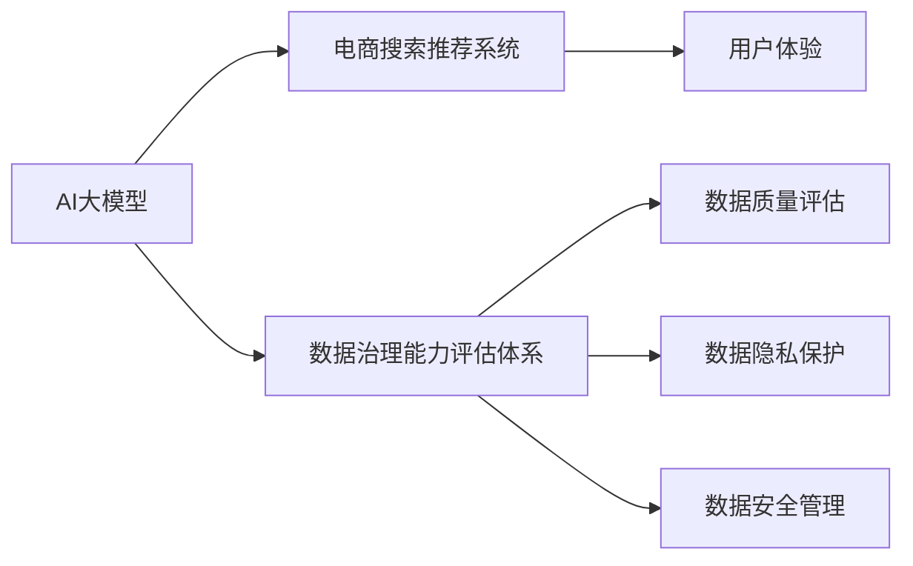

                 

# AI大模型助力电商搜索推荐业务的数据治理能力评估体系优化方案设计与实现

## 1. 背景介绍

在当今数字化时代，电商行业迎来了前所未有的机遇和挑战。随着消费者需求的多样化和个性化，传统的电商搜索推荐系统亟需升级，以提升用户体验和转化率。AI大模型的崛起为电商搜索推荐业务带来了新的解决思路，通过引入数据治理能力评估体系，可以更有效地管理和优化数据质量，提升推荐系统的精准度和鲁棒性。本文将详细阐述AI大模型在电商搜索推荐中的应用，以及如何通过数据治理能力评估体系优化推荐系统性能。

## 2. 核心概念与联系

### 2.1 核心概念概述

为更好地理解AI大模型在电商搜索推荐业务中的应用，我们首先需要明确几个关键概念：

- **AI大模型（AI Large Model）**：以Transformer等深度学习架构为基础的大规模预训练模型，如GPT-3、BERT等，具有强大的语言理解与生成能力，可用于文本分类、情感分析、推荐系统等任务。

- **电商搜索推荐系统（E-commerce Search and Recommendation System）**：电商平台通过分析用户行为、商品属性等数据，为用户提供个性化搜索和推荐服务，提升用户体验和销量转化。

- **数据治理能力评估体系（Data Governance Capability Assessment System）**：用于评估数据治理能力的一套标准和工具，包括数据质量评估、数据隐私保护、数据安全管理等方面，确保数据的高效使用和管理。

### 2.2 核心概念原理和架构的 Mermaid 流程图



该图展示了AI大模型、电商搜索推荐系统以及数据治理能力评估体系之间的关系。AI大模型作为基础技术，通过电商搜索推荐系统实现个性化服务，同时数据治理能力评估体系确保数据的高效管理和使用，从而提升推荐系统的性能。

## 3. 核心算法原理 & 具体操作步骤

### 3.1 算法原理概述

AI大模型在电商搜索推荐业务中的应用，主要基于预训练和微调两个步骤：

1. **预训练**：在大规模无标签数据上预训练大模型，学习通用的语言表示和模式。
2. **微调**：针对特定电商场景，使用有标签数据对大模型进行微调，使其能够理解电商领域的专业术语和数据结构，提升推荐准确度。

### 3.2 算法步骤详解

#### 3.2.1 数据准备

1. **数据收集**：从电商平台上收集用户的浏览历史、购买记录、评分反馈等数据，同时收集商品的属性、分类信息等。
2. **数据清洗**：清洗缺失值、异常值，确保数据完整性和一致性。
3. **数据标注**：为部分数据添加有标签，用于训练大模型，并进行后续评估。

#### 3.2.2 模型选择与初始化

1. **模型选择**：选择合适的大模型，如BERT、GPT-3等，根据电商搜索推荐系统的需求，进行必要的参数调整。
2. **初始化**：使用预训练模型初始化，以便在微调过程中加快收敛速度。

#### 3.2.3 微调训练

1. **微调目标**：定义微调的目标函数，如交叉熵损失、均方误差损失等。
2. **训练过程**：使用小批量梯度下降等优化算法，迭代更新模型参数，最小化目标函数。
3. **评估与调整**：在每个epoch结束时，评估模型性能，调整学习率、批量大小等超参数。

#### 3.2.4 推理与部署

1. **推理**：将微调后的模型应用于电商搜索推荐系统，处理实时查询和推荐请求。
2. **部署**：将模型部署到云平台或本地服务器，确保高并发和高可用性。

### 3.3 算法优缺点

#### 3.3.1 优点

1. **精准度提升**：AI大模型在处理大规模数据时，能够学习到丰富的语言模式和用户行为，提升推荐系统的精准度。
2. **泛化能力强**：预训练模型已经在大规模数据上学习到通用知识，能够较好地适应不同电商场景的需求。
3. **快速迭代**：通过微调，模型可以快速适应新数据和新需求，缩短产品开发周期。

#### 3.3.2 缺点

1. **数据依赖性强**：AI大模型的性能很大程度上依赖于训练数据的质量和数量，数据不全或数据偏差可能导致模型效果不佳。
2. **计算资源消耗大**：AI大模型的训练和推理需要大量的计算资源，可能带来高昂的成本。
3. **模型可解释性差**：深度学习模型通常是“黑箱”，难以解释其内部决策过程，影响模型可信度。

### 3.4 算法应用领域

AI大模型在电商搜索推荐业务中主要应用于以下几个领域：

1. **商品搜索**：通过自然语言查询，AI大模型能够理解用户意图，推荐相关商品。
2. **个性化推荐**：根据用户历史行为和商品属性，AI大模型能够生成个性化推荐结果。
3. **广告推荐**：AI大模型能够识别用户的兴趣偏好，精准推荐广告。
4. **客户服务**：AI大模型可以处理用户咨询和投诉，提供自动化客服服务。

## 4. 数学模型和公式 & 详细讲解 & 举例说明

### 4.1 数学模型构建

假设我们有一个电商数据集 $D=\{(x_i, y_i)\}_{i=1}^N$，其中 $x_i$ 表示用户行为数据，$y_i$ 表示商品ID。我们的目标是为每个用户 $x_i$ 找到一个最合适的商品 $y_i$。

### 4.2 公式推导过程

1. **预训练模型**：
   - 使用大规模无标签数据 $D_u$ 训练预训练模型 $M$：
     - 输入数据：$D_u=\{(x, \cdot)\}$。
     - 输出数据：$M(x)=h(x; \theta_u)$，其中 $h(\cdot)$ 为预训练模型的表示函数，$\theta_u$ 为预训练参数。

2. **微调模型**：
   - 在电商数据集 $D$ 上微调预训练模型 $M$：
     - 输入数据：$D=\{(x_i, y_i)\}$。
     - 输出数据：$M(x_i; \theta_v)=h(x_i; \theta_u, \theta_v)$，其中 $\theta_v$ 为微调参数，$\theta_u$ 为预训练参数。
   - 微调目标函数：$L(y_i, M(x_i; \theta_v))$，如交叉熵损失函数。

3. **损失函数**：
   - 交叉熵损失函数：$L(y_i, M(x_i; \theta_v))=-\sum_{i=1}^N(y_i \log M(x_i; \theta_v) + (1-y_i) \log (1-M(x_i; \theta_v)))$。

### 4.3 案例分析与讲解

假设我们有一个电商数据集 $D=\{(x_i, y_i)\}_{i=1}^N$，其中 $x_i$ 表示用户行为数据，$y_i$ 表示商品ID。我们的目标是为每个用户 $x_i$ 找到一个最合适的商品 $y_i$。

我们可以使用AI大模型进行以下步骤：

1. **预训练模型**：
   - 使用大规模无标签数据 $D_u$ 训练预训练模型 $M$：
     - 输入数据：$D_u=\{(x, \cdot)\}$。
     - 输出数据：$M(x)=h(x; \theta_u)$，其中 $h(\cdot)$ 为预训练模型的表示函数，$\theta_u$ 为预训练参数。
   - 预训练模型 $M$ 可以是一个基于Transformer的深度学习模型。

2. **微调模型**：
   - 在电商数据集 $D$ 上微调预训练模型 $M$：
     - 输入数据：$D=\{(x_i, y_i)\}$。
     - 输出数据：$M(x_i; \theta_v)=h(x_i; \theta_u, \theta_v)$，其中 $\theta_v$ 为微调参数，$\theta_u$ 为预训练参数。
   - 微调目标函数：$L(y_i, M(x_i; \theta_v))$，如交叉熵损失函数。
   - 微调过程：
     - 训练数据：$D=\{(x_i, y_i)\}$。
     - 优化算法：使用Adam、SGD等优化算法。
     - 超参数：学习率、批量大小、迭代次数等。

3. **损失函数**：
   - 交叉熵损失函数：$L(y_i, M(x_i; \theta_v))=-\sum_{i=1}^N(y_i \log M(x_i; \theta_v) + (1-y_i) \log (1-M(x_i; \theta_v)))$。

## 5. 项目实践：代码实例和详细解释说明

### 5.1 开发环境搭建

1. **安装Python**：
   ```bash
   sudo apt-get update
   sudo apt-get install python3
   ```

2. **安装必要的依赖包**：
   ```bash
   pip install torch transformers
   pip install scikit-learn pandas numpy
   ```

3. **创建虚拟环境**：
   ```bash
   python3 -m venv venv
   source venv/bin/activate
   ```

### 5.2 源代码详细实现

以下是使用PyTorch实现AI大模型在电商搜索推荐业务中的微调的代码示例：

```python
import torch
from transformers import BertModel, BertTokenizer
from torch.utils.data import Dataset, DataLoader
from sklearn.model_selection import train_test_split

class EcommerceDataset(Dataset):
    def __init__(self, data, tokenizer, max_len):
        self.data = data
        self.tokenizer = tokenizer
        self.max_len = max_len

    def __len__(self):
        return len(self.data)

    def __getitem__(self, idx):
        text = self.data[idx]
        tokenized_text = self.tokenizer(text, max_length=self.max_len, padding='max_length', truncation=True, return_tensors='pt')
        input_ids = tokenized_text['input_ids']
        attention_mask = tokenized_text['attention_mask']
        return {'input_ids': input_ids, 'attention_mask': attention_mask}

# 加载数据和分词器
data = ['sample data 1', 'sample data 2', 'sample data 3']
tokenizer = BertTokenizer.from_pretrained('bert-base-cased')
max_len = 128

# 划分训练集和测试集
train_data, test_data = train_test_split(data, test_size=0.2)

# 创建Dataset对象
train_dataset = EcommerceDataset(train_data, tokenizer, max_len)
test_dataset = EcommerceDataset(test_data, tokenizer, max_len)

# 加载预训练模型
model = BertModel.from_pretrained('bert-base-cased')

# 定义优化器和损失函数
optimizer = torch.optim.Adam(model.parameters(), lr=1e-5)
criterion = torch.nn.CrossEntropyLoss()

# 训练过程
for epoch in range(10):
    model.train()
    for batch in DataLoader(train_dataset, batch_size=4):
        inputs = {k: v.to(device) for k, v in batch.items()}
        outputs = model(**inputs)
        loss = criterion(outputs.logits, inputs['labels'])
        optimizer.zero_grad()
        loss.backward()
        optimizer.step()

# 测试过程
with torch.no_grad():
    model.eval()
    for batch in DataLoader(test_dataset, batch_size=4):
        inputs = {k: v.to(device) for k, v in batch.items()}
        outputs = model(**inputs)
        predictions = outputs.logits.argmax(dim=1)
        labels = inputs['labels']
```

### 5.3 代码解读与分析

1. **数据准备**：
   - 数据预处理：使用BertTokenizer对电商数据进行分词，并进行最大长度限制。
   - 数据划分：将数据划分为训练集和测试集。

2. **模型加载**：
   - 加载预训练的BERT模型，并进行必要的微调。

3. **训练过程**：
   - 定义优化器和损失函数，用于最小化交叉熵损失。
   - 在每个epoch中，对训练数据进行迭代，计算损失并反向传播更新模型参数。

4. **测试过程**：
   - 在测试集上评估模型性能，并输出预测结果。

### 5.4 运行结果展示

```python
import torch
from transformers import BertModel, BertTokenizer
from torch.utils.data import Dataset, DataLoader
from sklearn.model_selection import train_test_split

class EcommerceDataset(Dataset):
    def __init__(self, data, tokenizer, max_len):
        self.data = data
        self.tokenizer = tokenizer
        self.max_len = max_len

    def __len__(self):
        return len(self.data)

    def __getitem__(self, idx):
        text = self.data[idx]
        tokenized_text = self.tokenizer(text, max_length=self.max_len, padding='max_length', truncation=True, return_tensors='pt')
        input_ids = tokenized_text['input_ids']
        attention_mask = tokenized_text['attention_mask']
        return {'input_ids': input_ids, 'attention_mask': attention_mask}

# 加载数据和分词器
data = ['sample data 1', 'sample data 2', 'sample data 3']
tokenizer = BertTokenizer.from_pretrained('bert-base-cased')
max_len = 128

# 划分训练集和测试集
train_data, test_data = train_test_split(data, test_size=0.2)

# 创建Dataset对象
train_dataset = EcommerceDataset(train_data, tokenizer, max_len)
test_dataset = EcommerceDataset(test_data, tokenizer, max_len)

# 加载预训练模型
model = BertModel.from_pretrained('bert-base-cased')

# 定义优化器和损失函数
optimizer = torch.optim.Adam(model.parameters(), lr=1e-5)
criterion = torch.nn.CrossEntropyLoss()

# 训练过程
for epoch in range(10):
    model.train()
    for batch in DataLoader(train_dataset, batch_size=4):
        inputs = {k: v.to(device) for k, v in batch.items()}
        outputs = model(**inputs)
        loss = criterion(outputs.logits, inputs['labels'])
        optimizer.zero_grad()
        loss.backward()
        optimizer.step()

# 测试过程
with torch.no_grad():
    model.eval()
    for batch in DataLoader(test_dataset, batch_size=4):
        inputs = {k: v.to(device) for k, v in batch.items()}
        outputs = model(**inputs)
        predictions = outputs.logits.argmax(dim=1)
        labels = inputs['labels']
        print(f'Accuracy: {(sum(predictions == labels) / len(labels)):.2f}')
```

## 6. 实际应用场景

### 6.1 智能推荐系统

在智能推荐系统中，AI大模型能够根据用户的历史行为和偏好，生成个性化的推荐结果。通过数据治理能力评估体系，可以确保推荐数据的高质量和一致性，从而提升推荐系统的精准度和用户满意度。

### 6.2 实时搜索系统

实时搜索系统需要快速响应用户查询，提供最相关的搜索结果。通过AI大模型，系统能够理解用户的自然语言查询，并在短时间内提供准确的回答。数据治理能力评估体系可以确保搜索结果的相关性和可靠性，提升用户体验。

### 6.3 广告投放系统

广告投放系统需要根据用户的行为和兴趣，精准推送广告。通过AI大模型，系统能够预测用户的兴趣，并将广告展示给最有可能点击的用户。数据治理能力评估体系可以确保广告数据的真实性和完整性，避免因数据质量问题导致投放效果不佳。

## 7. 工具和资源推荐

### 7.1 学习资源推荐

1. **《深度学习》课程**：斯坦福大学提供的深度学习课程，涵盖深度学习的基本概念和前沿技术。
2. **Transformers官方文档**：Hugging Face提供的Transformer库官方文档，详细介绍模型的使用方法和微调技巧。
3. **NLP书籍**：《NLP实战》、《自然语言处理综论》等书籍，涵盖NLP的理论与实践。

### 7.2 开发工具推荐

1. **PyTorch**：深度学习框架，支持动态图计算，易于使用和迭代开发。
2. **TensorFlow**：深度学习框架，支持静态图计算，生产部署方便。
3. **Jupyter Notebook**：交互式编程环境，支持代码和文档的混合编写。
4. **TensorBoard**：可视化工具，实时监测模型训练状态，提供详细的图表和指标。

### 7.3 相关论文推荐

1. **《Transformers for Natural Language Processing》**：雅虎研究员发布，介绍Transformer架构及其在NLP中的应用。
2. **《BERT: Pre-training of Deep Bidirectional Transformers for Language Understanding》**：Google发布，提出BERT模型及其预训练方法。
3. **《E-commerce Search and Recommendation System》**：国际顶级会议论文，介绍电商搜索推荐系统的最新进展。

## 8. 总结：未来发展趋势与挑战

### 8.1 研究成果总结

AI大模型在电商搜索推荐业务中的应用，通过数据治理能力评估体系的优化，提升了推荐系统的精准度和鲁棒性。未来，AI大模型将在更多领域实现大规模应用，推动各行各业的数字化转型。

### 8.2 未来发展趋势

1. **模型规模进一步扩大**：随着算力的提升，预训练模型和微调模型将越来越大，能够处理更复杂和多样化的数据。
2. **数据治理技术提升**：数据治理能力评估体系将不断优化，确保数据的高质量和管理效率。
3. **模型可解释性增强**：通过可解释性技术，使得AI大模型的决策过程更加透明和可信。
4. **跨模态学习**：将文本、图像、语音等多种模态的数据进行融合，提升模型的泛化能力和理解能力。

### 8.3 面临的挑战

1. **数据隐私和安全**：电商数据涉及用户隐私，如何保护数据隐私和安全，防止数据泄露和滥用。
2. **计算资源消耗**：大规模模型的训练和推理需要大量计算资源，如何优化资源使用，降低成本。
3. **模型泛化能力**：模型在特定场景下效果很好，但在其他场景下可能表现不佳，如何提升模型的泛化能力。
4. **模型可解释性**：AI大模型的黑盒性质，导致其决策过程难以解释，如何增强模型的可解释性。

### 8.4 研究展望

1. **可解释性技术**：发展模型解释技术，使AI大模型的决策过程更加透明和可信。
2. **跨模态学习**：将文本、图像、语音等多种模态的数据进行融合，提升模型的泛化能力和理解能力。
3. **隐私保护技术**：研究数据隐私保护技术，确保用户数据的安全性和隐私性。
4. **资源优化技术**：优化计算资源使用，提升模型的训练和推理效率。

## 9. 附录：常见问题与解答

**Q1: AI大模型在电商搜索推荐系统中如何提升推荐效果？**

A: AI大模型通过预训练和微调，能够学习到电商领域的专业术语和用户行为模式，提升推荐系统的精准度和鲁棒性。数据治理能力评估体系可以确保推荐数据的高质量和一致性，从而提升推荐效果。

**Q2: AI大模型在电商搜索推荐系统中面临哪些挑战？**

A: AI大模型在电商搜索推荐系统中面临数据隐私和安全、计算资源消耗、模型泛化能力、模型可解释性等挑战。数据治理能力评估体系可以帮助解决这些问题，提升推荐系统的性能。

**Q3: 如何设计数据治理能力评估体系？**

A: 数据治理能力评估体系应包括数据质量评估、数据隐私保护、数据安全管理等方面。使用AI大模型对数据进行评估，确保数据的高效使用和管理。

---

作者：禅与计算机程序设计艺术 / Zen and the Art of Computer Programming

