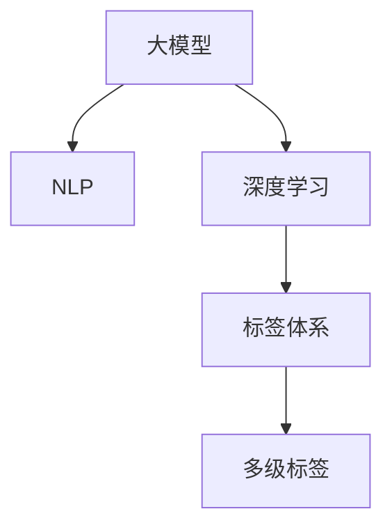

                 

# AI大模型在电商商品标签体系自动构建中的实践

> 关键词：大模型, 商品标签体系, 自动构建, 电商, 机器学习, 自然语言处理, 深度学习

## 1. 背景介绍

随着电子商务平台的迅速发展，商品标签体系的构建已成为电商平台实现精准推荐、个性化营销和搜索优化等业务功能的关键环节。传统的手工构建标签体系不仅耗时耗力，而且难以覆盖商品的多样性，容易忽略商品之间的关联性。而使用大模型自动构建商品标签体系，可以大幅提高效率和准确性，让标签体系更加全面、精细，更好地满足用户需求。

### 1.1 问题由来

在电商平台中，商品标签体系扮演着极为重要的角色。它不仅影响着商品的搜索和推荐效果，还对用户的行为分析和个性化服务起着关键作用。电商平台的商品类别繁多，描述各异，传统的标签体系构建方法如人工标注、规则提取等，由于无法涵盖所有商品，且容易受限于标注人员的主观判断，往往效果不佳。近年来，随着预训练大模型的兴起，自动构建商品标签体系成为了一种新兴的解决方案。

### 1.2 问题核心关键点

自动构建商品标签体系的核心关键点在于如何有效利用大模型，从海量的商品描述数据中提取出更具代表性和区分度的标签，并构建出层次分明、结构合理的标签体系。

自动构建商品标签体系的关键点包括：
1. **数据预处理**：对商品描述进行清洗、分词、去除停用词等处理，提取有用的特征信息。
2. **模型选择与训练**：选择适合的语言模型，训练模型对商品描述进行编码，提取出有用的语义信息。
3. **标签提取与筛选**：利用模型提取标签，并通过筛选方法去除冗余和无意义的标签。
4. **标签体系构建**：将筛选后的标签组织成层次分明的标签体系，便于搜索和推荐。

## 2. 核心概念与联系

### 2.1 核心概念概述

为更好地理解大模型在电商商品标签体系自动构建中的应用，本节将介绍几个密切相关的核心概念：

- **大模型(Large Language Model, LLM)**：如GPT、BERT等，通过大规模语料预训练得到的语言模型，具备强大的语义理解和生成能力。
- **自然语言处理(Natural Language Processing, NLP)**：涉及文本分析、语言生成、信息抽取等技术，旨在让计算机理解和处理人类语言。
- **深度学习(Deep Learning)**：使用神经网络模型进行非线性特征提取和模式识别，适用于复杂的自然语言处理任务。
- **标签体系(Labeling System)**：用于描述商品特征和类别关系的体系结构，辅助商品搜索、推荐和个性化展示。
- **多级标签(Multilevel Labeling)**：根据标签的重要性和适用范围，构建多层次的标签体系，如商品大类、二级分类和具体属性标签。

这些核心概念之间的逻辑关系可以通过以下Mermaid流程图来展示：



这个流程图展示了大模型与NLP和深度学习的关系，以及标签体系和多级标签的构建流程。

## 3. 核心算法原理 & 具体操作步骤
### 3.1 算法原理概述

大模型在电商商品标签体系自动构建中的基本原理是，通过训练大模型，使其能够从商品描述中自动提取有意义的标签，并构建出层次分明的标签体系。具体来说，包括以下几个步骤：

1. **数据预处理**：对商品描述进行清洗和分词，提取文本特征。
2. **模型训练**：使用大模型对预处理后的商品描述进行编码，提取出语义信息。
3. **标签提取**：利用模型提取标签，并通过筛选去除冗余和无意义的标签。
4. **标签体系构建**：将筛选后的标签组织成层次分明的标签体系，便于搜索和推荐。

### 3.2 算法步骤详解

#### 3.2.1 数据预处理

数据预处理是大模型自动构建商品标签体系的基础步骤，主要包括文本清洗、分词和特征提取等环节。

- **文本清洗**：去除商品描述中的噪声和无用信息，如HTML标签、特殊符号等。
- **分词**：将文本切分成单独的词汇单元，便于后续的特征提取。
- **特征提取**：提取文本中的关键特征，如词汇频率、词性标注、命名实体识别等。

#### 3.2.2 模型训练

模型训练是利用大模型对商品描述进行编码，提取语义信息的过程。

- **模型选择**：选择适合的语言模型，如BERT、GPT等。
- **训练数据**：使用大量标注好的商品描述数据，训练模型进行语义编码。
- **训练目标**：优化模型参数，使得模型能够准确预测商品描述的标签。

#### 3.2.3 标签提取

标签提取是大模型自动构建商品标签体系的核心环节，主要包括以下几个步骤：

- **预测标签**：使用模型对商品描述进行编码，并预测出最可能的标签。
- **标签筛选**：去除重复、低频、无意义的标签，保留高质量的标签。
- **标签聚合**：将同义词、近义词进行合并，简化标签体系。

#### 3.2.4 标签体系构建

标签体系构建是将筛选后的标签组织成层次分明的标签体系，便于搜索和推荐。

- **层次划分**：根据标签的重要性，将标签划分为不同层次，如大类、二级分类和具体属性标签。
- **组织结构**：设计标签体系的结构，如树形结构、层次结构等，便于管理和查询。
- **标签映射**：将标签映射到具体的商品描述上，便于搜索和推荐。

### 3.3 算法优缺点

自动构建商品标签体系的大模型方法具有以下优点：
1. **效率高**：利用大模型的强大语义理解能力，可以快速处理大量商品描述数据，大幅提高构建效率。
2. **覆盖广**：大模型能够处理各种复杂的商品描述，涵盖更多的商品类别和特征。
3. **灵活性高**：标签体系的构建可以灵活调整，满足不同业务需求。

同时，该方法也存在以下缺点：
1. **数据依赖性大**：构建标签体系需要大量标注数据，数据质量直接影响标签体系的效果。
2. **模型复杂度高**：大模型的训练和推理复杂度较高，需要强大的计算资源支持。
3. **可解释性差**：大模型自动提取的标签可能缺乏可解释性，难以理解其内部工作机制。
4. **过度拟合风险**：大模型可能过度拟合训练数据，导致泛化能力不足。

尽管存在这些局限性，但在大规模商品描述数据的支持下，大模型自动构建商品标签体系的方法依然具有广泛的应用前景。未来相关研究的重点在于如何进一步降低对标注数据的依赖，提高模型的泛化能力，同时兼顾可解释性和效率。

### 3.4 算法应用领域

大模型自动构建商品标签体系的方法已经在电商平台中得到了广泛应用，覆盖了商品搜索、推荐、个性化展示等多个领域。

- **商品搜索**：利用标签体系进行商品搜索排序，提高搜索相关性和准确性。
- **推荐系统**：将商品标签映射到推荐算法中，生成个性化的商品推荐结果。
- **个性化展示**：通过标签体系优化商品展示效果，提升用户点击率和购买转化率。
- **广告投放**：利用标签体系进行精准广告投放，提升广告效果和用户点击率。

除了上述这些经典应用外，大模型自动构建商品标签体系还被创新性地应用到更多场景中，如库存管理、供应链优化等，为电商平台带来了更多的价值。

## 4. 数学模型和公式 & 详细讲解 & 举例说明

### 4.1 数学模型构建

大模型自动构建商品标签体系的基本数学模型包括文本编码模型和标签预测模型。

假设商品描述为 $D=\{x_i\}_{i=1}^N$，大模型为 $M_{\theta}$，标签为 $Y=\{y_i\}_{i=1}^N$。则文本编码模型的目标是最小化预测标签与真实标签之间的差异：

$$
\min_{\theta} \sum_{i=1}^N \ell(y_i, M_{\theta}(x_i))
$$

其中 $\ell(y_i, M_{\theta}(x_i))$ 为损失函数，如交叉熵损失。

标签预测模型的输出为每个商品描述 $x_i$ 的标签概率分布 $P_{\theta}(y_i|x_i)$。标签提取过程可通过极大似然估计进行优化：

$$
\min_{\theta} \sum_{i=1}^N \log P_{\theta}(y_i|x_i)
$$

### 4.2 公式推导过程

以下是文本编码模型和标签预测模型的详细推导过程。

#### 4.2.1 文本编码模型

文本编码模型的目标是通过大模型 $M_{\theta}$ 将商品描述 $x_i$ 映射到高维空间中，得到向量表示 $\mathbf{v}_i$：

$$
\mathbf{v}_i = M_{\theta}(x_i)
$$

其中 $M_{\theta}(x_i)$ 为大模型的前向传播过程，包括输入嵌入、自注意力机制、全连接层等。向量 $\mathbf{v}_i$ 可以用于表示商品描述的语义信息。

#### 4.2.2 标签预测模型

标签预测模型的目标是根据向量 $\mathbf{v}_i$ 预测商品描述 $x_i$ 的标签 $y_i$。假设标签集为 $\mathcal{Y}$，标签预测模型可以表示为：

$$
P_{\theta}(y_i|x_i) = \frac{\exp(\mathbf{v}_i^T\mathbf{w}_y)}{\sum_{j \in \mathcal{Y}} \exp(\mathbf{v}_i^T\mathbf{w}_y)}
$$

其中 $\mathbf{w}_y$ 为标签向量，可以通过训练模型得到。

### 4.3 案例分析与讲解

以电商平台上的一个实例进行分析：假设有一批商品描述数据 $D$，大模型 $M_{\theta}$ 已经预训练完成，可以用于标签预测。首先，对每个商品描述 $x_i$ 进行分词和特征提取，得到特征向量 $\mathbf{v}_i$。然后，使用训练好的大模型预测每个商品描述的标签概率分布 $P_{\theta}(y_i|x_i)$。最后，通过筛选和聚合，构建出层次分明的标签体系。

例如，对于一条商品描述“某品牌手机”，大模型可以预测出标签 $y_i = \{手机, 某品牌\}$，并将其映射到标签体系中，最终构建出以下层次标签体系：

- 大类标签：手机
- 品牌标签：某品牌
- 具体属性标签：某品牌手机

## 5. 项目实践：代码实例和详细解释说明
### 5.1 开发环境搭建

在进行电商商品标签体系自动构建的项目实践前，我们需要准备好开发环境。以下是使用Python进行PyTorch开发的环境配置流程：

1. 安装Anaconda：从官网下载并安装Anaconda，用于创建独立的Python环境。

2. 创建并激活虚拟环境：
```bash
conda create -n pytorch-env python=3.8 
conda activate pytorch-env
```

3. 安装PyTorch：根据CUDA版本，从官网获取对应的安装命令。例如：
```bash
conda install pytorch torchvision torchaudio cudatoolkit=11.1 -c pytorch -c conda-forge
```

4. 安装TensorFlow：如果需要支持TF模型，可以通过以下命令进行安装：
```bash
pip install tensorflow
```

5. 安装各类工具包：
```bash
pip install numpy pandas scikit-learn matplotlib tqdm jupyter notebook ipython
```

完成上述步骤后，即可在`pytorch-env`环境中开始项目实践。

### 5.2 源代码详细实现

下面我们以电商平台上的商品标签体系自动构建为例，给出使用Transformers库对BERT模型进行自动构建的PyTorch代码实现。

首先，定义商品标签体系的数据处理函数：

```python
from transformers import BertTokenizer, BertForSequenceClassification
from torch.utils.data import Dataset
import torch

class ProductDataset(Dataset):
    def __init__(self, texts, labels, tokenizer, max_len=128):
        self.texts = texts
        self.labels = labels
        self.tokenizer = tokenizer
        self.max_len = max_len
        
    def __len__(self):
        return len(self.texts)
    
    def __getitem__(self, item):
        text = self.texts[item]
        label = self.labels[item]
        
        encoding = self.tokenizer(text, return_tensors='pt', max_length=self.max_len, padding='max_length', truncation=True)
        input_ids = encoding['input_ids'][0]
        attention_mask = encoding['attention_mask'][0]
        
        # 对标签进行编码
        encoded_label = label2id[label] if label in label2id else label2id['O']
        label = torch.tensor(encoded_label, dtype=torch.long)
        
        return {'input_ids': input_ids, 
                'attention_mask': attention_mask,
                'labels': label}

# 标签与id的映射
label2id = {'手机': 0, '某品牌': 1, '某品牌手机': 2}
id2label = {v: k for k, v in label2id.items()}

# 创建dataset
tokenizer = BertTokenizer.from_pretrained('bert-base-cased')

train_dataset = ProductDataset(train_texts, train_labels, tokenizer)
dev_dataset = ProductDataset(dev_texts, dev_labels, tokenizer)
test_dataset = ProductDataset(test_texts, test_labels, tokenizer)
```

然后，定义模型和优化器：

```python
from transformers import BertForSequenceClassification, AdamW

model = BertForSequenceClassification.from_pretrained('bert-base-cased', num_labels=len(label2id))

optimizer = AdamW(model.parameters(), lr=2e-5)
```

接着，定义训练和评估函数：

```python
from torch.utils.data import DataLoader
from tqdm import tqdm
from sklearn.metrics import classification_report

device = torch.device('cuda') if torch.cuda.is_available() else torch.device('cpu')
model.to(device)

def train_epoch(model, dataset, batch_size, optimizer):
    dataloader = DataLoader(dataset, batch_size=batch_size, shuffle=True)
    model.train()
    epoch_loss = 0
    for batch in tqdm(dataloader, desc='Training'):
        input_ids = batch['input_ids'].to(device)
        attention_mask = batch['attention_mask'].to(device)
        labels = batch['labels'].to(device)
        model.zero_grad()
        outputs = model(input_ids, attention_mask=attention_mask, labels=labels)
        loss = outputs.loss
        epoch_loss += loss.item()
        loss.backward()
        optimizer.step()
    return epoch_loss / len(dataloader)

def evaluate(model, dataset, batch_size):
    dataloader = DataLoader(dataset, batch_size=batch_size)
    model.eval()
    preds, labels = [], []
    with torch.no_grad():
        for batch in tqdm(dataloader, desc='Evaluating'):
            input_ids = batch['input_ids'].to(device)
            attention_mask = batch['attention_mask'].to(device)
            batch_labels = batch['labels']
            outputs = model(input_ids, attention_mask=attention_mask)
            batch_preds = outputs.logits.argmax(dim=2).to('cpu').tolist()
            batch_labels = batch_labels.to('cpu').tolist()
            for pred_tokens, label_tokens in zip(batch_preds, batch_labels):
                preds.append(pred_tokens[:len(label_tokens)])
                labels.append(label_tokens)
                
    print(classification_report(labels, preds))
```

最后，启动训练流程并在测试集上评估：

```python
epochs = 5
batch_size = 16

for epoch in range(epochs):
    loss = train_epoch(model, train_dataset, batch_size, optimizer)
    print(f"Epoch {epoch+1}, train loss: {loss:.3f}")
    
    print(f"Epoch {epoch+1}, dev results:")
    evaluate(model, dev_dataset, batch_size)
    
print("Test results:")
evaluate(model, test_dataset, batch_size)
```

以上就是使用PyTorch对BERT进行商品标签体系自动构建的完整代码实现。可以看到，得益于Transformers库的强大封装，我们可以用相对简洁的代码完成BERT模型的加载和标签体系构建。

### 5.3 代码解读与分析

让我们再详细解读一下关键代码的实现细节：

**ProductDataset类**：
- `__init__`方法：初始化文本、标签、分词器等关键组件。
- `__len__`方法：返回数据集的样本数量。
- `__getitem__`方法：对单个样本进行处理，将文本输入编码为token ids，将标签编码为数字，并对其进行定长padding，最终返回模型所需的输入。

**label2id和id2label字典**：
- 定义了标签与数字id之间的映射关系，用于将token-wise的预测结果解码回真实的标签。

**训练和评估函数**：
- 使用PyTorch的DataLoader对数据集进行批次化加载，供模型训练和推理使用。
- 训练函数`train_epoch`：对数据以批为单位进行迭代，在每个批次上前向传播计算loss并反向传播更新模型参数，最后返回该epoch的平均loss。
- 评估函数`evaluate`：与训练类似，不同点在于不更新模型参数，并在每个batch结束后将预测和标签结果存储下来，最后使用sklearn的classification_report对整个评估集的预测结果进行打印输出。

**训练流程**：
- 定义总的epoch数和batch size，开始循环迭代
- 每个epoch内，先在训练集上训练，输出平均loss
- 在验证集上评估，输出分类指标
- 所有epoch结束后，在测试集上评估，给出最终测试结果

可以看到，PyTorch配合Transformers库使得BERT自动构建商品标签体系的代码实现变得简洁高效。开发者可以将更多精力放在数据处理、模型改进等高层逻辑上，而不必过多关注底层的实现细节。

当然，工业级的系统实现还需考虑更多因素，如模型的保存和部署、超参数的自动搜索、更灵活的任务适配层等。但核心的自动构建范式基本与此类似。

## 6. 实际应用场景
### 6.1 智能客服系统

自动构建商品标签体系的大模型方法可以广泛应用于智能客服系统的构建。传统客服往往需要配备大量人力，高峰期响应缓慢，且一致性和专业性难以保证。而使用自动构建的标签体系，可以快速对大量用户问题进行分类和回复，提高服务效率和质量。

在技术实现上，可以收集客户的历史问答记录，将问题和最佳答复构建成监督数据，在此基础上对预训练大模型进行微调。微调后的模型能够自动理解用户意图，匹配最合适的答复模板进行回复。对于客户提出的新问题，还可以接入检索系统实时搜索相关内容，动态组织生成回答。如此构建的智能客服系统，能大幅提升客户咨询体验和问题解决效率。

### 6.2 金融舆情监测

金融机构需要实时监测市场舆论动向，以便及时应对负面信息传播，规避金融风险。传统的人工监测方式成本高、效率低，难以应对网络时代海量信息爆发的挑战。利用自动构建的商品标签体系，可以实现对金融新闻、评论等文本数据的快速分类和分析，监测舆情变化趋势，及时预警风险。

具体而言，可以收集金融领域相关的新闻、报道、评论等文本数据，并对其进行主题标注和情感标注。在此基础上对预训练语言模型进行微调，使其能够自动判断文本属于何种主题，情感倾向是正面、中性还是负面。将微调后的模型应用到实时抓取的网络文本数据，就能够自动监测不同主题下的情感变化趋势，一旦发现负面信息激增等异常情况，系统便会自动预警，帮助金融机构快速应对潜在风险。

### 6.3 个性化推荐系统

当前的推荐系统往往只依赖用户的历史行为数据进行物品推荐，无法深入理解用户的真实兴趣偏好。利用自动构建的商品标签体系，可以更好地挖掘用户行为背后的语义信息，从而提供更精准、多样的推荐内容。

在实践中，可以收集用户浏览、点击、评论、分享等行为数据，提取和用户交互的物品标题、描述、标签等文本内容。将文本内容作为模型输入，用户的后续行为（如是否点击、购买等）作为监督信号，在此基础上微调预训练语言模型。微调后的模型能够从文本内容中准确把握用户的兴趣点。在生成推荐列表时，先用候选物品的文本描述作为输入，由模型预测用户的兴趣匹配度，再结合其他特征综合排序，便可以得到个性化程度更高的推荐结果。

### 6.4 未来应用展望

随着自动构建商品标签体系的大模型方法不断发展，其在更多领域的应用前景将更加广阔。

在智慧医疗领域，自动构建的商品标签体系可以用于病历分析、医疗问答等任务，提升医疗服务的智能化水平，辅助医生诊疗，加速新药开发进程。

在智能教育领域，利用自动构建的商品标签体系进行个性化学习推荐，因材施教，促进教育公平，提高教学质量。

在智慧城市治理中，自动构建的商品标签体系可以用于城市事件监测、舆情分析、应急指挥等环节，提高城市管理的自动化和智能化水平，构建更安全、高效的未来城市。

此外，在企业生产、社会治理、文娱传媒等众多领域，自动构建的商品标签体系也将不断涌现，为传统行业数字化转型升级提供新的技术路径。相信随着技术的日益成熟，自动构建商品标签体系的方法将成为电商平台和各行各业智能化的重要范式，推动人工智能技术更好地服务于人类社会。

## 7. 工具和资源推荐
### 7.1 学习资源推荐

为了帮助开发者系统掌握自动构建商品标签体系的理论基础和实践技巧，这里推荐一些优质的学习资源：

1. 《Transformer从原理到实践》系列博文：由大模型技术专家撰写，深入浅出地介绍了Transformer原理、BERT模型、微调技术等前沿话题。

2. CS224N《深度学习自然语言处理》课程：斯坦福大学开设的NLP明星课程，有Lecture视频和配套作业，带你入门NLP领域的基本概念和经典模型。

3. 《Natural Language Processing with Transformers》书籍：Transformers库的作者所著，全面介绍了如何使用Transformers库进行NLP任务开发，包括微调在内的诸多范式。

4. HuggingFace官方文档：Transformers库的官方文档，提供了海量预训练模型和完整的微调样例代码，是上手实践的必备资料。

5. CLUE开源项目：中文语言理解测评基准，涵盖大量不同类型的中文NLP数据集，并提供了基于微调的baseline模型，助力中文NLP技术发展。

通过对这些资源的学习实践，相信你一定能够快速掌握自动构建商品标签体系的精髓，并用于解决实际的NLP问题。
###  7.2 开发工具推荐

高效的开发离不开优秀的工具支持。以下是几款用于自动构建商品标签体系开发的常用工具：

1. PyTorch：基于Python的开源深度学习框架，灵活动态的计算图，适合快速迭代研究。大部分预训练语言模型都有PyTorch版本的实现。

2. TensorFlow：由Google主导开发的开源深度学习框架，生产部署方便，适合大规模工程应用。同样有丰富的预训练语言模型资源。

3. Transformers库：HuggingFace开发的NLP工具库，集成了众多SOTA语言模型，支持PyTorch和TensorFlow，是进行自动构建任务开发的利器。

4. Weights & Biases：模型训练的实验跟踪工具，可以记录和可视化模型训练过程中的各项指标，方便对比和调优。与主流深度学习框架无缝集成。

5. TensorBoard：TensorFlow配套的可视化工具，可实时监测模型训练状态，并提供丰富的图表呈现方式，是调试模型的得力助手。

6. Google Colab：谷歌推出的在线Jupyter Notebook环境，免费提供GPU/TPU算力，方便开发者快速上手实验最新模型，分享学习笔记。

合理利用这些工具，可以显著提升自动构建商品标签体系的开发效率，加快创新迭代的步伐。

### 7.3 相关论文推荐

自动构建商品标签体系的方法源于学界的持续研究。以下是几篇奠基性的相关论文，推荐阅读：

1. Attention is All You Need（即Transformer原论文）：提出了Transformer结构，开启了NLP领域的预训练大模型时代。

2. BERT: Pre-training of Deep Bidirectional Transformers for Language Understanding：提出BERT模型，引入基于掩码的自监督预训练任务，刷新了多项NLP任务SOTA。

3. Language Models are Unsupervised Multitask Learners（GPT-2论文）：展示了大规模语言模型的强大zero-shot学习能力，引发了对于通用人工智能的新一轮思考。

4. Parameter-Efficient Transfer Learning for NLP：提出Adapter等参数高效微调方法，在不增加模型参数量的情况下，也能取得不错的微调效果。

5. Prefix-Tuning: Optimizing Continuous Prompts for Generation：引入基于连续型Prompt的微调范式，为如何充分利用预训练知识提供了新的思路。

6. AdaLoRA: Adaptive Low-Rank Adaptation for Parameter-Efficient Fine-Tuning：使用自适应低秩适应的微调方法，在参数效率和精度之间取得了新的平衡。

这些论文代表了大模型自动构建商品标签体系的发展脉络。通过学习这些前沿成果，可以帮助研究者把握学科前进方向，激发更多的创新灵感。

## 8. 总结：未来发展趋势与挑战
### 8.1 总结

本文对自动构建商品标签体系的大模型方法进行了全面系统的介绍。首先阐述了自动构建商品标签体系的研究背景和意义，明确了自动构建在电商商品推荐、智能客服、个性化展示等方面的重要价值。其次，从原理到实践，详细讲解了自动构建的数学原理和关键步骤，给出了自动构建任务开发的完整代码实例。同时，本文还广泛探讨了自动构建方法在电商商品推荐、智能客服、个性化展示等多个领域的应用前景，展示了自动构建范式的巨大潜力。此外，本文精选了自动构建技术的各类学习资源，力求为读者提供全方位的技术指引。

通过本文的系统梳理，可以看到，自动构建商品标签体系的大模型方法已经成为电商平台智能化的重要工具，大幅提高了商品推荐、智能客服和个性化展示的效率和效果。得益于预训练大模型的强大语义理解能力，自动构建方法能够处理复杂的商品描述，构建出层次分明的标签体系，为电商平台的智能化转型提供了新的解决方案。未来，伴随大模型和微调技术的不断演进，自动构建方法将在更多领域得到应用，为各行各业带来更多智能化的可能。

### 8.2 未来发展趋势

展望未来，自动构建商品标签体系的大模型方法将呈现以下几个发展趋势：

1. **模型规模持续增大**：随着算力成本的下降和数据规模的扩张，预训练语言模型的参数量还将持续增长。超大规模语言模型蕴含的丰富语言知识，有望支撑更加复杂多变的商品描述，进一步提升标签体系的效果。

2. **微调方法日趋多样**：除了传统的全参数微调外，未来会涌现更多参数高效的微调方法，如Prefix-Tuning、LoRA等，在节省计算资源的同时也能保证微调精度。

3. **持续学习成为常态**：随着数据分布的不断变化，自动构建的标签体系也需要持续学习新知识以保持性能。如何在不遗忘原有知识的同时，高效吸收新样本信息，将成为重要的研究课题。

4. **标注样本需求降低**：受启发于提示学习(Prompt-based Learning)的思路，未来的自动构建方法将更好地利用大模型的语言理解能力，通过更加巧妙的任务描述，在更少的标注样本上也能实现理想的自动构建效果。

5. **多模态自动构建崛起**：当前的自动构建方法主要聚焦于纯文本数据，未来会进一步拓展到图像、视频、语音等多模态数据自动构建。多模态信息的融合，将显著提升自动构建的准确性和泛化能力。

6. **模型通用性增强**：经过海量数据的预训练和多领域任务的自动构建，未来的语言模型将具备更强大的常识推理和跨领域迁移能力，逐步迈向通用人工智能(AGI)的目标。

以上趋势凸显了自动构建商品标签体系的大模型方法的广阔前景。这些方向的探索发展，必将进一步提升电商平台的智能化水平，带来更多的业务价值。

### 8.3 面临的挑战

尽管自动构建商品标签体系的大模型方法已经取得了瞩目成就，但在迈向更加智能化、普适化应用的过程中，它仍面临着诸多挑战：

1. **数据依赖性大**：自动构建商品标签体系需要大量标注数据，数据质量直接影响标签体系的效果。如何进一步降低对标注数据的依赖，提高模型泛化能力，还需要更多理论和实践的积累。

2. **模型鲁棒性不足**：自动构建的商品标签体系面对域外数据时，泛化性能往往大打折扣。对于测试样本的微小扰动，自动构建的标签体系也可能出现波动。如何提高模型鲁棒性，避免灾难性遗忘，还需要更多理论和实践的积累。

3. **推理效率有待提高**：超大规模语言模型虽然精度高，但在实际部署时往往面临推理速度慢、内存占用大等效率问题。如何在保证性能的同时，简化模型结构，提升推理速度，优化资源占用，将是重要的优化方向。

4. **可解释性亟需加强**：自动构建的商品标签体系可能缺乏可解释性，难以理解其内部工作机制和决策逻辑。对于医疗、金融等高风险应用，算法的可解释性和可审计性尤为重要。如何赋予自动构建模型更强的可解释性，将是亟待攻克的难题。

5. **安全性有待保障**：预训练语言模型难免会学习到有偏见、有害的信息，通过自动构建传递到标签体系，产生误导性、歧视性的输出，给实际应用带来安全隐患。如何从数据和算法层面消除模型偏见，避免恶意用途，确保输出的安全性，也将是重要的研究课题。

6. **知识整合能力不足**：现有的自动构建方法往往局限于任务内数据，难以灵活吸收和运用更广泛的先验知识。如何让自动构建过程更好地与外部知识库、规则库等专家知识结合，形成更加全面、准确的信息整合能力，还有很大的想象空间。

正视自动构建商品标签体系面临的这些挑战，积极应对并寻求突破，将是大模型自动构建走向成熟的必由之路。相信随着学界和产业界的共同努力，这些挑战终将一一被克服，自动构建商品标签体系的方法将在构建安全、可靠、可解释、可控的智能系统中扮演越来越重要的角色。

### 8.4 研究展望

面对自动构建商品标签体系所面临的种种挑战，未来的研究需要在以下几个方面寻求新的突破：

1. **探索无监督和半监督自动构建方法**：摆脱对大规模标注数据的依赖，利用自监督学习、主动学习等无监督和半监督范式，最大限度利用非结构化数据，实现更加灵活高效的自动构建。

2. **研究参数高效和计算高效的自动构建范式**：开发更加参数高效的自动构建方法，在固定大部分预训练参数的同时，只更新极少量的任务相关参数。同时优化自动构建模型的计算图，减少前向传播和反向传播的资源消耗，实现更加轻量级、实时性的部署。

3. **融合因果和对比学习范式**：通过引入因果推断和对比学习思想，增强自动构建模型建立稳定因果关系的能力，学习更加普适、鲁棒的语言表征，从而提升模型泛化性和抗干扰能力。

4. **引入更多先验知识**：将符号化的先验知识，如知识图谱、逻辑规则等，与神经网络模型进行巧妙融合，引导自动构建过程学习更准确、合理的标签体系。同时加强不同模态数据的整合，实现视觉、语音等多模态信息与文本信息的协同建模。

5. **结合因果分析和博弈论工具**：将因果分析方法引入自动构建模型，识别出模型决策的关键特征，增强输出解释的因果性和逻辑性。借助博弈论工具刻画人机交互过程，主动探索并规避模型的脆弱点，提高系统稳定性。

6. **纳入伦理道德约束**：在模型训练目标中引入伦理导向的评估指标，过滤和惩罚有偏见、有害的输出倾向。同时加强人工干预和审核，建立模型行为的监管机制，确保输出符合人类价值观和伦理道德。

这些研究方向的探索，必将引领自动构建商品标签体系技术迈向更高的台阶，为构建安全、可靠、可解释、可控的智能系统铺平道路。面向未来，自动构建商品标签体系技术还需要与其他人工智能技术进行更深入的融合，如知识表示、因果推理、强化学习等，多路径协同发力，共同推动自然语言理解和智能交互系统的进步。只有勇于创新、敢于突破，才能不断拓展自动构建的边界，让智能技术更好地造福人类社会。

## 9. 附录：常见问题与解答

**Q1：自动构建商品标签体系是否适用于所有NLP任务？**

A: 自动构建商品标签体系主要适用于商品描述相关的NLP任务，如商品搜索、推荐、个性化展示等。但对于一些特定领域的任务，如医学、法律等，仅仅依靠通用语料预训练的模型可能难以很好地适应。此时需要在特定领域语料上进一步预训练，再进行自动构建。

**Q2：自动构建商品标签体系是否依赖标注数据？**

A: 自动构建商品标签体系需要大量标注数据，数据质量直接影响标签体系的效果。尽管可以利用大模型的强大语义理解能力，减少对标注数据的依赖，但完全无标注数据的自动构建仍是一大挑战。未来相关研究的重点在于如何进一步降低对标注数据的依赖，提高模型的泛化能力。

**Q3：自动构建商品标签体系是否需要大规模计算资源？**

A: 超大规模语言模型虽然精度高，但在实际部署时往往面临推理速度慢、内存占用大等效率问题。如何在保证性能的同时，简化模型结构，提升推理速度，优化资源占用，将是重要的优化方向。未来研究可能包括模型压缩、剪枝等技术，以实现更高效、更轻量的自动构建。

**Q4：自动构建商品标签体系是否具有可解释性？**

A: 自动构建的商品标签体系可能缺乏可解释性，难以理解其内部工作机制和决策逻辑。对于医疗、金融等高风险应用，算法的可解释性和可审计性尤为重要。未来研究可能需要引入更多可解释性技术，如因果分析、逻辑推理等，提升自动构建模型的可解释性和可靠性。

**Q5：自动构建商品标签体系是否容易产生偏见和有害输出？**

A: 自动构建的商品标签体系可能学习到有偏见、有害的信息，产生误导性、歧视性的输出，给实际应用带来安全隐患。如何从数据和算法层面消除模型偏见，避免恶意用途，确保输出的安全性，也将是重要的研究课题。未来研究可能需要引入更多公平性、伦理性约束，确保自动构建过程的公正和透明。

通过这些问题的解答，相信你能够更加全面地理解自动构建商品标签体系的方法，并在实际应用中规避潜在的风险和问题。自动构建商品标签体系在大模型和NLP技术的推动下，将会在更多领域得到应用，为各行各业带来新的智能解决方案。

---

作者：禅与计算机程序设计艺术 / Zen and the Art of Computer Programming

