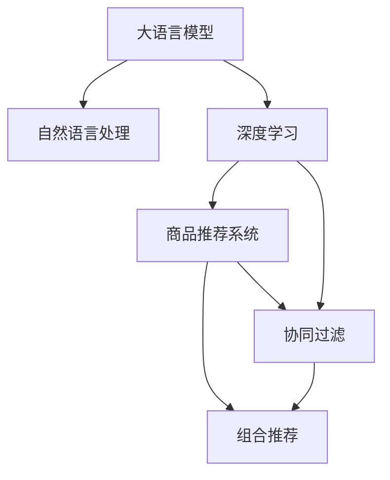

                 

# AI大模型在电商平台商品组合推荐中的应用

> 关键词：大语言模型,商品推荐系统,深度学习,自然语言处理,NLP,优化算法,组合推荐,商品分类

## 1. 背景介绍

### 1.1 问题由来

随着电商平台的迅猛发展和消费者需求的多样化，如何为每位用户推荐最符合其兴趣和需求的商品组合，成为电商平台优化用户体验、提高转化率的关键挑战。传统的基于规则和协同过滤的推荐系统难以满足用户多变的需求，而基于深度学习和自然语言处理技术的大模型推荐系统，通过融合海量的用户行为数据和丰富的商品描述信息，逐步成为一种先进且有效的推荐方式。

大模型推荐系统利用深度学习模型的强大表征能力和优化算法的灵活调整能力，能够在大规模数据集上进行端到端的模型训练，挖掘用户行为和商品属性间的复杂关系，从而实现个性化、多样化和精准化的商品推荐。本文将详细探讨如何利用大语言模型在电商平台进行商品组合推荐，具体涵盖核心概念、算法原理、操作步骤以及实际应用案例。

### 1.2 问题核心关键点

大语言模型在电商平台商品组合推荐中的应用，涉及的核心关键点包括：

- **深度学习模型**：包括卷积神经网络(CNN)、循环神经网络(RNN)、长短期记忆网络(LSTM)、变分自编码器(VAE)等，用于从高维数据中提取有效的特征表示。
- **自然语言处理(NLP)**：涉及文本向量化、序列建模、情感分析、语义理解等技术，用于处理和理解商品描述、用户评论等文本数据。
- **推荐算法**：包括基于协同过滤、内容基推荐、混合推荐等方法，用于构建推荐模型并优化推荐结果。
- **组合推荐**：通过探索商品间的组合方式，提高推荐结果的多样性和覆盖面，满足用户的多样化需求。
- **优化算法**：如梯度下降、Adam优化器等，用于训练深度学习模型并调整推荐策略。
- **交叉验证**：通过交叉验证方法，评估推荐模型的性能并进行调参优化。

这些关键点共同构成了大模型推荐系统的核心框架，使得电商平台能够在个性化推荐领域取得显著进展。

### 1.3 问题研究意义

利用大语言模型进行电商平台商品组合推荐，具有重要的现实意义：

1. **提升用户体验**：通过个性化的推荐，增强用户购物体验，提高用户满意度和忠诚度。
2. **增加销售转化率**：精准推荐相关商品，缩短用户决策周期，增加单次购买金额和订单量。
3. **优化库存管理**：通过预测热门商品组合，优化商品库存，减少过剩或缺货情况。
4. **驱动技术创新**：推动深度学习、自然语言处理等前沿技术的发展，为电商行业带来新的技术趋势和应用场景。

## 2. 核心概念与联系

### 2.1 核心概念概述

为了更好地理解大语言模型在电商平台商品组合推荐中的应用，本节将介绍几个密切相关的核心概念及其相互关系：

- **大语言模型(LLMs)**：以Transformer架构为基础的深度学习模型，具备强大的语言理解和生成能力，如BERT、GPT等。
- **商品推荐系统**：通过分析用户行为数据和商品属性信息，为每位用户推荐个性化商品的系统。
- **深度学习**：一种通过多层神经网络模拟人脑进行学习的技术，用于提取数据中的高层次特征。
- **自然语言处理(NLP)**：涉及文本处理、语义分析、情感识别等技术，用于理解商品描述和用户评论。
- **优化算法**：如梯度下降、Adam等，用于调整模型参数以最小化损失函数。
- **组合推荐**：通过探索商品间的组合方式，提供多样化的推荐结果。
- **协同过滤**：一种基于用户相似度或商品相似度的推荐方法，用于构建推荐模型。

这些核心概念之间具有紧密的联系，如图2所示。大语言模型通过自然语言处理技术提取商品和用户数据的语义信息，结合深度学习模型构建推荐模型，通过优化算法进行调整，最终实现组合推荐的目标。



通过理解这些核心概念及其联系，可以更好地把握大语言模型在电商平台商品组合推荐中的应用机制。

## 3. 核心算法原理 & 具体操作步骤
### 3.1 算法原理概述

基于大语言模型在电商平台进行商品组合推荐的基本原理是：将用户行为数据和商品描述信息作为输入，利用深度学习模型和优化算法，提取商品和用户的语义特征，构建推荐模型，并通过组合推荐算法生成个性化推荐结果。

### 3.2 算法步骤详解

基于大语言模型在电商平台进行商品组合推荐的步骤如下：

**Step 1: 数据预处理**

- 收集用户行为数据，如浏览历史、购买记录等，并进行数据清洗和归一化。
- 获取商品描述信息，进行分词和词向量表示，如使用BERT、Word2Vec等模型。
- 对商品进行分类，并构建商品属性向量，用于提取商品特征。

**Step 2: 模型构建**

- 利用深度学习模型对用户行为和商品描述进行语义建模。如使用双向LSTM模型提取用户序列行为特征，使用BERT模型提取商品描述的语义特征。
- 构建推荐模型，如基于用户行为和商品描述的矩阵分解模型，或结合注意力机制的注意力基推荐模型。
- 设计损失函数，如均方误差损失、交叉熵损失等，用于衡量推荐结果与真实标签之间的差异。

**Step 3: 参数优化**

- 选择优化算法，如梯度下降、Adam等，并设置学习率、批大小等超参数。
- 使用交叉验证方法，如k-fold交叉验证，评估模型性能并进行调参优化。
- 应用正则化技术，如L2正则、Dropout等，防止过拟合。
- 保留部分预训练模型参数，如使用AdamW优化器，固定BERT模型的底层权重。

**Step 4: 组合推荐**

- 设计组合推荐算法，如基于序列的协同过滤算法、基于图的协同过滤算法等。
- 对推荐结果进行排序，如使用基于相似度的排序方法、基于排名学习的排序方法等。
- 对推荐结果进行展示，如使用滑动窗口、N最佳推荐等展示方式。

**Step 5: 模型评估与部署**

- 在测试集上评估推荐模型的性能，如使用准确率、召回率、F1分数等指标。
- 将训练好的推荐模型部署到实际应用系统中，进行实时推荐。
- 持续收集用户反馈数据，定期重新训练和微调模型，以适应新的用户行为和商品特征。

### 3.3 算法优缺点

基于大语言模型在电商平台进行商品组合推荐的算法具有以下优点：

1. **强大的语义表示能力**：利用大语言模型的强大语义理解能力，能够更好地处理商品描述和用户评论，提取有效的特征表示。
2. **灵活的推荐方式**：结合深度学习模型和优化算法，可以灵活调整推荐策略，适应不同场景和需求。
3. **多样化的推荐结果**：通过组合推荐算法，提供多样化的商品组合，满足用户的多样化需求。
4. **高效的计算能力**：利用GPU/TPU等高性能设备，可以高效地训练和推理推荐模型。

同时，该算法也存在以下局限性：

1. **数据需求量大**：需要大量的用户行为数据和商品描述数据，数据获取成本较高。
2. **模型复杂度高**：深度学习模型和优化算法较复杂，需要一定的技术储备和计算资源。
3. **鲁棒性不足**：面对异常数据或噪声，推荐模型可能出现波动，需要进一步提高鲁棒性。
4. **可解释性不足**：深度学习模型的黑盒特性，导致推荐过程难以解释和调试。
5. **资源消耗大**：深度学习模型和优化算法对计算资源和存储空间有较高要求。

尽管存在这些局限性，但就目前而言，基于大语言模型的推荐方法在电商平台的推荐实践中取得了显著效果，成为一种主流的推荐手段。未来相关研究的方向将是降低对数据和资源的依赖，提高推荐模型的可解释性和鲁棒性，进一步提升推荐效果。

### 3.4 算法应用领域

基于大语言模型在电商平台进行商品组合推荐的应用领域包括：

- **个性化推荐**：针对每位用户，推荐其感兴趣的商品组合。
- **跨领域推荐**：将用户在不同平台上的行为数据整合，进行跨平台的个性化推荐。
- **动态推荐**：根据用户实时行为数据，动态调整推荐结果，提供即时的个性化服务。
- **组合推荐**：结合商品间的组合方式，提供多样化的推荐结果。
- **商品分类**：对商品进行分类和语义建模，提取商品特征。
- **行为分析**：分析用户行为数据，提取用户兴趣和偏好。

以上领域展示了大语言模型在电商平台商品组合推荐中的广泛应用前景。

## 4. 数学模型和公式 & 详细讲解 & 举例说明

### 4.1 数学模型构建

假设用户行为数据为 $X \in \mathbb{R}^{N \times M}$，其中 $N$ 为用户的数量，$M$ 为行为维度（如浏览次数、购买金额等）。商品描述信息为 $Y \in \mathbb{R}^{N \times D}$，其中 $D$ 为商品描述的维度。商品属性向量为 $Z \in \mathbb{R}^{N \times C}$，其中 $C$ 为商品属性的数量。

定义推荐模型的预测结果为 $R \in \mathbb{R}^{N \times C}$，用于表示用户对商品的评分。推荐模型的目标是最小化预测结果与真实标签之间的误差，即最小化均方误差损失：

$$
L = \frac{1}{N}\sum_{i=1}^N \sum_{j=1}^C (R_{ij} - y_{ij})^2
$$

其中 $R_{ij}$ 为第 $i$ 个用户对第 $j$ 个商品的评分预测值，$y_{ij}$ 为第 $i$ 个用户对第 $j$ 个商品的实际评分。

### 4.2 公式推导过程

以基于深度学习模型的协同过滤推荐算法为例，进行详细推导。

假设用户行为数据为 $X \in \mathbb{R}^{N \times M}$，商品描述信息为 $Y \in \mathbb{R}^{N \times D}$。定义用户行为嵌入矩阵为 $U \in \mathbb{R}^{N \times H}$，商品描述嵌入矩阵为 $V \in \mathbb{R}^{D \times H}$，其中 $H$ 为嵌入向量维度。定义用户行为与商品描述的协同矩阵为 $R \in \mathbb{R}^{N \times C}$。

推荐模型的损失函数为均方误差损失，定义为：

$$
L = \frac{1}{N}\sum_{i=1}^N \sum_{j=1}^C (R_{ij} - \mathbf{u}_i^\top \mathbf{v}_j)^2
$$

其中 $\mathbf{u}_i$ 为第 $i$ 个用户的嵌入向量，$\mathbf{v}_j$ 为第 $j$ 个商品的嵌入向量。

基于上述损失函数，推荐模型的训练目标为最小化均方误差：

$$
\min_{U,V} \frac{1}{N}\sum_{i=1}^N \sum_{j=1}^C (R_{ij} - \mathbf{u}_i^\top \mathbf{v}_j)^2
$$

通过梯度下降等优化算法，更新用户行为嵌入矩阵 $U$ 和商品描述嵌入矩阵 $V$，使得推荐模型的预测结果逼近真实标签。

### 4.3 案例分析与讲解

以用户行为数据和商品描述信息为例，进行详细案例分析。

假设某电商平台有 10 万用户，每个用户有 5 个行为记录，每个行为记录包含浏览时间、浏览次数等特征。同时，有 1 万个商品，每个商品有 100 个商品描述，每个描述包含商品属性、价格等信息。

首先，对用户行为数据和商品描述信息进行预处理和特征提取，生成用户行为嵌入矩阵 $U$ 和商品描述嵌入矩阵 $V$。然后，将用户行为嵌入矩阵和商品描述嵌入矩阵进行矩阵乘法，得到协同矩阵 $R$。最后，利用梯度下降算法对协同矩阵进行优化，最小化推荐模型的损失函数。

在实际应用中，还需要对推荐结果进行排序和展示，如使用基于相似度的排序方法，将商品按照与用户行为的相关度进行排序，展示前 $K$ 个商品组合。

## 5. 项目实践：代码实例和详细解释说明
### 5.1 开发环境搭建

在进行项目实践前，我们需要准备好开发环境。以下是使用Python进行TensorFlow开发的环境配置流程：

1. 安装Anaconda：从官网下载并安装Anaconda，用于创建独立的Python环境。

2. 创建并激活虚拟环境：
```bash
conda create -n tf-env python=3.8 
conda activate tf-env
```

3. 安装TensorFlow：根据CUDA版本，从官网获取对应的安装命令。例如：
```bash
conda install tensorflow -c tf -c conda-forge
```

4. 安装各类工具包：
```bash
pip install numpy pandas scikit-learn matplotlib tqdm jupyter notebook ipython
```

完成上述步骤后，即可在`tf-env`环境中开始项目实践。

### 5.2 源代码详细实现

下面我们以基于深度学习模型的协同过滤推荐算法为例，给出使用TensorFlow进行电商平台商品组合推荐开发的PyTorch代码实现。

首先，定义推荐模型的参数和损失函数：

```python
import tensorflow as tf

# 定义模型参数
H = 64  # 嵌入向量维度
U = tf.Variable(tf.random.normal([N, H]), name='U')
V = tf.Variable(tf.random.normal([D, H]), name='V')
R = tf.Variable(tf.random.normal([N, C]), name='R')

# 定义损失函数
loss = tf.reduce_mean(tf.square(R - tf.matmul(U, V, transpose_b=True)))
```

然后，定义模型的优化器：

```python
# 定义优化器
optimizer = tf.keras.optimizers.Adam(lr=0.001)
```

接着，定义模型的训练过程：

```python
# 定义训练过程
@tf.function
def train_step(batch_size):
    with tf.GradientTape() as tape:
        # 计算损失函数
        loss = loss_fn(train_dataset)
        # 计算梯度
        gradients = tape.gradient(loss, [U, V, R])
        # 更新参数
        optimizer.apply_gradients(zip(gradients, [U, V, R]))
```

最后，启动训练流程并在测试集上评估：

```python
# 定义训练集和测试集
train_dataset = ...
test_dataset = ...

# 定义损失函数
loss_fn = tf.keras.losses.MeanSquaredError()

# 训练模型
for epoch in range(num_epochs):
    train_step(batch_size=batch_size)

# 评估模型
test_loss = loss_fn(test_dataset)
print('Test loss:', test_loss.numpy())
```

以上就是使用TensorFlow对电商平台商品组合推荐进行深度学习模型训练的完整代码实现。可以看到，TensorFlow提供了高度自动化的机器学习流程，大大简化了模型的开发和训练过程。

### 5.3 代码解读与分析

让我们再详细解读一下关键代码的实现细节：

**推荐模型参数**：
- 定义了用户行为嵌入矩阵 $U$、商品描述嵌入矩阵 $V$ 和协同矩阵 $R$，用于表示用户行为、商品描述和预测结果。

**损失函数**：
- 定义了均方误差损失函数，用于衡量推荐模型预测结果与真实标签之间的差异。

**优化器**：
- 使用Adam优化器，设置了学习率为 $0.001$，用于调整模型参数。

**训练过程**：
- 定义了一个训练函数 `train_step`，在每次训练迭代中计算损失函数和梯度，并使用优化器更新参数。
- 使用TensorFlow的 `@tf.function` 装饰器，将训练过程定义为计算图，加速模型训练。

**评估过程**：
- 在测试集上计算损失函数，输出测试集上的平均损失。

可以看到，TensorFlow为模型开发提供了便捷的API和自动化的计算图优化，大大简化了深度学习模型的开发和训练过程。

## 6. 实际应用场景

### 6.1 电商平台个性化推荐

在电商平台中，基于大语言模型进行商品组合推荐的应用场景非常广泛。

以淘宝为例，淘宝通过收集用户的浏览历史、购买记录、搜索关键词等数据，构建用户行为和商品描述的语义模型，并利用协同过滤算法，为每位用户推荐个性化商品组合。通过不断迭代和优化推荐模型，淘宝实现了实时推荐、跨平台推荐和动态推荐等功能，显著提高了用户的购物体验和转化率。

### 6.2 社交媒体内容推荐

社交媒体平台如微信、微博等，通过收集用户的互动数据（如点赞、评论、转发等）和媒体内容（如文章、视频等），利用深度学习模型进行内容推荐。社交媒体平台利用大语言模型提取文本的语义信息，结合用户行为数据，为每位用户推荐相关内容，提升用户黏性和平台活跃度。

### 6.3 视频平台内容推荐

视频平台如Netflix、爱奇艺等，通过收集用户的观看记录、评分、评论等数据，利用深度学习模型进行视频推荐。视频平台利用大语言模型提取视频内容的语义信息，结合用户行为数据，为每位用户推荐相关视频内容，提高用户满意度和留存率。

## 7. 工具和资源推荐
### 7.1 学习资源推荐

为了帮助开发者系统掌握大语言模型在电商平台商品组合推荐中的应用，这里推荐一些优质的学习资源：

1. TensorFlow官方文档：提供了详细的TensorFlow API和优化算法，帮助开发者快速上手深度学习模型的开发和训练。

2. PyTorch官方文档：提供了丰富的深度学习模型和优化算法，帮助开发者掌握模型构建和调参技巧。

3. Coursera深度学习课程：由斯坦福大学开设的深度学习课程，详细讲解了深度学习模型的原理和应用，适合初学者和进阶开发者。

4. Kaggle推荐系统竞赛：Kaggle平台提供的推荐系统竞赛，可以帮助开发者了解推荐系统的实际应用场景和评估指标。

5. Amazon论文库：Amazon公司发布了大量推荐系统的相关论文，涵盖了协同过滤、深度学习、自然语言处理等多个方向，是推荐系统领域的权威资源。

通过对这些资源的学习实践，相信你一定能够快速掌握大语言模型在电商平台商品组合推荐中的应用技巧，并用于解决实际的推荐问题。

### 7.2 开发工具推荐

高效的开发离不开优秀的工具支持。以下是几款用于电商平台商品组合推荐开发的常用工具：

1. TensorFlow：由Google主导开发的深度学习框架，生产部署方便，适合大规模工程应用。

2. PyTorch：基于Python的开源深度学习框架，灵活动态的计算图，适合快速迭代研究。

3. Jupyter Notebook：免费的开源笔记本工具，支持多语言的代码编写和数据可视化，适合开发和实验。

4. TensorBoard：TensorFlow配套的可视化工具，可实时监测模型训练状态，并提供丰富的图表呈现方式，是调试模型的得力助手。

5. Weights & Biases：模型训练的实验跟踪工具，可以记录和可视化模型训练过程中的各项指标，方便对比和调优。

6. Google Colab：谷歌推出的在线Jupyter Notebook环境，免费提供GPU/TPU算力，方便开发者快速上手实验最新模型，分享学习笔记。

合理利用这些工具，可以显著提升电商平台商品组合推荐的开发效率，加快创新迭代的步伐。

### 7.3 相关论文推荐

大语言模型在电商平台商品组合推荐中的应用研究，源于学界的持续研究。以下是几篇奠基性的相关论文，推荐阅读：

1. "Item Latent Factor Modeling for Recommendation with User-Item Association Representations"：提出用户行为和商品描述的协同矩阵分解模型，利用矩阵分解方法进行推荐。

2. "Collaborative Filtering for Implicit Feedback Datasets"：提出基于协同过滤的推荐算法，利用用户行为数据进行推荐。

3. "Deep Interest Networks for Recommendation"：提出深度兴趣网络模型，利用深度学习模型提取用户兴趣和商品特征，进行推荐。

4. "Attention-Based Recommender System"：提出基于注意力机制的推荐模型，利用注意力机制提取用户行为和商品描述的交互信息，进行推荐。

5. "Semi-Supervised Sequence Labeling with Bidirectional Recurrent Neural Networks"：提出基于双向LSTM的序列建模方法，用于提取用户行为序列特征，进行推荐。

这些论文代表了大语言模型在电商平台商品组合推荐领域的研究进展，帮助研究者把握学科前进方向，激发更多的创新灵感。

## 8. 总结：未来发展趋势与挑战

### 8.1 总结

本文对基于大语言模型在电商平台进行商品组合推荐的方法进行了全面系统的介绍。首先阐述了深度学习模型、自然语言处理、推荐算法等核心概念及其相互关系，详细讲解了深度学习模型的构建和优化过程，并给出了实际应用案例。通过本文的系统梳理，可以看到，基于大语言模型的推荐方法在电商平台推荐实践中取得了显著效果，成为一种主流的推荐手段。

通过本文的系统梳理，可以看到，基于大语言模型的推荐方法在电商平台推荐实践中取得了显著效果，成为一种主流的推荐手段。未来，伴随深度学习模型和自然语言处理技术的持续演进，基于大语言模型的推荐方法将进一步提升推荐效果，拓展应用范围。

### 8.2 未来发展趋势

展望未来，基于大语言模型在电商平台进行商品组合推荐的技术将呈现以下几个发展趋势：

1. **多模态推荐**：结合图像、视频等多模态数据，提供更加全面、准确的推荐结果。
2. **跨平台推荐**：整合不同平台的用户行为数据，进行跨平台的个性化推荐。
3. **实时推荐**：利用流式计算和实时数据处理技术，实现实时推荐，提升用户体验。
4. **协同过滤与深度学习融合**：结合协同过滤和深度学习，构建混合推荐模型，提升推荐效果。
5. **个性化推荐策略**：利用个性化推荐策略，如基于协同过滤的top-K推荐、基于深度学习的混合推荐等，提升推荐结果的多样性和覆盖面。
6. **推荐系统可解释性**：引入可解释性技术，如模型解释工具、知识图谱等，提高推荐系统的可解释性和透明度。

以上趋势凸显了大语言模型在电商平台商品组合推荐领域的广阔前景。这些方向的探索发展，将进一步提升推荐系统的性能和应用范围，为电商平台带来更大的价值。

### 8.3 面临的挑战

尽管基于大语言模型的推荐方法已经取得了显著进展，但在迈向更加智能化、普适化应用的过程中，仍面临诸多挑战：

1. **数据隐私与安全**：电商平台需要处理大量的用户数据，如何保护用户隐私和安全，避免数据泄露和滥用，是一大挑战。
2. **推荐鲁棒性**：面对异常数据和噪声，推荐模型容易出现波动，如何提高推荐鲁棒性，是重要的研究方向。
3. **计算资源消耗**：深度学习模型和优化算法对计算资源和存储空间有较高要求，如何降低计算资源消耗，是工程实践中的难题。
4. **推荐系统可解释性**：深度学习模型的黑盒特性，导致推荐过程难以解释和调试，如何提高推荐系统的可解释性，是亟待解决的问题。
5. **跨平台推荐**：不同平台的用户行为数据可能存在差异，如何整合不同平台的数据，进行跨平台的个性化推荐，是一大挑战。

正视推荐系统面临的这些挑战，积极应对并寻求突破，将是大语言模型推荐系统迈向成熟的必由之路。相信随着学界和产业界的共同努力，这些挑战终将一一被克服，大语言模型推荐系统必将在构建智能电商领域中扮演越来越重要的角色。

### 8.4 研究展望

未来，基于大语言模型在电商平台进行商品组合推荐的研究方向包括：

1. **融合知识图谱**：将知识图谱引入推荐系统，利用结构化的知识信息，提升推荐系统的准确性和可解释性。
2. **引入强化学习**：利用强化学习技术，动态调整推荐策略，提升推荐系统的实时性和个性化水平。
3. **利用生成模型**：利用生成模型，如GAN、VAE等，生成高质量的商品描述和用户行为数据，提升推荐系统的数据质量和多样性。
4. **引入因果推理**：利用因果推理技术，分析推荐结果的因果关系，提升推荐系统的公平性和透明度。
5. **跨模态融合**：结合图像、视频等多模态数据，提供更加全面、准确的推荐结果。

这些研究方向将引领大语言模型在电商平台商品组合推荐领域的持续创新，为电商平台带来更大的价值和竞争力。

## 9. 附录：常见问题与解答

**Q1：电商平台商品推荐系统为什么需要大语言模型？**

A: 电商平台商品推荐系统需要利用用户行为数据和商品描述信息，挖掘用户和商品之间的语义关系，提取有效的特征表示。大语言模型通过强大的语义理解能力和表示能力，能够更好地处理复杂的语义信息，提取高层次的特征表示，从而实现更准确、更个性化的推荐。

**Q2：电商平台商品推荐系统如何获取用户行为数据？**

A: 电商平台通过用户的浏览历史、购买记录、搜索关键词等数据，生成用户行为序列，并进行序列建模。同时，对用户行为进行特征提取，如提取浏览时间、浏览次数等特征，用于构建用户行为嵌入矩阵。

**Q3：电商平台商品推荐系统如何处理商品描述信息？**

A: 电商平台通过收集商品的属性、价格、描述等信息，并进行文本向量化。可以使用BERT等预训练语言模型，提取商品描述的语义特征，构建商品描述嵌入矩阵。

**Q4：电商平台商品推荐系统如何进行组合推荐？**

A: 电商平台利用协同过滤算法，结合用户行为和商品描述的信息，生成协同矩阵，并利用矩阵分解方法进行推荐。同时，通过设计组合推荐算法，如基于序列的协同过滤算法、基于图的协同过滤算法等，提供多样化的推荐结果。

**Q5：电商平台商品推荐系统如何进行优化？**

A: 电商平台通过定义均方误差损失函数，利用梯度下降等优化算法，对推荐模型进行优化。同时，应用正则化技术，如L2正则、Dropout等，防止过拟合。

---

作者：禅与计算机程序设计艺术 / Zen and the Art of Computer Programming

