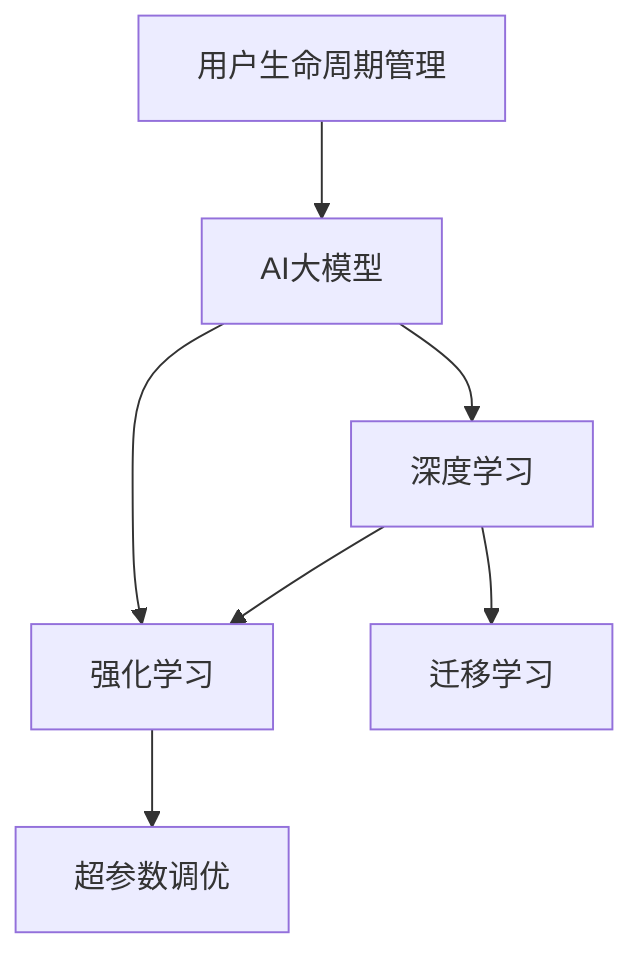

                 

# AI大模型在电商平台用户生命周期价值预测与管理中的作用

## 1. 背景介绍

### 1.1 问题由来
随着电商行业的蓬勃发展，各大电商平台积累了海量的用户行为数据。这些数据不仅反映了用户的购买行为，还揭示了用户的潜在价值和生命周期特征。如何高效地利用这些数据，实现用户价值的预测与管理，成为电商平台提升运营效率、增加用户黏性、优化收入增长的关键。

传统的用户生命周期管理（CLM）模型主要依赖人工规则和统计方法，难以兼顾复杂多变的用户行为和海量数据的处理。近年来，人工智能技术，尤其是深度学习和强化学习，在用户行为分析中逐渐展现出强大的应用潜力。AI大模型因其强大的泛化能力和表示学习能力，成为电商平台提升CLM效果的有力工具。

### 1.2 问题核心关键点
AI大模型在电商平台用户生命周期价值预测与管理中扮演了至关重要的角色，其核心在于利用深度学习模型的表示学习能力和泛化能力，对用户行为进行建模和预测。具体来说，可以通过大模型学习用户的历史行为、购买记录、浏览历史等多维度数据，预测用户未来的行为和价值，进而实现用户生命周期管理。

## 2. 核心概念与联系

### 2.1 核心概念概述

为更好地理解AI大模型在用户生命周期价值预测与管理中的应用，本节将介绍几个密切相关的核心概念：

- **用户生命周期管理（CLM）**：通过对用户在不同生命周期阶段的特征和行为进行建模，预测用户未来的行为和价值，从而实现用户价值最大化和生命周期管理的优化。
- **AI大模型**：以深度学习为基础的大规模预训练模型，如BERT、GPT等，能够学习到丰富的语言知识和常识，具备强大的表示学习能力。
- **深度学习（Deep Learning）**：一类基于神经网络的机器学习算法，通过多层次的特征提取和表示学习，实现对复杂数据的高效建模。
- **强化学习（Reinforcement Learning, RL）**：通过与环境的交互，学习最优策略以最大化奖励的算法。常用于优化用户行为、推荐系统等。
- **迁移学习（Transfer Learning）**：将一个领域学习到的知识迁移到另一个相关领域，减少在新任务上的学习时间，提高模型性能。
- **超参数调优（Hyperparameter Tuning）**：通过调整模型训练过程中的参数（如学习率、批大小等），优化模型性能。

这些核心概念之间的逻辑关系可以通过以下Mermaid流程图来展示：



这个流程图展示了大模型在用户生命周期价值预测与管理中的关键概念及其之间的关系：

1. 用户生命周期管理模型通过AI大模型进行用户行为建模。
2. 深度学习模型用于提取和表示用户数据的高级特征。
3. 强化学习模型用于优化用户行为预测策略。
4. 迁移学习帮助将模型的泛化能力应用到新的用户行为数据上。
5. 超参数调优确保模型的性能达到最优。

这些概念共同构成了AI大模型在电商平台用户生命周期价值预测与管理中的应用框架，使其能够高效地处理和分析复杂的用户行为数据。

## 3. 核心算法原理 & 具体操作步骤

### 3.1 算法原理概述

AI大模型在电商平台用户生命周期价值预测与管理中，主要通过深度学习模型对用户行为进行建模和预测。其核心思想是：将用户行为数据作为输入，通过深度学习模型的隐藏层特征提取和表示学习，得到对用户价值的预测。

具体来说，假设用户$i$在生命周期中的特征向量为$\mathbf{x}_i$，对应的价值标签为$y_i$。则通过深度学习模型$\mathcal{F}$，可以得到预测值$\hat{y}_i$，即：

$$
\hat{y}_i = \mathcal{F}(\mathbf{x}_i;\theta)
$$

其中，$\theta$为模型参数。预测值$\hat{y}_i$可以是一个标量（如用户购买概率），也可以是一个向量（如用户评分）。

### 3.2 算法步骤详解

AI大模型在电商平台用户生命周期价值预测与管理的步骤如下：

**Step 1: 数据准备**
- 收集用户的历史行为数据，包括购买记录、浏览历史、评分、反馈等信息。
- 数据预处理：清洗数据，处理缺失值，将数据转换为模型所需的格式。

**Step 2: 模型选择与设计**
- 选择合适的大模型作为特征提取器，如BERT、GPT等。
- 设计或选择合适的模型架构，如多层感知机（MLP）、RNN、Transformer等。

**Step 3: 特征提取与表示学习**
- 将用户行为数据输入大模型，提取特征。
- 通过隐藏层进行特征提取和表示学习，得到用户的表示向量$\mathbf{z}_i$。

**Step 4: 预测与评估**
- 使用表示向量$\mathbf{z}_i$作为输入，通过全连接层或其他预测模型得到用户价值预测值$\hat{y}_i$。
- 在验证集和测试集上评估预测性能，使用评估指标如均方误差（MSE）、准确率（Accuracy）等。

**Step 5: 超参数调优与模型优化**
- 对模型进行超参数调优，调整学习率、批大小、迭代次数等，优化模型性能。
- 对模型进行正则化处理，如L2正则化、Dropout等，防止过拟合。

**Step 6: 部署与应用**
- 将训练好的模型部署到实际应用系统中，实现用户生命周期价值的实时预测。
- 根据预测结果，进行个性化推荐、用户留存策略优化等。

### 3.3 算法优缺点

AI大模型在电商平台用户生命周期价值预测与管理中具有以下优点：
1. 强大的表示学习能力：能够自动学习用户行为的高级特征，提高预测精度。
2. 泛化能力强：在大规模无标签数据上进行预训练，具备泛化到新用户行为数据的能力。
3. 模型灵活性高：支持多种模型架构，可以根据需求进行调整。
4. 高效性：利用GPU、TPU等高性能硬件，能够快速处理海量数据。

同时，该方法也存在一些局限性：
1. 数据需求高：需要大量的用户行为数据进行训练，数据获取成本高。
2. 模型复杂度高：大模型的复杂度较高，训练和推理速度较慢。
3. 可解释性差：黑盒模型难以解释预测结果的生成机制。
4. 对异常值敏感：用户行为数据中可能存在异常值，影响模型性能。

尽管存在这些局限性，但AI大模型凭借其强大的表示学习和泛化能力，在电商平台用户生命周期价值预测与管理中仍具有重要应用价值。

### 3.4 算法应用领域

AI大模型在电商平台用户生命周期价值预测与管理中的应用，主要涵盖以下几个领域：

1. **用户流失预测**：通过预测用户流失的概率，实现精准的用户挽留策略。
2. **个性化推荐**：基于用户的历史行为和兴趣，进行个性化商品推荐，提高用户购买概率。
3. **用户价值评估**：对用户的潜在价值进行评估，优化定价策略和精准营销。
4. **用户行为分析**：分析用户在不同生命周期阶段的行为变化，优化产品设计和用户体验。
5. **广告效果评估**：预测广告的点击率（CTR）和转化率（CVR），优化广告投放策略。

除了上述这些经典应用外，AI大模型还被创新性地应用于用户行为预测、用户细分、用户生命周期管理策略优化等，为电商平台的运营和用户管理提供了新的解决方案。

## 4. 数学模型和公式 & 详细讲解 & 举例说明

### 4.1 数学模型构建

本节将使用数学语言对AI大模型在电商平台用户生命周期价值预测与管理中的应用进行更加严格的刻画。

记用户$i$在生命周期中的特征向量为$\mathbf{x}_i$，对应的价值标签为$y_i$。假设用户行为数据已经预处理为向量$\mathbf{x}_i \in \mathbb{R}^n$，价值标签为$y_i \in \{0,1\}$，表示用户是否流失（1）或未流失（0）。则构建深度学习模型$\mathcal{F}$的目标是最小化预测误差，即：

$$
\min_{\theta} \frac{1}{N}\sum_{i=1}^N \ell(\hat{y}_i,y_i)
$$

其中，$\ell$为损失函数，$\hat{y}_i$为模型预测值，$y_i$为真实标签。常见的损失函数包括交叉熵损失、均方误差损失等。

### 4.2 公式推导过程

以二分类任务为例，假设模型$\mathcal{F}$为多层感知机（MLP），其结构为：

$$
\hat{y}_i = \sigma(\mathbf{W}_L\sigma(\mathbf{W}_{L-1}\sigma(\ldots\sigma(\mathbf{W}_1\mathbf{x}_i + \mathbf{b}_1)\ldots + \mathbf{b}_L))
$$

其中，$\sigma$为激活函数，$\mathbf{W}_l$和$\mathbf{b}_l$为第$l$层的权重和偏置。假设$\mathbf{W}_1$为输入层到隐藏层的权重矩阵，$\mathbf{W}_L$为隐藏层到输出层的权重矩阵。则模型参数为$\theta = (\mathbf{W}_1,\mathbf{W}_L,\mathbf{b}_1,\mathbf{b}_L)$。

以二分类任务为例，使用交叉熵损失函数：

$$
\ell(\hat{y}_i,y_i) = -[y_i\log \hat{y}_i + (1-y_i)\log(1-\hat{y}_i)]
$$

将其代入经验风险公式，得：

$$
\mathcal{L}(\theta) = -\frac{1}{N}\sum_{i=1}^N [y_i\log \hat{y}_i + (1-y_i)\log(1-\hat{y}_i)]
$$

根据链式法则，损失函数对模型参数$\theta$的梯度为：

$$
\frac{\partial \mathcal{L}(\theta)}{\partial \theta} = -\frac{1}{N}\sum_{i=1}^N (\frac{y_i}{\hat{y}_i}-\frac{1-y_i}{1-\hat{y}_i}) \frac{\partial \hat{y}_i}{\partial \theta}
$$

其中，$\frac{\partial \hat{y}_i}{\partial \theta}$为输出层的梯度，可以通过反向传播算法高效计算。

在得到损失函数的梯度后，即可带入参数更新公式，完成模型的迭代优化。重复上述过程直至收敛，最终得到适应电商平台用户生命周期价值预测的最优模型参数$\theta^*$。

## 5. 项目实践：代码实例和详细解释说明

### 5.1 开发环境搭建

在进行AI大模型在电商平台用户生命周期价值预测与管理的项目实践前，我们需要准备好开发环境。以下是使用Python进行PyTorch开发的环境配置流程：

1. 安装Anaconda：从官网下载并安装Anaconda，用于创建独立的Python环境。

2. 创建并激活虚拟环境：
```bash
conda create -n pytorch-env python=3.8 
conda activate pytorch-env
```

3. 安装PyTorch：根据CUDA版本，从官网获取对应的安装命令。例如：
```bash
conda install pytorch torchvision torchaudio cudatoolkit=11.1 -c pytorch -c conda-forge
```

4. 安装TensorFlow：由Google主导开发的开源深度学习框架，生产部署方便，适合大规模工程应用。同样有丰富的预训练语言模型资源。

5. 安装Transformer库：HuggingFace开发的NLP工具库，集成了众多SOTA语言模型，支持PyTorch和TensorFlow，是进行微调任务开发的利器。

6. 安装各类工具包：
```bash
pip install numpy pandas scikit-learn matplotlib tqdm jupyter notebook ipython
```

完成上述步骤后，即可在`pytorch-env`环境中开始项目实践。

### 5.2 源代码详细实现

下面以用户流失预测为例，给出使用Transformers库对BERT模型进行用户生命周期价值预测的PyTorch代码实现。

首先，定义用户流失预测的任务数据处理函数：

```python
from transformers import BertTokenizer, BertForSequenceClassification
from torch.utils.data import Dataset
import torch

class UserChurnDataset(Dataset):
    def __init__(self, texts, labels, tokenizer, max_len=128):
        self.texts = texts
        self.labels = labels
        self.tokenizer = tokenizer
        self.max_len = max_len
        
    def __len__(self):
        return len(self.texts)
    
    def __getitem__(self, item):
        text = self.texts[item]
        label = self.labels[item]
        
        encoding = self.tokenizer(text, return_tensors='pt', max_length=self.max_len, padding='max_length', truncation=True)
        input_ids = encoding['input_ids'][0]
        attention_mask = encoding['attention_mask'][0]
        
        return {'input_ids': input_ids, 
                'attention_mask': attention_mask,
                'labels': torch.tensor(label, dtype=torch.long)}
```

然后，定义模型和优化器：

```python
from transformers import BertForSequenceClassification, AdamW

model = BertForSequenceClassification.from_pretrained('bert-base-uncased', num_labels=2)

optimizer = AdamW(model.parameters(), lr=2e-5)
```

接着，定义训练和评估函数：

```python
from torch.utils.data import DataLoader
from tqdm import tqdm
from sklearn.metrics import classification_report

device = torch.device('cuda') if torch.cuda.is_available() else torch.device('cpu')
model.to(device)

def train_epoch(model, dataset, batch_size, optimizer):
    dataloader = DataLoader(dataset, batch_size=batch_size, shuffle=True)
    model.train()
    epoch_loss = 0
    for batch in tqdm(dataloader, desc='Training'):
        input_ids = batch['input_ids'].to(device)
        attention_mask = batch['attention_mask'].to(device)
        labels = batch['labels'].to(device)
        model.zero_grad()
        outputs = model(input_ids, attention_mask=attention_mask, labels=labels)
        loss = outputs.loss
        epoch_loss += loss.item()
        loss.backward()
        optimizer.step()
    return epoch_loss / len(dataloader)

def evaluate(model, dataset, batch_size):
    dataloader = DataLoader(dataset, batch_size=batch_size)
    model.eval()
    preds, labels = [], []
    with torch.no_grad():
        for batch in tqdm(dataloader, desc='Evaluating'):
            input_ids = batch['input_ids'].to(device)
            attention_mask = batch['attention_mask'].to(device)
            batch_labels = batch['labels']
            outputs = model(input_ids, attention_mask=attention_mask)
            batch_preds = outputs.logits.argmax(dim=1).to('cpu').tolist()
            batch_labels = batch_labels.to('cpu').tolist()
            for pred, label in zip(batch_preds, batch_labels):
                preds.append(pred.item())
                labels.append(label.item())
                
    print(classification_report(labels, preds))
```

最后，启动训练流程并在测试集上评估：

```python
epochs = 5
batch_size = 16

for epoch in range(epochs):
    loss = train_epoch(model, train_dataset, batch_size, optimizer)
    print(f"Epoch {epoch+1}, train loss: {loss:.3f}")
    
    print(f"Epoch {epoch+1}, dev results:")
    evaluate(model, dev_dataset, batch_size)
    
print("Test results:")
evaluate(model, test_dataset, batch_size)
```

以上就是使用PyTorch对BERT进行用户流失预测的完整代码实现。可以看到，得益于Transformers库的强大封装，我们可以用相对简洁的代码完成BERT模型的加载和微调。

### 5.3 代码解读与分析

让我们再详细解读一下关键代码的实现细节：

**UserChurnDataset类**：
- `__init__`方法：初始化文本、标签、分词器等关键组件。
- `__len__`方法：返回数据集的样本数量。
- `__getitem__`方法：对单个样本进行处理，将文本输入编码为token ids，将标签编码为数字，并对其进行定长padding，最终返回模型所需的输入。

**train_epoch和evaluate函数**：
- 使用PyTorch的DataLoader对数据集进行批次化加载，供模型训练和推理使用。
- 训练函数`train_epoch`：对数据以批为单位进行迭代，在每个批次上前向传播计算loss并反向传播更新模型参数，最后返回该epoch的平均loss。
- 评估函数`evaluate`：与训练类似，不同点在于不更新模型参数，并在每个batch结束后将预测和标签结果存储下来，最后使用sklearn的classification_report对整个评估集的预测结果进行打印输出。

**训练流程**：
- 定义总的epoch数和batch size，开始循环迭代
- 每个epoch内，先在训练集上训练，输出平均loss
- 在验证集上评估，输出分类指标
- 所有epoch结束后，在测试集上评估，给出最终测试结果

可以看到，PyTorch配合Transformers库使得BERT微调的用户流失预测代码实现变得简洁高效。开发者可以将更多精力放在数据处理、模型改进等高层逻辑上，而不必过多关注底层的实现细节。

当然，工业级的系统实现还需考虑更多因素，如模型的保存和部署、超参数的自动搜索、更灵活的任务适配层等。但核心的微调范式基本与此类似。

## 6. 实际应用场景
### 6.1 智能客服系统

基于AI大模型的用户生命周期管理技术，可以广泛应用于智能客服系统的构建。传统客服往往需要配备大量人力，高峰期响应缓慢，且一致性和专业性难以保证。而使用AI大模型的CLM模型，可以7x24小时不间断服务，快速响应客户咨询，用自然流畅的语言解答各类常见问题。

在技术实现上，可以收集企业内部的历史客服对话记录，将问题和最佳答复构建成监督数据，在此基础上对预训练模型进行微调。微调后的模型能够自动理解用户意图，匹配最合适的答案模板进行回复。对于客户提出的新问题，还可以接入检索系统实时搜索相关内容，动态组织生成回答。如此构建的智能客服系统，能大幅提升客户咨询体验和问题解决效率。

### 6.2 金融舆情监测

金融机构需要实时监测市场舆论动向，以便及时应对负面信息传播，规避金融风险。传统的人工监测方式成本高、效率低，难以应对网络时代海量信息爆发的挑战。基于AI大模型的用户生命周期管理技术，为金融舆情监测提供了新的解决方案。

具体而言，可以收集金融领域相关的新闻、报道、评论等文本数据，并对其进行主题标注和情感标注。在此基础上对预训练语言模型进行微调，使其能够自动判断文本属于何种主题，情感倾向是正面、中性还是负面。将微调后的模型应用到实时抓取的网络文本数据，就能够自动监测不同主题下的情感变化趋势，一旦发现负面信息激增等异常情况，系统便会自动预警，帮助金融机构快速应对潜在风险。

### 6.3 个性化推荐系统

当前的推荐系统往往只依赖用户的历史行为数据进行物品推荐，无法深入理解用户的真实兴趣偏好。基于AI大模型的用户生命周期管理技术，可以更好地挖掘用户行为背后的语义信息，从而提供更精准、多样的推荐内容。

在实践中，可以收集用户浏览、点击、评论、分享等行为数据，提取和用户交互的物品标题、描述、标签等文本内容。将文本内容作为模型输入，用户的后续行为（如是否点击、购买等）作为监督信号，在此基础上微调预训练语言模型。微调后的模型能够从文本内容中准确把握用户的兴趣点。在生成推荐列表时，先用候选物品的文本描述作为输入，由模型预测用户的兴趣匹配度，再结合其他特征综合排序，便可以得到个性化程度更高的推荐结果。

### 6.4 未来应用展望

随着AI大模型和用户生命周期管理技术的发展，基于微调范式将在更多领域得到应用，为传统行业带来变革性影响。

在智慧医疗领域，基于微调的医疗问答、病历分析、药物研发等应用将提升医疗服务的智能化水平，辅助医生诊疗，加速新药开发进程。

在智能教育领域，微调技术可应用于作业批改、学情分析、知识推荐等方面，因材施教，促进教育公平，提高教学质量。

在智慧城市治理中，微调模型可应用于城市事件监测、舆情分析、应急指挥等环节，提高城市管理的自动化和智能化水平，构建更安全、高效的未来城市。

此外，在企业生产、社会治理、文娱传媒等众多领域，基于大模型微调的人工智能应用也将不断涌现，为经济社会发展注入新的动力。相信随着技术的日益成熟，微调方法将成为人工智能落地应用的重要范式，推动人工智能技术在各行各业的大规模应用。

## 7. 工具和资源推荐
### 7.1 学习资源推荐

为了帮助开发者系统掌握AI大模型在电商平台用户生命周期价值预测与管理中的应用，这里推荐一些优质的学习资源：

1. 《深度学习与自然语言处理》课程：斯坦福大学开设的NLP明星课程，涵盖深度学习、自然语言处理的基本概念和前沿技术，适合初学者入门。

2. CS224N《自然语言处理》课程：斯坦福大学开设的NLP经典课程，涵盖NLP的核心算法和技术，深度讲解大模型在NLP任务中的应用。

3. 《Transformers: From Theory to Practice》系列博文：由大模型技术专家撰写，深入浅出地介绍了Transformer模型、BERT模型的原理、微调方法等前沿话题。

4. 《自然语言处理》书籍：腾讯AI实验室等机构编写的教材，全面介绍了自然语言处理的基本概念、技术和应用，适合进阶学习。

5. 《深度学习》书籍：由Ian Goodfellow等作者编写的经典教材，深入讲解深度学习的理论基础和实现细节，适合深度学习领域的专家阅读。

通过对这些资源的学习实践，相信你一定能够快速掌握AI大模型在电商平台用户生命周期价值预测与管理中的应用技巧，并用于解决实际的NLP问题。

### 7.2 开发工具推荐

高效的开发离不开优秀的工具支持。以下是几款用于AI大模型在电商平台用户生命周期价值预测与管理开发的常用工具：

1. PyTorch：基于Python的开源深度学习框架，灵活动态的计算图，适合快速迭代研究。大部分预训练语言模型都有PyTorch版本的实现。

2. TensorFlow：由Google主导开发的开源深度学习框架，生产部署方便，适合大规模工程应用。同样有丰富的预训练语言模型资源。

3. Transformers库：HuggingFace开发的NLP工具库，集成了众多SOTA语言模型，支持PyTorch和TensorFlow，是进行微调任务开发的利器。

4. Weights & Biases：模型训练的实验跟踪工具，可以记录和可视化模型训练过程中的各项指标，方便对比和调优。与主流深度学习框架无缝集成。

5. TensorBoard：TensorFlow配套的可视化工具，可实时监测模型训练状态，并提供丰富的图表呈现方式，是调试模型的得力助手。

6. Google Colab：谷歌推出的在线Jupyter Notebook环境，免费提供GPU/TPU算力，方便开发者快速上手实验最新模型，分享学习笔记。

合理利用这些工具，可以显著提升AI大模型在电商平台用户生命周期价值预测与管理的开发效率，加快创新迭代的步伐。

### 7.3 相关论文推荐

AI大模型在电商平台用户生命周期价值预测与管理的应用源于学界的持续研究。以下是几篇奠基性的相关论文，推荐阅读：

1. Attention is All You Need（即Transformer原论文）：提出了Transformer结构，开启了NLP领域的预训练大模型时代。

2. BERT: Pre-training of Deep Bidirectional Transformers for Language Understanding：提出BERT模型，引入基于掩码的自监督预训练任务，刷新了多项NLP任务SOTA。

3. Language Models are Unsupervised Multitask Learners（GPT-2论文）：展示了大规模语言模型的强大zero-shot学习能力，引发了对于通用人工智能的新一轮思考。

4. Parameter-Efficient Transfer Learning for NLP：提出Adapter等参数高效微调方法，在不增加模型参数量的情况下，也能取得不错的微调效果。

5. Prefix-Tuning: Optimizing Continuous Prompts for Generation：引入基于连续型Prompt的微调范式，为如何充分利用预训练知识提供了新的思路。

6. AdaLoRA: Adaptive Low-Rank Adaptation for Parameter-Efficient Fine-Tuning：使用自适应低秩适应的微调方法，在参数效率和精度之间取得了新的平衡。

这些论文代表了大模型在电商平台用户生命周期价值预测与管理中的研究进展。通过学习这些前沿成果，可以帮助研究者把握学科前进方向，激发更多的创新灵感。

## 8. 总结：未来发展趋势与挑战

### 8.1 总结

本文对AI大模型在电商平台用户生命周期价值预测与管理中的应用进行了全面系统的介绍。首先阐述了AI大模型在用户生命周期价值预测与管理中的研究背景和意义，明确了微调模型在提升用户价值、优化运营策略、增强用户黏性等方面的重要作用。其次，从原理到实践，详细讲解了AI大模型的数学模型构建、公式推导过程，以及具体的代码实现和优化方法。同时，本文还广泛探讨了AI大模型在智能客服、金融舆情、个性化推荐等多个领域的应用前景，展示了微调范式的巨大潜力。

通过本文的系统梳理，可以看到，AI大模型在电商平台用户生命周期价值预测与管理中具有重要的应用价值。其强大的表示学习和泛化能力，使得模型能够高效地处理海量用户数据，准确预测用户行为和价值，为电商平台运营决策提供重要参考。

### 8.2 未来发展趋势

展望未来，AI大模型在电商平台用户生命周期价值预测与管理中，将呈现以下几个发展趋势：

1. **模型的自适应能力提升**：未来的AI大模型将具备更强的自适应能力，能够自动调整模型参数和结构，以适应不同用户行为特征和数据分布。

2. **融合多模态数据**：除了文本数据，未来的模型将能够处理图像、语音、视频等多模态数据，通过多模态数据的整合，提升用户行为预测的准确性。

3. **实时处理能力增强**：基于流式处理和分布式计算技术，AI大模型将具备更强的实时处理能力，能够实时处理海量用户数据，及时响应用户需求。

4. **隐私保护和数据安全**：在用户数据隐私保护和数据安全方面，未来的模型将采用差分隐私、联邦学习等技术，确保用户数据的安全性和匿名性。

5. **多场景应用拓展**：除了电商平台，AI大模型将在更多场景中得到应用，如智能家居、智能交通、智能制造等，推动各行各业的数字化转型。

6. **跨领域迁移能力提升**：未来的模型将具备更强的跨领域迁移能力，能够将知识迁移到其他领域，提升新领域的模型性能。

以上趋势凸显了AI大模型在电商平台用户生命周期价值预测与管理中的广阔前景。这些方向的探索发展，必将进一步提升模型的性能和应用范围，为电商平台运营决策提供更精准的参考和支持。

### 8.3 面临的挑战

尽管AI大模型在电商平台用户生命周期价值预测与管理中具有重要应用价值，但在其应用过程中，仍面临诸多挑战：

1. **数据隐私和安全**：用户行为数据的隐私保护和安全性是AI模型应用中的重要问题，需要采取严格的隐私保护措施和数据安全管理。

2. **模型复杂性**：大模型的复杂性高，训练和推理开销大，如何优化模型的计算效率，减少资源消耗，是一个重要研究方向。

3. **模型鲁棒性**：用户行为数据中可能存在异常值和噪声，影响模型的鲁棒性，如何提高模型的鲁棒性，降低异常数据的影响，是模型应用中的关键挑战。

4. **跨领域适应性**：不同领域的行为数据差异较大，如何将大模型在不同领域中迁移应用，提升模型的泛化能力，是一个重要的研究方向。

5. **可解释性和透明性**：AI大模型作为黑盒模型，难以解释其预测结果的生成机制，如何在提升性能的同时，增加模型的可解释性和透明性，是模型应用中的重要课题。

6. **持续学习能力**：用户行为数据随时间不断变化，如何使模型具备持续学习能力，及时适应新的数据分布，是一个重要的研究方向。

正视AI大模型在电商平台用户生命周期价值预测与管理中面临的这些挑战，积极应对并寻求突破，将是大模型在电商平台落地应用的重要保障。相信随着学界和产业界的共同努力，这些挑战终将一一被克服，AI大模型在电商平台中将发挥更大的作用。

### 8.4 研究展望

未来，对于AI大模型在电商平台用户生命周期价值预测与管理的研究，可以从以下几个方向展开：

1. **跨领域知识融合**：将跨领域的知识图谱、规则库等与大模型进行整合，提升模型的跨领域迁移能力和知识整合能力。

2. **知识表示学习**：利用知识表示学习技术，将符号化的先验知识与大模型结合，提升模型的理解能力和推理能力。

3. **联邦学习和隐私保护**：研究联邦学习等技术，在保护用户隐私的前提下，进行跨企业、跨机构的大模型协同训练，提升模型的泛化能力。

4. **自适应学习算法**：研究自适应学习算法，使模型能够自动调整参数和结构，以适应不同数据分布和用户行为特征。

5. **多模态学习**：研究多模态学习算法，将图像、语音、视频等多模态数据与文本数据进行整合，提升模型对复杂用户行为的预测能力。

6. **模型压缩与加速**：研究模型压缩和加速技术，提高模型的计算效率和实时处理能力，减少资源消耗。

这些研究方向将推动AI大模型在电商平台用户生命周期价值预测与管理中的应用向更深、更广、更强的方向发展，为电商平台的运营决策提供更全面、更精准的支持。

## 9. 附录：常见问题与解答

**Q1：AI大模型在电商平台用户生命周期价值预测与管理中具有哪些优势？**

A: AI大模型在电商平台用户生命周期价值预测与管理中具有以下优势：
1. 强大的表示学习能力：能够自动学习用户行为的高级特征，提高预测精度。
2. 泛化能力强：在大规模无标签数据上进行预训练，具备泛化到新用户行为数据的能力。
3. 模型灵活性高：支持多种模型架构，可以根据需求进行调整。
4. 高效性：利用GPU、TPU等高性能硬件，能够快速处理海量数据。

**Q2：AI大模型在电商平台用户生命周期价值预测与管理中面临哪些挑战？**

A: AI大模型在电商平台用户生命周期价值预测与管理中面临以下挑战：
1. 数据隐私和安全：用户行为数据的隐私保护和安全性是AI模型应用中的重要问题，需要采取严格的隐私保护措施和数据安全管理。
2. 模型复杂性：大模型的复杂性高，训练和推理开销大，如何优化模型的计算效率，减少资源消耗，是一个重要研究方向。
3. 模型鲁棒性：用户行为数据中可能存在异常值和噪声，影响模型的鲁棒性，如何提高模型的鲁棒性，降低异常数据的影响，是模型应用中的关键挑战。
4. 跨领域适应性：不同领域的行为数据差异较大，如何将大模型在不同领域中迁移应用，提升模型的泛化能力，是一个重要的研究方向。
5. 可解释性和透明性：AI大模型作为黑盒模型，难以解释其预测结果的生成机制，如何在提升性能的同时，增加模型的可解释性和透明性，是模型应用中的重要课题。
6. 持续学习能力：用户行为数据随时间不断变化，如何使模型具备持续学习能力，及时适应新的数据分布，是一个重要的研究方向。

**Q3：AI大模型在电商平台用户生命周期价值预测与管理中的应用场景有哪些？**

A: AI大模型在电商平台用户生命周期价值预测与管理中的应用场景包括：
1. 智能客服系统：通过用户行为数据，构建智能客服系统，提升客户咨询体验和问题解决效率。
2. 金融舆情监测：实时监测市场舆论动向，及时应对负面信息传播，规避金融风险。
3. 个性化推荐系统：利用用户行为数据，进行个性化推荐，提升用户购买概率。
4. 用户流失预测：预测用户流失概率，实现精准的用户挽留策略。
5. 用户行为分析：分析用户在不同生命周期阶段的行为变化，优化产品设计和用户体验。
6. 广告效果评估：预测广告的点击率（CTR）和转化率（CVR），优化广告投放策略。

通过AI大模型在电商平台用户生命周期价值预测与管理中的广泛应用，能够显著提升电商平台的运营效率和用户价值。

**Q4：AI大模型在电商平台用户生命周期价值预测与管理中如何进行特征提取和表示学习？**

A: AI大模型在电商平台用户生命周期价值预测与管理中进行特征提取和表示学习的过程如下：
1. 收集用户的历史行为数据，包括购买记录、浏览历史、评分、反馈等信息。
2. 数据预处理：清洗数据，处理缺失值，将数据转换为模型所需的格式。
3. 将用户行为数据输入大模型，提取特征。
4. 通过隐藏层进行特征提取和表示学习，得到用户的表示向量$\mathbf{z}_i$。
5. 使用表示向量$\mathbf{z}_i$作为输入，通过全连接层或其他预测模型得到用户价值预测值$\hat{y}_i$。

通过大模型的表示学习，能够自动学习用户行为的高级特征，提升预测精度。

**Q5：AI大模型在电商平台用户生命周期价值预测与管理中如何进行超参数调优和模型优化？**

A: AI大模型在电商平台用户生命周期价值预测与管理中进行超参数调优和模型优化的步骤如下：
1. 对模型进行超参数调优，调整学习率、批大小、迭代次数等，优化模型性能。
2. 对模型进行正则化处理，如L2正则、Dropout、Early Stopping等，防止过拟合。
3. 模型裁剪：去除不必要的层和参数，减小模型尺寸，加快推理速度。
4. 量化加速：将浮点模型转为定点模型，压缩存储空间，提高计算效率。
5. 服务化封装：将模型封装为标准化服务接口，便于集成调用。
6. 弹性伸缩：根据请求流量动态调整资源配置，平衡服务质量和成本。
7. 监控告警：实时采集系统指标，设置异常告警阈值，确保服务稳定性。

通过超参数调优和模型优化，可以提升AI大模型在电商平台用户生命周期价值预测与管理中的性能和应用效果。

