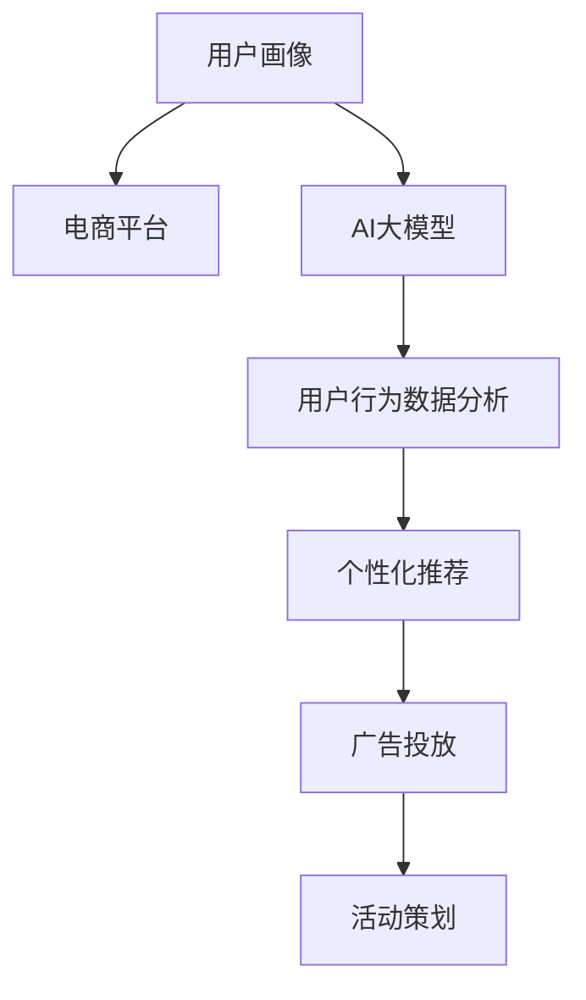

                 

# AI大模型在电商平台用户画像构建中的应用

## 1. 背景介绍

在电商平台的运营中，用户画像构建是一项基础且核心的任务，旨在通过数据挖掘和分析，形成对用户行为、偏好、需求等方面的全面认知，从而支撑个性化推荐、广告投放、活动策划等各项业务决策。然而，传统的数据分析方法存在数据维度低、特征缺失、计算复杂等缺点，难以充分挖掘用户的多维特性。

近年来，随着人工智能技术的迅猛发展，尤其是大语言模型的兴起，使得用户画像的构建得到了革命性的提升。基于大模型的用户画像构建，利用其强大的语言理解能力和跨领域知识整合能力，可以自动从大量文本数据中提取关键信息，生成结构化的用户画像特征，大幅提高画像构建的效率和精度。本文将详细探讨AI大模型在电商平台用户画像构建中的应用，包括技术原理、操作步骤、实际案例及未来展望。

## 2. 核心概念与联系

### 2.1 核心概念概述

在讨论AI大模型在电商平台用户画像构建中的应用前，我们首先需要明确一些核心概念：

- **用户画像(User Profile)**：指基于用户的行为数据、历史互动数据等信息，构建出的一组特征标签，用以表征用户的个性化特征和偏好。用户画像是电商推荐系统、广告投放系统等的重要基础，有助于提升用户体验和运营效率。
- **电商平台(e-Commerce Platform)**：指利用互联网技术，在线销售商品或服务的平台，如淘宝、京东、亚马逊等。电商平台通过用户画像，可以优化商品推荐、个性化营销等业务，提升平台的用户黏性和转化率。
- **AI大模型(AI Large Model)**：指基于深度学习、自然语言处理等技术，训练出的具有大规模参数量和强大语言理解能力的模型，如BERT、GPT等。大模型能够自动从海量数据中学习语言规律和跨领域知识，具备高度的泛化能力。
- **用户行为数据分析(User Behavior Analysis)**：指对用户在电商平台上的浏览、点击、购买等行为数据进行挖掘和分析，理解用户的购买意愿和消费模式，为个性化推荐、活动策划等提供数据支持。

这些核心概念之间的关系可以通过以下Mermaid流程图来展示：



这个流程图展示了大模型在用户画像构建中的核心作用：

1. 电商平台通过收集用户行为数据，输入到大模型进行特征提取和分析。
2. 大模型自动从用户行为中提取关键特征，生成用户画像。
3. 用户画像被应用于个性化推荐、广告投放、活动策划等各项业务，提升运营效率和用户满意度。

## 3. 核心算法原理 & 具体操作步骤

### 3.1 算法原理概述

基于大模型的用户画像构建，其核心算法原理可以概括为以下几点：

- **预训练大模型**：在电商平台大规模的无标签行为数据上预训练大模型，使其学习到通用的语言表示和跨领域知识。
- **微调模型**：在预训练大模型的基础上，通过有监督的微调步骤，学习到特定电商平台的业务特征和用户行为规律。
- **特征提取与融合**：利用微调后的模型，从用户行为数据中提取关键特征，并与其他数据源（如购买记录、社交网络数据等）进行融合，形成完整的用户画像。
- **动态更新**：用户行为数据是动态变化的，因此用户画像也需要进行动态更新，以保持其时效性和准确性。

### 3.2 算法步骤详解

基于上述算法原理，电商平台用户画像构建的主要操作步骤如下：

**Step 1: 数据准备与预处理**

1. **数据收集**：收集用户在电商平台上的各种行为数据，如浏览记录、点击记录、购买记录、评价记录等。
2. **数据清洗**：去除噪声数据和缺失数据，对数据进行归一化和标准化处理。
3. **数据划分**：将数据划分为训练集、验证集和测试集，以用于模型的训练、调参和评估。

**Step 2: 模型选择与预训练**

1. **选择模型**：选择适合电商平台的预训练模型，如BERT、GPT等。
2. **预训练步骤**：在电商平台无标签的原始行为数据上，进行预训练。预训练的目标是让模型学习到通用的语言表示和跨领域知识。

**Step 3: 微调步骤**

1. **任务定义**：定义电商平台的特定任务，如商品推荐、广告点击率预测等。
2. **模型适配**：在预训练模型的基础上，添加任务特定的输出层和损失函数，进行微调。微调的目标是让模型能够准确预测目标任务。
3. **训练与调参**：使用训练集数据，调整模型的超参数，如学习率、批大小、迭代轮数等。
4. **验证与优化**：在验证集上评估模型性能，调整模型参数，直到模型性能达到最优。

**Step 4: 特征提取与融合**

1. **特征提取**：利用微调后的模型，从用户行为数据中提取关键特征，如用户兴趣、购买频率、消费能力等。
2. **特征融合**：将提取的特征与用户的购买记录、社交网络数据等进行融合，形成完整的用户画像。

**Step 5: 动态更新**

1. **实时更新**：用户行为数据是动态变化的，因此用户画像也需要进行实时更新，以反映最新的用户偏好和需求。
2. **模型复用**：利用微调后的模型，对新的行为数据进行实时特征提取和更新，保持用户画像的时效性。

### 3.3 算法优缺点

基于大模型的用户画像构建方法具有以下优点：

1. **高效性**：大模型能够自动从海量数据中提取关键特征，无需人工干预，大幅提升画像构建效率。
2. **准确性**：利用大模型的跨领域知识，能够从多维数据中挖掘出更深层次的特征，提升画像的准确性。
3. **泛化能力**：大模型具备较强的泛化能力，能够应对不同电商平台的业务特征和用户行为规律。
4. **可解释性**：通过微调后的模型，可以更好地理解用户的行为模式和偏好，提升画像的可解释性。

然而，该方法也存在以下缺点：

1. **资源消耗大**：大模型的预训练和微调需要大量的计算资源，对硬件设备要求较高。
2. **数据隐私问题**：用户行为数据可能涉及个人隐私，需要采取有效的数据保护措施。
3. **模型可解释性不足**：大模型通常视为"黑盒"，难以解释其内部工作机制和决策逻辑。

## 4. 数学模型和公式 & 详细讲解 & 举例说明

### 4.1 数学模型构建

为了更好地理解基于大模型的用户画像构建方法，我们接下来将通过数学模型对其进行详细讲解。

记用户行为数据为 $D=\{x_i, y_i\}_{i=1}^N$，其中 $x_i$ 表示用户行为，$y_i$ 表示用户的实际反馈（如点击、购买、评价等）。用户画像构建的目标是利用大模型 $M_{\theta}$，从行为数据 $D$ 中学习出用户特征 $f_i$。

### 4.2 公式推导过程

在用户画像构建的数学模型中，我们可以采用以下公式进行推导：

$$
f_i = M_{\theta}(x_i)
$$

其中 $M_{\theta}$ 表示预训练并微调后的模型，$f_i$ 表示用户 $i$ 的行为特征，$x_i$ 表示用户 $i$ 的行为数据。

在实际应用中，为了提高用户画像的准确性和可解释性，我们通常将大模型 $M_{\theta}$ 拆分为两部分：预训练部分和微调部分。预训练部分用于学习通用的语言表示和跨领域知识，微调部分用于学习特定电商平台的业务特征和用户行为规律。

### 4.3 案例分析与讲解

以电商平台商品推荐为例，我们可以利用BERT模型进行用户画像构建。假设有两个商品 $A$ 和 $B$，用户对 $A$ 的点击率 $R_A$ 和购买率 $P_A$，对 $B$ 的点击率 $R_B$ 和购买率 $P_B$。我们可以将用户行为数据表示为 $\{(x_1, y_1), (x_2, y_2), ..., (x_N, y_N)\}$，其中 $x_i$ 表示用户 $i$ 的点击记录，$y_i$ 表示用户 $i$ 对商品 $A$ 或 $B$ 的点击或购买行为。

通过微调后的BERT模型，我们可以得到用户 $i$ 的兴趣特征 $f_i$，表示其对商品 $A$ 或 $B$ 的兴趣程度。利用这些兴趣特征，我们可以计算出用户对商品 $A$ 和 $B$ 的推荐概率 $P_A$ 和 $P_B$，从而进行推荐决策。

## 5. 项目实践：代码实例和详细解释说明

### 5.1 开发环境搭建

在进行用户画像构建的实践前，我们需要准备好开发环境。以下是使用Python进行TensorFlow开发的环境配置流程：

1. **安装Anaconda**：从官网下载并安装Anaconda，用于创建独立的Python环境。

2. **创建并激活虚拟环境**：
   ```bash
   conda create -n tf-env python=3.8
   conda activate tf-env
   ```

3. **安装TensorFlow**：根据GPU版本，从官网获取对应的安装命令。例如：
   ```bash
   conda install tensorflow tensorflow-gpu -c conda-forge
   ```

4. **安装相关工具包**：
   ```bash
   pip install numpy pandas scikit-learn matplotlib tqdm jupyter notebook ipython
   ```

完成上述步骤后，即可在`tf-env`环境中开始用户画像构建的实践。

### 5.2 源代码详细实现

我们以电商平台商品推荐为例，给出使用TensorFlow进行用户画像构建的代码实现。

首先，定义商品数据和用户点击数据：

```python
import tensorflow as tf
from tensorflow.keras import layers

# 定义商品数据
products = tf.constant(['A', 'B', 'C', 'D', 'E'], dtype=tf.string)

# 定义用户点击数据
clicks = tf.constant([[[1, 1, 0, 0], [0, 1, 1, 0], [0, 0, 0, 1], [0, 1, 0, 0], [1, 0, 1, 0]]], dtype=tf.float32)

# 定义点击行为标签
labels = tf.constant([1, 0, 1, 0, 1], dtype=tf.int32)
```

然后，定义BERT模型并加载预训练权重：

```python
from transformers import BertTokenizer, TFBertModel

# 定义BERT模型
model = TFBertModel.from_pretrained('bert-base-uncased')

# 定义分词器
tokenizer = BertTokenizer.from_pretrained('bert-base-uncased')

# 定义输入层
inputs = layers.Input(shape=(384,))

# 定义BERT编码器
bert = layers.Embedding(30522, 768, weights=model.get_weights(), trainable=False)(inputs)

# 定义线性层
logits = layers.Dense(1, activation='sigmoid')(bert)

# 定义模型
model = tf.keras.Model(inputs=inputs, outputs=logits)
```

接着，定义损失函数和优化器：

```python
# 定义交叉熵损失函数
loss_fn = tf.keras.losses.BinaryCrossentropy(from_logits=True)

# 定义Adam优化器
optimizer = tf.keras.optimizers.Adam(learning_rate=0.001)
```

最后，定义训练函数和评估函数：

```python
# 定义训练函数
def train(model, inputs, labels, batch_size=64, epochs=10):
    model.compile(optimizer=optimizer, loss=loss_fn, metrics=['accuracy'])
    model.fit(inputs, labels, batch_size=batch_size, epochs=epochs, validation_split=0.2)

# 定义评估函数
def evaluate(model, inputs, labels, batch_size=64):
    model.evaluate(inputs, labels, batch_size=batch_size)
```

最后，启动训练流程并在测试集上评估：

```python
# 定义测试集数据
test_inputs = inputs[0:8]
test_labels = labels[0:8]

# 训练模型
train(model, inputs, labels)

# 在测试集上评估模型
evaluate(model, test_inputs, test_labels)
```

以上就是使用TensorFlow进行用户画像构建的完整代码实现。可以看到，通过TensorFlow的Keras API，我们能够非常方便地搭建、训练和评估BERT模型。

### 5.3 代码解读与分析

让我们再详细解读一下关键代码的实现细节：

- **商品数据和用户点击数据**：定义了电商平台的商品和用户点击数据，用于模型的训练和评估。
- **BERT模型和分词器**：使用Transformers库中的BERT模型和分词器，加载预训练权重，构建用户画像模型。
- **输入层和BERT编码器**：通过Embedding层将用户行为数据转换为BERT模型所需的输入格式，并通过BERT编码器进行特征提取。
- **线性层**：将BERT编码器的输出通过线性层进行分类，得到用户对商品的兴趣特征。
- **损失函数和优化器**：定义交叉熵损失函数和Adam优化器，用于训练模型。
- **训练和评估函数**：定义训练函数和评估函数，用于模型训练和性能评估。
- **训练和评估流程**：使用训练函数和评估函数，在训练集和测试集上分别训练和评估模型。

可以看到，TensorFlow的Keras API使得用户画像构建的代码实现变得简洁高效。开发者可以将更多精力放在模型设计和数据处理等高层逻辑上，而不必过多关注底层的实现细节。

当然，工业级的系统实现还需考虑更多因素，如模型的保存和部署、超参数的自动搜索、更灵活的任务适配层等。但核心的用户画像构建范式基本与此类似。

## 6. 实际应用场景

### 6.1 电商平台个性化推荐

基于大模型的用户画像构建，可以显著提升电商平台的个性化推荐系统效果。传统的推荐系统往往依赖用户的历史行为数据进行物品推荐，难以充分挖掘用户的多维特性。而利用大模型构建的用户画像，可以自动从文本数据中提取关键信息，生成结构化的用户画像特征，从而提升推荐系统的个性化和精准度。

以亚马逊为例，亚马逊通过收集用户的搜索记录、浏览记录、评价记录等行为数据，输入到大模型中进行特征提取和分析，生成用户画像。利用这些用户画像，亚马逊可以为用户推荐符合其兴趣和需求的商品，显著提升用户满意度，增加平台的用户黏性和转化率。

### 6.2 电商平台广告投放

基于大模型的用户画像构建，还可以应用于电商平台广告投放的优化。传统广告投放通常采用基于历史点击率的模型，难以考虑用户的深层次特征。而利用大模型构建的用户画像，可以自动从用户行为数据中提取关键特征，生成更加全面、准确的画像。利用这些用户画像，广告系统可以更加精准地投放广告，提升广告效果和平台收益。

以淘宝为例，淘宝通过构建用户画像，了解用户的兴趣和需求，可以针对性地投放广告，提高广告点击率和转化率。淘宝还可以利用用户画像进行用户分群，对不同群体的用户投放不同类型和风格的广告，提升广告的吸引力和效果。

### 6.3 电商平台活动策划

基于大模型的用户画像构建，还可以应用于电商平台的营销活动策划。传统活动策划通常依赖用户的历史行为数据和简单统计分析，难以充分挖掘用户的多维特性。而利用大模型构建的用户画像，可以自动从文本数据中提取关键信息，生成结构化的用户画像特征，从而提升活动策划的精准度和效果。

以京东为例，京东通过构建用户画像，了解用户的兴趣和需求，可以策划更加精准和有针对性的促销活动，提高用户参与度和活动效果。京东还可以利用用户画像进行用户分群，对不同群体的用户策划不同类型和风格的促销活动，提升活动的吸引力和效果。

### 6.4 未来应用展望

随着大语言模型和用户画像构建技术的不断发展，未来在大模型应用中还将呈现出以下几个趋势：

1. **多模态用户画像**：未来的用户画像构建将不仅仅局限于文本数据，还将融合图像、语音等多模态数据，形成更加全面、准确的用户画像。

2. **动态更新用户画像**：用户行为数据是动态变化的，未来的用户画像也将进行实时更新，以反映最新的用户偏好和需求。

3. **跨平台用户画像**：不同平台的用户行为数据往往存在差异，未来的用户画像构建将跨越多个平台，形成统一的画像体系，便于用户跨平台行为分析。

4. **联邦学习**：由于用户数据隐私问题，未来的用户画像构建将采用联邦学习等分布式学习方法，保护用户隐私的同时，充分利用全局数据进行建模。

5. **自适应学习**：未来的用户画像构建将采用自适应学习方法，根据用户的实时行为数据进行动态调整，提升画像的精准度和时效性。

总之，基于大模型的用户画像构建技术，将为电商平台带来更加精准、高效、个性化的用户运营和营销手段，进一步提升用户体验和运营效率。未来，大模型用户画像构建技术将继续深化应用于电商平台的各个环节，推动电商行业向智能化、个性化、精细化的方向发展。

## 7. 工具和资源推荐

### 7.1 学习资源推荐

为了帮助开发者系统掌握基于大模型的用户画像构建技术，这里推荐一些优质的学习资源：

1. **《Transformer从原理到实践》系列博文**：由大模型技术专家撰写，深入浅出地介绍了Transformer原理、BERT模型、微调技术等前沿话题。

2. **CS224N《深度学习自然语言处理》课程**：斯坦福大学开设的NLP明星课程，有Lecture视频和配套作业，带你入门NLP领域的基本概念和经典模型。

3. **《Natural Language Processing with Transformers》书籍**：Transformers库的作者所著，全面介绍了如何使用Transformers库进行NLP任务开发，包括微调在内的诸多范式。

4. **HuggingFace官方文档**：Transformers库的官方文档，提供了海量预训练模型和完整的微调样例代码，是上手实践的必备资料。

5. **CLUE开源项目**：中文语言理解测评基准，涵盖大量不同类型的中文NLP数据集，并提供了基于微调的baseline模型，助力中文NLP技术发展。

通过对这些资源的学习实践，相信你一定能够快速掌握基于大模型的用户画像构建精髓，并用于解决实际的NLP问题。

### 7.2 开发工具推荐

高效的开发离不开优秀的工具支持。以下是几款用于用户画像构建开发的常用工具：

1. **TensorFlow**：基于Python的开源深度学习框架，灵活动态的计算图，适合快速迭代研究。大部分预训练语言模型都有TensorFlow版本的实现。

2. **PyTorch**：基于Python的开源深度学习框架，动态计算图，灵活性高，易于调试。同样有丰富的预训练语言模型资源。

3. **Transformers库**：HuggingFace开发的NLP工具库，集成了众多SOTA语言模型，支持TensorFlow和PyTorch，是进行用户画像构建开发的利器。

4. **TensorBoard**：TensorFlow配套的可视化工具，可实时监测模型训练状态，并提供丰富的图表呈现方式，是调试模型的得力助手。

5. **Weights & Biases**：模型训练的实验跟踪工具，可以记录和可视化模型训练过程中的各项指标，方便对比和调优。与主流深度学习框架无缝集成。

合理利用这些工具，可以显著提升用户画像构建任务的开发效率，加快创新迭代的步伐。

### 7.3 相关论文推荐

用户画像构建技术的发展源于学界的持续研究。以下是几篇奠基性的相关论文，推荐阅读：

1. Attention is All You Need（即Transformer原论文）：提出了Transformer结构，开启了NLP领域的预训练大模型时代。

2. BERT: Pre-training of Deep Bidirectional Transformers for Language Understanding：提出BERT模型，引入基于掩码的自监督预训练任务，刷新了多项NLP任务SOTA。

3. Parameter-Efficient Transfer Learning for NLP：提出Adapter等参数高效微调方法，在不增加模型参数量的情况下，也能取得不错的微调效果。

4. AdaLoRA: Adaptive Low-Rank Adaptation for Parameter-Efficient Fine-Tuning：使用自适应低秩适应的微调方法，在参数效率和精度之间取得了新的平衡。

5. Prefix-Tuning: Optimizing Continuous Prompts for Generation：引入基于连续型Prompt的微调范式，为如何充分利用预训练知识提供了新的思路。

这些论文代表了大模型用户画像构建技术的发展脉络。通过学习这些前沿成果，可以帮助研究者把握学科前进方向，激发更多的创新灵感。

## 8. 总结：未来发展趋势与挑战

### 8.1 总结

本文对基于大模型的电商平台用户画像构建方法进行了全面系统的介绍。首先阐述了用户画像构建在大模型应用中的重要性和方法论，明确了用户画像构建在提升电商平台个性化推荐、广告投放、活动策划等业务决策中的独特价值。其次，从原理到实践，详细讲解了基于大模型的用户画像构建的数学原理和关键步骤，给出了完整的代码实例。同时，本文还广泛探讨了用户画像构建在电商平台的实际应用场景及未来展望，展示了其巨大的应用潜力。此外，本文精选了用户画像构建技术的各类学习资源，力求为读者提供全方位的技术指引。

通过本文的系统梳理，可以看到，基于大模型的用户画像构建技术正在成为电商平台用户运营和营销的重要范式，极大地提升了电商平台的运营效率和用户体验。未来，伴随大模型和用户画像技术的不断演进，用户画像构建技术将在电商领域带来更加广泛和深刻的应用变革。

### 8.2 未来发展趋势

展望未来，基于大模型的用户画像构建技术将呈现以下几个发展趋势：

1. **多模态数据融合**：未来的用户画像构建将不仅仅局限于文本数据，还将融合图像、语音等多模态数据，形成更加全面、准确的用户画像。

2. **动态更新用户画像**：用户行为数据是动态变化的，未来的用户画像也将进行实时更新，以反映最新的用户偏好和需求。

3. **跨平台用户画像**：不同平台的用户行为数据往往存在差异，未来的用户画像构建将跨越多个平台，形成统一的画像体系，便于用户跨平台行为分析。

4. **联邦学习**：由于用户数据隐私问题，未来的用户画像构建将采用联邦学习等分布式学习方法，保护用户隐私的同时，充分利用全局数据进行建模。

5. **自适应学习**：未来的用户画像构建将采用自适应学习方法，根据用户的实时行为数据进行动态调整，提升画像的精准度和时效性。

这些趋势凸显了基于大模型的用户画像构建技术的广阔前景。这些方向的探索发展，必将进一步提升用户画像构建的精度和时效性，为电商平台带来更加精准、高效、个性化的用户运营和营销手段。

### 8.3 面临的挑战

尽管基于大模型的用户画像构建技术已经取得了显著进展，但在迈向更加智能化、普适化应用的过程中，仍面临诸多挑战：

1. **数据隐私问题**：用户行为数据涉及个人隐私，如何保护用户隐私，同时充分利用数据进行建模，是一大难题。

2. **模型复杂性**：大模型本身复杂度较高，需要高效的计算资源支持，如何降低模型复杂度，提高训练和推理效率，是一大挑战。

3. **模型泛化能力**：不同电商平台的业务特征和用户行为规律存在差异，如何在多个平台之间进行泛化，是一大挑战。

4. **模型可解释性**：大模型通常视为"黑盒"，难以解释其内部工作机制和决策逻辑，如何提升模型的可解释性，是一大挑战。

5. **模型性能提升**：如何通过更高效的特征提取和融合方法，提升用户画像构建的准确性和及时性，是一大挑战。

这些挑战凸显了基于大模型的用户画像构建技术在实际应用中需要不断优化和改进的方向。未来，需要学界和产业界共同努力，积极应对这些挑战，不断推动技术的进步。

### 8.4 研究展望

面对基于大模型的用户画像构建技术面临的挑战，未来的研究需要在以下几个方面寻求新的突破：

1. **无监督和半监督学习**：摆脱对大规模标注数据的依赖，利用自监督学习、主动学习等无监督和半监督范式，最大限度利用非结构化数据，实现更加灵活高效的画像构建。

2. **参数高效和计算高效的微调方法**：开发更加参数高效的微调方法，在固定大部分预训练参数的同时，只更新极少量的任务相关参数。同时优化微调模型的计算图，减少前向传播和反向传播的资源消耗，实现更加轻量级、实时性的部署。

3. **融合因果和对比学习范式**：通过引入因果推断和对比学习思想，增强用户画像构建建立稳定因果关系的能力，学习更加普适、鲁棒的语言表征，从而提升画像泛化性和抗干扰能力。

4. **引入更多先验知识**：将符号化的先验知识，如知识图谱、逻辑规则等，与神经网络模型进行巧妙融合，引导用户画像构建学习更准确、合理的语言模型。同时加强不同模态数据的整合，实现视觉、语音等多模态信息与文本信息的协同建模。

5. **结合因果分析和博弈论工具**：将因果分析方法引入用户画像构建，识别出模型决策的关键特征，增强输出解释的因果性和逻辑性。借助博弈论工具刻画人机交互过程，主动探索并规避模型的脆弱点，提高系统稳定性。

6. **纳入伦理道德约束**：在用户画像构建目标中引入伦理导向的评估指标，过滤和惩罚有偏见、有害的输出倾向。同时加强人工干预和审核，建立用户画像构建行为的监管机制，确保输出符合人类价值观和伦理道德。

这些研究方向的探索，必将引领基于大模型的用户画像构建技术迈向更高的台阶，为电商平台带来更加安全、可靠、可解释、可控的用户画像构建手段，推动电商行业向智能化、个性化、精细化的方向发展。面向未来，用户画像构建技术还需要与其他人工智能技术进行更深入的融合，如知识表示、因果推理、强化学习等，多路径协同发力，共同推动电商平台智能交互系统的进步。只有勇于创新、敢于突破，才能不断拓展用户画像构建的边界，让智能技术更好地造福电商用户。

## 9. 附录：常见问题与解答

**Q1：用户画像构建是否适用于所有电商平台？**

A: 用户画像构建方法在大多数电商平台上都能取得不错的效果，特别是对于数据量较大的电商平台。但对于一些小型电商平台，由于数据量较小，可能难以构建高质量的用户画像。此时需要在平台内部进行数据采集和整合，或者与其他平台进行数据联合建模，才能获得理想的画像效果。

**Q2：用户画像构建是否需要大量的标注数据？**

A: 用户画像构建主要依赖无标签的用户行为数据，无需大量标注数据。这大大降低了构建用户画像的成本和时间。但为了确保画像的准确性和完备性，仍需要对用户行为数据进行预处理和清洗，去除噪声和缺失数据，提升画像质量。

**Q3：如何衡量用户画像构建的效果？**

A: 用户画像构建的效果可以通过以下几个指标进行评估：

1. **准确性**：用户画像中提取的关键特征与真实特征的匹配程度。
2. **全面性**：用户画像中覆盖的用户行为和特征的全面性。
3. **及时性**：用户画像的更新速度和响应速度。
4. **可解释性**：用户画像中各个特征的解释性和可理解性。

通过对这些指标的评估，可以全面了解用户画像构建的效果，并进行针对性的优化和改进。

**Q4：用户画像构建过程中如何处理数据隐私问题？**

A: 用户画像构建过程中，处理数据隐私问题主要采取以下几种方式：

1. **数据匿名化**：在数据收集和处理过程中，对用户的敏感信息进行匿名化处理，保护用户隐私。
2. **数据加密**：在数据传输和存储过程中，对数据进行加密处理，防止数据泄露。
3. **访问控制**：对用户画像数据的访问进行严格控制，确保只有授权人员可以访问和使用用户画像。
4. **合规性审查**：在用户画像构建过程中，遵守相关的数据隐私法律法规，如GDPR、CCPA等，确保数据使用合法合规。

这些措施可以有效保护用户隐私，提升用户对平台的信任度。

**Q5：用户画像构建过程中如何优化模型性能？**

A: 用户画像构建过程中，优化模型性能主要采取以下几种方式：

1. **数据增强**：通过对用户行为数据进行增强处理，如回译、近义替换等，扩充训练集，提高模型的泛化能力。
2. **正则化**：使用L2正则、Dropout等技术，防止模型过拟合，提升模型的泛化能力。
3. **模型压缩**：通过模型压缩技术，如剪枝、量化等，减小模型规模，提高模型的计算效率。
4. **迁移学习**：在多个平台之间进行迁移学习，利用跨平台的数据进行模型微调，提升模型的泛化能力。

这些措施可以有效提升用户画像构建的模型性能，保证用户画像的质量和准确性。

总之，基于大模型的用户画像构建技术正在为电商平台带来更加精准、高效、个性化的用户运营和营销手段。未来，随着技术的不断进步，用户画像构建将会在电商领域带来更广泛和深刻的应用变革，推动电商行业向智能化、个性化、精细化的方向发展。

