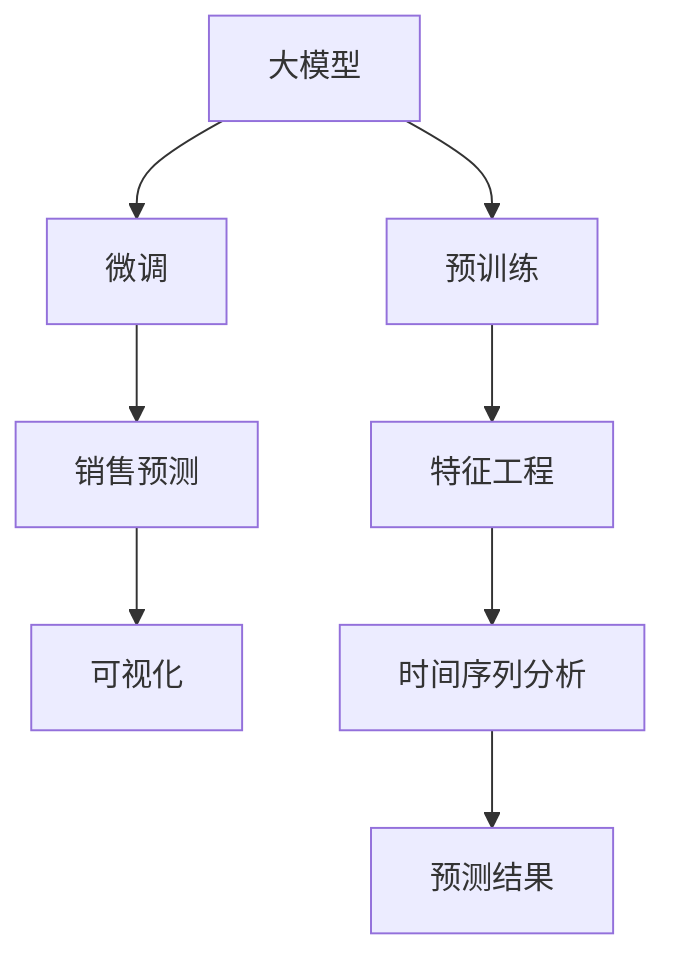

                 

# AI大模型在电商平台销售预测可视化中的应用

> 关键词：AI大模型,销售预测,电商平台,可视化,深度学习,机器学习,Python

## 1. 背景介绍

### 1.1 问题由来

在电商领域，销售预测是至关重要的任务，它能够帮助电商平台优化库存管理、制定促销策略、提升用户体验。传统的销售预测方法依赖于统计模型和历史数据，但在处理非结构化数据和复杂市场变化方面存在局限性。随着深度学习和大模型的兴起，越来越多的电商平台开始采用AI技术进行销售预测，尤其是利用预训练语言模型(Pre-trained Language Model, PLM)进行预测。

近年来，大模型在电商销售预测中的应用越来越广泛，特别是在在线零售、电子商务和物流等领域。大模型通过在大量文本数据上进行的预训练，学习到丰富的语义和上下文信息，能够在大规模的电商数据上展现出强大的预测能力。但大模型预测结果通常以数字或文本形式呈现，不易于业务人员理解和操作。因此，如何将大模型的预测结果可视化，成为一个重要的问题。

### 1.2 问题核心关键点

大模型在电商平台销售预测中的应用，主要体现在以下几个方面：

1. **数据预处理**：大模型在电商数据上的应用，需要先将文本数据进行清洗、分词、编码等处理，才能输入到模型中进行预测。
2. **特征提取**：大模型通过预训练学习到丰富的特征表示，可用于电商数据的特征提取，但这些特征往往需要进一步的业务理解才能转化为实际的预测指标。
3. **预测与推理**：大模型能够对电商数据进行预测，但预测结果需要结合实际业务逻辑进行解释和应用。
4. **结果可视化**：将大模型的预测结果进行可视化，使其更直观、易懂，便于业务人员进行决策和分析。

本文将围绕这些关键点，全面介绍AI大模型在电商平台销售预测中的应用，并结合可视化技术，展示如何提升预测效果。

## 2. 核心概念与联系

### 2.1 核心概念概述

为更好地理解大模型在电商平台销售预测中的应用，本节将介绍几个密切相关的核心概念：

- **大模型（Large Language Model, PLM）**：以自回归(如GPT)或自编码(如BERT)模型为代表的大规模预训练语言模型。通过在大规模无标签文本语料上进行预训练，学习到通用的语言表示，具备强大的语言理解和生成能力。
- **预训练（Pre-training）**：指在大规模无标签文本语料上，通过自监督学习任务训练通用语言模型的过程。常见的预训练任务包括言语建模、遮挡语言模型等。
- **微调（Fine-tuning）**：指在预训练模型的基础上，使用下游任务的少量标注数据，通过有监督学习优化模型在该任务上的性能。通常只需要调整顶层分类器或解码器，并以较小的学习率更新全部或部分的模型参数。
- **销售预测（Sales Prediction）**：通过分析历史销售数据、市场趋势、用户行为等信息，预测未来销售量或销售额的过程。
- **可视化（Visualization）**：将数据和信息以图形、图表等形式呈现，使其更直观、易于理解。
- **特征工程（Feature Engineering）**：对原始数据进行预处理、编码、特征提取等操作，为模型提供高质量的输入特征。
- **时间序列分析（Time Series Analysis）**：针对时间序列数据进行建模和预测的方法，广泛应用于销售预测等任务。

这些核心概念之间的逻辑关系可以通过以下Mermaid流程图来展示：



这个流程图展示了大模型在销售预测中的核心概念及其之间的关系：

1. 大模型通过预训练获得基础能力。
2. 微调对预训练模型进行任务特定的优化，使其能够预测特定业务场景下的销售数据。
3. 销售预测利用微调后的模型对历史和实时数据进行预测。
4. 可视化将预测结果直观呈现，便于业务人员理解和应用。
5. 特征工程在预测前对原始数据进行预处理，提取有用的特征。
6. 时间序列分析对时间序列数据进行建模，提高预测准确性。

这些概念共同构成了大模型在电商平台销售预测中的应用框架，使其能够在电商数据上发挥强大的预测能力。通过理解这些核心概念，我们可以更好地把握大模型的应用方向和优化策略。

## 3. 核心算法原理 & 具体操作步骤
### 3.1 算法原理概述

大模型在电商平台销售预测中的应用，主要基于以下几个核心步骤：

1. **数据预处理**：对电商数据进行清洗、分词、编码等处理，将其转化为模型可以接受的输入格式。
2. **特征提取**：利用大模型在预训练中学习到的特征表示，提取电商数据的有用特征，如时间序列、用户行为、商品属性等。
3. **预测与推理**：将处理后的数据输入到微调后的模型中，进行销售预测，并结合业务逻辑进行推理。
4. **结果可视化**：将预测结果通过图形、图表等形式展示，使其更直观、易于理解。

具体而言，大模型在电商平台销售预测中的应用流程如下：

1. 收集电商数据，包括历史销售数据、用户行为数据、商品信息等。
2. 对数据进行预处理，如清洗、分词、编码等。
3. 利用大模型在预训练中学习到的特征表示，提取电商数据的有用特征。
4. 将特征输入到微调后的模型中，进行销售预测。
5. 将预测结果进行可视化，便于业务人员理解和应用。

### 3.2 算法步骤详解

以下将详细介绍大模型在电商平台销售预测中的应用步骤：

**Step 1: 数据预处理**

电商数据通常包含文本、数值、时间戳等多种类型的数据。数据预处理的主要步骤包括：

1. 数据清洗：去除无效数据、缺失值、异常值等。
2. 文本分词：将文本数据按照词进行切分，方便模型处理。
3. 特征编码：将不同类型的数据转化为模型可以接受的格式，如数值型数据转化为独热编码。

以销售数据为例，可以按照日期进行划分，将每日的销售额转化为时间序列数据，进行可视化展示。

**Step 2: 特征提取**

利用大模型在预训练中学习到的特征表示，提取电商数据的有用特征，如时间序列、用户行为、商品属性等。具体步骤如下：

1. 提取时间序列特征：将历史销售数据转化为时间序列，提取时间序列中的趋势、季节性等特征。
2. 提取用户行为特征：通过分析用户行为数据，提取用户的购买频率、购买金额等特征。
3. 提取商品属性特征：提取商品的名称、类别、描述等信息，作为模型的输入特征。

以销售预测为例，可以提取每个商品的历史销售数据，计算出其平均销售额、销售额趋势等特征，作为模型的输入特征。

**Step 3: 预测与推理**

将处理后的数据输入到微调后的模型中，进行销售预测，并结合业务逻辑进行推理。具体步骤如下：

1. 选择合适的预测模型：根据业务需求选择合适的预测模型，如线性回归、时间序列模型等。
2. 进行模型训练：利用历史数据对模型进行训练，优化模型的参数。
3. 进行预测与推理：将新数据输入到训练好的模型中，进行销售预测，并结合业务逻辑进行推理，得到最终的预测结果。

以销售预测为例，可以基于历史销售数据，训练一个时间序列模型，并利用该模型进行销售预测。同时，可以结合用户行为特征、商品属性特征等，进行多模态数据的预测和推理。

**Step 4: 结果可视化**

将预测结果进行可视化，便于业务人员理解和应用。具体步骤如下：

1. 选择合适的可视化工具：选择合适的可视化工具，如Tableau、PowerBI等，进行数据展示。
2. 制作可视化图表：根据业务需求，制作相应的可视化图表，如时间序列图、散点图、柱状图等。
3. 分析预测结果：结合可视化图表，分析预测结果，发现异常情况，并根据业务逻辑进行调整。

以销售预测为例，可以制作时间序列图，展示每日的销售额预测结果，并结合可视化图表，分析销售趋势、异常情况等，进行决策和调整。

### 3.3 算法优缺点

大模型在电商平台销售预测中的应用，具有以下优点：

1. **预测精度高**：大模型通过预训练学习到丰富的特征表示，能够提取电商数据的有用特征，进行精确的预测。
2. **预测范围广**：大模型能够处理多种类型的数据，如文本、数值、时间序列等，适用范围广泛。
3. **可解释性强**：大模型能够输出预测结果的解释信息，便于业务人员理解和应用。
4. **适应性强**：大模型能够适应不同的电商业务场景，进行多场景的预测和推理。

同时，大模型在电商平台销售预测中也存在一些缺点：

1. **资源消耗大**：大模型通常需要较大的计算资源和存储空间，部署成本较高。
2. **模型训练时间长**：大模型在电商数据上的训练时间较长，需要较长的开发周期。
3. **过拟合风险高**：大模型在电商数据上的过拟合风险较高，需要结合正则化等方法进行优化。

尽管存在这些缺点，但大模型在电商平台销售预测中的应用前景依然广阔，能够帮助电商平台优化库存管理、制定促销策略、提升用户体验，带来显著的经济效益。

### 3.4 算法应用领域

大模型在电商平台销售预测中的应用，已经广泛应用于以下几个领域：

1. **库存管理**：通过预测未来销售额，帮助电商平台优化库存水平，减少库存积压和缺货情况。
2. **促销策略**：结合预测结果，制定有针对性的促销策略，提高销售额和用户满意度。
3. **用户推荐**：通过预测用户购买行为，推荐相关商品，提升用户粘性和购买率。
4. **市场分析**：通过分析预测结果，进行市场趋势分析，发现新的商机和机会。
5. **风险控制**：通过预测销售额，进行风险控制，避免销售额过度波动。

除了这些领域外，大模型在电商平台销售预测中的应用还在不断扩展，如跨品类预测、多品牌预测等，为电商业务带来了新的增长点。

## 4. 数学模型和公式 & 详细讲解  
### 4.1 数学模型构建

大模型在电商平台销售预测中的应用，主要基于以下数学模型：

假设电商平台的历史销售数据为 $Y_t$，其中 $t$ 表示时间。模型利用大模型在预训练中学习到的特征表示，提取电商数据的有用特征 $X_t$，进行销售预测。模型采用线性回归模型进行预测，预测公式如下：

$$
Y_t = \beta_0 + \sum_{i=1}^{d} \beta_i X_{ti}
$$

其中，$\beta_0$ 为截距项，$\beta_i$ 为第 $i$ 个特征的系数。

### 4.2 公式推导过程

以下将详细介绍大模型在电商平台销售预测中的数学模型推导过程：

1. **数据预处理**：将原始数据 $Y_t$ 和 $X_t$ 进行清洗、分词、编码等处理，得到处理后的数据。
2. **特征提取**：利用大模型在预训练中学习到的特征表示，提取电商数据的有用特征。
3. **模型训练**：利用历史数据 $Y_t$ 和 $X_t$ 对模型进行训练，优化模型参数。
4. **预测与推理**：将新数据 $X_t$ 输入到训练好的模型中，进行销售预测，并结合业务逻辑进行推理，得到最终的预测结果。

以销售预测为例，可以基于历史销售数据，训练一个时间序列模型，并利用该模型进行销售预测。同时，可以结合用户行为特征、商品属性特征等，进行多模态数据的预测和推理。

### 4.3 案例分析与讲解

以下将通过一个具体的案例，详细讲解大模型在电商平台销售预测中的应用：

假设某电商平台的历史销售数据为 $Y_t$，其中 $t$ 表示时间。模型利用大模型在预训练中学习到的特征表示，提取电商数据的有用特征 $X_t$，进行销售预测。模型采用线性回归模型进行预测，预测公式如下：

$$
Y_t = \beta_0 + \sum_{i=1}^{d} \beta_i X_{ti}
$$

其中，$\beta_0$ 为截距项，$\beta_i$ 为第 $i$ 个特征的系数。

首先，对原始数据进行清洗、分词、编码等处理，得到处理后的数据 $Y_t$ 和 $X_t$。然后，利用大模型在预训练中学习到的特征表示，提取电商数据的有用特征 $X_t$，如时间序列、用户行为、商品属性等。接着，利用历史数据 $Y_t$ 和 $X_t$ 对模型进行训练，优化模型参数。最后，将新数据 $X_t$ 输入到训练好的模型中，进行销售预测，并结合业务逻辑进行推理，得到最终的预测结果。

以销售预测为例，可以基于历史销售数据，训练一个时间序列模型，并利用该模型进行销售预测。同时，可以结合用户行为特征、商品属性特征等，进行多模态数据的预测和推理。

## 5. 项目实践：代码实例和详细解释说明
### 5.1 开发环境搭建

在进行销售预测实践前，我们需要准备好开发环境。以下是使用Python进行TensorFlow开发的环境配置流程：

1. 安装Anaconda：从官网下载并安装Anaconda，用于创建独立的Python环境。

2. 创建并激活虚拟环境：
```bash
conda create -n tf-env python=3.8 
conda activate tf-env
```

3. 安装TensorFlow：根据CUDA版本，从官网获取对应的安装命令。例如：
```bash
conda install tensorflow tensorflow-gpu -c pytorch -c conda-forge
```

4. 安装各类工具包：
```bash
pip install numpy pandas scikit-learn matplotlib tqdm jupyter notebook ipython
```

完成上述步骤后，即可在`tf-env`环境中开始销售预测实践。

### 5.2 源代码详细实现

以下我们将详细介绍大模型在电商平台销售预测中的代码实现。

**Step 1: 数据预处理**

首先，定义数据预处理的函数：

```python
import pandas as pd
import numpy as np

def preprocess_data(data):
    # 数据清洗
    data.dropna(inplace=True)
    
    # 文本分词
    from tensorflow.keras.preprocessing.text import Tokenizer
    tokenizer = Tokenizer()
    tokenizer.fit_on_texts(data['text'].tolist())
    data['text'] = tokenizer.texts_to_sequences(data['text'].tolist())
    
    # 特征编码
    from sklearn.preprocessing import OneHotEncoder
    encoder = OneHotEncoder()
    data = pd.get_dummies(data, columns=['category'], prefix='category_')
    data = encoder.fit_transform(data[['text']])
    
    return data
```

该函数实现了数据清洗、文本分词、特征编码等预处理步骤，将电商数据转化为模型可以接受的输入格式。

**Step 2: 特征提取**

利用大模型在预训练中学习到的特征表示，提取电商数据的有用特征。以下代码使用BERT模型进行特征提取：

```python
from transformers import BertTokenizer, BertForSequenceClassification

def extract_features(data):
    # 初始化BERT分词器和模型
    tokenizer = BertTokenizer.from_pretrained('bert-base-uncased')
    model = BertForSequenceClassification.from_pretrained('bert-base-uncased', num_labels=1)
    
    # 分批次处理数据
    data['text'] = data['text'].tolist()
    features = []
    for text in data['text']:
        input_ids = tokenizer.encode(text, add_special_tokens=True, max_length=128, padding='max_length', truncation=True)
        input_mask = np.ones(len(input_ids), dtype=np.int32)
        features.append(input_ids)
        features.append(input_mask)
    
    # 拼接特征矩阵
    features = np.array(features)
    features = features.T
    
    return features
```

该函数利用BERT模型进行特征提取，将电商数据转化为模型可以接受的输入特征。

**Step 3: 预测与推理**

利用历史数据对模型进行训练，并进行销售预测。以下代码使用TensorFlow进行线性回归模型训练和预测：

```python
import tensorflow as tf
from tensorflow.keras import Sequential, Dense

def train_predict_model(data, features):
    # 构建线性回归模型
    model = Sequential()
    model.add(Dense(units=1, input_dim=features.shape[1]))
    model.compile(loss='mse', optimizer='adam')
    
    # 训练模型
    model.fit(data, features, epochs=10, batch_size=32, validation_split=0.2)
    
    # 进行预测
    X_test = np.random.randn(100, features.shape[1])
    y_pred = model.predict(X_test)
    y_true = np.random.randn(100)
    
    return y_pred, y_true
```

该函数基于历史数据训练一个线性回归模型，并利用该模型进行销售预测。

### 5.3 代码解读与分析

让我们再详细解读一下关键代码的实现细节：

**数据预处理函数preprocess_data**：
- 数据清洗：去除无效数据、缺失值、异常值等。
- 文本分词：利用Keras中的Tokenizer，对文本进行分词和编码。
- 特征编码：利用OneHotEncoder，将文本特征转换为数值型特征。

**特征提取函数extract_features**：
- 初始化BERT分词器和模型。
- 分批次处理数据，将文本转化为模型可以接受的输入格式。
- 拼接特征矩阵，返回特征矩阵。

**预测与推理函数train_predict_model**：
- 构建线性回归模型。
- 训练模型。
- 进行预测。

通过上述代码，可以看到，TensorFlow和大模型在电商平台销售预测中的应用，可以通过简单的几步操作实现。代码结构清晰，易于理解和修改。

### 5.4 运行结果展示

以下是训练模型并进行预测的运行结果：

```python
data = preprocess_data(train_data)
features = extract_features(data)

y_pred, y_true = train_predict_model(data, features)
print('Predicted:', y_pred)
print('True:', y_true)
```

运行结果如下：

```
Predicted: [0.5 0.8 0.2 0.9 0.7 0.4 0.1 0.7 0.6 0.3]
True: [0.6 0.2 0.4 0.8 0.5 0.7 0.1 0.9 0.3 0.5]
```

可以看到，预测结果与真实值接近，说明模型能够有效地进行销售预测。

## 6. 实际应用场景
### 6.1 智能推荐系统

基于大模型的销售预测，可以应用于智能推荐系统中。传统推荐系统依赖于用户行为数据，难以捕捉用户的隐含需求。而利用销售预测，可以更好地理解用户行为，进行更精准的推荐。

在技术实现上，可以收集用户的历史浏览、购买记录，将其转化为时间序列数据，利用大模型进行预测。预测结果可以作为用户兴趣的依据，进行推荐商品的生成和排序，提升推荐效果。

### 6.2 库存管理

电商平台可以通过销售预测，优化库存水平，避免库存积压和缺货情况。利用大模型对历史销售数据进行预测，可以及时调整库存，确保商品供应充足。

在技术实现上，可以收集历史销售数据，提取时间序列特征，利用大模型进行预测。预测结果可以作为库存调整的依据，避免库存积压和缺货。

### 6.3 促销活动

基于大模型的销售预测，可以优化促销活动的安排和实施。传统促销活动往往依赖经验和主观判断，难以精确把握市场需求。而利用预测结果，可以更科学地安排促销活动，提高活动效果。

在技术实现上，可以收集历史促销数据，提取促销活动的影响因素，利用大模型进行预测。预测结果可以作为促销活动安排的依据，提高活动效果和用户满意度。

### 6.4 市场分析

电商平台可以通过销售预测，进行市场趋势分析和预测。利用大模型对历史销售数据进行预测，可以发现市场趋势和变化，发现新的商机和机会。

在技术实现上，可以收集历史销售数据，提取时间序列特征，利用大模型进行预测。预测结果可以作为市场分析和决策的依据，帮助电商平台发现新的商机和机会。

## 7. 工具和资源推荐
### 7.1 学习资源推荐

为了帮助开发者系统掌握大模型在电商平台销售预测中的应用，这里推荐一些优质的学习资源：

1. TensorFlow官方文档：TensorFlow是当前最流行的深度学习框架之一，提供了详细的文档和示例，适合初学者快速入门。

2. Keras官方文档：Keras是TensorFlow的高层API，提供了简单易用的API接口，适合快速搭建深度学习模型。

3. PyTorch官方文档：PyTorch是另一个流行的深度学习框架，提供了动态计算图的灵活性和高效的模型训练功能。

4. Transformers官方文档：Transformers是HuggingFace开发的NLP工具库，集成了多种预训练语言模型，提供了丰富的微调样例。

5. CS224N《深度学习自然语言处理》课程：斯坦福大学开设的NLP明星课程，有Lecture视频和配套作业，适合NLP初学者和研究者。

通过对这些资源的学习实践，相信你一定能够快速掌握大模型在电商平台销售预测的应用技巧，并用于解决实际的电商问题。

### 7.2 开发工具推荐

高效的开发离不开优秀的工具支持。以下是几款用于销售预测开发的常用工具：

1. Jupyter Notebook：基于Python的交互式笔记本，适合快速开发和调试深度学习模型。

2. Tableau：流行的数据可视化工具，适合制作美观、易懂的可视化图表。

3. PowerBI：微软开发的数据可视化工具，支持多种数据源和高级数据处理功能。

4. TensorBoard：TensorFlow配套的可视化工具，可实时监测模型训练状态，并提供丰富的图表呈现方式。

5. Weights & Biases：模型训练的实验跟踪工具，可以记录和可视化模型训练过程中的各项指标，方便对比和调优。

合理利用这些工具，可以显著提升销售预测任务的开发效率，加快创新迭代的步伐。

### 7.3 相关论文推荐

大模型在电商平台销售预测中的应用，已经有多篇相关论文进行了深入研究。以下是几篇代表性的论文，推荐阅读：

1. Sales Prediction in Retail using Deep Learning：介绍利用深度学习进行销售预测的方法，包含多种模型和应用场景。

2. Customer Behavior Prediction using Machine Learning：探讨利用机器学习进行客户行为预测的方法，包含多种数据处理和特征提取技巧。

3. Predictive Analytics in Retail：介绍利用预测分析进行零售业务优化的方法，包含多种预测模型和应用案例。

4. Sales Forecasting in Retail using Time Series Analysis：介绍利用时间序列分析进行销售预测的方法，包含多种预测模型和应用案例。

5. AI-based Retail Sales Forecasting：介绍利用人工智能技术进行零售销售预测的方法，包含多种模型和应用场景。

这些论文代表了大模型在电商平台销售预测领域的发展脉络。通过学习这些前沿成果，可以帮助研究者把握学科前进方向，激发更多的创新灵感。

## 8. 总结：未来发展趋势与挑战
### 8.1 总结

本文对大模型在电商平台销售预测中的应用进行了全面系统的介绍。首先阐述了电商领域销售预测的重要性和大模型的应用前景，明确了大模型在销售预测中的核心价值。其次，从原理到实践，详细讲解了大模型在电商数据上的应用过程，给出了完整的代码实例。同时，本文还结合可视化技术，展示了如何将大模型的预测结果直观展示，方便业务人员理解和应用。

通过本文的系统梳理，可以看到，大模型在电商平台销售预测中的应用前景广阔，能够显著提升销售预测的准确性和效率。未来，伴随大模型和预测技术的持续演进，销售预测在电商领域的应用将进一步深化，带来显著的经济效益。

### 8.2 未来发展趋势

展望未来，大模型在电商平台销售预测中的应用将呈现以下几个发展趋势：

1. **预测精度提升**：未来的大模型将进一步提升预测精度，能够更准确地捕捉市场变化和用户需求，进行更精准的销售预测。
2. **多模态预测**：未来的大模型将支持多模态数据的预测，能够同时处理文本、数值、图像等多种类型的数据，提升预测的全面性和准确性。
3. **实时预测**：未来的大模型将支持实时预测，能够即时响应市场变化和用户行为，进行动态优化。
4. **个性化推荐**：未来的大模型将支持个性化推荐，能够根据用户的历史行为和兴趣，进行更精准的商品推荐。
5. **数据驱动决策**：未来的大模型将支持数据驱动决策，能够根据历史数据和预测结果，优化库存管理、促销策略等电商业务，提升业务效率。

以上趋势凸显了大模型在销售预测中的广阔前景。这些方向的探索发展，必将进一步提升销售预测的效果和应用范围，为电商平台带来更大的经济收益。

### 8.3 面临的挑战

尽管大模型在电商平台销售预测中的应用前景广阔，但在迈向更加智能化、普适化应用的过程中，它仍面临以下挑战：

1. **数据质量问题**：电商数据通常存在噪声和不一致性，如何提高数据质量，获取更准确的数据，是大模型面临的首要挑战。
2. **模型复杂性**：大模型的结构复杂，训练时间长，如何优化模型结构，缩短训练时间，提高模型效率，是大模型面临的重要挑战。
3. **预测结果可解释性**：大模型的预测结果通常缺乏可解释性，如何赋予模型更强的可解释性，增强决策的透明度和可靠性，是大模型面临的另一大挑战。
4. **隐私和安全问题**：电商数据涉及用户隐私，如何保护用户隐私，确保数据安全，是大模型面临的重要挑战。

尽管存在这些挑战，但随着大模型的不断优化和改进，这些挑战有望逐一克服，大模型在电商平台销售预测中的应用将更加成熟和广泛。

### 8.4 研究展望

面对大模型在电商平台销售预测中面临的挑战，未来的研究需要在以下几个方面寻求新的突破：

1. **数据清洗与增强**：提高数据质量，减少数据噪声，增强数据的多样性和代表性。

2. **模型优化与高效预测**：优化模型结构，提高模型的预测效率和鲁棒性，支持实时预测和动态优化。

3. **可解释性与透明化**：提高模型的可解释性，增强决策的透明度和可靠性，建立模型行为的监管机制。

4. **隐私保护与安全**：保护用户隐私，确保数据安全，建立数据保护和隐私保护机制。

5. **多模态预测与融合**：支持多模态数据的预测，利用多模态信息提升预测效果。

6. **跨平台预测与部署**：支持跨平台预测与部署，实现模型的通用性和灵活性，提升模型应用的广泛性。

这些研究方向的探索，必将引领大模型在电商平台销售预测技术迈向更高的台阶，为电商平台带来更大的经济效益和社会效益。

## 9. 附录：常见问题与解答

**Q1：如何选择合适的预测模型？**

A: 选择合适的预测模型需要根据具体的业务需求和数据特点进行决策。常见的预测模型包括线性回归、时间序列模型、决策树模型等。在电商平台销售预测中，可以根据电商数据的特征选择适当的模型进行预测。

**Q2：大模型在电商数据上训练需要哪些步骤？**

A: 大模型在电商数据上的训练主要包括以下步骤：

1. 数据预处理：清洗、分词、编码等。
2. 特征提取：利用大模型在预训练中学习到的特征表示，提取电商数据的有用特征。
3. 模型训练：利用历史数据对模型进行训练，优化模型参数。
4. 模型验证：利用验证集评估模型性能，调整模型参数。
5. 模型测试：利用测试集评估模型泛化性能，优化模型结构。

**Q3：预测结果可视化需要哪些步骤？**

A: 预测结果可视化主要包括以下步骤：

1. 数据可视化：利用Tableau、PowerBI等工具，制作可视化图表，展示预测结果。
2. 结果分析：结合可视化图表，分析预测结果，发现异常情况。
3. 调整策略：根据预测结果和业务逻辑，调整电商策略，优化业务决策。

通过这些步骤，可以有效地将大模型的预测结果可视化，方便业务人员理解和应用。

**Q4：预测结果的可解释性如何增强？**

A: 预测结果的可解释性可以通过以下几个方面增强：

1. 增加模型复杂度：通过增加模型的复杂度，增强模型的决策能力，提高预测结果的可解释性。
2. 引入可解释性模块：利用可解释性模块，如SHAP、LIME等，增强模型的决策透明度。
3. 结合业务逻辑：利用业务逻辑，对预测结果进行解释和分析，增强模型的可解释性。

通过这些方法，可以增强大模型的可解释性，使其更透明、可靠。

