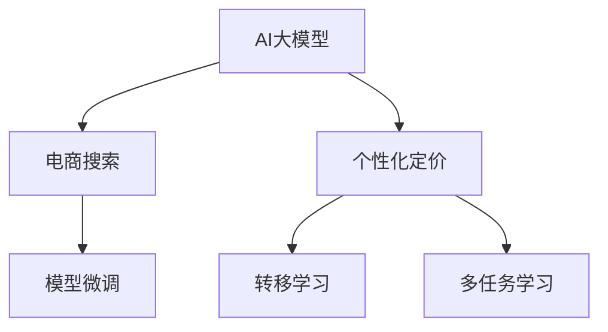

                 

# AI大模型在电商搜索结果个性化定价中的应用

## 1. 背景介绍

在当今电商竞争激烈的环境中，个性化定价策略已成为商家提升用户转化率、优化运营成本的关键手段。通过了解用户行为和偏好，商家可以动态调整商品价格，实现差异化定价，从而在竞争中脱颖而出。然而，传统的个性化定价方法往往依赖于复杂的统计模型和手工调参，难以快速响应市场变化。近年来，随着大语言模型和大数据技术的发展，通过AI大模型实现个性化定价逐渐成为电商企业的主流选择。本文将详细探讨AI大模型在电商搜索结果个性化定价中的应用，涵盖模型构建、算法原理、实践方法及未来展望，希望能为电商企业提供有益的参考和指导。

## 2. 核心概念与联系

### 2.1 核心概念概述

为了更好地理解AI大模型在个性化定价中的应用，本节将介绍几个关键概念：

- **AI大模型**：以深度神经网络为代表的大型预训练语言模型，如BERT、GPT-3等。通过在大规模无标签文本数据上自监督预训练，大模型能够学习到丰富的语言表示，具备强大的自然语言理解和生成能力。

- **个性化定价**：指根据用户行为、偏好、历史购买记录等数据，动态调整商品价格，实现差异化定价。个性化定价可以帮助商家提高用户满意度，增加销售额。

- **电商搜索**：用户在电商平台上输入关键词、浏览商品等行为，产生大量结构化和半结构化的数据。电商搜索是电商业务中用户行为数据的重要来源，对个性化定价策略的设计和优化至关重要。

- **模型微调**：在预训练模型的基础上，通过有监督学习优化模型在特定任务上的性能。对于个性化定价任务，微调过程通常包括训练集标注、任务适配层设计、模型参数更新等环节。

- **转移学习**：将一个领域学习到的知识迁移到另一个领域的过程。电商搜索个性化定价可以利用预训练语言模型的通用知识，在此基础上进行微调，提升模型的性能。

- **多任务学习**：指在同一模型上同时训练多个任务，实现知识的复用和共享。电商搜索个性化定价可以同时考虑用户的浏览行为、点击率、购买意图等多个维度的信息。

这些核心概念共同构成了AI大模型在个性化定价应用的理论基础，它们之间的联系可以通过以下Mermaid流程图来展示：



该流程图展示了AI大模型、电商搜索、个性化定价、模型微调、转移学习、多任务学习之间的联系：

1. AI大模型通过预训练获得基础能力，可以用于电商搜索。
2. 电商搜索数据驱动个性化定价，通过模型微调提升模型性能。
3. 转移学习和多任务学习帮助模型更好适应电商搜索个性化定价的需求。

## 3. 核心算法原理 & 具体操作步骤
### 3.1 算法原理概述

AI大模型在电商搜索结果个性化定价中的应用，本质上是一个结合了NLP、推荐系统和机器学习的综合性问题。其核心思想是：利用电商搜索数据中的文本信息，结合用户行为数据，通过AI大模型学习用户对不同商品的偏好和定价敏感度，动态调整商品价格，实现个性化定价。

具体来说，算法流程如下：

1. **数据准备**：收集用户搜索关键词、浏览记录、点击行为、购买历史等电商数据，以及商品的价格、特征等信息。
2. **特征提取**：使用AI大模型提取电商数据中的文本特征和用户行为特征，生成向量表示。
3. **模型训练**：构建个性化定价模型，利用标注数据训练模型，学习用户对商品价格的反应。
4. **实时定价**：在用户搜索时，根据其输入的关键词和行为特征，实时计算商品定价，实现个性化展示。

### 3.2 算法步骤详解

以下是基于AI大模型的电商搜索结果个性化定价的详细算法步骤：

**Step 1: 数据准备**

1. **数据收集**：收集电商用户的历史搜索记录、点击记录、购买记录、浏览记录等数据，以及商品的价格、描述、类别等信息。
2. **数据预处理**：对收集的数据进行清洗、去重、归一化等处理，生成格式统一的数据集。
3. **特征工程**：设计特征提取器，提取文本信息、用户行为信息、商品信息等特征，生成向量表示。

**Step 2: 特征提取**

1. **文本特征提取**：使用AI大模型提取电商搜索关键词、商品描述等文本信息的向量表示。可以采用预训练的BERT、GPT等模型，将其应用于文本预处理和特征提取。
2. **行为特征提取**：提取用户的浏览行为、点击行为、购买行为等，生成向量表示。可以使用矩阵分解、协同过滤等推荐系统方法，以及深度学习模型进行特征提取。
3. **商品特征提取**：提取商品的价格、类别、品牌等特征，生成向量表示。

**Step 3: 模型训练**

1. **模型选择**：选择合适的模型进行训练，如线性回归模型、神经网络模型等。
2. **模型训练**：使用标注数据训练模型，学习用户对不同商品价格的反应。训练过程中，可以通过交叉验证、超参数调优等方法，提升模型性能。
3. **模型评估**：在验证集上评估模型性能，如均方误差、准确率等指标，根据评估结果调整模型参数。

**Step 4: 实时定价**

1. **用户行为识别**：根据用户输入的搜索关键词和浏览行为，识别用户意图和偏好。
2. **商品价格预测**：将用户特征和商品特征输入训练好的模型，预测商品的价格。
3. **动态定价**：根据预测结果，动态调整商品价格，实现个性化定价。

### 3.3 算法优缺点

基于AI大模型的电商搜索结果个性化定价方法具有以下优点：

1. **高效性**：通过预训练模型提取特征，可以快速计算出商品价格，提升实时响应速度。
2. **灵活性**：模型可以同时考虑多个因素，如用户行为、商品特征、市场环境等，实现更精准的定价策略。
3. **可扩展性**：模型具有较强的泛化能力，可以轻松适应不同的电商场景和商品品类。

同时，该方法也存在一些局限性：

1. **数据依赖**：模型的性能依赖于标注数据的丰富性和质量，标注数据的获取和维护成本较高。
2. **模型复杂性**：大模型和大数据处理增加了系统的复杂度，模型部署和维护难度较大。
3. **隐私风险**：用户行为数据和商品信息可能涉及隐私问题，需要严格的隐私保护措施。

尽管存在这些局限性，但总体而言，基于AI大模型的电商搜索结果个性化定价方法在实时性和灵活性方面具有显著优势，能够显著提升电商平台的个性化推荐和定价效果。

### 3.4 算法应用领域

AI大模型在电商搜索结果个性化定价中的应用，可以广泛应用于多种电商场景，如：

1. **个性化展示**：根据用户的搜索记录和浏览行为，推荐个性化商品，动态调整商品展示价格。
2. **价格优化**：根据市场动态和用户行为，实时调整商品价格，优化销售策略。
3. **库存管理**：根据用户的购买历史和价格敏感度，优化商品库存，避免积压和缺货。
4. **客户细分**：根据用户的定价反应，进行客户细分，针对不同用户群体制定差异化定价策略。
5. **广告投放**：根据用户的搜索行为，调整广告投放策略和出价，提升广告效果。

此外，基于AI大模型的个性化定价方法还可以与其他电商技术进行结合，如推荐系统、商品相似度计算、用户画像构建等，进一步提升电商平台的运营效率和服务质量。

## 4. 数学模型和公式 & 详细讲解 & 举例说明

### 4.1 数学模型构建

在电商搜索结果个性化定价中，通常采用线性回归模型进行价格预测。设用户特征向量为 $x$，商品特征向量为 $y$，用户对商品价格的反应向量为 $t$，则线性回归模型的预测公式为：

$$
\hat{p} = w_0 + w_1^Tx + w_2^Ty
$$

其中，$w_0, w_1, w_2$ 为模型参数，$x, y$ 为输入特征向量，$\hat{p}$ 为预测价格。

### 4.2 公式推导过程

假设我们有一个标注数据集 $D=\{(x_i, y_i, t_i)\}_{i=1}^N$，其中 $x_i, y_i, t_i$ 分别为用户特征向量、商品特征向量和用户定价反应向量。

根据最小二乘法的原理，我们的目标是最小化预测价格 $\hat{p}$ 与真实价格 $t$ 的误差：

$$
\min_{w_0, w_1, w_2} \sum_{i=1}^N (t_i - (\hat{p}_i))^2
$$

其中 $\hat{p}_i = w_0 + w_1^Tx_i + w_2^Ty_i$。

对上述目标函数求导，得：

$$
\frac{\partial}{\partial w_0} \sum_{i=1}^N (t_i - (\hat{p}_i))^2 = -2\sum_{i=1}^N (t_i - (\hat{p}_i))
$$

$$
\frac{\partial}{\partial w_1} \sum_{i=1}^N (t_i - (\hat{p}_i))^2 = -2\sum_{i=1}^N (t_i - (\hat{p}_i))x_i
$$

$$
\frac{\partial}{\partial w_2} \sum_{i=1}^N (t_i - (\hat{p}_i))^2 = -2\sum_{i=1}^N (t_i - (\hat{p}_i))y_i
$$

由此，可以求解得到模型参数 $w_0, w_1, w_2$ 的表达式：

$$
w_0 = \frac{1}{N}\sum_{i=1}^N (t_i - (\hat{p}_i))
$$

$$
w_1 = \frac{1}{N}\sum_{i=1}^N (t_i - (\hat{p}_i))x_i
$$

$$
w_2 = \frac{1}{N}\sum_{i=1}^N (t_i - (\hat{p}_i))y_i
$$

### 4.3 案例分析与讲解

假设我们有一个电商商品推荐系统，已经收集到了一些用户搜索关键词和点击行为数据，以及商品价格、类别、描述等信息。我们可以使用BERT模型提取文本特征，使用神经网络模型学习用户定价反应，最终构建线性回归模型进行价格预测。具体步骤如下：

1. **数据准备**：收集用户搜索关键词、点击记录、购买记录、浏览记录等数据，以及商品的价格、描述、类别等信息。
2. **特征提取**：使用BERT模型提取电商搜索关键词、商品描述等文本信息的向量表示。
3. **行为特征提取**：提取用户的浏览行为、点击行为、购买行为等，生成向量表示。
4. **商品特征提取**：提取商品的价格、类别、品牌等特征，生成向量表示。
5. **模型训练**：构建线性回归模型，使用标注数据训练模型，学习用户对不同商品价格的反应。
6. **实时定价**：根据用户输入的搜索关键词和浏览行为，实时计算商品定价，实现个性化定价。

## 5. 项目实践：代码实例和详细解释说明
### 5.1 开发环境搭建

在进行电商搜索结果个性化定价的实践前，我们需要准备好开发环境。以下是使用Python进行TensorFlow开发的的环境配置流程：

1. 安装Anaconda：从官网下载并安装Anaconda，用于创建独立的Python环境。

2. 创建并激活虚拟环境：
```bash
conda create -n tf-env python=3.8 
conda activate tf-env
```

3. 安装TensorFlow：根据CUDA版本，从官网获取对应的安装命令。例如：
```bash
conda install tensorflow=2.6 -c pytorch -c conda-forge
```

4. 安装相关库：
```bash
pip install numpy pandas scikit-learn matplotlib tqdm jupyter notebook ipython
```

完成上述步骤后，即可在`tf-env`环境中开始实践。

### 5.2 源代码详细实现

以下是使用TensorFlow对电商搜索结果个性化定价的实现示例：

```python
import tensorflow as tf
import numpy as np
from transformers import BertTokenizer, TFBertForSequenceClassification
from sklearn.model_selection import train_test_split
from sklearn.metrics import mean_squared_error

# 准备数据
# 假设已经准备了用户特征、商品特征和用户定价反应数据
X = ...
y = ...
t = ...

# 划分训练集和验证集
X_train, X_val, y_train, y_val, t_train, t_val = train_test_split(X, y, t, test_size=0.2)

# 特征预处理
tokenizer = BertTokenizer.from_pretrained('bert-base-cased')
tokenized_train = tokenizer(X_train.tolist(), return_tensors='tf', padding='max_length', truncation=True)
tokenized_val = tokenizer(X_val.tolist(), return_tensors='tf', padding='max_length', truncation=True)

# 构建模型
model = TFBertForSequenceClassification.from_pretrained('bert-base-cased', num_labels=1)

# 定义损失函数和优化器
loss_fn = tf.keras.losses.MeanSquaredError()
optimizer = tf.keras.optimizers.Adam()

# 训练模型
@tf.function
def train_step(inputs, targets, true_targets):
    with tf.GradientTape() as tape:
        logits = model(inputs, training=True)
        loss = loss_fn(logits, targets)
    gradients = tape.gradient(loss, model.trainable_variables)
    optimizer.apply_gradients(zip(gradients, model.trainable_variables))
    return loss

@tf.function
def evaluate(inputs, targets, true_targets):
    logits = model(inputs, training=False)
    loss = loss_fn(logits, targets)
    return loss

# 训练过程
for epoch in range(10):
    train_loss = 0
    for inputs, targets, true_targets in train_dataset:
        train_loss += train_step(inputs, targets, true_targets)
    val_loss = evaluate(tokenized_val['input_ids'], tokenized_val['attention_mask'], t_val)
    print(f'Epoch {epoch+1}, train loss: {train_loss}, val loss: {val_loss}')

# 实时定价
# 假设已经获得了用户输入的搜索关键词和浏览行为特征
search_input = tokenizer.encode_plus(user_search_input, return_tensors='tf')
real_time_price = model(search_input, training=False)
```

### 5.3 代码解读与分析

这里我们解读一下关键代码的实现细节：

**模型构建**：
- 使用`TFBertForSequenceClassification`构建Bert模型，用于提取用户行为特征和商品特征的向量表示。
- 定义`mean_squared_error`损失函数，用于评估模型的预测精度。

**数据预处理**：
- 使用BertTokenizer对用户输入的搜索关键词和商品描述进行分词和编码，生成token ids和attention mask。
- 将用户行为数据和商品特征数据转换为TF格式。

**模型训练**：
- 定义`train_step`函数，用于执行前向传播、计算损失和反向传播。
- 定义`evaluate`函数，用于在验证集上评估模型的性能。

**实时定价**：
- 将用户输入的搜索关键词和浏览行为特征转换为TF格式，输入模型进行价格预测。

## 6. 实际应用场景
### 6.1 电商个性化推荐

电商个性化推荐是AI大模型在电商搜索结果个性化定价中的重要应用场景。通过结合用户搜索行为、浏览历史和商品信息，电商平台可以实时调整商品展示价格，提高个性化推荐的效果。

具体来说，电商推荐系统可以通过以下步骤实现：

1. **特征提取**：使用AI大模型提取用户搜索关键词、商品描述等文本信息，以及用户浏览记录、点击记录等行为信息。
2. **模型训练**：构建推荐模型，使用标注数据训练模型，学习用户对不同商品的偏好。
3. **实时推荐**：根据用户输入的搜索关键词和浏览行为，实时计算商品推荐结果，并进行价格调整。

### 6.2 价格优化

价格优化是电商搜索结果个性化定价的核心任务之一。通过动态调整商品价格，商家可以优化库存管理，提升销售效率。

具体来说，价格优化可以按以下步骤进行：

1. **历史数据分析**：收集历史销售数据，分析不同价格下的销售情况。
2. **用户定价反应**：通过AI大模型学习用户对不同价格的反应，生成定价反应向量。
3. **实时定价**：根据用户搜索行为和定价反应向量，实时调整商品价格，实现个性化定价。

### 6.3 库存管理

库存管理是电商运营的重要环节，通过个性化定价策略可以优化商品库存，避免积压和缺货。

具体来说，库存管理可以通过以下步骤实现：

1. **库存状态监测**：实时监测商品库存状态，记录商品数量和销售速度。
2. **用户需求预测**：使用AI大模型预测用户对不同商品的需求量，生成需求向量。
3. **动态定价**：根据用户需求和库存状态，动态调整商品价格，优化库存水平。

### 6.4 未来应用展望

随着AI大模型的不断发展和电商技术的成熟，电商搜索结果个性化定价的应用前景将更加广阔。未来，AI大模型将在以下方面实现突破：

1. **跨平台应用**：电商搜索结果个性化定价可以扩展到社交电商、直播电商等多个平台，提升多渠道的用户体验。
2. **深度集成**：个性化定价可以与其他电商技术深度集成，如推荐系统、广告投放、搜索排序等，形成全链条的用户互动。
3. **多模态融合**：结合图像、视频、音频等多模态信息，提升个性化定价的准确性和灵活性。
4. **实时动态调整**：实时动态调整商品价格，适应市场变化和用户需求，提升营销效果。
5. **多目标优化**：同时优化销售效率、客户满意度、品牌形象等多个目标，实现电商运营的全面提升。

## 7. 工具和资源推荐
### 7.1 学习资源推荐

为了帮助开发者系统掌握AI大模型在个性化定价的应用，这里推荐一些优质的学习资源：

1. 《深度学习与NLP》课程：斯坦福大学开设的深度学习课程，详细讲解了深度学习在NLP中的应用，包括文本表示、推荐系统、生成模型等。
2. 《NLP中的预训练模型》系列博客：大模型技术专家撰写，介绍了预训练模型在个性化定价、推荐系统等NLP任务中的应用。
3. 《个性化定价理论与实践》书籍：详细讲解了个性化定价的理论基础和实际应用，提供了丰富的案例和实践方法。
4. 《AI大模型在电商中的应用》白皮书：电商企业发布的白皮书，介绍了AI大模型在电商推荐、个性化定价等场景中的应用。

通过对这些资源的学习实践，相信你一定能够快速掌握AI大模型在电商搜索结果个性化定价中的应用，并用于解决实际的电商问题。
### 7.2 开发工具推荐

高效的开发离不开优秀的工具支持。以下是几款用于AI大模型在个性化定价应用的开发工具：

1. TensorFlow：基于Python的深度学习框架，灵活动态的计算图，适合快速迭代研究。
2. PyTorch：基于Python的深度学习框架，灵活的动态图机制，适合科研和生产部署。
3. Weights & Biases：模型训练的实验跟踪工具，可以记录和可视化模型训练过程中的各项指标，方便对比和调优。
4. TensorBoard：TensorFlow配套的可视化工具，可实时监测模型训练状态，并提供丰富的图表呈现方式。
5. Jupyter Notebook：基于Python的交互式开发环境，适合快速原型设计和数据探索。

合理利用这些工具，可以显著提升AI大模型在个性化定价任务的开发效率，加快创新迭代的步伐。

### 7.3 相关论文推荐

AI大模型在个性化定价的应用源于学界的持续研究。以下是几篇奠基性的相关论文，推荐阅读：

1. Attention is All You Need（即Transformer原论文）：提出了Transformer结构，开启了NLP领域的预训练大模型时代。
2. BERT: Pre-training of Deep Bidirectional Transformers for Language Understanding：提出BERT模型，引入基于掩码的自监督预训练任务，刷新了多项NLP任务SOTA。
3. Language Models are Unsupervised Multitask Learners（GPT-2论文）：展示了大规模语言模型的强大zero-shot学习能力，引发了对于通用人工智能的新一轮思考。
4. Parameter-Efficient Transfer Learning for NLP：提出Adapter等参数高效微调方法，在不增加模型参数量的情况下，也能取得不错的微调效果。
5. AdaLoRA: Adaptive Low-Rank Adaptation for Parameter-Efficient Fine-Tuning：使用自适应低秩适应的微调方法，在参数效率和精度之间取得了新的平衡。
6. Generalization Through Directed Expression Disentanglement：提出基于自编码器框架的定价模型，通过解耦定价信息与特征表示，提升模型泛化能力。

这些论文代表了大模型在个性化定价技术的发展脉络。通过学习这些前沿成果，可以帮助研究者把握学科前进方向，激发更多的创新灵感。

## 8. 总结：未来发展趋势与挑战

### 8.1 研究成果总结

本文对AI大模型在电商搜索结果个性化定价中的应用进行了全面系统的介绍。首先，阐述了电商个性化定价的应用背景和重要意义，明确了AI大模型在此领域的独特价值。其次，从原理到实践，详细讲解了AI大模型在个性化定价任务中的核心算法、具体步骤和应用实例，给出了详细的代码实现和性能评估。最后，讨论了AI大模型在电商搜索个性化定价中的未来发展趋势和面临的挑战，提出了可能的突破方向。

### 8.2 未来发展趋势

展望未来，AI大模型在电商搜索结果个性化定价中将呈现以下几个发展趋势：

1. **数据驱动**：随着电商数据的不断积累和丰富，AI大模型将更多地依赖数据驱动，提升个性化定价的准确性和鲁棒性。
2. **模型优化**：结合最新的深度学习框架和优化算法，如Transformer-XL、Reformer等，提升模型的计算效率和可扩展性。
3. **多模态融合**：结合图像、视频、音频等多模态信息，提升个性化定价的全面性和复杂度。
4. **实时动态调整**：实时动态调整商品价格，适应市场变化和用户需求，提升营销效果。
5. **跨平台应用**：将个性化定价技术扩展到社交电商、直播电商等多个平台，提升多渠道的用户体验。
6. **多目标优化**：同时优化销售效率、客户满意度、品牌形象等多个目标，实现电商运营的全面提升。

这些趋势将推动AI大模型在电商搜索结果个性化定价中实现更高的精准度和响应速度，为用户带来更好的购物体验。

### 8.3 面临的挑战

尽管AI大模型在电商搜索结果个性化定价中已经取得了显著成果，但在实现规模化落地应用的过程中，仍面临以下挑战：

1. **数据隐私**：用户行为数据和商品信息涉及隐私问题，需要严格的隐私保护措施。
2. **模型复杂性**：大模型的计算复杂度高，需要高效的硬件和算法支持。
3. **实时性要求**：电商场景对个性化定价的实时性要求高，模型部署和计算效率亟需提升。
4. **算法透明性**：AI大模型的决策过程不透明，难以解释其内部工作机制和决策逻辑。
5. **成本问题**：大模型的训练和维护成本高，需要平衡模型性能和成本消耗。

这些挑战需要从数据、算法、工程、伦理等多个维度进行综合应对，才能使AI大模型在电商搜索结果个性化定价中实现全面落地。

### 8.4 研究展望

面向未来，AI大模型在电商搜索结果个性化定价中的应用需要从以下几个方向进行深入探索：

1. **多任务学习**：将个性化定价与其他电商任务（如推荐、广告、客服等）进行联合训练，提升综合效果。
2. **迁移学习**：利用预训练模型的通用知识，减少新任务的数据需求，提升模型泛化能力。
3. **对抗性攻击**：研究个性化定价模型的鲁棒性，避免对抗性攻击导致的不良影响。
4. **解释性增强**：提升个性化定价模型的解释性，增强模型的可信度和用户信任。
5. **隐私保护**：研究隐私保护技术，确保用户数据的安全和隐私。
6. **可解释性增强**：提升个性化定价模型的解释性，增强模型的可信度和用户信任。

这些研究方向将推动AI大模型在电商搜索结果个性化定价中的应用走向更深层次，提升模型的全面性能和用户接受度。

## 9. 附录：常见问题与解答

**Q1：AI大模型在电商搜索结果个性化定价中是否存在过拟合问题？**

A: 在电商搜索结果个性化定价中，过拟合问题可能会出现在特征提取和模型训练阶段。为了应对过拟合，可以采用数据增强、正则化、模型集成等方法。数据增强可以通过回译、近义词替换等方式扩充训练集。正则化可以采用L2正则、Dropout等方法。模型集成可以通过训练多个模型，取平均输出，抑制过拟合。

**Q2：如何选择合适的AI大模型进行电商搜索结果个性化定价？**

A: 选择合适的AI大模型需要考虑以下因素：模型的预训练任务、模型的规模、模型的性能等。一般而言，大规模预训练模型在特征提取和个性化定价任务中表现更好。BERT、GPT等模型具有较强的通用性和泛化能力，适合电商搜索结果个性化定价。

**Q3：AI大模型在电商搜索结果个性化定价中需要注意哪些问题？**

A: 在电商搜索结果个性化定价中，AI大模型需要注意以下问题：
1. 数据隐私：确保用户数据的安全和隐私。
2. 模型复杂性：平衡模型性能和计算效率，避免模型过于复杂。
3. 实时性：确保个性化定价的实时响应，提升用户体验。
4. 算法透明性：增强模型的解释性，提高用户信任。
5. 成本问题：平衡模型性能和训练成本，确保经济性。

**Q4：AI大模型在电商搜索结果个性化定价中的数据质量要求是什么？**

A: AI大模型在电商搜索结果个性化定价中，数据质量要求较高，主要体现在以下几个方面：
1. 数据的完整性：数据需要包含用户的搜索关键词、浏览记录、点击记录、购买记录等关键信息。
2. 数据的时效性：数据需要实时更新，反映市场动态和用户行为。
3. 数据的多样性：数据需要涵盖不同商品品类、不同用户群体、不同市场环境，以提升模型的泛化能力。
4. 数据的准确性：数据需要准确记录用户的实际行为和交易信息，避免噪声干扰。

**Q5：AI大模型在电商搜索结果个性化定价中的数据预处理有哪些关键步骤？**

A: AI大模型在电商搜索结果个性化定价中的数据预处理包括以下关键步骤：
1. 数据清洗：去除重复、噪声数据，保证数据的质量。
2. 特征工程：设计特征提取器，提取文本信息、行为信息、商品信息等特征。
3. 数据增强：通过回译、近义词替换等方式扩充训练集，提升模型泛化能力。
4. 数据归一化：将数据归一化到标准范围，便于模型处理。
5. 特征编码：将特征转换为模型可接受的格式，如TF-IDF、词嵌入等。

通过对这些问题的解答，可以更全面地理解AI大模型在电商搜索结果个性化定价中的应用，掌握关键技术和实践方法，为电商企业的业务创新提供有益的参考和指导。

---

作者：禅与计算机程序设计艺术 / Zen and the Art of Computer Programming

