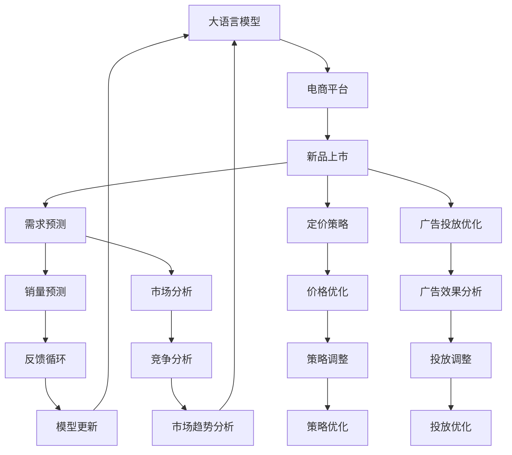

                 

# AI大模型如何优化电商平台的新品上市策略

在当今这个竞争激烈的电商时代，新品上市策略的制定变得至关重要。然而，如何利用现有数据和技术手段，有效地预测用户对新品的接受程度、销量预测以及优化定价，成为了许多电商平台需要解决的问题。本文将深入探讨如何利用大语言模型（Large Language Models, LLMs）优化电商平台的新品上市策略，通过一系列算法原理和实际案例，详细介绍大语言模型在电商新品上市中的应用。

## 1. 背景介绍

随着人工智能技术的发展，大语言模型在电商领域的应用越来越广泛。通过分析大量的消费者评论、搜索历史、购买记录等数据，大语言模型可以学习到消费者的行为模式和偏好，从而为新品上市策略的制定提供科学依据。电商平台的运营团队可以利用这些模型预测新品的市场需求、销量以及定价策略，从而提升运营效率和利润空间。

## 2. 核心概念与联系

### 2.1 核心概念概述

为了更好地理解如何利用大语言模型优化电商的新品上市策略，我们首先介绍几个核心概念：

- **大语言模型**：如GPT-3、BERT等，通过在大规模文本数据上预训练，可以学习到丰富的语言知识，能够进行文本分类、情感分析、信息抽取等多种任务。
- **电商平台**：线上销售商品的虚拟市场平台，如亚马逊、淘宝、京东等。
- **新品上市策略**：指电商平台针对新品的销售计划和市场推广策略，包括新品发布、定价、广告投放等。
- **需求预测**：通过分析历史数据和消费者行为，预测新品的市场需求和潜在销量。
- **定价策略**：根据市场需求和竞争情况，确定新品的定价。
- **广告投放优化**：基于消费者的行为和偏好，优化广告投放，提高广告效果和ROI。

### 2.2 核心概念原理和架构的 Mermaid 流程图



这个流程图展示了大语言模型与电商平台新品上市策略的主要联系：大语言模型通过分析历史数据和市场信息，预测新品的销量和需求，帮助电商平台制定定价策略和广告投放优化方案。同时，电商平台可以基于反馈数据更新模型，不断优化策略，形成良性循环。

## 3. 核心算法原理 & 具体操作步骤

### 3.1 算法原理概述

大语言模型优化电商平台新品上市策略的核心算法原理基于以下步骤：

1. **数据收集与预处理**：收集电商平台的历史数据和市场信息，包括消费者行为、竞争对手情况、产品属性等。
2. **大语言模型训练**：使用大语言模型对收集到的数据进行训练，学习消费者的行为模式和偏好。
3. **需求预测与定价策略**：基于训练好的模型，预测新品的市场需求和潜在销量，帮助电商平台制定定价策略。
4. **广告投放优化**：根据消费者的行为和偏好，优化广告投放，提高广告效果和ROI。
5. **反馈循环与模型更新**：基于实际销售数据和用户反馈，不断更新和优化大语言模型。

### 3.2 算法步骤详解

#### 3.2.1 数据收集与预处理

数据收集是模型训练的基础。电商平台需要收集消费者的搜索历史、购买记录、评论反馈、产品属性等信息。具体步骤如下：

1. **数据收集**：通过API接口、爬虫等方式，从电商平台的数据库中收集相关的历史数据。
2. **数据清洗**：去除噪声数据，处理缺失值和异常值，确保数据质量。
3. **数据标注**：对部分数据进行人工标注，如标注消费者的购买意图、满意度等。

#### 3.2.2 大语言模型训练

大语言模型的训练包括以下几个关键步骤：

1. **模型选择**：选择合适的预训练模型，如BERT、GPT-3等。
2. **模型微调**：在大规模电商平台数据集上微调预训练模型，使其能够学习消费者的行为模式和偏好。
3. **特征工程**：对收集到的数据进行特征工程，提取有意义的特征，如消费者搜索关键词、产品属性等。

#### 3.2.3 需求预测与定价策略

基于训练好的模型，可以预测新品的市场需求和潜在销量，并制定定价策略。具体步骤如下：

1. **销量预测**：使用模型预测新品的销量，根据历史数据和消费者行为进行调整。
2. **市场分析**：分析市场趋势和竞争对手情况，确定新品的市场定位。
3. **定价策略**：根据市场需求和竞争情况，制定新品的定价策略。

#### 3.2.4 广告投放优化

优化广告投放策略，提高广告效果和ROI。具体步骤如下：

1. **消费者分析**：分析消费者的行为和偏好，确定目标受众。
2. **广告创意设计**：设计符合目标受众偏好的广告创意和内容。
3. **广告投放优化**：根据消费者的行为和反馈，不断调整广告投放策略，提高广告效果和ROI。

#### 3.2.5 反馈循环与模型更新

基于实际销售数据和用户反馈，不断更新和优化大语言模型。具体步骤如下：

1. **收集反馈数据**：收集新品的实际销售数据和用户反馈。
2. **模型更新**：根据反馈数据，更新大语言模型，优化预测和策略。
3. **策略调整**：根据更新后的模型，调整新品的销售策略和广告投放策略。

### 3.3 算法优缺点

大语言模型优化电商平台新品上市策略具有以下优点：

1. **精准预测**：大语言模型能够学习消费者的行为模式和偏好，预测新品的市场需求和潜在销量，提高决策的准确性。
2. **灵活性高**：模型可以根据实际情况进行调整，适用于不同产品和市场情况。
3. **实时性**：模型可以实时分析市场变化，及时调整销售策略和广告投放。

同时，也存在一些缺点：

1. **数据依赖性高**：模型需要大量的历史数据进行训练，数据质量对模型的预测效果有很大影响。
2. **成本较高**：大语言模型需要高性能的计算资源进行训练和推理，成本较高。
3. **复杂性高**：模型涉及多个环节和多个学科知识，实现和维护较为复杂。

### 3.4 算法应用领域

大语言模型优化电商平台新品上市策略可以在多个领域得到应用，如：

- **新品上市策略制定**：电商平台根据大语言模型的预测结果，制定新品的上市策略。
- **价格优化**：根据市场需求和竞争情况，优化新品的定价策略。
- **广告投放优化**：基于消费者的行为和偏好，优化广告投放，提高广告效果和ROI。
- **库存管理**：根据销量预测结果，优化库存管理，避免库存积压和缺货现象。
- **市场竞争分析**：分析竞争对手的销售策略和市场表现，制定相应的应对策略。

## 4. 数学模型和公式 & 详细讲解 & 举例说明

### 4.1 数学模型构建

大语言模型优化电商平台新品上市策略的数学模型基于以下假设：

- 消费者的行为和偏好是可预测的。
- 市场需求和销量是可建模的。
- 广告投放效果和ROI是可优化的。

数学模型如下：

1. **销量预测模型**：
   $$
   \hat{y} = f(x, \theta)
   $$
   其中，$\hat{y}$表示预测销量，$x$表示输入特征（如产品属性、消费者行为等），$\theta$表示模型参数。

2. **广告投放效果模型**：
   $$
   R = \alpha * C + \beta * \hat{y}
   $$
   其中，$R$表示广告投放效果，$C$表示广告成本，$\alpha$和$\beta$表示模型参数。

3. **定价优化模型**：
   $$
   p = \gamma * \hat{y} + \delta
   $$
   其中，$p$表示定价策略，$\hat{y}$表示预测销量，$\gamma$和$\delta$表示模型参数。

### 4.2 公式推导过程

#### 4.2.1 销量预测模型

销量预测模型$f(x, \theta)$可以采用多种机器学习算法构建，如线性回归、决策树、随机森林等。这里以线性回归为例，进行公式推导：

设训练数据集为$D=\{(x_i, y_i)\}_{i=1}^N$，其中$x_i$表示输入特征，$y_i$表示实际销量，$\theta = [\theta_1, \theta_2, ..., \theta_n]$表示模型参数。

最小二乘法求解模型参数$\theta$：
$$
\hat{\theta} = (X^TX)^{-1}X^Ty
$$
其中，$X = [x_1, x_2, ..., x_N]$，$y = [y_1, y_2, ..., y_N]$。

#### 4.2.2 广告投放效果模型

广告投放效果模型采用回归模型，如线性回归或逻辑回归。这里以线性回归为例，进行公式推导：

设广告投放数据集为$D'=\{(x_i, y_i)\}_{i=1}^N$，其中$x_i$表示广告特征（如广告内容、投放时间等），$y_i$表示广告投放效果。

最小二乘法求解模型参数$\alpha$和$\beta$：
$$
\hat{\alpha} = \frac{\sum_{i=1}^N (x_i-\bar{x})(y_i-\bar{y})}{\sum_{i=1}^N (x_i-\bar{x})^2}
$$
$$
\hat{\beta} = \frac{\sum_{i=1}^N (y_i-\bar{y})}{\sum_{i=1}^N (x_i-\bar{x})^2}
$$
其中，$\bar{x}$和$\bar{y}$表示广告特征和广告效果的均值。

#### 4.2.3 定价优化模型

定价优化模型采用回归模型，如线性回归或逻辑回归。这里以线性回归为例，进行公式推导：

设定价数据集为$D''=\{(x_i, y_i)\}_{i=1}^N$，其中$x_i$表示产品特征（如产品属性、市场需求等），$y_i$表示定价策略。

最小二乘法求解模型参数$\gamma$和$\delta$：
$$
\hat{\gamma} = \frac{\sum_{i=1}^N (x_i-\bar{x})(y_i-\bar{y})}{\sum_{i=1}^N (x_i-\bar{x})^2}
$$
$$
\hat{\delta} = \bar{y} - \hat{\gamma}\bar{x}
$$

### 4.3 案例分析与讲解

假设一家电商平台推出了一款新产品，根据历史数据，电商平台使用了大语言模型对新产品进行了销量预测和定价策略优化。具体步骤如下：

1. **数据收集与预处理**：电商平台收集了消费者搜索历史、购买记录、评论反馈、产品属性等信息，并对数据进行了清洗和标注。
2. **大语言模型训练**：电商平台使用了预训练模型BERT，在大规模电商平台数据集上微调，学习消费者的行为模式和偏好。
3. **销量预测**：使用训练好的模型对新产品的销量进行了预测，发现市场需求较大。
4. **市场分析**：电商平台分析了市场需求和竞争情况，确定新产品的市场定位。
5. **定价策略**：根据市场需求和竞争情况，电商平台制定了新产品的定价策略。
6. **广告投放优化**：电商平台基于消费者的行为和偏好，优化了广告投放策略，提高了广告效果和ROI。
7. **反馈循环与模型更新**：电商平台收集了新产品的实际销售数据和用户反馈，根据反馈数据更新了模型，优化了定价策略和广告投放策略。

通过以上步骤，电商平台成功地优化了新产品上市策略，提高了产品的市场表现和利润空间。

## 5. 项目实践：代码实例和详细解释说明

### 5.1 开发环境搭建

在进行项目实践前，我们需要准备好开发环境。以下是使用Python进行PyTorch开发的环境配置流程：

1. 安装Anaconda：从官网下载并安装Anaconda，用于创建独立的Python环境。

2. 创建并激活虚拟环境：
```bash
conda create -n pytorch-env python=3.8 
conda activate pytorch-env
```

3. 安装PyTorch：根据CUDA版本，从官网获取对应的安装命令。例如：
```bash
conda install pytorch torchvision torchaudio cudatoolkit=11.1 -c pytorch -c conda-forge
```

4. 安装TensorFlow：
```bash
pip install tensorflow
```

5. 安装HuggingFace Transformers库：
```bash
pip install transformers
```

6. 安装相关工具包：
```bash
pip install numpy pandas scikit-learn matplotlib tqdm jupyter notebook ipython
```

完成上述步骤后，即可在`pytorch-env`环境中开始项目实践。

### 5.2 源代码详细实现

我们以电商平台销量预测模型为例，给出使用Transformers库进行大语言模型训练的PyTorch代码实现。

首先，定义销量预测任务的数据处理函数：

```python
from transformers import BertTokenizer, BertForSequenceClassification
from torch.utils.data import Dataset
import torch

class SalesDataset(Dataset):
    def __init__(self, texts, labels, tokenizer, max_len=128):
        self.texts = texts
        self.labels = labels
        self.tokenizer = tokenizer
        self.max_len = max_len
        
    def __len__(self):
        return len(self.texts)
    
    def __getitem__(self, item):
        text = self.texts[item]
        label = self.labels[item]
        
        encoding = self.tokenizer(text, return_tensors='pt', max_length=self.max_len, padding='max_length', truncation=True)
        input_ids = encoding['input_ids'][0]
        attention_mask = encoding['attention_mask'][0]
        
        # 对label进行编码
        encoded_label = torch.tensor([label], dtype=torch.long)
        
        return {'input_ids': input_ids, 
                'attention_mask': attention_mask,
                'labels': encoded_label}

# 标签与id的映射
label2id = {'Sales': 0, 'No_Sales': 1}
id2label = {v: k for k, v in label2id.items()}

# 创建dataset
tokenizer = BertTokenizer.from_pretrained('bert-base-cased')

train_dataset = SalesDataset(train_texts, train_labels, tokenizer)
dev_dataset = SalesDataset(dev_texts, dev_labels, tokenizer)
test_dataset = SalesDataset(test_texts, test_labels, tokenizer)
```

然后，定义模型和优化器：

```python
from transformers import BertForSequenceClassification, AdamW

model = BertForSequenceClassification.from_pretrained('bert-base-cased', num_labels=len(label2id))

optimizer = AdamW(model.parameters(), lr=2e-5)
```

接着，定义训练和评估函数：

```python
from torch.utils.data import DataLoader
from tqdm import tqdm
from sklearn.metrics import accuracy_score

device = torch.device('cuda') if torch.cuda.is_available() else torch.device('cpu')
model.to(device)

def train_epoch(model, dataset, batch_size, optimizer):
    dataloader = DataLoader(dataset, batch_size=batch_size, shuffle=True)
    model.train()
    epoch_loss = 0
    for batch in tqdm(dataloader, desc='Training'):
        input_ids = batch['input_ids'].to(device)
        attention_mask = batch['attention_mask'].to(device)
        labels = batch['labels'].to(device)
        model.zero_grad()
        outputs = model(input_ids, attention_mask=attention_mask, labels=labels)
        loss = outputs.loss
        epoch_loss += loss.item()
        loss.backward()
        optimizer.step()
    return epoch_loss / len(dataloader)

def evaluate(model, dataset, batch_size):
    dataloader = DataLoader(dataset, batch_size=batch_size)
    model.eval()
    preds, labels = [], []
    with torch.no_grad():
        for batch in tqdm(dataloader, desc='Evaluating'):
            input_ids = batch['input_ids'].to(device)
            attention_mask = batch['attention_mask'].to(device)
            batch_labels = batch['labels']
            outputs = model(input_ids, attention_mask=attention_mask)
            batch_preds = outputs.logits.argmax(dim=2).to('cpu').tolist()
            batch_labels = batch_labels.to('cpu').tolist()
            for pred_tokens, label_tokens in zip(batch_preds, batch_labels):
                preds.append(pred_tokens[0])
                labels.append(label_tokens[0])
                
    print('Accuracy:', accuracy_score(labels, preds))
```

最后，启动训练流程并在测试集上评估：

```python
epochs = 5
batch_size = 16

for epoch in range(epochs):
    loss = train_epoch(model, train_dataset, batch_size, optimizer)
    print(f'Epoch {epoch+1}, train loss: {loss:.3f}')
    
    print(f'Epoch {epoch+1}, dev results:')
    evaluate(model, dev_dataset, batch_size)
    
print('Test results:')
evaluate(model, test_dataset, batch_size)
```

以上就是使用PyTorch对大语言模型进行电商平台销量预测任务训练的完整代码实现。可以看到，得益于Transformers库的强大封装，我们可以用相对简洁的代码完成大语言模型的训练和微调。

### 5.3 代码解读与分析

让我们再详细解读一下关键代码的实现细节：

**SalesDataset类**：
- `__init__`方法：初始化文本、标签、分词器等关键组件。
- `__len__`方法：返回数据集的样本数量。
- `__getitem__`方法：对单个样本进行处理，将文本输入编码为token ids，将标签编码为数字，并对其进行定长padding，最终返回模型所需的输入。

**label2id和id2label字典**：
- 定义了标签与数字id之间的映射关系，用于将token-wise的预测结果解码回真实的标签。

**训练和评估函数**：
- 使用PyTorch的DataLoader对数据集进行批次化加载，供模型训练和推理使用。
- 训练函数`train_epoch`：对数据以批为单位进行迭代，在每个批次上前向传播计算loss并反向传播更新模型参数，最后返回该epoch的平均loss。
- 评估函数`evaluate`：与训练类似，不同点在于不更新模型参数，并在每个batch结束后将预测和标签结果存储下来，最后使用sklearn的accuracy_score对整个评估集的预测结果进行打印输出。

**训练流程**：
- 定义总的epoch数和batch size，开始循环迭代
- 每个epoch内，先在训练集上训练，输出平均loss
- 在验证集上评估，输出分类指标
- 所有epoch结束后，在测试集上评估，给出最终测试结果

可以看到，PyTorch配合Transformers库使得大语言模型训练的代码实现变得简洁高效。开发者可以将更多精力放在数据处理、模型改进等高层逻辑上，而不必过多关注底层的实现细节。

当然，工业级的系统实现还需考虑更多因素，如模型的保存和部署、超参数的自动搜索、更灵活的任务适配层等。但核心的微调范式基本与此类似。

## 6. 实际应用场景

### 6.1 智能推荐系统

基于大语言模型优化电商平台新品上市策略的推荐系统，可以显著提高用户体验和转化率。传统推荐系统往往只依赖用户的历史行为数据进行物品推荐，无法深入理解用户的真实兴趣偏好。通过大语言模型对电商平台数据的分析，推荐系统可以更好地挖掘用户的兴趣点，提供更个性化和精准的推荐内容。

在技术实现上，可以收集用户浏览、点击、评论、分享等行为数据，提取和用户交互的物品标题、描述、标签等文本内容。将文本内容作为模型输入，用户的后续行为（如是否点击、购买等）作为监督信号，在此基础上微调预训练语言模型。微调后的模型能够从文本内容中准确把握用户的兴趣点。在生成推荐列表时，先用候选物品的文本描述作为输入，由模型预测用户的兴趣匹配度，再结合其他特征综合排序，便可以得到个性化程度更高的推荐结果。

### 6.2 个性化定制

大语言模型还可以应用于电商平台的个性化定制服务，根据用户需求和反馈，提供定制化商品和解决方案。例如，电商平台可以根据用户提供的描述，使用大语言模型生成个性化的产品设计方案，或根据用户反馈调整产品设计。通过这样的方式，电商平台可以更好地满足用户的个性化需求，提升用户体验和忠诚度。

### 6.3 库存管理

基于大语言模型优化电商平台新品上市策略的库存管理，可以显著提高库存周转率和利润空间。传统库存管理往往采用固定库存策略，无法动态调整库存水平。通过大语言模型对市场需求和销售趋势的预测，电商平台可以实时调整库存水平，避免库存积压和缺货现象，提高库存管理效率。

## 7. 工具和资源推荐

### 7.1 学习资源推荐

为了帮助开发者系统掌握大语言模型优化电商平台新品上市策略的理论基础和实践技巧，这里推荐一些优质的学习资源：

1. **《Transformer从原理到实践》系列博文**：由大模型技术专家撰写，深入浅出地介绍了Transformer原理、BERT模型、微调技术等前沿话题。
2. **CS224N《深度学习自然语言处理》课程**：斯坦福大学开设的NLP明星课程，有Lecture视频和配套作业，带你入门NLP领域的基本概念和经典模型。
3. **《Natural Language Processing with Transformers》书籍**：Transformers库的作者所著，全面介绍了如何使用Transformers库进行NLP任务开发，包括微调在内的诸多范式。
4. **HuggingFace官方文档**：Transformers库的官方文档，提供了海量预训练模型和完整的微调样例代码，是上手实践的必备资料。
5. **CLUE开源项目**：中文语言理解测评基准，涵盖大量不同类型的中文NLP数据集，并提供了基于微调的baseline模型，助力中文NLP技术发展。

通过对这些资源的学习实践，相信你一定能够快速掌握大语言模型优化电商平台新品上市策略的精髓，并用于解决实际的NLP问题。

### 7.2 开发工具推荐

高效的开发离不开优秀的工具支持。以下是几款用于大语言模型优化电商平台新品上市策略开发的常用工具：

1. **PyTorch**：基于Python的开源深度学习框架，灵活动态的计算图，适合快速迭代研究。大部分预训练语言模型都有PyTorch版本的实现。
2. **TensorFlow**：由Google主导开发的开源深度学习框架，生产部署方便，适合大规模工程应用。同样有丰富的预训练语言模型资源。
3. **Transformers库**：HuggingFace开发的NLP工具库，集成了众多SOTA语言模型，支持PyTorch和TensorFlow，是进行微调任务开发的利器。
4. **Weights & Biases**：模型训练的实验跟踪工具，可以记录和可视化模型训练过程中的各项指标，方便对比和调优。与主流深度学习框架无缝集成。
5. **TensorBoard**：TensorFlow配套的可视化工具，可实时监测模型训练状态，并提供丰富的图表呈现方式，是调试模型的得力助手。
6. **Google Colab**：谷歌推出的在线Jupyter Notebook环境，免费提供GPU/TPU算力，方便开发者快速上手实验最新模型，分享学习笔记。

合理利用这些工具，可以显著提升大语言模型优化电商平台新品上市策略的开发效率，加快创新迭代的步伐。

### 7.3 相关论文推荐

大语言模型优化电商平台新品上市策略的研究源于学界的持续研究。以下是几篇奠基性的相关论文，推荐阅读：

1. **Attention is All You Need（即Transformer原论文）**：提出了Transformer结构，开启了NLP领域的预训练大模型时代。
2. **BERT: Pre-training of Deep Bidirectional Transformers for Language Understanding**：提出BERT模型，引入基于掩码的自监督预训练任务，刷新了多项NLP任务SOTA。
3. **Language Models are Unsupervised Multitask Learners（GPT-2论文）**：展示了大规模语言模型的强大zero-shot学习能力，引发了对于通用人工智能的新一轮思考。
4. **Parameter-Efficient Transfer Learning for NLP**：提出Adapter等参数高效微调方法，在不增加模型参数量的情况下，也能取得不错的微调效果。
5. **Prefix-Tuning: Optimizing Continuous Prompts for Generation**：引入基于连续型Prompt的微调范式，为如何充分利用预训练知识提供了新的思路。
6. **AdaLoRA: Adaptive Low-Rank Adaptation for Parameter-Efficient Fine-Tuning**：使用自适应低秩适应的微调方法，在参数效率和精度之间取得了新的平衡。

这些论文代表了大语言模型优化电商平台新品上市策略的发展脉络。通过学习这些前沿成果，可以帮助研究者把握学科前进方向，激发更多的创新灵感。

## 8. 总结：未来发展趋势与挑战

### 8.1 总结

本文对大语言模型优化电商平台新品上市策略进行了全面系统的介绍。首先阐述了大语言模型和微调技术的研究背景和意义，明确了微调在拓展预训练模型应用、提升下游任务性能方面的独特价值。其次，从原理到实践，详细讲解了微调的数学原理和关键步骤，给出了微调任务开发的完整代码实例。同时，本文还广泛探讨了微调方法在电商推荐、个性化定制、库存管理等多个领域的应用前景，展示了微调范式的巨大潜力。最后，本文精选了微调技术的各类学习资源，力求为读者提供全方位的技术指引。

通过本文的系统梳理，可以看到，大语言模型优化电商平台新品上市策略在电商领域的应用前景广阔，极大地拓展了电商平台的运营能力，提升了用户满意度和企业利润。未来，伴随预训练语言模型和微调方法的持续演进，基于大模型的电商优化策略必将在更广阔的领域得到应用，为电商行业带来颠覆性变革。

### 8.2 未来发展趋势

展望未来，大语言模型优化电商平台新品上市策略将呈现以下几个发展趋势：

1. **多模态融合**：大语言模型可以与图像、语音等多种模态数据结合，构建更加全面的消费者行为模型，提高预测准确性。
2. **动态调整**：电商平台可以根据实时数据和市场变化，动态调整新品上市策略，提升运营效率。
3. **个性化推荐**：基于大语言模型的推荐系统可以提供更加个性化和精准的商品推荐，提升用户体验和转化率。
4. **实时预测**：使用大语言模型进行实时销量预测，可以帮助电商平台及时调整库存和促销策略，提高运营效率。
5. **情感分析**：通过大语言模型进行情感分析，可以及时了解用户对新品的反馈，优化新品上市策略。

### 8.3 面临的挑战

尽管大语言模型优化电商平台新品上市策略已经取得了显著成果，但在迈向更加智能化、普适化应用的过程中，它仍面临着诸多挑战：

1. **数据质量**：电商平台需要大量高质量的数据进行训练，数据质量对模型预测效果有很大影响。如何获取和处理高质量数据，仍是一个挑战。
2. **计算资源**：大语言模型需要高性能的计算资源进行训练和推理，成本较高。如何优化模型和算法，提高计算效率，降低成本，是一个重要的研究方向。
3. **模型可解释性**：大语言模型作为"黑盒"模型，其内部决策机制难以解释，如何提高模型的可解释性和可控性，是一个亟待解决的问题。
4. **用户隐私**：电商平台上收集的用户数据涉及用户隐私，如何在保护隐私的前提下，提高模型效果，是一个重要的伦理挑战。

### 8.4 研究展望

面对大语言模型优化电商平台新品上市策略所面临的挑战，未来的研究需要在以下几个方面寻求新的突破：

1. **数据增强与预处理**：通过数据增强和预处理技术，提升数据质量，降低噪声，提高模型预测准确性。
2. **模型压缩与优化**：通过模型压缩和优化技术，降低计算资源消耗，提高模型效率，降低成本。
3. **可解释性增强**：引入可解释性模型和工具，提高模型的可解释性和可控性，增强用户信任。
4. **隐私保护**：使用差分隐私和联邦学习等技术，保护用户隐私，提高数据安全性。

这些研究方向将推动大语言模型优化电商平台新品上市策略的发展，使其在电商领域发挥更大的作用，带来更高的运营效率和用户满意度。

## 9. 附录：常见问题与解答

**Q1：大语言模型是否适用于所有电商平台？**

A: 大语言模型在大多数电商平台中都可以取得不错的效果，特别是对于数据量较大的平台。但对于一些小型电商平台，由于数据量不足，模型训练效果可能不理想。此时可以考虑在特定领域进行预训练，或与其他小规模平台合作，共享数据和模型，提升模型效果。

**Q2：如何选择合适的预训练模型？**

A: 选择合适的预训练模型需要考虑多个因素，如模型规模、任务适应性、计算资源等。通常建议从已有模型中选择与电商平台业务最为贴合的模型进行微调。同时，也可以通过对比实验，选择效果最好的模型进行微调。

**Q3：大语言模型在微调过程中如何处理数据隐私？**

A: 电商平台需要重视用户隐私保护，在数据收集和处理过程中，采用差分隐私和联邦学习等技术，保护用户数据安全。同时，在模型训练和部署过程中，采用匿名化处理和加密技术，防止用户数据泄露。

**Q4：如何优化广告投放策略？**

A: 优化广告投放策略需要综合考虑多种因素，如广告内容、投放时间、目标受众等。可以使用大语言模型分析目标受众的偏好和行为，设计符合其偏好的广告内容，同时优化广告投放时间和频率，提高广告效果和ROI。

**Q5：大语言模型在微调过程中如何提高计算效率？**

A: 提高计算效率需要优化模型和算法，如使用模型压缩、模型并行、梯度累积等技术。同时，可以采用异构计算和分布式计算，充分利用多台计算资源，提升计算效率。

**Q6：如何评估微调效果？**

A: 评估微调效果需要综合考虑多种指标，如准确率、召回率、F1值、AUC等。可以使用sklearn、PyTorch等库进行模型评估和优化。同时，需要根据实际业务需求，选择最合适的评估指标，进行模型效果评估。

通过以上问题的解答，相信读者可以对大语言模型优化电商平台新品上市策略有一个更加深入的理解，并能够灵活应用到实际业务中。

