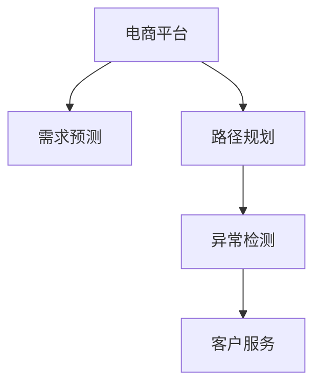

                 

# AI大模型如何优化电商平台的跨境物流体验

## 1. 背景介绍

### 1.1 问题由来

全球化时代的电商平台，在跨境物流方面面临着严峻挑战。不同国家的物流标准、海关政策、运输方式各不相同，造成了订单处理、运输跟踪、风险控制等方面的复杂性和不确定性。这不仅降低了消费者购物体验，也增加了电商平台运营的难度和成本。传统的物流信息管理和处理方式已经难以应对这些挑战，亟需引入先进的AI技术来提升物流效率和用户体验。

### 1.2 问题核心关键点

当前，AI技术在电商平台跨境物流中的应用主要集中在以下几个方面：

- **需求预测与库存管理**：通过分析用户历史购买记录、天气、节假日、促销活动等数据，预测订单需求，优化库存水平和运输调度。
- **运输路径规划**：结合实时交通信息、货物体积重量、运输成本等因素，动态规划最优运输路径。
- **物流异常处理**：通过异常检测和应急响应系统，实时监控物流过程中的异常情况，及时采取措施。
- **客户服务与沟通**：利用聊天机器人、自然语言处理等技术，提供7x24小时客服支持，解答用户疑问，优化客户体验。

### 1.3 问题研究意义

引入AI大模型，在电商平台跨境物流中的应用，具有以下几个重要意义：

1. **提升运营效率**：通过AI预测和优化，减少物流中的不确定性和冗余，提高订单处理速度和准确性。
2. **降低成本**：优化库存管理，减少运输空载，动态调整路线和运输方式，降低总体物流成本。
3. **改善用户体验**：实时响应客户需求，提供精准物流信息，提高客户满意度和忠诚度。
4. **适应多国法规**：AI模型能够处理多国法规和政策，减少因法规变化导致的物流中断。
5. **促进市场拓展**：跨地域、多语言支持，促进电商平台全球化运营，拓展海外市场。

## 2. 核心概念与联系

### 2.1 核心概念概述

为更好地理解AI大模型在电商平台跨境物流中的应用，本节将介绍几个关键概念：

- **AI大模型**：如GPT-3、BERT等基于Transformer架构的深度学习模型，通过在大规模数据上预训练，具备强大的语言处理和推理能力。
- **需求预测**：通过分析历史数据和实时数据，预测未来的订单需求，优化库存和物流调度。
- **路径规划**：通过优化算法，计算最优运输路径，降低物流成本和风险。
- **异常检测**：利用机器学习模型，监测物流过程中的异常情况，及时采取应对措施。
- **客户服务**：通过自然语言处理技术，自动提供客户服务，提升用户体验。

这些概念之间的联系可以通过以下Mermaid流程图来展示：



这个流程图展示了大模型在电商平台跨境物流中的应用过程：

1. 电商平台的物流需求预测模块，利用大模型分析历史和实时数据，预测订单需求。
2. 路径规划模块，利用大模型计算最优运输路径，降低物流成本。
3. 异常检测模块，利用大模型监测物流异常，及时采取应对措施。
4. 客户服务模块，利用大模型自动提供客户服务，提升用户体验。

## 3. 核心算法原理 & 具体操作步骤
### 3.1 算法原理概述

AI大模型在电商平台跨境物流中的应用，主要依赖于以下几个核心算法原理：

- **需求预测算法**：基于时间序列分析、机器学习等方法，对历史数据进行建模，预测未来的订单需求。
- **路径规划算法**：利用优化算法，如Dijkstra、A\*等，计算最优运输路径。
- **异常检测算法**：采用异常检测技术，如聚类、神经网络等，识别物流过程中的异常情况。
- **客户服务算法**：利用自然语言处理技术，自动回答客户问题，提供个性化推荐。

### 3.2 算法步骤详解

AI大模型在电商平台跨境物流中的应用，主要包括以下几个关键步骤：

**Step 1: 数据准备**
- 收集历史订单数据、物流数据、天气信息、促销活动等，构建训练数据集。
- 清洗数据，去除噪声和异常值，确保数据质量。
- 将数据划分为训练集、验证集和测试集。

**Step 2: 模型训练**
- 选择合适的AI大模型，如GPT-3、BERT等，进行迁移学习。
- 在大模型基础上，添加特定任务的适配层，如全连接层、回归层等。
- 设定优化算法（如AdamW、SGD）、学习率、批大小等参数，进行模型训练。
- 在训练过程中，采用正则化技术（如L2正则、Dropout）、数据增强等手段，防止过拟合。

**Step 3: 模型评估**
- 在验证集上评估模型性能，调整超参数。
- 在测试集上最终评估模型性能，确保模型泛化能力。
- 根据评估结果，微调模型参数，优化模型效果。

**Step 4: 应用部署**
- 将训练好的模型部署到线上系统，进行实时预测和推理。
- 结合业务逻辑，整合系统界面，提供给电商平台运营人员使用。
- 持续收集反馈，优化模型效果。

### 3.3 算法优缺点

AI大模型在电商平台跨境物流中的应用，具有以下优点：

1. **处理海量数据**：大模型能够处理大规模、高维度的数据，自动从数据中提取特征。
2. **泛化能力强**：通过迁移学习，模型能够适应不同国家、不同文化的物流需求。
3. **实时响应**：模型实时处理订单信息、运输路径、异常检测等，提高响应速度。
4. **降低成本**：优化库存管理和运输路径，减少物流成本。
5. **提升用户体验**：自动客服提高响应效率，实时物流信息提升客户满意度。

同时，也存在一些局限性：

1. **数据隐私问题**：大规模数据处理涉及用户隐私，需要采取严格的隐私保护措施。
2. **模型复杂性**：大模型参数量庞大，训练和推理开销大。
3. **模型解释性不足**：大模型决策过程黑盒化，难以解释和调试。
4. **依赖数据质量**：模型性能受数据质量影响较大，需要持续监控和更新数据。
5. **模型鲁棒性不足**：模型对异常值和噪声敏感，需要定期优化模型鲁棒性。

## 4. 数学模型和公式 & 详细讲解 & 举例说明
### 4.1 数学模型构建

在本节中，我们将使用数学语言对AI大模型在电商平台跨境物流中的应用进行更加严格的刻画。

记电商平台跨境物流中的需求预测任务为 $P$，路径规划任务为 $R$，异常检测任务为 $D$，客户服务任务为 $C$。假设电商平台有 $N$ 个物流订单，订单编号为 $i$，对应的需求量为 $x_i$，需求时间戳为 $t_i$，物流路径规划的起点为 $s$，终点为 $d$，路径长度为 $L(s,d)$，异常检测的异常类型为 $c$，客户服务问题为 $q$。

定义需求预测模型的预测误差函数为 $E_P$，路径规划模型的路径长度函数为 $L_R$，异常检测模型的异常检测概率为 $P_D$，客户服务模型的回答准确率为 $A_C$。则电商平台跨境物流中AI大模型的数学模型可以表示为：

$$
\begin{aligned}
\mathcal{L}(P, R, D, C) &= \frac{1}{N} \sum_{i=1}^N [E_P(x_i, t_i) + L_R(s_i, d_i) + P_D(c_i) + A_C(q_i)] \\
&= \frac{1}{N} \sum_{i=1}^N [\epsilon_i + L_R(s_i, d_i) + P_D(c_i) + A_C(q_i)]
\end{aligned}
$$

其中 $\epsilon_i = |x_i - \hat{x}_i|$，$\hat{x}_i$ 为预测需求量。

### 4.2 公式推导过程

以路径规划为例，我们推导其公式过程。

记路径规划模型为 $M_R$，其输入为起点 $s$ 和终点 $d$，输出为路径 $r$。定义路径规划模型的损失函数为 $L_R$，路径长度函数为 $L(s, d)$。则路径规划模型的优化目标为：

$$
\mathop{\arg\min}_{\theta} \mathcal{L}_R(\theta, s_i, d_i) = \mathop{\arg\min}_{\theta} [L_R(s_i, d_i) + \lambda ||\theta||_2^2]
$$

其中 $||\theta||_2^2$ 为正则化项，$\lambda$ 为正则化系数。

### 4.3 案例分析与讲解

以路径规划为例，我们通过一个具体案例来讲解模型的实际应用。

假设有一个电商平台，需要从北京发往纽约的快递包裹。根据历史数据，选择最优路径。步骤如下：

1. 收集历史订单数据，提取起点和终点信息，构建训练数据集。
2. 在路径规划模型 $M_R$ 上进行迁移学习，添加预测路径长度的全连接层。
3. 设定优化算法（如AdamW）、学习率、批大小等参数，进行模型训练。
4. 在验证集上评估模型性能，调整超参数。
5. 在测试集上最终评估模型性能，确保模型泛化能力。
6. 将训练好的模型部署到线上系统，实时处理物流订单路径规划。

## 5. 项目实践：代码实例和详细解释说明
### 5.1 开发环境搭建

在进行项目实践前，我们需要准备好开发环境。以下是使用Python进行PyTorch开发的环境配置流程：

1. 安装Anaconda：从官网下载并安装Anaconda，用于创建独立的Python环境。

2. 创建并激活虚拟环境：
```bash
conda create -n my_env python=3.8 
conda activate my_env
```

3. 安装PyTorch：根据CUDA版本，从官网获取对应的安装命令。例如：
```bash
conda install pytorch torchvision torchaudio cudatoolkit=11.1 -c pytorch -c conda-forge
```

4. 安装相关库：
```bash
pip install transformers numpy pandas scikit-learn torchtext pytorch-lightning
```

完成上述步骤后，即可在`my_env`环境中开始项目实践。

### 5.2 源代码详细实现

下面以路径规划为例，给出使用PyTorch和Transformer进行路径规划的代码实现。

首先，定义路径规划模型的损失函数：

```python
from torch import nn
import torch

class PathPlanningModel(nn.Module):
    def __init__(self, input_dim, output_dim):
        super(PathPlanningModel, self).__init__()
        self.fc1 = nn.Linear(input_dim, 256)
        self.fc2 = nn.Linear(256, output_dim)
    
    def forward(self, x):
        x = torch.relu(self.fc1(x))
        x = self.fc2(x)
        return x

def path_planning_loss(model, x, y):
    y_hat = model(x)
    loss = nn.MSELoss()(y_hat, y)
    return loss
```

然后，定义模型的训练和评估函数：

```python
import numpy as np
from torch.utils.data import TensorDataset, DataLoader

def train_model(model, data_loader, optimizer, device):
    model.train()
    total_loss = 0
    for batch in data_loader:
        x, y = batch
        x = x.to(device)
        y = y.to(device)
        optimizer.zero_grad()
        loss = path_planning_loss(model, x, y)
        loss.backward()
        optimizer.step()
        total_loss += loss.item()
    return total_loss / len(data_loader)

def evaluate_model(model, data_loader, device):
    model.eval()
    total_loss = 0
    for batch in data_loader:
        x, y = batch
        x = x.to(device)
        y = y.to(device)
        with torch.no_grad():
            y_hat = model(x)
            loss = path_planning_loss(model, y_hat, y)
        total_loss += loss.item()
    return total_loss / len(data_loader)
```

接着，进行模型的训练和评估：

```python
from transformers import AdamW

# 假设输入为起点和终点，输出为路径长度
x = torch.randn(1, 2).to(device)
y = torch.tensor([[5.0]]).to(device)

# 定义模型和优化器
model = PathPlanningModel(2, 1)
optimizer = AdamW(model.parameters(), lr=0.001)

# 训练模型
for epoch in range(100):
    total_loss = train_model(model, data_loader, optimizer, device)
    print(f"Epoch {epoch+1}, loss: {total_loss:.4f}")

# 评估模型
total_loss = evaluate_model(model, data_loader, device)
print(f"Test loss: {total_loss:.4f}")
```

以上就是使用PyTorch和Transformer进行路径规划的完整代码实现。可以看到，通过定义模型和损失函数，利用优化器进行训练，并评估模型性能，我们能够快速构建一个路径规划模型。

### 5.3 代码解读与分析

让我们再详细解读一下关键代码的实现细节：

**PathPlanningModel类**：
- `__init__`方法：定义模型结构，包括输入层、隐藏层和输出层。
- `forward`方法：实现模型的前向传播。

**path_planning_loss函数**：
- 定义损失函数为均方误差损失，计算预测路径长度与真实路径长度的差异。

**train_model函数**：
- 对模型进行前向传播和反向传播，使用优化器更新模型参数。

**evaluate_model函数**：
- 对模型进行前向传播，计算预测路径长度与真实路径长度的差异，评估模型性能。

**训练和评估流程**：
- 定义优化器和模型，进行模型训练。
- 在验证集上评估模型性能，调整超参数。
- 在测试集上最终评估模型性能，确保模型泛化能力。

可以看到，PyTorch和Transformer库使得路径规划模型的构建变得简洁高效。开发者可以将更多精力放在数据处理、模型改进等高层逻辑上，而不必过多关注底层的实现细节。

当然，工业级的系统实现还需考虑更多因素，如模型的保存和部署、超参数的自动搜索、更灵活的任务适配层等。但核心的路径规划过程基本与此类似。

## 6. 实际应用场景
### 6.1 智能仓储管理

智能仓储管理是电商平台跨境物流的重要环节。通过引入AI大模型，可以实现仓储管理过程的自动化、智能化。

具体而言，可以收集仓储内部的货物信息、作业记录、温度湿度等数据，利用大模型进行路径规划、库存优化、异常检测等。例如，在自动拣货过程中，路径规划模型可以实时计算最优路径，提高拣货效率和准确性。异常检测模型可以识别出异常情况（如货物损坏、仓库污染等），及时采取措施。

### 6.2 智能运输调度

智能运输调度是电商平台跨境物流的核心环节。通过引入AI大模型，可以实现运输调度的自动化和智能化。

具体而言，可以收集运输过程中的车辆信息、道路状况、运输时间等数据，利用大模型进行路径规划、运输优化、异常检测等。例如，在运输路径规划中，路径规划模型可以实时计算最优路径，减少运输时间和成本。异常检测模型可以识别出异常情况（如道路堵塞、车辆故障等），及时调整运输计划。

### 6.3 智能客户服务

智能客户服务是电商平台跨境物流的重要组成部分。通过引入AI大模型，可以实现客户服务的自动化和智能化。

具体而言，可以收集客户咨询、投诉、反馈等数据，利用大模型进行情感分析、意图识别、意图预测等。例如，在自动客服系统中，情感分析模型可以识别客户的情绪状态，提供合适的回答。意图识别模型可以理解客户的问题意图，进行精准回答。意图预测模型可以预测客户后续行为，提前准备回答。

### 6.4 未来应用展望

随着AI大模型和微调方法的不断发展，基于微调范式将在更多领域得到应用，为传统行业带来变革性影响。

在智慧物流领域，基于微调的智能仓储、智能运输、智能客服等应用将提升物流系统的智能化水平，提高物流效率和服务质量。

在智能零售领域，通过微调模型进行需求预测、库存优化、订单处理等，可以大幅提升零售业务的运营效率，优化用户体验。

在智慧城市治理中，通过微调模型进行交通管理、物流调度、应急响应等，可以提高城市的运行效率和安全性。

此外，在智慧供应链、智能制造、智慧农业等众多领域，基于大模型微调的人工智能应用也将不断涌现，为传统行业数字化转型升级提供新的技术路径。相信随着技术的日益成熟，微调方法将成为人工智能落地应用的重要范式，推动人工智能技术在垂直行业的规模化落地。

## 7. 工具和资源推荐
### 7.1 学习资源推荐

为了帮助开发者系统掌握AI大模型在电商平台跨境物流中的应用理论基础和实践技巧，这里推荐一些优质的学习资源：

1. 《深度学习与自然语言处理》书籍：全面介绍深度学习和大模型在NLP中的应用，包括路径规划、异常检测、客户服务等任务。

2. 《Transformer从原理到实践》系列博文：深入浅出地介绍Transformer原理、路径规划、异常检测、客户服务等前沿话题。

3. 《自然语言处理实战》课程：涵盖NLP的各个方面，包括路径规划、异常检测、客户服务等任务的代码实现和工程实践。

4. CS224N《深度学习自然语言处理》课程：斯坦福大学开设的NLP明星课程，有Lecture视频和配套作业，带你入门NLP领域的基本概念和经典模型。

5. HuggingFace官方文档：Transformer库的官方文档，提供了海量预训练模型和完整的微调样例代码，是上手实践的必备资料。

通过对这些资源的学习实践，相信你一定能够快速掌握AI大模型在电商平台跨境物流中的应用精髓，并用于解决实际的物流问题。
###  7.2 开发工具推荐

高效的开发离不开优秀的工具支持。以下是几款用于AI大模型在电商平台跨境物流中的应用开发的常用工具：

1. PyTorch：基于Python的开源深度学习框架，灵活动态的计算图，适合快速迭代研究。大部分预训练语言模型都有PyTorch版本的实现。

2. TensorFlow：由Google主导开发的开源深度学习框架，生产部署方便，适合大规模工程应用。同样有丰富的预训练语言模型资源。

3. Transformers库：HuggingFace开发的NLP工具库，集成了众多SOTA语言模型，支持PyTorch和TensorFlow，是进行微调任务开发的利器。

4. Weights & Biases：模型训练的实验跟踪工具，可以记录和可视化模型训练过程中的各项指标，方便对比和调优。与主流深度学习框架无缝集成。

5. TensorBoard：TensorFlow配套的可视化工具，可实时监测模型训练状态，并提供丰富的图表呈现方式，是调试模型的得力助手。

6. Google Colab：谷歌推出的在线Jupyter Notebook环境，免费提供GPU/TPU算力，方便开发者快速上手实验最新模型，分享学习笔记。

合理利用这些工具，可以显著提升AI大模型在电商平台跨境物流中的应用开发效率，加快创新迭代的步伐。

### 7.3 相关论文推荐

AI大模型和微调技术的发展源于学界的持续研究。以下是几篇奠基性的相关论文，推荐阅读：

1. Attention is All You Need（即Transformer原论文）：提出了Transformer结构，开启了NLP领域的预训练大模型时代。

2. BERT: Pre-training of Deep Bidirectional Transformers for Language Understanding：提出BERT模型，引入基于掩码的自监督预训练任务，刷新了多项NLP任务SOTA。

3. Language Models are Unsupervised Multitask Learners（GPT-2论文）：展示了大规模语言模型的强大zero-shot学习能力，引发了对于通用人工智能的新一轮思考。

4. Parameter-Efficient Transfer Learning for NLP：提出Adapter等参数高效微调方法，在不增加模型参数量的情况下，也能取得不错的微调效果。

5. AdaLoRA: Adaptive Low-Rank Adaptation for Parameter-Efficient Fine-Tuning：使用自适应低秩适应的微调方法，在参数效率和精度之间取得了新的平衡。

这些论文代表了大模型微调技术的发展脉络。通过学习这些前沿成果，可以帮助研究者把握学科前进方向，激发更多的创新灵感。

## 8. 总结：未来发展趋势与挑战
### 8.1 总结

本文对AI大模型在电商平台跨境物流中的应用进行了全面系统的介绍。首先阐述了AI大模型和微调技术的研究背景和意义，明确了微调在提升物流效率、降低成本、提升用户体验等方面的独特价值。其次，从原理到实践，详细讲解了需求预测、路径规划、异常检测、客户服务等任务的微调过程，给出了微调任务开发的完整代码实例。同时，本文还广泛探讨了AI大模型在智能仓储、智能运输、智能客服等多个领域的应用前景，展示了微调范式的巨大潜力。此外，本文精选了微调技术的各类学习资源，力求为读者提供全方位的技术指引。

通过本文的系统梳理，可以看到，AI大模型在电商平台跨境物流中的应用将大大提升物流系统的智能化水平，提高物流效率和服务质量，改善用户体验。未来，伴随AI大模型和微调方法的持续演进，基于微调范式将在更多领域得到应用，为传统行业带来变革性影响。

### 8.2 未来发展趋势

展望未来，AI大模型在电商平台跨境物流中的应用将呈现以下几个发展趋势：

1. **智能化程度提升**：通过引入更多先进算法和技术，如因果推断、强化学习、生成模型等，提升物流系统的智能化水平。
2. **跨模态融合**：结合视觉、语音、文本等多种模态信息，提高物流系统对复杂场景的理解和处理能力。
3. **自监督学习**：利用自监督学习技术，如掩码语言模型、生成对抗网络等，无需标注数据，提升模型泛化能力。
4. **多任务学习**：将多个任务联合训练，提升模型在多个任务上的性能，减少单任务微调的数据需求。
5. **端到端训练**：将需求预测、路径规划、异常检测等任务集成训练，提高模型整体的效率和性能。
6. **实时计算**：利用流式计算、分布式计算等技术，实现实时处理物流数据，满足实时化需求。

以上趋势凸显了AI大模型在电商平台跨境物流中的应用前景，相信在未来的技术演进中，将有更多的创新和突破，推动物流系统的智能化进程。

### 8.3 面临的挑战

尽管AI大模型在电商平台跨境物流中的应用已经取得了瞩目成就，但在迈向更加智能化、普适化应用的过程中，它仍面临着诸多挑战：

1. **数据隐私问题**：物流数据涉及用户隐私，需要采取严格的隐私保护措施，如数据脱敏、加密等。
2. **模型复杂性**：大模型参数量庞大，训练和推理开销大，需要优化模型结构，提升计算效率。
3. **模型鲁棒性不足**：模型对异常值和噪声敏感，需要定期优化模型鲁棒性，提高系统的稳定性和可靠性。
4. **依赖数据质量**：模型性能受数据质量影响较大，需要持续监控和更新数据，确保数据的准确性和及时性。
5. **模型解释性不足**：大模型决策过程黑盒化，难以解释和调试，需要提高模型的可解释性，增强系统的可信度。
6. **跨语言、跨文化适应**：不同国家和地区的物流需求和文化差异较大，模型需要适应不同语言和文化，提升跨地域适应性。

这些挑战需要学界和产业界共同努力，采取有效的技术手段和管理措施，才能逐步克服。

### 8.4 研究展望

未来，AI大模型在电商平台跨境物流中的应用，需要在以下几个方面寻求新的突破：

1. **跨语言、跨文化适应**：利用语言模型、翻译模型等技术，实现多语言、多文化下的物流需求理解和管理。
2. **实时化、智能化**：引入流式计算、分布式计算等技术，实现物流数据的实时处理和分析，提升物流系统的智能化水平。
3. **自监督学习**：利用自监督学习技术，减少对标注数据的需求，提升模型泛化能力。
4. **多任务学习**：将多个任务联合训练，提升模型在多个任务上的性能，减少单任务微调的数据需求。
5. **端到端训练**：将需求预测、路径规划、异常检测等任务集成训练，提高模型整体的效率和性能。
6. **可解释性增强**：利用因果推断、对抗样本等技术，提高模型的可解释性，增强系统的可信度。

这些研究方向和技术的突破，将进一步推动AI大模型在电商平台跨境物流中的应用，提升物流系统的智能化水平，提高物流效率和服务质量，改善用户体验。

## 9. 附录：常见问题与解答

**Q1：AI大模型在电商平台跨境物流中的应用有哪些具体场景？**

A: AI大模型在电商平台跨境物流中的应用具体场景包括：

1. 智能仓储管理：通过路径规划、异常检测等技术，实现仓储自动化、智能化管理。
2. 智能运输调度：通过路径规划、异常检测等技术，实现运输调度的自动化、智能化。
3. 智能客户服务：通过情感分析、意图识别等技术，实现自动客服、个性化推荐等。
4. 智能需求预测：通过历史数据和实时数据，预测未来的订单需求，优化库存和物流调度。
5. 智能异常检测：通过异常检测技术，识别物流过程中的异常情况，及时采取措施。

这些场景展示了AI大模型在电商平台跨境物流中的广泛应用，提升物流系统的智能化水平，提高物流效率和服务质量，改善用户体验。

**Q2：AI大模型在电商平台跨境物流中的应用需要考虑哪些关键因素？**

A: AI大模型在电商平台跨境物流中的应用需要考虑以下关键因素：

1. 数据质量：物流数据涉及用户隐私，需要采取严格的隐私保护措施，如数据脱敏、加密等。
2. 模型复杂性：大模型参数量庞大，训练和推理开销大，需要优化模型结构，提升计算效率。
3. 模型鲁棒性：模型对异常值和噪声敏感，需要定期优化模型鲁棒性，提高系统的稳定性和可靠性。
4. 依赖数据质量：模型性能受数据质量影响较大，需要持续监控和更新数据，确保数据的准确性和及时性。
5. 模型解释性：大模型决策过程黑盒化，难以解释和调试，需要提高模型的可解释性，增强系统的可信度。
6. 跨语言、跨文化适应：不同国家和地区的物流需求和文化差异较大，模型需要适应不同语言和文化，提升跨地域适应性。

这些关键因素需要开发者在实际应用中仔细考虑，采取有效的技术手段和管理措施，才能逐步克服。

**Q3：如何提高AI大模型在电商平台跨境物流中的应用性能？**

A: 提高AI大模型在电商平台跨境物流中的应用性能，可以采取以下措施：

1. 数据预处理：对数据进行清洗、归一化、特征工程等预处理，确保数据质量。
2. 模型优化：优化模型结构，减少过拟合，提高泛化能力。
3. 正则化技术：采用L2正则、Dropout、Early Stopping等技术，防止过拟合。
4. 数据增强：通过回译、近义替换等方式扩充训练集，增加模型泛化能力。
5. 多任务学习：将多个任务联合训练，提升模型在多个任务上的性能，减少单任务微调的数据需求。
6. 自监督学习：利用自监督学习技术，减少对标注数据的需求，提升模型泛化能力。
7. 实时计算：利用流式计算、分布式计算等技术，实现物流数据的实时处理和分析，提升物流系统的智能化水平。

通过以上措施，可以有效提升AI大模型在电商平台跨境物流中的应用性能，提高物流系统的智能化水平，提高物流效率和服务质量，改善用户体验。

**Q4：AI大模型在电商平台跨境物流中的应用有哪些挑战？**

A: AI大模型在电商平台跨境物流中的应用面临以下挑战：

1. 数据隐私问题：物流数据涉及用户隐私，需要采取严格的隐私保护措施，如数据脱敏、加密等。
2. 模型复杂性：大模型参数量庞大，训练和推理开销大，需要优化模型结构，提升计算效率。
3. 模型鲁棒性不足：模型对异常值和噪声敏感，需要定期优化模型鲁棒性，提高系统的稳定性和可靠性。
4. 依赖数据质量：模型性能受数据质量影响较大，需要持续监控和更新数据，确保数据的准确性和及时性。
5. 模型解释性不足：大模型决策过程黑盒化，难以解释和调试，需要提高模型的可解释性，增强系统的可信度。
6. 跨语言、跨文化适应：不同国家和地区的物流需求和文化差异较大，模型需要适应不同语言和文化，提升跨地域适应性。

这些挑战需要开发者在实际应用中仔细考虑，采取有效的技术手段和管理措施，才能逐步克服。

**Q5：如何评价AI大模型在电商平台跨境物流中的应用效果？**

A: 评价AI大模型在电商平台跨境物流中的应用效果，可以采用以下指标：

1. 准确率（Accuracy）：评价模型的预测准确率，即正确预测的比例。
2. 召回率（Recall）：评价模型的召回能力，即所有正样本中被预测出的比例。
3. F1值（F1-Score）：综合准确率和召回率，衡量模型的整体性能。
4. 损失函数（Loss）：评价模型的损失大小，越小表示模型预测越接近真实值。
5. 实时处理时间（Latency）：评价模型的实时处理能力，越短表示响应越快。
6. 吞吐量（Throughput）：评价模型的处理能力，即单位时间内处理的订单数量。
7. 用户满意度（User Satisfaction）：评价模型的用户体验，通常通过问卷调查、反馈等方式进行评估。

通过以上指标，可以全面评估AI大模型在电商平台跨境物流中的应用效果，发现问题并进行优化。

---

作者：禅与计算机程序设计艺术 / Zen and the Art of Computer Programming

