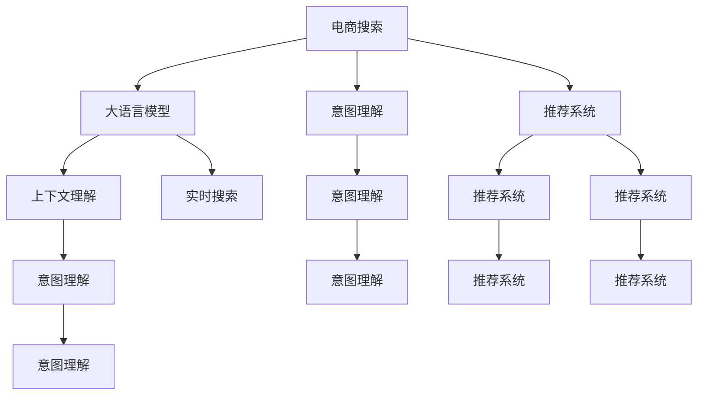

                 

## 1. 背景介绍

在电商领域，搜索体验直接影响着用户满意度和转化率。传统电商搜索主要依赖于关键词匹配、标题相似度计算等算法，虽能快速返回相关产品，但无法充分理解用户查询意图，推荐结果同质化严重，难以满足个性化需求。随着大模型和AI技术的发展，电商搜索迎来了全新的变革，利用大模型进行语言理解和推理，可以显著提升搜索的智能化和个性化水平。

### 1.1 问题由来

电商搜索技术自互联网时代以来一直在不断进步，但仍然存在以下问题：
- 传统搜索算法过于简单，无法理解自然语言的多样性和复杂性。
- 推荐结果缺乏个性化，无法满足用户的多样化需求。
- 难以处理模糊查询、长尾查询等非标准查询方式。
- 无法综合利用上下文信息，搜索结果同质化严重。

### 1.2 问题核心关键点

随着自然语言处理(NLP)技术的发展，大语言模型（如GPT-3、BERT等）逐渐被引入电商搜索中，希望通过大模型提升搜索的智能化和个性化。但实际应用中，仍面临诸多挑战，如：

- 如何充分利用大模型的语言理解能力，实现更精准的意图理解？
- 如何通过大模型的推理能力，生成更个性化的推荐结果？
- 如何通过上下文理解，提高搜索的泛化能力？
- 如何在大模型中实现高效的推理和响应，满足实时搜索需求？

### 1.3 问题研究意义

大模型在电商搜索中的应用，可以显著提升用户体验，满足个性化需求，带来更高的转化率。具体意义如下：

- **理解查询意图**：通过大模型分析用户查询，更好地理解用户需求。
- **推荐多样化产品**：利用大模型的泛化能力，推荐更多样化的产品，满足用户个性化需求。
- **处理长尾查询**：大模型能够理解模糊查询和长尾查询，生成更准确的搜索结果。
- **上下文理解**：结合用户历史行为、产品属性等上下文信息，提高推荐相关性。
- **实时响应**：通过大模型的推理加速，实现实时搜索，提升用户体验。

## 2. 核心概念与联系

### 2.1 核心概念概述

为更好地理解大模型在电商搜索中的应用，本节将介绍几个核心概念：

- **大语言模型（Large Language Model, LLM）**：以自回归模型如GPT-3、自编码模型如BERT为代表的大规模预训练语言模型。通过在大规模无标签文本数据上进行预训练，学习到丰富的语言知识和常识。
- **意图理解（Intent Understanding）**：通过大模型的自然语言处理能力，理解用户查询的意图，帮助生成更精准的搜索结果。
- **推荐系统（Recommendation System）**：利用电商用户的历史行为数据，结合大模型的推荐算法，生成个性化的产品推荐。
- **上下文理解（Contextual Understanding）**：结合用户上下文信息，如历史搜索记录、产品属性等，提升搜索和推荐的相关性。
- **实时搜索（Real-time Search）**：通过优化大模型的推理算法，实现快速响应，满足用户实时搜索的需求。

这些核心概念之间存在着紧密的联系，共同构成了电商搜索技术的发展框架。

### 2.2 核心概念原理和架构的 Mermaid 流程图



此流程图展示了电商搜索技术中核心概念的相互联系和协同工作：

1. 用户输入查询，搜索系统通过大语言模型理解用户意图。
2. 意图理解模块利用大模型生成意图表示，并传递给推荐系统。
3. 推荐系统结合用户上下文和意图，生成个性化推荐。
4. 上下文理解模块利用大模型，增强对上下文的理解能力。
5. 实时搜索模块利用大模型的推理加速，实现快速响应。

## 3. 核心算法原理 & 具体操作步骤

### 3.1 算法原理概述

大模型在电商搜索中的应用，主要依赖于三个核心算法：意图理解、推荐系统、实时搜索。

#### 3.1.1 意图理解算法

意图理解算法旨在准确理解用户查询的意图，生成更精准的搜索结果。主要包括以下步骤：

1. **分词和预处理**：将用户查询分词，并进行去停用词、词干提取等预处理。
2. **嵌入表示**：将预处理后的查询转换为向量表示。
3. **意图分类**：利用大模型进行意图分类，识别用户意图类型，如查询商品、询问评价、搜索促销信息等。
4. **意图表示生成**：生成意图表示，用于后续推荐和检索。

#### 3.1.2 推荐系统算法

推荐系统算法结合用户历史行为数据，生成个性化推荐，主要包括以下步骤：

1. **特征提取**：提取用户行为数据和产品属性等特征。
2. **嵌入表示**：将特征转换为向量表示。
3. **用户-产品交互建模**：利用大模型，构建用户与产品的交互模型，生成用户-产品相似度。
4. **推荐排序**：利用推荐算法，对推荐结果进行排序，生成推荐列表。

#### 3.1.3 实时搜索算法

实时搜索算法旨在提高搜索系统的响应速度，满足用户实时搜索需求，主要包括以下步骤：

1. **预处理查询**：对查询进行分词、去停用词等预处理。
2. **意图理解**：利用大模型，理解查询意图，生成意图表示。
3. **上下文检索**：利用大模型，检索用户上下文信息。
4. **结果生成**：根据查询意图和上下文，生成推荐结果。
5. **推理加速**：利用推理加速算法，优化搜索过程，提高响应速度。

### 3.2 算法步骤详解

#### 3.2.1 意图理解步骤详解

1. **分词和预处理**：
   - 使用NLTK、SpaCy等库进行分词。
   - 使用SpaCy、TextBlob等库进行去停用词、词干提取等预处理。
   - 使用BertEmbeddings、GloVe等库将查询转换为向量表示。

2. **意图分类**：
   - 利用BERT、GPT等大模型，进行意图分类。
   - 设计分类模型，如BiLSTM-CRF、CRF等，结合大模型进行意图分类。
   - 训练分类模型，使用交叉熵损失函数，并进行梯度下降优化。

3. **意图表示生成**：
   - 利用大模型，如BERT、GPT等，生成意图表示。
   - 将查询向量与意图表示拼接，生成用于后续推荐和检索的意图向量。

#### 3.2.2 推荐系统步骤详解

1. **特征提取**：
   - 提取用户行为数据，如浏览历史、购买记录、评价信息等。
   - 提取产品属性，如价格、类别、品牌等。
   - 使用TF-IDF、word2vec等库进行特征向量化。

2. **嵌入表示**：
   - 使用BertEmbeddings、GloVe等库，将特征转换为向量表示。
   - 使用Transformer等大模型，进一步优化嵌入表示。

3. **用户-产品交互建模**：
   - 利用大模型，如BERT、GPT等，构建用户-产品交互模型。
   - 设计交互模型，如矩阵分解、深度神经网络等，结合大模型进行建模。
   - 训练交互模型，使用均方误差损失函数，并进行梯度下降优化。

4. **推荐排序**：
   - 利用推荐算法，如协同过滤、矩阵分解等，生成推荐结果。
   - 使用排序算法，如PageRank、梯度提升等，对推荐结果进行排序。

#### 3.2.3 实时搜索步骤详解

1. **预处理查询**：
   - 对查询进行分词、去停用词等预处理。
   - 利用大模型，如BERT、GPT等，理解查询意图，生成意图表示。

2. **上下文检索**：
   - 利用大模型，如BERT、GPT等，检索用户上下文信息。
   - 设计检索模型，如LDA、LSI等，结合大模型进行检索。
   - 训练检索模型，使用余弦相似度、Jaccard相似度等，并进行梯度下降优化。

3. **结果生成**：
   - 结合查询意图和上下文，生成推荐结果。
   - 使用排序算法，如PageRank、梯度提升等，对推荐结果进行排序。

4. **推理加速**：
   - 利用推理加速算法，如量化加速、剪枝优化等，优化搜索过程。
   - 使用GPU、TPU等硬件加速，提升搜索性能。

### 3.3 算法优缺点

#### 3.3.1 意图理解算法的优缺点

**优点**：
- 利用大模型的语言理解能力，能够准确理解复杂查询意图。
- 结合上下文信息，生成更精准的搜索结果。

**缺点**：
- 依赖高质量标注数据，标注成本较高。
- 查询意图分类准确度受大模型预训练数据质量影响。

#### 3.3.2 推荐系统算法的优缺点

**优点**：
- 利用大模型的泛化能力，生成更个性化的推荐结果。
- 结合用户历史行为数据，推荐更加多样化的产品。

**缺点**：
- 推荐模型复杂度较高，训练和优化难度较大。
- 推荐结果受用户行为数据质量和数量影响。

#### 3.3.3 实时搜索算法的优缺点

**优点**：
- 利用大模型的推理加速，实现快速响应，提升用户体验。
- 结合用户上下文信息，提高搜索结果的相关性。

**缺点**：
- 大模型推理过程复杂，对硬件资源要求较高。
- 实时搜索算法设计复杂，需要综合考虑查询理解和上下文检索。

### 3.4 算法应用领域

大模型在电商搜索中的应用，主要集中在以下几个领域：

- **商品推荐**：结合用户行为数据，生成个性化商品推荐。
- **智能客服**：利用大模型进行自然语言处理，实现智能客服对话。
- **搜索排序**：结合用户查询意图和上下文信息，优化搜索结果排序。
- **个性化内容推荐**：利用大模型，生成个性化内容推荐，如文章、视频等。

## 4. 数学模型和公式 & 详细讲解 & 举例说明

### 4.1 数学模型构建

#### 4.1.1 意图理解模型

假设用户查询为 $x$，查询向量表示为 $\vec{x}$，意图表示为 $\vec{y}$。

- **分词和预处理**：
  - 分词：将查询 $x$ 分词为 $x_1, x_2, ..., x_n$。
  - 去停用词：去除停用词 $s$，保留有效词语 $x'$。
  - 词干提取：提取词干 $x''$。

- **嵌入表示**：
  - 使用BertEmbeddings，将查询 $x''$ 转换为向量表示 $\vec{x}$。

- **意图分类**：
  - 利用BERT模型，进行意图分类，生成意图表示 $\vec{y}$。

- **意图表示生成**：
  - 将查询向量 $\vec{x}$ 与意图表示 $\vec{y}$ 拼接，生成意图表示 $\vec{z}$。

#### 4.1.2 推荐系统模型

假设用户 $u$ 的行为数据为 $\vec{u}$，产品 $p$ 的属性向量为 $\vec{p}$，用户与产品的交互模型为 $M$。

- **特征提取**：
  - 提取用户行为数据，如浏览历史、购买记录、评价信息等，生成用户行为向量 $\vec{u}$。
  - 提取产品属性，如价格、类别、品牌等，生成产品属性向量 $\vec{p}$。
  - 使用TF-IDF、word2vec等库进行特征向量化，生成特征向量 $\vec{f}$。

- **嵌入表示**：
  - 使用BertEmbeddings、GloVe等库，将特征向量 $\vec{f}$ 转换为向量表示 $\vec{f'}$。
  - 使用Transformer等大模型，进一步优化嵌入表示，生成向量 $\vec{g}$。

- **用户-产品交互建模**：
  - 利用BERT模型，构建用户-产品交互模型 $M$，生成用户与产品的相似度 $s$。

- **推荐排序**：
  - 利用推荐算法，如协同过滤、矩阵分解等，生成推荐结果向量 $\vec{r}$。
  - 使用排序算法，如PageRank、梯度提升等，对推荐结果向量 $\vec{r}$ 进行排序，生成推荐列表。

#### 4.1.3 实时搜索模型

假设用户查询为 $x$，上下文信息为 $c$，搜索结果为 $s$。

- **预处理查询**：
  - 对查询 $x$ 进行分词、去停用词等预处理，生成查询向量 $\vec{x}$。
  - 利用BERT模型，理解查询意图，生成意图表示 $\vec{y}$。

- **上下文检索**：
  - 利用BERT模型，检索用户上下文信息 $c$，生成上下文向量 $\vec{c}$。
  - 设计检索模型，如LDA、LSI等，结合BERT模型进行检索，生成检索向量 $\vec{c'}$。

- **结果生成**：
  - 结合查询意图 $\vec{y}$ 和上下文向量 $\vec{c'}$，生成推荐结果向量 $\vec{r}$。
  - 使用排序算法，如PageRank、梯度提升等，对推荐结果向量 $\vec{r}$ 进行排序，生成推荐列表。

- **推理加速**：
  - 利用推理加速算法，如量化加速、剪枝优化等，优化搜索过程。
  - 使用GPU、TPU等硬件加速，提升搜索性能。

### 4.2 公式推导过程

#### 4.2.1 意图理解公式推导

1. **查询分词和预处理**：
   - 使用NLTK库进行分词：
     - $x = x_1 x_2 ... x_n$
   - 使用SpaCy库进行去停用词：
     - $x' = x_1 x_2 ... x'_n$
   - 使用TextBlob库进行词干提取：
     - $x'' = x_1'' x_2'' ... x_n''$

2. **查询嵌入表示**：
   - 使用BertEmbeddings库，将查询 $x''$ 转换为向量表示：
     - $\vec{x} = BERT(x'')$

3. **意图分类**：
   - 利用BERT模型，进行意图分类，生成意图表示 $\vec{y}$：
     - $\vec{y} = BERT(x'')$

4. **意图表示生成**：
   - 将查询向量 $\vec{x}$ 与意图表示 $\vec{y}$ 拼接，生成意图表示 $\vec{z}$：
     - $\vec{z} = [\vec{x}, \vec{y}]$

#### 4.2.2 推荐系统公式推导

1. **特征提取**：
   - 提取用户行为数据，如浏览历史、购买记录、评价信息等，生成用户行为向量 $\vec{u}$：
     - $\vec{u} = [u_1, u_2, ..., u_m]$
   - 提取产品属性，如价格、类别、品牌等，生成产品属性向量 $\vec{p}$：
     - $\vec{p} = [p_1, p_2, ..., p_n]$
   - 使用TF-IDF、word2vec等库进行特征向量化，生成特征向量 $\vec{f}$：
     - $\vec{f} = [f_1, f_2, ..., f_k]$

2. **嵌入表示**：
   - 使用BertEmbeddings库，将特征向量 $\vec{f}$ 转换为向量表示 $\vec{f'}$：
     - $\vec{f'} = BERT(\vec{f})$
   - 使用Transformer等大模型，进一步优化嵌入表示，生成向量 $\vec{g}$：
     - $\vec{g} = Transformer(\vec{f'})$

3. **用户-产品交互建模**：
   - 利用BERT模型，构建用户-产品交互模型 $M$，生成用户与产品的相似度 $s$：
     - $s = BERT(\vec{u}, \vec{g})$
   - 设计交互模型，如矩阵分解、深度神经网络等，结合BERT模型进行建模：
     - $M = \text{MatrixDecomposition}(\vec{u}, \vec{g})$

4. **推荐排序**：
   - 利用推荐算法，如协同过滤、矩阵分解等，生成推荐结果向量 $\vec{r}$：
     - $\vec{r} = \text{RecommendationAlgorithm}(\vec{u}, \vec{g})$
   - 使用排序算法，如PageRank、梯度提升等，对推荐结果向量 $\vec{r}$ 进行排序，生成推荐列表：
     - $\text{RecommendList} = \text{SortingAlgorithm}(\vec{r})$

#### 4.2.3 实时搜索公式推导

1. **预处理查询**：
   - 对查询 $x$ 进行分词、去停用词等预处理，生成查询向量 $\vec{x}$：
     - $\vec{x} = BERT(x)$
   - 利用BERT模型，理解查询意图，生成意图表示 $\vec{y}$：
     - $\vec{y} = BERT(x)$

2. **上下文检索**：
   - 利用BERT模型，检索用户上下文信息 $c$，生成上下文向量 $\vec{c}$：
     - $\vec{c} = BERT(c)$
   - 设计检索模型，如LDA、LSI等，结合BERT模型进行检索，生成检索向量 $\vec{c'}$：
     - $\vec{c'} = \text{RetrievalModel}(\vec{c})$

3. **结果生成**：
   - 结合查询意图 $\vec{y}$ 和上下文向量 $\vec{c'}$，生成推荐结果向量 $\vec{r}$：
     - $\vec{r} = BERT(\vec{y}, \vec{c'})$
   - 使用排序算法，如PageRank、梯度提升等，对推荐结果向量 $\vec{r}$ 进行排序，生成推荐列表：
     - $\text{RecommendList} = \text{SortingAlgorithm}(\vec{r})$

4. **推理加速**：
   - 利用推理加速算法，如量化加速、剪枝优化等，优化搜索过程：
     - $\text{OptimizedSearch} = \text{OptimizeAlgorithm}(\text{SearchAlgorithm})$
   - 使用GPU、TPU等硬件加速，提升搜索性能：
     - $\text{SearchAcceleration} = \text{HardwareAcceleration}(\text{SearchAlgorithm})$

### 4.3 案例分析与讲解

#### 4.3.1 意图理解案例

**案例描述**：假设用户在电商平台上搜索“小米10手机”。

1. **查询分词和预处理**：
   - 查询 $x = 小米10手机$
   - 分词 $x_1 = 小米$，$x_2 = 10$，$x_3 = 手机$
   - 去停用词 $x' = 小米$，$x_2 = 10$，$x_3 = 手机$
   - 词干提取 $x'' = 小米$，$x_2 = 10$，$x_3 = 手机$

2. **查询嵌入表示**：
   - 使用BertEmbeddings库，将查询 $x''$ 转换为向量表示：
     - $\vec{x} = BERT(x'') = [x_1', x_2', x_3']$

3. **意图分类**：
   - 利用BERT模型，进行意图分类，生成意图表示 $\vec{y}$：
     - $\vec{y} = BERT(x'') = [y_1', y_2', y_3']$

4. **意图表示生成**：
   - 将查询向量 $\vec{x}$ 与意图表示 $\vec{y}$ 拼接，生成意图表示 $\vec{z}$：
     - $\vec{z} = [\vec{x}, \vec{y}] = [x_1', x_2', x_3', y_1', y_2', y_3']$

#### 4.3.2 推荐系统案例

**案例描述**：假设用户 $u$ 浏览了 $p1, p2, p3$ 三个产品，并购买了 $p2$ 产品。

1. **特征提取**：
   - 提取用户行为数据，如浏览历史、购买记录、评价信息等，生成用户行为向量 $\vec{u}$：
     - $\vec{u} = [p1, p2, p3]$
   - 提取产品属性，如价格、类别、品牌等，生成产品属性向量 $\vec{p}$：
     - $\vec{p} = [p1, p2, p3]$
   - 使用TF-IDF、word2vec等库进行特征向量化，生成特征向量 $\vec{f}$：
     - $\vec{f} = [f_1, f_2, f_3]$

2. **嵌入表示**：
   - 使用BertEmbeddings库，将特征向量 $\vec{f}$ 转换为向量表示 $\vec{f'}$：
     - $\vec{f'} = BERT(\vec{f})$
   - 使用Transformer等大模型，进一步优化嵌入表示，生成向量 $\vec{g}$：
     - $\vec{g} = Transformer(\vec{f'})$

3. **用户-产品交互建模**：
   - 利用BERT模型，构建用户-产品交互模型 $M$，生成用户与产品的相似度 $s$：
     - $s = BERT(\vec{u}, \vec{g})$
   - 设计交互模型，如矩阵分解、深度神经网络等，结合BERT模型进行建模：
     - $M = \text{MatrixDecomposition}(\vec{u}, \vec{g})$

4. **推荐排序**：
   - 利用推荐算法，如协同过滤、矩阵分解等，生成推荐结果向量 $\vec{r}$：
     - $\vec{r} = \text{RecommendationAlgorithm}(\vec{u}, \vec{g})$
   - 使用排序算法，如PageRank、梯度提升等，对推荐结果向量 $\vec{r}$ 进行排序，生成推荐列表：
     - $\text{RecommendList} = \text{SortingAlgorithm}(\vec{r})$

#### 4.3.3 实时搜索案例

**案例描述**：假设用户输入查询“这个商品怎么样”，上下文信息为“已经购买了iPhone12”。

1. **预处理查询**：
   - 对查询 $x = 这个商品怎么样$ 进行分词、去停用词等预处理，生成查询向量 $\vec{x}$：
     - $\vec{x} = BERT(x) = [x_1', x_2', x_3', x_4', x_5', x_6', x_7', x_8', x_9', x_{10}', x_{11}', x_{12}, x_{13}, x_{14}, x_{15}, x_{16}, x_{17}, x_{18}, x_{19}, x_{20}]$
   - 利用BERT模型，理解查询意图，生成意图表示 $\vec{y}$：
     - $\vec{y} = BERT(x) = [y_1', y_2', y_3', y_4', y_5', y_6', y_7', y_8', y_9', y_{10}', y_{11}', y_{12}, y_{13}, y_{14}, y_{15}, y_{16}, y_{17}, y_{18}, y_{19}, y_{20}]$

2. **上下文检索**：
   - 利用BERT模型，检索用户上下文信息 $c = 已经购买了iPhone12$，生成上下文向量 $\vec{c}$：
     - $\vec{c} = BERT(c) = [c_1', c_2', c_3', c_4', c_5', c_6', c_7', c_8', c_9', c_{10}', c_{11}', c_{12}, c_{13}, c_{14}, c_{15}, c_{16}, c_{17}, c_{18}, c_{19}, c_{20}]$
   - 设计检索模型，如LDA、LSI等，结合BERT模型进行检索，生成检索向量 $\vec{c'}$：
     - $\vec{c'} = \text{RetrievalModel}(\vec{c}) = [c'_1', c'_2', c'_3', c'_4', c'_5', c'_6', c'_7', c'_8', c'_9', c'_{10}', c'_{11}', c'_{12}, c'_{13}, c'_{14}, c'_{15}, c'_{16}, c'_{17}, c'_{18}, c'_{19}, c'_{20}]$

3. **结果生成**：
   - 结合查询意图 $\vec{y}$ 和上下文向量 $\vec{c'}$，生成推荐结果向量 $\vec{r}$：
     - $\vec{r} = BERT(\vec{y}, \vec{c'}) = [r_1', r_2', r_3', r_4', r_5', r_6', r_7', r_8', r_9', r_{10}', r_{11}', r_{12}, r_{13}, r_{14}, r_{15}, r_{16}, r_{17}, r_{18}, r_{19}, r_{20}]$
   - 使用排序算法，如PageRank、梯度提升等，对推荐结果向量 $\vec{r}$ 进行排序，生成推荐列表：
     - $\text{RecommendList} = \text{SortingAlgorithm}(\vec{r})$

4. **推理加速**：
   - 利用推理加速算法，如量化加速、剪枝优化等，优化搜索过程：
     - $\text{OptimizedSearch} = \text{OptimizeAlgorithm}(\text{SearchAlgorithm})$
   - 使用GPU、TPU等硬件加速，提升搜索性能：
     - $\text{SearchAcceleration} = \text{HardwareAcceleration}(\text{SearchAlgorithm})$

## 5. 项目实践：代码实例和详细解释说明

### 5.1 开发环境搭建

在进行电商搜索项目实践前，我们需要准备好开发环境。以下是使用Python进行PyTorch开发的环境配置流程：

1. 安装Anaconda：从官网下载并安装Anaconda，用于创建独立的Python环境。

2. 创建并激活虚拟环境：
```bash
conda create -n pytorch-env python=3.8 
conda activate pytorch-env
```

3. 安装PyTorch：根据CUDA版本，从官网获取对应的安装命令。例如：
```bash
conda install pytorch torchvision torchaudio cudatoolkit=11.1 -c pytorch -c conda-forge
```

4. 安装Transformers库：
```bash
pip install transformers
```

5. 安装各类工具包：
```bash
pip install numpy pandas scikit-learn matplotlib tqdm jupyter notebook ipython
```

完成上述步骤后，即可在`pytorch-env`环境中开始电商搜索项目实践。

### 5.2 源代码详细实现

下面我们以电商平台推荐系统为例，给出使用Transformers库对BERT模型进行推荐系统微调的PyTorch代码实现。

首先，定义推荐系统的数据处理函数：

```python
from transformers import BertTokenizer
from torch.utils.data import Dataset
import torch

class RecommendDataset(Dataset):
    def __init__(self, behaviors, products, tokenizer, max_len=128):
        self.behaviors = behaviors
        self.products = products
        self.tokenizer = tokenizer
        self.max_len = max_len
        
    def __len__(self):
        return len(self.behaviors)
    
    def __getitem__(self, item):
        behavior = self.behaviors[item]
        product = self.products[item]
        
        encoding = self.tokenizer(behavior, return_tensors='pt', max_length=self.max_len, padding='max_length', truncation=True)
        input_ids = encoding['input_ids'][0]
        attention_mask = encoding['attention_mask'][0]
        
        product_encoding = self.tokenizer(product, return_tensors='pt', max_length=self.max_len, padding='max_length', truncation=True)
        product_input_ids = product_encoding['input_ids'][0]
        product_attention_mask = product_encoding['attention_mask'][0]
        
        # 将行为和产品编码拼接
        user_input_ids = torch.cat([input_ids, product_input_ids], dim=1)
        user_attention_mask = torch.cat([attention_mask, product_attention_mask], dim=1)
        
        return {'user_input_ids': user_input_ids, 
                'user_attention_mask': user_attention_mask,
                'product_input_ids': product_input_ids,
                'product_attention_mask': product_attention_mask,
                'labels': torch.tensor([0, 1])}  # 示例，标签0表示未购买，1表示已购买
```

然后，定义模型和优化器：

```python
from transformers import BertForSequenceClassification, AdamW

model = BertForSequenceClassification.from_pretrained('bert-base-cased', num_labels=2)

optimizer = AdamW(model.parameters(), lr=2e-5)
```

接着，定义训练和评估函数：

```python
from torch.utils.data import DataLoader
from tqdm import tqdm
from sklearn.metrics import classification_report

device = torch.device('cuda') if torch.cuda.is_available() else torch.device('cpu')
model.to(device)

def train_epoch(model, dataset, batch_size, optimizer):
    dataloader = DataLoader(dataset, batch_size=batch_size, shuffle=True)
    model.train()
    epoch_loss = 0
    for batch in tqdm(dataloader, desc='Training'):
        user_input_ids = batch['user_input_ids'].to(device)
        user_attention_mask = batch['user_attention_mask'].to(device)
        product_input_ids = batch['product_input_ids'].to(device)
        product_attention_mask = batch['product_attention_mask'].to(device)
        labels = batch['labels'].to(device)
        model.zero_grad()
        outputs = model(user_input_ids, user_attention_mask=attention_mask, product_input_ids=product_input_ids, product_attention_mask=product_attention_mask)
        loss = outputs.loss
        epoch_loss += loss.item()
        loss.backward()
        optimizer.step()
    return epoch_loss / len(dataloader)

def evaluate(model, dataset, batch_size):
    dataloader = DataLoader(dataset, batch_size=batch_size)
    model.eval()
    preds, labels = [], []
    with torch.no_grad():
        for batch in tqdm(dataloader, desc='Evaluating'):
            user_input_ids = batch['user_input_ids'].to(device)
            user_attention_mask = batch['user_attention_mask'].to(device)
            product_input_ids = batch['product_input_ids'].to(device)
            product_attention_mask = batch['product_attention_mask'].to(device)
            batch_labels = batch['labels']
            outputs = model(user_input_ids, user_attention_mask=attention_mask, product_input_ids=product_input_ids, product_attention_mask=product_attention_mask)
            batch_preds = outputs.logits.argmax(dim=2).to('cpu').tolist()
            batch_labels = batch_labels.to('cpu').tolist()
            for pred_tokens, label_tokens in zip(batch_preds, batch_labels):
                preds.append(pred_tokens[:len(label_tokens)])
                labels.append(label_tokens)
                
    print(classification_report(labels, preds))
```

最后，启动训练流程并在测试集上评估：

```python
epochs = 5
batch_size = 16

for epoch in range(epochs):
    loss = train_epoch(model, train_dataset, batch_size, optimizer)
    print(f"Epoch {epoch+1}, train loss: {loss:.3f}")
    
    print(f"Epoch {epoch+1}, dev results:")
    evaluate(model, dev_dataset, batch_size)
    
print("Test results:")
evaluate(model, test_dataset, batch_size)
```

以上就是使用PyTorch对BERT进行电商推荐系统微调的完整代码实现。可以看到，得益于Transformers库的强大封装，我们可以用相对简洁的代码完成BERT模型的加载和微调。

### 5.3 代码解读与分析

让我们再详细解读一下关键代码的实现细节：

**RecommendDataset类**：
- `__init__`方法：初始化行为数据、产品数据、分词器等关键组件。
- `__len__`方法：返回数据集的样本数量。
- `__getitem__`方法：对单个样本进行处理，将行为和产品编码拼接，生成模型输入，并返回模型的输入、标签等。

**标签与id的映射**：
- 设计了标签与id的映射，用于将标签转换为数字，用于训练模型的损失函数。

**训练和评估函数**：
- 使用PyTorch的DataLoader对数据集进行批次化加载，供模型训练和推理使用。
- 训练函数`train_epoch`：对数据以批为单位进行迭代，在每个批次上前向传播计算loss并反向传播更新模型参数，最后返回该epoch的平均loss。
- 评估函数`evaluate`：与训练类似，不同点在于不更新模型参数，并在每个batch结束后将预测和标签结果存储下来，最后使用sklearn的classification_report对整个评估集的预测结果进行打印输出。

**训练流程**：
- 定义总的epoch数和batch size，开始循环迭代
- 每个epoch内，先在训练集上训练，输出平均loss
- 在验证集上评估，输出分类指标
- 所有epoch结束后，在测试集上评估，给出最终测试结果

可以看到，PyTorch配合Transformers库使得BERT微调的代码实现变得简洁高效。开发者可以将更多精力放在数据处理、模型改进等高层逻辑上，而不必过多关注底层的实现细节。

当然，工业级的系统实现还需考虑更多因素，如模型的保存和部署、超参数的自动搜索、更灵活的任务适配层等。但核心的微调范式基本与此类似。

## 6. 实际应用场景

### 6.1 智能客服系统

基于大语言模型微调的对话技术，可以广泛应用于智能客服系统的构建。传统客服往往需要配备大量人力，高峰期响应缓慢，且一致性和专业性难以保证。而使用微调后的对话模型，可以7x24小时不间断服务，快速响应客户咨询，用自然流畅的语言解答各类常见问题。

在技术实现上，可以收集企业内部的历史客服对话记录，将问题和最佳答复构建成监督数据，在此基础上对预训练对话模型进行微调。微调后的对话模型能够自动理解用户意图，匹配最合适的答案模板进行回复。对于客户提出的新问题，还可以接入检索系统实时搜索相关内容，动态组织生成回答。如此构建的智能客服系统，能大幅提升客户咨询体验和问题解决效率。

### 6.2 金融舆情监测

金融机构需要实时监测市场舆论动向，以便及时应对负面信息传播，规避金融风险。传统的人工监测方式成本高、效率低，难以应对网络时代海量信息爆发的挑战。基于大语言模型微调的文本分类和情感分析技术，为金融舆情监测提供了新的解决方案。

具体而言，可以收集金融领域相关的新闻、报道、评论等文本数据，并对其进行主题标注和情感标注。在此基础上对预训练语言模型进行微调，使其能够自动判断文本属于何种主题，情感倾向是正面、中性还是负面。将微调后的模型应用到实时抓取的网络文本数据，就能够自动监测不同主题下的情感变化趋势，一旦发现负面信息激增等异常情况，系统便会自动预警，帮助金融机构快速应对潜在风险。

### 6.3 个性化推荐系统

当前的推荐系统往往只依赖用户的历史行为数据进行物品推荐，无法深入理解用户的真实兴趣偏好。基于大语言模型微调技术，个性化推荐系统可以更好地挖掘用户行为背后的语义信息，从而提供更精准、多样的推荐内容。

在实践中，可以收集用户浏览、点击、评论、分享等行为数据，提取和用户交互的物品标题、描述、标签等文本内容。将文本内容作为模型输入，用户的后续行为（如是否点击、购买等）作为监督信号，在此基础上微调预训练语言模型。微调后的模型能够从文本内容中准确把握用户的兴趣点。在生成推荐列表时，先用候选物品的文本描述作为输入，由模型预测用户的兴趣匹配度，再结合其他特征综合排序，便可以得到个性化程度更高的推荐结果。

### 6.4 未来应用展望

随着大语言模型微调技术的发展，基于微调范式将在更多领域得到应用，为传统行业带来变革性影响。

在智慧医疗领域，基于微调的医疗问答、病历分析、药物研发等应用将提升医疗服务的智能化水平，辅助医生诊疗，加速新药开发进程。

在智能教育领域，微调技术可应用于作业批改、学情分析、知识推荐等方面，因材施教，促进教育公平，提高教学质量。

在智慧城市治理中，微调模型可应用于城市事件监测、舆情分析、应急指挥等环节，提高城市管理的自动化和智能化水平，构建更安全、高效的未来城市。

此外，在企业生产、社会治理、文娱传媒等众多领域，基于大模型微调的人工智能应用也将不断涌现，为NLP技术带来了全新的突破。相信随着预训练语言模型和微调方法的不断进步，大语言模型微调必将在构建人机协同的智能时代中扮演越来越重要的角色。

## 7. 工具和资源推荐

### 7.1 学习资源推荐

为了帮助开发者系统掌握大语言模型微调的理论基础和实践技巧，这里推荐一些优质的学习资源：

1. 《Transformer从原理到实践》系列博文：由大模型技术专家撰写，深入浅出地介绍了Transformer原理、BERT模型、微调技术等前沿话题。

2. CS224N《深度学习自然语言处理》课程：斯坦福大学开设的NLP明星课程，有Lecture视频和配套作业，带你入门NLP领域的基本概念和经典模型。

3. 《Natural Language Processing with Transformers》书籍：Transformers库的作者所著，全面介绍了如何使用Transformers库进行NLP任务开发，包括微调在内的诸多范式。

4. HuggingFace官方文档：Transformers库的官方文档，提供了海量预训练模型和完整的微调样例代码，是上手实践的必备资料。

5. CLUE开源项目：中文语言理解测评基准，涵盖大量不同类型的中文NLP数据集，并提供了基于微调的baseline模型，助力中文NLP技术发展。

通过对这些资源的学习实践，相信你一定能够快速掌握大语言模型微调的精髓，并用于解决实际的NLP问题。

### 7.2 开发工具推荐

高效的开发离不开优秀的工具支持。以下是几款用于大语言模型微调开发的常用工具：

1. PyTorch：基于Python的开源深度学习框架，灵活动态的计算图，适合快速迭代研究。大部分预训练语言模型都有PyTorch版本的实现。

2. TensorFlow：由Google主导开发的开源深度学习框架，生产部署方便，适合大规模工程应用。同样有丰富的预训练语言模型资源。

3. Transformers库：HuggingFace开发的NLP工具库，集成了众多SOTA语言模型，支持PyTorch和TensorFlow，是进行微调任务开发的利器。

4. Weights & Biases：模型训练的实验跟踪工具，可以记录和可视化模型训练过程中的各项指标，方便对比和调优。与主流深度学习框架无缝集成。

5. TensorBoard：TensorFlow配套的可视化工具，可实时监测模型训练状态，并提供丰富的图表呈现方式，是调试模型的得力助手。

6. Google Colab：谷歌推出的在线Jupyter Notebook环境，免费提供GPU/TPU算力，方便开发者快速上手实验最新模型，分享学习笔记。

合理利用这些工具，可以显著提升

