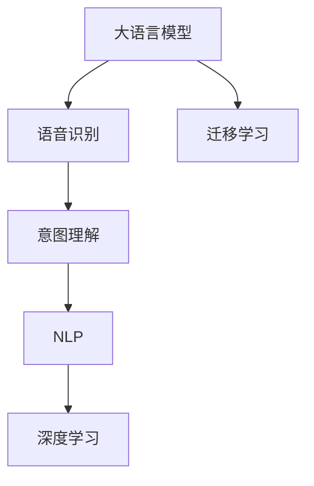

                 

## 1. 背景介绍

### 1.1 问题由来

随着移动互联网和智能设备的普及，消费者对购物体验的要求越来越高。电商平台逐渐意识到，用户希望通过更自然、更便捷的方式进行搜索和查询。语音搜索作为新兴的交互方式，能够快速响应用户需求，成为提高用户满意度的关键。

然而，电商平台的语音搜索系统往往面临着数据量和计算资源的限制，难以实现实时、准确的语音识别和理解。这就需要借助强大的AI大模型来解决数据稀缺、模型泛化能力不足等问题，提升电商平台的语音搜索体验。

### 1.2 问题核心关键点

电商平台的语音搜索系统需要解决以下核心问题：

1. 提高语音识别准确率。用户输入的语音命令往往存在发音错误、语速快慢不一等情况，需要模型具备较强的鲁棒性，能够准确识别不同口音、噪声干扰等复杂场景下的语音内容。
2. 提升查询意图理解能力。用户希望通过语音直接表达搜索意图，模型需要能够从语音内容中理解用户的具体需求，进行精准匹配。
3. 提供快速响应和高可用性。语音搜索需要实时处理用户的输入，并快速返回搜索结果，因此系统的响应速度和稳定性至关重要。
4. 保证搜索结果的相关性和多样性。用户需要获取最相关的产品信息，模型需要能够对搜索结果进行排序和筛选，提升用户满意度。

### 1.3 问题研究意义

AI大模型在电商平台的语音搜索系统中扮演着关键角色，其快速发展和应用对电商平台的用户体验提升具有重要意义：

1. 提升用户粘性。通过语音搜索，用户能够以更自然、更高效的方式与电商平台互动，提高购物体验，增强用户粘性。
2. 降低运营成本。语音搜索减少了用户输入文本的复杂性，简化了操作流程，降低了人工客服的负担，提高运营效率。
3. 拓展业务边界。语音搜索拓展了电商平台的服务范围，拓展了商品的查询方式，带来了新的商业模式和收入增长点。
4. 推动技术创新。语音搜索技术的提升，带来了语音识别、自然语言处理等领域的持续创新，推动了AI技术的整体发展。

## 2. 核心概念与联系

### 2.1 核心概念概述

电商平台的语音搜索系统主要包含以下几个核心概念：

1. **大语言模型(Large Language Model, LLM)**：以自回归(如GPT)或自编码(如BERT)模型为代表的预训练语言模型，通过在大规模无标签文本语料上进行预训练，学习通用的语言表示。
2. **语音识别(ASR, Automatic Speech Recognition)**：将语音信号转换成文本的自动处理过程。
3. **意图理解( Intent Recognition)**：从用户输入的语音内容中，理解用户的具体查询意图。
4. **自然语言处理(Natural Language Processing, NLP)**：处理和理解自然语言的语义和结构的技术，包括词法分析、句法分析、语义分析等。
5. **深度学习(Depth Learning)**：使用多层神经网络进行模型训练和预测的技术。
6. **迁移学习(Transfer Learning)**：将预训练模型在特定领域数据上进行微调，使其适应具体任务。

这些概念之间的逻辑关系可以通过以下Mermaid流程图来展示：



这个流程图展示了大语言模型在电商平台语音搜索系统中的核心作用：

1. 大语言模型通过预训练获得基础能力。
2. 语音识别将语音信号转换成文本，便于模型理解和处理。
3. 意图理解将文本内容转化为查询意图，指导NLP任务。
4. NLP任务对查询意图进行语义分析，获取相关信息。
5. 深度学习模型将信息处理成结构化的输出，方便最终结果的展示。
6. 迁移学习使模型适应电商平台特定需求，提高搜索性能。

## 3. 核心算法原理 & 具体操作步骤

### 3.1 算法原理概述

电商平台的语音搜索系统主要采用基于深度学习的模型进行实现。该系统由语音识别、意图理解和NLP任务三个核心模块组成，各模块之间协同工作，实现从语音输入到搜索结果展示的全过程。

在语音识别模块中，使用基于卷积神经网络(CNN)或循环神经网络(RNN)的模型进行语音信号的特征提取和分类，将语音内容转换为文本。

在意图理解模块中，使用Transformer模型或BERT模型对输入文本进行编码，并通过多层次的注意力机制，理解用户的查询意图。

在NLP任务模块中，使用大语言模型对用户查询进行语义理解和信息检索，生成相关的搜索结果，并通过排序和筛选算法，确保结果的相关性和多样性。

### 3.2 算法步骤详解

电商平台的语音搜索系统一般包括以下几个关键步骤：

**Step 1: 数据准备与预处理**
- 收集电商平台的商品描述、标签、评论等文本数据，以及用户历史搜索数据。
- 对文本数据进行清洗、分词、标注等预处理操作，生成训练集和测试集。

**Step 2: 语音识别模型训练**
- 使用CNN或RNN模型进行语音信号的特征提取和分类。
- 将提取的语音特征与文本标注数据进行关联，训练语音识别模型。

**Step 3: 意图理解模型训练**
- 使用Transformer或BERT等大语言模型，对意图理解模块进行训练。
- 在模型训练过程中，引入意图标注数据，指导模型理解用户查询意图。

**Step 4: 搜索结果生成与展示**
- 使用大语言模型进行文本语义分析，生成搜索结果。
- 将搜索结果按照相关性和多样性进行排序和展示，方便用户选择。

**Step 5: 系统评估与优化**
- 在测试集上评估语音搜索系统的性能，计算准确率、召回率等指标。
- 根据评估结果，优化模型参数、训练策略等，提升系统性能。

### 3.3 算法优缺点

电商平台的语音搜索系统具有以下优点：

1. **实时响应**：使用大语言模型和深度学习技术，系统能够快速处理用户输入，实时返回搜索结果。
2. **高准确率**：大语言模型具有强大的语言理解能力，能够准确理解用户的查询意图，提高搜索准确性。
3. **灵活性高**：通过迁移学习，模型能够适应电商平台的特定需求，进行快速定制和优化。
4. **可扩展性**：系统结构清晰，各模块独立运行，便于根据需求增加或替换模块。

同时，该系统也存在一些局限性：

1. **计算资源需求高**：深度学习模型通常需要高性能的硬件设备，如GPU、TPU等，成本较高。
2. **数据质量依赖大**：系统的性能很大程度上取决于输入数据的准确性和多样性，需要大量高质量的标注数据。
3. **模型复杂度高**：深度学习模型通常结构复杂，训练和推理过程耗时较长。
4. **模型泛化能力不足**：在特定领域数据上进行微调时，模型的泛化能力可能不足，影响性能。

### 3.4 算法应用领域

基于大语言模型的电商平台语音搜索系统，已经在多个领域得到了广泛应用，例如：

1. **零售电商**：用于商品搜索、价格查询、促销活动推送等场景。
2. **金融服务**：用于金融产品搜索、交易记录查询、风险评估等场景。
3. **旅游出行**：用于景点搜索、航班预订、酒店预定等场景。
4. **智能家居**：用于智能设备控制、场景模式切换、智能提醒等场景。

除了上述这些经典应用外，语音搜索技术还在更多场景中得到创新性应用，如个性化推荐、社交网络互动、智能客服等，为电商平台的数字化转型升级提供了新的技术路径。

## 4. 数学模型和公式 & 详细讲解 & 举例说明

### 4.1 数学模型构建

为了更好地理解电商平台语音搜索系统的实现原理，本节将介绍几个密切相关的核心数学模型：

1. **语音识别模型**
- 使用基于CNN或RNN的模型进行语音信号的特征提取和分类，模型输出为语音内容的文本表示。

2. **意图理解模型**
- 使用Transformer或BERT等大语言模型对输入文本进行编码，模型输出为查询意图的表示。

3. **搜索结果生成模型**
- 使用大语言模型进行文本语义分析，生成搜索结果。模型输出为商品标题、描述、评分等信息。

这些模型之间的逻辑关系可以通过以下数学公式来表示：

**语音识别模型**：
$$
H(x) = \text{CNN/RNN}(x) = f(x; \theta)
$$

**意图理解模型**：
$$
E(y|x) = \text{Transformer/BERT}(x; \theta) = g(x; \theta)
$$

**搜索结果生成模型**：
$$
S = \text{LLM}(E(y|x); \phi) = h(E(y|x); \phi)
$$

其中，$x$ 为语音信号，$y$ 为文本内容，$S$ 为搜索结果，$f(x; \theta)$ 为特征提取和分类的模型函数，$g(x; \theta)$ 为意图理解模型的编码函数，$h(E(y|x); \phi)$ 为搜索结果生成模型的生成函数。

### 4.2 公式推导过程

为了深入理解电商平台语音搜索系统的实现原理，我们将重点推导意图理解模型的计算过程。

假设输入的语音内容为 $x$，模型输出的查询意图表示为 $z$。则意图理解模型的计算过程可以表示为：

$$
z = \text{Transformer/BERT}(x; \theta) = g(x; \theta)
$$

其中，$g(x; \theta)$ 为模型的编码函数，$\theta$ 为模型参数。

模型的编码函数由多个自注意力机制(Attention)和前向神经网络(Feedforward Neural Network)层组成，可以表示为：

$$
g(x; \theta) = \text{Attention}(x; \theta_1) \times \text{FFN}(x; \theta_2)
$$

其中，$\text{Attention}(x; \theta_1)$ 为自注意力机制，$\text{FFN}(x; \theta_2)$ 为前向神经网络。

自注意力机制计算公式为：

$$
\text{Attention}(Q, K, V) = \text{Softmax}(\frac{QK^T}{\sqrt{d_k}})V
$$

其中，$Q$ 为查询向量，$K$ 为键向量，$V$ 为值向量，$d_k$ 为键向量的维度。

前向神经网络计算公式为：

$$
\text{FFN}(x) = \text{GELU}(x)W_1 + b_1
$$

其中，$x$ 为输入向量，$W_1$ 和 $b_1$ 分别为前向神经网络的权重和偏置向量。

### 4.3 案例分析与讲解

假设电商平台使用BERT模型进行意图理解。我们以电商商品搜索为例，分析模型的训练过程和性能优化。

**训练过程**：
1. **数据准备**：收集电商平台商品描述、标签、评论等文本数据，以及用户历史搜索数据。
2. **数据预处理**：对文本数据进行清洗、分词、标注等预处理操作，生成训练集和测试集。
3. **模型构建**：构建BERT意图理解模型，设定合适的超参数。
4. **模型训练**：使用标注数据对模型进行训练，设定学习率、批大小等超参数，进行梯度下降等优化算法。
5. **模型评估**：在测试集上评估模型性能，计算准确率、召回率等指标。

**性能优化**：
1. **数据增强**：通过数据增强技术，如回译、同义词替换等，扩充训练集。
2. **模型裁剪**：去除不必要的层和参数，减小模型尺寸，加快推理速度。
3. **混合精度训练**：采用混合精度训练技术，减少计算资源消耗，提高训练效率。
4. **模型并行**：采用模型并行技术，通过多GPU、多TPU等设备，提高模型训练和推理速度。

## 5. 项目实践：代码实例和详细解释说明

### 5.1 开发环境搭建

在进行语音搜索系统开发前，我们需要准备好开发环境。以下是使用Python进行PyTorch开发的环境配置流程：

1. 安装Anaconda：从官网下载并安装Anaconda，用于创建独立的Python环境。

2. 创建并激活虚拟环境：
```bash
conda create -n pytorch-env python=3.8 
conda activate pytorch-env
```

3. 安装PyTorch：根据CUDA版本，从官网获取对应的安装命令。例如：
```bash
conda install pytorch torchvision torchaudio cudatoolkit=11.1 -c pytorch -c conda-forge
```

4. 安装Transformers库：
```bash
pip install transformers
```

5. 安装各类工具包：
```bash
pip install numpy pandas scikit-learn matplotlib tqdm jupyter notebook ipython
```

完成上述步骤后，即可在`pytorch-env`环境中开始语音搜索系统开发。

### 5.2 源代码详细实现

这里我们以电商商品搜索为例，给出使用Transformers库对BERT模型进行意图理解训练的PyTorch代码实现。

首先，定义商品数据处理函数：

```python
from transformers import BertTokenizer
from torch.utils.data import Dataset
import torch

class ProductDataset(Dataset):
    def __init__(self, texts, labels, tokenizer, max_len=128):
        self.texts = texts
        self.labels = labels
        self.tokenizer = tokenizer
        self.max_len = max_len
        
    def __len__(self):
        return len(self.texts)
    
    def __getitem__(self, item):
        text = self.texts[item]
        label = self.labels[item]
        
        encoding = self.tokenizer(text, return_tensors='pt', max_length=self.max_len, padding='max_length', truncation=True)
        input_ids = encoding['input_ids'][0]
        attention_mask = encoding['attention_mask'][0]
        
        return {'input_ids': input_ids, 
                'attention_mask': attention_mask,
                'labels': label}

# 标签与id的映射
label2id = {'search': 0, 'buy': 1, 'review': 2}
id2label = {v: k for k, v in label2id.items()}

# 创建dataset
tokenizer = BertTokenizer.from_pretrained('bert-base-cased')

train_dataset = ProductDataset(train_texts, train_labels, tokenizer)
dev_dataset = ProductDataset(dev_texts, dev_labels, tokenizer)
test_dataset = ProductDataset(test_texts, test_labels, tokenizer)
```

然后，定义模型和优化器：

```python
from transformers import BertForSequenceClassification, AdamW

model = BertForSequenceClassification.from_pretrained('bert-base-cased', num_labels=len(label2id))

optimizer = AdamW(model.parameters(), lr=2e-5)
```

接着，定义训练和评估函数：

```python
from torch.utils.data import DataLoader
from tqdm import tqdm
from sklearn.metrics import classification_report

device = torch.device('cuda') if torch.cuda.is_available() else torch.device('cpu')
model.to(device)

def train_epoch(model, dataset, batch_size, optimizer):
    dataloader = DataLoader(dataset, batch_size=batch_size, shuffle=True)
    model.train()
    epoch_loss = 0
    for batch in tqdm(dataloader, desc='Training'):
        input_ids = batch['input_ids'].to(device)
        attention_mask = batch['attention_mask'].to(device)
        labels = batch['labels'].to(device)
        model.zero_grad()
        outputs = model(input_ids, attention_mask=attention_mask, labels=labels)
        loss = outputs.loss
        epoch_loss += loss.item()
        loss.backward()
        optimizer.step()
    return epoch_loss / len(dataloader)

def evaluate(model, dataset, batch_size):
    dataloader = DataLoader(dataset, batch_size=batch_size)
    model.eval()
    preds, labels = [], []
    with torch.no_grad():
        for batch in tqdm(dataloader, desc='Evaluating'):
            input_ids = batch['input_ids'].to(device)
            attention_mask = batch['attention_mask'].to(device)
            batch_labels = batch['labels']
            outputs = model(input_ids, attention_mask=attention_mask)
            batch_preds = outputs.logits.argmax(dim=2).to('cpu').tolist()
            batch_labels = batch_labels.to('cpu').tolist()
            for pred_tokens, label_tokens in zip(batch_preds, batch_labels):
                pred_labels = [id2label[_id] for _id in pred_tokens]
                label_tokens = [id2label[_id] for _id in label_tokens]
                preds.append(pred_labels[:len(label_tokens)])
                labels.append(label_tokens)
                
    print(classification_report(labels, preds))
```

最后，启动训练流程并在测试集上评估：

```python
epochs = 5
batch_size = 16

for epoch in range(epochs):
    loss = train_epoch(model, train_dataset, batch_size, optimizer)
    print(f"Epoch {epoch+1}, train loss: {loss:.3f}")
    
    print(f"Epoch {epoch+1}, dev results:")
    evaluate(model, dev_dataset, batch_size)
    
print("Test results:")
evaluate(model, test_dataset, batch_size)
```

以上就是使用PyTorch对BERT进行电商商品搜索意图理解训练的完整代码实现。可以看到，得益于Transformers库的强大封装，我们可以用相对简洁的代码完成BERT模型的加载和训练。

### 5.3 代码解读与分析

让我们再详细解读一下关键代码的实现细节：

**ProductDataset类**：
- `__init__`方法：初始化文本、标签、分词器等关键组件。
- `__len__`方法：返回数据集的样本数量。
- `__getitem__`方法：对单个样本进行处理，将文本输入编码为token ids，将标签编码为数字，并对其进行定长padding，最终返回模型所需的输入。

**label2id和id2label字典**：
- 定义了标签与数字id之间的映射关系，用于将预测结果解码回真实的标签。

**训练和评估函数**：
- 使用PyTorch的DataLoader对数据集进行批次化加载，供模型训练和推理使用。
- 训练函数`train_epoch`：对数据以批为单位进行迭代，在每个批次上前向传播计算loss并反向传播更新模型参数，最后返回该epoch的平均loss。
- 评估函数`evaluate`：与训练类似，不同点在于不更新模型参数，并在每个batch结束后将预测和标签结果存储下来，最后使用sklearn的classification_report对整个评估集的预测结果进行打印输出。

**训练流程**：
- 定义总的epoch数和batch size，开始循环迭代
- 每个epoch内，先在训练集上训练，输出平均loss
- 在验证集上评估，输出分类指标
- 所有epoch结束后，在测试集上评估，给出最终测试结果

可以看到，PyTorch配合Transformers库使得BERT意图理解模型的训练代码实现变得简洁高效。开发者可以将更多精力放在数据处理、模型改进等高层逻辑上，而不必过多关注底层的实现细节。

当然，工业级的系统实现还需考虑更多因素，如模型的保存和部署、超参数的自动搜索、更灵活的任务适配层等。但核心的意图理解范式基本与此类似。

## 6. 实际应用场景

### 6.1 智能客服系统

基于大语言模型的语音搜索技术，可以应用于智能客服系统的构建。传统客服往往需要配备大量人力，高峰期响应缓慢，且一致性和专业性难以保证。而使用语音搜索技术，可以7x24小时不间断服务，快速响应客户咨询，用自然流畅的语言解答各类常见问题。

在技术实现上，可以收集企业内部的历史客服对话记录，将问题和最佳答复构建成监督数据，在此基础上对预训练语言模型进行微调。微调后的语音搜索模型能够自动理解用户意图，匹配最合适的答复，进一步提升客服系统的智能化水平。

### 6.2 金融舆情监测

金融机构需要实时监测市场舆论动向，以便及时应对负面信息传播，规避金融风险。传统的人工监测方式成本高、效率低，难以应对网络时代海量信息爆发的挑战。基于大语言模型的文本分类和情感分析技术，为金融舆情监测提供了新的解决方案。

具体而言，可以收集金融领域相关的新闻、报道、评论等文本数据，并对其进行主题标注和情感标注。在此基础上对预训练语言模型进行微调，使其能够自动判断文本属于何种主题，情感倾向是正面、中性还是负面。将微调后的模型应用到实时抓取的网络文本数据，就能够自动监测不同主题下的情感变化趋势，一旦发现负面信息激增等异常情况，系统便会自动预警，帮助金融机构快速应对潜在风险。

### 6.3 个性化推荐系统

当前的推荐系统往往只依赖用户的历史行为数据进行物品推荐，无法深入理解用户的真实兴趣偏好。基于大语言模型语音搜索技术，个性化推荐系统可以更好地挖掘用户行为背后的语义信息，从而提供更精准、多样的推荐内容。

在实践中，可以收集用户浏览、点击、评论、分享等行为数据，提取和用户交互的物品标题、描述、标签等文本内容。将文本内容作为模型输入，用户的后续行为（如是否点击、购买等）作为监督信号，在此基础上微调预训练语言模型。微调后的模型能够从文本内容中准确把握用户的兴趣点。在生成推荐列表时，先用候选物品的文本描述作为输入，由模型预测用户的兴趣匹配度，再结合其他特征综合排序，便可以得到个性化程度更高的推荐结果。

### 6.4 未来应用展望

随着大语言模型语音搜索技术的不断发展，其在电商平台的实际应用前景广阔，为电商平台的数字化转型升级提供了新的技术路径。

在智慧医疗领域，基于语音搜索的智能客服系统可以辅助医生诊疗，加速新药开发进程。

在智能教育领域，语音搜索技术可应用于作业批改、学情分析、知识推荐等方面，因材施教，促进教育公平，提高教学质量。

在智慧城市治理中，语音搜索技术可应用于城市事件监测、舆情分析、应急指挥等环节，提高城市管理的自动化和智能化水平，构建更安全、高效的未来城市。

此外，在企业生产、社会治理、文娱传媒等众多领域，基于大语言模型的语音搜索技术也将不断涌现，为传统行业带来变革性影响。相信随着技术的日益成熟，语音搜索技术将成为人工智能落地应用的重要范式，推动人工智能技术的整体进步。

## 7. 工具和资源推荐
### 7.1 学习资源推荐

为了帮助开发者系统掌握语音搜索技术的理论基础和实践技巧，这里推荐一些优质的学习资源：

1. 《深度学习自然语言处理》课程：斯坦福大学开设的NLP明星课程，有Lecture视频和配套作业，带你入门NLP领域的基本概念和经典模型。

2. CS224N《自然语言处理与深度学习》课程：斯坦福大学开设的NLP经典课程，涵盖深度学习在NLP领域的应用，包括语音识别、意图理解等。

3. 《自然语言处理实战》书籍：介绍自然语言处理技术在各个领域的应用，涵盖语音识别、意图理解等关键技术。

4. 《Python深度学习》书籍：介绍深度学习技术的实现方法，包括PyTorch的使用，是学习深度学习的必读教材。

5. HuggingFace官方文档：Transformer库的官方文档，提供了海量预训练模型和完整的语音搜索样例代码，是上手实践的必备资料。

通过对这些资源的学习实践，相信你一定能够快速掌握语音搜索技术的精髓，并用于解决实际的电商问题。

### 7.2 开发工具推荐

高效的开发离不开优秀的工具支持。以下是几款用于语音搜索系统开发的常用工具：

1. PyTorch：基于Python的开源深度学习框架，灵活动态的计算图，适合快速迭代研究。大部分预训练语言模型都有PyTorch版本的实现。

2. TensorFlow：由Google主导开发的开源深度学习框架，生产部署方便，适合大规模工程应用。同样有丰富的预训练语言模型资源。

3. Transformers库：HuggingFace开发的NLP工具库，集成了众多SOTA语言模型，支持PyTorch和TensorFlow，是进行语音搜索任务开发的利器。

4. Weights & Biases：模型训练的实验跟踪工具，可以记录和可视化模型训练过程中的各项指标，方便对比和调优。与主流深度学习框架无缝集成。

5. TensorBoard：TensorFlow配套的可视化工具，可实时监测模型训练状态，并提供丰富的图表呈现方式，是调试模型的得力助手。

6. Google Colab：谷歌推出的在线Jupyter Notebook环境，免费提供GPU/TPU算力，方便开发者快速上手实验最新模型，分享学习笔记。

合理利用这些工具，可以显著提升语音搜索系统的开发效率，加快创新迭代的步伐。

### 7.3 相关论文推荐

语音搜索技术的不断发展源于学界的持续研究。以下是几篇奠基性的相关论文，推荐阅读：

1. Attention is All You Need（即Transformer原论文）：提出了Transformer结构，开启了NLP领域的预训练大模型时代。

2. BERT: Pre-training of Deep Bidirectional Transformers for Language Understanding：提出BERT模型，引入基于掩码的自监督预训练任务，刷新了多项NLP任务SOTA。

3. Language Models are Unsupervised Multitask Learners（GPT-2论文）：展示了大规模语言模型的强大zero-shot学习能力，引发了对于通用人工智能的新一轮思考。

4. Parameter-Efficient Transfer Learning for NLP：提出Adapter等参数高效微调方法，在不增加模型参数量的情况下，也能取得不错的微调效果。

5. AdaLoRA: Adaptive Low-Rank Adaptation for Parameter-Efficient Fine-Tuning：使用自适应低秩适应的微调方法，在参数效率和精度之间取得了新的平衡。

这些论文代表了大语言模型语音搜索技术的发展脉络。通过学习这些前沿成果，可以帮助研究者把握学科前进方向，激发更多的创新灵感。

## 8. 总结：未来发展趋势与挑战

### 8.1 总结

本文对基于大语言模型的电商平台语音搜索技术进行了全面系统的介绍。首先阐述了语音搜索技术在电商平台的应用背景和意义，明确了语音搜索技术在提升用户体验、降低运营成本、拓展业务边界等方面的重要价值。其次，从原理到实践，详细讲解了语音搜索系统的数学模型和关键步骤，给出了语音搜索任务开发的完整代码实例。同时，本文还广泛探讨了语音搜索技术在智能客服、金融舆情、个性化推荐等多个领域的应用前景，展示了语音搜索技术的巨大潜力。此外，本文精选了语音搜索技术的各类学习资源，力求为读者提供全方位的技术指引。

通过本文的系统梳理，可以看到，基于大语言模型的语音搜索技术正在成为电商平台的关键技术之一，极大地拓展了用户交互的方式和范围，提高了平台的智能化水平。得益于大规模语料的预训练，语音搜索系统具备强大的语言理解能力和泛化能力，能够在电商平台的复杂场景中实现实时、准确的语音输入识别和意图理解，提升用户的购物体验。未来，伴随大语言模型的持续演进和优化，语音搜索技术必将进一步推动电商平台的数字化转型升级，带来更多的商业模式和应用场景。

### 8.2 未来发展趋势

展望未来，基于大语言模型的语音搜索技术将呈现以下几个发展趋势：

1. **技术进步带来性能提升**：随着大语言模型的不断进步，语音搜索技术的性能将进一步提升，实现更精准的语音识别和意图理解。
2. **用户交互方式多样化**：语音搜索将与文本输入、图像识别等多种交互方式结合，形成更丰富的用户互动方式。
3. **多模态融合提升智能水平**：语音搜索系统将融合多模态信息，提升系统对复杂场景的适应能力。
4. **个性化定制化**：基于用户的历史行为和偏好，语音搜索系统将实现更个性化的智能推荐和服务。
5. **跨领域应用拓展**：语音搜索技术将拓展到更多领域，如医疗、金融、教育等，推动这些领域的数字化转型升级。
6. **系统部署优化**：为了应对大规模实时任务，语音搜索系统将优化部署架构，采用分布式计算、边缘计算等技术，提升系统的处理能力和效率。

以上趋势凸显了大语言模型语音搜索技术的广阔前景。这些方向的探索发展，必将进一步提升电商平台的智能化水平，推动电商平台向更高效、更便捷、更个性化的方向发展。

### 8.3 面临的挑战

尽管大语言模型语音搜索技术已经取得了瞩目成就，但在迈向更加智能化、普适化应用的过程中，它仍面临着诸多挑战：

1. **计算资源需求高**：语音搜索系统通常需要高性能的硬件设备，如GPU、TPU等，成本较高。
2. **数据质量依赖大**：系统的性能很大程度上取决于输入数据的准确性和多样性，需要大量高质量的标注数据。
3. **模型复杂度高**：深度学习模型通常结构复杂，训练和推理过程耗时较长。
4. **模型泛化能力不足**：在特定领域数据上进行微调时，模型的泛化能力可能不足，影响性能。
5. **隐私和安全问题**：语音搜索涉及用户的隐私信息，需要采取相应的保护措施，防止数据泄露和滥用。

### 8.4 研究展望

面对大语言模型语音搜索技术所面临的挑战，未来的研究需要在以下几个方面寻求新的突破：

1. **轻量化模型结构**：研究更轻量级的模型结构，降低计算资源需求，提升系统部署效率。
2. **数据增强技术**：研究更高效的数据增强技术，扩充训练集，提升模型泛化能力。
3. **端到端训练**：研究端到端训练方法，减少中间转换环节，提高系统效率。
4. **模型压缩与优化**：研究模型压缩与优化技术，减小模型尺寸，提升推理速度。
5. **隐私保护机制**：研究隐私保护技术，确保用户隐私信息的安全。

这些研究方向的探索，必将引领大语言模型语音搜索技术迈向更高的台阶，为构建安全、可靠、可解释、可控的智能系统铺平道路。面向未来，大语言模型语音搜索技术还需要与其他人工智能技术进行更深入的融合，如知识表示、因果推理、强化学习等，多路径协同发力，共同推动自然语言理解和智能交互系统的进步。只有勇于创新、敢于突破，才能不断拓展语音搜索技术的边界，让智能技术更好地造福人类社会。

## 9. 附录：常见问题与解答

**Q1：语音搜索技术在电商平台中如何应用？**

A: 语音搜索技术在电商平台中的应用主要体现在以下几个方面：
1. 商品搜索：用户可以通过语音输入商品名称或描述，系统快速返回搜索结果。
2. 客服咨询：用户可以语音询问商品信息、订单状态等，系统自动回答或转接人工客服。
3. 购物体验：用户可以通过语音控制购物车、提交订单等操作，提升购物便捷性。

**Q2：如何提高语音搜索系统的准确率和鲁棒性？**

A: 提高语音搜索系统的准确率和鲁棒性，可以从以下几个方面入手：
1. 数据增强：通过回译、同义词替换等技术，扩充训练集，提升模型泛化能力。
2. 模型裁剪：去除不必要的层和参数，减小模型尺寸，加快推理速度。
3. 混合精度训练：采用混合精度训练技术，减少计算资源消耗，提高训练效率。
4. 模型并行：采用模型并行技术，通过多GPU、多TPU等设备，提高模型训练和推理速度。
5. 对抗训练：引入对抗样本，提高模型鲁棒性。

**Q3：语音搜索技术在电商平台中面临哪些挑战？**

A: 语音搜索技术在电商平台中面临以下挑战：
1. 计算资源需求高：语音搜索系统通常需要高性能的硬件设备，如GPU、TPU等，成本较高。
2. 数据质量依赖大：系统的性能很大程度上取决于输入数据的准确性和多样性，需要大量高质量的标注数据。
3. 模型复杂度高：深度学习模型通常结构复杂，训练和推理过程耗时较长。
4. 模型泛化能力不足：在特定领域数据上进行微调时，模型的泛化能力可能不足，影响性能。
5. 隐私和安全问题：语音搜索涉及用户的隐私信息，需要采取相应的保护措施，防止数据泄露和滥用。

**Q4：如何评估语音搜索系统的性能？**

A: 评估语音搜索系统的性能主要通过以下几个指标：
1. 准确率（Accuracy）：系统正确识别语音输入的概率。
2. 召回率（Recall）：系统识别出所有真实语音输入的概率。
3. F1 Score：综合准确率和召回率的平均值，衡量系统性能。
4. 响应时间（Response Time）：系统处理语音输入的平均时间。
5. 稳定性（Stability）：系统在不同环境、不同输入下的稳定性。

综上所述，基于大语言模型的电商平台语音搜索技术具有广阔的应用前景和潜力。通过不断优化和提升技术，语音搜索系统将能够更好地满足用户的个性化需求，提升电商平台的智能化水平，推动数字化转型升级。相信随着技术的不断进步，语音搜索技术将越来越广泛地应用于各个领域，带来更多的商业模式和创新应用。

---

作者：禅与计算机程序设计艺术 / Zen and the Art of Computer Programming

