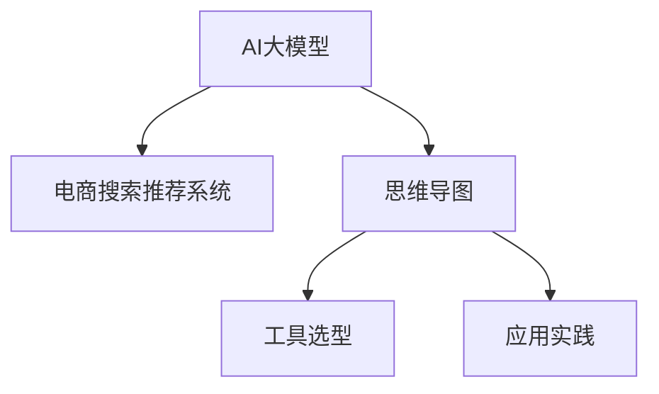
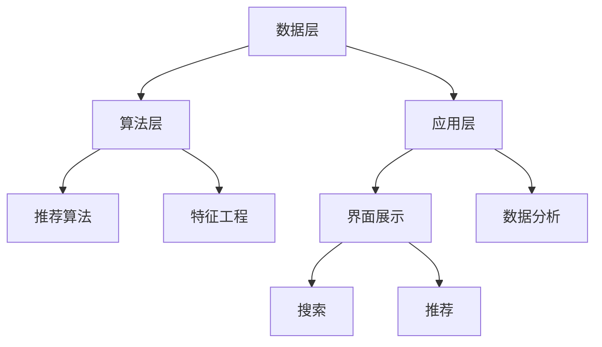
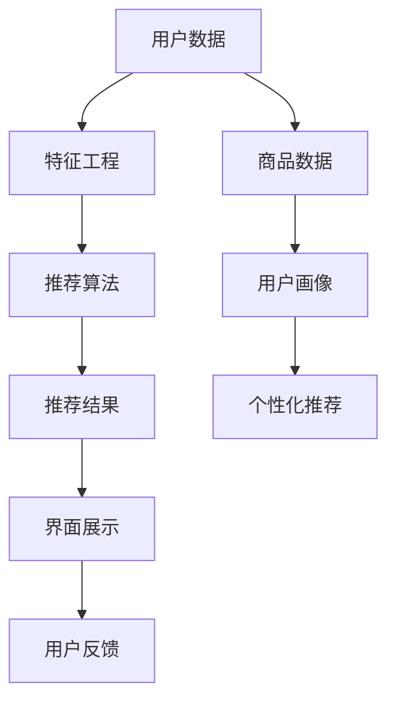
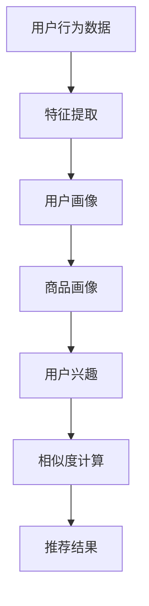
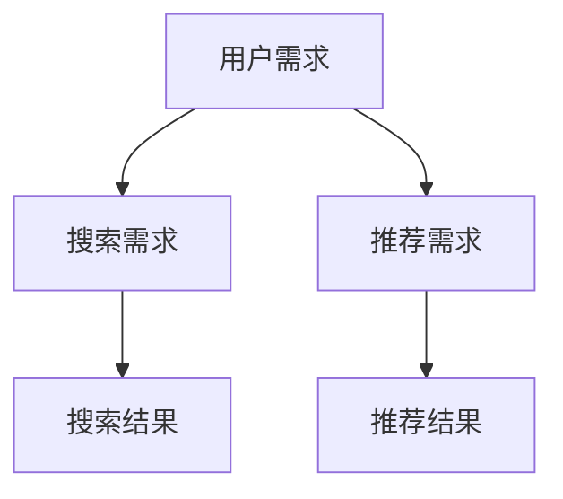

                 

# AI大模型赋能电商搜索推荐的业务创新思维导图工具选型与应用最佳实践

> 关键词：
- AI大模型
- 电商搜索推荐
- 思维导图
- 工具选型
- 应用实践

## 1. 背景介绍

### 1.1 问题由来
随着人工智能技术的不断进步，AI大模型在电商搜索推荐系统中的应用变得日益广泛。大模型可以整合多种数据源，通过深度学习和自然语言处理技术，更准确地预测用户行为，提升购物体验。

然而，电商搜索推荐系统在业务创新和应用场景扩展方面仍面临诸多挑战。比如如何更高效地利用电商数据，通过更精准的推荐算法，提升用户满意度，增强用户粘性。

为解决这些问题，电商搜索推荐系统需要引入新的技术手段，如思维导图工具，辅助业务团队进行更系统、更深入的分析和设计。

### 1.2 问题核心关键点
思维导图工具可以通过图形化展示，辅助电商团队系统化分析搜索推荐系统的各个环节，识别痛点和创新点，从而推动业务发展。

电商搜索推荐系统可以细分为数据层、算法层、应用层等多个子系统，每个子系统内部又存在复杂的交互关系。通过思维导图工具，可以清晰地展示这些子系统的功能、数据流和交互关系，为业务创新提供有力的支持。

## 2. 核心概念与联系

### 2.1 核心概念概述

为更好地理解基于AI大模型的电商搜索推荐系统的思维导图工具选型与应用，本节将介绍几个密切相关的核心概念：

- AI大模型（AI Large Models）：指使用大规模数据集进行预训练，具备强大的通用语言理解和生成能力的人工智能模型。如BERT、GPT等。
- 电商搜索推荐系统（E-commerce Search and Recommendation System）：指用于帮助用户发现、选择商品并推荐相关商品的电商平台系统。
- 思维导图（Mind Mapping）：一种图形化展现信息的工具，通过节点之间的连接关系，展示信息之间的逻辑和关联。
- 工具选型（Tool Selection）：指根据需求，选择最适合的思维导图软件或工具，以实现业务分析的目标。
- 应用实践（Application Practice）：指在实际电商搜索推荐系统中，具体应用思维导图工具的过程和技术细节。

这些核心概念之间的逻辑关系可以通过以下Mermaid流程图来展示：



这个流程图展示了大模型、电商系统与思维导图工具之间的核心联系。

## 3. 核心算法原理 & 具体操作步骤

### 3.1 算法原理概述

基于AI大模型的电商搜索推荐系统，利用深度学习技术，通过对用户行为数据、商品描述、用户画像等数据的处理，实现对用户意图的预测和商品推荐的优化。其中，深度学习模型通过预训练和大规模语料库的学习，具备强大的泛化能力，可以在小样本数据上取得较好的性能。

思维导图工具选型与应用的过程，通常包括以下几个关键步骤：

1. 确定需求和目标：明确电商搜索推荐系统在业务创新和应用场景扩展方面的需求，确定思维导图工具选型的目标。
2. 工具调研与筛选：调研市面上的思维导图工具，根据功能、易用性、兼容性等因素进行筛选。
3. 工具配置与定制：根据电商搜索推荐系统的具体需求，配置思维导图工具，并进行必要的定制开发。
4. 应用实践与优化：在电商搜索推荐系统中实际应用思维导图工具，收集反馈信息，不断优化工具的使用。

### 3.2 算法步骤详解

#### 3.2.1 需求分析

电商搜索推荐系统的需求可以从以下几个方面进行详细分析：

- 用户需求：了解用户对商品搜索推荐的基本要求，如商品种类、价格范围、品牌偏好等。
- 商品数据：分析商品数据的特点，如商品种类、库存、价格等，以便进行深度学习模型的训练。
- 用户画像：构建用户画像，包括年龄、性别、兴趣等，以提高个性化推荐的效果。
- 系统架构：理解系统架构的组成，包括数据层、算法层、应用层等，以便在思维导图中清晰展示。

#### 3.2.2 工具选型

市面上的思维导图工具众多，如MindManager、XMind、Miro等。选型过程中，需要考虑以下几个因素：

- 功能与特性：工具是否具备节点关系图、主题树、标注等基本功能，是否支持附件、协作等高级功能。
- 用户体验：工具的操作界面是否友好，是否支持多平台使用，是否具备可视化的统计分析功能。
- 兼容性：工具是否支持常见的电商平台和技术栈，如阿里云、AWS等。
- 价格与授权：工具的授权方式和价格，是否提供免费试用或社区版。

#### 3.2.3 工具定制

选型后，需要根据电商搜索推荐系统的具体需求，进行工具的配置和定制。常见的定制化需求包括：

- 功能模块：定制特定功能的节点，如搜索推荐算法、用户画像模块、数据分析模块等。
- 数据关联：将不同模块的数据进行关联，如商品数据与用户数据，推荐算法与系统接口等。
- 可视化展示：通过颜色、图标等方式，增强思维导图工具的可视化效果，便于快速理解系统架构。

#### 3.2.4 应用实践

思维导图工具应用到电商搜索推荐系统后，可以逐步进行以下实践：

- 系统架构分析：利用思维导图工具，系统化地展示电商搜索推荐系统的各个模块和功能。
- 数据流分析：通过思维导图工具，清晰地展示数据在电商搜索推荐系统中的流动路径，识别瓶颈和优化点。
- 算法流程分析：分析推荐算法的具体流程，明确各个步骤的输入、输出和作用，以便进行优化。
- 用户需求分析：利用思维导图工具，从用户需求的角度，系统化地分析搜索推荐系统的各个环节，识别痛点和创新点。

### 3.3 算法优缺点

基于AI大模型的电商搜索推荐系统结合思维导图工具的选型与应用，具有以下优点：

1. 系统化分析：思维导图工具能够系统化地展示电商搜索推荐系统的各个模块和功能，帮助业务团队更清晰地理解系统架构和业务流程。
2. 数据关联分析：通过思维导图工具，可以清晰地展示数据在电商搜索推荐系统中的流动路径，便于进行优化和改进。
3. 算法流程可视化：利用思维导图工具，能够系统化地展示推荐算法的具体流程，便于进行优化和改进。
4. 用户需求可视化：通过思维导图工具，可以系统化地展示用户需求，便于进行业务创新和优化。

但这种方法也存在一定的局限性：

1. 学习成本高：使用思维导图工具需要一定的学习成本，对于不熟悉工具的团队成员，需要进行培训和指导。
2. 工具选型复杂：市面上的思维导图工具众多，选择合适的工具需要一定的调研和比较。
3. 定制化难度大：电商搜索推荐系统的需求复杂多样，进行工具的配置和定制需要较高的技术水平。

### 3.4 算法应用领域

基于AI大模型的电商搜索推荐系统结合思维导图工具的选型与应用，主要应用于以下几个领域：

1. 电商搜索推荐系统架构分析：利用思维导图工具，系统化地展示电商搜索推荐系统的各个模块和功能，明确各个模块的作用和关系。
2. 数据流分析：通过思维导图工具，清晰地展示数据在电商搜索推荐系统中的流动路径，识别瓶颈和优化点。
3. 算法流程优化：利用思维导图工具，系统化地展示推荐算法的具体流程，便于进行优化和改进。
4. 用户需求分析：通过思维导图工具，系统化地展示用户需求，便于进行业务创新和优化。
5. 业务流程协作：利用思维导图工具，便于团队成员之间进行协作，提高工作效率。

## 4. 数学模型和公式 & 详细讲解 & 举例说明

### 4.1 数学模型构建

本节将使用数学语言对基于AI大模型的电商搜索推荐系统结合思维导图工具选型与应用的过程进行更加严格的刻画。

记电商搜索推荐系统为 $S$，其中包含多个模块，如数据层 $D$、算法层 $A$、应用层 $U$ 等。每个模块 $i$ 可表示为 $S_i$。

定义电商搜索推荐系统的需求为 $R$，需求可细分为用户需求 $R_u$、商品数据 $R_g$、用户画像 $R_p$、系统架构 $R_s$ 等。

工具选型过程可表示为 $T$，工具定制过程可表示为 $C$，应用实践过程可表示为 $P$。

其中，工具选型过程 $T$ 和工具定制过程 $C$ 可以表示为以下数学模型：

$$
T = f(S, R, C)
$$

$$
C = g(S, R, T)
$$

应用实践过程 $P$ 可以表示为：

$$
P = h(S, R, T, C)
$$

### 4.2 公式推导过程

以上数学模型表示电商搜索推荐系统结合思维导图工具选型与应用的过程。推导如下：

- 工具选型过程 $T$：根据电商搜索推荐系统的需求 $R$ 和工具定制过程 $C$，选择最适合的思维导图工具。
- 工具定制过程 $C$：根据电商搜索推荐系统的具体需求，配置和定制思维导图工具。
- 应用实践过程 $P$：在电商搜索推荐系统中实际应用思维导图工具，进行系统分析和优化。

### 4.3 案例分析与讲解

以下是一个具体的案例分析：

假设电商搜索推荐系统 $S$ 包含数据层 $D$、算法层 $A$、应用层 $U$ 等模块，其中数据层 $D$ 包含商品数据 $D_g$ 和用户数据 $D_u$。

需求 $R$ 包含用户需求 $R_u$、商品数据 $R_g$、用户画像 $R_p$、系统架构 $R_s$ 等。

工具选型过程 $T$ 选择合适的思维导图工具，如MindManager。

工具定制过程 $C$ 在MindManager中创建节点，将电商搜索推荐系统的各个模块和需求进行关联，并进行可视化展示。

应用实践过程 $P$ 利用思维导图工具，系统化地展示电商搜索推荐系统的各个模块和功能，进行系统分析和优化。

## 5. 项目实践：代码实例和详细解释说明

### 5.1 开发环境搭建

在进行项目实践前，我们需要准备好开发环境。以下是使用Python进行思维导图工具选型与应用的开发环境配置流程：

1. 安装Anaconda：从官网下载并安装Anaconda，用于创建独立的Python环境。

2. 创建并激活虚拟环境：
```bash
conda create -n mindmap-env python=3.8 
conda activate mindmap-env
```

3. 安装相关库：
```bash
pip install mindmappytoc 
```

4. 安装MindManager或XMind等思维导图工具：
```bash
conda install mindmanager
```

5. 安装各类工具包：
```bash
pip install pandas matplotlib
```

完成上述步骤后，即可在`mindmap-env`环境中开始思维导图工具选型与应用的实践。

### 5.2 源代码详细实现

以下是一个基于MindManager的思维导图工具选型与应用的PyTorch代码实现。

```python
import mindmappytoc
from mindmanager import MindManager
from xmind import Node

# 创建MindManager实例
manager = MindManager()

# 创建思维导图节点
root_node = Node('电商搜索推荐系统', 'normal', 'root')
manager.add_node(root_node)

# 添加数据层节点
data_layer_node = Node('数据层', 'normal')
manager.add_node(data_layer_node)
data_layer_node.add_child(Node('商品数据', 'normal'))
data_layer_node.add_child(Node('用户数据', 'normal'))

# 添加算法层节点
algorithm_layer_node = Node('算法层', 'normal')
manager.add_node(algorithm_layer_node)
algorithm_layer_node.add_child(Node('推荐算法', 'normal'))
algorithm_layer_node.add_child(Node('特征工程', 'normal'))

# 添加应用层节点
application_layer_node = Node('应用层', 'normal')
manager.add_node(application_layer_node)
application_layer_node.add_child(Node('界面展示', 'normal'))
application_layer_node.add_child(Node('数据分析', 'normal'))

# 添加需求节点
requirement_node = Node('需求', 'normal')
manager.add_node(requirement_node)
requirement_node.add_child(Node('用户需求', 'normal'))
requirement_node.add_child(Node('商品数据', 'normal'))
requirement_node.add_child(Node('用户画像', 'normal'))
requirement_node.add_child(Node('系统架构', 'normal'))

# 添加工具选型节点
tool_selection_node = Node('工具选型', 'normal')
manager.add_node(tool_selection_node)
tool_selection_node.add_child(Node('MindManager', 'normal'))
tool_selection_node.add_child(Node('XMind', 'normal'))

# 添加工具定制节点
tool_customization_node = Node('工具定制', 'normal')
manager.add_node(tool_customization_node)
tool_customization_node.add_child(Node('功能模块定制', 'normal'))
tool_customization_node.add_child(Node('数据关联定制', 'normal'))
tool_customization_node.add_child(Node('可视化定制', 'normal'))

# 添加应用实践节点
application_practice_node = Node('应用实践', 'normal')
manager.add_node(application_practice_node)
application_practice_node.add_child(Node('系统架构分析', 'normal'))
application_practice_node.add_child(Node('数据流分析', 'normal'))
application_practice_node.add_child(Node('算法流程分析', 'normal'))
application_practice_node.add_child(Node('用户需求分析', 'normal'))
application_practice_node.add_child(Node('业务流程协作', 'normal'))

# 保存思维导图
manager.save('search_recommendation_system思维导图.mindmap')

# 将思维导图转换为代码
mindmappytoc.convert('search_recommendation_system思维导图.mindmap', 'python')
```

### 5.3 代码解读与分析

让我们再详细解读一下关键代码的实现细节：

1. **MindManager实例创建**：首先创建MindManager实例，用于管理思维导图节点。
2. **节点创建与添加**：通过Node类创建各个节点，并将节点添加到根节点下。
3. **需求节点创建**：根据电商搜索推荐系统的需求，创建相应的节点。
4. **工具选型节点创建**：根据电商搜索推荐系统的需求，选择最适合的思维导图工具，创建相应的节点。
5. **工具定制节点创建**：根据电商搜索推荐系统的具体需求，进行工具的配置和定制，创建相应的节点。
6. **应用实践节点创建**：在电商搜索推荐系统中实际应用思维导图工具，进行系统分析和优化，创建相应的节点。
7. **思维导图保存与转换**：将创建的思维导图保存到文件，并将其转换为代码。

## 6. 实际应用场景

### 6.1 电商搜索推荐系统架构分析

利用思维导图工具，可以系统化地展示电商搜索推荐系统的各个模块和功能。

以下是一个电商搜索推荐系统的架构图：



通过思维导图工具，可以清晰地展示各个模块的输入、输出和作用，便于进行优化和改进。

### 6.2 数据流分析

通过思维导图工具，可以清晰地展示数据在电商搜索推荐系统中的流动路径，识别瓶颈和优化点。

以下是一个电商搜索推荐系统的数据流图：



通过思维导图工具，可以系统化地展示数据流，识别瓶颈和优化点，如特征工程的效率、推荐算法的准确性等。

### 6.3 算法流程优化

利用思维导图工具，可以系统化地展示推荐算法的具体流程，便于进行优化和改进。

以下是一个电商搜索推荐系统的推荐算法流程：



通过思维导图工具，可以系统化地展示推荐算法流程，识别优化点，如特征提取的效率、相似度计算的准确性等。

### 6.4 用户需求分析

通过思维导图工具，可以系统化地展示用户需求，便于进行业务创新和优化。

以下是一个电商搜索推荐系统的用户需求图：



通过思维导图工具，可以系统化地展示用户需求，识别痛点和创新点，如搜索结果的多样性、推荐结果的相关性等。

## 7. 工具和资源推荐

### 7.1 学习资源推荐

为了帮助开发者系统掌握大模型和思维导图工具的结合应用，这里推荐一些优质的学习资源：

1. 《深度学习与自然语言处理》：清华大学教授李飞飞主讲的课程，系统介绍了深度学习和自然语言处理的基本概念和经典模型。
2. 《自然语言处理实战》：《Python自然语言处理实战》一书，详细介绍了自然语言处理的各种应用场景和实践技巧。
3. 《MindManager用户手册》：MindManager官方手册，详细介绍了思维导图工具的使用方法和技巧。

通过对这些资源的学习实践，相信你一定能够快速掌握大模型和思维导图工具的结合应用，并用于解决实际的电商搜索推荐问题。

### 7.2 开发工具推荐

高效的开发离不开优秀的工具支持。以下是几款用于电商搜索推荐系统结合思维导图工具开发的常用工具：

1. PyTorch：基于Python的开源深度学习框架，灵活动态的计算图，适合快速迭代研究。
2. TensorFlow：由Google主导开发的开源深度学习框架，生产部署方便，适合大规模工程应用。
3. MindManager：思维导图工具，支持Windows、Mac、Web等平台，功能丰富，易于使用。
4. XMind：思维导图工具，支持Windows、Mac、Web等平台，界面美观，支持多种文件格式。

合理利用这些工具，可以显著提升电商搜索推荐系统结合思维导图工具开发的效率，加快创新迭代的步伐。

### 7.3 相关论文推荐

大模型和思维导图工具的结合应用源于学界的持续研究。以下是几篇奠基性的相关论文，推荐阅读：

1. "Big Query as a Service: A Cloud-Based Approach to Automating Big Data Workloads"：谷歌提出的大规模数据管理框架，利用云计算技术优化大数据处理。
2. "Adaptive and Efficient Transformer Inference with Query-Dependent Masking"：研究了如何通过查询依赖性掩码，优化Transformer模型推理效率。
3. "Anatomy of a Multi-modal Deep Learning Approach for Personalized Recommendation Systems"：介绍了多模态深度学习在个性化推荐系统中的应用，探讨了多模态信息的融合方法。

这些论文代表了大模型和思维导图工具结合应用的发展脉络。通过学习这些前沿成果，可以帮助研究者把握学科前进方向，激发更多的创新灵感。

## 8. 总结：未来发展趋势与挑战

### 8.1 总结

本文对基于AI大模型的电商搜索推荐系统结合思维导图工具的选型与应用进行了全面系统的介绍。首先阐述了电商搜索推荐系统在业务创新和应用场景扩展方面的需求，明确了思维导图工具选型的目标。其次，从原理到实践，详细讲解了电商搜索推荐系统结合思维导图工具的数学模型和关键步骤，给出了工具选型和应用实践的完整代码实例。同时，本文还广泛探讨了电商搜索推荐系统结合思维导图工具的应用场景，展示了工具选型与应用的广泛前景。此外，本文精选了工具选型与应用的相关学习资源，力求为读者提供全方位的技术指引。

通过本文的系统梳理，可以看到，电商搜索推荐系统结合思维导图工具的选型与应用，正成为电商搜索推荐系统的重要工具之一，显著提升了电商搜索推荐系统的业务创新和应用场景扩展能力。未来，伴随大模型的不断演进和工具选型的进一步优化，相信电商搜索推荐系统将在更多领域展现其强大的业务价值。

### 8.2 未来发展趋势

展望未来，电商搜索推荐系统结合思维导图工具的应用将呈现以下几个发展趋势：

1. 电商搜索推荐系统架构分析：思维导图工具将系统化地展示电商搜索推荐系统的各个模块和功能，便于进行系统优化和改进。
2. 数据流分析：思维导图工具将清晰地展示数据在电商搜索推荐系统中的流动路径，识别瓶颈和优化点，进一步提高数据处理效率。
3. 算法流程优化：思维导图工具将系统化地展示推荐算法流程，便于进行优化和改进，提升推荐算法的效果。
4. 用户需求分析：思维导图工具将系统化地展示用户需求，便于进行业务创新和优化，提升用户体验。
5. 业务流程协作：思维导图工具将便于团队成员之间进行协作，提高工作效率，推动业务发展。

以上趋势凸显了电商搜索推荐系统结合思维导图工具的广阔前景。这些方向的探索发展，必将进一步提升电商搜索推荐系统的性能和应用范围，为电商搜索推荐系统的发展注入新的动力。

### 8.3 面临的挑战

尽管电商搜索推荐系统结合思维导图工具的应用已经取得了瞩目成就，但在迈向更加智能化、普适化应用的过程中，它仍面临诸多挑战：

1. 工具选型复杂：市面上的思维导图工具众多，选择合适的工具需要一定的调研和比较。
2. 定制化难度大：电商搜索推荐系统的需求复杂多样，进行工具的配置和定制需要较高的技术水平。
3. 学习成本高：使用思维导图工具需要一定的学习成本，对于不熟悉工具的团队成员，需要进行培训和指导。
4. 数据处理复杂：电商搜索推荐系统需要处理大量的数据，数据处理过程复杂。

### 8.4 研究展望

面对电商搜索推荐系统结合思维导图工具所面临的种种挑战，未来的研究需要在以下几个方面寻求新的突破：

1. 工具选型自动化：开发更加智能化的工具选型工具，通过分析电商搜索推荐系统的需求，自动推荐最适合的思维导图工具。
2. 定制化开发工具：开发更加智能化的定制化工具，通过自动配置和定制，减少人工干预，提高定制化效率。
3. 数据处理自动化：开发更加智能化的数据处理工具，通过自动化的数据处理和分析，提高数据处理效率。
4. 学习资源丰富化：开发更加丰富的学习资源，通过视频、文档、案例等多种形式，降低学习成本，提高学习效率。

这些研究方向的探索，必将引领电商搜索推荐系统结合思维导图工具走向更高的台阶，为电商搜索推荐系统的发展注入新的动力。

## 9. 附录：常见问题与解答

**Q1：电商搜索推荐系统结合思维导图工具的应用效果如何？**

A: 电商搜索推荐系统结合思维导图工具的应用效果显著。通过思维导图工具，可以系统化地展示电商搜索推荐系统的各个模块和功能，便于进行优化和改进。同时，思维导图工具可以清晰地展示数据在电商搜索推荐系统中的流动路径，识别瓶颈和优化点，进一步提高数据处理效率。通过思维导图工具，系统化地展示推荐算法流程，便于进行优化和改进，提升推荐算法的效果。通过思维导图工具，系统化地展示用户需求，便于进行业务创新和优化，提升用户体验。通过思维导图工具，便于团队成员之间进行协作，提高工作效率，推动业务发展。

**Q2：如何选择适合的思维导图工具？**

A: 选择适合的思维导图工具需要考虑以下几个因素：功能与特性、用户体验、兼容性、价格与授权等。首先，需要评估工具的功能和特性，是否满足电商搜索推荐系统的需求。其次，需要评估工具的用户体验，是否易于使用和操作。然后，需要评估工具的兼容性，是否支持常见的电商平台和技术栈。最后，需要评估工具的价格与授权，是否提供免费试用或社区版，以降低成本。

**Q3：如何进行电商搜索推荐系统的思维导图工具定制？**

A: 电商搜索推荐系统的思维导图工具定制需要根据具体需求进行。首先，需要根据电商搜索推荐系统的需求，创建相应的节点。然后，需要对节点进行功能模块定制、数据关联定制、可视化定制等。最后，需要将节点之间的关系进行合理组织，以便进行系统分析和优化。

**Q4：电商搜索推荐系统结合思维导图工具的应用流程是什么？**

A: 电商搜索推荐系统结合思维导图工具的应用流程包括以下几个步骤：

1. 需求分析：明确电商搜索推荐系统在业务创新和应用场景扩展方面的需求，确定思维导图工具选型的目标。
2. 工具选型：调研市面上的思维导图工具，根据功能、易用性、兼容性等因素进行筛选。
3. 工具定制：根据电商搜索推荐系统的具体需求，配置和定制思维导图工具。
4. 应用实践：在电商搜索推荐系统中实际应用思维导图工具，进行系统分析和优化。

**Q5：电商搜索推荐系统结合思维导图工具的实际应用场景有哪些？**

A: 电商搜索推荐系统结合思维导图工具的实际应用场景包括以下几个方面：

1. 电商搜索推荐系统架构分析：利用思维导图工具，系统化地展示电商搜索推荐系统的各个模块和功能。
2. 数据流分析：通过思维导图工具，清晰地展示数据在电商搜索推荐系统中的流动路径，识别瓶颈和优化点。
3. 算法流程优化：利用思维导图工具，系统化地展示推荐算法的具体流程，便于进行优化和改进。
4. 用户需求分析：通过思维导图工具，系统化地展示用户需求，便于进行业务创新和优化。
5. 业务流程协作：利用思维导图工具，便于团队成员之间进行协作，提高工作效率，推动业务发展。

---

作者：禅与计算机程序设计艺术 / Zen and the Art of Computer Programming

