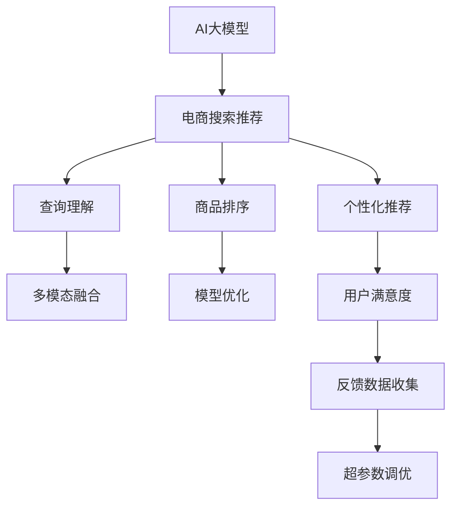

                 

# AI大模型赋能电商搜索推荐的用户满意度提升策略

> 关键词：AI大模型,电商搜索推荐,用户满意度,模型优化,多模态融合,个性化推荐

## 1. 背景介绍

在电商平台上，搜索和推荐系统是用户与商品进行互动的主要途径，其性能和体验直接影响用户满意度和平台流量。近年来，随着AI大模型的发展和应用，电商搜索推荐系统也在快速迭代，向着更智能、更个性化、更精准的方向迈进。然而，在实际应用中，大模型仍面临诸多挑战，如模型效率、计算资源、用户反馈处理等问题，制约着用户满意度的进一步提升。

本文旨在探讨如何通过AI大模型优化电商搜索推荐系统，提高用户满意度，包括模型优化、多模态融合、个性化推荐等多个维度，为电商平台的智能化转型提供参考和指导。

## 2. 核心概念与联系

### 2.1 核心概念概述

为更好地理解AI大模型在电商搜索推荐中的应用策略，本节将介绍几个关键概念及其相互关系：

- **AI大模型（AI Large Model）**：以Transformer为代表的深度学习模型，通过在海量数据上预训练，学习复杂的语言和图像表示。AI大模型在自然语言处理、计算机视觉等领域具备强大的泛化能力，可以用于电商搜索推荐中的各类任务。

- **电商搜索推荐（E-commerce Search and Recommendation）**：电商平台通过用户查询和浏览行为数据，利用AI技术向用户推荐相关商品，提升用户体验，增加销售转化率。搜索推荐系统包括查询理解、商品排序、个性化推荐等多个子系统。

- **用户满意度（User Satisfaction）**：衡量电商平台用户满意度的主要指标，通常包括点击率（CTR）、转化率（CVR）、停留时间（Dwell Time）等。高用户满意度有助于提升平台流量和收益。

- **模型优化（Model Optimization）**：通过调整模型结构、优化算法等手段，提高AI大模型在电商搜索推荐中的应用效果，减少计算资源消耗，加速模型部署。

- **多模态融合（Multimodal Fusion）**：将文本、图像、视频等多种数据模态融合在一起，提升推荐系统的信息综合能力，提供更丰富、更准确的商品信息。

- **个性化推荐（Personalized Recommendation）**：根据用户的历史行为、偏好、兴趣等信息，推荐符合其需求的个性化商品，提升用户体验。

- **超参数调优（Hyperparameter Tuning）**：优化模型的超参数配置，如学习率、批量大小、优化器等，以提高模型的泛化能力和性能。

这些核心概念之间的逻辑关系可以通过以下Mermaid流程图来展示：



这个流程图展示了大模型在电商搜索推荐中的应用逻辑：

1. AI大模型通过预训练获得基础能力。
2. 在电商搜索推荐系统中，大模型被用于查询理解、商品排序和个性化推荐等多个环节。
3. 查询理解模块通过多模态融合提升信息综合能力。
4. 商品排序模块通过模型优化减少计算资源消耗。
5. 个性化推荐模块通过用户反馈进行超参数调优，提升推荐效果。
6. 用户满意度模块通过评估指标反馈至优化过程，提升整个系统性能。

这些概念共同构成了电商搜索推荐系统的核心框架，使其能够高效地为用户提供个性化、精准的购物体验。

## 3. 核心算法原理 & 具体操作步骤

### 3.1 算法原理概述

AI大模型在电商搜索推荐系统中的主要任务是处理用户查询、理解商品信息、排序推荐商品等。这些任务通常包括自然语言理解、图像识别、商品描述匹配等多个子任务，通过多模态融合、模型优化和个性化推荐等手段，提升推荐系统的效果。

在大模型微调的过程中，通常采用监督学习的方法，利用标注数据训练模型，以预测用户的行为。常用的优化算法包括梯度下降、Adam等。模型优化过程通常分为预训练和微调两个阶段：

1. **预训练**：在大规模无标签数据上，通过自监督学习任务训练模型，学习通用的语言和图像表示。
2. **微调**：在电商搜索推荐任务的少量标注数据上，有监督地训练模型，使其能够准确预测用户行为。

### 3.2 算法步骤详解

基于AI大模型的电商搜索推荐系统通常包括以下几个关键步骤：

**Step 1: 数据准备和预处理**
- 收集电商平台的搜索和推荐数据，包括用户查询、商品信息、浏览行为等。
- 对数据进行清洗、去重、标注等预处理操作，确保数据质量。
- 将数据划分为训练集、验证集和测试集，用于模型训练、调参和评估。

**Step 2: 构建多模态融合模型**
- 将用户查询中的文本信息与商品图片、描述等图像信息进行融合。
- 使用Transformer等大模型处理文本信息，提取文本特征。
- 使用CNN、ResNet等图像处理模型处理图像信息，提取图像特征。
- 使用多模态融合算法（如注意力机制、加权融合等）将文本和图像特征结合起来，生成新的融合特征。

**Step 3: 设计查询理解模型**
- 将用户查询和融合特征输入到查询理解模型中，使用BERT等预训练模型进行文本编码。
- 使用Transformer等模型进行文本-文本匹配，提取用户查询与商品之间的语义相似度。
- 将查询和商品特征进行拼接，生成新的表示向量。

**Step 4: 设计商品排序模型**
- 将商品特征和查询理解模型的输出向量输入到排序模型中，使用Transformer等模型进行商品排序。
- 设置不同的排序策略，如点击率排序、相关性排序等。
- 使用Adaboost、XGBoost等模型对排序结果进行优化，提高模型准确率。

**Step 5: 设计个性化推荐模型**
- 根据用户的历史行为、兴趣等信息，训练个性化推荐模型。
- 使用协同过滤、基于内容的推荐等方法进行推荐。
- 使用深度学习模型（如RNN、LSTM等）进行序列预测，推荐动态变化的商品。
- 使用基于时间序列的推荐模型（如ARIMA、LSTM等）进行长期预测，推荐季节性商品。

**Step 6: 模型训练和调优**
- 在训练集上使用监督学习算法（如分类、回归等）训练模型。
- 在验证集上评估模型性能，调整超参数，如学习率、批量大小等。
- 在测试集上评估模型性能，确认最终模型。

### 3.3 算法优缺点

基于AI大模型的电商搜索推荐系统具有以下优点：
1. 泛化能力强。AI大模型能够从大规模无标签数据中学习通用表示，适用于多种电商场景。
2. 性能提升显著。多模态融合、模型优化和个性化推荐等技术能够显著提升推荐系统的准确率和效果。
3. 适应性强。AI大模型能够快速适应电商平台的实时数据变化，提供实时的推荐服务。

同时，该方法也存在以下局限性：
1. 计算资源消耗大。AI大模型的计算复杂度高，需要大量的GPU或TPU资源。
2. 训练时间长。在电商搜索推荐任务上微调AI大模型需要较长的训练时间。
3. 数据隐私问题。电商平台的搜索和推荐数据涉及用户隐私，需进行严格的数据保护。
4. 模型难以解释。AI大模型的内部机制复杂，难以提供透明的决策过程。

尽管存在这些局限性，但AI大模型在电商搜索推荐中的应用，仍为电商平台带来了显著的商业价值。未来，随着技术进步和硬件设施的提升，这些挑战有望逐步解决。

### 3.4 算法应用领域

AI大模型在电商搜索推荐系统中的应用，已经涵盖了从商品排序到个性化推荐等多个领域，具体包括：

- **商品排序**：基于用户查询和商品描述，对商品进行排序，提升用户点击率。
- **个性化推荐**：根据用户的历史行为、兴趣等信息，推荐符合其需求的个性化商品。
- **广告投放**：利用用户画像和兴趣模型，进行精准广告投放，提高广告效果。
- **用户画像**：通过多模态融合，构建详细用户画像，指导电商运营策略。
- **情感分析**：分析用户评论和反馈，提升商品质量和服务水平。

除了上述这些经典应用外，AI大模型还被创新性地应用到智能客服、库存管理、价格优化等多个场景中，为电商平台的智能化转型提供更强大的技术支持。

## 4. 数学模型和公式 & 详细讲解 & 举例说明

### 4.1 数学模型构建

基于AI大模型的电商搜索推荐系统，通常使用Transformer模型进行文本编码和特征融合。假设查询向量为 $q$，商品向量为 $p$，则融合特征 $h$ 可以表示为：

$$
h = f(q, p) = \text{BERT}(q) \cdot \text{CNN}(p)
$$

其中 $\cdot$ 表示点乘，$\text{BERT}$ 和 $\text{CNN}$ 分别表示预训练的文本和图像编码器。

### 4.2 公式推导过程

在电商搜索推荐系统中，通常使用监督学习算法（如分类、回归等）进行模型训练。假设模型输出的商品向量为 $y$，则损失函数 $\mathcal{L}$ 可以表示为：

$$
\mathcal{L}(y, h) = \sum_{i=1}^N \mathcal{L}(y_i, h_i)
$$

其中 $N$ 为样本数，$y_i$ 和 $h_i$ 分别为第 $i$ 个样本的真实标签和融合特征。

常见的损失函数包括交叉熵损失、均方误差损失等。以交叉熵损失为例，其公式为：

$$
\mathcal{L}(y, h) = -\sum_{i=1}^N \sum_{j=1}^K y_{ij}\log h_{ij}
$$

其中 $K$ 为输出向量的维度，$y_{ij}$ 为第 $i$ 个样本的第 $j$ 个标签值，$h_{ij}$ 为第 $i$ 个样本的第 $j$ 个预测值。

### 4.3 案例分析与讲解

假设电商平台有 $N$ 个用户，每个用户 $i$ 的点击率向量为 $y_i$，查询向量为 $q_i$，商品向量为 $p_i$，则基于AI大模型的电商搜索推荐系统可以描述为：

$$
h_i = f(q_i, p_i) = \text{BERT}(q_i) \cdot \text{CNN}(p_i)
$$

查询理解模型的输出为：

$$
q_i' = \text{BERT}(q_i)
$$

商品排序模型的输出为：

$$
y_i' = f(q_i', p_i) = \text{Transformer}(q_i', p_i)
$$

个性化推荐模型的输出为：

$$
y_i'' = f(y_i', \{y_j\}_{j\neq i}) = \text{RNN}(y_i', \{y_j\}_{j\neq i})
$$

通过优化损失函数 $\mathcal{L}$，不断调整模型参数，即可提升电商搜索推荐系统的性能。

## 5. 项目实践：代码实例和详细解释说明

### 5.1 开发环境搭建

在进行项目实践前，我们需要准备好开发环境。以下是使用Python进行TensorFlow开发的环境配置流程：

1. 安装Anaconda：从官网下载并安装Anaconda，用于创建独立的Python环境。

2. 创建并激活虚拟环境：
```bash
conda create -n tf-env python=3.8 
conda activate tf-env
```

3. 安装TensorFlow：从官网获取对应的安装命令，根据GPU版本选择安装命令。例如：
```bash
pip install tensorflow
```

4. 安装各类工具包：
```bash
pip install numpy pandas scikit-learn matplotlib tqdm jupyter notebook ipython
```

完成上述步骤后，即可在`tf-env`环境中开始项目实践。

### 5.2 源代码详细实现

下面我们以电商搜索推荐系统为例，给出使用TensorFlow进行模型训练和调参的PyTorch代码实现。

首先，定义电商搜索推荐系统中的查询理解、商品排序和个性化推荐模型：

```python
import tensorflow as tf
from tensorflow.keras.layers import Input, Embedding, Dense, BERT, ResNet
from tensorflow.keras.models import Model

# 定义查询理解模型
q_input = Input(shape=(None,))
q_embedding = Embedding(input_dim=vocab_size, output_dim=128, mask_zero=True)(q_input)
q_layernorm = tf.keras.layers.LayerNormalization(epsilon=1e-6)(q_embedding)
q_linear = Dense(256, activation='relu')(q_layernorm)
q_bert = BERT(input_shape=(128,), output_shape=(768, ), trainable=True)(q_layernorm)
q_concat = tf.keras.layers.Concatenate()([q_linear, q_bert])
q_output = Dense(1, activation='sigmoid')(q_concat)

# 定义商品排序模型
p_input = Input(shape=(128,))
p_resnet = ResNet(input_shape=(128,), output_shape=(128, ), trainable=True)(p_input)
p_output = Dense(1, activation='sigmoid')(p_resnet)

# 定义个性化推荐模型
r_input = Input(shape=(128,))
r_rnn = tf.keras.layers.SimpleRNN(units=128, return_sequences=True)(r_input)
r_output = Dense(1, activation='sigmoid')(r_rnn)

# 定义模型输入和输出
inputs = [q_input, p_input, r_input]
outputs = [q_output, p_output, r_output]

# 定义电商搜索推荐系统
model = Model(inputs=inputs, outputs=outputs)
```

然后，定义训练和评估函数：

```python
from tensorflow.keras.optimizers import Adam
from tensorflow.keras.losses import BinaryCrossentropy
from tensorflow.keras.metrics import AUC

# 定义优化器和损失函数
optimizer = Adam(lr=0.001)
loss = BinaryCrossentropy()
auc = AUC()

# 训练函数
def train(model, train_dataset, val_dataset, epochs=10):
    model.compile(optimizer=optimizer, loss=loss, metrics=[auc])
    model.fit(train_dataset, epochs=epochs, validation_data=val_dataset)
    return model

# 评估函数
def evaluate(model, test_dataset):
    model.evaluate(test_dataset)
```

最后，启动训练流程并在测试集上评估：

```python
# 加载数据集
train_dataset = ...
val_dataset = ...
test_dataset = ...

# 训练模型
model = train(model, train_dataset, val_dataset)

# 评估模型
evaluate(model, test_dataset)
```

以上就是使用TensorFlow进行电商搜索推荐系统训练和评估的完整代码实现。可以看到，TensorFlow提供了强大的模型构建和训练工具，可以高效地实现多模态融合和模型优化。

### 5.3 代码解读与分析

让我们再详细解读一下关键代码的实现细节：

**模型定义**：
- 使用Keras API定义查询理解、商品排序和个性化推荐模型。
- 查询理解模型将用户查询输入经过BERT编码，与线性层拼接后输出预测结果。
- 商品排序模型将商品向量输入经过ResNet编码，再输出预测结果。
- 个性化推荐模型将查询理解模型和商品排序模型的输出作为输入，使用LSTM进行序列预测，最后输出预测结果。

**优化器和损失函数**：
- 使用Adam优化器进行模型优化。
- 使用二分类交叉熵损失函数进行模型训练。

**训练和评估函数**：
- 使用Keras的compile方法定义模型编译，设置优化器、损失函数和评估指标。
- 使用fit方法进行模型训练，设置训练轮数和验证集。
- 使用evaluate方法进行模型评估，输出模型在测试集上的性能。

可以看到，TensorFlow提供的高级API使得模型定义、训练和评估变得十分简洁高效。开发者可以将更多精力放在模型的优化和调参上，而不必过多关注底层实现细节。

当然，工业级的系统实现还需考虑更多因素，如模型的保存和部署、超参数的自动搜索、更灵活的任务适配层等。但核心的模型构建和训练过程基本与此类似。

## 6. 实际应用场景

### 6.1 智能客服系统

智能客服系统通过AI大模型理解用户查询，生成回复，提供自动化服务。电商平台的智能客服系统能够7x24小时不间断服务，快速响应客户咨询，提升客户满意度。

在技术实现上，可以收集用户的历史咨询记录和反馈信息，训练一个能够理解用户意图、生成符合用户期望的回复的模型。智能客服系统能够识别用户的情绪，引导用户输入问题，根据问题进行回复，实现高效的客服自动化。

### 6.2 金融舆情监测

金融机构需要实时监测市场舆论动向，以便及时应对负面信息传播，规避金融风险。智能舆情监测系统通过AI大模型分析用户评论和社交媒体信息，识别潜在风险，提前采取应对措施。

在金融领域，AI大模型可以通过多模态融合技术，综合文本、图像和视频信息，提升舆情分析的准确性和及时性。利用多任务学习等技术，模型还可以同时进行市场预测、风险评估等任务，提供全方位的金融情报支持。

### 6.3 个性化推荐系统

电商平台的个性化推荐系统通过AI大模型分析用户行为，推荐符合用户兴趣的商品，提升用户购物体验和满意度。推荐系统能够实时推荐动态变化的商品，满足用户需求。

在实际应用中，大模型可以通过多模态融合技术，将用户的历史浏览、点击、评论等行为信息与商品的多媒体信息结合，生成详细的用户画像，指导个性化推荐。同时，模型还可以通过序列预测技术，预测用户未来的需求，进行长期推荐。

### 6.4 未来应用展望

随着AI大模型的不断发展，基于大模型的电商搜索推荐系统将呈现以下几个发展趋势：

1. **多模态融合**：将文本、图像、视频等多种数据模态融合在一起，提升推荐系统的信息综合能力，提供更丰富、更准确的商品信息。

2. **跨平台协同**：将不同平台的用户数据和行为信息整合，进行统一的分析和推荐，提升跨平台的用户体验。

3. **实时动态推荐**：利用用户实时行为数据，动态调整推荐策略，提供更加个性化和及时的推荐服务。

4. **增强现实推荐**：结合增强现实技术，为用户提供虚拟试穿、虚拟试用等沉浸式推荐体验。

5. **泛化能力增强**：通过多任务学习等技术，提升模型的泛化能力，使其能够应对多种电商场景。

6. **伦理和隐私保护**：在模型设计和训练过程中，引入伦理和隐私保护机制，确保用户数据的安全和合法使用。

以上趋势凸显了AI大模型在电商搜索推荐系统中的应用潜力，未来将有更多的创新和突破，为电商平台的智能化转型提供更强大的技术支持。

## 7. 工具和资源推荐

### 7.1 学习资源推荐

为了帮助开发者系统掌握AI大模型在电商搜索推荐中的应用策略，这里推荐一些优质的学习资源：

1. TensorFlow官方文档：提供详细的API文档和示例代码，是学习TensorFlow的最佳资源。

2. Keras官方文档：Keras作为TensorFlow的高级API，提供了简洁易用的接口，可以快速上手进行模型构建和训练。

3. PyTorch官方文档：PyTorch是深度学习领域的另一主流框架，提供了强大的动态计算图和丰富的深度学习模型。

4. Coursera《Deep Learning Specialization》课程：斯坦福大学的Andrew Ng教授所开设的深度学习课程，系统介绍了深度学习的基本理论和实践。

5. Udacity《AI for Everyone》课程：面向非专业学生的入门级AI课程，介绍了AI的基本概念和应用场景。

通过对这些资源的学习实践，相信你一定能够快速掌握AI大模型在电商搜索推荐中的应用策略，并用于解决实际的电商问题。

### 7.2 开发工具推荐

高效的开发离不开优秀的工具支持。以下是几款用于AI大模型电商搜索推荐系统开发的常用工具：

1. TensorFlow：由Google主导开发的开源深度学习框架，生产部署方便，适合大规模工程应用。

2. PyTorch：基于Python的开源深度学习框架，灵活动态的计算图，适合快速迭代研究。

3. Weights & Biases：模型训练的实验跟踪工具，可以记录和可视化模型训练过程中的各项指标，方便对比和调优。

4. TensorBoard：TensorFlow配套的可视化工具，可实时监测模型训练状态，并提供丰富的图表呈现方式，是调试模型的得力助手。

5. Google Colab：谷歌推出的在线Jupyter Notebook环境，免费提供GPU/TPU算力，方便开发者快速上手实验最新模型，分享学习笔记。

合理利用这些工具，可以显著提升AI大模型电商搜索推荐系统的开发效率，加快创新迭代的步伐。

### 7.3 相关论文推荐

AI大模型在电商搜索推荐系统中的应用，得益于众多学者的持续研究。以下是几篇奠基性的相关论文，推荐阅读：

1. Attention is All You Need：提出了Transformer结构，开启了NLP领域的预训练大模型时代。

2. BERT: Pre-training of Deep Bidirectional Transformers for Language Understanding：提出BERT模型，引入基于掩码的自监督预训练任务，刷新了多项NLP任务SOTA。

3. Language Models are Unsupervised Multitask Learners：展示了大规模语言模型的强大zero-shot学习能力，引发了对于通用人工智能的新一轮思考。

4. Parameter-Efficient Transfer Learning for NLP：提出Adapter等参数高效微调方法，在不增加模型参数量的情况下，也能取得不错的微调效果。

5. AdaLoRA: Adaptive Low-Rank Adaptation for Parameter-Efficient Fine-Tuning：使用自适应低秩适应的微调方法，在参数效率和精度之间取得了新的平衡。

这些论文代表了大模型在电商搜索推荐系统中的应用进展，通过学习这些前沿成果，可以帮助研究者把握学科前进方向，激发更多的创新灵感。

## 8. 总结：未来发展趋势与挑战

### 8.1 总结

本文对基于AI大模型的电商搜索推荐系统进行了全面系统的介绍。首先阐述了电商搜索推荐系统的高用户满意度需求和AI大模型的优势，明确了大模型在电商搜索推荐系统中的应用价值。其次，从原理到实践，详细讲解了电商搜索推荐系统的数学模型和算法步骤，给出了完整的代码实现和解释。同时，本文还广泛探讨了AI大模型在智能客服、金融舆情、个性化推荐等多个领域的应用前景，展示了AI大模型在电商平台的智能化转型中的潜力。最后，本文精选了电商搜索推荐系统的各类学习资源，力求为读者提供全方位的技术指引。

通过本文的系统梳理，可以看到，基于AI大模型的电商搜索推荐系统正在成为电商平台的智能化转型方向，极大地提升了电商平台的智能化水平。未来，伴随AI大模型的进一步发展和优化，电商搜索推荐系统将展现出更强的用户满意度提升潜力，为电商平台的持续发展提供更强大的技术支撑。

### 8.2 未来发展趋势

展望未来，AI大模型在电商搜索推荐系统中的应用将呈现以下几个发展趋势：

1. **多模态融合**：将文本、图像、视频等多种数据模态融合在一起，提升推荐系统的信息综合能力，提供更丰富、更准确的商品信息。

2. **跨平台协同**：将不同平台的用户数据和行为信息整合，进行统一的分析和推荐，提升跨平台的用户体验。

3. **实时动态推荐**：利用用户实时行为数据，动态调整推荐策略，提供更加个性化和及时的推荐服务。

4. **增强现实推荐**：结合增强现实技术，为用户提供虚拟试穿、虚拟试用等沉浸式推荐体验。

5. **泛化能力增强**：通过多任务学习等技术，提升模型的泛化能力，使其能够应对多种电商场景。

6. **伦理和隐私保护**：在模型设计和训练过程中，引入伦理和隐私保护机制，确保用户数据的安全和合法使用。

以上趋势凸显了AI大模型在电商搜索推荐系统中的应用潜力，未来将有更多的创新和突破，为电商平台的智能化转型提供更强大的技术支持。

### 8.3 面临的挑战

尽管AI大模型在电商搜索推荐系统中的应用已经取得显著成效，但在迈向更加智能化、普适化应用的过程中，仍面临诸多挑战：

1. **计算资源瓶颈**：AI大模型的计算复杂度高，需要大量的GPU或TPU资源。如何提升模型效率，降低计算成本，是未来亟待解决的问题。

2. **用户隐私保护**：电商平台的搜索和推荐数据涉及用户隐私，需进行严格的数据保护，避免数据泄露和滥用。

3. **模型透明度不足**：AI大模型的内部机制复杂，难以提供透明的决策过程，如何提升模型的可解释性和可理解性，是未来需要解决的问题。

4. **模型泛化能力不足**：模型在特定场景下的表现优秀，但在跨平台、跨领域的泛化能力不足，需进一步提升模型的泛化能力和鲁棒性。

5. **数据质量问题**：电商平台的搜索和推荐数据质量不一，需进行数据清洗和预处理，提升数据质量。

6. **实时性能要求**：电商平台的推荐系统需要实时响应，需进一步优化模型性能，降低延迟。

以上挑战需要在技术、算法、数据等多个层面进行深入研究，才能真正发挥AI大模型在电商搜索推荐系统中的作用。

### 8.4 研究展望

面对AI大模型在电商搜索推荐系统中的应用挑战，未来的研究需要在以下几个方面寻求新的突破：

1. **多任务学习**：引入多任务学习技术，提升模型在多个电商任务上的泛化能力和性能。

2. **零样本和少样本学习**：利用AI大模型的零样本和少样本学习能力，在标注数据不足的情况下，仍能进行有效的推荐。

3. **因果推理**：引入因果推理技术，分析用户行为和商品之间的因果关系，提升推荐系统的公平性和鲁棒性。

4. **分布式计算**：利用分布式计算技术，提升AI大模型的计算效率，降低计算成本。

5. **模型压缩和优化**：通过模型压缩、剪枝等技术，优化模型结构，降低计算复杂度。

6. **隐私保护技术**：引入隐私保护技术，如差分隐私、联邦学习等，保障用户数据的安全和合法使用。

这些研究方向的探索，必将引领AI大模型在电商搜索推荐系统中的应用迈向更高的台阶，为电商平台的智能化转型提供更强大的技术支撑。面向未来，AI大模型在电商搜索推荐系统中的应用还需要与其他AI技术进行更深入的融合，如知识表示、因果推理、强化学习等，多路径协同发力，共同推动电商平台的持续发展。

## 9. 附录：常见问题与解答

**Q1：AI大模型在电商搜索推荐系统中的优势有哪些？**

A: AI大模型在电商搜索推荐系统中的优势主要体现在以下几个方面：
1. 泛化能力强。AI大模型能够从大规模无标签数据中学习通用表示，适用于多种电商场景。
2. 性能提升显著。多模态融合、模型优化和个性化推荐等技术能够显著提升推荐系统的准确率和效果。
3. 适应性强。AI大模型能够快速适应电商平台的实时数据变化，提供实时的推荐服务。

**Q2：AI大模型在电商搜索推荐系统中的计算资源消耗大，如何优化？**

A: 计算资源消耗大是AI大模型在电商搜索推荐系统中的主要瓶颈之一。优化AI大模型的计算资源消耗可以从以下几个方面入手：
1. 模型压缩和剪枝：通过模型压缩、剪枝等技术，优化模型结构，降低计算复杂度。
2. 分布式计算：利用分布式计算技术，提升AI大模型的计算效率，降低计算成本。
3. 模型量化：将浮点模型转为定点模型，压缩存储空间，提高计算效率。
4. 模型裁剪：去除不必要的层和参数，减小模型尺寸，加快推理速度。

**Q3：AI大模型在电商搜索推荐系统中的训练时间长，如何缩短？**

A: 训练时间长是AI大模型在电商搜索推荐系统中的另一主要瓶颈。缩短AI大模型的训练时间可以从以下几个方面入手：
1. 数据增强：通过数据增强技术，扩充训练集，提高模型的泛化能力，减少训练时间。
2. 小样本学习：利用AI大模型的少样本学习能力，在标注数据不足的情况下，仍能进行有效的推荐。
3. 迁移学习：利用预训练模型的通用表示，在小规模标注数据上进行微调，减少训练时间。

**Q4：AI大模型在电商搜索推荐系统中的模型透明度不足，如何解决？**

A: AI大模型的内部机制复杂，难以提供透明的决策过程，如何提升模型的可解释性和可理解性，是未来需要解决的问题。解决模型透明度不足的方法可以从以下几个方面入手：
1. 可解释性模型：引入可解释性模型，如LIME、SHAP等，提升模型的可解释性和可理解性。
2. 特征可视化：通过特征可视化技术，展示模型的决策过程，提供透明的决策依据。
3. 模型融合：将多个模型的预测结果进行融合，提升模型的可解释性和可理解性。

**Q5：AI大模型在电商搜索推荐系统中的实时性能要求高，如何优化？**

A: AI大模型在电商搜索推荐系统中的实时性能要求高，需进一步优化模型性能，降低延迟。优化实时性能的方法可以从以下几个方面入手：
1. 模型优化：通过模型优化技术，提升模型效率，降低计算延迟。
2. 分布式计算：利用分布式计算技术，提升AI大模型的计算效率，降低计算延迟。
3. 缓存技术：利用缓存技术，减少重复计算，降低计算延迟。

通过解决这些挑战，未来AI大模型在电商搜索推荐系统中的应用将更加高效、可靠、可解释，为电商平台的智能化转型提供更强大的技术支撑。

---

作者：禅与计算机程序设计艺术 / Zen and the Art of Computer Programming

