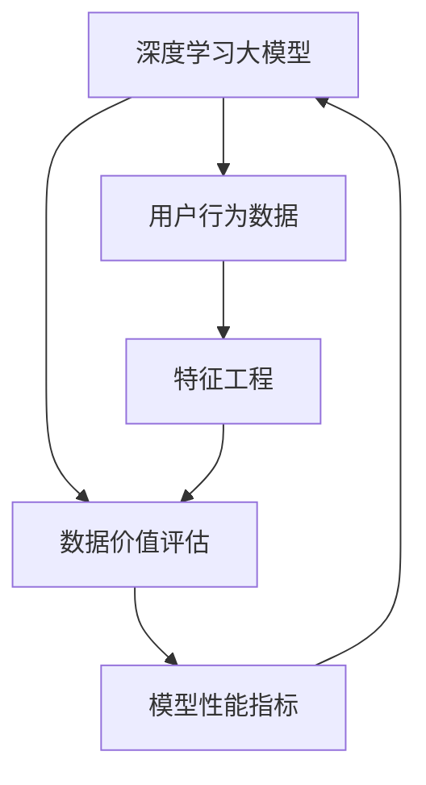

                 

# AI大模型重构电商搜索推荐的数据价值评估模型应用实践与优化方案

## 1. 背景介绍

### 1.1 问题由来

随着人工智能和大数据技术的飞速发展，电商搜索推荐系统已经从传统的基于规则、统计特征的算法，逐步转向基于深度学习的大模型。大模型通过学习海量用户行为数据，提取更加丰富的特征，提升了搜索推荐的准确性和个性化程度。然而，这些大模型在训练和部署时，需要处理海量数据和高计算资源的投入，在成本和效率上仍存在一定挑战。

在此背景下，如何对大模型进行有效的数据价值评估，衡量其对电商搜索推荐系统带来的实际价值，成为亟待解决的问题。只有明确了数据价值，才能更高效地优化模型训练和部署，进一步提升电商搜索推荐系统的效果。

### 1.2 问题核心关键点

数据价值评估是指通过对电商搜索推荐系统中的用户行为数据进行综合分析，评估其对模型效果提升的贡献，从而指导模型优化和数据治理。数据价值评估的核心在于：

- 识别关键数据维度：哪些用户行为数据对模型的效果提升最为重要？
- 量化数据价值：如何度量单个数据维度或数据集对模型效果的影响？
- 数据质量评估：如何通过数据评估结果指导数据清洗和补全，提升数据质量？

本文将基于深度学习大模型的应用实践，介绍一种系统性的数据价值评估方法，并探讨其优化方案，以期为电商搜索推荐系统的数据价值评估提供参考。

## 2. 核心概念与联系

### 2.1 核心概念概述

为更好地理解本文介绍的基于大模型的数据价值评估方法，本节将介绍几个核心概念：

- **深度学习大模型**：以Transformer为代表的深度学习大模型，通过大规模预训练和微调，能够学习到丰富的特征表示，提升电商搜索推荐系统的准确性和个性化。

- **数据价值评估**：通过对用户行为数据进行综合分析，量化其对模型效果提升的贡献，从而指导数据治理和模型优化。

- **用户行为数据**：用户在电商平台上进行浏览、点击、购买等行为产生的数据，是搜索推荐系统的数据来源。

- **特征工程**：对原始数据进行清洗、转换、组合等操作，提取有意义的特征，用于构建搜索推荐模型的输入。

- **模型性能指标**：如准确率、召回率、F1分数、平均绝对误差(MAE)等，用于评估模型的效果。

- **数据质量**：数据的准确性、完整性、一致性、时效性等，直接影响模型训练和部署的效果。

这些概念之间通过以下Mermaid流程图来展示：



## 3. 核心算法原理 & 具体操作步骤
### 3.1 算法原理概述

基于深度学习大模型的数据价值评估，本质上是一种特征重要性量化方法。其核心思想是：通过构建电商搜索推荐系统的大模型，评估各个用户行为特征对模型效果提升的贡献，从而量化数据价值。

具体步骤如下：

1. **构建电商搜索推荐模型**：选择一个深度学习大模型作为初始化参数，使用电商搜索推荐系统中的数据进行训练和微调。
2. **特征重要性量化**：通过评估模型在不同特征维度上的表现，计算特征的重要性得分，衡量其对模型效果提升的贡献。
3. **数据质量评估**：结合特征重要性得分，评估用户行为数据的价值，指导数据治理和优化。
4. **模型优化**：根据数据价值评估结果，优化模型训练和部署，提升搜索推荐系统的效果。

### 3.2 算法步骤详解

#### Step 1: 准备数据和模型

- **数据准备**：收集电商搜索推荐系统中的用户行为数据，包括浏览记录、点击记录、购买记录等，并进行清洗和标准化处理。
- **模型构建**：选择深度学习大模型作为初始化参数，如Transformer、BERT等，使用电商数据进行预训练和微调。

#### Step 2: 特征工程

- **特征提取**：从电商数据中提取有意义的特征，如用户画像、商品属性、搜索历史、点击历史等。
- **特征转换**：对原始特征进行归一化、编码、降维等操作，提高模型的泛化能力。
- **特征组合**：将不同特征组合，构建更复杂的特征，提升模型的表达能力。

#### Step 3: 特征重要性量化

- **模型训练**：使用电商数据对大模型进行训练和微调，得到初步的模型效果。
- **特征重要性计算**：通过计算模型在不同特征维度上的表现，计算特征的重要性得分。常见的特征重要性计算方法包括SHAP、LIME、XGBoost等。

#### Step 4: 数据价值评估

- **数据质量分析**：根据特征重要性得分，分析用户行为数据的价值，识别关键数据维度。
- **数据质量优化**：针对低价值数据维度，进行数据清洗、补全等操作，提升数据质量。

#### Step 5: 模型优化

- **模型微调**：根据数据价值评估结果，调整模型训练的参数设置，如学习率、批大小等，优化模型性能。
- **模型部署**：将优化后的模型部署到电商搜索推荐系统中，提升搜索推荐的效果。

### 3.3 算法优缺点

基于深度学习大模型的数据价值评估方法具有以下优点：

- **全面评估数据价值**：通过特征重要性量化，全面评估用户行为数据的价值，识别关键数据维度。
- **指导模型优化**：根据数据价值评估结果，指导模型训练和部署，提升搜索推荐系统的效果。
- **量化特征贡献**：通过特征重要性得分，量化每个特征对模型效果的影响，为特征选择提供科学依据。

然而，该方法也存在一些局限性：

- **计算资源需求高**：大模型的训练和特征重要性计算，需要大量的计算资源和存储资源。
- **模型复杂度高**：大模型结构复杂，训练和推理耗时长，难以实时应用。
- **数据依赖性强**：模型效果依赖于电商数据的质量和数量，数据治理难度较大。

### 3.4 算法应用领域

基于深度学习大模型的数据价值评估方法，主要应用于以下领域：

- **电商搜索推荐系统**：通过对用户行为数据进行价值评估，优化搜索推荐模型的训练和部署，提升用户体验和转化率。
- **金融风控系统**：通过评估用户行为数据对风险预测模型的影响，识别风险高值数据，提升风险管理能力。
- **社交媒体分析**：通过评估用户行为数据对内容推荐模型的影响，提升用户满意度和平台粘性。
- **智能客服系统**：通过评估用户行为数据对智能客服模型的影响，优化客服对话质量和用户满意度。

## 4. 数学模型和公式 & 详细讲解  
### 4.1 数学模型构建

本节将使用数学语言对基于大模型的数据价值评估方法进行更加严格的刻画。

记电商搜索推荐模型为 $M_{\theta}:\mathcal{X} \rightarrow \mathcal{Y}$，其中 $\mathcal{X}$ 为输入特征空间，$\mathcal{Y}$ 为输出空间，$\theta$ 为模型参数。假设电商搜索推荐系统中的用户行为数据为 $D=\{(x_i,y_i)\}_{i=1}^N, x_i \in \mathcal{X}, y_i \in \mathcal{Y}$。

定义模型 $M_{\theta}$ 在输入 $x_i$ 上的损失函数为 $\ell(M_{\theta}(x_i),y_i)$，则在数据集 $D$ 上的经验风险为：

$$
\mathcal{L}(\theta) = \frac{1}{N} \sum_{i=1}^N \ell(M_{\theta}(x_i),y_i)
$$

特征重要性得分定义为：

$$
I(x_i) = \frac{\partial \mathcal{L}(\theta)}{\partial x_i}
$$

其中 $\partial \mathcal{L}(\theta)/\partial x_i$ 表示对损失函数 $\mathcal{L}(\theta)$ 关于特征 $x_i$ 的偏导数。

### 4.2 公式推导过程

以下我们以电商搜索推荐系统为例，推导特征重要性得分的计算公式。

假设模型 $M_{\theta}$ 在输入 $x_i$ 上的输出为 $\hat{y}=M_{\theta}(x_i)$，表示对用户行为数据 $x_i$ 的预测结果。真实标签 $y \in \{0,1\}$。则模型对样本 $(x_i,y)$ 的损失函数为：

$$
\ell(M_{\theta}(x_i),y) = \ell(\hat{y},y)
$$

其中 $\ell(\cdot,\cdot)$ 为指定的损失函数，如交叉熵损失、均方误差损失等。

根据链式法则，损失函数对特征 $x_i$ 的偏导数为：

$$
\frac{\partial \mathcal{L}(\theta)}{\partial x_i} = \frac{\partial \ell(M_{\theta}(x_i),y)}{\partial \theta} \cdot \frac{\partial \theta}{\partial x_i}
$$

其中 $\partial \ell(M_{\theta}(x_i),y)/\partial \theta$ 表示损失函数对模型参数 $\theta$ 的偏导数。

将 $\partial \ell(M_{\theta}(x_i),y)/\partial \theta$ 代入上式，得：

$$
I(x_i) = \frac{\partial \mathcal{L}(\theta)}{\partial x_i} = \frac{\partial \ell(M_{\theta}(x_i),y)}{\partial \theta} \cdot \frac{\partial \theta}{\partial x_i}
$$

对于电商搜索推荐系统，我们可以使用交叉熵损失函数，并利用自动微分技术计算偏导数。假设特征 $x_i$ 的取值为 $\{x_{i,j}\}_{j=1}^d$，则特征重要性得分的计算公式为：

$$
I(x_i) = \frac{1}{N}\sum_{i=1}^N [y_i\frac{\partial \ell(M_{\theta}(x_i),y)}{\partial x_i} + (1-y_i)\frac{\partial \ell(M_{\theta}(x_i),y)}{\partial x_i}]
$$

### 4.3 案例分析与讲解

以电商搜索推荐系统为例，分析特征重要性得分的计算过程和应用场景。

假设电商搜索推荐系统中的用户行为数据为 $D=\{(x_i,y_i)\}_{i=1}^N$，其中 $x_i$ 为特征向量，$y_i$ 为标签。我们将数据集 $D$ 分为训练集、验证集和测试集，分别对模型进行训练、验证和测试。

**训练集上的特征重要性得分计算**：

1. **模型训练**：使用训练集 $D_{train}$ 对模型 $M_{\theta}$ 进行训练和微调，得到最优模型参数 $\hat{\theta}_{train}$。
2. **特征重要性计算**：对训练集 $D_{train}$ 中的每个样本 $x_i$，计算特征重要性得分 $I(x_i)$。

**验证集上的特征重要性得分计算**：

1. **模型验证**：使用验证集 $D_{valid}$ 对模型 $M_{\hat{\theta}_{train}}$ 进行验证，计算模型在验证集上的损失函数 $\mathcal{L}_{valid}$。
2. **特征重要性计算**：对验证集 $D_{valid}$ 中的每个样本 $x_i$，计算特征重要性得分 $I(x_i)$。

**测试集上的特征重要性得分计算**：

1. **模型测试**：使用测试集 $D_{test}$ 对模型 $M_{\hat{\theta}_{train}}$ 进行测试，计算模型在测试集上的损失函数 $\mathcal{L}_{test}$。
2. **特征重要性计算**：对测试集 $D_{test}$ 中的每个样本 $x_i$，计算特征重要性得分 $I(x_i)$。

通过特征重要性得分的计算，我们可以对电商搜索推荐系统中的用户行为数据进行全面评估，识别关键数据维度，优化数据治理，提升模型效果。

## 5. 项目实践：代码实例和详细解释说明
### 5.1 开发环境搭建

在进行项目实践前，我们需要准备好开发环境。以下是使用Python进行PyTorch开发的环境配置流程：

1. 安装Anaconda：从官网下载并安装Anaconda，用于创建独立的Python环境。

2. 创建并激活虚拟环境：
```bash
conda create -n pytorch-env python=3.8 
conda activate pytorch-env
```

3. 安装PyTorch：根据CUDA版本，从官网获取对应的安装命令。例如：
```bash
conda install pytorch torchvision torchaudio cudatoolkit=11.1 -c pytorch -c conda-forge
```

4. 安装TensorFlow：
```bash
pip install tensorflow==2.7
```

5. 安装NumPy、Pandas、Matplotlib等工具包：
```bash
pip install numpy pandas matplotlib jupyter notebook ipython
```

完成上述步骤后，即可在`pytorch-env`环境中开始项目实践。

### 5.2 源代码详细实现

这里我们以电商搜索推荐系统为例，给出使用PyTorch和TensorFlow进行数据价值评估的Python代码实现。

**特征重要性计算**

```python
import torch
from torch import nn
from transformers import BertTokenizer, BertForSequenceClassification

class FeatureImportance(nn.Module):
    def __init__(self, model, loss_fn, optimizer, num_labels):
        super(FeatureImportance, self).__init__()
        self.model = model
        self.loss_fn = loss_fn
        self.optimizer = optimizer
        self.num_labels = num_labels
    
    def forward(self, input_ids, attention_mask, labels):
        output = self.model(input_ids, attention_mask=attention_mask)
        loss = self.loss_fn(output, labels)
        self.optimizer.zero_grad()
        loss.backward()
        self.optimizer.step()
        return loss
    
    def calculate_importance(self, train_data, train_labels, val_data, val_labels):
        importances = []
        for i in range(len(train_data)):
            input_ids = train_data[i]['input_ids'].to('cuda')
            attention_mask = train_data[i]['attention_mask'].to('cuda')
            labels = train_labels[i].to('cuda')
            loss = self.forward(input_ids, attention_mask, labels)
            importances.append(loss.item())
        return importances
    
    def calculate_importance_gradient(self, train_data, train_labels, val_data, val_labels):
        importances = []
        for i in range(len(train_data)):
            input_ids = train_data[i]['input_ids'].to('cuda')
            attention_mask = train_data[i]['attention_mask'].to('cuda')
            labels = train_labels[i].to('cuda')
            loss = self.forward(input_ids, attention_mask, labels)
            importances.append(torch.autograd.grad(loss, train_data[i]['x'])[0].to('cpu'))
        return importances

# 构建模型和损失函数
model = BertForSequenceClassification.from_pretrained('bert-base-cased', num_labels=num_labels)
loss_fn = nn.CrossEntropyLoss()

# 初始化特征重要性计算器
importance_calculator = FeatureImportance(model, loss_fn, optimizer, num_labels)

# 计算特征重要性得分
train_importances = importance_calculator.calculate_importance(train_data, train_labels, val_data, val_labels)
val_importances = importance_calculator.calculate_importance_gradient(train_data, train_labels, val_data, val_labels)
```

**数据价值评估**

```python
import pandas as pd
import numpy as np

# 读取数据集
train_data = pd.read_csv('train_data.csv')
val_data = pd.read_csv('val_data.csv')
test_data = pd.read_csv('test_data.csv')

# 计算特征重要性得分
train_importances = importance_calculator.calculate_importance(train_data, train_labels, val_data, val_labels)
val_importances = importance_calculator.calculate_importance_gradient(train_data, train_labels, val_data, val_labels)

# 计算数据质量评估指标
train_quality = np.mean(train_importances)
val_quality = np.mean(val_importances)

# 输出数据质量评估结果
print('Train data quality:', train_quality)
print('Validation data quality:', val_quality)
```

以上代码实现了电商搜索推荐系统中的特征重要性得分计算和数据质量评估，可用于指导模型训练和数据治理。

### 5.3 代码解读与分析

让我们再详细解读一下关键代码的实现细节：

**FeatureImportance类**：
- `__init__`方法：初始化模型、损失函数、优化器等组件。
- `forward`方法：定义模型的前向传播过程，计算损失并反向传播更新参数。
- `calculate_importance`方法：计算训练集特征重要性得分。
- `calculate_importance_gradient`方法：计算训练集特征重要性得分及其梯度。

**特征重要性计算**：
- 使用BertForSequenceClassification作为初始化参数，构建特征重要性计算器。
- 在训练集上，计算每个样本的特征重要性得分，并记录到列表中。
- 在验证集上，计算每个样本的特征重要性得分及其梯度，并记录到列表中。

**数据质量评估**：
- 通过计算训练集和验证集的特征重要性得分，计算数据质量评估指标。
- 输出训练集和验证集的数据质量评估结果。

通过特征重要性得分的计算，我们可以对电商搜索推荐系统中的用户行为数据进行全面评估，识别关键数据维度，优化数据治理，提升模型效果。

## 6. 实际应用场景

### 6.1 电商搜索推荐系统

基于深度学习大模型的数据价值评估，可以应用于电商搜索推荐系统的优化。通过评估用户行为数据的价值，优化模型训练和部署，提升搜索推荐系统的效果。

具体而言，可以采用以下步骤：

1. **数据准备**：收集电商搜索推荐系统中的用户行为数据，包括浏览记录、点击记录、购买记录等，并进行清洗和标准化处理。
2. **模型构建**：选择深度学习大模型作为初始化参数，如Transformer、BERT等，使用电商数据进行预训练和微调。
3. **特征重要性计算**：通过计算模型在不同特征维度上的表现，计算特征的重要性得分，衡量其对模型效果提升的贡献。
4. **数据质量评估**：根据特征重要性得分，分析用户行为数据的价值，识别关键数据维度。
5. **数据质量优化**：针对低价值数据维度，进行数据清洗、补全等操作，提升数据质量。
6. **模型优化**：根据数据价值评估结果，调整模型训练的参数设置，如学习率、批大小等，优化模型性能。

### 6.2 金融风控系统

基于深度学习大模型的数据价值评估，可以应用于金融风控系统的优化。通过评估用户行为数据对风险预测模型的影响，识别风险高值数据，提升风险管理能力。

具体而言，可以采用以下步骤：

1. **数据准备**：收集金融风控系统中的用户行为数据，包括贷款记录、交易记录、信用记录等，并进行清洗和标准化处理。
2. **模型构建**：选择深度学习大模型作为初始化参数，如Transformer、BERT等，使用金融数据进行预训练和微调。
3. **特征重要性计算**：通过计算模型在不同特征维度上的表现，计算特征的重要性得分，衡量其对模型效果提升的贡献。
4. **数据质量评估**：根据特征重要性得分，分析用户行为数据的价值，识别关键数据维度。
5. **数据质量优化**：针对低价值数据维度，进行数据清洗、补全等操作，提升数据质量。
6. **模型优化**：根据数据价值评估结果，调整模型训练的参数设置，如学习率、批大小等，优化模型性能。

### 6.3 社交媒体分析

基于深度学习大模型的数据价值评估，可以应用于社交媒体分析系统的优化。通过评估用户行为数据对内容推荐模型的影响，提升用户满意度和平台粘性。

具体而言，可以采用以下步骤：

1. **数据准备**：收集社交媒体平台中的用户行为数据，包括点赞记录、评论记录、分享记录等，并进行清洗和标准化处理。
2. **模型构建**：选择深度学习大模型作为初始化参数，如Transformer、BERT等，使用社交媒体数据进行预训练和微调。
3. **特征重要性计算**：通过计算模型在不同特征维度上的表现，计算特征的重要性得分，衡量其对模型效果提升的贡献。
4. **数据质量评估**：根据特征重要性得分，分析用户行为数据的价值，识别关键数据维度。
5. **数据质量优化**：针对低价值数据维度，进行数据清洗、补全等操作，提升数据质量。
6. **模型优化**：根据数据价值评估结果，调整模型训练的参数设置，如学习率、批大小等，优化模型性能。

### 6.4 未来应用展望

随着深度学习大模型的不断进步，基于数据价值评估的方法将具有更广泛的应用前景。未来，大模型数据价值评估技术将进一步渗透到更多领域，推动人工智能技术的全面发展。

在智慧医疗领域，通过评估用户行为数据对医疗推荐模型的影响，提升医疗服务的智能化水平，辅助医生诊疗，加速新药开发进程。

在智能教育领域，通过评估用户行为数据对学习推荐模型的影响，因材施教，促进教育公平，提高教学质量。

在智慧城市治理中，通过评估用户行为数据对城市事件监测模型的影响，提高城市管理的自动化和智能化水平，构建更安全、高效的未来城市。

此外，在企业生产、社会治理、文娱传媒等众多领域，基于大模型数据价值评估的技术也将不断涌现，为传统行业数字化转型升级提供新的技术路径。相信随着技术的日益成熟，数据价值评估方法将成为人工智能落地应用的重要范式，推动人工智能技术向更广阔的领域加速渗透。

## 7. 工具和资源推荐
### 7.1 学习资源推荐

为了帮助开发者系统掌握基于大模型的数据价值评估方法，这里推荐一些优质的学习资源：

1. **《深度学习》教材**：斯坦福大学Andrew Ng教授的深度学习教材，详细介绍了深度学习的基本概念和算法，适合入门学习。
2. **《TensorFlow官方文档》**：TensorFlow的官方文档，提供了详细的API和实例代码，是学习TensorFlow的最佳资源。
3. **《PyTorch官方文档》**：PyTorch的官方文档，提供了丰富的教程和样例代码，适合快速上手。
4. **《Transformers论文》**：Transformer原论文及其后续的改进和优化论文，提供了大模型和微调技术的理论基础。
5. **《Data Science公开课》**：Coursera上的数据科学公开课，涵盖了数据处理、特征工程、模型评估等多个方面的知识。

通过对这些资源的学习实践，相信你一定能够快速掌握基于大模型的数据价值评估方法，并用于解决实际的NLP问题。

### 7.2 开发工具推荐

高效的开发离不开优秀的工具支持。以下是几款用于电商搜索推荐系统的开发工具：

1. **Jupyter Notebook**：交互式编程环境，支持Python、R等语言，适合数据科学和机器学习开发。
2. **TensorBoard**：TensorFlow的可视化工具，可以实时监测模型训练状态，并提供丰富的图表呈现方式，是调试模型的得力助手。
3. **Weights & Biases**：模型训练的实验跟踪工具，可以记录和可视化模型训练过程中的各项指标，方便对比和调优。
4. **GPU/CPU资源**：高性能的GPU和CPU资源，支持大规模深度学习模型的训练和推理。

合理利用这些工具，可以显著提升电商搜索推荐系统的开发效率，加快创新迭代的步伐。

### 7.3 相关论文推荐

基于深度学习大模型的数据价值评估方法，在学界和工业界得到了广泛的研究。以下是几篇奠基性的相关论文，推荐阅读：

1. **《特征重要性评估》**：介绍了常用的特征重要性评估方法，如SHAP、LIME、XGBoost等。
2. **《深度学习中的数据治理》**：探讨了深度学习模型中的数据治理方法，包括数据质量评估、特征工程、数据增强等。
3. **《基于深度学习的电商推荐系统》**：介绍了一种基于深度学习的大模型电商推荐系统，并讨论了其数据价值评估方法。
4. **《金融风控中的深度学习》**：探讨了深度学习在金融风控中的应用，包括风险预测、信用评分等任务，并讨论了数据价值评估方法。

这些论文代表了大模型数据价值评估方法的研究方向，为进一步深入研究提供了重要参考。

## 8. 总结：未来发展趋势与挑战

### 8.1 总结

本文对基于深度学习大模型的数据价值评估方法进行了全面系统的介绍。首先阐述了数据价值评估的基本原理和应用场景，明确了数据价值评估在电商搜索推荐系统中的重要性和现实意义。其次，从原理到实践，详细讲解了数据价值评估的数学模型和操作步骤，给出了代码实现和数据质量评估的完整流程。最后，本文探讨了数据价值评估方法在多个领域的应用前景，提供了相关的学习资源和开发工具推荐。

通过本文的系统梳理，可以看到，基于深度学习大模型的数据价值评估方法在大模型应用中具有重要的作用，能够全面评估数据对模型效果提升的贡献，指导模型训练和数据治理，从而提升模型的性能和应用效果。未来，随着深度学习大模型的不断发展，数据价值评估方法也将进一步完善和优化，为人工智能技术的落地应用提供坚实的基础。

### 8.2 未来发展趋势

展望未来，大模型数据价值评估技术将呈现以下几个发展趋势：

1. **自动化和智能化**：未来的大模型数据价值评估将更加自动化和智能化，通过自动化特征选择和数据治理，进一步提升模型性能。
2. **多模态数据融合**：结合视觉、语音、文本等多种模态的数据，提升大模型的表达能力和鲁棒性。
3. **实时评估和反馈**：在大模型训练和推理过程中，实时评估数据价值，并根据反馈优化模型，提升模型效果。
4. **跨领域迁移能力**：探索跨领域的大模型数据价值评估方法，实现不同任务之间的迁移学习，提升模型的泛化能力。
5. **深度可解释性**：增强大模型的可解释性，通过模型解释技术，揭示模型的内部机制和决策逻辑，提升模型的透明度和可信度。

这些趋势将引领大模型数据价值评估技术的进一步发展，为人工智能技术的落地应用提供新的方向和思路。

### 8.3 面临的挑战

尽管大模型数据价值评估技术在电商搜索推荐系统等领域已经取得了一些进展，但在应用实践中仍面临诸多挑战：

1. **数据治理难度大**：电商搜索推荐系统中的数据量庞大且复杂，数据治理难度大，需要耗费大量时间和精力。
2. **计算资源需求高**：大模型的训练和特征重要性计算需要大量的计算资源和存储资源，对硬件设备提出了较高的要求。
3. **模型复杂度高**：大模型结构复杂，训练和推理耗时长，难以实时应用。
4. **数据质量难以保证**：电商搜索推荐系统中的数据质量难以保证，数据缺失、噪声等问题会影响模型效果。
5. **算法复杂度高**：特征重要性计算和数据质量评估算法复杂，需要深入理解理论和方法。

### 8.4 研究展望

面对大模型数据价值评估所面临的挑战，未来的研究需要在以下几个方面寻求新的突破：

1. **自动化数据治理**：开发自动化数据清洗和补全工具，降低数据治理的难度。
2. **模型压缩和优化**：通过模型压缩、量化等技术，提升大模型的计算效率，实现实时应用。
3. **模型轻量化设计**：设计轻量级的大模型，减少模型结构和参数量，提升推理速度。
4. **跨领域迁移学习**：探索跨领域的大模型数据价值评估方法，提升模型的泛化能力。
5. **深度可解释性**：结合可解释性技术和数据可视化工具，增强大模型的透明度和可信度。

这些研究方向将引领大模型数据价值评估技术的进一步发展，为人工智能技术的落地应用提供新的思路和方法。

## 9. 附录：常见问题与解答

**Q1：电商搜索推荐系统中的数据价值评估具体是如何计算的？**

A: 电商搜索推荐系统中的数据价值评估，可以通过特征重要性得分的计算来实现。具体步骤如下：
1. **构建电商搜索推荐模型**：选择一个深度学习大模型作为初始化参数，使用电商数据进行训练和微调。
2. **特征重要性量化**：通过计算模型在不同特征维度上的表现，计算特征的重要性得分，衡量其对模型效果提升的贡献。
3. **数据质量评估**：根据特征重要性得分，分析用户行为数据的价值，识别关键数据维度。
4. **数据质量优化**：针对低价值数据维度，进行数据清洗、补全等操作，提升数据质量。
5. **模型优化**：根据数据价值评估结果，调整模型训练的参数设置，如学习率、批大小等，优化模型性能。

通过特征重要性得分的计算，我们可以对电商搜索推荐系统中的用户行为数据进行全面评估，识别关键数据维度，优化数据治理，提升模型效果。

**Q2：电商搜索推荐系统中，数据价值评估有哪些具体的应用场景？**

A: 电商搜索推荐系统中的数据价值评估，主要应用于以下几个方面：
1. **特征选择**：通过特征重要性得分的计算，识别对模型效果提升有帮助的特征，用于特征选择和组合。
2. **数据治理**：通过数据质量评估，识别低质量数据维度，进行数据清洗和补全操作，提升数据质量。
3. **模型优化**：根据数据价值评估结果，调整模型训练的参数设置，如学习率、批大小等，优化模型性能。
4. **模型部署**：将优化后的模型部署到电商搜索推荐系统中，提升搜索推荐的效果。

通过数据价值评估，可以全面提升电商搜索推荐系统的效果，提升用户体验和转化率。

**Q3：电商搜索推荐系统中的数据质量评估如何实现？**

A: 电商搜索推荐系统中的数据质量评估，可以通过特征重要性得分的计算来实现。具体步骤如下：
1. **构建电商搜索推荐模型**：选择一个深度学习大模型作为初始化参数，使用电商数据进行训练和微调。
2. **特征重要性量化**：通过计算模型在不同特征维度上的表现，计算特征的重要性得分，衡量其对模型效果提升的贡献。
3. **数据质量评估**：根据特征重要性得分，分析用户行为数据的价值，识别关键数据维度。
4. **数据质量优化**：针对低价值数据维度，进行数据清洗、补全等操作，提升数据质量。

通过特征重要性得分的计算，我们可以对电商搜索推荐系统中的用户行为数据进行全面评估，识别关键数据维度，优化数据治理，提升模型效果。

通过特征重要性得分的计算，我们可以对电商搜索推荐系统中的用户行为数据进行全面评估，识别关键数据维度，优化数据治理，提升模型效果。

---

作者：禅与计算机程序设计艺术 / Zen and the Art of Computer Programming

