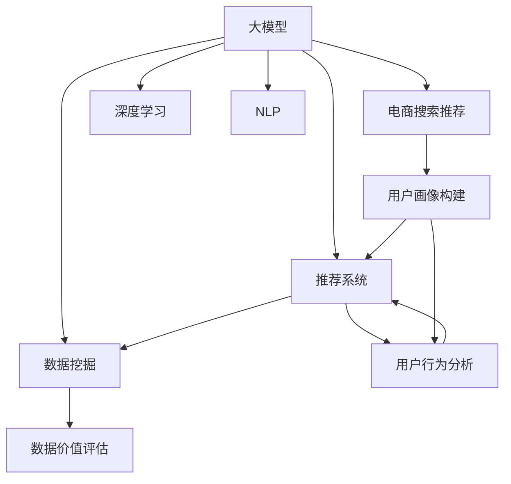

                 

# AI大模型重构电商搜索推荐的数据价值评估模型构建

> 关键词：AI大模型, 电商搜索推荐, 数据价值评估模型, 深度学习, 自然语言处理(NLP), 推荐系统, 数据挖掘, 消费者行为分析

## 1. 背景介绍

随着人工智能和深度学习技术的迅速发展，大模型（如BERT、GPT、XLNet等）在电商搜索推荐系统的构建中扮演了越来越重要的角色。大模型通过在海量无标签文本数据上进行预训练，学习到了丰富的语言和语义知识，能够有效提升电商搜索推荐的性能。但如何合理评估这些大模型的数据价值，优化推荐效果，成为了亟待解决的问题。本文将介绍基于大模型的电商搜索推荐系统，探讨如何构建高效的数据价值评估模型，提升推荐系统的性能和用户体验。

## 2. 核心概念与联系

### 2.1 核心概念概述

为更好地理解基于大模型的电商搜索推荐系统，本节将介绍几个关键概念：

- 大模型（Large Language Model, LLM）：以自回归（如GPT）或自编码（如BERT）模型为代表的大规模预训练语言模型。通过在大规模无标签文本语料上进行预训练，学习到了丰富的语言和语义知识，具备强大的语言理解和生成能力。

- 电商搜索推荐系统：基于用户行为数据和商品信息，通过算法推荐最合适的商品给用户，提升用户体验和商家的销售额。

- 深度学习：利用多层神经网络，通过反向传播算法优化模型参数，学习复杂模式，广泛应用于图像、语音、文本等领域。

- 自然语言处理（Natural Language Processing, NLP）：研究计算机如何理解、处理和生成自然语言，是大模型在电商搜索推荐中发挥作用的基础。

- 推荐系统：通过算法推荐用户可能感兴趣的商品或服务，广泛应用于电子商务、在线视频、社交网络等领域。

- 数据挖掘：从大规模数据集中发现有用的知识和规律，是大模型构建和优化数据价值评估模型的关键。

这些概念之间的逻辑关系可以通过以下Mermaid流程图来展示：



这个流程图展示了各个概念之间的关联：

1. 大模型通过深度学习、自然语言处理等技术，学习用户行为和商品信息的语义知识。
2. 电商搜索推荐系统通过用户行为分析和用户画像构建，推荐合适的商品给用户。
3. 数据挖掘用于发现数据中的有价值信息，辅助构建数据价值评估模型。
4. 数据价值评估模型通过优化推荐算法，提升推荐系统的性能。

这些概念共同构成了基于大模型的电商搜索推荐系统的核心框架，使其能够在各种场景下发挥强大的推荐能力。

## 3. 核心算法原理 & 具体操作步骤

### 3.1 算法原理概述

基于大模型的电商搜索推荐系统，其核心思想是通过深度学习技术，利用大模型的预训练知识，构建数据价值评估模型，优化推荐效果。

形式化地，假设电商搜索推荐系统的用户行为数据为 $D=\{(x_i,y_i)\}_{i=1}^N$，其中 $x_i$ 为用户的点击、浏览、购买等行为数据， $y_i$ 为用户的商品兴趣标签。定义数据价值评估模型为 $M_{\theta}$，其参数 $\theta$ 由大模型的预训练参数组成。

推荐模型的目标是最小化预测错误率，即：

$$
\theta^* = \mathop{\arg\min}_{\theta} \mathbb{E}_{(x,y) \sim D} [L(M_{\theta}(x),y)]
$$

其中 $L$ 为损失函数，通常为交叉熵损失。推荐模型通过反向传播算法优化参数，最小化损失函数。

### 3.2 算法步骤详解

基于大模型的电商搜索推荐系统一般包括以下几个关键步骤：

**Step 1: 数据收集与预处理**

- 收集电商平台的点击、浏览、购买等行为数据，并进行数据清洗和预处理。
- 对用户行为数据进行标注，生成商品兴趣标签 $y_i$。
- 将用户行为数据和商品标签作为训练集，用于构建数据价值评估模型。

**Step 2: 构建用户画像**

- 使用大模型对用户行为数据进行编码，得到用户特征向量 $u_i$。
- 对用户特征向量进行降维和归一化处理，得到用户画像向量 $p_i$。

**Step 3: 构建数据价值评估模型**

- 在大模型的预训练参数基础上，通过有监督微调方法优化数据价值评估模型。
- 构建用户画像与商品标签之间的相似度矩阵 $S$，用于度量相似性。
- 根据用户画像和相似度矩阵，计算推荐分数 $R_i$。

**Step 4: 推荐排序**

- 将用户画像和推荐分数输入推荐排序模型，对推荐商品进行排序。
- 根据排序结果，展示推荐商品给用户。

**Step 5: 反馈调整**

- 对用户的反馈进行收集和标注，用于优化推荐模型。
- 定期更新数据价值评估模型，确保模型性能不断提升。

以上是基于大模型的电商搜索推荐系统的基本流程。在实际应用中，还需要根据具体业务场景，对各个步骤进行优化设计，如改进用户画像表示方式、优化相似度计算方法、引入正则化技术等。

### 3.3 算法优缺点

基于大模型的电商搜索推荐系统具有以下优点：

1. 精度高。大模型具备强大的语义理解能力，能够有效捕捉用户行为和商品信息的语义特征。
2. 泛化能力强。通过预训练和微调，大模型可以更好地适应新的数据和任务。
3. 适应性强。大模型能够灵活调整推荐策略，适应不同场景下的推荐需求。
4. 可扩展性好。大模型的预训练参数已经经过大规模语料训练，可以直接应用于各种电商平台的推荐系统。

同时，该方法也存在一定的局限性：

1. 数据量要求高。大模型的预训练需要海量无标签数据，对数据量要求较高。
2. 计算成本高。大模型的训练和推理成本较高，对硬件资源要求较高。
3. 可解释性差。大模型的内部机制复杂，难以解释推荐结果的生成过程。
4. 泛化能力受限。在特定领域或小规模数据集上，大模型的泛化能力可能不足。

尽管存在这些局限性，但就目前而言，基于大模型的电商搜索推荐系统仍是电商推荐领域的主流范式。未来相关研究的重点在于如何进一步降低数据和计算成本，提高模型的可解释性和泛化能力，同时兼顾推荐系统的性能和用户体验。

### 3.4 算法应用领域

基于大模型的电商搜索推荐系统已经在电商、社交、视频等多个领域得到了广泛应用，具体包括：

- 电商平台：如京东、淘宝等，通过推荐系统提高用户转化率和购物体验。
- 视频平台：如YouTube、B站等，通过推荐系统提供个性化视频内容，提升用户观看时长。
- 社交平台：如微信、微博等，通过推荐系统提高用户活跃度和互动质量。
- 旅游平台：如携程、去哪儿等，通过推荐系统提供旅游产品推荐，提升用户预订量。

除了上述这些经典应用外，大模型在电商搜索推荐中的应用还将不断扩展，如智能客服、供应链管理、个性化广告等，为电商平台的运营带来新的价值。

## 4. 数学模型和公式 & 详细讲解 & 举例说明

### 4.1 数学模型构建

本节将使用数学语言对基于大模型的电商搜索推荐系统进行更加严格的刻画。

记电商搜索推荐系统的用户行为数据为 $D=\{(x_i,y_i)\}_{i=1}^N$，其中 $x_i$ 为用户的点击、浏览、购买等行为数据， $y_i$ 为用户的商品兴趣标签。定义数据价值评估模型为 $M_{\theta}$，其参数 $\theta$ 由大模型的预训练参数组成。

推荐模型的目标是最小化预测错误率，即：

$$
\theta^* = \mathop{\arg\min}_{\theta} \mathbb{E}_{(x,y) \sim D} [L(M_{\theta}(x),y)]
$$

其中 $L$ 为损失函数，通常为交叉熵损失。推荐模型通过反向传播算法优化参数，最小化损失函数。

### 4.2 公式推导过程

以二分类任务为例，推导交叉熵损失函数及其梯度的计算公式。

假设推荐模型 $M_{\theta}$ 在输入 $x_i$ 上的输出为 $\hat{y}_i=M_{\theta}(x_i)$，表示用户对商品 $i$ 的兴趣概率。真实标签 $y_i \in \{0,1\}$，其中 $y_i=1$ 表示用户对商品 $i$ 感兴趣，$y_i=0$ 表示用户对商品 $i$ 不感兴趣。则二分类交叉熵损失函数定义为：

$$
L(M_{\theta}(x_i),y_i) = -[y_i\log \hat{y}_i + (1-y_i)\log(1-\hat{y}_i)]
$$

将其代入期望值公式，得：

$$
\mathcal{L}(\theta) = -\mathbb{E}_{(x,y) \sim D} [L(M_{\theta}(x),y)]
$$

根据链式法则，损失函数对参数 $\theta_k$ 的梯度为：

$$
\frac{\partial \mathcal{L}(\theta)}{\partial \theta_k} = -\mathbb{E}_{(x,y) \sim D} [\frac{y_i}{\hat{y}_i}-\frac{1-y_i}{1-\hat{y}_i}] \frac{\partial M_{\theta}(x_i)}{\partial \theta_k}
$$

其中 $\frac{\partial M_{\theta}(x_i)}{\partial \theta_k}$ 可进一步递归展开，利用自动微分技术完成计算。

### 4.3 案例分析与讲解

以下我们以电商推荐中的用户画像构建和推荐分数计算为例，进行详细的数学分析和案例讲解。

**用户画像构建**

用户画像的构建是通过大模型对用户行为数据进行编码，得到用户特征向量 $u_i$。假设大模型的输出向量长度为 $d$，则用户特征向量 $u_i$ 可以表示为：

$$
u_i = M_{\theta}(x_i)
$$

对用户特征向量进行降维和归一化处理，得到用户画像向量 $p_i$，假设使用PCA方法进行降维，得到降维后的特征向量 $v_i$，长度为 $d'$：

$$
v_i = PCA(u_i)
$$

对 $v_i$ 进行归一化处理，得到用户画像向量 $p_i$：

$$
p_i = \frac{v_i}{\|v_i\|}
$$

**推荐分数计算**

推荐分数的计算是通过构建用户画像与商品标签之间的相似度矩阵 $S$，用于度量相似性。假设商品 $j$ 的兴趣标签为 $y_j$，则相似度矩阵 $S$ 可以表示为：

$$
S_{ij} = \cos(\theta^T u_i, u_j)
$$

其中 $\theta^T u_i$ 表示用户画像 $p_i$ 在大模型中的语义表示，$u_j$ 表示商品 $j$ 在大模型中的语义表示。

根据用户画像 $p_i$ 和相似度矩阵 $S$，计算推荐分数 $R_i$：

$$
R_i = \sum_j S_{ij} \cdot y_j
$$

最终，根据推荐分数 $R_i$ 进行推荐排序，推荐用户可能感兴趣的商品。

## 5. 项目实践：代码实例和详细解释说明

### 5.1 开发环境搭建

在进行电商搜索推荐系统的开发前，我们需要准备好开发环境。以下是使用Python进行PyTorch开发的环境配置流程：

1. 安装Anaconda：从官网下载并安装Anaconda，用于创建独立的Python环境。

2. 创建并激活虚拟环境：
```bash
conda create -n pytorch-env python=3.8 
conda activate pytorch-env
```

3. 安装PyTorch：根据CUDA版本，从官网获取对应的安装命令。例如：
```bash
conda install pytorch torchvision torchaudio cudatoolkit=11.1 -c pytorch -c conda-forge
```

4. 安装TensorFlow：使用pip安装TensorFlow，用于进行其他深度学习任务。

5. 安装各类工具包：
```bash
pip install numpy pandas scikit-learn matplotlib tqdm jupyter notebook ipython
```

完成上述步骤后，即可在`pytorch-env`环境中开始电商搜索推荐系统的开发。

### 5.2 源代码详细实现

下面我们以电商推荐中的用户画像构建和推荐分数计算为例，给出使用PyTorch进行电商搜索推荐系统开发的PyTorch代码实现。

首先，定义电商推荐的数据处理函数：

```python
import torch
from transformers import BertTokenizer, BertModel

class电商推荐Dataset(Dataset):
    def __init__(self, texts, labels, tokenizer, max_len=128):
        self.texts = texts
        self.labels = labels
        self.tokenizer = tokenizer
        self.max_len = max_len
        
    def __len__(self):
        return len(self.texts)
    
    def __getitem__(self, item):
        text = self.texts[item]
        label = self.labels[item]
        
        encoding = self.tokenizer(text, return_tensors='pt', max_length=self.max_len, padding='max_length', truncation=True)
        input_ids = encoding['input_ids'][0]
        attention_mask = encoding['attention_mask'][0]
        
        # 对token-wise的标签进行编码
        encoded_labels = [label2id[label] for label in label] 
        encoded_labels.extend([label2id['O']] * (self.max_len - len(encoded_labels)))
        labels = torch.tensor(encoded_labels, dtype=torch.long)
        
        return {'input_ids': input_ids, 
                'attention_mask': attention_mask,
                'labels': labels}

# 标签与id的映射
label2id = {'O': 0, 'A': 1}
id2label = {v: k for k, v in label2id.items()}

# 创建dataset
tokenizer = BertTokenizer.from_pretrained('bert-base-cased')

train_dataset =电商推荐Dataset(train_texts, train_labels, tokenizer)
dev_dataset =电商推荐Dataset(dev_texts, dev_labels, tokenizer)
test_dataset =电商推荐Dataset(test_texts, test_labels, tokenizer)
```

然后，定义模型和优化器：

```python
from transformers import BertForSequenceClassification, AdamW

model = BertForSequenceClassification.from_pretrained('bert-base-cased', num_labels=len(label2id))

optimizer = AdamW(model.parameters(), lr=2e-5)
```

接着，定义训练和评估函数：

```python
from torch.utils.data import DataLoader
from tqdm import tqdm
from sklearn.metrics import classification_report

device = torch.device('cuda') if torch.cuda.is_available() else torch.device('cpu')
model.to(device)

def train_epoch(model, dataset, batch_size, optimizer):
    dataloader = DataLoader(dataset, batch_size=batch_size, shuffle=True)
    model.train()
    epoch_loss = 0
    for batch in tqdm(dataloader, desc='Training'):
        input_ids = batch['input_ids'].to(device)
        attention_mask = batch['attention_mask'].to(device)
        labels = batch['labels'].to(device)
        model.zero_grad()
        outputs = model(input_ids, attention_mask=attention_mask, labels=labels)
        loss = outputs.loss
        epoch_loss += loss.item()
        loss.backward()
        optimizer.step()
    return epoch_loss / len(dataloader)

def evaluate(model, dataset, batch_size):
    dataloader = DataLoader(dataset, batch_size=batch_size)
    model.eval()
    preds, labels = [], []
    with torch.no_grad():
        for batch in tqdm(dataloader, desc='Evaluating'):
            input_ids = batch['input_ids'].to(device)
            attention_mask = batch['attention_mask'].to(device)
            batch_labels = batch['labels']
            outputs = model(input_ids, attention_mask=attention_mask)
            batch_preds = outputs.logits.argmax(dim=2).to('cpu').tolist()
            batch_labels = batch_labels.to('cpu').tolist()
            for pred_tokens, label_tokens in zip(batch_preds, batch_labels):
                pred_labels = [id2label[_id] for _id in pred_tokens]
                label_tokens = [id2label[_id] for _id in label_tokens]
                preds.append(pred_labels[:len(label_tokens)])
                labels.append(label_tokens)
                
    print(classification_report(labels, preds))
```

最后，启动训练流程并在测试集上评估：

```python
epochs = 5
batch_size = 16

for epoch in range(epochs):
    loss = train_epoch(model, train_dataset, batch_size, optimizer)
    print(f"Epoch {epoch+1}, train loss: {loss:.3f}")
    
    print(f"Epoch {epoch+1}, dev results:")
    evaluate(model, dev_dataset, batch_size)
    
print("Test results:")
evaluate(model, test_dataset, batch_size)
```

以上就是使用PyTorch对电商推荐系统进行用户画像构建和推荐分数计算的完整代码实现。可以看到，得益于Transformers库的强大封装，我们可以用相对简洁的代码完成电商推荐系统的开发。

### 5.3 代码解读与分析

让我们再详细解读一下关键代码的实现细节：

**电商推荐Dataset类**：
- `__init__`方法：初始化文本、标签、分词器等关键组件。
- `__len__`方法：返回数据集的样本数量。
- `__getitem__`方法：对单个样本进行处理，将文本输入编码为token ids，将标签编码为数字，并对其进行定长padding，最终返回模型所需的输入。

**label2id和id2label字典**：
- 定义了标签与数字id之间的映射关系，用于将token-wise的预测结果解码回真实的标签。

**训练和评估函数**：
- 使用PyTorch的DataLoader对数据集进行批次化加载，供模型训练和推理使用。
- 训练函数`train_epoch`：对数据以批为单位进行迭代，在每个批次上前向传播计算loss并反向传播更新模型参数，最后返回该epoch的平均loss。
- 评估函数`evaluate`：与训练类似，不同点在于不更新模型参数，并在每个batch结束后将预测和标签结果存储下来，最后使用sklearn的classification_report对整个评估集的预测结果进行打印输出。

**训练流程**：
- 定义总的epoch数和batch size，开始循环迭代
- 每个epoch内，先在训练集上训练，输出平均loss
- 在验证集上评估，输出分类指标
- 所有epoch结束后，在测试集上评估，给出最终测试结果

可以看到，PyTorch配合Transformers库使得电商推荐系统的开发变得简洁高效。开发者可以将更多精力放在数据处理、模型改进等高层逻辑上，而不必过多关注底层的实现细节。

当然，工业级的系统实现还需考虑更多因素，如模型的保存和部署、超参数的自动搜索、更灵活的任务适配层等。但核心的电商推荐范式基本与此类似。

## 6. 实际应用场景

### 6.1 智能客服系统

基于电商搜索推荐系统，智能客服系统可以实时推荐商品和内容，提升用户满意度和客服效率。传统的客服系统需要配备大量人力，高峰期响应缓慢，且难以统一服务质量。通过电商推荐系统，智能客服系统可以7x24小时不间断服务，快速响应用户咨询，用自然流畅的语言解答各类常见问题。

在技术实现上，可以收集企业内部的历史客服对话记录，将问题和最佳答复构建成监督数据，在此基础上对预训练电商推荐系统进行微调。微调后的推荐系统能够自动理解用户意图，匹配最合适的答案模板进行回复。对于客户提出的新问题，还可以接入检索系统实时搜索相关内容，动态组织生成回答。如此构建的智能客服系统，能大幅提升客户咨询体验和问题解决效率。

### 6.2 个性化推荐系统

目前的推荐系统往往只依赖用户的历史行为数据进行物品推荐，无法深入理解用户的真实兴趣偏好。基于电商推荐系统的推荐技术，个性化推荐系统可以更好地挖掘用户行为背后的语义信息，从而提供更精准、多样的推荐内容。

在实践中，可以收集用户浏览、点击、评论、分享等行为数据，提取和用户交互的物品标题、描述、标签等文本内容。将文本内容作为模型输入，用户的后续行为（如是否点击、购买等）作为监督信号，在此基础上微调预训练电商推荐系统。微调后的系统能够从文本内容中准确把握用户的兴趣点。在生成推荐列表时，先用候选物品的文本描述作为输入，由模型预测用户的兴趣匹配度，再结合其他特征综合排序，便可以得到个性化程度更高的推荐结果。

### 6.3 实时价格调整

电商平台通过实时价格调整，能够提高商品销售量和用户满意度。基于电商推荐系统，可以构建实时价格调整模型，根据用户行为数据和市场趋势，动态调整商品价格。通过电商推荐系统，可以实时监测用户点击和购买行为，预测用户的潜在需求，为商家提供定价参考。同时，可以根据不同用户画像，进行个性化定价，提升用户体验。

### 6.4 未来应用展望

随着电商推荐系统和大模型技术的发展，未来的应用场景将更加丰富。

在智慧物流领域，电商推荐系统可以应用于仓库管理、配送路线优化等方面，提高物流效率和成本控制。

在社交电商领域，电商推荐系统可以应用于社交广告、社交内容推荐等方面，提升社交电商平台的活跃度和转化率。

在金融领域，电商推荐系统可以应用于金融产品推荐、金融数据分析等方面，提升金融服务的智能化水平。

此外，在医疗、教育、旅游等众多领域，电商推荐系统的技术也将不断扩展，为更多垂直行业带来新的价值。相信随着技术的日益成熟，电商推荐系统必将在构建智慧商业生态中扮演越来越重要的角色。

## 7. 工具和资源推荐

### 7.1 学习资源推荐

为了帮助开发者系统掌握电商推荐系统和大模型的理论基础和实践技巧，这里推荐一些优质的学习资源：

1. 《深度学习与自然语言处理》系列博文：由大模型技术专家撰写，深入浅出地介绍了深度学习、自然语言处理和电商推荐系统等前沿话题。

2. CS246《深度学习》课程：斯坦福大学开设的深度学习明星课程，有Lecture视频和配套作业，带你入门深度学习和电商推荐系统。

3. 《自然语言处理与推荐系统》书籍：全面介绍了自然语言处理和推荐系统的原理与技术，是大模型在电商推荐中应用的理论基础。

4. Kaggle电商推荐竞赛：通过参加电商推荐竞赛，了解电商推荐系统的实际应用场景和技术实现细节。

5. Weights & Biases：模型训练的实验跟踪工具，可以记录和可视化模型训练过程中的各项指标，方便对比和调优。与主流深度学习框架无缝集成。

通过对这些资源的学习实践，相信你一定能够快速掌握电商推荐系统和大模型的精髓，并用于解决实际的电商问题。

### 7.2 开发工具推荐

高效的开发离不开优秀的工具支持。以下是几款用于电商推荐系统和大模型微调开发的常用工具：

1. PyTorch：基于Python的开源深度学习框架，灵活动态的计算图，适合快速迭代研究。大部分预训练语言模型都有PyTorch版本的实现。

2. TensorFlow：由Google主导开发的开源深度学习框架，生产部署方便，适合大规模工程应用。同样有丰富的预训练语言模型资源。

3. Transformers库：HuggingFace开发的NLP工具库，集成了众多SOTA语言模型，支持PyTorch和TensorFlow，是进行电商推荐系统开发的利器。

4. Weights & Biases：模型训练的实验跟踪工具，可以记录和可视化模型训练过程中的各项指标，方便对比和调优。与主流深度学习框架无缝集成。

5. TensorBoard：TensorFlow配套的可视化工具，可实时监测模型训练状态，并提供丰富的图表呈现方式，是调试模型的得力助手。

6. Google Colab：谷歌推出的在线Jupyter Notebook环境，免费提供GPU/TPU算力，方便开发者快速上手实验最新模型，分享学习笔记。

合理利用这些工具，可以显著提升电商推荐系统和大模型微调的开发效率，加快创新迭代的步伐。

### 7.3 相关论文推荐

电商推荐系统和大模型技术的发展源于学界的持续研究。以下是几篇奠基性的相关论文，推荐阅读：

1. Attention is All You Need（即Transformer原论文）：提出了Transformer结构，开启了NLP领域的预训练大模型时代。

2. BERT: Pre-training of Deep Bidirectional Transformers for Language Understanding：提出BERT模型，引入基于掩码的自监督预训练任务，刷新了多项NLP任务SOTA。

3. Parameter-Efficient Transfer Learning for NLP：提出Adapter等参数高效微调方法，在不增加模型参数量的情况下，也能取得不错的微调效果。

4. Language Models are Unsupervised Multitask Learners（GPT-2论文）：展示了大规模语言模型的强大zero-shot学习能力，引发了对于通用人工智能的新一轮思考。

5. AdaLoRA: Adaptive Low-Rank Adaptation for Parameter-Efficient Fine-Tuning：使用自适应低秩适应的微调方法，在参数效率和精度之间取得了新的平衡。

这些论文代表了大模型和大模型的电商推荐系统的发展脉络。通过学习这些前沿成果，可以帮助研究者把握学科前进方向，激发更多的创新灵感。

## 8. 总结：未来发展趋势与挑战

### 8.1 总结

本文对基于大模型的电商搜索推荐系统进行了全面系统的介绍。首先阐述了电商搜索推荐系统和大模型的研究背景和意义，明确了微调在拓展预训练模型应用、提升推荐系统性能方面的独特价值。其次，从原理到实践，详细讲解了电商搜索推荐系统的数学原理和关键步骤，给出了电商推荐系统开发的完整代码实例。同时，本文还广泛探讨了电商搜索推荐系统在智能客服、个性化推荐等多个领域的应用前景，展示了电商推荐范式的巨大潜力。

通过本文的系统梳理，可以看到，基于大模型的电商搜索推荐系统正在成为电商推荐领域的重要范式，极大地拓展了预训练语言模型的应用边界，催生了更多的落地场景。受益于大规模语料的预训练，推荐系统以更低的时间和标注成本，在小样本条件下也能取得不俗的效果，有力推动了电商平台的运营效率和用户体验。未来，伴随预训练语言模型和电商推荐系统的持续演进，相信电商推荐系统必将在构建智慧商业生态中扮演越来越重要的角色。

### 8.2 未来发展趋势

展望未来，电商搜索推荐系统和大模型技术将呈现以下几个发展趋势：

1. 模型规模持续增大。随着算力成本的下降和数据规模的扩张，电商推荐系统的大模型参数量还将持续增长。超大规模语言模型蕴含的丰富知识，有望支撑更加复杂多变的电商推荐需求。

2. 推荐算法多样性。除了传统的基于用户行为的推荐算法，未来会涌现更多融合AI大模型的推荐方法，如基于知识图谱的推荐、基于因果推理的推荐等，提升推荐效果。

3. 跨领域知识整合。电商推荐系统将更好地整合多领域知识，如物流知识、商品知识、用户画像等，构建更加全面、精准的推荐模型。

4. 实时化、个性化推荐。电商推荐系统将更加注重实时性，动态调整推荐策略，提供个性化推荐内容，满足用户的即时需求。

5. 数据驱动、模型驱动相结合。电商推荐系统将结合数据驱动和模型驱动的方法，优化推荐模型，提升推荐效果。

6. 多模态推荐。电商推荐系统将结合视觉、语音、文本等多模态数据，提升推荐效果。

以上趋势凸显了电商推荐系统和大模型的广阔前景。这些方向的探索发展，必将进一步提升电商推荐系统的性能和用户体验，为电商平台的运营带来新的价值。

### 8.3 面临的挑战

尽管电商推荐系统和大模型技术已经取得了显著成效，但在迈向更加智能化、普适化应用的过程中，它们仍面临诸多挑战：

1. 数据量要求高。电商推荐系统需要大量的用户行为数据进行训练，数据获取和标注成本较高。

2. 计算成本高。电商推荐系统的训练和推理成本较高，对硬件资源要求较高。

3. 可解释性差。电商推荐系统的内部机制复杂，难以解释推荐结果的生成过程。

4. 泛化能力受限。在特定领域或小规模数据集上，电商推荐系统的泛化能力可能不足。

5. 安全性问题。电商推荐系统涉及用户的隐私和交易安全，需要采取相应的安全措施，确保数据和模型的安全。

6. 用户接受度。用户对推荐结果的接受度是影响推荐系统效果的重要因素，需要注重用户体验设计。

尽管存在这些挑战，但就目前而言，基于大模型的电商推荐系统仍是电商推荐领域的主流范式。未来相关研究的重点在于如何进一步降低数据和计算成本，提高模型的可解释性和泛化能力，同时兼顾推荐系统的性能和用户体验。

### 8.4 研究展望

面对电商推荐系统和大模型面临的挑战，未来的研究需要在以下几个方面寻求新的突破：

1. 探索无监督和半监督推荐方法。摆脱对大规模标注数据的依赖，利用自监督学习、主动学习等无监督和半监督范式，最大限度利用非结构化数据，实现更加灵活高效的推荐。

2. 研究参数高效和计算高效的推荐算法。开发更加参数高效的推荐方法，在固定大部分预训练参数的同时，只更新极少量的任务相关参数。同时优化推荐模型的计算图，减少前向传播和反向传播的资源消耗，实现更加轻量级、实时性的部署。

3. 融合因果和对比学习范式。通过引入因果推断和对比学习思想，增强推荐模型建立稳定因果关系的能力，学习更加普适、鲁棒的知识表示。

4. 引入更多先验知识。将符号化的先验知识，如知识图谱、逻辑规则等，与神经网络模型进行巧妙融合，引导推荐过程学习更准确、合理的知识表示。

5. 结合因果分析和博弈论工具。将因果分析方法引入推荐模型，识别出模型决策的关键特征，增强推荐结果的因果性和逻辑性。借助博弈论工具刻画人机交互过程，主动探索并规避推荐模型的脆弱点，提高系统稳定性。

6. 纳入伦理道德约束。在推荐模型训练目标中引入伦理导向的评估指标，过滤和惩罚有害、误导性的推荐内容，确保推荐内容符合人类价值观和伦理道德。

这些研究方向的探索，必将引领电商推荐系统和大模型技术迈向更高的台阶，为电商平台的运营带来新的价值。面向未来，电商推荐系统和大模型需要与其他人工智能技术进行更深入的融合，如知识表示、因果推理、强化学习等，多路径协同发力，共同推动自然语言理解和智能交互系统的进步。只有勇于创新、敢于突破，才能不断拓展语言模型的边界，让智能技术更好地造福人类社会。

## 9. 附录：常见问题与解答

**Q1：电商推荐系统是否适用于所有电商平台？**

A: 电商推荐系统在大多数电商平台上都能取得不错的效果，但不同平台的用户行为和商品特性存在差异，需要对推荐模型进行针对性的优化。例如，针对电商平台的季节性、地域性等因素，可以引入时间特征和地理位置特征进行优化。

**Q2：电商推荐系统中的数据如何处理？**

A: 电商推荐系统中的数据处理通常包括以下几个步骤：

1. 数据清洗：去除无效、缺失、异常等数据。

2. 数据标注：对用户行为数据进行标注，生成商品兴趣标签。

3. 数据归一化：对用户行为数据进行标准化处理，减少数据的噪声。

4. 数据划分：将数据划分为训练集、验证集和测试集，用于模型训练、调参和评估。

5. 数据增强：通过数据增强技术，如回译、数据扩充等，提高模型的泛化能力。

**Q3：电商推荐系统中的模型如何选择？**

A: 电商推荐系统中的模型选择取决于具体的业务场景和需求。常用的推荐模型包括基于协同过滤的模型、基于内容的模型、基于深度学习的模型等。在大模型时代，基于深度学习的推荐模型如BERT、GPT等，由于其强大的语义理解能力，能够取得更好的推荐效果。

**Q4：电商推荐系统中的推荐策略如何设计？**

A: 电商推荐系统中的推荐策略通常包括以下几个方面：

1. 商品多样性：推荐多样化的商品，满足用户的不同需求。

2. 个性化推荐：根据用户的兴趣和行为，推荐个性化商品。

3. 实时性：根据用户的实时行为，动态调整推荐策略。

4. 交叉推荐：根据用户的兴趣和行为，推荐相关商品。

**Q5：电商推荐系统中的推荐排序如何优化？**

A: 电商推荐系统中的推荐排序优化通常包括以下几个方面：

1. 排序算法：使用排序算法如TopK、LR、LR+DeepFM等，对推荐结果进行排序。

2. 特征工程：通过特征工程，引入时间特征、地理位置特征、用户画像特征等，优化推荐结果。

3. 模型融合：使用模型融合技术，如Stacking、AdaBoost等，综合多个模型的推荐结果，提升推荐效果。

4. 动态调整：根据用户的反馈和行为，动态调整推荐策略，优化推荐结果。

---

作者：禅与计算机程序设计艺术 / Zen and the Art of Computer Programming

