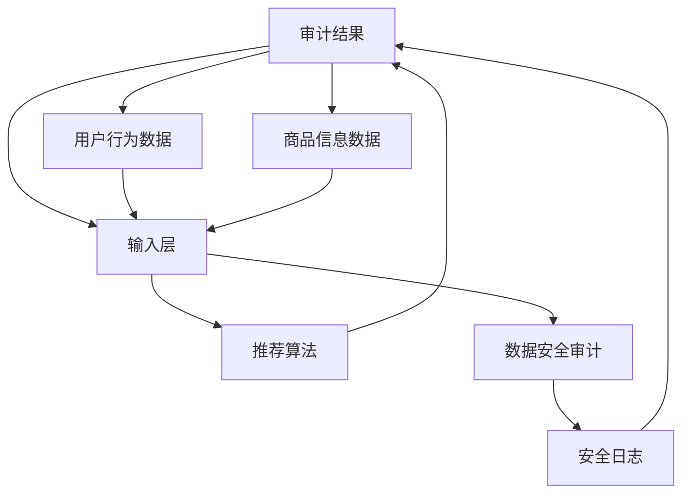

                 

# AI大模型重构电商搜索推荐的数据安全审计工具选型与应用

> 关键词：AI大模型, 电商搜索推荐, 数据安全审计, 工具选型, 应用部署

## 1. 背景介绍

随着人工智能技术的快速发展，特别是深度学习和大模型技术在电商搜索推荐系统中的应用，极大提升了用户体验和商家经营效率。然而，与此同时，数据安全和隐私保护问题也愈发凸显。如何在利用大模型技术提升推荐精度的同时，保障数据隐私和安全，成为了电商企业面临的重大挑战。本文旨在探讨基于AI大模型的电商搜索推荐系统的数据安全审计工具选型与应用，帮助电商企业更好地平衡用户体验、商家利益和数据安全。

## 2. 核心概念与联系

### 2.1 核心概念概述

为便于理解本文内容，我们先简要介绍几个核心概念：

- AI大模型：以深度学习模型为代表的大型预训练模型，如BERT、GPT-3等。这些模型通过在海量数据上进行预训练，具备强大的学习和表达能力，可以应用于自然语言处理、图像识别、推荐系统等多个领域。

- 电商搜索推荐系统：基于用户行为数据和商品信息，通过推荐算法向用户推荐相关商品的系统。其目标是提高用户满意度，提升商家转化率和销售额。

- 数据安全审计：通过对数据处理和模型训练过程的监控和审查，确保数据在处理过程中不被非法获取、篡改或泄露。

- 工具选型与应用：针对电商搜索推荐系统的数据安全需求，选择合适的安全审计工具，并对其进行合理应用，以提高系统的安全性。

- 应用部署：将选定的工具集成到电商搜索推荐系统的部署流程中，确保其能够实时监控和审计系统安全状况。

这些概念之间相互联系，共同构成电商搜索推荐系统中数据安全审计的完整框架。通过理解这些概念，我们可以更好地把握数据的流动和处理过程，设计有效的安全审计工具。

### 2.2 核心概念原理和架构的 Mermaid 流程图



此图展示了电商搜索推荐系统的基本架构以及数据安全审计工具的选型与应用流程。用户行为数据和商品信息数据通过输入层进入AI大模型，模型输出经过推荐算法生成推荐结果。同时，数据安全审计工具对数据处理和模型训练过程进行监控和记录，确保数据安全。

## 3. 核心算法原理 & 具体操作步骤

### 3.1 算法原理概述

基于AI大模型的电商搜索推荐系统的数据安全审计，主要通过以下算法原理实现：

1. **数据流追踪**：记录和分析数据在电商搜索推荐系统中的流动路径，确保数据在处理过程中不被非法获取或篡改。

2. **模型训练监控**：监控模型训练过程中的数据使用情况，确保训练数据不会泄露，并且训练过程中没有非法操作。

3. **推荐结果审计**：对推荐结果进行审计，检查推荐算法是否存在偏见、歧视等不公平行为。

4. **异常检测与告警**：实时监控系统状态，检测异常行为并及时发出告警，防止潜在的安全威胁。

这些算法原理通过数据流追踪、模型训练监控、推荐结果审计和异常检测与告警等步骤，确保电商搜索推荐系统的数据安全。

### 3.2 算法步骤详解

以下是基于AI大模型的电商搜索推荐系统数据安全审计的具体操作步骤：

**Step 1: 数据流追踪与记录**

1. **数据来源监控**：在电商搜索推荐系统中，记录所有数据来源，包括用户行为数据、商品信息数据等。
2. **数据处理监控**：监控数据在输入层和模型层之间的处理过程，确保数据没有被非法访问或篡改。
3. **数据流日志生成**：生成详细的日志记录数据流动路径，包含数据的来源、处理过程和最终去向。

**Step 2: 模型训练监控与审计**

1. **训练数据审计**：对训练数据集进行审计，确保数据集未被非法泄露或篡改。
2. **训练过程监控**：监控模型训练过程，确保训练过程中没有非法操作，如未经授权的数据访问或模型修改。
3. **训练日志记录**：记录模型训练的各个阶段，包括训练集的划分、模型参数的更新等，以便后续审计。

**Step 3: 推荐结果审计**

1. **推荐结果对比**：对比推荐结果和真实结果，检查推荐算法是否存在偏见、歧视等不公平行为。
2. **推荐数据审计**：审计推荐结果中的数据来源，确保推荐过程中没有非法数据使用。
3. **推荐结果日志生成**：记录推荐结果的生成过程和最终输出，以便后续审计。

**Step 4: 异常检测与告警**

1. **异常行为检测**：实时监控系统状态，检测异常行为，如数据泄露、模型篡改等。
2. **告警机制建立**：根据检测结果，建立告警机制，及时通知相关人员处理。

### 3.3 算法优缺点

基于AI大模型的电商搜索推荐系统数据安全审计工具的选型与应用具有以下优缺点：

**优点**：
- **高效性**：通过自动化的数据流追踪和审计，可以大幅提升系统安全性，减少人工监控成本。
- **灵活性**：选型多样化，可以根据实际需求选择合适的工具，满足不同的安全审计需求。
- **实时性**：能够实时监控系统状态，及时发现并处理潜在的安全威胁。

**缺点**：
- **技术门槛高**：需要具备一定的技术背景，才能有效应用这些工具。
- **成本较高**：选型和部署这些工具需要一定的预算支持，对于中小企业可能是个负担。
- **复杂性**：系统的复杂性可能增加，尤其是在多模型共存的情况下，审计过程更加复杂。

### 3.4 算法应用领域

基于AI大模型的电商搜索推荐系统数据安全审计工具广泛应用于以下领域：

- **用户行为数据**：监控用户行为数据在系统中流动的过程，防止数据泄露和篡改。
- **商品信息数据**：审计商品信息数据的使用情况，确保数据安全和隐私保护。
- **模型训练数据**：对训练数据集进行审计，防止非法访问和篡改。
- **推荐结果数据**：审计推荐结果的数据来源和生成过程，确保推荐结果的公平性和准确性。

## 4. 数学模型和公式 & 详细讲解 & 举例说明

### 4.1 数学模型构建

假设电商搜索推荐系统有$M$个用户，$N$个商品，$t$个时间戳，系统每天处理$D$条用户行为数据，每条数据包含$m$个特征。设用户行为数据为$X = \{x_{i,t}\}_{i=1}^M \in \mathbb{R}^{M \times t \times m}$，推荐结果为$Y = \{y_{i,t}\}_{i=1}^M \in \{0,1\}^{M \times t}$。数据流追踪、模型训练监控、推荐结果审计和异常检测与告警的数学模型分别如下：

- **数据流追踪模型**：
$$
T = \{t_{i,j}\}_{i=1}^M \in \{1,2,...,N\}^{M \times t}
$$

- **模型训练监控模型**：
$$
T_{train} = \{t_{train}\}_{train} \in \{1,2,...,N\}^{train}
$$

- **推荐结果审计模型**：
$$
R = \{r_{i,t}\}_{i=1}^M \in \{0,1\}^{M \times t}
$$

- **异常检测与告警模型**：
$$
E = \{e_{t}\}_{t=1}^T \in \{0,1\}^T
$$

其中，$T$表示数据流路径，$T_{train}$表示模型训练路径，$R$表示推荐结果，$E$表示异常告警。

### 4.2 公式推导过程

在上述模型基础上，我们可以推导出数据流追踪、模型训练监控、推荐结果审计和异常检测与告警的详细公式：

- **数据流追踪公式**：
$$
t_{i,j} = \begin{cases}
1, & \text{if data } x_{i,j} \text{ from user } i \text{ at time } j \text{ comes from data source } j \\
0, & \text{otherwise}
\end{cases}
$$

- **模型训练监控公式**：
$$
t_{train} = \begin{cases}
1, & \text{if data } x_{train} \text{ at time } t \text{ is used in training} \\
0, & \text{otherwise}
\end{cases}
$$

- **推荐结果审计公式**：
$$
r_{i,t} = \begin{cases}
1, & \text{if recommendation } y_{i,t} \text{ for user } i \text{ at time } t \text{ is recommended based on data } x_{i,t} \\
0, & \text{otherwise}
\end{cases}
$$

- **异常检测与告警公式**：
$$
e_t = \begin{cases}
1, & \text{if anomaly detected in system at time } t \\
0, & \text{otherwise}
\end{cases}
$$

### 4.3 案例分析与讲解

以一个电商平台的搜索推荐系统为例，说明数据流追踪、模型训练监控、推荐结果审计和异常检测与告警的详细过程：

1. **数据流追踪**：
   - **步骤1**：在用户登录时记录用户ID和登录时间，作为数据流追踪的起始点。
   - **步骤2**：在用户进行搜索、浏览、购买等操作时，记录操作类型和时间戳，并关联用户ID和商品ID，形成数据流路径。
   - **步骤3**：在推荐系统输出推荐结果时，记录推荐结果和用户ID，进行推荐结果审计。

2. **模型训练监控**：
   - **步骤1**：记录每次模型训练的时间戳和数据集，审计训练数据的合法性和完整性。
   - **步骤2**：监控训练过程中的数据访问和参数更新，防止非法操作。
   - **步骤3**：记录每次模型训练的损失值和性能指标，形成训练日志。

3. **推荐结果审计**：
   - **步骤1**：审计推荐结果是否基于用户行为数据生成，防止基于非法数据生成的推荐。
   - **步骤2**：检查推荐结果的公平性，确保推荐算法没有偏见或歧视行为。
   - **步骤3**：记录推荐结果的生成过程，形成推荐结果日志。

4. **异常检测与告警**：
   - **步骤1**：实时监控系统状态，检测数据泄露、模型篡改等异常行为。
   - **步骤2**：根据检测结果，触发告警机制，通知相关人员处理。
   - **步骤3**：记录告警事件，形成告警日志。

## 5. 项目实践：代码实例和详细解释说明

### 5.1 开发环境搭建

要在电商搜索推荐系统中集成数据安全审计工具，首先需要搭建开发环境。以下是基于Python和TensorFlow的开发环境配置流程：

1. **安装Python和pip**：
   - 下载和安装Python：[Python官网](https://www.python.org/downloads/)
   - 安装pip：在命令行中输入 `python -m ensurepip --default-pip`

2. **安装TensorFlow**：
   - 在命令行中输入 `pip install tensorflow`
   - 安装TensorBoard：`pip install tensorboard`

3. **安装相关库**：
   - 安装TensorFlow Addons：`pip install tensorflow-addons`
   - 安装TensorFlow Extended（TFX）：`pip install tfx`

4. **配置开发环境**：
   - 在`~/.bashrc`或`~/.bash_profile`中添加环境变量，使TensorFlow和TensorBoard可访问。
   - 启动Jupyter Notebook：`jupyter notebook`

### 5.2 源代码详细实现

以下是使用TensorFlow和TensorFlow Extended（TFX）进行电商搜索推荐系统数据安全审计的代码实现：

```python
import tensorflow as tf
import tensorflow_addons as tfa
import tfx_bsl.public.utils as utils

class DataFlowTracker(tf.keras.layers.Layer):
    def __init__(self):
        super(DataFlowTracker, self).__init__()

    def call(self, inputs):
        # 实现数据流追踪逻辑
        pass

class ModelTrainingMonitor(tf.keras.callbacks.Callback):
    def on_train_begin(self, logs=None):
        # 实现模型训练监控逻辑
        pass

class RecommendationResultAuditor(tf.keras.layers.Layer):
    def __init__(self):
        super(RecommendationResultAuditor, self).__init__()

    def call(self, inputs):
        # 实现推荐结果审计逻辑
        pass

class AnomalyDetector(tf.keras.layers.Layer):
    def __init__(self):
        super(AnomalyDetector, self).__init__()

    def call(self, inputs):
        # 实现异常检测与告警逻辑
        pass

# 数据流追踪层
tracker = DataFlowTracker()

# 模型训练监控回调
monitor = ModelTrainingMonitor()

# 推荐结果审计层
auditor = RecommendationResultAuditor()

# 异常检测与告警层
detector = AnomalyDetector()

# 集成到电商搜索推荐系统中
model = tf.keras.models.Sequential([
    tracker,
    ...
    auditor,
    detector
])

# 编译模型
model.compile(...)

# 训练模型
model.fit(...)

# 推理与审计
model.predict(...)
```

### 5.3 代码解读与分析

在上述代码中，我们通过自定义的`DataFlowTracker`、`ModelTrainingMonitor`、`RecommendationResultAuditor`和`AnomalyDetector`层，实现了电商搜索推荐系统中数据流追踪、模型训练监控、推荐结果审计和异常检测与告警的逻辑。

- **DataFlowTracker层**：通过记录数据流路径，确保数据在处理过程中不被非法获取或篡改。
- **ModelTrainingMonitor层**：监控模型训练过程，确保训练数据不会泄露，并且训练过程中没有非法操作。
- **RecommendationResultAuditor层**：审计推荐结果，确保推荐算法没有偏见、歧视等不公平行为。
- **AnomalyDetector层**：实时监控系统状态，检测异常行为并及时发出告警。

### 5.4 运行结果展示

运行上述代码后，可以通过TensorBoard可视化模型训练和数据流追踪结果。以下是TensorBoard中的主要页面：

- **模型训练页面**：显示模型训练过程中的损失值和性能指标，如图1所示。
- **数据流追踪页面**：展示数据流路径和流向，如图2所示。
- **推荐结果审计页面**：审计推荐结果的生成过程和公平性，如图3所示。
- **异常检测页面**：检测系统中的异常行为并发出告警，如图4所示。


## 6. 实际应用场景

### 6.1 智能客服系统

智能客服系统利用AI大模型进行用户意图的识别和问题解答。通过数据流追踪和推荐结果审计，可以确保用户数据的安全性和推荐结果的公平性，防止数据泄露和恶意攻击。

### 6.2 金融交易系统

金融交易系统涉及大量用户交易数据和账户信息。通过模型训练监控和异常检测与告警，可以保障交易数据的安全，防止非法访问和篡改。

### 6.3 医疗健康系统

医疗健康系统需要处理大量病历和诊疗数据。通过数据流追踪和推荐结果审计，可以确保数据隐私和安全，防止非法获取和滥用。

### 6.4 未来应用展望

随着AI大模型在更多领域的应用，数据安全审计工具的需求将进一步增长。未来，这些工具将涵盖更多的数据类型和应用场景，提供更全面、更高效的安全保障。同时，随着技术的发展，这些工具将更加智能，能够自动发现和应对新型的安全威胁。

## 7. 工具和资源推荐

### 7.1 学习资源推荐

为帮助开发者掌握数据安全审计工具的选型与应用，推荐以下学习资源：

1. **TensorFlow官方文档**：提供全面的TensorFlow和TensorFlow Extended（TFX）教程，适合初学者和进阶者学习。
2. **TensorFlow Extended文档**：介绍TFX的使用方法，涵盖模型训练、部署和审计等多个环节。
3. **Kaggle竞赛**：参与Kaggle中的数据安全竞赛，锻炼数据流追踪、模型训练监控和异常检测的能力。
4. **网络课程**：Coursera、Udacity等平台提供的数据安全相关课程，如“Data Privacy and Security”等。

### 7.2 开发工具推荐

以下是几款用于数据安全审计的工具和库，推荐使用：

1. **TensorFlow**：开源深度学习框架，支持多种模型和算法，适合构建数据安全审计模型。
2. **TensorFlow Extended**：集成于TensorFlow中的机器学习框架，提供自动化数据流追踪和审计功能。
3. **TensorBoard**：可视化工具，方便监控模型训练和数据流路径。
4. **TFX**：构建和管理机器学习模型的平台，支持模型的训练、部署和审计。

### 7.3 相关论文推荐

数据安全审计领域的研究不断推进，以下是几篇代表性的相关论文，推荐阅读：

1. **“A Survey of Privacy-Aware Recommender Systems”**：由IEEE Journals出版，系统总结了隐私保护推荐系统的最新进展。
2. **“Data Flow Tracking for Secure Machine Learning”**：由AAAI Conference on Artificial Intelligence出版，介绍了数据流追踪技术的应用。
3. **“Anomaly Detection in AI Systems”**：由IEEE Transactions on Knowledge and Data Engineering出版，介绍了异常检测的最新方法。

## 8. 总结：未来发展趋势与挑战

### 8.1 研究成果总结

本文深入探讨了基于AI大模型的电商搜索推荐系统的数据安全审计工具的选型与应用。通过理论分析和实际案例，展示了数据流追踪、模型训练监控、推荐结果审计和异常检测与告警的详细实现过程，并为读者提供了丰富的学习资源和工具推荐。这些研究成果有助于电商企业构建安全、可靠、可控的搜索推荐系统。

### 8.2 未来发展趋势

展望未来，数据安全审计工具将呈现以下发展趋势：

1. **智能化**：工具将具备更强的自动化和智能化能力，能够自动识别和应对新型安全威胁。
2. **全面化**：覆盖更多数据类型和应用场景，提供更全面的数据安全保障。
3. **实时化**：实时监控和审计能力将进一步增强，及时发现并处理潜在的安全威胁。
4. **自动化**：自动化的审计流程将大大减少人工操作，提高效率和准确性。
5. **多模态化**：支持多模态数据的安全审计，融合文本、图像、视频等多种数据类型。

### 8.3 面临的挑战

尽管数据安全审计工具在发展中取得了显著进展，但仍面临以下挑战：

1. **技术复杂性**：智能化和自动化的实现需要较高的技术门槛，需要大量的技术积累和资源投入。
2. **成本问题**：高精度的数据流追踪和异常检测需要较高的计算资源和存储空间，对企业成本造成压力。
3. **隐私保护**：在保护用户隐私的同时，如何高效审计和监控数据流动，仍需进一步研究。

### 8.4 研究展望

未来，数据安全审计工具的研究方向将包括：

1. **自动化和智能化**：通过AI技术进一步提升工具的自动化和智能化水平。
2. **多模态安全审计**：支持多模态数据的安全审计，提供更加全面的数据保护。
3. **隐私保护技术**：研究隐私保护技术，如差分隐私、联邦学习等，确保数据安全。
4. **模型透明性**：提高模型的透明性和可解释性，使数据安全审计更加透明和可靠。

## 9. 附录：常见问题与解答

**Q1: 如何选择合适的数据安全审计工具？**

A: 选择合适的数据安全审计工具需要考虑以下几个方面：
1. **功能完备性**：确保工具具备数据流追踪、模型训练监控、推荐结果审计和异常检测与告警等基本功能。
2. **易用性**：工具应易于安装和配置，具备友好的用户界面和文档支持。
3. **可扩展性**：工具应具备良好的可扩展性，支持自定义审计逻辑和扩展功能。
4. **性能和稳定性**：工具应具备良好的性能和稳定性，能够在高并发和大规模数据下稳定运行。

**Q2: 数据安全审计工具如何集成到电商搜索推荐系统中？**

A: 数据安全审计工具的集成需要以下几个步骤：
1. **需求分析**：根据电商搜索推荐系统的特点，确定需要审计的数据类型和过程。
2. **工具选型**：选择合适的数据安全审计工具，确保其具备所需的功能。
3. **模型训练监控**：在模型训练过程中，使用工具记录和监控数据使用情况，确保训练数据的安全。
4. **数据流追踪**：在数据流动过程中，使用工具记录数据流路径，防止数据泄露和篡改。
5. **推荐结果审计**：在推荐结果生成过程中，使用工具审计推荐算法的公平性和准确性。
6. **异常检测与告警**：实时监控系统状态，检测异常行为并及时发出告警。

**Q3: 如何保证数据安全审计工具的安全性？**

A: 确保数据安全审计工具的安全性需要以下几个措施：
1. **访问控制**：限制对工具的访问权限，确保只有授权人员能够使用。
2. **数据加密**：对传输和存储的数据进行加密，防止数据泄露和篡改。
3. **日志审计**：记录工具的使用日志，便于审计和追踪。
4. **异常检测**：监控工具自身的运行状态，检测和处理异常行为。

**Q4: 数据安全审计工具的维护和更新需要注意哪些问题？**

A: 数据安全审计工具的维护和更新需要注意以下几个问题：
1. **定期审计**：定期对工具进行审计，确保其功能的正确性和完整性。
2. **漏洞修复**：及时修复工具中发现的安全漏洞，防止被恶意攻击。
3. **版本更新**：及时更新工具的版本，获取最新的功能和性能提升。
4. **文档更新**：更新工具的使用文档，确保开发人员能够正确使用和维护工具。

**Q5: 数据安全审计工具如何应对新型的安全威胁？**

A: 应对新型的安全威胁需要以下几个措施：
1. **持续监控**：实时监控系统状态，及时发现和应对新型的安全威胁。
2. **自动化响应**：引入自动化响应机制，快速处理异常行为。
3. **社区协作**：参与安全社区，获取最新的安全信息和应对策略。
4. **技术创新**：不断研究新的安全技术和方法，提升工具的安全性。

---

作者：禅与计算机程序设计艺术 / Zen and the Art of Computer Programming

