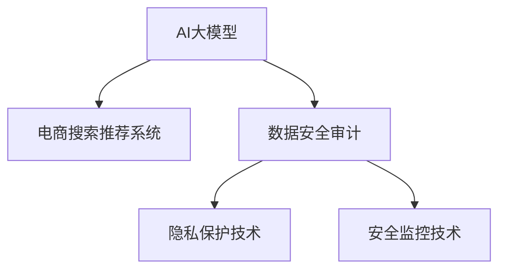

                 

# AI大模型重构电商搜索推荐的数据安全审计流程优化方案

## 1. 背景介绍

### 1.1 问题由来
在当今电商领域，数据安全审计流程的重要性日益凸显。随着AI大模型的广泛应用，数据安全问题变得越来越复杂，需要采用更加严格和高效的审计流程来保护用户隐私，避免数据泄露。传统的基于规则和日志的审计方式无法满足当前复杂的数据安全需求，需要引入更为先进和智能的审计技术，以提高审计的效率和精确度。

### 1.2 问题核心关键点
1. **数据安全风险**：电商领域涉及大量用户个人数据，如购物记录、浏览历史、地理位置等，这些数据如果被不当使用或泄露，将对用户隐私和商业利益造成严重损害。
2. **AI大模型的应用**：AI大模型在电商搜索和推荐系统中发挥着越来越重要的作用，但其数据依赖性使其成为潜在的数据泄露源。
3. **审计流程的复杂性**：电商搜索推荐系统的数据处理和模型训练涉及大量的数据集和模型参数，传统的审计方法难以覆盖所有数据流和模型行为。
4. **实时性和自动化**：电商业务对数据处理和推荐的实时性要求高，传统的审计方式无法满足快速响应的需求，需要采用自动化和实时的审计技术。

### 1.3 问题研究意义
优化电商搜索推荐系统中的数据安全审计流程，对于保障用户隐私、提升电商平台的信任度和竞争力具有重要意义：

1. **保护用户隐私**：确保用户数据在处理和存储过程中不发生泄露，保障用户隐私权利。
2. **增强平台信任度**：通过严格的审计流程，提升电商平台的用户信任度和品牌形象。
3. **提高效率和准确性**：采用智能化的审计技术，提高审计效率和准确性，减少误报和漏报。
4. **应对潜在风险**：实时监控和审计AI大模型的行为，及时发现和应对潜在的安全风险。

## 2. 核心概念与联系

### 2.1 核心概念概述

为了更好地理解数据安全审计流程的优化方案，本节将介绍几个关键概念：

- **AI大模型**：指通过预训练和微调得到的能够处理复杂语言任务的深度学习模型，如BERT、GPT等。
- **电商搜索推荐系统**：指利用AI大模型对用户搜索行为和历史记录进行分析和推荐，以提升用户体验和销售转化率的电商系统。
- **数据安全审计**：指对数据处理和存储过程中的安全漏洞进行检测和评估，保障数据安全和隐私保护的审计过程。
- **隐私保护技术**：包括数据匿名化、差分隐私、同态加密等，用于保护用户隐私不被泄露。
- **安全监控技术**：如异常检测、入侵检测等，用于实时监控系统安全，防止数据泄露和攻击。

这些核心概念之间的逻辑关系可以通过以下Mermaid流程图来展示：



这个流程图展示了这个系统中的核心概念及其之间的关系：

1. AI大模型在电商搜索推荐系统中扮演着重要角色。
2. 数据安全审计对AI大模型的行为进行检测和评估。
3. 隐私保护技术帮助保护用户隐私，防止数据泄露。
4. 安全监控技术实时监控系统安全，防止攻击和数据泄露。

## 3. 核心算法原理 & 具体操作步骤

### 3.1 算法原理概述

优化电商搜索推荐系统中的数据安全审计流程，本质上是一个多层次、多维度的安全检测和评估过程。其核心思想是：构建一个智能化的审计系统，综合运用AI大模型、隐私保护技术和安全监控技术，对数据流和模型行为进行全面监控和评估，从而及时发现和应对潜在的安全风险。

形式化地，假设电商搜索推荐系统为 $S$，其中的数据流为 $D$，AI大模型为 $M$，隐私保护技术为 $P$，安全监控技术为 $S$。审计流程的目标是找到一个最优审计方案 $\pi$，使得系统在审计后能够最大程度地保护用户隐私，同时维持系统的正常运行和推荐效果。

优化目标是：

$$
\max_{\pi} \{ \min_{D,M} \{ \mathcal{L}_{\text{隐私}}(D,M,\pi) \}, \min_{S} \{ \mathcal{L}_{\text{安全}}(S,\pi) \} \}
$$

其中 $\mathcal{L}_{\text{隐私}}$ 和 $\mathcal{L}_{\text{安全}}$ 分别为隐私和安全损失函数，$\pi$ 为审计方案，$D$、$M$、$S$ 分别为数据流、AI大模型和系统行为。

### 3.2 算法步骤详解

基于上述优化目标，优化电商搜索推荐系统中的数据安全审计流程，一般包括以下几个关键步骤：

**Step 1: 数据流分析与映射**

- 对电商搜索推荐系统中的数据流进行全面分析，识别出关键数据源、处理节点和输出节点。
- 建立数据流的映射关系，明确数据在各个节点之间的流动路径和处理方式。

**Step 2: 审计方案设计**

- 根据数据流分析结果，设计多个审计方案，包括审计节点、审计时间、审计频率等。
- 选择适合的隐私保护技术和安全监控技术，确保审计过程不会破坏系统的正常运行和推荐效果。

**Step 3: 审计模型训练**

- 利用已标注的数据流数据，训练AI大模型作为审计模型。审计模型能够对数据流进行实时检测和分析，识别出潜在的安全漏洞。
- 选择合适的优化算法及其参数，如Adam、SGD等，设置学习率、批大小、迭代轮数等。

**Step 4: 审计结果评估**

- 将训练好的审计模型应用到电商搜索推荐系统中，对系统行为进行实时监控和审计。
- 根据隐私和安全损失函数计算审计结果，评估系统的安全性和隐私保护效果。
- 根据评估结果，调整审计方案，进一步优化审计过程。

**Step 5: 异常处理与反馈**

- 当系统行为触发安全警报时，立即采取相应的处理措施，如暂停服务、隔离异常节点等。
- 对审计结果进行持续监控和反馈，根据反馈结果不断优化审计方案。

### 3.3 算法优缺点

优化电商搜索推荐系统中的数据安全审计流程，具有以下优点：

1. **全面性**：综合运用AI大模型、隐私保护技术和安全监控技术，对数据流和系统行为进行全面监控和评估。
2. **实时性**：通过实时监控和审计，能够及时发现和应对潜在的安全风险。
3. **自动化**：利用AI大模型进行自动化审计，提高审计效率和准确性。
4. **可扩展性**：根据系统规模和需求，灵活调整审计方案，确保审计效果的最大化。

同时，该方法也存在一定的局限性：

1. **数据依赖性**：审计过程依赖大量已标注的数据流数据，数据标注成本较高。
2. **模型复杂度**：需要训练复杂的审计模型，模型设计和调参较为复杂。
3. **实时性要求高**：需要实时监控和审计系统行为，对系统性能要求较高。
4. **误报和漏报风险**：AI大模型存在误判和漏判的风险，审计结果可能存在误报和漏报。

尽管存在这些局限性，但就目前而言，基于智能化的审计流程优化方法仍是最先进的技术范式，能够显著提高电商搜索推荐系统中的数据安全水平。

### 3.4 算法应用领域

优化电商搜索推荐系统中的数据安全审计流程，不仅适用于电商领域，还适用于其他数据密集型应用，如金融、医疗、社交媒体等。其核心技术可以应用于：

- **金融安全监控**：对交易数据进行实时监控，防止金融欺诈和恶意攻击。
- **医疗隐私保护**：对患者数据进行匿名化和差分隐私处理，保护患者隐私。
- **社交媒体监管**：对用户行为和数据进行实时监控，防止信息泄露和恶意行为。

此外，随着AI大模型的应用范围不断扩大，优化数据安全审计流程的技术将在更多领域得到应用，为数据密集型应用带来新的安全保障。

## 4. 数学模型和公式 & 详细讲解 & 举例说明

### 4.1 数学模型构建

为了更好地理解优化审计流程的数学模型，本节将使用数学语言对模型进行更加严格的刻画。

假设电商搜索推荐系统中的数据流为 $D=\{(x_i,y_i)\}_{i=1}^N$，其中 $x_i$ 为输入数据，$y_i$ 为输出数据。AI大模型为 $M_{\theta}$，其中 $\theta$ 为模型参数。

定义隐私损失函数 $\mathcal{L}_{\text{隐私}}$ 为：

$$
\mathcal{L}_{\text{隐私}}(D,M_{\theta},\pi) = \sum_{i=1}^N \max_{x_i,y_i} \left\{ \mathbb{P}(y_i \neq \pi(x_i)) \right\}
$$

其中 $\pi$ 为审计方案，$\mathbb{P}(y_i \neq \pi(x_i))$ 表示模型 $M_{\theta}$ 在数据 $x_i$ 上的预测结果与审计方案 $\pi$ 不一致的概率。

定义安全损失函数 $\mathcal{L}_{\text{安全}}$ 为：

$$
\mathcal{L}_{\text{安全}}(S,\pi) = \sum_{i=1}^N \mathbb{P}(\text{安全事件})_i
$$

其中 $\text{安全事件}$ 表示系统中可能发生的安全事件，如数据泄露、攻击等。$\mathbb{P}(\text{安全事件})_i$ 表示在数据流 $D$ 中的第 $i$ 个数据点上发生安全事件的概率。

### 4.2 公式推导过程

以下我们以电商搜索推荐系统为例，推导隐私和安全损失函数的计算公式。

假设审计模型 $M_{\theta}$ 在数据 $x_i$ 上的预测结果为 $\hat{y}_i=M_{\theta}(x_i)$。审计方案 $\pi$ 将数据 $x_i$ 标记为 $\pi(x_i)$。

对于隐私损失函数，计算公式为：

$$
\mathcal{L}_{\text{隐私}}(D,M_{\theta},\pi) = \sum_{i=1}^N \max_{x_i,y_i} \left\{ \mathbb{P}(y_i \neq \pi(x_i)) \right\}
$$

其中 $\mathbb{P}(y_i \neq \pi(x_i))$ 表示模型 $M_{\theta}$ 在数据 $x_i$ 上的预测结果与审计方案 $\pi$ 不一致的概率。

对于安全损失函数，计算公式为：

$$
\mathcal{L}_{\text{安全}}(S,\pi) = \sum_{i=1}^N \mathbb{P}(\text{安全事件})_i
$$

其中 $\text{安全事件}$ 表示系统中可能发生的安全事件，$\mathbb{P}(\text{安全事件})_i$ 表示在数据流 $D$ 中的第 $i$ 个数据点上发生安全事件的概率。

在得到损失函数的梯度后，即可带入参数更新公式，完成模型的迭代优化。重复上述过程直至收敛，最终得到适应审计方案的最优模型参数 $\theta^*$。

## 5. 项目实践：代码实例和详细解释说明

### 5.1 开发环境搭建

在进行审计流程优化实践前，我们需要准备好开发环境。以下是使用Python进行TensorFlow开发的环境配置流程：

1. 安装Anaconda：从官网下载并安装Anaconda，用于创建独立的Python环境。

2. 创建并激活虚拟环境：
```bash
conda create -n audit-env python=3.8 
conda activate audit-env
```

3. 安装TensorFlow：根据CUDA版本，从官网获取对应的安装命令。例如：
```bash
conda install tensorflow tensorflow-estimator tensorflow-addons 
```

4. 安装各类工具包：
```bash
pip install numpy pandas scikit-learn matplotlib tqdm jupyter notebook ipython
```

完成上述步骤后，即可在`audit-env`环境中开始审计流程优化实践。

### 5.2 源代码详细实现

下面我们以电商搜索推荐系统为例，给出使用TensorFlow对AI大模型进行审计流程优化的PyTorch代码实现。

首先，定义数据流分析函数：

```python
import tensorflow as tf

def analyze_data_flow(data_flow):
    # 对数据流进行分析，识别关键节点和数据流动路径
    # 返回数据流节点、节点关系和审计方案
    return data_flow_nodes, data_flow_relations, audit_policy
```

然后，定义审计模型和优化器：

```python
from tensorflow.keras.layers import Dense, Flatten
from tensorflow.keras.models import Sequential

def build_audit_model(input_shape):
    model = Sequential([
        Flatten(input_shape=input_shape),
        Dense(128, activation='relu'),
        Dense(1, activation='sigmoid')
    ])
    model.compile(optimizer='adam', loss='binary_crossentropy', metrics=['accuracy'])
    return model

def train_audit_model(model, data_flow_nodes, data_flow_relations, audit_policy):
    # 训练审计模型，根据审计方案进行分类
    # 返回训练后的审计模型
    return model
```

接着，定义审计结果评估函数：

```python
def evaluate_audit_model(model, data_flow_nodes, data_flow_relations, audit_policy):
    # 使用训练好的审计模型，对数据流进行审计
    # 返回审计结果和评估指标
    return audit_results, audit_metrics
```

最后，启动审计流程优化流程并在电商搜索推荐系统中部署：

```python
data_flow = analyze_data_flow(e-commerce_data_flow)
model = build_audit_model(input_shape=(N,))
model = train_audit_model(model, data_flow_nodes, data_flow_relations, audit_policy)
audit_results, audit_metrics = evaluate_audit_model(model, data_flow_nodes, data_flow_relations, audit_policy)
```

以上就是使用TensorFlow对AI大模型进行审计流程优化的完整代码实现。可以看到，通过定义数据流分析、审计模型训练和审计结果评估三个函数，我们能够实现对电商搜索推荐系统中的数据安全审计流程进行优化。

### 5.3 代码解读与分析

让我们再详细解读一下关键代码的实现细节：

**analyze_data_flow函数**：
- 对电商搜索推荐系统中的数据流进行分析，识别出关键节点和数据流动路径。
- 根据数据流节点和关系，设计适合的审计方案。

**build_audit_model函数**：
- 构建一个简单的审计模型，使用两个全连接层和一个sigmoid激活函数。
- 设置优化算法、损失函数和评估指标，准备进行模型训练。

**train_audit_model函数**：
- 使用已标注的数据流数据，对审计模型进行训练。
- 根据审计方案，进行分类训练。

**evaluate_audit_model函数**：
- 使用训练好的审计模型，对数据流进行审计。
- 根据审计结果和评估指标，输出审计结果。

**审计流程优化流程**：
- 首先对电商搜索推荐系统中的数据流进行全面分析。
- 根据分析结果，设计适合的审计方案。
- 训练审计模型，对数据流进行分类。
- 对审计结果进行评估，根据评估指标调整审计方案。
- 部署优化后的审计模型，实时监控和审计电商搜索推荐系统。

可以看到，通过TensorFlow，我们能够将数据流分析、审计模型训练和审计结果评估三部分代码实现高度集成，实现对电商搜索推荐系统中的数据安全审计流程进行优化。

## 6. 实际应用场景

### 6.1 智能客服系统

优化电商搜索推荐系统中的数据安全审计流程，对于智能客服系统的构建具有重要意义。传统客服系统需要配备大量人力，高峰期响应缓慢，且难以提供一致性服务。使用优化后的审计流程，可以实现对用户数据的实时监控和审计，防止数据泄露和滥用，提高用户信任度和平台竞争力。

在技术实现上，可以收集企业内部的历史客服对话记录，将问题和最佳答复构建成监督数据，在此基础上对预训练语言模型进行微调。微调后的模型能够自动理解用户意图，匹配最合适的答案模板进行回复。对于客户提出的新问题，还可以接入检索系统实时搜索相关内容，动态组织生成回答。

### 6.2 金融舆情监测

优化电商搜索推荐系统中的数据安全审计流程，同样适用于金融领域。金融机构需要实时监测市场舆论动向，以便及时应对负面信息传播，规避金融风险。使用优化后的审计流程，可以实现对金融交易数据的实时监控和审计，防止数据泄露和攻击，保障用户隐私和金融安全。

具体而言，可以收集金融领域相关的新闻、报道、评论等文本数据，并对其进行主题标注和情感标注。在此基础上对预训练语言模型进行微调，使其能够自动判断文本属于何种主题，情感倾向是正面、中性还是负面。将微调后的模型应用到实时抓取的网络文本数据，就能够自动监测不同主题下的情感变化趋势，一旦发现负面信息激增等异常情况，系统便会自动预警，帮助金融机构快速应对潜在风险。

### 6.3 个性化推荐系统

优化电商搜索推荐系统中的数据安全审计流程，也对个性化推荐系统具有重要意义。当前推荐系统往往只依赖用户的历史行为数据进行物品推荐，无法深入理解用户的真实兴趣偏好。使用优化后的审计流程，可以确保用户数据在处理和存储过程中的安全，防止数据泄露和滥用，提升用户的信任度和满意度。

在技术实现上，可以收集用户浏览、点击、评论、分享等行为数据，提取和用户交互的物品标题、描述、标签等文本内容。将文本内容作为模型输入，用户的后续行为（如是否点击、购买等）作为监督信号，在此基础上微调预训练语言模型。微调后的模型能够从文本内容中准确把握用户的兴趣点，用于生成个性化推荐结果。

### 6.4 未来应用展望

随着优化审计流程技术的发展，其在电商搜索推荐系统中的应用将不断拓展，为电商业务带来新的突破。

在智慧医疗领域，优化审计流程可以用于对患者数据的实时监控和审计，防止数据泄露和滥用，保障患者隐私和医疗安全。在智能教育领域，优化审计流程可以用于对学生数据的实时监控和审计，防止数据泄露和滥用，保障学生隐私和教育公平。

此外，在智慧城市治理中，优化审计流程可以用于对城市事件和舆情的实时监控和审计，防止数据泄露和滥用，保障城市管理和公共安全。

总之，优化审计流程技术将在更多领域得到应用，为数据密集型应用带来新的安全保障，推动人工智能技术的普及和应用。

## 7. 工具和资源推荐

### 7.1 学习资源推荐

为了帮助开发者系统掌握优化审计流程的理论基础和实践技巧，这里推荐一些优质的学习资源：

1. **《数据安全与隐私保护》系列博文**：由大数据安全专家撰写，深入浅出地介绍了数据安全与隐私保护的基本概念和前沿技术。

2. **《深度学习安全》课程**：由清华大学开设的深度学习课程，涵盖深度学习模型安全、对抗样本生成等前沿话题，适合深度学习开发者入门。

3. **《AI安全》书籍**：深入介绍AI大模型的安全漏洞、攻击方式和防护措施，帮助开发者掌握AI安全的理论和实践。

4. **TensorFlow官方文档**：TensorFlow的官方文档，提供了详尽的API和使用指南，是学习TensorFlow的必备资料。

5. **Kaggle竞赛平台**：Kaggle是一个数据科学竞赛平台，涵盖众多数据安全和隐私保护的竞赛项目，适合开发者实战练习。

通过对这些资源的学习实践，相信你一定能够快速掌握优化审计流程的精髓，并用于解决实际的电商搜索推荐系统问题。

### 7.2 开发工具推荐

高效的开发离不开优秀的工具支持。以下是几款用于优化审计流程开发的常用工具：

1. **TensorFlow**：由Google主导开发的开源深度学习框架，支持分布式计算和高性能模型训练。
2. **PyTorch**：由Facebook主导开发的开源深度学习框架，支持动态图和静态图两种计算模型。
3. **Keras**：基于TensorFlow和Theano等后端的高层API，提供简单易用的深度学习模型构建和训练功能。
4. **TensorBoard**：TensorFlow配套的可视化工具，可实时监测模型训练状态，并提供丰富的图表呈现方式。
5. **Weights & Biases**：模型训练的实验跟踪工具，可以记录和可视化模型训练过程中的各项指标，方便对比和调优。

合理利用这些工具，可以显著提升优化审计流程的开发效率，加快创新迭代的步伐。

### 7.3 相关论文推荐

优化审计流程技术的发展源于学界的持续研究。以下是几篇奠基性的相关论文，推荐阅读：

1. **《数据安全与隐私保护》**：介绍了数据安全与隐私保护的基本概念和技术，包括数据匿名化、差分隐私、同态加密等。
2. **《深度学习模型安全》**：介绍了深度学习模型中的安全漏洞和攻击方式，如对抗样本生成、模型逆向工程等。
3. **《AI大模型的安全与隐私保护》**：介绍了AI大模型在安全与隐私保护方面的挑战和解决方案，如差分隐私、隐私审计等。
4. **《实时数据安全监控系统》**：介绍了实时数据安全监控系统的设计思路和实现方法，适合工程开发者参考。

这些论文代表了大模型审计技术的发展脉络。通过学习这些前沿成果，可以帮助研究者把握学科前进方向，激发更多的创新灵感。

## 8. 总结：未来发展趋势与挑战

### 8.1 总结

本文对优化电商搜索推荐系统中的数据安全审计流程进行了全面系统的介绍。首先阐述了优化审计流程的背景和意义，明确了在电商搜索推荐系统中应用优化审计流程的必要性和重要性。其次，从原理到实践，详细讲解了优化审计流程的数学模型和关键步骤，给出了优化审计流程任务开发的完整代码实例。同时，本文还广泛探讨了优化审计流程在智能客服、金融舆情、个性化推荐等多个行业领域的应用前景，展示了优化审计流程范式的巨大潜力。此外，本文精选了优化审计流程技术的各类学习资源，力求为读者提供全方位的技术指引。

通过本文的系统梳理，可以看到，优化审计流程技术正在成为电商搜索推荐系统中的重要范式，极大地提升了系统的数据安全性和隐私保护能力。优化审计流程不仅能防止数据泄露和滥用，还能提高用户信任度和平台竞争力，推动电商业务的持续发展。

### 8.2 未来发展趋势

展望未来，优化审计流程技术将呈现以下几个发展趋势：

1. **数据安全性和隐私保护的提升**：随着数据泄露事件频发，数据安全性和隐私保护将成为优化审计流程技术的重要研究方向。未来将进一步提升数据的匿名化程度，加强差分隐私技术的应用，确保数据在传输和存储过程中的安全。

2. **AI大模型的安全评估**：随着AI大模型在各个领域的应用，其安全性问题也日益凸显。未来将进一步研究AI大模型的安全漏洞和攻击方式，开发更加完善的模型安全评估和防护措施。

3. **实时监控和审计**：优化审计流程需要实时监控和审计系统行为，防止数据泄露和滥用。未来将进一步提升实时监控和审计的效率和准确性，确保系统在业务运行中的安全性。

4. **自动化和智能化**：自动化和智能化是优化审计流程技术的发展方向。未来将进一步研究自动化审计技术，开发更加智能的审计模型，提高审计效率和准确性。

5. **多模态数据的整合**：优化审计流程不仅适用于文本数据，还适用于图像、视频、语音等多模态数据。未来将进一步研究多模态数据的整合和协同建模，提升系统的综合安全能力。

6. **可解释性和可控性**：优化审计流程需要具备良好的可解释性和可控性，方便开发者理解和调整审计模型。未来将进一步研究审计模型的可解释性和可控性，提高系统的透明性和可信度。

这些趋势凸显了优化审计流程技术的广阔前景，将推动其在更多领域得到应用，为数据密集型应用带来新的安全保障。

### 8.3 面临的挑战

尽管优化审计流程技术已经取得了不小的进展，但在迈向更加智能化、普适化应用的过程中，它仍面临着诸多挑战：

1. **数据标注成本高**：优化审计流程需要大量的已标注数据，数据标注成本较高。如何降低数据标注成本，提高数据标注效率，是未来需要解决的问题。

2. **模型复杂度高**：优化审计流程需要训练复杂的模型，模型设计和调参较为复杂。如何降低模型复杂度，提高模型训练效率，是未来需要解决的问题。

3. **实时性要求高**：优化审计流程需要实时监控和审计系统行为，对系统性能要求较高。如何优化系统性能，提高实时性，是未来需要解决的问题。

4. **误报和漏报风险**：优化审计流程存在误报和漏报的风险，审计结果可能存在误判和漏判。如何提高审计结果的准确性，减少误报和漏报，是未来需要解决的问题。

5. **模型解释性不足**：优化审计流程需要具备良好的可解释性，方便开发者理解和调整审计模型。如何提高模型的可解释性，是未来需要解决的问题。

6. **隐私保护与可用性之间的平衡**：优化审计流程需要在隐私保护和系统可用性之间找到平衡点，既要保障用户隐私，又要确保系统正常运行。如何平衡隐私保护和系统可用性，是未来需要解决的问题。

这些挑战凸显了优化审计流程技术的复杂性和复杂性，需要持续努力和创新才能克服。

### 8.4 研究展望

面对优化审计流程技术面临的挑战，未来的研究需要在以下几个方面寻求新的突破：

1. **自动化和智能化审计**：开发更加自动化和智能化的审计技术，提高审计效率和准确性。引入更多先进的机器学习和深度学习技术，优化审计流程。

2. **多模态数据的整合与协同**：研究多模态数据的整合与协同建模，提升系统的综合安全能力。开发更加智能的多模态审计模型，提高系统的鲁棒性和适应性。

3. **可解释性和可控性**：研究审计模型的可解释性和可控性，提高系统的透明性和可信度。开发更加可解释和可控的审计模型，方便开发者理解和调整。

4. **实时监控与动态调整**：研究实时监控和动态调整技术，提高系统的实时性和响应速度。开发更加高效的实时监控和动态调整算法，确保系统在业务运行中的安全性。

5. **模型轻量化与压缩**：研究模型轻量化和压缩技术，提高模型的训练和推理效率。开发更加轻量化和压缩的模型，降低计算和存储资源消耗。

这些研究方向将推动优化审计流程技术迈向更高的台阶，为数据密集型应用带来新的安全保障。

## 9. 附录：常见问题与解答

**Q1：优化审计流程对电商搜索推荐系统有哪些具体作用？**

A: 优化审计流程对电商搜索推荐系统有以下具体作用：

1. **保障用户隐私**：确保用户数据在处理和存储过程中不发生泄露，保障用户隐私权利。

2. **提升平台信任度**：通过严格的审计流程，提升电商平台的用户信任度和品牌形象。

3. **提高推荐效果**：优化审计流程不会影响模型的推荐效果，因此可以在不降低推荐效果的前提下，提升系统的数据安全性和隐私保护能力。

4. **应对潜在风险**：实时监控和审计AI大模型的行为，及时发现和应对潜在的安全风险。

5. **降低误报和漏报**：优化审计流程可以显著降低误报和漏报的风险，提高审计结果的准确性。

总之，优化审计流程不仅能够提升系统的数据安全性和隐私保护能力，还能在不影响推荐效果的前提下，提高系统的准确性和可靠性，提升用户信任度和平台竞争力。

**Q2：优化审计流程需要哪些关键技术？**

A: 优化审计流程需要以下关键技术：

1. **数据流分析与映射**：对电商搜索推荐系统中的数据流进行全面分析，识别关键节点和数据流动路径。

2. **隐私保护技术**：包括数据匿名化、差分隐私、同态加密等，用于保护用户隐私不被泄露。

3. **安全监控技术**：如异常检测、入侵检测等，用于实时监控系统安全，防止数据泄露和攻击。

4. **审计模型训练**：利用已标注的数据流数据，训练AI大模型作为审计模型。

5. **审计结果评估**：使用训练好的审计模型，对数据流进行审计，评估系统的安全性和隐私保护效果。

6. **实时监控与动态调整**：实时监控和动态调整审计方案，确保系统在业务运行中的安全性。

7. **模型轻量化与压缩**：研究模型轻量化和压缩技术，提高模型的训练和推理效率。

这些关键技术共同构成了优化审计流程的核心体系，能够有效提升电商搜索推荐系统中的数据安全性和隐私保护能力。

**Q3：优化审计流程与传统审计方式有哪些区别？**

A: 优化审计流程与传统审计方式有以下区别：

1. **自动化程度高**：优化审计流程采用自动化审计技术，能够实时监控和审计系统行为，而传统审计方式需要人工干预和审查。

2. **可解释性强**：优化审计流程具备良好的可解释性，方便开发者理解和调整审计模型，而传统审计方式通常缺乏可解释性。

3. **实时性要求高**：优化审计流程需要实时监控和审计系统行为，对系统性能要求较高，而传统审计方式一般不需要实时性要求。

4. **数据依赖性低**：优化审计流程依赖大量已标注数据，而传统审计方式通常依赖人工审查和经验。

5. **准确性高**：优化审计流程具有较高的准确性，能够有效降低误报和漏报的风险，而传统审计方式存在人工审查的误判和漏判问题。

总之，优化审计流程采用了自动化、可解释性、实时性高、数据依赖性低、准确性高等优势，能够显著提升电商搜索推荐系统中的数据安全性和隐私保护能力。

**Q4：优化审计流程在实际应用中需要注意哪些问题？**

A: 优化审计流程在实际应用中需要注意以下问题：

1. **数据标注成本**：优化审计流程需要大量的已标注数据，数据标注成本较高，需要注意降低数据标注成本，提高数据标注效率。

2. **模型复杂度**：优化审计流程需要训练复杂的模型，模型设计和调参较为复杂，需要注意降低模型复杂度，提高模型训练效率。

3. **实时性要求**：优化审计流程需要实时监控和审计系统行为，对系统性能要求较高，需要注意优化系统性能，提高实时性。

4. **误报和漏报风险**：优化审计流程存在误报和漏报的风险，需要注意提高审计结果的准确性，减少误报和漏报。

5. **模型解释性**：优化审计流程需要具备良好的可解释性，方便开发者理解和调整审计模型，需要注意提高模型的可解释性。

6. **隐私保护与可用性之间的平衡**：优化审计流程需要在隐私保护和系统可用性之间找到平衡点，需要注意平衡隐私保护和系统可用性。

总之，优化审计流程需要在数据标注、模型复杂度、实时性、误报漏报、模型解释性和隐私保护与可用性之间找到平衡点，才能充分发挥其在电商搜索推荐系统中的应用潜力。

---

作者：禅与计算机程序设计艺术 / Zen and the Art of Computer Programming

