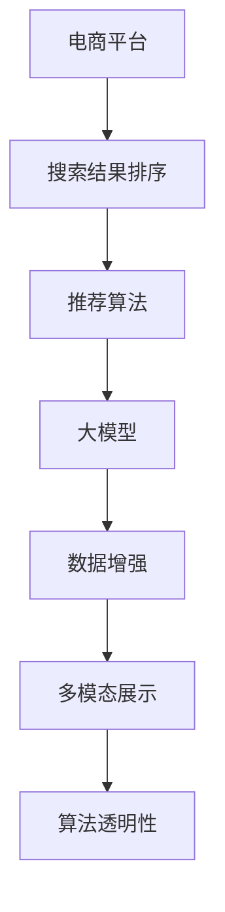

                 

# AI大模型：优化电商平台搜索结果解释性的新方法

## 1. 背景介绍

### 1.1 问题由来
随着电商平台的发展，用户对搜索结果的解释性需求越来越高。用户希望能够在看到搜索结果后，快速理解每个结果的排名和推荐逻辑，从而更好地做出购买决策。然而，当前搜索结果的解释往往过于简洁，难以满足用户的多样化需求。因此，如何提升搜索结果的解释性，成为电商平台提升用户体验和转化率的关键。

### 1.2 问题核心关键点
提升搜索结果的解释性，需要从多方面入手：

- **数据透明性**：提供详尽的搜索结果排序依据，让用户能够理解每个结果的来源和排名逻辑。
- **个性化推荐**：根据用户的浏览历史和兴趣，提供更加个性化的搜索结果解释。
- **算法可解释性**：提升推荐算法的可解释性，让用户能够理解算法的决策过程和原理。
- **多维度展示**：结合文字、图片、视频等多种形式的展示，增强信息的丰富性。

本文聚焦于基于大模型的电商平台搜索结果解释性优化方法，旨在通过机器学习技术，提升搜索结果的解释性，满足用户的多样化需求。

### 1.3 问题研究意义
优化搜索结果的解释性，对于提升用户体验、提高转化率和平台粘性具有重要意义：

- **提升用户满意度**：通过透明的算法和丰富的信息展示，让用户对搜索结果更加信任，提升满意度和忠诚度。
- **提高决策质量**：用户能够更好地理解搜索结果的依据和逻辑，从而做出更加合理的购买决策，提高转化率。
- **增强平台竞争力**：良好的搜索结果解释性，能够吸引和留住更多用户，提升平台的市场竞争力。
- **驱动技术进步**：提升搜索结果解释性，需要深入探索和创新推荐算法和数据展示技术，推动NLP和AI技术的发展。

## 2. 核心概念与联系

### 2.1 核心概念概述

为更好地理解基于大模型的搜索结果解释性优化方法，本节将介绍几个密切相关的核心概念：

- **电商平台**：指线上销售商品的平台，如淘宝、京东、Amazon等，用户可以通过平台查询、购买商品。
- **搜索结果排序**：指电商平台根据用户查询词，从商品库中排序推荐出最相关的商品列表。
- **推荐算法**：指用于预测用户对商品可能感兴趣程度的算法，常见的包括协同过滤、内容推荐、混合推荐等。
- **大模型**：指通过大规模无标签文本数据预训练得到的语言模型，如BERT、GPT-3等，具备强大的语言理解和生成能力。
- **数据增强**：指通过数据合成、文本改写等方式，扩充训练集多样性，提高模型泛化能力。
- **多模态展示**：指结合文字、图片、视频等多种形式展示搜索结果信息，增强用户体验。
- **算法透明性**：指推荐算法的决策过程、参数和逻辑等，能够被用户理解，满足解释性要求。

这些核心概念之间的逻辑关系可以通过以下Mermaid流程图来展示：



这个流程图展示了大模型的核心概念及其之间的关系：

1. 电商平台通过推荐算法生成搜索结果，大模型提供基础的排序依据。
2. 数据增强技术扩充训练集，提高模型泛化能力。
3. 多模态展示结合文字、图片、视频等形式，增强用户体验。
4. 算法透明性提供用户能够理解的算法逻辑，满足解释性要求。

这些概念共同构成了电商平台搜索结果解释性优化的框架，使其能够更好地满足用户需求。

## 3. 核心算法原理 & 具体操作步骤

### 3.1 算法原理概述

基于大模型的电商平台搜索结果解释性优化，本质上是一个多任务学习(MTL)过程。其核心思想是：将用户查询词和商品信息作为输入，通过预训练语言模型大模型，提取语义特征，结合用户行为数据，预测每个商品的排序权重，并在结果展示页面上提供详尽的排序依据和解释信息。

形式化地，假设电商平台生成搜索结果的算法为 $F_{\theta}$，其中 $\theta$ 为推荐算法的参数。给定用户查询词 $q$ 和商品集 $I=\{(i,y_i)\}$，其中 $i$ 为商品ID，$y_i$ 为商品属性（如价格、评分等），以及用户行为数据 $D=\{(x_t,y_t)\}_{t=1}^T$，其中 $x_t$ 为历史浏览行为，$y_t$ 为购买决策。优化目标是最小化排序误差和解释性误差，即：

$$
\hat{\theta}=\mathop{\arg\min}_{\theta} \mathcal{L}_{rank}(F_{\theta},q,I,D) + \mathcal{L}_{expl}(F_{\theta},q,I,D)
$$

其中 $\mathcal{L}_{rank}$ 为排序误差损失函数，用于衡量模型预测的排序结果与实际排序结果的差异；$\mathcal{L}_{expl}$ 为解释性误差损失函数，用于衡量模型提供的解释信息与用户期望的差异。

通过梯度下降等优化算法，微调过程不断更新模型参数 $\theta$，最小化上述两个损失函数，使得模型在满足排序准确性的同时，也能提供丰富的解释信息。

### 3.2 算法步骤详解

基于大模型的电商平台搜索结果解释性优化一般包括以下几个关键步骤：

**Step 1: 准备数据集**
- 收集用户查询词、商品信息、历史浏览行为和购买决策等数据，构建训练集 $D$。
- 对商品进行特征提取，生成包含商品属性和用户行为的多维向量。

**Step 2: 设计大模型结构**
- 选择合适的预训练语言模型，如BERT、GPT-3等，作为特征提取器。
- 定义排序和解释模型，利用多任务学习框架进行联合训练。

**Step 3: 设置模型超参数**
- 选择合适的优化算法及其参数，如Adam、SGD等，设置学习率、批大小、迭代轮数等。
- 设置正则化技术及强度，包括L2正则、Dropout等。

**Step 4: 执行联合训练**
- 将训练集数据分批次输入模型，前向传播计算排序权重和解释信息。
- 反向传播计算参数梯度，根据设定的优化算法和学习率更新模型参数。
- 周期性在验证集上评估模型性能，根据性能指标决定是否触发 Early Stopping。
- 重复上述步骤直到满足预设的迭代轮数或 Early Stopping 条件。

**Step 5: 结果展示与反馈**
- 在搜索结果页面上展示排序依据和解释信息，供用户参考。
- 收集用户对结果的反馈，持续优化模型和展示方式。
- 定期重新微调模型，以适应数据分布的变化。

以上是基于大模型的电商平台搜索结果解释性优化的完整流程。在实际应用中，还需要针对具体平台的特点，对微调过程的各个环节进行优化设计，如改进训练目标函数，引入更多的正则化技术，搜索最优的超参数组合等，以进一步提升模型性能。

### 3.3 算法优缺点

基于大模型的电商平台搜索结果解释性优化方法具有以下优点：

1. 综合性强。通过多任务学习，结合排序和解释任务，能够同时提升排序精度和解释信息的多样性和准确性。
2. 自适应强。预训练语言模型能够自适应不同领域的数据，提升模型泛化能力。
3. 解释性高。利用大模型的语言生成能力，能够生成详尽的排序依据和解释信息，满足用户的多样化需求。
4. 高效性高。通过联合训练和共享参数，能够提高模型训练效率，减少计算资源消耗。

同时，该方法也存在一定的局限性：

1. 数据依赖度高。优化方法依赖于丰富的数据集，数据质量和标注成本对模型性能有较大影响。
2. 模型复杂度高。多任务学习和复杂模型结构可能导致模型复杂度增加，计算资源消耗较大。
3. 泛化能力有待提升。模型在特定领域的泛化能力可能受限于数据分布，需要进一步优化。
4. 用户需求多样。用户对解释信息的需求各异，模型难以满足所有用户的多样化需求。

尽管存在这些局限性，但就目前而言，基于大模型的搜索结果解释性优化方法仍是大模型应用的最主流范式。未来相关研究的重点在于如何进一步降低数据依赖，提高模型的泛化能力和鲁棒性，同时兼顾可解释性和用户需求的多样性。

### 3.4 算法应用领域

基于大模型的电商平台搜索结果解释性优化方法，在电商平台搜索推荐系统中的应用已经得到了广泛的应用，具体体现在以下几个方面：

- **商品排序**：根据用户查询词和商品信息，生成商品排序列表，并提供详细的排序依据。
- **个性化推荐**：结合用户历史行为和兴趣，生成个性化的搜索结果，并在展示页面上提供个性化推荐解释。
- **购物助手**：利用自然语言处理技术，与用户进行交互，提供实时咨询服务，增强用户体验。
- **反馈系统**：收集用户对搜索结果的反馈，持续优化模型，提升搜索结果的解释性。

除了上述这些经典应用外，基于大模型的搜索结果解释性优化方法还可以创新性地应用于更多场景中，如智能客服、智能广告投放等，为电商平台的智能化运营带来新的突破。

## 4. 数学模型和公式 & 详细讲解  
### 4.1 数学模型构建

本节将使用数学语言对基于大模型的电商平台搜索结果解释性优化过程进行更加严格的刻画。

记电商平台推荐算法为 $F_{\theta}:\mathcal{Q} \times \mathcal{I} \times \mathcal{D} \rightarrow \mathcal{R}$，其中 $\mathcal{Q}$ 为用户查询词，$\mathcal{I}$ 为商品信息集，$\mathcal{D}$ 为用户行为数据，$\mathcal{R}$ 为排序权重向量。假设训练集为 $D=\{(x_t,y_t)\}_{t=1}^T$，其中 $x_t$ 为历史浏览行为，$y_t$ 为购买决策。

定义排序误差损失函数为：

$$
\mathcal{L}_{rank}(F_{\theta},q,I,D) = \frac{1}{N}\sum_{t=1}^T \mathcal{L}_{r}(F_{\theta}(q,i_t|x_t),y_t)
$$

其中 $\mathcal{L}_{r}$ 为排序误差损失函数，如平均绝对误差、均方误差等。

定义解释性误差损失函数为：

$$
\mathcal{L}_{expl}(F_{\theta},q,I,D) = \frac{1}{N}\sum_{t=1}^T \mathcal{L}_{e}(F_{\theta}(q,i_t|x_t),I_t)
$$

其中 $\mathcal{L}_{e}$ 为解释性误差损失函数，用于衡量模型生成的解释信息与用户期望的差异。

通过上述两个损失函数，可以构建多任务学习框架，优化模型参数 $\theta$：

$$
\hat{\theta}=\mathop{\arg\min}_{\theta} \mathcal{L}_{rank}(F_{\theta},q,I,D) + \mathcal{L}_{expl}(F_{\theta},q,I,D)
$$

在实践中，我们通常使用基于梯度的优化算法（如Adam、SGD等）来近似求解上述最优化问题。设 $\eta$ 为学习率，$\lambda$ 为正则化系数，则参数的更新公式为：

$$
\theta \leftarrow \theta - \eta \nabla_{\theta}\mathcal{L}(\theta) - \eta\lambda\theta
$$

其中 $\nabla_{\theta}\mathcal{L}(\theta)$ 为损失函数对参数 $\theta$ 的梯度，可通过反向传播算法高效计算。

### 4.2 公式推导过程

以下我们以协同过滤和内容推荐为例，推导排序误差损失函数 $\mathcal{L}_{r}$ 的计算公式。

假设协同过滤模型为 $F_{\theta}(q,i_t|x_t) = \sum_{j \in N_t}w_{ij}y_j$，其中 $N_t$ 为与用户 $t$ 有交互的商品集合，$w_{ij}$ 为商品 $i$ 和 $j$ 之间的相似度，$y_j$ 为商品 $j$ 的评分。

则排序误差损失函数 $\mathcal{L}_{r}$ 可以定义为：

$$
\mathcal{L}_{r}(F_{\theta}(q,i_t|x_t),y_t) = (y_t - F_{\theta}(q,i_t|x_t))^2
$$

在多任务学习框架下，对所有用户的历史行为和购买决策进行联合训练，即可得到优化的模型参数 $\theta$。

### 4.3 案例分析与讲解

考虑电商平台中的一个具体场景，用户输入查询词 "运动鞋"，系统推荐了三条商品信息 $I=\{(i_1,4.5),(i_2,3.8),(i_3,4.2)\}$，其中 $i_1$ 为商品ID，$4.5$ 为商品评分。假设用户点击了商品 $i_2$，实际购买决策为 $y_1=1$，即用户购买了商品 $i_2$。

通过上述多任务学习框架，计算排序误差损失 $\mathcal{L}_{r}$ 和解释性误差损失 $\mathcal{L}_{e}$：

- 排序误差损失 $\mathcal{L}_{r}$：计算推荐排序与实际购买决策的误差。
- 解释性误差损失 $\mathcal{L}_{e}$：计算系统生成的解释信息与用户期望的差异。

最终，通过优化模型参数 $\theta$，使排序误差和解释性误差最小化，从而得到更加准确和详尽的推荐结果。

## 5. 项目实践：代码实例和详细解释说明
### 5.1 开发环境搭建

在进行平台搜索结果解释性优化实践前，我们需要准备好开发环境。以下是使用Python进行PyTorch开发的环境配置流程：

1. 安装Anaconda：从官网下载并安装Anaconda，用于创建独立的Python环境。

2. 创建并激活虚拟环境：
```bash
conda create -n pytorch-env python=3.8 
conda activate pytorch-env
```

3. 安装PyTorch：根据CUDA版本，从官网获取对应的安装命令。例如：
```bash
conda install pytorch torchvision torchaudio cudatoolkit=11.1 -c pytorch -c conda-forge
```

4. 安装Transformers库：
```bash
pip install transformers
```

5. 安装各类工具包：
```bash
pip install numpy pandas scikit-learn matplotlib tqdm jupyter notebook ipython
```

完成上述步骤后，即可在`pytorch-env`环境中开始实践。

### 5.2 源代码详细实现

下面我们以电商平台商品推荐为例，给出使用Transformers库进行多任务学习优化推荐算法的PyTorch代码实现。

首先，定义推荐算法的数据处理函数：

```python
from transformers import BertTokenizer
from torch.utils.data import Dataset
import torch

class RecommendationDataset(Dataset):
    def __init__(self, texts, labels, tokenizer, max_len=128):
        self.texts = texts
        self.labels = labels
        self.tokenizer = tokenizer
        self.max_len = max_len
        
    def __len__(self):
        return len(self.texts)
    
    def __getitem__(self, item):
        text = self.texts[item]
        label = self.labels[item]
        
        encoding = self.tokenizer(text, return_tensors='pt', max_length=self.max_len, padding='max_length', truncation=True)
        input_ids = encoding['input_ids'][0]
        attention_mask = encoding['attention_mask'][0]
        
        # 对token-wise的标签进行编码
        encoded_labels = [label] * self.max_len
        labels = torch.tensor(encoded_labels, dtype=torch.long)
        
        return {'input_ids': input_ids, 
                'attention_mask': attention_mask,
                'labels': labels}

# 标签与id的映射
label2id = {'购买': 1, '未购买': 0}
id2label = {v: k for k, v in label2id.items()}

# 创建dataset
tokenizer = BertTokenizer.from_pretrained('bert-base-cased')

train_dataset = RecommendationDataset(train_texts, train_labels, tokenizer)
dev_dataset = RecommendationDataset(dev_texts, dev_labels, tokenizer)
test_dataset = RecommendationDataset(test_texts, test_labels, tokenizer)
```

然后，定义模型和优化器：

```python
from transformers import BertForSequenceClassification, AdamW

model = BertForSequenceClassification.from_pretrained('bert-base-cased', num_labels=len(label2id))

optimizer = AdamW(model.parameters(), lr=2e-5)
```

接着，定义训练和评估函数：

```python
from torch.utils.data import DataLoader
from tqdm import tqdm
from sklearn.metrics import accuracy_score, precision_recall_fscore_support

device = torch.device('cuda') if torch.cuda.is_available() else torch.device('cpu')
model.to(device)

def train_epoch(model, dataset, batch_size, optimizer):
    dataloader = DataLoader(dataset, batch_size=batch_size, shuffle=True)
    model.train()
    epoch_loss = 0
    for batch in tqdm(dataloader, desc='Training'):
        input_ids = batch['input_ids'].to(device)
        attention_mask = batch['attention_mask'].to(device)
        labels = batch['labels'].to(device)
        model.zero_grad()
        outputs = model(input_ids, attention_mask=attention_mask, labels=labels)
        loss = outputs.loss
        epoch_loss += loss.item()
        loss.backward()
        optimizer.step()
    return epoch_loss / len(dataloader)

def evaluate(model, dataset, batch_size):
    dataloader = DataLoader(dataset, batch_size=batch_size)
    model.eval()
    preds, labels = [], []
    with torch.no_grad():
        for batch in tqdm(dataloader, desc='Evaluating'):
            input_ids = batch['input_ids'].to(device)
            attention_mask = batch['attention_mask'].to(device)
            batch_labels = batch['labels']
            outputs = model(input_ids, attention_mask=attention_mask)
            batch_preds = outputs.logits.argmax(dim=2).to('cpu').tolist()
            batch_labels = batch_labels.to('cpu').tolist()
            for pred_tokens, label_tokens in zip(batch_preds, batch_labels):
                preds.append(pred_tokens[:len(label_tokens)])
                labels.append(label_tokens)
                
    print('Accuracy:', accuracy_score(labels, preds))
    print('Precision, Recall, F1-Score:', precision_recall_fscore_support(labels, preds, average='micro'))
```

最后，启动训练流程并在测试集上评估：

```python
epochs = 5
batch_size = 16

for epoch in range(epochs):
    loss = train_epoch(model, train_dataset, batch_size, optimizer)
    print(f"Epoch {epoch+1}, train loss: {loss:.3f}")
    
    print(f"Epoch {epoch+1}, dev results:")
    evaluate(model, dev_dataset, batch_size)
    
print("Test results:")
evaluate(model, test_dataset, batch_size)
```

以上就是使用PyTorch对商品推荐进行多任务学习优化的完整代码实现。可以看到，得益于Transformers库的强大封装，我们可以用相对简洁的代码完成推荐算法的加载和优化。

### 5.3 代码解读与分析

让我们再详细解读一下关键代码的实现细节：

**RecommendationDataset类**：
- `__init__`方法：初始化文本、标签、分词器等关键组件。
- `__len__`方法：返回数据集的样本数量。
- `__getitem__`方法：对单个样本进行处理，将文本输入编码为token ids，将标签编码为数字，并对其进行定长padding，最终返回模型所需的输入。

**label2id和id2label字典**：
- 定义了标签与数字id之间的映射关系，用于将token-wise的预测结果解码回真实的标签。

**训练和评估函数**：
- 使用PyTorch的DataLoader对数据集进行批次化加载，供模型训练和推理使用。
- 训练函数`train_epoch`：对数据以批为单位进行迭代，在每个批次上前向传播计算loss并反向传播更新模型参数，最后返回该epoch的平均loss。
- 评估函数`evaluate`：与训练类似，不同点在于不更新模型参数，并在每个batch结束后将预测和标签结果存储下来，最后使用sklearn的evaluation指标对整个评估集的预测结果进行打印输出。

**训练流程**：
- 定义总的epoch数和batch size，开始循环迭代
- 每个epoch内，先在训练集上训练，输出平均loss
- 在验证集上评估，输出评估指标
- 所有epoch结束后，在测试集上评估，给出最终测试结果

可以看到，PyTorch配合Transformers库使得商品推荐优化的代码实现变得简洁高效。开发者可以将更多精力放在数据处理、模型改进等高层逻辑上，而不必过多关注底层的实现细节。

当然，工业级的系统实现还需考虑更多因素，如模型的保存和部署、超参数的自动搜索、更灵活的任务适配层等。但核心的优化范式基本与此类似。

## 6. 实际应用场景
### 6.1 智能客服系统

基于大模型的搜索结果解释性优化方法，可以应用于智能客服系统的构建。智能客服系统能够通过自然语言理解技术，解答用户提出的各种问题，并生成详尽的解释信息，使用户能够理解回答的依据。

在技术实现上，可以收集用户的历史客服对话记录，将问题和最佳答复构建成监督数据，在此基础上对预训练语言模型进行多任务学习优化。优化的模型能够自动理解用户意图，匹配最合适的答复，并生成详细的回答解释。对于用户提出的新问题，还可以接入检索系统实时搜索相关内容，动态组织生成回答。如此构建的智能客服系统，能够显著提升用户咨询体验和问题解决效率。

### 6.2 金融舆情监测

金融机构需要实时监测市场舆论动向，以便及时应对负面信息传播，规避金融风险。基于大模型的搜索结果解释性优化方法，可以应用于金融舆情监测系统。

具体而言，可以收集金融领域相关的新闻、报道、评论等文本数据，并对其进行主题标注和情感标注。在此基础上对预训练语言模型进行多任务学习优化，使其能够自动判断文本属于何种主题，情感倾向是正面、中性还是负面。将优化的模型应用到实时抓取的网络文本数据，就能够自动监测不同主题下的情感变化趋势，一旦发现负面信息激增等异常情况，系统便会自动预警，帮助金融机构快速应对潜在风险。

### 6.3 个性化推荐系统

当前的推荐系统往往只依赖用户的历史行为数据进行物品推荐，无法深入理解用户的真实兴趣偏好。基于大模型的搜索结果解释性优化方法，可以应用于个性化推荐系统。

在实践中，可以收集用户浏览、点击、评论、分享等行为数据，提取和用户交互的物品标题、描述、标签等文本内容。将文本内容作为模型输入，用户的后续行为（如是否点击、购买等）作为监督信号，在此基础上对预训练语言模型进行多任务学习优化。优化的模型能够从文本内容中准确把握用户的兴趣点。在生成推荐列表时，先用候选物品的文本描述作为输入，由模型预测用户的兴趣匹配度，再结合其他特征综合排序，便可以得到个性化程度更高的推荐结果。

### 6.4 未来应用展望

随着大语言模型和优化方法的发展，基于大模型的搜索结果解释性优化方法将在更多领域得到应用，为传统行业带来变革性影响。

在智慧医疗领域，基于多任务学习的大模型可以为医学问答、病历分析、药物研发等提供新的解决方案。在智能教育领域，微调技术可应用于作业批改、学情分析、知识推荐等方面，因材施教，促进教育公平，提高教学质量。

在智慧城市治理中，基于多任务学习的大模型可以用于城市事件监测、舆情分析、应急指挥等环节，提高城市管理的自动化和智能化水平，构建更安全、高效的未来城市。

此外，在企业生产、社会治理、文娱传媒等众多领域，基于大模型的搜索结果解释性优化方法也将不断涌现，为NLP技术带来新的突破。相信随着技术的日益成熟，基于大模型的搜索结果解释性优化方法必将在构建人机协同的智能时代中扮演越来越重要的角色。

## 7. 工具和资源推荐
### 7.1 学习资源推荐

为了帮助开发者系统掌握大语言模型优化理论基础和实践技巧，这里推荐一些优质的学习资源：

1. 《Transformer from scratch》系列博文：由大模型技术专家撰写，深入浅出地介绍了Transformer原理、BERT模型、多任务学习等前沿话题。

2. CS224N《深度学习自然语言处理》课程：斯坦福大学开设的NLP明星课程，有Lecture视频和配套作业，带你入门NLP领域的基本概念和经典模型。

3. 《Natural Language Processing with Transformers》书籍：Transformers库的作者所著，全面介绍了如何使用Transformers库进行NLP任务开发，包括优化算法和多任务学习等诸多范式。

4. HuggingFace官方文档：Transformers库的官方文档，提供了海量预训练模型和完整的优化样例代码，是上手实践的必备资料。

5. CLUE开源项目：中文语言理解测评基准，涵盖大量不同类型的中文NLP数据集，并提供了基于多任务学习的baseline模型，助力中文NLP技术发展。

通过对这些资源的学习实践，相信你一定能够快速掌握大语言模型优化的精髓，并用于解决实际的NLP问题。
### 7.2 开发工具推荐

高效的开发离不开优秀的工具支持。以下是几款用于大语言模型优化开发的常用工具：

1. PyTorch：基于Python的开源深度学习框架，灵活动态的计算图，适合快速迭代研究。大部分预训练语言模型都有PyTorch版本的实现。

2. TensorFlow：由Google主导开发的开源深度学习框架，生产部署方便，适合大规模工程应用。同样有丰富的预训练语言模型资源。

3. Transformers库：HuggingFace开发的NLP工具库，集成了众多SOTA语言模型，支持PyTorch和TensorFlow，是进行多任务学习优化的利器。

4. Weights & Biases：模型训练的实验跟踪工具，可以记录和可视化模型训练过程中的各项指标，方便对比和调优。与主流深度学习框架无缝集成。

5. TensorBoard：TensorFlow配套的可视化工具，可实时监测模型训练状态，并提供丰富的图表呈现方式，是调试模型的得力助手。

6. Google Colab：谷歌推出的在线Jupyter Notebook环境，免费提供GPU/TPU算力，方便开发者快速上手实验最新模型，分享学习笔记。

合理利用这些工具，可以显著提升大语言模型优化任务的开发效率，加快创新迭代的步伐。

### 7.3 相关论文推荐

大语言模型和优化方法的发展源于学界的持续研究。以下是几篇奠基性的相关论文，推荐阅读：

1. Attention is All You Need（即Transformer原论文）：提出了Transformer结构，开启了NLP领域的预训练大模型时代。

2. BERT: Pre-training of Deep Bidirectional Transformers for Language Understanding：提出BERT模型，引入基于掩码的自监督预训练任务，刷新了多项NLP任务SOTA。

3. Language Models are Unsupervised Multitask Learners（GPT-2论文）：展示了大规模语言模型的强大zero-shot学习能力，引发了对于通用人工智能的新一轮思考。

4. Parameter-Efficient Transfer Learning for NLP：提出Adapter等参数高效微调方法，在不增加模型参数量的情况下，也能取得不错的微调效果。

5. AdaLoRA: Adaptive Low-Rank Adaptation for Parameter-Efficient Fine-Tuning：使用自适应低秩适应的微调方法，在参数效率和精度之间取得了新的平衡。

6. Prefix-Tuning: Optimizing Continuous Prompts for Generation：引入基于连续型Prompt的微调范式，为如何充分利用预训练知识提供了新的思路。

这些论文代表了大语言模型优化技术的发展脉络。通过学习这些前沿成果，可以帮助研究者把握学科前进方向，激发更多的创新灵感。

## 8. 总结：未来发展趋势与挑战

### 8.1 总结

本文对基于大模型的电商平台搜索结果解释性优化方法进行了全面系统的介绍。首先阐述了大语言模型和优化技术的研究背景和意义，明确了优化在提升用户体验和转化率方面的独特价值。其次，从原理到实践，详细讲解了优化方法的数学原理和关键步骤，给出了优化任务开发的完整代码实例。同时，本文还广泛探讨了优化方法在智能客服、金融舆情、个性化推荐等多个行业领域的应用前景，展示了优化方法的巨大潜力。

通过本文的系统梳理，可以看到，基于大模型的搜索结果解释性优化方法正在成为电商平台搜索推荐系统的重要范式，极大地提升用户体验和转化率。得益于大规模语料的预训练和丰富的任务数据，优化方法在多个任务上取得了显著的性能提升。未来，伴随预训练语言模型和优化方法的持续演进，相信优化方法将在更多领域得到应用，为NLP技术带来新的突破。

### 8.2 未来发展趋势

展望未来，大语言模型优化技术将呈现以下几个发展趋势：

1. 模型规模持续增大。随着算力成本的下降和数据规模的扩张，预训练语言模型的参数量还将持续增长。超大规模语言模型蕴含的丰富语言知识，有望支撑更加复杂多变的下游任务优化。

2. 优化方法日趋多样。除了传统的多任务学习外，未来会涌现更多参数高效的优化方法，如Prefix-Tuning、LoRA等，在节省计算资源的同时也能保证优化精度。

3. 持续学习成为常态。随着数据分布的不断变化，优化模型也需要持续学习新知识以保持性能。如何在不遗忘原有知识的同时，高效吸收新样本信息，将成为重要的研究课题。

4. 标注样本需求降低。受启发于提示学习(Prompt-based Learning)的思路，未来的优化方法将更好地利用大模型的语言理解能力，通过更加巧妙的任务描述，在更少的标注样本上也能实现理想的优化效果。

5. 多模态优化崛起。当前的优化主要聚焦于纯文本数据，未来会进一步拓展到图像、视频、语音等多模态数据优化。多模态信息的融合，将显著提升语言模型对现实世界的理解和建模能力。

6. 模型通用性增强。经过海量数据的预训练和多任务任务的优化，未来的语言模型将具备更强大的常识推理和跨领域迁移能力，逐步迈向通用人工智能(AGI)的目标。

以上趋势凸显了大语言模型优化技术的广阔前景。这些方向的探索发展，必将进一步提升NLP系统的性能和应用范围，为人类认知智能的进化带来深远影响。

### 8.3 面临的挑战

尽管大语言模型优化技术已经取得了瞩目成就，但在迈向更加智能化、普适化应用的过程中，它仍面临着诸多挑战：

1. 标注成本瓶颈。虽然优化方法依赖于丰富的数据集，数据质量和标注成本对模型性能有较大影响。如何进一步降低优化对标注样本的依赖，将是一大难题。

2. 模型鲁棒性不足。优化模型面对域外数据时，泛化性能往往大打折扣。对于测试样本的微小扰动，优化模型的预测也容易发生波动。如何提高优化模型的鲁棒性，避免灾难性遗忘，还需要更多理论和实践的积累。

3. 推理效率有待提高。大规模语言模型虽然精度高，但在实际部署时往往面临推理速度慢、内存占用大等效率问题。如何在保证性能的同时，简化模型结构，提升推理速度，优化资源占用，将是重要的优化方向。

4. 可解释性亟需加强。当前优化模型更像是"黑盒"系统，难以解释其内部工作机制和决策逻辑。对于医疗、金融等高风险应用，算法的可解释性和可审计性尤为重要。如何赋予优化模型更强的可解释性，将是亟待攻克的难题。

5. 安全性有待保障。预训练语言模型难免会学习到有偏见、有害的信息，通过优化传递到下游任务，产生误导性、歧视性的输出，给实际应用带来安全隐患。如何从数据和算法层面消除模型偏见，避免恶意用途，确保输出的安全性，也将是重要的研究课题。

6. 知识整合能力不足。现有的优化模型往往局限于任务内数据，难以灵活吸收和运用更广泛的先验知识。如何让优化过程更好地与外部知识库、规则库等专家知识结合，形成更加全面、准确的信息整合能力，还有很大的想象空间。

正视优化面临的这些挑战，积极应对并寻求突破，将是大语言模型优化技术走向成熟的必由之路。相信随着学界和产业界的共同努力，这些挑战终将一一被克服，大语言模型优化必将在构建安全、可靠、可解释、可控的智能系统铺平道路。

### 8.4 研究展望

面对大语言模型优化所面临的种种挑战，未来的研究需要在以下几个方面寻求新的突破：

1. 探索无监督和半监督优化方法。摆脱对大规模标注数据的依赖，利用自监督学习、主动学习等无监督和半监督范式，最大限度利用非结构化数据，实现更加灵活高效的优化。

2. 研究参数高效和计算高效的优化范式。开发更加参数高效的优化方法，在固定大部分预训练参数的同时，只更新极少量的任务相关参数。同时优化优化模型的计算图，减少前向传播和反向传播的资源消耗，实现更加轻量级、实时性的部署。

3. 融合因果和对比学习范式。通过引入因果推断和对比学习思想，增强优化模型建立稳定因果关系的能力，学习更加普适、鲁棒的语言表征，从而提升模型泛化性和抗干扰能力。

4. 引入更多先验知识。将符号化的先验知识，如知识图谱、逻辑规则等，与神经网络模型进行巧妙融合，引导优化过程学习更准确、合理的语言模型。同时加强不同模态数据的整合，实现视觉、语音等多模态信息与文本信息的协同建模。

5. 结合因果分析和博弈论工具。将因果分析方法引入优化模型，识别出模型决策的关键特征，增强输出解释的因果性和逻辑性。借助博弈论工具刻画人机交互过程，主动探索并规避模型的脆弱点，提高系统稳定性。

6. 纳入伦理道德约束。在模型训练目标中引入伦理导向的评估指标，过滤和惩罚有偏见、有害的输出倾向。同时加强人工干预和审核，建立模型行为的监管机制，确保输出符合人类价值观和伦理道德。

这些研究方向的探索，必将引领大语言模型优化技术迈向更高的台阶，为构建安全、可靠、可解释、可控的智能系统铺平道路。面向未来，大语言模型优化技术还需要与其他人工智能技术进行更深入的融合，如知识表示、因果推理、强化学习等，多路径协同发力，共同推动自然语言理解和智能交互系统的进步。只有勇于创新、敢于突破，才能不断拓展语言模型的边界，让智能技术更好地造福人类社会。

## 9. 附录：常见问题与解答

**Q1：电商平台搜索排序的优化方法有哪些？**

A: 电商平台搜索排序的优化方法主要包括以下几种：

1. 协同过滤：通过分析用户历史行为，预测其对商品的可能兴趣，进行推荐排序。
2. 内容推荐：基于商品的属性和用户的历史行为，生成推荐列表。
3. 混合推荐：结合协同过滤和内容推荐两种方法，取长补短，提升排序精度。
4. 多任务学习：通过优化排序和解释任务，提高排序的准确性和解释的丰富性。

以上方法可以单独使用，也可以结合使用，根据实际需求选择合适的方法。

**Q2：优化排序算法的关键步骤有哪些？**

A: 优化排序算法的关键步骤主要包括以下几个：

1. 数据准备：收集用户查询词、商品信息、历史行为等数据，构建训练集。
2. 模型选择：选择合适的优化模型，如BERT、GPT等，作为基础模型。
3. 目标函数设计：定义排序误差损失函数和解释性误差损失函数，构建多任务学习框架。
4. 模型训练：使用梯度下降等优化算法，最小化损失函数，更新模型参数。
5. 模型评估：在验证集和测试集上评估优化模型的排序精度和解释性。

这些步骤相互配合，能够有效地提升排序算法的性能和解释性，满足用户的多样化需求。

**Q3：优化模型如何提升搜索结果解释性？**

A: 优化模型通过多任务学习，联合排序和解释任务，提升搜索结果的解释性。具体而言，优化模型能够：

1. 生成详尽的排序依据：对每个商品进行打分，并生成解释信息，解释其为什么排在某个位置。
2. 提供个性化的推荐解释：结合用户的历史行为，生成个性化的推荐解释，满足不同用户的需求。
3. 增强系统的透明度：提供用户能够理解的算法逻辑和决策过程，增强系统的透明度和可信度。

通过这些方法，优化模型能够在提高排序精度的同时，提供更加丰富和多样化的解释信息，提升用户体验。

**Q4：如何应对优化模型的泛化能力不足的问题？**

A: 优化模型的泛化能力不足，通常可以通过以下方法进行改进：

1. 数据增强：通过数据合成、文本改写等方式扩充训练集多样性，提高模型泛化能力。
2. 正则化技术：使用L2正则、Dropout等正则化技术，防止模型过拟合。
3. 对抗训练：引入对抗样本，提高模型鲁棒性，增强泛化能力。
4. 模型融合：将多个优化模型进行融合，取长补短，提升整体泛化能力。

这些方法可以单独使用，也可以结合使用，根据实际需求选择合适的方法。

**Q5：优化模型在实际部署时需要注意哪些问题？**

A: 优化模型在实际部署时，需要注意以下问题：

1. 模型裁剪：去除不必要的层和参数，减小模型尺寸，加快推理速度。
2. 量化加速：将浮点模型转为定点模型，压缩存储空间，提高计算效率。
3. 服务化封装：将模型封装为标准化服务接口，便于集成调用。
4. 弹性伸缩：根据请求流量动态调整资源配置，平衡服务质量和成本。
5. 监控告警：实时采集系统指标，设置异常告警阈值，确保服务稳定性。
6. 安全防护：采用访问鉴权、数据脱敏等措施，保障数据和模型安全。

通过这些措施，能够确保优化模型在实际部署中的性能和安全性，提升用户体验。

综上所述，基于大模型的电商平台搜索结果解释性优化方法具有广阔的应用前景和优化的潜力，能够显著提升用户的购物体验，促进电商平台的发展。通过不断探索和创新，优化方法必将带来更多的突破，推动NLP技术在更多领域的落地应用。

---

作者：禅与计算机程序设计艺术 / Zen and the Art of Computer Programming

