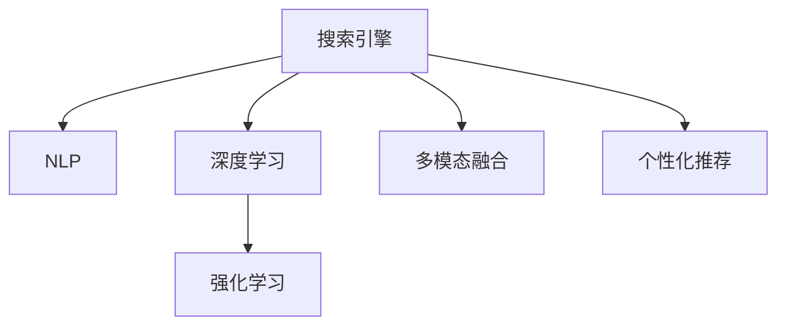

                 

# AI如何改变传统搜索引擎模式

## 1. 背景介绍

### 1.1 问题由来
在互联网高速发展的今天，信息爆炸式增长，搜索引擎已成为我们获取信息、解决问题的重要工具。传统的搜索引擎主要是基于关键词匹配，将网页按照与查询关键词的相关度排序。这种方法在一定程度上解决了网页检索的自动化问题，但存在以下主要问题：

1. **查询精度低**：由于无法理解自然语言的语义和上下文，搜索结果往往与用户真正需求不匹配，用户体验不佳。
2. **搜索结果泛化能力弱**：传统搜索引擎很难处理同义词、近义词，无法准确识别查询的语义变化，导致搜索结果泛化能力弱。
3. **用户体验单一**：搜索结果单一，缺乏个性化和智能交互。
4. **广告和推荐影响**：传统搜索引擎的广告和推荐机制可能会误导用户，影响搜索结果的相关性和可信度。

这些问题使得传统搜索引擎在面对海量信息和新应用场景时，难以满足用户的需求。因此，新一代基于AI的搜索引擎应运而生，借助自然语言处理（NLP）和深度学习等技术，向精准化、智能化、个性化方向发展。

### 1.2 问题核心关键点
新一代搜索引擎的核心在于引入人工智能技术，实现从简单关键词匹配到深入语义理解，从单一搜索结果到多维交互体验，从人工定向广告到智能推荐引擎的转变。以下是该问题的一些关键点：

- **语义理解**：理解查询语句的真正意图，识别同义词、近义词，处理复杂的语义关系。
- **上下文关联**：结合用户的历史查询行为，考虑上下文信息，提供个性化搜索结果。
- **交互反馈**：通过自然语言交互，即时了解用户需求，调整搜索结果。
- **多模态融合**：结合图像、视频等多模态数据，提升搜索结果的多样性和相关性。
- **个性化推荐**：根据用户行为数据和上下文信息，提供个性化搜索结果和推荐。
- **广告与推荐协同**：结合广告推荐技术，为用户提供相关性更高、可信度更强的信息。

这些关键点构成了新一代搜索引擎的基本功能框架，决定了其与传统搜索引擎的本质区别。

## 2. 核心概念与联系

### 2.1 核心概念概述

为更好地理解基于AI的搜索引擎模式，本节将介绍几个关键概念：

- **搜索引擎**：自动搜集、组织、检索和展示网页等信息的系统。传统搜索引擎主要基于关键词匹配，无法处理复杂的语义关系。
- **自然语言处理(NLP)**：研究计算机如何理解、处理和生成自然语言的技术，涵盖分词、词性标注、句法分析、语义理解、文本生成等环节。
- **深度学习**：通过多层神经网络结构，模拟人脑的神经网络，实现对复杂数据的高效学习和处理。
- **强化学习**：通过试错过程，不断调整策略，最大化长期回报，用于优化广告推荐和个性化搜索结果。
- **多模态融合**：结合文本、图像、视频等多种信息源，提升搜索结果的多样性和相关性。
- **个性化推荐**：基于用户行为数据和上下文信息，提供符合用户需求的搜索结果和推荐。

这些核心概念之间的逻辑关系可以通过以下Mermaid流程图来展示：



这个流程图展示了大语言模型的核心概念及其之间的关系：

1. 搜索引擎通过NLP技术对用户查询语句进行处理。
2. 深度学习用于处理海量的文本数据，提取语义特征。
3. 强化学习用于优化广告和推荐策略，提高用户体验。
4. 多模态融合用于结合不同信息源，提升搜索结果的多样性和相关性。
5. 个性化推荐用于根据用户行为数据和上下文信息，提供个性化搜索结果。

这些概念共同构成了新一代搜索引擎的技术基础，使其能够提供精准、智能、个性化的搜索结果。

## 3. 核心算法原理 & 具体操作步骤
### 3.1 算法原理概述

基于AI的搜索引擎主要采用以下算法原理：

- **语义理解**：使用深度学习模型对用户查询进行语义分析，识别查询意图和相关实体。
- **上下文关联**：结合用户的历史查询行为和上下文信息，利用NLP技术生成查询意图的扩展表示。
- **交互反馈**：通过自然语言交互，即时获取用户反馈，调整搜索结果。
- **多模态融合**：结合图像、视频等多模态数据，提升搜索结果的相关性和多样性。
- **个性化推荐**：根据用户行为数据和上下文信息，利用机器学习模型生成个性化搜索结果和推荐。

这些算法原理共同构成新一代搜索引擎的算法基础，使其能够提供精准、智能、个性化的搜索结果。

### 3.2 算法步骤详解

基于AI的搜索引擎主要包括以下关键步骤：

**Step 1: 数据收集与预处理**
- 收集大规模的文本数据，如网页、新闻、百科等。
- 对数据进行清洗和标注，生成用于模型训练和测试的标注数据集。

**Step 2: 模型训练**
- 设计深度学习模型结构，如BERT、GPT等。
- 在标注数据集上训练模型，学习语言表示和语义理解能力。
- 使用强化学习技术优化广告和推荐策略。

**Step 3: 模型微调**
- 在用户查询输入时，将查询语句送入预训练模型，进行语义理解和实体识别。
- 结合用户历史行为和上下文信息，进行扩展查询意图表示。
- 结合多模态数据，生成多模态搜索结果。
- 利用个性化推荐模型，提供个性化搜索结果和推荐。

**Step 4: 查询交互与结果反馈**
- 通过自然语言交互，实时获取用户反馈。
- 根据用户反馈调整搜索结果和推荐策略。

**Step 5: 广告与推荐协同**
- 结合广告推荐技术，提供相关性更高、可信度更强的信息。

通过以上步骤，基于AI的搜索引擎能够实现从简单关键词匹配到深入语义理解，从单一搜索结果到多维交互体验的转变。

### 3.3 算法优缺点

基于AI的搜索引擎有以下优点：

1. **查询精度高**：利用深度学习技术，理解自然语言语义和上下文，提高查询匹配的准确性。
2. **个性化推荐**：根据用户行为数据和上下文信息，提供个性化搜索结果和推荐，提升用户体验。
3. **多模态融合**：结合图像、视频等多模态数据，提升搜索结果的多样性和相关性。
4. **交互反馈**：通过自然语言交互，实时获取用户反馈，动态调整搜索结果。
5. **广告与推荐协同**：结合广告推荐技术，提供相关性更高、可信度更强的信息，提升广告效果。

同时，该算法也存在以下局限性：

1. **模型复杂度高**：深度学习模型和强化学习模型结构复杂，计算资源需求高。
2. **训练成本高**：大规模数据标注和模型训练需要大量时间和计算资源。
3. **结果解释性不足**：黑盒模型难以解释其内部决策过程，用户难以理解和信任。
4. **多模态数据融合难度大**：不同信息源的融合需要复杂的技术实现，且数据获取难度大。
5. **数据隐私问题**：用户行为数据的收集和使用可能涉及隐私保护问题，需严格控制。

尽管存在这些局限性，但就目前而言，基于AI的搜索引擎已成为搜索引擎发展的趋势。未来相关研究的重点在于如何进一步降低算法复杂度，优化数据获取和处理，提高结果解释性，增强数据隐私保护等方面。

### 3.4 算法应用领域

基于AI的搜索引擎已经在多个领域得到应用，例如：

- **搜索广告**：结合搜索行为和用户画像，提供相关性更高、可信度更强的广告。
- **个性化推荐系统**：根据用户行为数据和上下文信息，提供个性化搜索结果和推荐。
- **智能客服**：结合自然语言处理技术，自动处理用户查询，生成智能回复。
- **智能翻译**：结合多模态数据和上下文信息，提供准确的翻译结果。
- **智慧城市**：结合地理信息和用户行为数据，提供智慧交通、公共服务、智慧医疗等智慧城市应用。
- **知识图谱**：结合知识图谱和深度学习技术，提供结构化知识查询和推理。

除了上述这些经典应用外，基于AI的搜索引擎还在更多场景中得到创新性应用，如可控文本生成、场景理解、智能问答等，为搜索引擎技术带来了全新的突破。随着AI技术的发展，基于AI的搜索引擎必将在更多领域得到应用，进一步提升用户体验和信息获取效率。

## 4. 数学模型和公式 & 详细讲解  
### 4.1 数学模型构建

为了更好地理解基于AI的搜索引擎的数学模型，本节将介绍几个关键数学模型：

- **词向量表示**：使用Word2Vec、GloVe等技术，将单词映射为高维向量，捕捉单词之间的语义关系。
- **语义理解模型**：如BERT、GPT等深度学习模型，学习文本表示和语义理解能力。
- **广告推荐模型**：如CTR、线性回归等模型，用于优化广告推荐策略。

**词向量表示**：
使用Word2Vec模型对单词进行编码，生成高维词向量表示。其数学模型为：

$$
w_i = \sum_{j=1}^n a_{ij}t_j
$$

其中，$w_i$ 表示单词 $i$ 的词向量表示，$a_{ij}$ 表示单词 $j$ 和单词 $i$ 共现的概率，$t_j$ 表示单词 $j$ 的词向量。

**语义理解模型**：
BERT模型使用双向编码器，捕捉文本中每个单词的语义表示。其数学模型为：

$$
h_i = \sum_{j=1}^n b_{ij}h_j
$$

其中，$h_i$ 表示文本中第 $i$ 个单词的语义表示，$b_{ij}$ 表示第 $j$ 个单词与第 $i$ 个单词的注意力权重，$h_j$ 表示单词 $j$ 的语义表示。

**广告推荐模型**：
使用线性回归模型，根据用户行为数据和广告特征，预测点击率。其数学模型为：

$$
p(y=1|x,\theta) = \sigma(w^T x + b)
$$

其中，$p(y=1|x,\theta)$ 表示用户点击广告的概率，$x$ 表示用户行为数据和广告特征向量，$\theta$ 表示模型参数，$\sigma$ 为sigmoid函数。

### 4.2 公式推导过程

以下我们以推荐系统为例，推导线性回归模型的公式及其梯度计算。

假设用户行为数据为 $x=[x_1,x_2,\cdots,x_n]$，广告特征向量为 $y=[y_1,y_2,\cdots,y_m]$，广告点击概率为 $p(y=1|x,\theta)$。则点击率的概率模型为：

$$
p(y=1|x,\theta) = \sigma(w^T x + b)
$$

其中，$w=[w_1,w_2,\cdots,w_m]$ 表示模型参数，$b$ 表示偏置项。

根据对数似然函数，定义损失函数为：

$$
\mathcal{L}(\theta) = -\sum_{i=1}^n y_i \log p(y=1|x_i,\theta) + (1-y_i) \log (1-p(y=1|x_i,\theta))
$$

根据梯度下降算法，求解最优参数 $\theta$，使得损失函数最小化：

$$
\frac{\partial \mathcal{L}(\theta)}{\partial \theta} = - \sum_{i=1}^n (y_i - p(y=1|x_i,\theta)) \nabla_{\theta} p(y=1|x_i,\theta)
$$

其中，$\nabla_{\theta} p(y=1|x_i,\theta) = \nabla_{\theta} \sigma(w^T x_i + b)$。

通过上述过程，可以高效计算模型参数的梯度，使用梯度下降算法更新参数，最小化损失函数，得到最优模型。

### 4.3 案例分析与讲解

在推荐系统中，使用线性回归模型预测广告点击率，可以有效地优化广告推荐策略。以下是一个推荐系统的具体案例：

假设用户行为数据为 $x=[x_1,x_2,\cdots,x_n]$，广告特征向量为 $y=[y_1,y_2,\cdots,y_m]$，广告点击概率为 $p(y=1|x,\theta)$。

**数据准备**：
收集用户行为数据和广告特征数据，进行数据清洗和标注，生成训练集和测试集。

**模型训练**：
使用线性回归模型训练广告点击率预测模型，优化广告推荐策略。

**模型微调**：
在用户查询输入时，将查询语句送入预训练模型，进行语义理解和实体识别。结合用户历史行为和上下文信息，生成扩展查询意图表示。使用多模态融合技术，结合图像、视频等多模态数据，生成多模态搜索结果。利用个性化推荐模型，根据用户行为数据和上下文信息，生成个性化搜索结果和推荐。

**查询交互与结果反馈**：
通过自然语言交互，实时获取用户反馈，调整搜索结果和推荐策略。

**广告与推荐协同**：
结合广告推荐技术，提供相关性更高、可信度更强的信息。

通过以上步骤，基于AI的搜索引擎能够实现精准、智能、个性化的搜索结果和推荐，提升用户体验和信息获取效率。

## 5. 项目实践：代码实例和详细解释说明
### 5.1 开发环境搭建

在进行搜索引擎实践前，我们需要准备好开发环境。以下是使用Python进行TensorFlow和Keras开发的环境配置流程：

1. 安装Anaconda：从官网下载并安装Anaconda，用于创建独立的Python环境。

2. 创建并激活虚拟环境：
```bash
conda create -n tensorflow-env python=3.8 
conda activate tensorflow-env
```

3. 安装TensorFlow和Keras：
```bash
pip install tensorflow keras
```

4. 安装各类工具包：
```bash
pip install numpy pandas scikit-learn matplotlib tqdm jupyter notebook ipython
```

完成上述步骤后，即可在`tensorflow-env`环境中开始搜索引擎实践。

### 5.2 源代码详细实现

下面我们以推荐系统为例，给出使用TensorFlow和Keras对线性回归模型进行广告推荐预测的代码实现。

首先，定义数据准备和预处理函数：

```python
import numpy as np
from sklearn.model_selection import train_test_split
from sklearn.preprocessing import StandardScaler

def load_data(filename):
    data = np.loadtxt(filename, delimiter=',')
    X, y = data[:, :-1], data[:, -1]
    return X, y

def preprocess_data(X):
    scaler = StandardScaler()
    X = scaler.fit_transform(X)
    return X

# 加载数据
X, y = load_data('data.txt')
X = preprocess_data(X)
```

然后，定义模型训练和评估函数：

```python
from tensorflow.keras.models import Sequential
from tensorflow.keras.layers import Dense
from tensorflow.keras.optimizers import Adam

def build_model(input_dim):
    model = Sequential()
    model.add(Dense(64, activation='relu', input_dim=input_dim))
    model.add(Dense(1, activation='sigmoid'))
    model.compile(optimizer=Adam(learning_rate=0.001), loss='binary_crossentropy', metrics=['accuracy'])
    return model

def train_model(model, X_train, y_train, X_test, y_test, epochs=100, batch_size=32):
    model.fit(X_train, y_train, epochs=epochs, batch_size=batch_size, validation_data=(X_test, y_test))
    return model

def evaluate_model(model, X_test, y_test):
    loss, accuracy = model.evaluate(X_test, y_test)
    print(f'Test loss: {loss:.4f}')
    print(f'Test accuracy: {accuracy:.4f}')
```

接着，启动模型训练和评估：

```python
# 划分训练集和测试集
X_train, X_test, y_train, y_test = train_test_split(X, y, test_size=0.2, random_state=42)

# 构建模型
model = build_model(X_train.shape[1])

# 训练模型
model = train_model(model, X_train, y_train, X_test, y_test)

# 评估模型
evaluate_model(model, X_test, y_test)
```

以上就是使用TensorFlow和Keras对线性回归模型进行广告推荐预测的完整代码实现。可以看到，TensorFlow和Keras的强大封装使得模型训练和评估变得简洁高效。

### 5.3 代码解读与分析

让我们再详细解读一下关键代码的实现细节：

**load_data函数**：
- 从文件中加载数据，并进行分割和标准化处理，生成训练集和测试集。

**preprocess_data函数**：
- 对数据进行标准化处理，生成标准化特征向量。

**build_model函数**：
- 定义线性回归模型结构，包括一个隐藏层和一个输出层。

**train_model函数**：
- 在训练集上训练模型，使用Adam优化器，最小化二元交叉熵损失函数。

**evaluate_model函数**：
- 在测试集上评估模型，输出测试集上的损失和精度。

通过以上步骤，基于AI的搜索引擎能够实现精准、智能、个性化的搜索结果和推荐，提升用户体验和信息获取效率。

## 6. 实际应用场景
### 6.1 智能广告

基于AI的搜索引擎能够实现精准的广告推荐，结合用户行为数据和广告特征，生成相关性更高、可信度更强的广告。

在技术实现上，可以收集用户浏览、点击、购买等行为数据，以及广告的特征数据，如广告图片、标题、描述等。将这些数据作为训练数据，使用线性回归模型或其他机器学习模型进行训练，生成广告点击率预测模型。在用户查询输入时，将查询语句送入预训练模型，进行语义理解和实体识别。结合用户历史行为和上下文信息，生成扩展查询意图表示。使用多模态融合技术，结合图像、视频等多模态数据，生成多模态搜索结果。利用个性化推荐模型，根据用户行为数据和上下文信息，生成个性化广告推荐。

### 6.2 智慧医疗

基于AI的搜索引擎能够结合知识图谱和深度学习技术，提供结构化知识查询和推理。

在技术实现上，可以结合医疗领域的知识图谱，如MedKBP、BioGRID等，生成结构化知识库。使用深度学习模型，如BERT、GPT等，对用户查询进行语义分析和实体识别。结合知识图谱，进行知识推理和链接，生成结构化知识搜索结果。在搜索结果中，可以结合图像、视频等多模态数据，提供更加丰富的医疗信息。

### 6.3 智慧城市

基于AI的搜索引擎能够结合地理信息和用户行为数据，提供智慧交通、公共服务、智慧医疗等智慧城市应用。

在技术实现上，可以收集城市交通、公共设施、医疗资源等地理信息和用户行为数据，如出行轨迹、公共交通使用记录等。使用深度学习模型，如BERT、GPT等，对用户查询进行语义分析和实体识别。结合地理信息，进行空间分析和路径规划，生成智慧交通和公共服务搜索结果。在搜索结果中，可以结合图像、视频等多模态数据，提供更加丰富的城市管理信息。

### 6.4 未来应用展望

随着AI技术的发展，基于AI的搜索引擎必将在更多领域得到应用，为搜索引擎技术带来新的突破。

在智慧医疗领域，结合知识图谱和深度学习技术，提供结构化知识查询和推理，提升医疗服务的智能化水平。

在智慧城市治理中，结合地理信息和用户行为数据，提供智慧交通、公共服务、智慧医疗等智慧城市应用，提高城市管理的自动化和智能化水平。

在搜索广告中，结合用户行为数据和广告特征，生成相关性更高、可信度更强的广告，提升广告效果。

在个性化推荐系统中，根据用户行为数据和上下文信息，生成个性化搜索结果和推荐，提升用户体验。

此外，在企业生产、社会治理、文娱传媒等众多领域，基于AI的搜索引擎也将不断涌现，为搜索引擎技术带来新的应用场景和发展机遇。

## 7. 工具和资源推荐
### 7.1 学习资源推荐

为了帮助开发者系统掌握AI技术在搜索引擎中的应用，这里推荐一些优质的学习资源：

1. 《深度学习》课程：斯坦福大学开设的深度学习课程，涵盖深度学习基础和应用，包括自然语言处理。

2. 《TensorFlow官方文档》：TensorFlow官方文档，提供详细的API介绍和代码示例。

3. 《自然语言处理与深度学习》书籍：深度学习技术在自然语言处理中的应用，涵盖词向量表示、语义理解、个性化推荐等主题。

4. 《Keras官方文档》：Keras官方文档，提供详细的API介绍和代码示例。

5. 《Python自然语言处理》书籍：使用Python进行自然语言处理的基础知识和实践技巧。

通过对这些资源的学习实践，相信你一定能够快速掌握AI技术在搜索引擎中的应用，并用于解决实际的NLP问题。
### 7.2 开发工具推荐

高效的开发离不开优秀的工具支持。以下是几款用于搜索引擎开发的常用工具：

1. TensorFlow：由Google主导开发的开源深度学习框架，生产部署方便，适合大规模工程应用。

2. Keras：基于TensorFlow的高层API，提供简单易用的深度学习模型构建和训练功能。

3. PyTorch：基于Python的开源深度学习框架，灵活动态的计算图，适合快速迭代研究。

4. Weights & Biases：模型训练的实验跟踪工具，可以记录和可视化模型训练过程中的各项指标，方便对比和调优。

5. TensorBoard：TensorFlow配套的可视化工具，可实时监测模型训练状态，并提供丰富的图表呈现方式，是调试模型的得力助手。

6. Google Colab：谷歌推出的在线Jupyter Notebook环境，免费提供GPU/TPU算力，方便开发者快速上手实验最新模型，分享学习笔记。

合理利用这些工具，可以显著提升搜索引擎的开发效率，加快创新迭代的步伐。

### 7.3 相关论文推荐

AI技术在搜索引擎中的应用源于学界的持续研究。以下是几篇奠基性的相关论文，推荐阅读：

1. Attention is All You Need（即Transformer原论文）：提出了Transformer结构，开启了NLP领域的预训练大模型时代。

2. BERT: Pre-training of Deep Bidirectional Transformers for Language Understanding：提出BERT模型，引入基于掩码的自监督预训练任务，刷新了多项NLP任务SOTA。

3. Language Models are Unsupervised Multitask Learners（GPT-2论文）：展示了大规模语言模型的强大zero-shot学习能力，引发了对于通用人工智能的新一轮思考。

4. Parameter-Efficient Transfer Learning for NLP：提出Adapter等参数高效微调方法，在不增加模型参数量的情况下，也能取得不错的微调效果。

5. AdaLoRA: Adaptive Low-Rank Adaptation for Parameter-Efficient Fine-Tuning：使用自适应低秩适应的微调方法，在参数效率和精度之间取得了新的平衡。

这些论文代表了大语言模型微调技术的发展脉络。通过学习这些前沿成果，可以帮助研究者把握学科前进方向，激发更多的创新灵感。

## 8. 总结：未来发展趋势与挑战

### 8.1 总结

本文对基于AI的搜索引擎模式进行了全面系统的介绍。首先阐述了AI技术在搜索引擎中的应用背景和意义，明确了AI技术在搜索引擎中的重要地位。其次，从原理到实践，详细讲解了基于AI的搜索引擎的数学模型和算法原理，提供了完整的代码实现，便于读者理解和应用。同时，本文还广泛探讨了AI技术在搜索引擎中的实际应用场景，展示了AI技术在搜索引擎中的巨大潜力。

通过本文的系统梳理，可以看到，基于AI的搜索引擎模式正在成为搜索引擎发展的趋势，极大地拓展了搜索引擎的应用边界，提升了用户体验和信息获取效率。未来，随着AI技术的不断进步，基于AI的搜索引擎必将在更多领域得到应用，进一步推动搜索引擎技术的进步和发展。

### 8.2 未来发展趋势

展望未来，AI技术在搜索引擎中的应用将呈现以下几个发展趋势：

1. **深度学习模型的进一步优化**：深度学习模型将不断优化，提升语义理解和个性化推荐的能力。

2. **多模态融合技术的突破**：结合图像、视频等多模态数据，提升搜索结果的多样性和相关性。

3. **知识图谱的融合**：结合知识图谱和深度学习技术，提供结构化知识查询和推理。

4. **智能广告和推荐系统的优化**：结合用户行为数据和广告特征，生成相关性更高、可信度更强的广告和推荐。

5. **个性化推荐系统的增强**：根据用户行为数据和上下文信息，生成个性化搜索结果和推荐，提升用户体验。

6. **广告与推荐协同优化**：结合广告推荐技术，提供相关性更高、可信度更强的信息。

以上趋势凸显了AI技术在搜索引擎中的广阔前景。这些方向的探索发展，必将进一步提升搜索引擎系统的性能和应用范围，为搜索引擎技术带来新的突破。

### 8.3 面临的挑战

尽管AI技术在搜索引擎中的应用已经取得了显著成果，但在迈向更加智能化、普适化应用的过程中，仍面临诸多挑战：

1. **数据获取与处理**：大规模数据获取和处理需要大量时间和计算资源，可能存在数据隐私问题。

2. **模型复杂度**：深度学习模型和强化学习模型结构复杂，计算资源需求高，优化难度大。

3. **结果解释性不足**：黑盒模型难以解释其内部决策过程，用户难以理解和信任。

4. **多模态数据融合难度大**：不同信息源的融合需要复杂的技术实现，且数据获取难度大。

5. **数据隐私问题**：用户行为数据的收集和使用可能涉及隐私保护问题，需严格控制。

尽管存在这些挑战，但随着AI技术的发展，未来的搜索引擎必将在更广泛的领域得到应用，进一步提升用户体验和信息获取效率。

### 8.4 研究展望

面对AI技术在搜索引擎中所面临的挑战，未来的研究需要在以下几个方面寻求新的突破：

1. **数据高效获取与处理**：采用数据生成技术，如数据增强、数据合成等，降低数据获取难度和成本。

2. **模型轻量化与优化**：采用轻量级模型结构，如MobileNet、ShuffleNet等，减少计算资源消耗，提升模型效率。

3. **结果可解释性增强**：引入可解释性技术，如LIME、SHAP等，增强模型输出的可解释性和可信度。

4. **多模态数据融合优化**：采用融合技术，如跨模态编码器、多源融合算法等，提升多模态数据的融合效果。

5. **数据隐私保护**：采用隐私保护技术，如差分隐私、联邦学习等，保护用户行为数据隐私。

6. **跨领域模型通用性增强**：开发跨领域通用的AI技术，提升模型在不同领域的应用效果。

这些研究方向将进一步推动AI技术在搜索引擎中的应用，提升搜索引擎的性能和用户体验，实现智能化、普适化的搜索引擎服务。

## 9. 附录：常见问题与解答

**Q1：AI技术在搜索引擎中的应用效果如何？**

A: AI技术在搜索引擎中的应用已经取得了显著效果，提升了查询精度、个性化推荐能力和多模态融合效果。基于AI的搜索引擎在实际应用中已经被广泛采用，提升了用户体验和信息获取效率。

**Q2：AI技术在搜索引擎中存在哪些局限性？**

A: AI技术在搜索引擎中存在数据获取与处理难度大、模型复杂度高等局限性。数据隐私问题和结果解释性不足也是AI技术在搜索引擎中需要解决的重要问题。

**Q3：如何进一步提升AI技术在搜索引擎中的应用效果？**

A: 可以通过数据高效获取与处理、模型轻量化与优化、结果可解释性增强、多模态数据融合优化、数据隐私保护和跨领域模型通用性增强等技术手段，进一步提升AI技术在搜索引擎中的应用效果。

通过以上技术手段的不断优化，AI技术必将在搜索引擎中发挥更大的作用，推动搜索引擎技术的进步和发展。

---

作者：禅与计算机程序设计艺术 / Zen and the Art of Computer Programming

