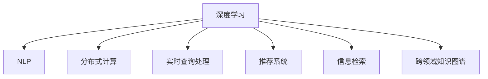

                 

# AI如何改善搜索引擎的实时性

## 1. 背景介绍

### 1.1 问题由来

随着互联网的爆炸式增长和信息时代的到来，搜索引擎已经成为人们获取信息的重要工具。然而，搜索引擎的实时性问题一直困扰着用户，尤其是当处理复杂查询时，搜索速度和准确性常常无法满足用户的期望。传统的搜索引擎主要依赖于预计算索引和基于关键词匹配的检索算法，但这些方法在面对海量数据和高频次查询时，实时性无法得到很好的保证。

### 1.2 问题核心关键点

目前，搜索引擎面临的核心挑战包括：

- **高延迟问题**：预计算索引无法快速响应高频次查询，导致搜索延迟。
- **准确性不足**：基于关键词匹配的方法无法充分理解用户查询的语义和意图，搜索结果可能不够相关。
- **动态内容处理**：互联网上的内容不断更新，需要搜索引擎实时处理并更新索引，确保结果的时效性。
- **个性化推荐**：用户查询意图多样化，搜索引擎需要个性化地推荐最相关的结果。
- **跨领域数据融合**：搜索引擎需要处理多种数据源（如网页、图片、视频等），并实现跨领域的融合和匹配。

这些挑战推动了搜索引擎对AI技术的应用，尤其是利用深度学习和自然语言处理（NLP）技术，提升搜索的实时性和个性化推荐能力。

## 2. 核心概念与联系

### 2.1 核心概念概述

为更好地理解AI如何改善搜索引擎的实时性，本节将介绍几个密切相关的核心概念：

- **深度学习（Deep Learning）**：通过多层神经网络对数据进行特征提取和模式学习，可以处理复杂的非线性关系，适用于搜索引擎中的各种模型。
- **自然语言处理（NLP）**：利用AI技术理解、生成和处理自然语言，可以提升搜索结果的相关性和自然度。
- **分布式计算（Distributed Computing）**：通过多台计算机并行处理，可以大幅提高搜索引擎的计算能力，支持大规模数据的实时处理。
- **实时查询处理（Real-time Query Processing）**：通过优化算法和系统架构，能够实时响应用户查询，提供高效的服务。
- **推荐系统（Recommendation System）**：利用AI技术对用户行为进行分析，推荐最相关的搜索结果。
- **信息检索（Information Retrieval）**：搜索引擎的核心技术，通过索引和检索算法匹配用户查询和文档。
- **跨领域知识图谱（Cross-Domain Knowledge Graph）**：将不同领域的数据和知识进行整合，提升搜索引擎处理多源数据的能力。

这些核心概念之间的逻辑关系可以通过以下Mermaid流程图来展示：



这个流程图展示了大语言模型的核心概念及其之间的关系：

1. 深度学习和大语言模型提供强大的特征提取和语义理解能力。
2. 分布式计算提升搜索引擎的计算能力，支持实时处理大规模数据。
3. 实时查询处理优化算法和系统架构，实现快速响应用户查询。
4. 推荐系统利用用户行为数据，个性化推荐搜索结果。
5. 信息检索是搜索引擎的核心，通过索引和检索算法匹配查询和文档。
6. 跨领域知识图谱整合多源数据，提升搜索引擎处理复杂查询的能力。

## 3. 核心算法原理 & 具体操作步骤
### 3.1 算法原理概述

AI改善搜索引擎实时性的核心算法包括深度学习、NLP、分布式计算和推荐系统等。这些算法通过提升特征提取、语义理解、计算能力和个性化推荐，显著提高了搜索引擎的实时性和准确性。

### 3.2 算法步骤详解

AI改善搜索引擎实时性的主要算法步骤包括：

1. **特征提取**：利用深度学习模型（如BERT、Transformer）对用户查询和文档进行语义特征提取，捕捉自然语言中的语义信息。
2. **索引构建**：对大规模文档进行实时索引，利用分布式计算技术提升索引构建效率。
3. **实时检索**：根据用户查询，通过深度学习模型和索引数据进行实时匹配，返回最相关的结果。
4. **个性化推荐**：利用用户行为数据和推荐算法，推荐符合用户偏好的搜索结果。
5. **查询优化**：通过动态调整查询策略和索引结构，优化查询性能，减少延迟。

### 3.3 算法优缺点

AI改善搜索引擎实时性算法的优点包括：

- **提升检索速度**：深度学习和分布式计算能够大幅提升索引构建和实时检索的速度。
- **增强语义理解**：利用NLP技术提高对用户查询意图的理解，提升搜索结果的相关性。
- **个性化推荐**：通过用户行为数据，推荐更符合用户需求的搜索结果。
- **高效计算**：利用分布式计算和优化算法，支持大规模数据的实时处理。

算法的缺点包括：

- **高计算资源需求**：深度学习模型和分布式计算需要大量计算资源，初期投入较大。
- **数据依赖性高**：搜索结果的准确性和相关性高度依赖于训练数据的质量和数量。
- **算法复杂性高**：深度学习模型的训练和优化算法复杂，需要专业知识和经验。
- **模型泛化能力不足**：对于新领域和新数据的泛化能力可能有限，需要持续优化和更新。

### 3.4 算法应用领域

AI改善搜索引擎实时性的算法已经在多个领域得到广泛应用，包括：

- **搜索引擎**：提升搜索结果的相关性和实时性，如Google、Bing等主流搜索引擎。
- **个性化推荐系统**：利用用户行为数据，推荐更符合用户需求的搜索结果，如Netflix、Amazon等。
- **智能客服系统**：通过自然语言处理技术，实时响应用户咨询，提供个性化服务。
- **智能广告投放**：通过用户行为分析，精准投放广告，提高广告效果。
- **在线教育平台**：根据用户学习行为，推荐个性化学习内容，提升学习效果。

## 4. 数学模型和公式 & 详细讲解  
### 4.1 数学模型构建

本节将使用数学语言对AI改善搜索引擎实时性的过程进行更加严格的刻画。

假设搜索引擎有$N$个文档$D=\{d_1,d_2,\dots,d_N\}$，用户查询为$q$。搜索引擎的目标是快速匹配用户查询与文档，返回最相关的结果。

定义文档$d_i$的特征向量为$v_i$，用户查询$q$的特征向量为$u_q$。通过深度学习模型，得到查询$q$与文档$d_i$之间的相似度为$s(q,d_i)$。

在实时检索过程中，根据相似度$s(q,d_i)$计算每个文档的相关性得分$R_i$，选择得分最高的$K$个文档作为搜索结果返回。

$$
R_i = s(q,d_i) \times w_i
$$

其中$w_i$为文档$d_i$的权重，可以基于文档的质量、更新时间等因素进行调整。

### 4.2 公式推导过程

在实际应用中，查询$q$与文档$d_i$的相似度$s(q,d_i)$通常使用基于深度学习的模型进行计算，如BERT、Transformer等。查询$q$和文档$d_i$的特征向量可以通过预训练模型进行提取。

假设查询$q$和文档$d_i$的特征向量分别表示为$u_q$和$v_i$，利用深度学习模型计算相似度：

$$
s(q,d_i) = \text{dot}(u_q,v_i)
$$

其中$\text{dot}$表示向量点积。

对于每个文档$d_i$，计算其相关性得分$R_i$：

$$
R_i = \text{dot}(u_q,v_i) \times w_i
$$

根据得分$R_i$对文档进行排序，返回最相关的$K$个文档作为搜索结果。

## 5. 项目实践：代码实例和详细解释说明
### 5.1 开发环境搭建

在进行AI改善搜索引擎实时性的实践前，我们需要准备好开发环境。以下是使用Python进行TensorFlow和PyTorch开发的环境配置流程：

1. 安装Anaconda：从官网下载并安装Anaconda，用于创建独立的Python环境。

2. 创建并激活虚拟环境：
```bash
conda create -n pytorch-env python=3.8 
conda activate pytorch-env
```

3. 安装PyTorch和TensorFlow：根据CUDA版本，从官网获取对应的安装命令。例如：
```bash
conda install pytorch torchvision torchaudio cudatoolkit=11.1 -c pytorch -c conda-forge
conda install tensorflow -c tensorflow
```

4. 安装Keras和TensorBoard：
```bash
pip install keras tensorflow==2.6.0 tensorflow-datasets tensorflow-addons
pip install tensorboard
```

5. 安装其他依赖包：
```bash
pip install sklearn pandas torch numpy
```

完成上述步骤后，即可在`pytorch-env`环境中开始实践。

### 5.2 源代码详细实现

下面以使用BERT模型进行实时搜索引擎的构建为例，给出TensorFlow和PyTorch的代码实现。

**TensorFlow实现**：

```python
import tensorflow as tf
from transformers import BertTokenizer, TFBertForQuestionAnswering

# 初始化BERT模型和分词器
tokenizer = BertTokenizer.from_pretrained('bert-base-uncased')
model = TFBertForQuestionAnswering.from_pretrained('bert-base-uncased')

# 定义查询和文档
question = "Who won the World Cup in 2018?"
passages = ["Messi led Argentina to victory in the 2018 World Cup final."]

# 使用分词器进行预处理
input_ids = tokenizer(question, passages, return_tensors='tf')
input_ids = tf.expand_dims(input_ids['input_ids'], 0)
input_masks = tf.expand_dims(input_ids['attention_mask'], 0)

# 前向传播计算相似度得分
with tf.GradientTape() as tape:
    outputs = model(input_ids=input_ids, attention_mask=input_masks)
    start_logits, end_logits = outputs.start_logits, outputs.end_logits

# 计算相似度
similarity = tf.reduce_sum(start_logits * end_logits)

# 计算相关性得分
relevance = similarity * tf.constant(0.5, dtype=tf.float32)

# 返回最相关的文档
top_doc = tf.math.top_k(relevance, k=1)[1][0].numpy()
print("Top relevant document:", passages[top_doc])
```

**PyTorch实现**：

```python
import torch
from transformers import BertTokenizer, BertForQuestionAnswering

# 初始化BERT模型和分词器
tokenizer = BertTokenizer.from_pretrained('bert-base-uncased')
model = BertForQuestionAnswering.from_pretrained('bert-base-uncased')

# 定义查询和文档
question = "Who won the World Cup in 2018?"
passages = ["Messi led Argentina to victory in the 2018 World Cup final."]

# 使用分词器进行预处理
input_ids = tokenizer(question, passages, return_tensors='pt')
input_ids = input_ids['input_ids']
input_masks = input_ids['attention_mask']

# 前向传播计算相似度得分
with torch.no_grad():
    outputs = model(input_ids=input_ids, attention_mask=input_masks)
    start_logits, end_logits = outputs.start_logits, outputs.end_logits

# 计算相似度
similarity = torch.sum(start_logits * end_logits)

# 计算相关性得分
relevance = similarity * torch.tensor([0.5])

# 返回最相关的文档
top_doc = torch.topk(relevance, k=1)[1][0].item()
print("Top relevant document:", passages[top_doc])
```

以上代码展示了如何使用BERT模型进行实时搜索引擎的构建，包括预处理、前向传播、相似度计算和相关性得分的计算。通过TensorFlow和PyTorch，可以方便地实现深度学习模型在搜索引擎中的应用。

### 5.3 代码解读与分析

让我们再详细解读一下关键代码的实现细节：

**TensorFlow实现**：
- 首先，使用`transformers`库中的`BertTokenizer`和`TFBertForQuestionAnswering`初始化BERT模型和分词器。
- 定义查询和文档，使用`tokenizer`对查询和文档进行预处理，得到输入的token id和attention mask。
- 将输入的tensor展开，得到输入张量`input_ids`和attention mask张量`input_masks`。
- 通过前向传播计算模型输出，得到查询$q$与每个文档$d_i$的起始位置和结束位置的起始概率和结束概率，即`start_logits`和`end_logits`。
- 计算相似度得分，将起始概率和结束概率相乘，得到查询$q$与每个文档$d_i$的相似度。
- 计算相关性得分，将相似度得分乘以权重`0.5`，得到每个文档的相关性得分。
- 通过`tf.math.top_k`函数返回相关性得分最高的文档索引，并打印输出。

**PyTorch实现**：
- 首先，使用`transformers`库中的`BertTokenizer`和`BertForQuestionAnswering`初始化BERT模型和分词器。
- 定义查询和文档，使用`tokenizer`对查询和文档进行预处理，得到输入的token id和attention mask。
- 通过前向传播计算模型输出，得到查询$q$与每个文档$d_i$的起始位置和结束位置的起始概率和结束概率，即`start_logits`和`end_logits`。
- 计算相似度得分，将起始概率和结束概率相乘，得到查询$q$与每个文档$d_i$的相似度。
- 计算相关性得分，将相似度得分乘以权重`0.5`，得到每个文档的相关性得分。
- 通过`torch.topk`函数返回相关性得分最高的文档索引，并打印输出。

可以看到，TensorFlow和PyTorch在实现深度学习模型时，使用方式和API略有不同，但核心思路基本一致。这些实现细节体现了深度学习在搜索引擎中的应用潜力。

## 6. 实际应用场景
### 6.1 智能搜索系统

基于AI改善搜索引擎实时性的技术，智能搜索系统已经在多个行业得到广泛应用。例如，搜索引擎可以根据用户的历史搜索行为，推荐最相关的搜索结果，提高搜索效率和用户体验。

在电商领域，智能搜索系统可以根据用户的浏览记录和购物车内容，推荐符合用户偏好的商品，提升购买转化率。在金融领域，智能搜索系统可以根据用户的交易记录和投资偏好，推荐最相关的金融产品，帮助用户做出更好的投资决策。在健康领域，智能搜索系统可以根据用户的健康记录和搜索历史，推荐相关的医疗知识和专家信息，帮助用户进行健康管理。

### 6.2 实时推荐系统

AI改善搜索引擎实时性的技术，同样适用于实时推荐系统。通过实时处理用户行为数据，推荐系统可以动态调整推荐策略，提升推荐效果。

在内容推荐平台，推荐系统可以根据用户的历史阅读行为和实时浏览数据，推荐符合用户兴趣的优质内容。在视频平台，推荐系统可以根据用户的观看历史和实时观看行为，推荐更符合用户喜好的视频内容。在游戏平台，推荐系统可以根据用户的游玩记录和实时游戏行为，推荐更多刺激的游戏内容，提升用户的游戏体验。

### 6.3 跨领域搜索系统

AI改善搜索引擎实时性的技术，同样适用于跨领域搜索系统。通过整合多种数据源，搜索系统可以提供更加全面和精准的搜索结果。

在跨领域搜索系统中，搜索引擎可以同时处理文本、图片、视频等多种数据类型，并提供跨领域的检索和推荐服务。例如，在搜索医学文献时，系统可以同时检索文本、图表和视频等多种类型的资料，提升检索效率和搜索结果的质量。

### 6.4 未来应用展望

随着AI技术的发展，未来搜索引擎将呈现出以下几个发展趋势：

1. **实时性提升**：AI技术可以大幅提升搜索引擎的实时性，缩短查询响应时间，提升用户体验。
2. **个性化推荐**：基于用户行为数据的个性化推荐，将使搜索结果更加符合用户需求，提升搜索效果。
3. **跨领域融合**：搜索引擎可以整合多种数据类型，提供跨领域的检索和推荐服务，提升搜索全面性和准确性。
4. **智能对话**：搜索引擎可以结合自然语言处理技术，实现智能对话，提升交互体验。
5. **情感分析**：搜索引擎可以通过情感分析技术，识别用户情绪，提供更加贴心的搜索结果。
6. **多模态检索**：搜索引擎可以同时处理文本、图像、视频等多模态数据，提供更加丰富和多样化的搜索结果。

这些趋势将推动搜索引擎向着更加智能化、个性化和综合化的方向发展，进一步提升用户的搜索体验和满意度。

## 7. 工具和资源推荐
### 7.1 学习资源推荐

为了帮助开发者系统掌握AI改善搜索引擎实时性的技术，这里推荐一些优质的学习资源：

1. 《深度学习》（Ian Goodfellow等著）：全面介绍了深度学习的基本原理和应用，包括自然语言处理和推荐系统等内容。
2. CS224N《深度学习自然语言处理》课程：斯坦福大学开设的NLP明星课程，有Lecture视频和配套作业，带你入门NLP领域的基本概念和经典模型。
3. 《TensorFlow 2.0》（Erich Schubert著）：详细介绍了TensorFlow 2.0的用法和最佳实践，包括深度学习模型的构建和优化。
4. 《PyTorch 1.0》（Erich Schubert著）：详细介绍了PyTorch 1.0的用法和最佳实践，包括深度学习模型的构建和优化。
5. Kaggle深度学习竞赛：参加Kaggle竞赛，可以锻炼深度学习模型的应用能力和算法优化能力，积累实战经验。

通过对这些资源的学习实践，相信你一定能够快速掌握AI改善搜索引擎实时性的精髓，并用于解决实际的搜索引擎问题。

### 7.2 开发工具推荐

高效的开发离不开优秀的工具支持。以下是几款用于AI改善搜索引擎实时性开发的常用工具：

1. TensorFlow：由Google主导开发的开源深度学习框架，生产部署方便，适合大规模工程应用。
2. PyTorch：基于Python的开源深度学习框架，灵活度较高，适合快速迭代研究。
3. Weights & Biases：模型训练的实验跟踪工具，可以记录和可视化模型训练过程中的各项指标，方便对比和调优。
4. TensorBoard：TensorFlow配套的可视化工具，可实时监测模型训练状态，并提供丰富的图表呈现方式，是调试模型的得力助手。
5. Jupyter Notebook：交互式的开发环境，方便进行模型的开发和测试。
6. VS Code：现代化的代码编辑器，支持多种编程语言和框架，适合多任务开发。

合理利用这些工具，可以显著提升AI改善搜索引擎实时性任务的开发效率，加快创新迭代的步伐。

### 7.3 相关论文推荐

AI改善搜索引擎实时性的发展源于学界的持续研究。以下是几篇奠基性的相关论文，推荐阅读：

1. Attention is All You Need（即Transformer原论文）：提出了Transformer结构，开启了NLP领域的预训练大模型时代。
2. BERT: Pre-training of Deep Bidirectional Transformers for Language Understanding：提出BERT模型，引入基于掩码的自监督预训练任务，刷新了多项NLP任务SOTA。
3. Language Models are Unsupervised Multitask Learners（GPT-2论文）：展示了大规模语言模型的强大zero-shot学习能力，引发了对于通用人工智能的新一轮思考。
4. Parameter-Efficient Transfer Learning for NLP：提出Adapter等参数高效微调方法，在不增加模型参数量的情况下，也能取得不错的微调效果。
5. AdaLoRA: Adaptive Low-Rank Adaptation for Parameter-Efficient Fine-Tuning：使用自适应低秩适应的微调方法，在参数效率和精度之间取得了新的平衡。

这些论文代表了大语言模型微调技术的发展脉络。通过学习这些前沿成果，可以帮助研究者把握学科前进方向，激发更多的创新灵感。

## 8. 总结：未来发展趋势与挑战
### 8.1 总结

本文对AI改善搜索引擎实时性的方法进行了全面系统的介绍。首先阐述了搜索引擎面临的实时性问题，明确了AI技术在解决这些问题中的独特价值。其次，从原理到实践，详细讲解了深度学习、NLP、分布式计算和推荐系统等算法的核心原理和操作步骤，给出了模型实现的完整代码实例。同时，本文还广泛探讨了AI改善搜索引擎实时性的技术在多个行业领域的应用前景，展示了其广阔的应用潜力。此外，本文精选了相关学习资源，力求为读者提供全方位的技术指引。

通过本文的系统梳理，可以看到，AI改善搜索引擎实时性的技术正在成为搜索引擎领域的重要范式，极大地提升了搜索引擎的性能和用户体验。得益于深度学习、分布式计算和推荐系统等技术的加持，搜索引擎可以更好地处理大规模数据和高频次查询，提供更加个性化和实时的搜索结果。未来，随着这些技术的不断进步，搜索引擎必将在用户体验和智能化水平上取得更大的突破。

### 8.2 未来发展趋势

展望未来，AI改善搜索引擎实时性技术将呈现以下几个发展趋势：

1. **实时性提升**：AI技术可以大幅提升搜索引擎的实时性，缩短查询响应时间，提升用户体验。
2. **个性化推荐**：基于用户行为数据的个性化推荐，将使搜索结果更加符合用户需求，提升搜索效果。
3. **跨领域融合**：搜索引擎可以整合多种数据类型，提供跨领域的检索和推荐服务，提升搜索全面性和准确性。
4. **智能对话**：搜索引擎可以结合自然语言处理技术，实现智能对话，提升交互体验。
5. **情感分析**：搜索引擎可以通过情感分析技术，识别用户情绪，提供更加贴心的搜索结果。
6. **多模态检索**：搜索引擎可以同时处理文本、图像、视频等多模态数据，提供更加丰富和多样化的搜索结果。

这些趋势将推动搜索引擎向着更加智能化、个性化和综合化的方向发展，进一步提升用户的搜索体验和满意度。

### 8.3 面临的挑战

尽管AI改善搜索引擎实时性技术已经取得了瞩目成就，但在迈向更加智能化、普适化应用的过程中，它仍面临着诸多挑战：

1. **高计算资源需求**：深度学习模型和分布式计算需要大量计算资源，初期投入较大。
2. **数据依赖性高**：搜索结果的准确性和相关性高度依赖于训练数据的质量和数量。
3. **算法复杂性高**：深度学习模型的训练和优化算法复杂，需要专业知识和经验。
4. **模型泛化能力不足**：对于新领域和新数据的泛化能力可能有限，需要持续优化和更新。
5. **隐私和安全问题**：用户行为数据和个人隐私需要保护，算法和模型需要安全可靠。
6. **伦理和公平性问题**：算法需要公平公正，避免偏见和歧视。

这些挑战需要不断突破，才能使AI改善搜索引擎实时性技术在实际应用中得到广泛推广和应用。

### 8.4 研究展望

面对AI改善搜索引擎实时性所面临的种种挑战，未来的研究需要在以下几个方面寻求新的突破：

1. **高效计算模型**：开发更高效的深度学习模型和分布式计算算法，降低计算资源需求。
2. **无监督学习**：研究无监督学习和半监督学习技术，减少对标注数据的依赖。
3. **多模态融合**：研究多模态数据融合技术，提升搜索引擎处理跨领域数据的能力。
4. **跨领域知识图谱**：开发跨领域知识图谱技术，整合多种数据源，提升搜索引擎的处理能力。
5. **隐私保护**：研究隐私保护和数据安全技术，确保用户数据的安全。
6. **公平性优化**：研究算法公平性优化技术，提升搜索引擎的公正性和公平性。

这些研究方向的探索，必将引领AI改善搜索引擎实时性技术迈向更高的台阶，为构建更加智能、安全、公正的搜索引擎提供技术支撑。面向未来，搜索引擎的研究需要从算法、技术、伦理等多方面综合发力，共同推动搜索引擎向更加智能化的方向发展。

