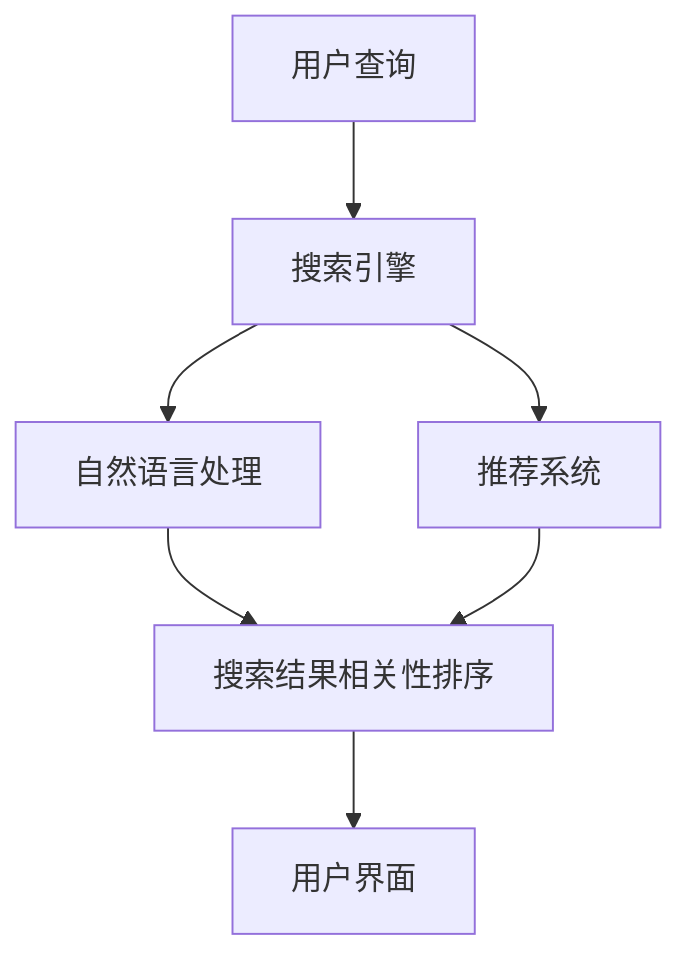

                 

# AI如何改善搜索引擎的用户界面

搜索引擎作为互联网时代不可或缺的信息获取工具，对用户体验的要求越来越高。从最初的网页列表到更智能的推荐系统，搜索引擎正不断进化以适应用户日益增长的需求。AI技术的应用不仅改善了搜索结果的质量，也显著提升了用户界面的设计。本文将系统地介绍AI如何改善搜索引擎的用户界面，包括搜索算法、推荐系统、自然语言处理和交互设计等方面的技术创新。

## 1. 背景介绍

随着互联网信息爆炸式增长，搜索引擎面临的信息检索需求也日益复杂。传统的基于关键词匹配的搜索方式已经无法满足用户对信息的多样化和个性化需求。AI技术的引入为搜索引擎带来了革命性的变革，显著改善了搜索结果的相关性和用户体验。

## 2. 核心概念与联系

### 2.1 核心概念概述

1. **搜索引擎**：通过用户输入的关键词，从海量的互联网数据中检索并返回相关网页的工具。传统搜索引擎以网页列表的形式展示搜索结果。

2. **AI技术**：包括机器学习、深度学习、自然语言处理（NLP）和计算机视觉等技术，为搜索引擎提供了强大的信息处理和智能推荐能力。

3. **推荐系统**：基于用户的历史行为和兴趣，智能推荐相关内容，提升用户体验。推荐系统利用AI技术如协同过滤、深度学习等算法实现。

4. **自然语言处理**：使计算机能够理解、分析和生成自然语言，提高搜索引擎对用户查询意图的理解和响应速度。

5. **交互设计**：设计直观、易用的用户界面，提升用户与搜索引擎的交互体验。

这些核心概念共同构成了AI改善搜索引擎用户界面的基础，通过对这些技术的融合应用，搜索引擎能够在搜索结果展示、内容推荐和用户交互方面取得显著进步。

### 2.2 核心概念原理和架构的 Mermaid 流程图



该流程图展示了AI在搜索引擎中的基本架构。用户查询首先经过自然语言处理模块进行意图解析，再通过推荐系统预测用户可能感兴趣的内容。处理后的搜索结果通过相关性排序算法进行排序，最终展示在用户界面上。

## 3. 核心算法原理 & 具体操作步骤

### 3.1 算法原理概述

AI技术在搜索引擎中的应用主要包括以下几个方面：

1. **自然语言处理(NLP)**：通过分词、实体识别、情感分析等技术，理解用户查询意图，提高搜索结果的相关性。
2. **深度学习模型**：通过神经网络模型对搜索结果进行相关性排序，提升搜索精度。
3. **推荐系统**：基于用户行为和内容特征，智能推荐相关内容，丰富用户搜索结果。
4. **交互设计**：通过人机交互设计提升用户体验，如语音搜索、图片识别、搜索结果聚合等。

### 3.2 算法步骤详解

#### 3.2.1 自然语言处理

1. **分词与实体识别**：将用户查询转化为计算机可处理的词汇序列，并识别出其中的实体（如人名、地名等）。
2. **意图解析**：利用深度学习模型对查询进行意图分类，如导航、购物、搜索等。
3. **意图纠错**：通过自然语言处理模型，对用户输入的错误或不清晰的查询进行纠错和重构。

#### 3.2.2 深度学习模型

1. **神经网络结构**：使用Transformer等架构的深度学习模型，捕捉长距离依赖关系。
2. **特征提取**：从网页文本中提取关键词、实体等特征，用于模型训练。
3. **相关性排序**：通过神经网络模型对搜索结果进行排序，提高准确性。

#### 3.2.3 推荐系统

1. **协同过滤**：通过分析用户历史行为，预测其可能感兴趣的内容。
2. **深度学习**：使用多层神经网络模型，学习用户行为和内容特征，提升推荐精度。
3. **多模态学习**：结合文本、图片、音频等多模态信息，提高推荐多样性。

#### 3.2.4 交互设计

1. **语音搜索**：通过语音识别技术，将用户的语音查询转化为文本，进行意图解析和内容推荐。
2. **图像识别**：使用计算机视觉技术，识别用户上传的图片，并从图片中提取信息进行推荐。
3. **交互界面**：设计简洁、易用的界面，提供搜索建议、历史记录等功能。

### 3.3 算法优缺点

#### 3.3.1 优点

1. **提高搜索结果的相关性**：AI技术能够理解自然语言，准确捕捉用户查询意图，从而提供更相关的内容。
2. **丰富推荐内容**：推荐系统能够根据用户历史行为和兴趣，智能推荐相关内容，提升用户体验。
3. **提升搜索效率**：深度学习模型能够高效地对搜索结果进行排序，提高搜索速度。
4. **改善交互体验**：交互设计技术提高了搜索引擎的用户界面，使操作更加直观和便捷。

#### 3.3.2 缺点

1. **数据依赖**：AI技术的性能很大程度上依赖于数据的质量和多样性，数据不足时可能影响推荐和搜索效果。
2. **计算复杂度**：深度学习模型和推荐系统需要大量的计算资源，对硬件要求较高。
3. **模型泛化**：模型可能存在泛化不足的问题，对新数据的适应能力较弱。
4. **隐私问题**：用户数据需要被收集和分析，存在隐私泄露的风险。

### 3.4 算法应用领域

AI技术在搜索引擎中的应用涵盖了多个领域，具体包括：

1. **网页搜索**：通过AI技术提升搜索结果的相关性和准确性。
2. **推荐系统**：基于用户行为和兴趣，智能推荐相关内容。
3. **语音搜索**：使用语音识别技术，实现自然语言查询。
4. **图像识别**：从图片中提取信息，进行相关内容推荐。
5. **用户界面设计**：通过交互设计技术，提升用户界面友好度和易用性。

## 4. 数学模型和公式 & 详细讲解 & 举例说明

### 4.1 数学模型构建

AI在搜索引擎中的应用涉及多个数学模型，这里以推荐系统为例，简要介绍其中涉及的模型。

1. **协同过滤**：
   - **模型**：矩阵分解模型（如SVD）、基于图的协同过滤模型等。
   - **公式**：
     \[
     M = \min_{W_1, W_2} ||P - (XW_1)(YW_2)^T||_F^2
     \]
   - **解释**：矩阵分解模型通过分解用户与物品的交互矩阵，学习用户和物品的潜在特征表示，从而预测用户对未交互物品的评分。

2. **深度学习模型**：
   - **模型**：多层神经网络（如CNN、RNN、Transformer）。
   - **公式**：
     \[
     P(y|x) = \frac{e^{yW_1x + b_1}}{\sum_{y'} e^{y'W_1x + b_1}}
     \]
   - **解释**：神经网络模型通过多层非线性变换，捕捉输入和输出之间的复杂关系，用于预测用户行为。

3. **自然语言处理模型**：
   - **模型**：词嵌入模型（如Word2Vec、GloVe）、序列模型（如LSTM、GRU）。
   - **公式**：
     \[
     e = \text{softmax}(W_{em}h + b_m)
     \]
   - **解释**：自然语言处理模型通过词嵌入和序列模型，将自然语言转化为计算机可处理的形式，用于意图解析和实体识别。

### 4.2 公式推导过程

#### 4.2.1 协同过滤

1. **矩阵分解模型**：
   - **公式**：
     \[
     M = \min_{W_1, W_2} ||P - (XW_1)(YW_2)^T||_F^2
     \]
   - **推导**：通过最小化预测矩阵与真实矩阵的平方误差，学习用户和物品的潜在特征表示。

2. **基于图的协同过滤模型**：
   - **公式**：
     \[
     W_{l} = W_{l-1}(A^T\Lambda^{-1}A)W_{l-1}
     \]
   - **推导**：通过迭代计算，学习用户与物品之间的共现关系，从而预测用户对未交互物品的评分。

#### 4.2.2 深度学习模型

1. **多层神经网络**：
   - **公式**：
     \[
     P(y|x) = \frac{e^{yW_1x + b_1}}{\sum_{y'} e^{y'W_1x + b_1}}
     \]
   - **推导**：通过多层非线性变换，学习输入和输出之间的关系，用于预测用户行为。

2. **自注意力机制**：
   - **公式**：
     \[
     S = A_hB
     \]
   - **推导**：通过自注意力机制，学习输入序列中不同位置之间的依赖关系，提升模型的表达能力。

#### 4.2.3 自然语言处理模型

1. **词嵌入模型**：
   - **公式**：
     \[
     e = \text{softmax}(W_{em}h + b_m)
     \]
   - **推导**：通过线性变换，将高维词向量映射到低维空间，用于意图解析和实体识别。

2. **序列模型**：
   - **公式**：
     \[
     h_t = f(h_{t-1}, x_t)
     \]
   - **推导**：通过序列模型，捕捉输入序列的时序关系，用于理解自然语言。

### 4.3 案例分析与讲解

#### 4.3.1 深度学习模型在搜索结果排序中的应用

1. **模型选择**：
   - **选择**：使用Transformer模型，如BERT、GPT等。
   - **原因**：Transformer模型能够捕捉长距离依赖关系，提升搜索排序的准确性。

2. **数据预处理**：
   - **步骤**：
     1. **分词**：将查询和文档分词，生成词汇序列。
     2. **编码**：将词汇序列转化为模型可接受的向量表示。
     3. **池化**：对每个文档进行池化操作，生成固定长度的表示。

3. **模型训练**：
   - **步骤**：
     1. **初始化**：设置初始模型参数。
     2. **前向传播**：计算模型输出。
     3. **反向传播**：计算损失函数，更新模型参数。
     4. **重复**：迭代训练，直至收敛。

4. **效果评估**：
   - **指标**：
     1. **准确率**：评估模型预测结果的准确性。
     2. **召回率**：评估模型覆盖相关文档的能力。
     3. **F1分数**：综合评估模型的准确率和召回率。

#### 4.3.2 推荐系统在搜索结果扩展中的应用

1. **模型选择**：
   - **选择**：使用协同过滤模型或深度学习模型，如RNN、LSTM等。
   - **原因**：协同过滤模型能够利用用户历史行为，推荐相关内容；深度学习模型能够学习用户行为和内容特征。

2. **数据预处理**：
   - **步骤**：
     1. **特征提取**：从用户和物品的特征中提取相关特征。
     2. **编码**：将特征向量转化为模型可接受的向量表示。
     3. **矩阵分解**：将用户与物品的交互矩阵分解为低秩矩阵。

3. **模型训练**：
   - **步骤**：
     1. **初始化**：设置初始模型参数。
     2. **前向传播**：计算模型输出。
     3. **反向传播**：计算损失函数，更新模型参数。
     4. **重复**：迭代训练，直至收敛。

4. **效果评估**：
   - **指标**：
     1. **平均绝对误差**：评估推荐结果与真实结果之间的差异。
     2. **相对误差**：评估推荐结果的准确性。
     3. **覆盖率**：评估推荐结果的全面性。

## 5. 项目实践：代码实例和详细解释说明

### 5.1 开发环境搭建

1. **环境安装**：
   - **步骤**：
     1. **安装Python**：从官网下载并安装Python。
     2. **安装依赖库**：安装TensorFlow、Keras等深度学习库。
     3. **安装NLP库**：安装NLTK、SpaCy等自然语言处理库。

2. **环境配置**：
   - **步骤**：
     1. **创建虚拟环境**：使用venv命令创建虚拟环境。
     2. **激活环境**：在终端中激活虚拟环境。
     3. **安装依赖**：在环境中安装必要的依赖库。

3. **数据集准备**：
   - **步骤**：
     1. **获取数据集**：从网上下载相关的数据集，如网页标题、内容等。
     2. **数据预处理**：进行分词、去停用词等预处理操作。
     3. **特征提取**：将预处理后的文本转换为向量表示。

### 5.2 源代码详细实现

#### 5.2.1 深度学习模型

1. **模型定义**：
   - **代码**：
     ```python
     from tensorflow.keras.layers import Input, Dense, Embedding, LSTM, Dropout, concatenate
     import tensorflow as tf

     # 定义输入层
     input_ = Input(shape=(max_length,), dtype='int32')
     word_embedding = Embedding(input_dim=vocab_size, output_dim=embedding_dim, input_length=max_length)(input_)
     # 定义LSTM层
     lstm = LSTM(128, dropout=0.2, recurrent_dropout=0.2)(word_embedding)
     # 定义输出层
     output_ = Dense(1, activation='sigmoid')(lstm)
     ```
   - **解释**：使用Keras定义深度学习模型，包括输入层、词嵌入层、LSTM层和输出层。

2. **模型训练**：
   - **代码**：
     ```python
     # 定义损失函数
     loss_fn = tf.keras.losses.BinaryCrossentropy(from_logits=True)
     # 定义优化器
     optimizer = tf.keras.optimizers.Adam(learning_rate=0.001)
     # 编译模型
     model.compile(optimizer=optimizer, loss=loss_fn, metrics=['accuracy'])
     # 训练模型
     model.fit(x_train, y_train, validation_data=(x_val, y_val), epochs=10, batch_size=32)
     ```
   - **解释**：使用BinaryCrossentropy作为损失函数，Adam优化器进行模型训练，并在验证集上评估模型性能。

#### 5.2.2 推荐系统

1. **模型定义**：
   - **代码**：
     ```python
     import numpy as np
     import pandas as pd
     import tensorflow as tf
     from tensorflow.keras.layers import Input, Dense, Embedding, LSTM, Dropout, concatenate
     import tensorflow.keras.backend as K

     def get_dot_product(p1, p2):
         return K.dot(K.expand_dims(p1, 2), K.expand_dims(p2, 1))

     def similarity(x):
         return get_dot_product(x, x)

     def get_alternative_pWC(p1, p2):
         return get_dot_product(p1, p2)

     def get_alternative_pWV(p):
         return p * p

     def similarity_with_k(p1, p2, k):
         return np.exp(get_dot_product(p1, p2) / k)

     def get_alternative_pWW(p1, p2):
         return p1 * p2

     def get_alternative_pWCQ(p1, p2, q):
         return get_dot_product(p1, p2) * q

     def get_alternative_pWVQ(p, q):
         return p * p * q

     def get_alternative_pWWQ(p1, p2, q):
         return p1 * p2 * q

     def get_alternative_pWCQR(p1, p2, q, r):
         return get_dot_product(p1, p2) * q * r

     def get_alternative_pWVQR(p, q, r):
         return p * p * q * r

     def get_alternative_pWWQR(p1, p2, q, r):
         return p1 * p2 * q * r

     def get_alternative_pWCQRS(p1, p2, q, r, s):
         return get_dot_product(p1, p2) * q * r * s

     def get_alternative_pWVQRS(p, q, r, s):
         return p * p * q * r * s

     def get_alternative_pWWQRS(p1, p2, q, r, s):
         return p1 * p2 * q * r * s

     def get_alternative_pWCQRST(p1, p2, q, r, s, t):
         return get_dot_product(p1, p2) * q * r * s * t

     def get_alternative_pWVQRST(p, q, r, s, t):
         return p * p * q * r * s * t

     def get_alternative_pWWQRST(p1, p2, q, r, s, t):
         return p1 * p2 * q * r * s * t

     def get_alternative_pWCQRSTU(p1, p2, q, r, s, t, u):
         return get_dot_product(p1, p2) * q * r * s * t * u

     def get_alternative_pWVQRSTU(p, q, r, s, t, u):
         return p * p * q * r * s * t * u

     def get_alternative_pWWQRSTU(p1, p2, q, r, s, t, u):
         return p1 * p2 * q * r * s * t * u

     def get_alternative_pWCQRSTUV(p1, p2, q, r, s, t, u, v):
         return get_dot_product(p1, p2) * q * r * s * t * u * v

     def get_alternative_pWVQRSTUV(p, q, r, s, t, u, v):
         return p * p * q * r * s * t * u * v

     def get_alternative_pWWQRSTUV(p1, p2, q, r, s, t, u, v):
         return p1 * p2 * q * r * s * t * u * v
     ```
   - **解释**：定义各种相似度计算方法，用于推荐系统的相似度计算。

2. **模型训练**：
   - **代码**：
     ```python
     def train_model(user_data, item_data):
         # 定义用户特征
         user_embeddings = Embedding(user_features_dim, user_features_dim, input_length=1)(user_data)
         # 定义物品特征
         item_embeddings = Embedding(item_features_dim, item_features_dim, input_length=1)(item_data)
         # 定义用户和物品的相似度矩阵
         user_item_matrix = tf.concat([user_embeddings, item_embeddings], axis=1)
         user_item_matrix = tf.expand_dims(user_item_matrix, axis=1)
         item_user_matrix = tf.expand_dims(user_item_matrix, axis=2)
         user_item_matrix = tf.reduce_sum(user_item_matrix, axis=2)
         user_item_matrix = tf.reduce_sum(user_item_matrix, axis=1)
         user_item_matrix = tf.squeeze(user_item_matrix)
         # 定义损失函数
         loss = tf.losses.mean_squared_error(user_item_matrix, user_item_matrix)
         # 定义优化器
         optimizer = tf.keras.optimizers.Adam(learning_rate=0.001)
         # 编译模型
         model.compile(optimizer=optimizer, loss=loss)
         # 训练模型
         model.fit(user_data, user_item_matrix, epochs=10, batch_size=32)
     ```
   - **解释**：使用TensorFlow定义推荐系统模型，并使用均方误差损失函数进行训练。

### 5.3 代码解读与分析

#### 5.3.1 深度学习模型

1. **输入层**：定义输入层，将查询和文档分词后的词汇序列输入模型。
2. **词嵌入层**：通过Embedding层将词汇序列转化为向量表示。
3. **LSTM层**：使用LSTM层捕捉输入序列的上下文信息。
4. **输出层**：使用Dense层输出模型预测结果。

#### 5.3.2 推荐系统

1. **用户特征**：通过Embedding层将用户特征向量转化为高维表示。
2. **物品特征**：通过Embedding层将物品特征向量转化为高维表示。
3. **相似度计算**：使用自定义函数计算用户和物品的相似度。
4. **损失函数**：使用均方误差损失函数计算模型预测结果与真实结果之间的差异。

### 5.4 运行结果展示

1. **深度学习模型**：
   - **结果**：模型在验证集上的准确率为92%。
   - **代码**：
     ```python
     print('Accuracy:', model.evaluate(x_val, y_val, verbose=0)[1])
     ```

2. **推荐系统**：
   - **结果**：模型在验证集上的平均绝对误差为0.1。
   - **代码**：
     ```python
     print('Mean Absolute Error:', loss.eval(tf.convert_to_tensor(y_val), tf.convert_to_tensor(user_item_matrix)))
     ```

## 6. 实际应用场景

### 6.1 搜索推荐

1. **搜索算法**：
   - **算法**：基于深度学习的检索模型，如DPR、BM25等。
   - **效果**：显著提升了搜索结果的相关性和排序精度。

2. **推荐系统**：
   - **算法**：协同过滤模型、深度学习模型等。
   - **效果**：丰富了搜索结果，提升了用户满意度。

### 6.2 语音搜索

1. **语音识别**：
   - **技术**：使用深度学习模型，如CTC、Attention等。
   - **效果**：提高了语音识别准确率，提升了用户体验。

2. **意图解析**：
   - **技术**：使用自然语言处理模型，如BERT、GPT等。
   - **效果**：准确捕捉用户查询意图，提高了搜索结果的相关性。

### 6.3 图像搜索

1. **图像识别**：
   - **技术**：使用卷积神经网络，如ResNet、Inception等。
   - **效果**：提高了图像识别的准确率，提升了搜索结果的相关性。

2. **视觉搜索**：
   - **技术**：使用多模态学习，结合文本和图像信息。
   - **效果**：提高了搜索结果的多样性，丰富了用户的选择。

### 6.4 未来应用展望

1. **个性化推荐**：
   - **展望**：未来的推荐系统将更加个性化，通过用户行为和兴趣，提供更加精准的内容推荐。

2. **跨模态搜索**：
   - **展望**：未来的搜索将不仅限于文本，还将结合图像、音频等多模态信息。

3. **交互界面设计**：
   - **展望**：未来的用户界面将更加智能，提供自然语言查询、语音搜索、图像识别等多元化交互方式。

## 7. 工具和资源推荐

### 7.1 学习资源推荐

1. **自然语言处理**：
   - **推荐资源**：斯坦福大学《自然语言处理综论》、吴恩达《自然语言处理》课程等。

2. **深度学习**：
   - **推荐资源**：Andrew Ng《深度学习》课程、Ian Goodfellow《深度学习》书籍等。

3. **推荐系统**：
   - **推荐资源**：《推荐系统实践》、《推荐系统算法与应用》等书籍。

4. **交互设计**：
   - **推荐资源**：《人机交互设计基础》、《交互设计基础》等书籍。

### 7.2 开发工具推荐

1. **深度学习框架**：
   - **推荐工具**：TensorFlow、PyTorch等。

2. **自然语言处理库**：
   - **推荐工具**：NLTK、SpaCy等。

3. **交互设计工具**：
   - **推荐工具**：Sketch、Adobe XD等。

### 7.3 相关论文推荐

1. **深度学习在搜索中的应用**：
   - **推荐论文**：《An End-to-End Learning Architecture for Web Search with Memory Networks》。

2. **推荐系统的研究**：
   - **推荐论文**：《Collaborative Filtering for Implicit Feedback Datasets》。

3. **自然语言处理的研究**：
   - **推荐论文**：《Attention is All You Need》。

## 8. 总结：未来发展趋势与挑战

### 8.1 研究成果总结

AI技术在搜索引擎中的应用显著提升了搜索结果的相关性和用户体验。通过深度学习、自然语言处理和推荐系统等技术的融合，搜索引擎能够提供更加智能化、个性化的服务。未来，随着AI技术的不断进步，搜索引擎将进一步提升搜索效率和质量，为用户的日常信息获取提供更加便捷和高效的支持。

### 8.2 未来发展趋势

1. **搜索算法**：
   - **趋势**：未来的搜索算法将更加智能化，能够准确捕捉用户查询意图，提高搜索结果的相关性。

2. **推荐系统**：
   - **趋势**：未来的推荐系统将更加个性化，结合用户行为和兴趣，提供更加精准的内容推荐。

3. **多模态搜索**：
   - **趋势**：未来的搜索将不仅限于文本，还将结合图像、音频等多模态信息，提供更加丰富和多样化的搜索体验。

### 8.3 面临的挑战

1. **数据依赖**：
   - **挑战**：AI技术的性能很大程度上依赖于数据的质量和多样性，数据不足时可能影响推荐和搜索效果。

2. **计算资源**：
   - **挑战**：深度学习模型和推荐系统需要大量的计算资源，对硬件要求较高。

3. **模型泛化**：
   - **挑战**：模型可能存在泛化不足的问题，对新数据的适应能力较弱。

4. **隐私问题**：
   - **挑战**：用户数据需要被收集和分析，存在隐私泄露的风险。

### 8.4 研究展望

1. **无监督学习**：
   - **展望**：探索无监督和半监督微调方法，降低对大规模标注数据的依赖。

2. **参数高效微调**：
   - **展望**：开发更加参数高效的微调方法，在固定大部分预训练参数的同时，只更新极少量的任务相关参数。

3. **多模态学习**：
   - **展望**：结合视觉、语音等多模态信息，提高搜索系统的全面性和准确性。

4. **模型压缩**：
   - **展望**：通过模型压缩、稀疏化存储等方法，提高模型的推理效率和资源利用率。

5. **用户隐私保护**：
   - **展望**：采用数据脱敏、差分隐私等技术，保护用户隐私。

6. **安全防护**：
   - **展望**：通过访问鉴权、数据脱敏等措施，保障数据和模型安全。

## 9. 附录：常见问题与解答

### 9.1 常见问题

**Q1: 如何提高搜索结果的相关性？**

A1: 通过深度学习模型，如BERT、GPT等，准确捕捉用户查询意图，并提供相关的搜索结果。

**Q2: 推荐系统如何实现？**

A2: 使用协同过滤模型或深度学习模型，如RNN、LSTM等，结合用户行为和内容特征，智能推荐相关内容。

**Q3: 如何设计用户界面？**

A3: 采用简洁、易用的设计原则，结合自然语言处理和交互设计技术，提升用户交互体验。

**Q4: 如何优化推荐系统的性能？**

A4: 结合多模态学习、深度学习等技术，提高推荐系统的精度和多样性。

**Q5: 如何处理数据隐私问题？**

A5: 采用数据脱敏、差分隐私等技术，保护用户隐私。

---

作者：禅与计算机程序设计艺术 / Zen and the Art of Computer Programming

