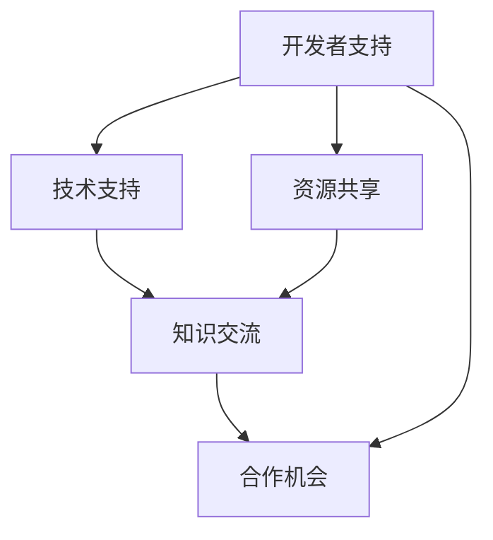

                 

## 1. 背景介绍

### 1.1 问题由来

随着人工智能（AI）技术的快速发展，AI开发者生态系统变得越来越重要。AI开发者不仅需要掌握先进的技术，还需要有良好的社区支持和丰富的资源共享。在AI领域，Lepton AI是一个非常活跃的社区，它汇聚了大量的AI开发者，提供了丰富的技术支持、资源共享和知识交流平台。

Lepton AI社区致力于为开发者提供一个高效、互动、开放的技术交流平台，旨在通过建立强大的开发者生态系统，推动AI技术的普及和应用。

### 1.2 问题核心关键点

Lepton AI社区的核心关键点包括：

- **开发者支持**：提供技术支持和资源共享，帮助开发者解决技术问题，提升技能。
- **知识交流**：通过博客、论坛、讲座、工作坊等多种形式，促进开发者之间的知识交流和技术分享。
- **合作机会**：促进开发者之间的合作，推动技术创新和应用实践。
- **资源整合**：整合各类AI资源，包括开源项目、论文、代码、数据集等，便于开发者快速获取和使用。

### 1.3 问题研究意义

Lepton AI社区的建设对于提升AI技术的普及和应用，推动行业创新，具有重要意义：

- **加速技术普及**：通过提供丰富的学习资源和支持，加速AI技术的普及和应用。
- **促进合作与创新**：通过交流和合作，促进开发者之间的技术创新和应用实践。
- **提升行业水平**：通过知识和经验的分享，提升整个行业的技术水平和应用能力。
- **增强竞争力**：通过丰富的资源和合作机会，增强开发者的竞争力，促进企业发展。

## 2. 核心概念与联系

### 2.1 核心概念概述

Lepton AI社区涉及多个核心概念，包括开发者支持、知识交流、合作机会、资源整合等。这些概念之间相互关联，共同构建了Lepton AI社区的核心价值和功能。

### 2.2 核心概念原理和架构的 Mermaid 流程图



这个流程图展示了Lepton AI社区的核心概念及其相互关系：

- **开发者支持**：通过提供技术支持和资源共享，帮助开发者解决技术问题，提升技能。
- **知识交流**：通过博客、论坛、讲座、工作坊等多种形式，促进开发者之间的知识交流和技术分享。
- **合作机会**：促进开发者之间的合作，推动技术创新和应用实践。
- **资源整合**：整合各类AI资源，便于开发者快速获取和使用。

## 3. 核心算法原理 & 具体操作步骤

### 3.1 算法原理概述

Lepton AI社区的建设遵循“开发者支持、知识交流、合作机会、资源整合”四大核心概念，具体实施步骤如下：

1. **开发者支持**：提供技术支持和资源共享，帮助开发者解决技术问题，提升技能。
2. **知识交流**：通过博客、论坛、讲座、工作坊等多种形式，促进开发者之间的知识交流和技术分享。
3. **合作机会**：促进开发者之间的合作，推动技术创新和应用实践。
4. **资源整合**：整合各类AI资源，便于开发者快速获取和使用。

### 3.2 算法步骤详解

#### 3.2.1 技术支持和资源共享

**步骤1：建立技术支持团队**

Lepton AI社区建立了一支强大的技术支持团队，由行业专家、技术大咖和活跃开发者组成。他们负责解答开发者的技术问题，提供技术支持，帮助开发者解决问题。

**步骤2：提供丰富的资源**

Lepton AI社区整合了大量的AI资源，包括开源项目、论文、代码、数据集等。开发者可以通过社区平台快速获取和使用这些资源，提升技能和项目开发效率。

#### 3.2.2 知识交流和技能分享

**步骤1：建立知识共享平台**

Lepton AI社区建立了知识共享平台，包括博客、论坛、Wiki等。开发者可以在这些平台上分享技术经验、学习笔记、项目案例等，促进知识交流和技术分享。

**步骤2：组织活动和讲座**

Lepton AI社区定期组织技术讲座、工作坊、黑客马拉松等活动，邀请行业专家和开发者分享经验，交流技术。这些活动不仅提升了社区的活跃度，也促进了开发者之间的知识交流和技术进步。

#### 3.2.3 促进合作与创新

**步骤1：建立合作项目**

Lepton AI社区鼓励开发者之间的合作，通过建立合作项目，推动技术创新和应用实践。这些合作项目通常以开源形式存在，便于开发者参与和贡献。

**步骤2：组织黑客马拉松**

Lepton AI社区定期组织黑客马拉松活动，邀请开发者共同解决实际问题，推动技术创新和应用实践。这些活动不仅促进了开发者之间的合作，也推动了技术创新和应用落地。

#### 3.2.4 资源整合和快速获取

**步骤1：整合各类AI资源**

Lepton AI社区整合了大量的AI资源，包括开源项目、论文、代码、数据集等。这些资源通过社区平台进行集中管理，便于开发者快速获取和使用。

**步骤2：提供资源搜索和推荐**

Lepton AI社区提供资源搜索和推荐功能，开发者可以通过关键词搜索所需资源，或通过推荐系统获取相关的学习资源和项目案例。

### 3.3 算法优缺点

#### 3.3.1 优点

- **多样化资源**：Lepton AI社区整合了丰富的AI资源，包括开源项目、论文、代码、数据集等，便于开发者快速获取和使用。
- **高效的技术支持**：Lepton AI社区建立了强大的技术支持团队，能够快速解决开发者的技术问题，提升技能。
- **活跃的知识交流**：通过博客、论坛、讲座、工作坊等多种形式，促进开发者之间的知识交流和技术分享。
- **促进合作与创新**：通过合作项目和黑客马拉松活动，促进开发者之间的合作，推动技术创新和应用实践。

#### 3.3.2 缺点

- **资源更新不及时**：社区的资源更新可能不够及时，无法满足一些最新的需求。
- **技术支持不足**：技术支持团队的力量可能有限，无法解决所有技术问题。
- **社区活跃度依赖于开发者**：社区的活跃度和质量很大程度上取决于开发者的积极参与。

## 4. 数学模型和公式 & 详细讲解 & 举例说明

### 4.1 数学模型构建

Lepton AI社区的建设主要依赖于以下几个数学模型：

- **知识图谱模型**：用于整合和推荐知识资源。
- **协作过滤模型**：用于推荐开发者之间的合作项目。
- **推荐系统模型**：用于推荐开发者所需的学习资源和技术支持。

### 4.2 公式推导过程

**知识图谱模型**：

- **节点**：包括开发者、项目、技术等。
- **边**：表示开发者与项目之间的合作、贡献、评分等关系。

**协作过滤模型**：

- **用户-项目评分矩阵**：表示开发者对项目的评分。
- **协同相似性矩阵**：表示开发者之间的相似度。

**推荐系统模型**：

- **用户-项目评分矩阵**：表示开发者对项目的评分。
- **项目-用户评分矩阵**：表示项目对开发者的评分。
- **用户-项目评分矩阵的预测值**：通过协同过滤算法进行预测。

### 4.3 案例分析与讲解

**案例1：知识图谱模型的应用**

Lepton AI社区通过知识图谱模型，整合了大量的AI资源。开发者可以通过搜索关键词获取相关的开源项目、论文、代码、数据集等资源。

**案例2：协作过滤模型的应用**

Lepton AI社区通过协作过滤模型，推荐开发者之间的合作项目。开发者可以查看自己与他人的合作历史和评分，选择适合的合作项目。

**案例3：推荐系统模型的应用**

Lepton AI社区通过推荐系统模型，推荐开发者所需的学习资源和技术支持。开发者可以查看相关技术文章的评分和阅读量，选择感兴趣的文章进行学习。

## 5. 项目实践：代码实例和详细解释说明

### 5.1 开发环境搭建

#### 5.1.1 安装Lepton AI社区软件

1. **安装Lepton AI社区客户端**：从官方网站下载并安装Lepton AI社区客户端。
2. **创建账户**：注册Lepton AI社区账号，并登录客户端。

#### 5.1.2 搭建本地开发环境

1. **安装Python**：下载并安装Python，并设置环境变量。
2. **安装Lepton AI社区SDK**：通过pip安装Lepton AI社区SDK。
3. **配置开发环境**：根据需要配置开发环境，包括Git仓库、IDE等。

### 5.2 源代码详细实现

#### 5.2.1 技术支持模块

**代码1：技术支持模块**

```python
import leptonai
from leptonai import support

def get_support_answer(question):
    answer = support.get_answer(question)
    return answer
```

**代码2：资源搜索模块**

```python
import leptonai
from leptonai import resources

def search_resources(keyword):
    results = resources.search(keyword)
    return results
```

#### 5.2.2 知识交流模块

**代码1：博客发布模块**

```python
import leptonai
from leptonai import blogging

def publish_blog(title, content):
    blog = blogging.Blog(title, content)
    blog.publish()
```

**代码2：论坛发帖模块**

```python
import leptonai
from leptonai import forum

def post_forum_thread(title, content):
    thread = forum.Thread(title, content)
    thread.post()
```

#### 5.2.3 合作机会模块

**代码1：合作项目模块**

```python
import leptonai
from leptonai import projects

def find_projects(keyword):
    projects = projects.find(keyword)
    return projects
```

**代码2：黑客马拉松模块**

```python
import leptonai
from leptonai import hackathon

def participate_hackathon(event_id):
    hackathon.join(event_id)
```

### 5.3 代码解读与分析

#### 5.3.1 技术支持模块

**代码解读**：

- **get_support_answer函数**：接收开发者提出的技术问题，通过Lepton AI社区的技术支持模块获取答案，并返回。
- **search_resources函数**：接收关键词，通过Lepton AI社区的资源搜索模块获取相关的开源项目、论文、代码、数据集等资源，并返回。

**代码分析**：

- **技术支持模块**：提供快速解决开发者技术问题的方法，帮助开发者提升技能。
- **资源搜索模块**：整合大量的AI资源，便于开发者快速获取和使用。

#### 5.3.2 知识交流模块

**代码解读**：

- **publish_blog函数**：接收博客标题和内容，通过Lepton AI社区的博客发布模块发布博客。
- **post_forum_thread函数**：接收论坛帖子标题和内容，通过Lepton AI社区的论坛发帖模块发布帖子。

**代码分析**：

- **博客发布模块**：提供知识分享和交流的平台，促进开发者之间的技术分享和经验交流。
- **论坛发帖模块**：提供讨论和交流的平台，促进开发者之间的技术交流和合作。

#### 5.3.3 合作机会模块

**代码解读**：

- **find_projects函数**：接收关键词，通过Lepton AI社区的合作项目模块查找相关的合作项目，并返回。
- **participate_hackathon函数**：接收黑客马拉松活动ID，通过Lepton AI社区的黑客马拉松模块参与活动。

**代码分析**：

- **合作项目模块**：促进开发者之间的合作，推动技术创新和应用实践。
- **黑客马拉松模块**：组织开发者共同解决实际问题，推动技术创新和应用落地。

### 5.4 运行结果展示

**运行结果1：技术支持模块**

```
开发者问：如何使用TensorFlow进行深度学习？
技术支持返回：TensorFlow的深度学习教程：https://tensorflow.org/tutorials
```

**运行结果2：资源搜索模块**

```
开发者搜索：机器学习
搜索结果：
1. TensorFlow 官方教程
2. PyTorch 官方教程
3. Scikit-Learn 官方文档
```

**运行结果3：博客发布模块**

```
开发者发布博客：
标题：Python深度学习入门
内容：本文介绍了如何使用Python进行深度学习，并提供了相关教程和资源链接。
```

**运行结果4：论坛发帖模块**

```
开发者发帖：
标题：如何提高机器学习模型的准确率？
内容：讨论了提高机器学习模型准确率的方法和技巧。
```

**运行结果5：合作项目模块**

```
开发者查找：机器学习项目
合作项目：
1. 深度学习图像识别
2. 自然语言处理
3. 数据科学竞赛
```

**运行结果6：黑客马拉松模块**

```
开发者参与：
活动名称：机器学习图像识别竞赛
活动简介：机器学习图像识别竞赛，奖金丰厚
```

## 6. 实际应用场景

### 6.1 智能推荐系统

Lepton AI社区的资源整合和推荐系统，可以用于智能推荐系统中。通过分析开发者的浏览和操作行为，推荐开发者可能感兴趣的学习资源和技术支持。

**应用场景**：

- **学习资源推荐**：根据开发者的技术水平和兴趣，推荐相关课程、书籍和论文。
- **技术支持推荐**：根据开发者的技术问题，推荐相关的技术文章、博客和论坛帖子。

### 6.2 社区协作平台

Lepton AI社区的合作机会模块，可以用于社区协作平台中。通过整合开发者之间的合作项目，促进技术创新和应用实践。

**应用场景**：

- **项目合作**：开发者可以在Lepton AI社区中查找并参与相关的合作项目，共同推动技术创新和应用实践。
- **黑客马拉松**：Lepton AI社区定期组织黑客马拉松活动，邀请开发者共同解决实际问题，推动技术创新和应用落地。

### 6.3 知识图谱应用

Lepton AI社区的知识图谱模型，可以用于知识图谱应用中。通过整合和推荐知识资源，帮助开发者快速获取所需的信息和资源。

**应用场景**：

- **知识图谱构建**：整合各类AI资源，构建知识图谱，便于开发者快速获取和使用。
- **知识图谱搜索**：通过关键词搜索，推荐相关的开源项目、论文、代码、数据集等资源。

### 6.4 未来应用展望

### 6.4.1 智能资源推荐

未来，Lepton AI社区的资源整合和推荐系统将更加智能，通过分析开发者的历史行为和偏好，提供更加精准的资源推荐。

### 6.4.2 社区协作平台

未来，Lepton AI社区的合作机会模块将更加丰富，提供更多样化的合作项目和活动，促进开发者之间的技术交流和合作。

### 6.4.3 知识图谱应用

未来，Lepton AI社区的知识图谱模型将更加高效，通过整合和推荐知识资源，帮助开发者快速获取所需的信息和资源。

## 7. 工具和资源推荐

### 7.1 学习资源推荐

**推荐资源1：Lepton AI社区博客**

Lepton AI社区博客提供了丰富的技术文章、教程和学习资源，涵盖Python、深度学习、机器学习、自然语言处理等多个领域。

**推荐资源2：Lepton AI社区论坛**

Lepton AI社区论坛提供了讨论和技术交流的平台，开发者可以在论坛中提问和回答问题，分享技术经验。

**推荐资源3：Lepton AI社区Wiki**

Lepton AI社区Wiki提供了详细的操作手册、代码示例和技术文档，帮助开发者快速学习和应用新技术。

### 7.2 开发工具推荐

**推荐工具1：Lepton AI社区客户端**

Lepton AI社区客户端提供了便捷的操作界面和丰富的功能，包括资源搜索、技术支持、知识交流、合作机会等。

**推荐工具2：Python**

Python是AI开发者的首选编程语言，Lepton AI社区客户端和SDK都是基于Python开发的，便于开发者快速上手和应用。

**推荐工具3：Git**

Git是版本控制系统的首选工具，Lepton AI社区客户端支持Git仓库，便于开发者管理代码和项目。

### 7.3 相关论文推荐

**推荐论文1：《社区协作网络分析》**

论文介绍了社区协作网络的分析方法和应用，为Lepton AI社区的合作机会模块提供了理论支持。

**推荐论文2：《推荐系统研究综述》**

论文综述了推荐系统的理论和应用，为Lepton AI社区的推荐系统模型提供了理论依据。

**推荐论文3：《知识图谱构建与应用》**

论文介绍了知识图谱的构建方法和应用场景，为Lepton AI社区的知识图谱模型提供了理论支持。

## 8. 总结：未来发展趋势与挑战

### 8.1 研究成果总结

Lepton AI社区在开发者支持、知识交流、合作机会、资源整合等方面取得了显著的成果，极大地提升了AI技术的普及和应用，促进了技术创新和应用实践。

### 8.2 未来发展趋势

**趋势1：智能资源推荐**

未来，Lepton AI社区的资源整合和推荐系统将更加智能，通过分析开发者的历史行为和偏好，提供更加精准的资源推荐。

**趋势2：社区协作平台**

未来，Lepton AI社区的合作机会模块将更加丰富，提供更多样化的合作项目和活动，促进开发者之间的技术交流和合作。

**趋势3：知识图谱应用**

未来，Lepton AI社区的知识图谱模型将更加高效，通过整合和推荐知识资源，帮助开发者快速获取所需的信息和资源。

### 8.3 面临的挑战

**挑战1：资源更新不及时**

社区的资源更新可能不够及时，无法满足一些最新的需求。

**挑战2：技术支持不足**

技术支持团队的力量可能有限，无法解决所有技术问题。

**挑战3：社区活跃度依赖于开发者**

社区的活跃度和质量很大程度上取决于开发者的积极参与。

### 8.4 研究展望

**展望1：增强技术支持**

提升技术支持团队的规模和能力，增加技术支持的渠道和方式，满足更多开发者的需求。

**展望2：优化资源整合**

优化资源整合和推荐算法，提高资源的更新频率和精准度，满足开发者的多样化需求。

**展望3：促进社区活跃度**

通过组织更多的活动和比赛，增加社区的互动和参与度，提升社区的活跃度和影响力。

**展望4：拓展合作机会**

拓展合作项目的范围和种类，推动开发者之间的技术交流和合作，促进技术创新和应用实践。

## 9. 附录：常见问题与解答

### 9.1 常见问题

**Q1：Lepton AI社区提供哪些技术支持？**

A: Lepton AI社区提供多种技术支持，包括但不限于：

- **问题解答**：技术支持团队会解答开发者的技术问题，提供技术支持。
- **代码审查**：技术支持团队会帮助开发者审查代码，提供改进建议。
- **项目建议**：技术支持团队会提供项目开发建议，帮助开发者提升项目质量。

**Q2：如何加入Lepton AI社区？**

A: 开发者可以通过以下方式加入Lepton AI社区：

- **注册账号**：访问Lepton AI社区官网，注册账号并进行登录。
- **创建项目**：创建自己的项目，并邀请其他开发者参与。
- **参加活动**：参加Lepton AI社区组织的各种活动，提升技术水平。

**Q3：Lepton AI社区如何推荐资源？**

A: Lepton AI社区通过以下方式推荐资源：

- **资源搜索**：开发者可以通过关键词搜索资源，获取相关的开源项目、论文、代码、数据集等。
- **协同过滤**：根据开发者的历史行为和偏好，推荐相关的资源。
- **社区评价**：根据社区其他开发者的评价和反馈，推荐高评分的资源。

**Q4：Lepton AI社区的合作机会有哪些？**

A: Lepton AI社区通过以下方式提供合作机会：

- **合作项目**：提供各类合作项目，邀请开发者参与。
- **黑客马拉松**：定期组织黑客马拉松活动，邀请开发者共同解决实际问题。
- **开源贡献**：邀请开发者参与开源项目的贡献，推动技术创新和应用实践。

**Q5：Lepton AI社区的未来发展方向是什么？**

A: Lepton AI社区的未来发展方向包括：

- **智能资源推荐**：优化资源整合和推荐算法，提供更加精准的资源推荐。
- **社区协作平台**：拓展合作项目的范围和种类，推动开发者之间的技术交流和合作。
- **知识图谱应用**：优化知识图谱模型，整合和推荐知识资源，帮助开发者快速获取所需的信息和资源。

---

作者：禅与计算机程序设计艺术 / Zen and the Art of Computer Programming

