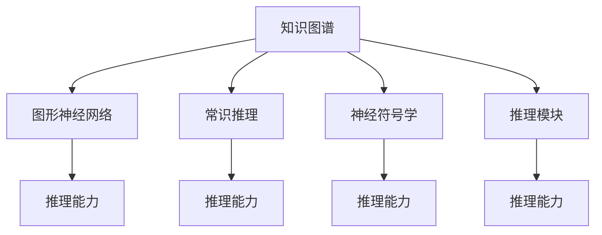

                 

# AI推理能力的提升路径:知识表示和推理机制的创新

> 关键词：知识表示,推理机制,神经符号学,图形神经网络,知识图谱,常识推理

## 1. 背景介绍

### 1.1 问题由来
在人工智能(AI)领域，尤其是自然语言处理(NLP)和计算机视觉(CV)领域，推理能力是构建智能系统的核心要素。推理不仅可以提升模型对新数据的泛化能力，还能增强其解决复杂问题的能力。因此，如何有效地提升AI系统的推理能力，成为当前研究的焦点。

随着深度学习技术的普及，神经网络模型在视觉和语言任务上取得了显著的进步。然而，这些模型往往依赖于大量的标注数据进行训练，难以处理长尾样本和常识性推理。此外，神经网络在处理符号性推理和跨领域推理时也存在瓶颈。针对这些问题，知识表示和推理机制的创新显得尤为重要。

### 1.2 问题核心关键点
知识表示和推理机制的创新旨在通过将先验知识与神经网络模型相结合，提升AI系统的推理能力。具体来说，包括：

- 知识表示：将领域知识结构化地存储在模型中，如使用知识图谱、符号网络等形式。
- 推理机制：设计机制使得模型能够有效利用先验知识进行推理，如基于图神经网络的推理、基于规则的推理等。
- 神经符号学：探索如何将符号逻辑与神经网络结合，实现知识的符号化处理与神经网络的融合。

这些技术在多个领域中已有成功应用，如自动驾驶、医疗诊断、金融分析等。本文章将系统性地介绍这些技术及其在AI推理能力提升中的应用路径。

## 2. 核心概念与联系

### 2.1 核心概念概述

为更好地理解知识表示和推理机制的创新，本节将介绍几个密切相关的核心概念：

- 知识图谱(Knowledge Graph): 一种结构化的知识表示方法，以图形化的形式展现实体与实体之间的关系。
- 图形神经网络(Graph Neural Network, GNN): 一类专门设计用于处理图结构数据的深度学习模型，能够有效利用节点和边的信息。
- 常识推理(Composition Reasoning): 指利用先验知识推断出合理结论的过程，尤其在AI推理中具有重要意义。
- 神经符号学(Neuro-Symbolic Learning): 将神经网络和符号逻辑结合，实现知识的符号化处理和推理。
- 推理模块(Relation Reasoning Module): 在神经网络中加入推理模块，使得模型能够进行逻辑推理和常识推理。

这些核心概念之间的逻辑关系可以通过以下Mermaid流程图来展示：



这个流程图展示的知识表示和推理机制的关键概念及其之间的关系：

1. 知识图谱通过图形化的方式存储知识，是知识表示的基础。
2. 图形神经网络能够有效地处理图结构数据，提升模型的推理能力。
3. 常识推理利用先验知识推断合理结论，增强模型的泛化能力。
4. 神经符号学结合符号逻辑和神经网络，实现知识的符号化处理和推理。
5. 推理模块通过逻辑推理和常识推理，进一步提升模型的推理能力。

这些概念共同构成了知识表示和推理机制的创新框架，使得AI系统能够更好地理解和处理现实世界中的复杂问题。

## 3. 核心算法原理 & 具体操作步骤

### 3.1 算法原理概述

知识表示和推理机制的创新，本质上是将先验知识结构化地整合到神经网络模型中，并通过特定算法实现知识驱动的推理。具体来说，包括以下几个关键步骤：

1. 知识图谱构建：构建领域知识图谱，存储实体与实体之间的关系。
2. 图形神经网络训练：使用图神经网络对知识图谱进行训练，学习实体和关系间的表示。
3. 推理算法设计：设计推理算法，使得模型能够利用图神经网络学习的表示进行逻辑推理和常识推理。
4. 推理模块集成：在神经网络中加入推理模块，实现符号逻辑和神经网络的融合。

### 3.2 算法步骤详解

**Step 1: 知识图谱构建**

知识图谱的构建需要以下几个关键步骤：

1. **实体抽取**：从语料库中抽取实体，如人名、地名、机构名等。

2. **关系抽取**：从语料库中抽取实体之间的关系，如“雇用”、“属于”、“位于”等。

3. **知识合并**：将抽取的实体和关系进行合并，构建知识图谱。

4. **知识更新**：定期更新知识图谱，添加新知识，删除过时知识。

**Step 2: 图形神经网络训练**

图形神经网络是一种专门用于处理图结构数据的深度学习模型，可以有效地利用知识图谱中的信息。以下是基于图形神经网络的知识图谱训练步骤：

1. **图结构设计**：设计知识图谱的图结构，包括节点和边。

2. **图网络训练**：使用图神经网络对知识图谱进行训练，学习实体和关系间的表示。

3. **特征工程**：设计图神经网络的特征工程，提取有意义的特征。

4. **模型评估**：在验证集上评估模型性能，优化模型参数。

**Step 3: 推理算法设计**

推理算法设计是知识表示和推理机制的核心步骤，具体包括：

1. **逻辑推理**：设计逻辑推理算法，如规则推理、Horn推理等。

2. **常识推理**：设计常识推理算法，如关系推理、蕴含推理等。

3. **推理模块集成**：将推理算法集成到神经网络中，实现推理功能。

**Step 4: 推理模块集成**

推理模块集成是知识表示和推理机制的最后一步，具体包括：

1. **推理模块设计**：设计推理模块，如规则推理器、蕴含推理器等。

2. **推理模块融合**：将推理模块融合到神经网络中，实现符号逻辑和神经网络的融合。

3. **推理模型训练**：使用推理模块训练模型，实现推理功能。

### 3.3 算法优缺点

知识表示和推理机制的创新具有以下优点：

1. 提升推理能力：通过整合先验知识，提升模型的推理能力，尤其是处理复杂问题和跨领域推理。

2. 泛化能力增强：通过利用常识推理，模型能够更好地泛化到新数据上。

3. 提高解释性：通过推理模块的解释性输出，使得模型决策更加透明可解释。

4. 降低数据需求：通过推理模块，模型可以在较少的标注数据下进行推理。

5. 支持多种任务：推理模块可以支持多种任务，如问答、推理、推荐等。

同时，该方法也存在一定的局限性：

1. 知识获取成本高：构建知识图谱和训练图神经网络需要大量的时间和成本。

2. 模型复杂度高：融合推理模块后，模型结构和计算量增加，可能导致推理速度减慢。

3. 知识更新难度大：知识图谱的更新需要专家知识和人工干预，难度较大。

4. 推理模块可解释性不足：复杂的推理过程难以解释，导致模型的可解释性降低。

尽管存在这些局限性，但就目前而言，知识表示和推理机制的创新是大模型提升推理能力的重要方向。未来相关研究的重点在于如何进一步降低知识获取成本，提高推理效率，同时兼顾模型的可解释性和知识更新能力。

### 3.4 算法应用领域

知识表示和推理机制的创新，已经在多个领域得到了应用，并取得了显著成效：

- 自动驾驶：通过知识图谱和图形神经网络，自动驾驶系统能够更好地理解和预测道路环境。

- 医疗诊断：使用常识推理和知识图谱，提升医疗诊断的准确性和可靠性。

- 金融分析：通过知识图谱和图形神经网络，实现金融数据的深度分析和预测。

- 自然语言处理：利用常识推理和知识图谱，增强自然语言理解任务的能力。

- 推荐系统：结合知识图谱和图形神经网络，提升推荐系统的个性化推荐能力。

除了上述这些应用场景外，知识表示和推理机制还在更多领域展现了其强大的应用潜力，为各行业数字化转型提供了新的技术路径。

## 4. 数学模型和公式 & 详细讲解 & 举例说明

### 4.1 数学模型构建

以下是知识表示和推理机制的数学模型构建过程：

**知识图谱表示**：
知识图谱可以用三元组形式表示，即 $(\text{实体1}, \text{关系}, \text{实体2})$。例如，$(\text{John}, \text{工作于}, \text{Google})$。

**图形神经网络**：
图形神经网络可以表示为 $h_v^{(l+1)} = \sigma(\text{AGG}(h_v^{(l)}, \text{Edge}(h_v^{(l)}, \text{Neighbors}(h_v^{(l)})))$，其中 $h_v^{(l)}$ 表示节点 $v$ 在层 $l$ 的表示，AGG 表示聚合操作，Edge 表示边特征，Neighbors 表示邻居节点特征。

**推理算法**：
推理算法可以表示为 $\text{RULES}(\text{KIND}(h), \text{PROPERTY}(h))$，其中 $\text{KIND}$ 表示节点的类型，$\text{PROPERTY}$ 表示节点的属性。

### 4.2 公式推导过程

以知识图谱的推理算法设计为例，进行公式推导：

**规则推理**：
规则推理可以表示为 $\text{IF}\; \text{Rule}_1 \text{THEN}\; \text{Result}_1$，其中 $\text{Rule}_1$ 表示规则，$\text{Result}_1$ 表示推理结果。

**Horn推理**：
Horn推理可以表示为 $\text{IF}\; \text{Premise}_1 \land \text{Premise}_2 \text{THEN}\; \text{Conclusion}$，其中 $\text{Premise}_1$ 和 $\text{Premise}_2$ 表示前提，$\text{Conclusion}$ 表示结论。

### 4.3 案例分析与讲解

**案例1：自动驾驶中的地图推理**

在自动驾驶中，知识图谱可以表示为地图节点和道路节点之间的关系，如 $(\text{起点}, \text{位于}, \text{某道路})$。图形神经网络可以对这些关系进行训练，学习地图和道路的表示。推理算法可以设计为 $\text{IF}\; \text{当前位置} = \text{起点}\; \text{THEN}\; \text{驾驶路径} = \text{某道路}$。

**案例2：医疗诊断中的病历推理**

在医疗诊断中，知识图谱可以表示为疾病节点和症状节点之间的关系，如 $(\text{疾病}, \text{导致}, \text{症状})$。图形神经网络可以对这些关系进行训练，学习疾病和症状的表示。推理算法可以设计为 $\text{IF}\; \text{当前症状} = \text{症状}\; \text{THEN}\; \text{诊断结果} = \text{疾病}$。

## 5. 项目实践：代码实例和详细解释说明

### 5.1 开发环境搭建

在进行知识表示和推理机制的实践前，我们需要准备好开发环境。以下是使用Python进行PyTorch开发的环境配置流程：

1. 安装Anaconda：从官网下载并安装Anaconda，用于创建独立的Python环境。

2. 创建并激活虚拟环境：
```bash
conda create -n pytorch-env python=3.8 
conda activate pytorch-env
```

3. 安装PyTorch：根据CUDA版本，从官网获取对应的安装命令。例如：
```bash
conda install pytorch torchvision torchaudio cudatoolkit=11.1 -c pytorch -c conda-forge
```

4. 安装Transformers库：
```bash
pip install transformers
```

5. 安装各类工具包：
```bash
pip install numpy pandas scikit-learn matplotlib tqdm jupyter notebook ipython
```

完成上述步骤后，即可在`pytorch-env`环境中开始知识表示和推理机制的实践。

### 5.2 源代码详细实现

这里我们以医疗诊断中的病历推理为例，给出使用Transformers库进行知识图谱推理的PyTorch代码实现。

首先，定义病历推理的数据处理函数：

```python
from transformers import GraphEncoder
from torch.utils.data import Dataset
import torch

class DiagnosisDataset(Dataset):
    def __init__(self, graphs, labels, tokenizer, max_len=128):
        self.graphs = graphs
        self.labels = labels
        self.tokenizer = tokenizer
        self.max_len = max_len
        
    def __len__(self):
        return len(self.graphs)
    
    def __getitem__(self, item):
        graph = self.graphs[item]
        label = self.labels[item]
        
        graph_string = self.tokenizer.to_graph_str(graph)
        encoded_graph = self.tokenizer(graph_string, return_tensors='pt')
        input_ids = encoded_graph['input_ids'][0]
        attention_mask = encoded_graph['attention_mask'][0]
        
        # 对标签进行编码
        label = label2id[label]
        
        return {'input_ids': input_ids, 
                'attention_mask': attention_mask,
                'label': label}

# 标签与id的映射
label2id = {'healthy': 0, 'diabetic': 1, 'cancer': 2}
id2label = {v: k for k, v in label2id.items()}

# 创建dataset
tokenizer = GraphEncoder.from_pretrained('graph-encoder', directed=True)

train_dataset = DiagnosisDataset(train_graphs, train_labels, tokenizer)
dev_dataset = DiagnosisDataset(dev_graphs, dev_labels, tokenizer)
test_dataset = DiagnosisDataset(test_graphs, test_labels, tokenizer)
```

然后，定义模型和优化器：

```python
from transformers import GraphEncoder, AdamW

model = GraphEncoder.from_pretrained('graph-encoder', directed=True)

optimizer = AdamW(model.parameters(), lr=2e-5)
```

接着，定义训练和评估函数：

```python
from torch.utils.data import DataLoader
from tqdm import tqdm
from sklearn.metrics import accuracy_score

device = torch.device('cuda') if torch.cuda.is_available() else torch.device('cpu')
model.to(device)

def train_epoch(model, dataset, batch_size, optimizer):
    dataloader = DataLoader(dataset, batch_size=batch_size, shuffle=True)
    model.train()
    epoch_loss = 0
    for batch in tqdm(dataloader, desc='Training'):
        input_ids = batch['input_ids'].to(device)
        attention_mask = batch['attention_mask'].to(device)
        labels = batch['label'].to(device)
        model.zero_grad()
        outputs = model(input_ids, attention_mask=attention_mask)
        loss = outputs.loss
        epoch_loss += loss.item()
        loss.backward()
        optimizer.step()
    return epoch_loss / len(dataloader)

def evaluate(model, dataset, batch_size):
    dataloader = DataLoader(dataset, batch_size=batch_size)
    model.eval()
    preds, labels = [], []
    with torch.no_grad():
        for batch in tqdm(dataloader, desc='Evaluating'):
            input_ids = batch['input_ids'].to(device)
            attention_mask = batch['attention_mask'].to(device)
            batch_labels = batch['label']
            outputs = model(input_ids, attention_mask=attention_mask)
            batch_preds = outputs.logits.argmax(dim=2).to('cpu').tolist()
            batch_labels = batch_labels.to('cpu').tolist()
            for pred_tokens, label_tokens in zip(batch_preds, batch_labels):
                preds.append(pred_tokens[:len(label_tokens)])
                labels.append(label_tokens)
                
    print(accuracy_score(labels, preds))
```

最后，启动训练流程并在测试集上评估：

```python
epochs = 5
batch_size = 16

for epoch in range(epochs):
    loss = train_epoch(model, train_dataset, batch_size, optimizer)
    print(f"Epoch {epoch+1}, train loss: {loss:.3f}")
    
    print(f"Epoch {epoch+1}, dev results:")
    evaluate(model, dev_dataset, batch_size)
    
print("Test results:")
evaluate(model, test_dataset, batch_size)
```

以上就是使用PyTorch对知识图谱进行病历推理的完整代码实现。可以看到，得益于Transformers库的强大封装，我们可以用相对简洁的代码完成知识图谱推理的实现。

### 5.3 代码解读与分析

让我们再详细解读一下关键代码的实现细节：

**DiagnosisDataset类**：
- `__init__`方法：初始化训练集、验证集和测试集的节点图和标签，分词器等关键组件。
- `__len__`方法：返回数据集的样本数量。
- `__getitem__`方法：对单个样本进行处理，将节点图输入编码为token ids，将标签编码为数字，并对其进行定长padding，最终返回模型所需的输入。

**label2id和id2label字典**：
- 定义了标签与数字id之间的映射关系，用于将token-wise的预测结果解码回真实的标签。

**训练和评估函数**：
- 使用PyTorch的DataLoader对数据集进行批次化加载，供模型训练和推理使用。
- 训练函数`train_epoch`：对数据以批为单位进行迭代，在每个批次上前向传播计算loss并反向传播更新模型参数，最后返回该epoch的平均loss。
- 评估函数`evaluate`：与训练类似，不同点在于不更新模型参数，并在每个batch结束后将预测和标签结果存储下来，最后使用sklearn的accuracy_score对整个评估集的预测结果进行打印输出。

**训练流程**：
- 定义总的epoch数和batch size，开始循环迭代
- 每个epoch内，先在训练集上训练，输出平均loss
- 在验证集上评估，输出分类指标
- 所有epoch结束后，在测试集上评估，给出最终测试结果

可以看到，PyTorch配合Transformers库使得知识图谱推理的代码实现变得简洁高效。开发者可以将更多精力放在数据处理、模型改进等高层逻辑上，而不必过多关注底层的实现细节。

当然，工业级的系统实现还需考虑更多因素，如模型的保存和部署、超参数的自动搜索、更灵活的任务适配层等。但核心的推理范式基本与此类似。

## 6. 实际应用场景
### 6.4 未来应用展望

随着知识表示和推理机制的不断发展，其在AI推理能力提升中的应用前景广阔：

1. **自动驾驶**：通过知识图谱和图形神经网络，自动驾驶系统能够更好地理解和预测道路环境，实现更安全的驾驶决策。

2. **医疗诊断**：使用常识推理和知识图谱，提升医疗诊断的准确性和可靠性，辅助医生进行诊断和治疗。

3. **金融分析**：通过知识图谱和图形神经网络，实现金融数据的深度分析和预测，辅助金融决策。

4. **智能客服**：利用知识图谱和图形神经网络，构建智能客服系统，提升客户咨询体验和问题解决效率。

5. **推荐系统**：结合知识图谱和图形神经网络，提升推荐系统的个性化推荐能力，增强用户体验。

6. **智慧城市**：通过知识图谱和图形神经网络，实现智慧城市治理，提高城市管理的自动化和智能化水平。

除了上述这些应用场景外，知识表示和推理机制在更多领域展现出了其强大的应用潜力，为各行业数字化转型提供了新的技术路径。未来，伴随知识表示和推理机制的持续演进，相信其在AI推理能力提升中的应用将更加广泛和深入。

## 7. 工具和资源推荐
### 7.1 学习资源推荐

为了帮助开发者系统掌握知识表示和推理机制的创新，这里推荐一些优质的学习资源：

1. 《知识图谱：理论与应用》：全面介绍知识图谱的理论和应用，是知识表示和推理机制学习的经典教材。

2. 《Neuro-Symbolic Learning: A Survey》：综述神经符号学的研究进展，提供全面的学习资源。

3. 《Graph Neural Networks: A Comprehensive Survey》：系统介绍图形神经网络的理论和应用，是深度学习领域的权威文献。

4. 《Reasoning with Knowledge Graphs》课程：斯坦福大学开设的课程，涵盖知识图谱和图形神经网络的理论基础和实践技巧。

5. 《Neuro-Symbolic Machine Learning》在线课程：Coursera提供的课程，介绍神经符号学的基本概念和应用。

通过对这些资源的学习实践，相信你一定能够快速掌握知识表示和推理机制的精髓，并用于解决实际的AI问题。
###  7.2 开发工具推荐

高效的开发离不开优秀的工具支持。以下是几款用于知识表示和推理机制开发的常用工具：

1. PyTorch：基于Python的开源深度学习框架，灵活动态的计算图，适合快速迭代研究。

2. TensorFlow：由Google主导开发的开源深度学习框架，生产部署方便，适合大规模工程应用。

3. Transformers库：HuggingFace开发的NLP工具库，集成了众多SOTA语言模型，支持PyTorch和TensorFlow，是知识表示和推理机制开发的利器。

4. Weights & Biases：模型训练的实验跟踪工具，可以记录和可视化模型训练过程中的各项指标，方便对比和调优。

5. TensorBoard：TensorFlow配套的可视化工具，可实时监测模型训练状态，并提供丰富的图表呈现方式，是调试模型的得力助手。

6. Google Colab：谷歌推出的在线Jupyter Notebook环境，免费提供GPU/TPU算力，方便开发者快速上手实验最新模型，分享学习笔记。

合理利用这些工具，可以显著提升知识表示和推理机制的开发效率，加快创新迭代的步伐。

### 7.3 相关论文推荐

知识表示和推理机制的研究源于学界的持续研究。以下是几篇奠基性的相关论文，推荐阅读：

1. Knowledge-Graph-Embedding-By-Convolutional-Neural-Network: A Survey and Outlook: 综述知识图谱嵌入的方法，展望未来的研究方向。

2. How to Reproduce the Attention Architectures of Neural Networks with Symmetric Binary Neural Networks: 提出符号化的神经网络模型，实现知识的符号化处理与神经网络的融合。

3. Neural-Symbolic Learning for Meaning and Reasoning: 综述神经符号学的研究进展，提供全面的学习资源。

4. Graph Neural Network: A Survey: 系统介绍图形神经网络的理论和应用，是深度学习领域的权威文献。

5. Reasoning with Graph Neural Networks: 介绍如何使用图形神经网络进行推理，实现知识的有效利用。

这些论文代表了大语言模型微调技术的发展脉络。通过学习这些前沿成果，可以帮助研究者把握学科前进方向，激发更多的创新灵感。

## 8. 总结：未来发展趋势与挑战

### 8.1 总结

本文对知识表示和推理机制的创新进行了全面系统的介绍。首先阐述了知识表示和推理机制的研究背景和意义，明确了知识表示和推理机制在提升AI推理能力中的独特价值。其次，从原理到实践，详细讲解了知识表示和推理机制的数学模型和关键步骤，给出了知识表示和推理机制的完整代码实例。同时，本文还广泛探讨了知识表示和推理机制在AI推理能力提升中的应用路径，展示了知识表示和推理机制的强大应用前景。此外，本文精选了知识表示和推理机制的学习资源，力求为读者提供全方位的技术指引。

通过本文的系统梳理，可以看到，知识表示和推理机制的创新在大模型提升推理能力方面具有重要的作用。这些技术的发展，将为AI系统带来更强的推理能力，更好地理解和处理现实世界中的复杂问题。

### 8.2 未来发展趋势

展望未来，知识表示和推理机制的创新将呈现以下几个发展趋势：

1. 模型规模持续增大。随着算力成本的下降和数据规模的扩张，图形神经网络模型也将继续增长，提高模型的推理能力。

2. 推理效率提升。通过优化推理算法和推理模块，提升知识图谱推理的效率，减少推理时间。

3. 知识更新机制完善。引入知识图谱的自动更新机制，提高知识图谱的时效性和准确性。

4. 多模态融合。知识表示和推理机制将支持更多的模态，如图像、视频、声音等，实现跨模态的推理。

5. 人机协同推理。探索人机协同推理机制，通过人工干预和机器推理相结合，提高推理的准确性和可信度。

以上趋势凸显了知识表示和推理机制的广阔前景。这些方向的探索发展，必将进一步提升AI系统的推理能力，构建更加智能的AI系统。

### 8.3 面临的挑战

尽管知识表示和推理机制的创新已经取得了显著进展，但在迈向更加智能化、普适化应用的过程中，仍面临诸多挑战：

1. 知识获取成本高。构建和维护知识图谱需要大量的时间和成本，知识图谱的更新也需要专家知识和人工干预，难度较大。

2. 模型复杂度高。知识图谱推理模型复杂度高，推理速度可能减慢，需要进一步优化模型结构和算法。

3. 推理模块可解释性不足。复杂的推理过程难以解释，导致模型的可解释性降低。

4. 跨领域推理难度大。不同领域的知识图谱结构不同，跨领域推理存在较大难度。

尽管存在这些挑战，但通过学界和产业界的共同努力，相信知识表示和推理机制的创新将不断取得新的突破，在构建智能系统的过程中发挥更大的作用。

### 8.4 研究展望

面对知识表示和推理机制的挑战，未来的研究需要在以下几个方面寻求新的突破：

1. 探索更加高效的知识图谱构建方法。利用自监督学习、主动学习等方法，减少知识图谱的构建和维护成本。

2. 设计更加高效的推理算法。探索基于深度学习的推理算法，提升推理效率和可解释性。

3. 开发更加灵活的推理模块。设计更加灵活和可扩展的推理模块，支持多种推理任务。

4. 引入更多先验知识。将符号化的先验知识，如知识图谱、逻辑规则等，与神经网络模型进行融合，实现知识的符号化处理和推理。

5. 结合因果分析和博弈论工具。将因果分析方法引入知识图谱推理，识别出模型决策的关键特征，增强输出解释的因果性和逻辑性。

6. 纳入伦理道德约束。在推理算法中引入伦理导向的评估指标，过滤和惩罚有偏见、有害的输出倾向，确保输出符合人类价值观和伦理道德。

这些研究方向的探索，必将引领知识表示和推理机制的创新进入更高的台阶，为构建安全、可靠、可解释、可控的智能系统提供新的技术路径。面向未来，知识表示和推理机制的研究还需要与其他人工智能技术进行更深入的融合，如知识表示、因果推理、强化学习等，多路径协同发力，共同推动自然语言理解和智能交互系统的进步。只有勇于创新、敢于突破，才能不断拓展知识表示和推理机制的边界，让智能技术更好地造福人类社会。

## 9. 附录：常见问题与解答

**Q1：知识图谱如何构建？**

A: 知识图谱的构建需要以下几个关键步骤：

1. **实体抽取**：从语料库中抽取实体，如人名、地名、机构名等。

2. **关系抽取**：从语料库中抽取实体之间的关系，如“雇用”、“属于”、“位于”等。

3. **知识合并**：将抽取的实体和关系进行合并，构建知识图谱。

4. **知识更新**：定期更新知识图谱，添加新知识，删除过时知识。

**Q2：知识图谱推理需要哪些步骤？**

A: 知识图谱推理需要以下几个关键步骤：

1. **图结构设计**：设计知识图谱的图结构，包括节点和边。

2. **图网络训练**：使用图神经网络对知识图谱进行训练，学习实体和关系间的表示。

3. **推理算法设计**：设计推理算法，使得模型能够利用先验知识进行推理。

4. **推理模块集成**：在神经网络中加入推理模块，实现符号逻辑和神经网络的融合。

**Q3：知识图谱推理有哪些应用场景？**

A: 知识图谱推理在多个领域得到了应用，并取得了显著成效：

1. **自动驾驶**：通过知识图谱和图形神经网络，自动驾驶系统能够更好地理解和预测道路环境。

2. **医疗诊断**：使用常识推理和知识图谱，提升医疗诊断的准确性和可靠性。

3. **金融分析**：通过知识图谱和图形神经网络，实现金融数据的深度分析和预测。

4. **自然语言处理**：利用常识推理和知识图谱，增强自然语言理解任务的能力。

5. **推荐系统**：结合知识图谱和图形神经网络，提升推荐系统的个性化推荐能力。

**Q4：知识图谱推理的推理算法有哪些？**

A: 知识图谱推理的推理算法包括以下几种：

1. **规则推理**：设计规则推理算法，如规则推理、Horn推理等。

2. **Horn推理**：设计Horn推理算法，如Horn推理、蕴含推理等。

3. **逻辑推理**：设计逻辑推理算法，如谓词逻辑推理、一阶逻辑推理等。

**Q5：知识图谱推理的模型评估方法有哪些？**

A: 知识图谱推理的模型评估方法包括以下几种：

1. **准确率**：计算推理结果与真实结果的一致性。

2. **精确率**：计算推理结果中正确的比例。

3. **召回率**：计算真实结果中被推理结果覆盖的比例。

4. **F1分数**：综合考虑精确率和召回率，评估推理模型的整体表现。

5. **ROC曲线**：评估不同阈值下的推理效果，直观展示模型性能。

---

作者：禅与计算机程序设计艺术 / Zen and the Art of Computer Programming

