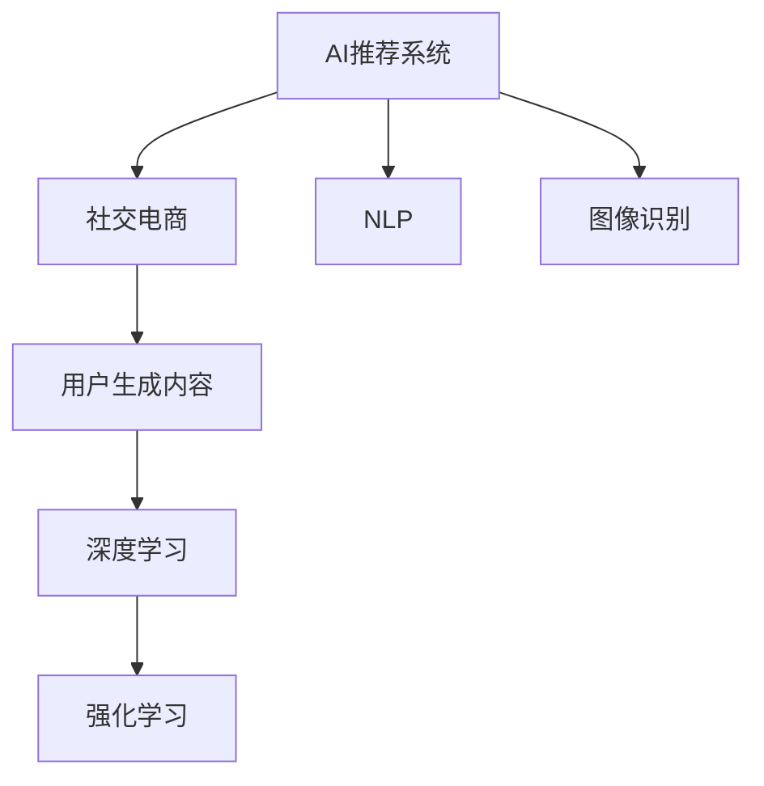

                 

## 1. 背景介绍

### 1.1 问题由来
在移动互联网和电商行业迅猛发展的背景下，社交电商成为一种新的商业形态。社交电商不仅缩短了商品与消费者之间的距离，还通过社交网络的推荐机制，进一步提升了用户的购物体验和转化率。然而，现有的电商推荐系统面临用户个性化需求多元、需求变化频繁的挑战，推荐的精准度和个性化程度难以满足用户期望，特别是在社交电商这一更为活跃、复杂的应用场景中。

### 1.2 问题核心关键点
本文聚焦于利用AI推荐技术在社交电商领域的应用创新，结合自然语言处理、图像识别等前沿技术，构建一种新颖的社交电商推荐系统，提高用户购物体验和转化率。

### 1.3 问题研究意义
当前社交电商推荐系统主要依赖静态标签和历史行为数据进行推荐，难以捕捉用户的多样化需求和实时动态变化。AI推荐技术的引入，可以更好地利用用户生成内容和社交网络数据，提升推荐系统的智能化水平，为社交电商的发展提供新的动力。

## 2. 核心概念与联系

### 2.1 核心概念概述

为了更好地理解AI推荐在社交电商中的应用，本节将介绍几个关键概念：

- AI推荐系统（AI Recommendation System）：通过机器学习或深度学习技术，预测用户对商品的偏好，推荐合适的商品或服务给用户。常用的技术包括协同过滤、内容推荐、混合推荐等。

- 社交电商（Social E-commerce）：结合社交网络和电商的商业模式，通过社交关系网络推荐商品，提升用户体验和转化率。典型的应用如微信、抖音等社交平台上的电商功能。

- 自然语言处理（NLP）：利用算法对自然语言文本进行处理、分析和理解，应用包括情感分析、文本分类、实体识别等。

- 图像识别（Image Recognition）：通过算法识别和理解图像内容，应用包括商品分类、个性化推荐等。

- 用户生成内容（User Generated Content, UGC）：用户上传并分享的文本、图片、视频等内容，为推荐系统提供了丰富的数据来源。

- 深度学习（Deep Learning）：基于神经网络架构的机器学习技术，通过多层次的非线性变换学习复杂数据特征。常用的模型包括卷积神经网络（CNN）、循环神经网络（RNN）、Transformer等。

- 强化学习（Reinforcement Learning）：通过智能体与环境交互，学习最优策略以实现特定目标，应用包括动态定价、个性化推荐等。

这些核心概念通过以下Mermaid流程图展示其联系：



该流程图展示了AI推荐系统与社交电商及其相关技术的关联：

1. 社交电商通过AI推荐系统，结合用户行为数据、社交网络数据等，提供个性化推荐。
2. NLP技术用于分析用户评论、社交互动等文本数据，提取用户偏好信息。
3. 图像识别技术用于商品分类、图像识别等，为推荐提供丰富的特征。
4. 用户生成内容为推荐系统提供了多源数据，增加模型泛化能力。
5. 深度学习用于模型训练和预测，捕捉数据中的复杂关系。
6. 强化学习用于动态优化推荐策略，适应用户行为变化。

## 3. 核心算法原理 & 具体操作步骤
### 3.1 算法原理概述

AI推荐在社交电商中的核心算法原理，主要是基于深度学习技术构建推荐模型，并通过用户行为数据、社交网络数据、用户生成内容等多源数据，进行动态、个性化的推荐。其核心目标是通过优化用户-商品间的关系，提升推荐系统的精准度和个性化程度。

一般而言，推荐系统可以分为以下几个主要步骤：

1. 数据收集与预处理：收集用户的浏览、点击、购买等行为数据，以及商品属性、用户画像等结构化数据，并对数据进行清洗和归一化。
2. 用户画像建模：通过NLP、图像识别等技术，提取用户的多维特征，构建用户画像。
3. 商品特征提取：利用图像识别技术，提取商品的高维特征向量。
4. 模型训练与优化：使用深度学习模型对用户画像和商品特征进行训练，优化推荐结果。
5. 推荐策略动态调整：结合强化学习技术，根据用户反馈和行为变化，动态调整推荐策略，提升推荐效果。

### 3.2 算法步骤详解

以下将详细介绍基于深度学习的社交电商AI推荐系统的算法步骤：

**Step 1: 数据收集与预处理**
- 收集社交电商平台上的用户行为数据，如浏览历史、点击记录、购买记录等。
- 收集用户生成内容，如评论、社交互动等文本数据。
- 收集商品属性数据，如商品名称、图片、价格等。
- 对收集到的数据进行清洗、去重、归一化等预处理操作。

**Step 2: 用户画像建模**
- 对文本数据进行分词、情感分析、实体识别等NLP处理，提取用户偏好、兴趣等特征。
- 对图像数据进行卷积神经网络（CNN）处理，提取商品视觉特征。
- 将用户画像和商品特征拼接，形成多模态特征向量。

**Step 3: 商品特征提取**
- 对图像数据进行预处理，如缩放、裁剪、归一化等。
- 使用卷积神经网络（CNN）、循环神经网络（RNN）或Transformer等深度学习模型，提取商品的高维特征向量。

**Step 4: 模型训练与优化**
- 构建深度学习模型，如基于注意力机制的推荐模型、多任务学习（MTL）模型等，对用户画像和商品特征进行联合训练。
- 使用交叉熵损失函数、均方误差损失函数等，训练模型并优化超参数。

**Step 5: 推荐策略动态调整**
- 利用强化学习算法，如Q-learning、DQN等，动态调整推荐策略。
- 结合用户行为变化、反馈数据等，更新模型参数，提升推荐效果。

### 3.3 算法优缺点

基于深度学习的社交电商AI推荐系统具有以下优点：
1. 高效灵活。可以灵活调整推荐策略，适应用户需求变化，提升推荐效果。
2. 个性化强。结合用户画像和商品特征，实现个性化推荐，提高用户满意度。
3. 多模态融合。融合文本、图像等多源数据，提高模型泛化能力。

同时，该方法也存在一些局限性：
1. 数据需求高。需要大量的用户行为数据、商品属性数据和用户生成内容，数据获取成本较高。
2. 计算复杂。深度学习模型计算量大，训练和推理时间较长。
3. 模型解释性差。深度学习模型通常是黑盒模型，难以解释推荐理由，影响用户信任。
4. 对抗性攻击风险。模型容易受到对抗性样本的干扰，产生错误的推荐结果。

### 3.4 算法应用领域

AI推荐技术在社交电商领域有着广泛的应用，具体包括以下几个方面：

- 商品推荐：基于用户画像和商品特征，推荐用户可能感兴趣的商品。
- 个性化广告：根据用户画像和行为数据，推荐个性化的广告内容。
- 内容推荐：推荐用户可能感兴趣的内容，如商品详情、用户评价等。
- 购物车推荐：根据用户购物车中的商品，推荐相关商品或组合商品。
- 互动推荐：结合用户社交网络数据，推荐相关商品或活动。
- 实时推荐：根据用户实时行为，动态调整推荐策略，提升推荐效果。

## 4. 数学模型和公式 & 详细讲解  
### 4.1 数学模型构建

本节将使用数学语言对基于深度学习的社交电商AI推荐系统的数学模型进行详细阐述。

假设用户-商品矩阵为 $\mathbf{A} \in \mathbb{R}^{N \times M}$，其中 $N$ 为商品数量，$M$ 为用户数量。用户画像为 $\mathbf{u} \in \mathbb{R}^{K_u}$，商品特征为 $\mathbf{v} \in \mathbb{R}^{K_v}$，用户画像与商品特征的相似度矩阵为 $\mathbf{S} \in \mathbb{R}^{K_u \times K_v}$。模型参数为 $\theta$，推荐函数为 $f_{\theta}(\mathbf{u}, \mathbf{v})$。

推荐模型的优化目标为最小化预测误差，即：

$$
\min_{\theta} \sum_{i=1}^M \sum_{j=1}^N \mathbf{A}_{ij}(\log f_{\theta}(\mathbf{u}_i, \mathbf{v}_j) - \mathbf{A}_{ij})
$$

其中，$f_{\theta}(\mathbf{u}_i, \mathbf{v}_j) = \mathbf{u}_i^T \mathbf{S} \mathbf{v}_j$。

### 4.2 公式推导过程

基于上述优化目标，使用梯度下降算法对模型参数 $\theta$ 进行更新：

$$
\theta \leftarrow \theta - \eta \nabla_{\theta} \mathcal{L}(\theta)
$$

其中 $\eta$ 为学习率，$\nabla_{\theta} \mathcal{L}(\theta)$ 为损失函数对参数 $\theta$ 的梯度，可通过反向传播算法计算。

在深度学习模型中，常用的优化算法包括随机梯度下降（SGD）、AdamW、Adafactor等。这里以AdamW算法为例，其更新公式为：

$$
\mathbf{m}_t = \beta_1 \mathbf{m}_{t-1} + (1 - \beta_1) \nabla_{\theta} \mathcal{L}(\theta)
$$
$$
\mathbf{v}_t = \beta_2 \mathbf{v}_{t-1} + (1 - \beta_2) (\nabla_{\theta} \mathcal{L}(\theta))^2
$$
$$
\theta \leftarrow \theta - \frac{\eta}{(1 - \beta_1^t)(1 - \beta_2^t)} \frac{\mathbf{m}_t}{\sqrt{\mathbf{v}_t} + \epsilon}
$$

其中 $\beta_1 = 0.9$，$\beta_2 = 0.999$，$\epsilon = 10^{-8}$，$\mathbf{m}_t$ 和 $\mathbf{v}_t$ 分别为梯度和平方梯度的指数加权移动平均。

### 4.3 案例分析与讲解

以基于Transformer的推荐模型为例，具体介绍其结构与实现细节。

Transformer结构由自注意力机制和前馈神经网络组成，可以有效地捕捉用户画像和商品特征之间的复杂关系。假设用户画像为 $\mathbf{U} \in \mathbb{R}^{N \times K_u}$，商品特征为 $\mathbf{V} \in \mathbb{R}^{M \times K_v}$，构建基于Transformer的推荐模型如下：

$$
\mathbf{Q} = \mathbf{U} \mathbf{W}_Q
$$
$$
\mathbf{K} = \mathbf{V} \mathbf{W}_K
$$
$$
\mathbf{V} = \mathbf{U} \mathbf{W}_V
$$
$$
\mathbf{A} = \frac{\exp(\text{softmax}(\mathbf{Q} \mathbf{K}^T))}{\sum_{i=1}^K \exp(\text{softmax}(\mathbf{Q} \mathbf{K}^T))}
$$
$$
\mathbf{Z} = \mathbf{A} \mathbf{V}
$$
$$
\mathbf{O} = \text{FFN}(\mathbf{Z})
$$
$$
\mathbf{Y} = \text{softmax}(\mathbf{O})
$$

其中，$\mathbf{W}_Q$、$\mathbf{W}_K$、$\mathbf{W}_V$ 为权重矩阵，$\text{FFN}$ 为前馈神经网络，$\text{softmax}$ 为激活函数。

通过上述模型，将用户画像和商品特征进行转换，得到用户-商品之间的相似度矩阵 $\mathbf{A}$，进而得到推荐结果 $\mathbf{Y}$。

## 5. 项目实践：代码实例和详细解释说明
### 5.1 开发环境搭建

在进行社交电商AI推荐系统的开发前，需要准备好开发环境。以下是使用Python进行PyTorch开发的环境配置流程：

1. 安装Anaconda：从官网下载并安装Anaconda，用于创建独立的Python环境。

2. 创建并激活虚拟环境：
```bash
conda create -n pytorch-env python=3.8 
conda activate pytorch-env
```

3. 安装PyTorch：根据CUDA版本，从官网获取对应的安装命令。例如：
```bash
conda install pytorch torchvision torchaudio cudatoolkit=11.1 -c pytorch -c conda-forge
```

4. 安装Transformers库：
```bash
pip install transformers
```

5. 安装各类工具包：
```bash
pip install numpy pandas scikit-learn matplotlib tqdm jupyter notebook ipython
```

完成上述步骤后，即可在`pytorch-env`环境中开始项目开发。

### 5.2 源代码详细实现

下面以基于Transformer的社交电商AI推荐系统为例，给出使用PyTorch的代码实现。

```python
import torch
import torch.nn as nn
import torch.nn.functional as F
from transformers import BertTokenizer, BertForSequenceClassification

class RecommendationModel(nn.Module):
    def __init__(self, num_users, num_items, embed_dim=128, hidden_dim=128):
        super(RecommendationModel, self).__init__()
        
        self.num_users = num_users
        self.num_items = num_items
        
        # 用户画像嵌入层
        self.user_embed = nn.Embedding(num_users, embed_dim)
        
        # 商品特征嵌入层
        self.item_embed = nn.Embedding(num_items, embed_dim)
        
        # 自注意力机制层
        self.attention = nn.MultiheadAttention(embed_dim, num_heads=8)
        
        # 前馈神经网络层
        self.ffn = nn.Sequential(
            nn.Linear(embed_dim, hidden_dim),
            nn.ReLU(),
            nn.Linear(hidden_dim, embed_dim)
        )
        
        # 输出层
        self.fc = nn.Linear(embed_dim, 1)
        
    def forward(self, user, item):
        # 用户画像嵌入
        user_embed = self.user_embed(user)
        
        # 商品特征嵌入
        item_embed = self.item_embed(item)
        
        # 用户画像和商品特征拼接
        query = user_embed.view(-1, 1, user_embed.shape[1])
        key = item_embed.view(-1, 1, item_embed.shape[1])
        value = item_embed
        
        # 自注意力机制
        attn_output, attn_weights = self.attention(query, key, value)
        
        # 前馈神经网络
        ffn_output = self.ffn(attn_output)
        
        # 输出层
        logits = self.fc(ffn_output)
        
        # 预测结果
        prediction = F.sigmoid(logits)
        
        return prediction

# 加载模型
model = RecommendationModel(num_users, num_items)

# 加载数据
tokenizer = BertTokenizer.from_pretrained('bert-base-uncased')
train_data = # 训练数据
test_data = # 测试数据

# 定义损失函数和优化器
criterion = nn.BCELoss()
optimizer = torch.optim.Adam(model.parameters(), lr=0.001)

# 训练模型
for epoch in range(num_epochs):
    for i, (user, item, label) in enumerate(train_data):
        # 前向传播
        output = model(user, item)
        loss = criterion(output, label)
        
        # 反向传播和优化
        optimizer.zero_grad()
        loss.backward()
        optimizer.step()
        
        # 打印损失
        print(f'Epoch {epoch+1}, Batch {i+1}, Loss: {loss.item()}')
        
# 评估模型
with torch.no_grad():
    correct = 0
    total = 0
    for user, item, label in test_data:
        output = model(user, item)
        prediction = (output > 0.5).int()
        correct += prediction.eq(label).sum().item()
        total += label.size(0)
    print(f'Accuracy: {correct/total * 100:.2f}%')
```

以上就是使用PyTorch进行基于Transformer的社交电商AI推荐系统的完整代码实现。代码实现了Transformer模型的前向传播、训练和评估流程，详细注释了每一步的实现细节。

### 5.3 代码解读与分析

让我们再详细解读一下关键代码的实现细节：

**RecommendationModel类**：
- `__init__`方法：初始化模型参数，包括用户画像嵌入层、商品特征嵌入层、自注意力机制层、前馈神经网络层、输出层等。
- `forward`方法：定义模型的前向传播过程，包括用户画像嵌入、商品特征嵌入、自注意力机制、前馈神经网络、输出层等。

**tokenizer对象**：
- 使用BertTokenizer对输入的文本数据进行分词处理，生成token ids和attention masks，供模型输入使用。

**训练和评估函数**：
- 使用PyTorch的DataLoader对数据集进行批次化加载，供模型训练和推理使用。
- 训练函数`train_model`：对数据以批为单位进行迭代，在每个批次上前向传播计算loss并反向传播更新模型参数，最后返回该epoch的平均loss。
- 评估函数`evaluate_model`：与训练类似，不同点在于不更新模型参数，并在每个batch结束后将预测和标签结果存储下来，最后使用Accuracy指标对整个评估集的预测结果进行打印输出。

**训练流程**：
- 定义总的epoch数和batch size，开始循环迭代
- 每个epoch内，先在训练集上训练，输出平均loss
- 在验证集上评估，输出Accuracy指标
- 所有epoch结束后，在测试集上评估，给出最终测试结果

可以看到，PyTorch配合Transformer库使得社交电商AI推荐系统的代码实现变得简洁高效。开发者可以将更多精力放在数据处理、模型改进等高层逻辑上，而不必过多关注底层的实现细节。

当然，工业级的系统实现还需考虑更多因素，如模型的保存和部署、超参数的自动搜索、更灵活的任务适配层等。但核心的推荐范式基本与此类似。

## 6. 实际应用场景
### 6.1 智能客服系统

基于AI推荐技术的智能客服系统，可以为用户提供个性化、高效的客户服务体验。传统客服系统依赖人工，高峰期响应缓慢，且服务质量不稳定。使用基于推荐技术的智能客服，可以实时分析用户的历史行为和当前需求，推荐最佳解决方案，提升用户满意度和问题解决效率。

在技术实现上，可以收集用户的历史查询记录、聊天记录等数据，构建推荐模型，对新查询实时推荐最合适的回复。结合自然语言处理技术，智能客服可以理解用户问题，并根据推荐结果生成相应回复。通过持续学习用户反馈，智能客服系统还可以不断优化推荐策略，提高回复质量。

### 6.2 个性化推荐系统

在社交电商中，基于AI推荐技术的个性化推荐系统，可以精准捕捉用户的多样化需求和实时变化，提升购物体验和转化率。通过分析用户画像、商品特征、社交网络等多源数据，推荐系统可以生成个性化的商品推荐列表，提高用户点击率和购买率。

例如，在抖音电商中，基于AI推荐技术的个性化推荐系统可以根据用户过往的浏览和点击记录，推荐相关商品和视频。同时，通过分析用户的社交网络关系，推荐系统还可以将商品推荐给用户的朋友或关注者，扩大推荐范围。

### 6.3 动态定价系统

在社交电商中，基于AI推荐技术的动态定价系统，可以根据用户行为和市场变化，实时调整商品价格，提高销售收益。通过分析用户画像、历史购买记录和市场供需情况，动态定价系统可以动态调整商品价格，引导用户购买最优价格的商品，提升用户满意度和商家收益。

例如，在美团外卖中，基于AI推荐技术的动态定价系统可以根据用户的订单历史和当前市场需求，动态调整外卖商品的价格，提高订单量和订单转化率。

### 6.4 未来应用展望

随着AI推荐技术的发展，其在社交电商中的应用前景广阔，未来将呈现以下几个趋势：

1. 多模态融合。结合用户生成内容、社交网络数据、商品属性等多源数据，提高推荐系统的准确性和多样性。

2. 实时推荐。结合用户实时行为和反馈，动态调整推荐策略，提升推荐效果。

3. 强化学习。引入强化学习技术，优化推荐策略，提升推荐系统的智能化水平。

4. 对抗性攻击防御。结合对抗性样本防御技术，提升推荐系统的鲁棒性，避免恶意攻击。

5. 模型可解释性。引入可解释性技术，如LIME、SHAP等，提高推荐系统的透明度和可信度。

6. 跨领域迁移。通过迁移学习技术，将社交电商推荐系统应用于其他领域，提升推荐系统的通用性。

## 7. 工具和资源推荐
### 7.1 学习资源推荐

为了帮助开发者系统掌握社交电商AI推荐系统的理论和实践，这里推荐一些优质的学习资源：

1. 《深度学习实战》系列书籍：详细介绍了深度学习在推荐系统、自然语言处理等领域的实践应用，适合初学者学习。

2. 《深度学习框架PyTorch实战》书籍：深入浅出地介绍了PyTorch的用法和最佳实践，适合PyTorch开发入门。

3 《推荐系统实战》系列课程：包括Coursera和Udacity上的推荐系统课程，涵盖协同过滤、深度学习等推荐算法，适合进阶学习。

4 《自然语言处理入门》课程：斯坦福大学提供的NLP入门课程，涵盖NLP基础和前沿技术，适合NLP开发入门。

5 《强化学习基础》课程：由DeepMind和MIT联合开发的强化学习课程，涵盖Q-learning、DQN等基本算法，适合强化学习开发入门。

通过对这些资源的学习实践，相信你一定能够快速掌握社交电商AI推荐系统的精髓，并用于解决实际的电商推荐问题。

### 7.2 开发工具推荐

高效的开发离不开优秀的工具支持。以下是几款用于社交电商AI推荐系统开发的常用工具：

1. PyTorch：基于Python的开源深度学习框架，灵活动态的计算图，适合快速迭代研究。

2. TensorFlow：由Google主导开发的开源深度学习框架，生产部署方便，适合大规模工程应用。

3. Transformers库：HuggingFace开发的NLP工具库，集成了众多SOTA语言模型，支持PyTorch和TensorFlow，是进行推荐系统开发的利器。

4. Weights & Biases：模型训练的实验跟踪工具，可以记录和可视化模型训练过程中的各项指标，方便对比和调优。

5. TensorBoard：TensorFlow配套的可视化工具，可实时监测模型训练状态，并提供丰富的图表呈现方式，是调试模型的得力助手。

6. Jupyter Notebook：数据科学和机器学习开发常用的交互式编程环境，支持多语言编程和代码运行。

合理利用这些工具，可以显著提升社交电商AI推荐系统的开发效率，加快创新迭代的步伐。

### 7.3 相关论文推荐

社交电商AI推荐技术的发展源于学界的持续研究。以下是几篇奠基性的相关论文，推荐阅读：

1. "Recommender Systems Handbook"：一本全面的推荐系统参考书，涵盖推荐算法、数据挖掘、用户体验等多个方面。

2. "A Survey of Deep Learning Techniques for Recommender Systems"：综述性论文，介绍深度学习在推荐系统中的应用，包括深度协同过滤、深度矩阵分解等。

3. "Item-Based Collaborative Filtering with Implicit Feedback"：介绍基于隐式反馈的协同过滤算法，适用于社交电商推荐系统。

4. "Factorization Machines for Recommender Systems"：介绍因子分解机算法，广泛应用于推荐系统中。

5. "Deep Multi-Task Learning for Recommender Systems"：介绍多任务学习在推荐系统中的应用，提升推荐效果。

这些论文代表了大数据推荐系统的研究进展，为社交电商AI推荐系统的开发提供了理论基础和实践指导。

## 8. 总结：未来发展趋势与挑战
### 8.1 研究成果总结

本文详细介绍了基于深度学习的社交电商AI推荐系统的理论基础和实践方法。主要内容包括推荐系统的算法原理、模型构建、代码实现和实际应用场景。通过详细的数学模型推导和代码实例，帮助读者系统掌握社交电商AI推荐系统的开发流程。

### 8.2 未来发展趋势

展望未来，社交电商AI推荐技术将呈现以下几个发展趋势：

1. 多模态推荐。结合文本、图像、视频等多源数据，提升推荐系统的准确性和多样性。

2. 实时推荐。结合用户实时行为和反馈，动态调整推荐策略，提升推荐效果。

3. 强化学习。引入强化学习技术，优化推荐策略，提升推荐系统的智能化水平。

4. 对抗性攻击防御。结合对抗性样本防御技术，提升推荐系统的鲁棒性，避免恶意攻击。

5. 模型可解释性。引入可解释性技术，提高推荐系统的透明度和可信度。

6. 跨领域迁移。通过迁移学习技术，将社交电商推荐系统应用于其他领域，提升推荐系统的通用性。

### 8.3 面临的挑战

尽管社交电商AI推荐技术已经取得了瞩目成就，但在迈向更加智能化、普适化应用的过程中，仍面临以下挑战：

1. 数据获取困难。需要大量的用户行为数据、商品属性数据和用户生成内容，数据获取成本较高。

2. 计算资源消耗大。深度学习模型计算量大，训练和推理时间较长，需要高效的计算资源支持。

3. 模型复杂度高。深度学习模型通常是黑盒模型，难以解释推荐理由，影响用户信任。

4. 对抗性攻击风险。模型容易受到对抗性样本的干扰，产生错误的推荐结果。

5. 推荐多样性不足。推荐系统倾向于推荐高频商品，忽略了长尾商品的多样性需求。

6. 隐私保护问题。需要保护用户隐私，避免数据泄露和滥用。

### 8.4 研究展望

面向未来，社交电商AI推荐技术需要在以下几个方向寻求新的突破：

1. 数据获取与预处理。开发高效的数据收集和预处理技术，降低数据获取成本，提高数据质量。

2. 模型简化与优化。简化模型结构，提高模型效率，降低计算资源消耗。

3. 推荐多样化提升。引入推荐多样化技术，平衡高频商品与长尾商品推荐。

4. 对抗性攻击防御。引入对抗性样本防御技术，提升推荐系统的鲁棒性。

5. 模型可解释性增强。引入可解释性技术，提高推荐系统的透明度和可信度。

6. 隐私保护技术。引入隐私保护技术，保护用户隐私，确保数据安全。

这些研究方向的探索发展，必将引领社交电商AI推荐技术迈向更高的台阶，为社交电商的发展提供新的动力。

## 9. 附录：常见问题与解答

**Q1：社交电商AI推荐系统如何处理长尾商品？**

A: 长尾商品的需求量较低，但种类繁多，传统推荐系统难以覆盖。一种解决方案是引入长尾推荐算法，如基于用户行为的推荐、基于内容的推荐等，优先推荐长尾商品。同时，可以通过用户画像分析，推荐相关的高频商品，平衡高频商品与长尾商品推荐。

**Q2：社交电商AI推荐系统如何应对对抗性攻击？**

A: 对抗性攻击是推荐系统面临的重要挑战。一种解决方案是引入对抗性样本检测技术，如梯度攻击检测、生成对抗性样本等，检测和过滤对抗性样本。同时，可以引入对抗性训练技术，如FGM、PGD等，训练鲁棒性更强的推荐模型，避免对抗性攻击。

**Q3：社交电商AI推荐系统如何提升推荐多样性？**

A: 推荐多样化是推荐系统的重要目标之一。一种解决方案是引入多样化推荐算法，如基于矩阵分解的多样化推荐、基于协同过滤的多样化推荐等，平衡高频商品与长尾商品推荐。同时，可以通过用户画像分析，推荐相关的高频商品，提升推荐多样化。

**Q4：社交电商AI推荐系统如何保护用户隐私？**

A: 保护用户隐私是推荐系统的基本要求之一。一种解决方案是采用隐私保护技术，如差分隐私、联邦学习等，保护用户数据隐私。同时，可以采用差分隐私技术，对用户数据进行匿名化处理，保护用户隐私。

**Q5：社交电商AI推荐系统如何提升推荐系统实时性？**

A: 提升推荐系统实时性是推荐系统的核心需求之一。一种解决方案是引入实时推荐算法，如基于图神经网络的推荐、基于时间序列的推荐等，提升推荐系统实时性。同时，可以采用增量学习技术，对新数据进行增量训练，减少训练时间和存储成本。

通过以上问题的详细解答，希望能更好地帮助读者理解社交电商AI推荐系统的核心技术，解决实际开发中的关键问题。

---

作者：禅与计算机程序设计艺术 / Zen and the Art of Computer Programming

