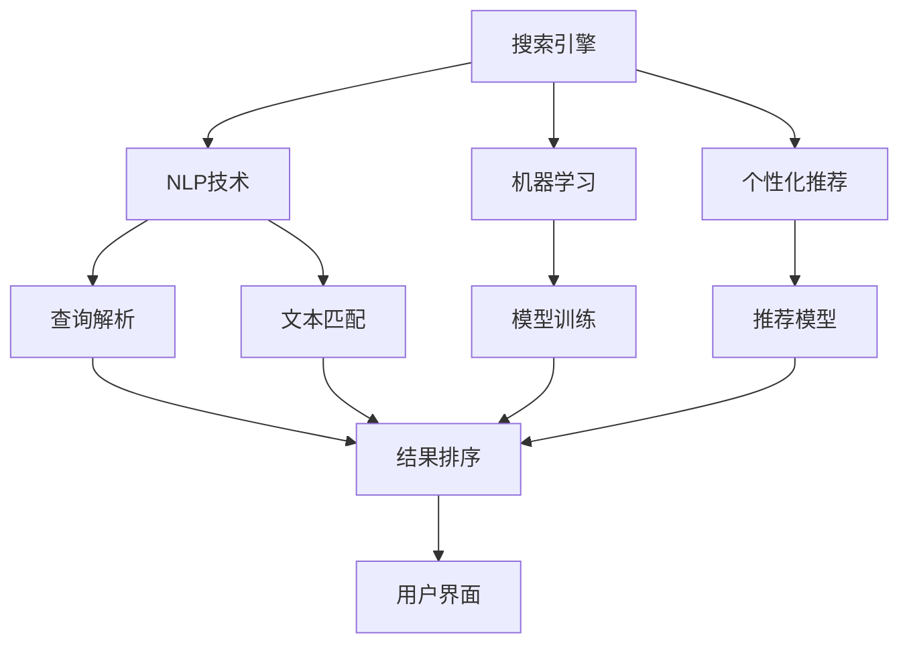

                 

# AI搜索引擎的未来：以用户为中心的体验优化

## 1. 背景介绍

在数字时代，搜索引擎已成为不可或缺的信息获取工具。然而，随着用户需求的日益多元化，传统搜索引擎在用户体验、智能推荐、个性化服务等方面面临巨大挑战。AI技术的快速发展，特别是自然语言处理、机器学习等技术的突破，为搜索引擎提供了新的发展方向。本文将探讨以用户为中心的搜索引擎优化，通过AI技术提升用户体验、增强智能推荐、提升搜索效率，构建更加智能、便捷的搜索系统。

## 2. 核心概念与联系

### 2.1 核心概念概述

为更好地理解以用户为中心的搜索引擎优化，本节将介绍几个密切相关的核心概念：

- **搜索引擎(Search Engine)**：利用爬虫技术抓取网页内容，通过算法模型计算网页与查询的相关度，返回匹配结果的工具。
- **自然语言处理(Natural Language Processing, NLP)**：利用计算机技术处理和分析人类语言，使计算机能够理解、生成和翻译自然语言。
- **机器学习(Machine Learning, ML)**：通过训练数据构建模型，让计算机具备从数据中学习和决策的能力。
- **个性化推荐(Personalized Recommendation)**：根据用户历史行为和偏好，推荐最符合其需求的结果。
- **用户界面(UI)设计**：通过合理布局和交互方式，提升用户操作体验，使搜索结果更易理解和操作。

这些核心概念之间的逻辑关系可以通过以下Mermaid流程图来展示：



这个流程图展示了几大核心概念及其之间的关系：

1. 搜索引擎通过NLP技术对用户查询进行解析，并与网页文本匹配，生成初步结果。
2. 机器学习模型根据用户行为和查询历史进行训练，优化结果排序算法。
3. 个性化推荐模型基于用户偏好，推荐符合其需求的结果。
4. 用户界面设计提升用户体验，使结果展示更直观易用。

## 3. 核心算法原理 & 具体操作步骤

### 3.1 算法原理概述

以用户为中心的搜索引擎优化，核心在于提升用户体验、增强智能推荐和提升搜索效率。以下是这一过程的算法原理概述：

1. **查询解析与文本匹配**：利用NLP技术，将用户查询转化为计算机可理解的形式，并与网页文本进行匹配，生成初步的查询结果。
2. **智能推荐**：基于用户历史行为和查询记录，使用机器学习模型预测用户可能感兴趣的结果，进行个性化推荐。
3. **结果排序与展示**：使用多维度的排序算法，对搜索结果进行排序，结合用户界面设计，优化展示方式，提升用户体验。

### 3.2 算法步骤详解

以用户为中心的搜索引擎优化通常包括以下几个关键步骤：

**Step 1: 准备数据与环境**
- 收集用户查询数据、网页内容、用户行为数据等，作为训练和优化模型的基础。
- 搭建包含NLP、机器学习、推荐系统等组件的搜索引擎系统架构。

**Step 2: 模型构建与训练**
- 使用NLP技术对用户查询进行解析，生成查询向量。
- 使用机器学习模型对网页内容进行特征提取和向量表示。
- 设计推荐模型，如协同过滤、矩阵分解等，根据用户行为和查询历史生成推荐结果。

**Step 3: 结果排序与展示**
- 根据用户查询向量与网页向量匹配度、推荐结果的相关性等指标，使用排序算法对结果进行排序。
- 结合用户界面设计，优化搜索结果展示方式，如摘要、标题、图片等。

**Step 4: 用户体验优化**
- 通过A/B测试等方法，评估不同展示方式和排序算法的效果。
- 根据用户反馈，不断优化模型和界面，提升用户体验。

### 3.3 算法优缺点

以用户为中心的搜索引擎优化具有以下优点：
1. 提升用户体验。通过个性化推荐和优化界面设计，满足用户多样化需求，提升搜索满意度。
2. 增强智能推荐。利用机器学习模型，精准预测用户兴趣，提升搜索结果的相关性。
3. 提升搜索效率。通过高效排序算法和数据处理技术，加快搜索结果的获取速度。

同时，该方法也存在一些局限性：
1. 依赖高质量标注数据。提升推荐精度和搜索效果需要大量高质量的标注数据。
2. 模型复杂度较高。结合NLP、机器学习和推荐系统，模型结构复杂，计算资源需求大。
3. 用户隐私保护。推荐模型需要收集用户行为数据，如何在保证推荐效果的同时，保护用户隐私，是一个重要挑战。

尽管存在这些局限性，但以用户为中心的搜索引擎优化方法仍是目前最先进、最有效的搜索技术之一，广泛应用于各种搜索引擎中。未来相关研究将集中在如何进一步降低对标注数据的依赖，提高模型效率，保障用户隐私等方面。

### 3.4 算法应用领域

以用户为中心的搜索引擎优化技术，在多个领域都有广泛应用，例如：

- 传统搜索引擎：如Google、Bing、百度等，利用NLP和推荐技术，提升搜索结果的准确性和个性化程度。
- 垂直搜索引擎：针对特定领域如医学、法律、旅游等，进行专业化和个性化优化，提升查询效率和相关性。
- 移动搜索：通过优化移动设备上的搜索结果展示方式，提升用户体验。
- 电商搜索：结合推荐系统，提升商品展示和推荐效果，促进交易转化。

## 4. 数学模型和公式 & 详细讲解 & 举例说明

### 4.1 数学模型构建

在以用户为中心的搜索引擎优化中，数学模型主要包括以下几个部分：

- **查询向量表示**：将用户查询转化为向量形式，如使用Word2Vec、BERT等模型进行表示。
- **网页向量表示**：使用NLP技术提取网页文本特征，生成向量表示。
- **推荐模型**：设计推荐算法，如协同过滤、矩阵分解等。
- **结果排序**：设计排序算法，如基于梯度的排序方法、基于深度学习的排序方法等。

### 4.2 公式推导过程

以下以协同过滤推荐算法为例，展示推荐模型的公式推导过程：

协同过滤算法通过计算用户和物品之间的相似度，预测用户可能感兴趣的物品。设用户u对物品i的评分向量为$x_u$，物品i的评分向量为$y_i$，用户对物品的评分矩阵为$X$，物品的评分矩阵为$Y$，用户u对物品i的预测评分$y_{ui}$可通过以下公式计算：

$$
y_{ui} = \sum_{j=1}^{n} \alpha_j x_{uj} y_{ij}
$$

其中，$\alpha_j$为用户u和物品j的相似度系数，可通过余弦相似度等方法计算。

### 4.3 案例分析与讲解

假设某电商网站收集了用户对商品的评分数据$X=[x_{uj}]$和商品描述$D=[d_i]$，希望通过协同过滤算法为用户推荐相似商品。

- **用户查询向量表示**：使用BERT模型对用户查询进行编码，生成查询向量$q$。
- **网页向量表示**：对商品描述进行分词、向量化，使用TF-IDF等方法生成商品向量$d_i$。
- **推荐模型**：计算用户u和物品i的相似度$\alpha_j$，利用公式计算预测评分$y_{ui}$。
- **结果排序**：根据预测评分$y_{ui}$和相关性指标对结果排序，展示给用户。

## 5. 项目实践：代码实例和详细解释说明

### 5.1 开发环境搭建

在进行搜索引擎优化实践前，我们需要准备好开发环境。以下是使用Python进行TensorFlow开发的环境配置流程：

1. 安装Anaconda：从官网下载并安装Anaconda，用于创建独立的Python环境。

2. 创建并激活虚拟环境：
```bash
conda create -n tf-env python=3.7 
conda activate tf-env
```

3. 安装TensorFlow：根据CUDA版本，从官网获取对应的安装命令。例如：
```bash
conda install tensorflow tensorflow-gpu -c conda-forge
```

4. 安装NLP工具包：
```bash
pip install gensim spacy pandas sklearn scikit-learn numpy
```

5. 安装推荐系统工具包：
```bash
pip install surprise tensorflow-recommenders
```

完成上述步骤后，即可在`tf-env`环境中开始搜索引擎优化实践。

### 5.2 源代码详细实现

下面以协同过滤推荐系统为例，展示使用TensorFlow实现用户商品推荐的过程：

```python
import tensorflow as tf
from tensorflow_recommenders.layers import CollaborativeFiltering
from tensorflow.keras.layers import Input, Dense
from tensorflow.keras.models import Model
from tensorflow.keras.optimizers import Adam

# 构建协同过滤推荐模型
user_input = Input(shape=(1,), name='user_input')
item_input = Input(shape=(1,), name='item_input')
similarity = tf.keras.layers.Dot(axes=1)([user_input, item_input])
collaborative_filtering = CollaborativeFiltering(1, name='collaborative_filtering')
predictions = collaborative_filtering(similarity)
model = Model([user_input, item_input], predictions)
model.compile(optimizer=Adam(), loss='mse')

# 训练模型
# 假设已有用户行为数据
X_train = # 用户行为矩阵
y_train = # 用户评分
model.fit([X_train], y_train, epochs=10, batch_size=32)

# 预测推荐
# 假设已有新用户和物品向量
user_vector = # 新用户向量
item_vectors = # 物品向量矩阵
recommendations = model.predict([user_vector, item_vectors])
```

以上就是使用TensorFlow实现协同过滤推荐系统的完整代码实现。可以看到，TensorFlow提供了丰富的工具和组件，使得推荐系统的开发和训练变得简单高效。

### 5.3 代码解读与分析

让我们再详细解读一下关键代码的实现细节：

**模型构建**：
- `Input`层用于输入用户和物品的向量，形状分别为1维。
- `Dot`层用于计算相似度，其中`axes=1`表示在最后一个维度上进行点积。
- `CollaborativeFiltering`层用于构建协同过滤模型，根据相似度预测评分。
- `Model`层用于封装输入和输出，指定优化器和损失函数。

**训练过程**：
- 使用`compile`方法指定优化器和损失函数。
- 使用`fit`方法训练模型，传入用户行为数据和评分数据。

**预测过程**：
- 使用`predict`方法对新用户和物品向量进行评分预测。

可以看到，TensorFlow提供了便捷的界面和丰富的组件，使得推荐系统的开发和训练变得简单高效。开发者可以将更多精力放在模型改进和数据处理等高层逻辑上，而不必过多关注底层的实现细节。

当然，工业级的系统实现还需考虑更多因素，如模型的保存和部署、超参数的自动搜索、更灵活的任务适配层等。但核心的搜索引擎优化流程基本与此类似。

## 6. 实际应用场景

### 6.1 电子商务搜索

电子商务平台需要通过搜索引擎优化，提升商品展示和推荐效果，促进销售转化。搜索引擎通过NLP技术解析用户查询，结合推荐系统算法，生成个性化商品推荐列表，提高用户购买意愿。

在技术实现上，可以收集用户浏览、点击、收藏等行为数据，提取商品标题、描述、标签等文本特征，使用协同过滤等推荐算法生成推荐列表。同时，通过模型微调和A/B测试，不断优化推荐效果，提升用户满意度。

### 6.2 新闻搜索

新闻网站需要快速响应用户查询，为用户提供高质量的新闻内容。搜索引擎通过NLP技术解析用户查询，使用TF-IDF等算法提取新闻文本特征，生成相关性排名，展示给用户。

在技术实现上，可以采集新闻文章，提取摘要、标题、关键词等文本信息，使用TF-IDF算法生成新闻向量表示，结合用户查询向量进行匹配排序。同时，通过用户反馈和行为数据，不断优化搜索结果排序，提升用户体验。

### 6.3 旅游搜索

旅游搜索引擎需要提供个性化的目的地推荐，帮助用户找到合适的旅游目的地。搜索引擎通过NLP技术解析用户查询，结合推荐算法生成目的地推荐列表，提高用户旅行满意度。

在技术实现上，可以收集用户历史旅游数据，提取目的地名称、评分、点评等文本特征，使用协同过滤等推荐算法生成推荐列表。同时，通过模型微调和A/B测试，不断优化推荐效果，提升用户满意度。

### 6.4 未来应用展望

随着搜索引擎技术的不断发展，未来将呈现以下几个趋势：

1. **多模态搜索**：结合图像、视频等非文本数据，提升搜索精度和用户体验。
2. **实时搜索**：利用实时数据处理技术，提供实时搜索结果，满足用户即搜即得的体验。
3. **联邦学习**：通过联邦学习技术，保护用户隐私，同时提升搜索效果。
4. **语义搜索**：利用语义理解技术，提升搜索结果的相关性和理解度。
5. **个性化搜索**：结合用户画像和行为数据，提供更加精准和个性化的搜索结果。

以上趋势展示了搜索引擎优化技术的广阔前景，将进一步提升搜索效率和用户体验，推动搜索引擎技术向更智能、更便捷的方向发展。

## 7. 工具和资源推荐

### 7.1 学习资源推荐

为了帮助开发者掌握搜索引擎优化的理论基础和实践技巧，这里推荐一些优质的学习资源：

1. 《深度学习推荐系统》系列博文：由推荐系统专家撰写，深入浅出地介绍了推荐系统的原理、算法和应用。
2. CS234《深度学习应用于图像识别和语音识别》课程：斯坦福大学开设的计算机视觉课程，涵盖图像处理和深度学习的基础知识。
3. 《自然语言处理综论》书籍：自然语言处理领域的经典教材，全面介绍了NLP的基本概念和前沿技术。
4. HuggingFace官方文档：提供了丰富的预训练语言模型和推荐算法，方便开发者进行学习和应用。
5. GitHub推荐系统开源项目：收集了多种推荐算法的开源实现，提供了丰富的学习资源和代码示例。

通过对这些资源的学习实践，相信你一定能够快速掌握搜索引擎优化的精髓，并用于解决实际的搜索问题。

### 7.2 开发工具推荐

高效的开发离不开优秀的工具支持。以下是几款用于搜索引擎优化的常用工具：

1. TensorFlow：基于Python的开源深度学习框架，支持多种算法和组件，方便进行模型构建和训练。
2. PyTorch：基于Python的开源深度学习框架，灵活度高，支持动态图和静态图，适合快速迭代研究。
3. Keras：基于TensorFlow和Theano的高级API，提供了简单易用的模型构建接口。
4. Scikit-learn：Python的机器学习库，提供了丰富的算法和工具，方便进行数据处理和模型训练。
5. Apache Spark：大规模数据处理框架，支持分布式计算，适合处理大规模推荐数据集。

合理利用这些工具，可以显著提升搜索引擎优化的开发效率，加快创新迭代的步伐。

### 7.3 相关论文推荐

搜索引擎优化技术的发展源于学界的持续研究。以下是几篇奠基性的相关论文，推荐阅读：

1. "Wikipedia-Based Collaborative Filtering for Large-Scale Recommendations"：提出了基于维基百科的协同过滤算法，利用维基百科的高质量数据提升推荐效果。
2. "The TensorFlow Recommenders Library"：TensorFlow推荐的官方文档，介绍了多种推荐算法的原理和实现。
3. "A Survey of Deep Learning-Based Recommendation Systems"：综述了深度学习在推荐系统中的应用，详细介绍了各种深度学习算法的原理和应用。
4. "Collaborative Filtering Techniques for Recommender Systems"：综述了协同过滤算法的基本原理和实现方法，提供了丰富的应用案例和实现细节。
5. "Search Ranking in Big Data"：介绍了搜索引擎优化中的排序算法和实现方法，适用于大规模数据集的处理。

这些论文代表了大语言模型微调技术的发展脉络。通过学习这些前沿成果，可以帮助研究者把握学科前进方向，激发更多的创新灵感。

## 8. 总结：未来发展趋势与挑战

### 8.1 总结

本文对以用户为中心的搜索引擎优化方法进行了全面系统的介绍。首先阐述了搜索引擎优化的背景和意义，明确了搜索引擎优化的核心目标和实现路径。其次，从原理到实践，详细讲解了搜索引擎优化的数学模型和操作步骤，给出了搜索引擎优化的完整代码实例。同时，本文还广泛探讨了搜索引擎优化的应用场景，展示了搜索引擎优化技术的广泛前景。

通过本文的系统梳理，可以看到，以用户为中心的搜索引擎优化技术在提升用户体验、增强智能推荐和提升搜索效率方面具有巨大的潜力。AI技术的不断进步，必将进一步推动搜索引擎优化的发展，使搜索系统变得更加智能、便捷和高效。

### 8.2 未来发展趋势

展望未来，搜索引擎优化技术将呈现以下几个发展趋势：

1. **多模态搜索**：结合图像、视频等非文本数据，提升搜索精度和用户体验。
2. **实时搜索**：利用实时数据处理技术，提供实时搜索结果，满足用户即搜即得的体验。
3. **联邦学习**：通过联邦学习技术，保护用户隐私，同时提升搜索效果。
4. **语义搜索**：利用语义理解技术，提升搜索结果的相关性和理解度。
5. **个性化搜索**：结合用户画像和行为数据，提供更加精准和个性化的搜索结果。

以上趋势展示了搜索引擎优化技术的广阔前景，将进一步提升搜索效率和用户体验，推动搜索引擎技术向更智能、更便捷的方向发展。

### 8.3 面临的挑战

尽管搜索引擎优化技术已经取得了显著的成果，但在迈向更加智能化、普适化应用的过程中，仍面临诸多挑战：

1. **数据质量和标注成本**：高质量标注数据对于提升推荐精度和搜索效果至关重要，但数据采集和标注成本高昂。
2. **模型复杂度和计算资源**：搜索引擎优化需要处理大规模数据和复杂模型，对计算资源的需求较高。
3. **用户隐私保护**：推荐模型需要收集用户行为数据，如何在保证推荐效果的同时，保护用户隐私，是一个重要挑战。
4. **算法公平性和可解释性**：推荐算法可能存在偏见和歧视，如何在算法设计和实现中消除这些不公平现象，提升算法的可解释性，是一个重要课题。

尽管存在这些挑战，但搜索引擎优化技术的潜力巨大，随着技术不断进步，相信这些挑战终将一一克服，搜索引擎优化必将在构建智能搜索系统方面发挥更大作用。

### 8.4 研究展望

未来搜索引擎优化技术需要在以下几个方面进行突破：

1. **提升数据质量**：通过采集和利用高质量数据，提升推荐精度和搜索效果。
2. **优化模型结构**：设计更加高效和轻量级的模型，降低计算资源需求。
3. **保护用户隐私**：利用联邦学习等技术，保护用户隐私的同时提升搜索效果。
4. **提升算法公平性**：在算法设计和实现中消除不公平现象，提升算法的可解释性。
5. **结合多模态数据**：结合图像、视频等多模态数据，提升搜索结果的丰富性和相关性。

这些研究方向的探索，必将引领搜索引擎优化技术迈向更高的台阶，为构建智能搜索系统铺平道路。面向未来，搜索引擎优化技术还需要与其他人工智能技术进行更深入的融合，如知识表示、因果推理、强化学习等，多路径协同发力，共同推动搜索技术的发展。只有勇于创新、敢于突破，才能不断拓展搜索系统的边界，让搜索技术更好地服务于人类社会。

## 9. 附录：常见问题与解答

**Q1：如何提升搜索引擎优化效果？**

A: 提升搜索引擎优化效果需要从多个方面入手：
1. **数据质量**：采集高质量的标注数据，包括用户行为和网页特征。
2. **模型优化**：优化模型结构和算法，提高推荐精度和搜索效率。
3. **算法公平性**：消除算法偏见，提升算法的可解释性。
4. **用户隐私保护**：通过联邦学习等技术，保护用户隐私。
5. **多模态融合**：结合图像、视频等非文本数据，提升搜索效果。

**Q2：搜索引擎优化中如何处理缺失数据？**

A: 处理缺失数据通常采用以下方法：
1. **数据补全**：利用数据插值、均值填补等方法，填补缺失数据。
2. **算法调整**：使用鲁棒性强的推荐算法，如矩阵分解等，处理缺失数据。
3. **多源数据融合**：结合多个数据源，利用融合技术提高数据完整性。
4. **异常检测**：检测并处理异常数据，确保数据的准确性和完整性。

**Q3：如何评估搜索引擎优化的效果？**

A: 评估搜索引擎优化效果通常采用以下方法：
1. **精确率-召回率**：评估搜索结果的相关性和完整性。
2. **用户满意度**：通过用户调查、行为数据等评估用户满意度。
3. **点击率**：通过点击率等指标评估用户点击行为。
4. **转化率**：通过转化率等指标评估用户行为转化效果。

**Q4：搜索引擎优化中如何处理冷启动问题？**

A: 处理冷启动问题通常采用以下方法：
1. **新用户引导**：通过推荐系统引导新用户进行探索，获取初始行为数据。
2. **基于内容的推荐**：利用物品的特征进行推荐，提高新用户探索效果。
3. **多模态融合**：结合图像、视频等非文本数据，提升新用户的搜索体验。
4. **用户画像构建**：构建用户画像，提高对新用户行为的预测精度。

**Q5：如何优化搜索引擎优化系统的可扩展性？**

A: 优化搜索引擎优化系统的可扩展性通常采用以下方法：
1. **分布式计算**：利用分布式计算框架，提高数据处理和模型训练效率。
2. **模型裁剪**：对模型进行裁剪和压缩，减小计算资源需求。
3. **异构数据处理**：利用异构数据处理技术，处理多种数据格式和来源。
4. **模型并行**：利用模型并行技术，提高模型的计算效率。

这些方法可以帮助搜索引擎优化系统更好地应对数据量激增、模型复杂度高等挑战，提高系统的可扩展性和鲁棒性。

---

作者：禅与计算机程序设计艺术 / Zen and the Art of Computer Programming

