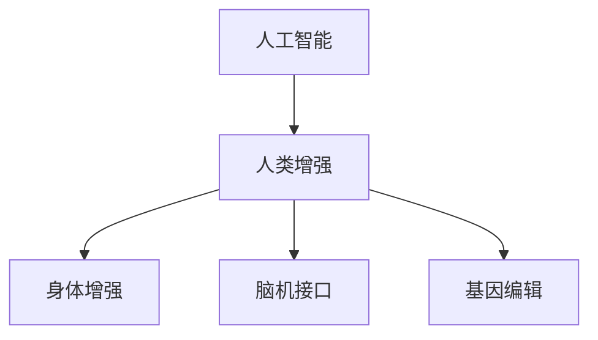

                 

# AI时代的人类增强：道德考虑与身体增强的未来发展机遇分析总结挑战

> 关键词：AI时代,人类增强,身体增强,道德考虑,未来发展机遇,挑战

## 1. 背景介绍

### 1.1 问题由来
随着人工智能(AI)技术的迅猛发展，人类增强（Human Augmentation），尤其是身体增强（Body Enhancement）领域，正逐步崭露头角。无论是在学术界、企业界还是公众视野中，人类增强都成为热门话题。面对这一新兴技术，人们对其带来的机会与挑战展开了激烈的讨论。

大范围的AI技术应用为人类增强提供了无限可能，从可穿戴设备到基因编辑，技术进步让增强人类能力成为可能。然而，伴随着技术进步，也引发了一系列道德和伦理问题，如隐私、安全、社会公平等。

### 1.2 问题核心关键点
在AI时代下，人体增强既包含了机械物理的增强，如假肢、外骨骼等，也包括了软件生物的增强，如脑机接口、基因编辑等。这些技术的结合为人类增强开辟了新的道路。但同时，我们也必须关注和探讨相关的伦理、道德和法律问题，为技术发展设定合理边界。

本文将从伦理道德的角度出发，探讨AI时代下人类增强的发展机遇和面临的挑战，并对技术应用进行全面总结。

## 2. 核心概念与联系

### 2.1 核心概念概述

为深入理解AI时代下的身体增强，本文将介绍以下关键概念：

- **人工智能（AI）**：使用算法和模型，模拟人类智能的机器系统，涵盖了机器学习、深度学习、自然语言处理等多个方向。
- **人类增强（Human Augmentation）**：通过科技手段，提升人类在物理、智力、情感等方面的能力。
- **身体增强（Body Enhancement）**：指利用AI和生物工程技术，对人类的身体结构、功能进行增强，如假肢、外骨骼、基因编辑等。
- **脑机接口（Brain-Computer Interface, BCI）**：通过脑信号与计算机之间的信息交换，实现对脑功能的直接控制。
- **基因编辑（Gene Editing）**：通过CRISPR等技术，精准修改生物体的基因组，从而增强或修复生物体的功能。

这些概念间的联系可以通过以下Mermaid流程图来展示：



这些概念相互交织，共同构成了AI时代下人类增强的技术生态。

## 3. 核心算法原理 & 具体操作步骤
### 3.1 算法原理概述

AI时代下的人类增强，核心在于将AI技术与生物工程技术相结合，以提升或修复人类的功能。算法原理包括以下几个方面：

1. **感知增强**：利用AI技术提升人类感知能力，如增强视觉、听觉、触觉等。
2. **决策辅助**：通过AI技术辅助人类进行复杂决策，如医疗诊断、交通管理等。
3. **认知增强**：通过AI技术提升认知能力，如记忆增强、注意力控制等。
4. **情感增强**：利用AI技术提升情感处理能力，如情感识别、情感生成等。

这些增强手段均依赖于AI技术的支撑，通过深度学习、自然语言处理、计算机视觉等方向的技术实现。

### 3.2 算法步骤详解

以下将详细介绍人类增强的算法实现步骤：

1. **数据采集与预处理**：收集人类生理、行为、心理等数据，如脑电信号、运动数据、情绪反应等。
2. **模型训练与优化**：使用深度学习模型，对采集到的数据进行训练与优化，以提取有价值的信息。
3. **模型部署与应用**：将训练好的模型部署到可穿戴设备、生物接口等载体中，实现对人类功能的增强。
4. **效果评估与反馈**：通过实际使用效果评估模型，收集反馈信息，进一步优化模型。

### 3.3 算法优缺点

**优点**：
1. **功能增强**：通过AI技术，显著提升人类的感知、认知、决策、情感等功能。
2. **实时性高**：AI算法具有高实时性，能够及时响应外部环境的变化，提升人类反应速度。
3. **精度高**：AI算法经过大量数据训练，能够精确预测和控制复杂系统，提高功能执行的准确性。

**缺点**：
1. **伦理争议**：人类增强可能引发一系列伦理争议，如隐私泄露、基因编辑道德问题等。
2. **安全风险**：AI算法可能存在漏洞，导致误操作、数据泄漏等安全问题。
3. **技术依赖**：高度依赖AI技术，如出现技术故障，人类增强效果可能大打折扣。

### 3.4 算法应用领域

人类增强技术在多个领域有广泛应用：

- **医疗**：AI辅助手术、智能假肢、远程医疗等。
- **教育**：增强认知功能、远程学习等。
- **娱乐**：虚拟现实、游戏互动等。
- **交通**：智能辅助驾驶、人体增强助手等。
- **工作**：增强决策能力、工作辅助工具等。

这些应用领域展示了人类增强技术带来的巨大潜力，但也引发了相应的伦理和社会问题。

## 4. 数学模型和公式 & 详细讲解  
### 4.1 数学模型构建

本节将使用数学语言对人类增强的算法实现进行严格刻画。

假设采集到的数据为 $x_i = (x_{i1}, x_{i2}, ..., x_{in})$，其中 $x_{ij}$ 为第 $i$ 个样本的第 $j$ 个特征。通过深度学习模型 $f$，对 $x_i$ 进行映射，得到增强后的功能值 $y_i = f(x_i)$。

定义损失函数 $L(y, \hat{y})$ 用于评估模型预测结果与真实结果之间的差距。常用的损失函数包括均方误差（MSE）、交叉熵（CE）等。通过最小化损失函数，模型不断调整权重，提升预测准确性。

### 4.2 公式推导过程

以均方误差损失函数为例，推导其梯度更新公式：

$$
L(y, \hat{y}) = \frac{1}{N} \sum_{i=1}^N (y_i - \hat{y}_i)^2
$$

对模型权重 $w$ 进行梯度下降更新，计算公式如下：

$$
w \leftarrow w - \eta \nabla_{w}L(y, \hat{y})
$$

其中 $\eta$ 为学习率。

### 4.3 案例分析与讲解

以脑机接口为例，展示AI在感知增强中的应用。假设脑电信号 $x_i = (x_{i1}, x_{i2}, ..., x_{in})$ 用于控制机器臂的运动。通过训练神经网络模型，将脑电信号映射为机器臂的位置和姿态 $y_i = f(x_i)$。通过实时采集脑电信号，利用AI模型控制机器臂的运动，实现对人类感知能力的增强。

## 5. 项目实践：代码实例和详细解释说明
### 5.1 开发环境搭建

在实现人类增强项目前，需要准备相应的开发环境。以下是使用Python和TensorFlow进行开发的流程：

1. 安装Anaconda：从官网下载并安装Anaconda，用于创建独立的Python环境。

2. 创建并激活虚拟环境：
```bash
conda create -n human_enhancement python=3.8 
conda activate human_enhancement
```

3. 安装必要的Python库：
```bash
pip install tensorflow numpy matplotlib tqdm scikit-learn pybrain
```

4. 安装相关硬件设备和软件库：如脑电信号采集设备、脑机接口软件等。

完成上述步骤后，即可在`human_enhancement`环境中开始项目开发。

### 5.2 源代码详细实现

以下展示使用TensorFlow实现脑机接口的代码实现：

```python
import tensorflow as tf
import numpy as np

# 定义神经网络模型
class BCIModel(tf.keras.Model):
    def __init__(self, input_size, output_size):
        super(BCIModel, self).__init__()
        self.dense1 = tf.keras.layers.Dense(64, activation='relu')
        self.dense2 = tf.keras.layers.Dense(output_size)
        
    def call(self, x):
        x = self.dense1(x)
        x = self.dense2(x)
        return x

# 定义数据集
class BCIData(tf.keras.utils.Sequence):
    def __init__(self, data, batch_size=32):
        self.data = data
        self.batch_size = batch_size
        
    def __len__(self):
        return len(self.data) // self.batch_size
    
    def __getitem__(self, idx):
        batch_x = self.data[idx * self.batch_size:(idx+1) * self.batch_size]
        batch_y = self.data[idx * self.batch_size:(idx+1) * self.batch_size]
        return np.array(batch_x), np.array(batch_y)

# 加载数据集
data = load_data() # 根据实际数据加载方式

# 构建模型
model = BCIModel(input_size, output_size)

# 定义优化器
optimizer = tf.keras.optimizers.Adam(learning_rate=0.001)

# 定义损失函数
loss_fn = tf.keras.losses.MeanSquaredError()

# 训练模型
batch_size = 32
epochs = 100

for epoch in range(epochs):
    for batch in BCIData(data, batch_size):
        x, y = batch
        with tf.GradientTape() as tape:
            predictions = model(x)
            loss = loss_fn(y, predictions)
        gradients = tape.gradient(loss, model.trainable_variables)
        optimizer.apply_gradients(zip(gradients, model.trainable_variables))
    print('Epoch {0} Loss: {1}'.format(epoch+1, loss))

# 评估模型
test_data = load_test_data()
test_loss = loss_fn(y_test, model(test_x))
print('Test Loss: {0}'.format(test_loss))
```

### 5.3 代码解读与分析

**BCIModel类**：
- `__init__`方法：初始化模型层，包括两个全连接层。
- `call`方法：前向传播过程，通过两个全连接层计算输出。

**BCIData类**：
- `__init__`方法：初始化数据集，定义批量大小。
- `__len__`方法：计算数据集长度。
- `__getitem__`方法：返回批量数据。

**模型训练**：
- 通过`BCIModel`构建神经网络模型。
- 使用`tf.keras.optimizers.Adam`定义优化器，并设置学习率。
- 定义`tf.keras.losses.MeanSquaredError`作为损失函数。
- 通过`BCIData`对数据集进行批量处理，并在每个epoch迭代训练。

**模型评估**：
- 通过`load_test_data`加载测试数据集。
- 使用测试集数据评估模型性能，计算测试损失。

## 6. 实际应用场景
### 6.1 医疗领域应用

在医疗领域，AI技术可以应用于辅助手术、远程诊断、康复训练等方面。通过脑机接口和基因编辑技术，可以实现精准医疗，提高医疗服务的质量和效率。

具体应用包括：
- 通过脑电信号实时控制手术机器人，实现高精度微创手术。
- 通过基因编辑技术修复基因缺陷，防治遗传疾病。
- 通过AI辅助诊断，提高医生的诊断准确性和效率。

### 6.2 教育领域应用

在教育领域，AI技术可以用于智能辅导、个性化学习、远程教育等。通过增强认知和记忆功能，提升学生的学习效果。

具体应用包括：
- 通过脑机接口技术，实时监控和调节学生的学习状态，进行个性化辅导。
- 通过智能推荐系统，根据学生的学习进度和兴趣，推送适合的课程和资料。
- 通过远程教育平台，实现跨地域的教学和交流。

### 6.3 娱乐领域应用

在娱乐领域，AI技术可以应用于虚拟现实、游戏互动、人机交互等。通过增强感知和情感处理能力，提升娱乐体验。

具体应用包括：
- 通过虚拟现实设备，实现沉浸式体验，如虚拟旅游、虚拟社交等。
- 通过游戏AI，提升游戏互动体验，实现智能对手、智能NPC等。
- 通过情感生成技术，实现情感智能的娱乐应用，如情感聊天机器人等。

## 7. 工具和资源推荐
### 7.1 学习资源推荐

为了帮助开发者系统掌握AI时代下的身体增强，这里推荐一些优质的学习资源：

1. **《深度学习入门》书籍**：张军教授所著，深入浅出地介绍了深度学习的基本概念和实现方法。
2. **《人工智能伦理》课程**：清华大学开设的伦理课程，讲解AI技术的伦理问题，如隐私保护、道德决策等。
3. **《人类增强技术》论文**：多篇关于人类增强的学术文章，涵盖技术实现、伦理讨论等多个方面。
4. **《AI伦理手册》**：由国际AI伦理委员会发布，系统介绍了AI伦理的各个方面，如数据隐私、算法透明等。
5. **Kaggle竞赛**：参加Kaggle的相关竞赛，了解AI技术在实际应用中的实现和优化。

通过对这些资源的学习实践，相信你一定能够快速掌握AI时代下身体增强的精髓，并用于解决实际的伦理和社会问题。

### 7.2 开发工具推荐

高效的开发离不开优秀的工具支持。以下是几款用于AI时代下身体增强开发的常用工具：

1. **TensorFlow**：Google开发的深度学习框架，支持GPU加速，适合大规模深度学习项目。
2. **PyTorch**：Facebook开发的深度学习框架，灵活高效，适合科研和实验开发。
3. **OpenAI Gym**：模拟环境的开发平台，用于测试和优化AI算法。
4. **BrainCom**：脑机接口数据采集软件，提供高质量脑电信号数据。
5. **DeepBrain**：Google开发的脑机接口开发工具包，支持多种脑电信号处理算法。

合理利用这些工具，可以显著提升AI时代下身体增强任务的开发效率，加快创新迭代的步伐。

### 7.3 相关论文推荐

AI时代下的人类增强技术发展源于学界的持续研究。以下是几篇奠基性的相关论文，推荐阅读：

1. **《深度神经网络与脑机接口》论文**：探讨深度学习在脑机接口中的应用，提升感知增强的精度和实时性。
2. **《基因编辑与人类增强》论文**：分析基因编辑技术在人类增强中的潜力，探讨相关伦理和社会问题。
3. **《AI伦理框架》论文**：构建AI伦理的通用框架，探讨如何平衡技术进步和伦理道德。
4. **《人类增强的伦理与法律问题》论文**：探讨人类增强技术在法律和伦理上的问题，提出解决方案和政策建议。

这些论文代表了大时代下人类增强技术的研究脉络，为后续研究提供了宝贵的参考。

## 8. 总结：未来发展趋势与挑战

### 8.1 总结

本文对AI时代下的人类增强技术进行了全面系统的介绍。首先阐述了AI技术在人类增强中的应用场景和前景，明确了技术进步对人类功能提升的巨大潜力。其次，从伦理道德的角度，探讨了AI技术在人类增强中的各种问题，提出了相应的解决策略。最后，总结了技术进步带来的挑战，并提出了未来的发展方向。

通过本文的系统梳理，可以看到，AI时代下的人类增强技术具有广阔的发展前景，但也面临着许多伦理和社会挑战。只有在技术进步的同时，综合考虑伦理和道德问题，才能真正实现人类功能的全面提升。

### 8.2 未来发展趋势

展望未来，AI时代下的人类增强技术将呈现以下几个发展趋势：

1. **技术进步持续加速**：随着深度学习、脑机接口等技术的不断进步，人类增强技术将更加高效、精确。
2. **伦理道德日益重要**：社会对技术伦理的关注日益增加，未来的技术发展将更加注重伦理和道德约束。
3. **跨领域融合加深**：人类增强技术将与医疗、教育、娱乐等领域深度融合，实现多领域协同发展。
4. **个性化定制增强**：根据个体需求，定制化增强方案，提升用户体验。
5. **远程增强成为常态**：远程增强技术将更加成熟，实现跨地域的实时增强。

这些趋势展示了AI时代下人类增强技术的广阔前景，为人类功能的提升提供了新的可能性。

### 8.3 面临的挑战

尽管AI时代下的人类增强技术前景广阔，但也面临着诸多挑战：

1. **伦理争议难以调和**：技术进步带来了新的伦理问题，如基因编辑的道德风险、隐私保护等。如何在技术创新和伦理道德之间找到平衡，将是重要的挑战。
2. **安全性问题突出**：AI增强技术依赖于算法和数据，可能存在安全漏洞，如数据泄漏、算法偏见等。如何提高系统的安全性，防止技术滥用，是急需解决的问题。
3. **技术复杂性高**：人类增强技术涉及多个领域，技术复杂性高，需要跨学科合作。如何降低技术门槛，实现技术普及，是未来的重要任务。
4. **法规和政策缺失**：目前关于人类增强技术的法规和政策还不够完善，如何制定合理的法规和政策，保障技术发展的合法性和公平性，是急需解决的问题。
5. **社会接受度低**：公众对新技术的接受度低，可能引发社会抵触情绪。如何通过教育和宣传，提高公众对技术的理解，是重要的挑战。

### 8.4 研究展望

面对人类增强技术面临的种种挑战，未来的研究需要在以下几个方面寻求新的突破：

1. **伦理和道德研究**：加强对人类增强技术的伦理和道德研究，提出合理的伦理框架和政策建议。
2. **安全性研究**：加强对AI增强技术的安全性研究，开发安全可靠的系统。
3. **跨学科合作**：促进不同领域专家之间的合作，共同推动人类增强技术的发展。
4. **技术普及**：降低人类增强技术的复杂性，提高技术普及率，让更多人受益。
5. **公众教育**：加强对公众的科普教育，提高公众对新技术的理解和接受度。

这些研究方向将为AI时代下人类增强技术的发展提供新的突破，为人类功能的提升带来新的可能性。

## 9. 附录：常见问题与解答

**Q1：AI时代下的人类增强技术是否存在伦理问题？**

A: AI时代下的人类增强技术存在一系列伦理问题，如隐私泄露、基因编辑道德风险、算法偏见等。在技术发展的同时，需要综合考虑伦理道德，制定合理的伦理框架和政策。

**Q2：人类增强技术是否安全可靠？**

A: 人类增强技术依赖于AI算法和数据，存在安全漏洞的风险，如数据泄漏、算法偏见等。需要通过技术手段和法规政策，提高系统的安全性，防止技术滥用。

**Q3：人类增强技术能否在跨领域中应用？**

A: 人类增强技术可以与医疗、教育、娱乐等多个领域深度融合，实现多领域协同发展。跨领域融合将带来新的应用场景，提升人类功能的全面提升。

**Q4：人类增强技术是否有普及的障碍？**

A: 人类增强技术涉及多个领域，技术复杂性高，需要跨学科合作。需要降低技术门槛，提高技术普及率，让更多人受益。

**Q5：如何应对人类增强技术的伦理挑战？**

A: 应对伦理挑战需要多方努力，包括技术研发、政策制定、公众教育等。建立合理的伦理框架和政策，加强公众教育，提高公众对新技术的理解和接受度，才能真正实现技术进步与伦理道德的平衡。

---

作者：禅与计算机程序设计艺术 / Zen and the Art of Computer Programming

