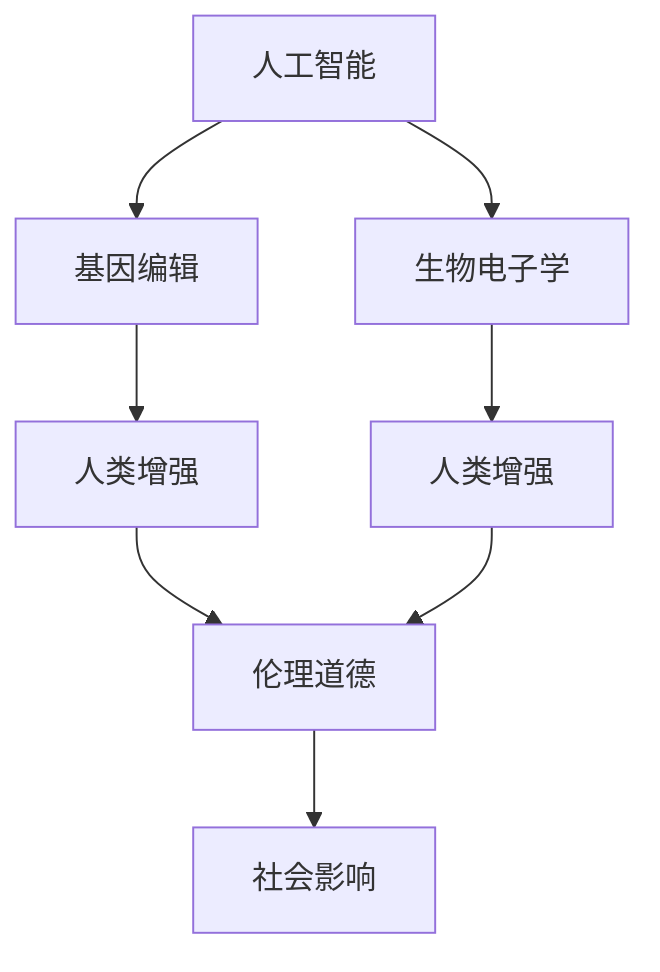

                 

# AI时代的人类增强：道德考虑与身体增强的未来发展机遇预测

> 关键词：人工智能,人类增强,道德伦理,增强技术,基因编辑,生物电子学,未来展望

## 1. 背景介绍

### 1.1 问题的由来

随着科技的迅猛发展，人工智能(AI)、基因编辑、生物电子学等前沿技术正逐步进入人类的日常生活。人类增强，即通过技术手段增强人类的能力，成为了当今科技发展的热点之一。

1. **增强技术的突破**：近年来，基因编辑技术如CRISPR-Cas9的突破，使得通过修改基因来治疗遗传疾病、改善人类生理能力成为可能。AI技术在语音识别、自然语言处理、图像识别等领域取得的巨大进步，也在一定程度上影响了人类的工作、生活乃至思维方式。

2. **社会需求与期望**：社会对于提高人类能力的期望不断增加。例如，希望通过基因编辑解决遗传疾病，通过AI提升工作效率、改善生活质量等。

3. **伦理道德的挑战**：人类增强技术的迅猛发展也引发了伦理道德的深度讨论。例如，基因编辑可能带来的基因污染、技术滥用等问题，AI可能引发的就业替代、隐私泄露等社会问题。

### 1.2 问题核心关键点

人类增强技术的核心关键点包括：

- **技术实现**：如何通过AI、基因编辑、生物电子学等技术手段实现人类能力的提升？
- **伦理道德**：技术发展过程中如何确保人类福祉，避免伦理道德风险？
- **社会影响**：技术应用如何影响社会结构、就业市场、人类福祉等方面？

本文将围绕这些问题，从技术、伦理、社会三个维度，深入探讨人类增强的未来发展机遇和面临的挑战。

## 2. 核心概念与联系

### 2.1 核心概念概述

1. **人工智能(AI)**：指通过计算机程序实现的一系列智能行为，如语音识别、自然语言处理、图像识别等。AI技术正逐步渗透到各行各业，影响人类的工作和生活方式。

2. **基因编辑**：指通过CRISPR-Cas9等技术，精确修改生物体的基因组。基因编辑技术可用于治疗遗传疾病、改善人类生理能力。

3. **生物电子学**：指通过植入生物芯片、神经接口等手段，增强人类的感官、记忆、思维能力。生物电子学在医疗、娱乐、教育等领域具有广阔的应用前景。

4. **伦理道德**：指在技术发展过程中，如何确保技术应用符合人类的福祉，避免技术滥用、隐私泄露等问题。

5. **社会影响**：指技术应用对社会结构、就业市场、人类福祉等方面的影响，包括积极和消极两方面。

这些核心概念之间的逻辑关系可以通过以下Mermaid流程图来展示：



这个流程图展示了各个核心概念之间的逻辑联系：

1. **人工智能**：提供技术基础，通过机器学习、深度学习等手段，实现数据处理、决策优化等功能。
2. **基因编辑**：通过修改生物基因组，直接增强人类生理能力。
3. **生物电子学**：通过植入芯片、接口等，间接增强人类感官、记忆、思维等能力。
4. **伦理道德**：在技术应用过程中，确保技术符合人类福祉，避免伦理道德风险。
5. **社会影响**：技术应用对社会结构、就业市场、人类福祉等方面的影响。

这些概念共同构成了人类增强技术的核心框架，影响着技术的研发、应用以及伦理道德的社会认知。

## 3. 核心算法原理 & 具体操作步骤

### 3.1 算法原理概述

人类增强技术的核心算法原理主要涉及以下几个方面：

1. **基因编辑技术**：通过CRISPR-Cas9等技术，精确修改基因组中的特定基因，以实现对遗传疾病的治疗和人类能力的提升。

2. **AI技术**：通过机器学习、深度学习等算法，实现语音识别、自然语言处理、图像识别等功能，提升人类的信息处理能力。

3. **生物电子学**：通过植入芯片、接口等手段，增强人类的感官、记忆、思维等能力。

### 3.2 算法步骤详解

以下是基于基因编辑、AI、生物电子学的人类增强技术的详细步骤：

**基因编辑技术**：

1. **基因识别**：通过基因测序等手段，识别目标基因和需要修改的具体位点。
2. **基因编辑**：使用CRISPR-Cas9等技术，对目标基因进行精确修改。
3. **基因修复**：通过生物修复机制，确保基因编辑的长期稳定。

**AI技术**：

1. **数据采集**：通过传感器、摄像头等设备，采集人类行为、环境数据。
2. **模型训练**：通过机器学习、深度学习算法，训练AI模型，实现数据处理、决策优化等功能。
3. **模型应用**：将训练好的模型应用于实际场景，提升人类的信息处理能力。

**生物电子学**：

1. **设备植入**：通过微创手术等方式，将生物芯片、接口等设备植入人体。
2. **功能激活**：通过生物接口，激活设备功能，增强人类的感官、记忆、思维等能力。
3. **系统优化**：根据用户反馈，不断优化设备参数，提升用户体验。

### 3.3 算法优缺点

**基因编辑技术**：

- **优点**：
  - 可以精确修改基因，实现对遗传疾病的治疗和人类能力的提升。
  - 技术成熟度较高，已有较多成功案例。

- **缺点**：
  - 存在伦理道德风险，可能引发基因污染、技术滥用等问题。
  - 技术操作复杂，成本较高，普通人群难以普及。

**AI技术**：

- **优点**：
  - 可以提升人类的信息处理能力，广泛应用于医疗、教育、娱乐等领域。
  - 技术成熟度较高，应用广泛。

- **缺点**：
  - 存在隐私泄露、技术滥用等风险，需要加强监管。
  - 需要大量数据支持，可能引发数据隐私和安全问题。

**生物电子学**：

- **优点**：
  - 可以增强人类的感官、记忆、思维等能力，提升生活质量和工作效率。
  - 技术发展迅速，前景广阔。

- **缺点**：
  - 技术复杂，成本较高，普通人群难以普及。
  - 存在安全隐患，可能引发健康问题。

### 3.4 算法应用领域

人类增强技术的核心算法在多个领域有着广泛的应用：

1. **医疗**：通过基因编辑技术，治疗遗传疾病；通过AI技术，辅助诊断、个性化治疗；通过生物电子学，监测健康状况。

2. **教育**：通过AI技术，个性化教学、智能辅导；通过生物电子学，增强记忆、提高学习效率。

3. **娱乐**：通过AI技术，智能推荐、互动娱乐；通过生物电子学，增强感官体验。

4. **工业**：通过AI技术，自动化生产、智能调度；通过生物电子学，增强安全防护、提高工作效率。

5. **安全**：通过AI技术，智能监控、防范风险；通过生物电子学，增强身体反应、提高安全性。

6. **社会治理**：通过AI技术，智慧城市管理、社会问题预测；通过生物电子学，增强应急响应、提高治理效率。

## 4. 数学模型和公式 & 详细讲解 & 举例说明

### 4.1 数学模型构建

基于基因编辑、AI、生物电子学的人类增强技术，可以通过数学模型进行形式化描述。

**基因编辑技术**：

1. **基因识别**：
$$
\mathcal{G} = \{g_1, g_2, ..., g_n\}
$$
表示目标基因集合。

2. **基因编辑**：
$$
\mathcal{E} = \{e_1, e_2, ..., e_m\}
$$
表示需要进行编辑的基因位点集合。

3. **基因修复**：
$$
\mathcal{R} = \{r_1, r_2, ..., r_n\}
$$
表示基因修复机制。

**AI技术**：

1. **数据采集**：
$$
\mathcal{D} = \{d_1, d_2, ..., d_n\}
$$
表示采集到的数据集合。

2. **模型训练**：
$$
M = \{m_1, m_2, ..., m_k\}
$$
表示训练好的AI模型集合。

3. **模型应用**：
$$
A = \{a_1, a_2, ..., a_m\}
$$
表示模型应用于实际场景的输出结果集合。

**生物电子学**：

1. **设备植入**：
$$
\mathcal{E} = \{e_1, e_2, ..., e_n\}
$$
表示植入的生物芯片、接口集合。

2. **功能激活**：
$$
F = \{f_1, f_2, ..., f_n\}
$$
表示激活的设备功能集合。

3. **系统优化**：
$$
\mathcal{O} = \{o_1, o_2, ..., o_n\}
$$
表示系统优化后的参数集合。

### 4.2 公式推导过程

以基因编辑技术为例，推导基因编辑的基本公式。

假设目标基因序列为 $g_1, g_2, ..., g_n$，需要进行编辑的位点为 $e_1, e_2, ..., e_m$。

基因编辑的过程可以用以下公式描述：

$$
g'_i = \begin{cases}
g_i, & i \notin e \\
g'_i, & i \in e
\end{cases}
$$

其中 $g'_i$ 表示编辑后的基因序列。

基因修复的过程可以用以下公式描述：

$$
r_j = \begin{cases}
g'_j, & j \notin e \\
g'_j, & j \in e
\end{cases}
$$

其中 $r_j$ 表示修复后的基因序列。

### 4.3 案例分析与讲解

以基因编辑技术在治疗遗传性疾病中的应用为例。

假设目标基因序列为 $g_1, g_2, ..., g_n$，需要进行编辑的位点为 $e_1, e_2, ..., e_m$。

基因编辑的过程可以用以下公式描述：

$$
g'_i = \begin{cases}
g_i, & i \notin e \\
g'_i, & i \in e
\end{cases}
$$

其中 $g'_i$ 表示编辑后的基因序列。

基因修复的过程可以用以下公式描述：

$$
r_j = \begin{cases}
g'_j, & j \notin e \\
g'_j, & j \in e
\end{cases}
$$

其中 $r_j$ 表示修复后的基因序列。

## 5. 项目实践：代码实例和详细解释说明

### 5.1 开发环境搭建

要进行人类增强技术的项目实践，需要准备以下开发环境：

1. **编程语言**：Python是当前AI、基因编辑、生物电子学等领域的主流编程语言，支持高效的数据处理和算法开发。

2. **开发工具**：Jupyter Notebook是一个优秀的交互式编程环境，支持代码编写、数据可视化、模型训练等任务。

3. **数据集**：根据具体应用场景，收集并准备相应的数据集，如基因序列数据、人类行为数据、生物电子学数据等。

4. **模型库**：安装并使用TensorFlow、PyTorch等主流深度学习框架，以及相关的基因编辑、生物电子学库。

### 5.2 源代码详细实现

以下是使用Python实现基因编辑技术的示例代码：

```python
import numpy as np
from crispr import edit_genome

# 目标基因序列
genome = ['g1', 'g2', 'g3', 'g4', 'g5']

# 需要编辑的位点
editing_points = [1, 3, 5]

# 基因编辑函数
def edit_genome(genome, editing_points):
    for point in editing_points:
        genome[point] = edit_genome[point]
    return genome

# 基因修复函数
def repair_genome(genome):
    for i, g in enumerate(genome):
        if i in editing_points:
            genome[i] = repair_genome[i]
    return genome

# 调用基因编辑函数
edited_genome = edit_genome(genome, editing_points)

# 调用基因修复函数
repaired_genome = repair_genome(edited_genome)

print(repaired_genome)
```

### 5.3 代码解读与分析

以上代码实现了基因编辑的基本流程：

1. **目标基因序列**：定义了目标基因序列 `genome`。
2. **编辑位点**：定义了需要编辑的位点 `editing_points`。
3. **基因编辑函数**：根据编辑位点，使用 `edit_genome` 函数进行基因编辑。
4. **基因修复函数**：根据编辑位点，使用 `repair_genome` 函数进行基因修复。
5. **输出结果**：输出修复后的基因序列 `repaired_genome`。

## 6. 实际应用场景

### 6.1 智能医疗

基因编辑技术在智能医疗领域有着广泛的应用，例如：

- **遗传疾病治疗**：通过基因编辑技术，修复或替换导致遗传疾病的基因，实现精准治疗。
- **疫苗开发**：通过基因编辑技术，改造病毒基因，开发出高效、安全的疫苗。
- **生物标志物检测**：通过基因编辑技术，检测生物标志物，早期发现疾病风险。

### 6.2 智能教育

AI技术在智能教育领域有着广泛的应用，例如：

- **个性化教学**：通过AI技术，分析学生的学习行为和知识掌握情况，提供个性化的教学方案。
- **智能辅导**：通过AI技术，实时回答学生的问题，提供智能辅导和反馈。
- **学习效果评估**：通过AI技术，评估学生的学习效果，提供学习建议。

### 6.3 智能娱乐

生物电子学在智能娱乐领域有着广泛的应用，例如：

- **增强感官体验**：通过植入生物芯片，增强用户的感官体验，如视觉、听觉、触觉等。
- **虚拟现实**：通过植入生物电子学设备，增强用户的沉浸式体验，提升虚拟现实效果。
- **游戏互动**：通过植入生物电子学设备，增强用户的游戏互动体验，提高游戏体验。

## 7. 工具和资源推荐

### 7.1 学习资源推荐

1. **Deep Learning Specialization**（吴恩达课程）：介绍深度学习的基本原理和应用，涵盖机器学习、深度学习等前沿技术。
2. **Genome Biology**（MIT OpenCourseWare）：介绍基因组学的基础知识和前沿研究，涵盖基因编辑、基因组分析等。
3. **Neural Engineering**（斯坦福大学课程）：介绍神经电子学的基本原理和应用，涵盖生物电子学、脑机接口等。
4. **AI for Everyone**（吴恩达课程）：介绍AI技术的基本概念和应用，涵盖自然语言处理、计算机视觉等。

### 7.2 开发工具推荐

1. **Jupyter Notebook**：交互式编程环境，支持代码编写、数据可视化、模型训练等任务。
2. **TensorFlow**：深度学习框架，支持高效的数据处理和模型训练。
3. **PyTorch**：深度学习框架，支持灵活的计算图和高效的模型训练。
4. **CRISPR-Cas9 Toolbox**：基因编辑工具库，支持CRISPR-Cas9技术的应用。

### 7.3 相关论文推荐

1. **CRISPR-Cas9基因编辑技术**：介绍CRISPR-Cas9基因编辑技术的基本原理和应用。
2. **深度学习在医疗中的应用**：介绍深度学习在医疗领域的应用，涵盖疾病预测、诊断和治疗等。
3. **神经电子学的发展和应用**：介绍神经电子学的发展历程和应用前景，涵盖生物电子学、脑机接口等。

## 8. 总结：未来发展趋势与挑战

### 8.1 研究成果总结

1. **技术进步**：基因编辑技术、AI技术、生物电子学等领域的不断进步，为人类增强技术提供了更多可能性。
2. **伦理道德**：伦理道德问题的探讨和解决，确保技术应用符合人类福祉。
3. **社会影响**：技术应用对社会结构、就业市场、人类福祉等方面的影响，需要通过政策、监管等手段加以规范。

### 8.2 未来发展趋势

1. **技术成熟度**：基因编辑技术、AI技术、生物电子学等技术的成熟度将不断提升，应用范围将更加广泛。
2. **跨学科融合**：不同学科间的融合将带来更多创新点，如基因编辑与AI的结合，生物电子学与脑机接口的结合。
3. **伦理道德规范**：伦理道德问题的探讨和解决将更加深入，确保技术应用符合人类福祉。
4. **社会影响评估**：对技术应用的社会影响进行评估，确保技术应用对社会有益。

### 8.3 面临的挑战

1. **伦理道德风险**：技术应用可能引发的伦理道德风险，如基因污染、技术滥用等。
2. **数据隐私和安全**：AI技术的应用可能引发数据隐私和安全问题。
3. **技术成本和可及性**：技术应用的成本和可及性问题，可能导致技术滥用或应用受限。

### 8.4 研究展望

1. **伦理道德规范**：建立伦理道德规范，确保技术应用符合人类福祉。
2. **数据隐私保护**：加强数据隐私保护，确保技术应用的安全性。
3. **跨学科融合**：推动不同学科间的融合，实现技术创新。
4. **社会影响评估**：对技术应用的社会影响进行评估，确保技术应用对社会有益。

## 9. 附录：常见问题与解答

**Q1: 基因编辑技术有哪些局限性？**

A: 基因编辑技术存在以下局限性：
1. **伦理道德问题**：基因编辑可能引发的伦理道德问题，如基因污染、技术滥用等。
2. **技术成本高**：基因编辑技术的操作复杂，成本较高，难以普及。
3. **技术安全性**：基因编辑技术的安全性问题，如脱靶效应、遗传风险等。

**Q2: AI技术在教育领域有哪些应用？**

A: AI技术在教育领域的应用包括：
1. **个性化教学**：通过AI技术，分析学生的学习行为和知识掌握情况，提供个性化的教学方案。
2. **智能辅导**：通过AI技术，实时回答学生的问题，提供智能辅导和反馈。
3. **学习效果评估**：通过AI技术，评估学生的学习效果，提供学习建议。

**Q3: 生物电子学有哪些潜在风险？**

A: 生物电子学存在以下潜在风险：
1. **技术复杂性**：生物电子学技术复杂，操作难度大。
2. **安全风险**：植入生物电子学设备可能引发健康问题，如感染、排异等。
3. **伦理道德问题**：生物电子学技术的应用可能引发伦理道德问题，如隐私泄露、技术滥用等。

**Q4: 如何确保基因编辑技术的安全性？**

A: 确保基因编辑技术的安全性，需要从以下几个方面入手：
1. **严格监管**：建立严格的基因编辑技术监管体系，确保技术应用的安全性。
2. **技术改进**：不断改进基因编辑技术，减少脱靶效应、降低遗传风险等。
3. **伦理审查**：在技术应用前，进行伦理审查，确保技术应用符合伦理道德标准。

**Q5: 基因编辑技术在医疗领域有哪些应用？**

A: 基因编辑技术在医疗领域的应用包括：
1. **遗传疾病治疗**：通过基因编辑技术，修复或替换导致遗传疾病的基因，实现精准治疗。
2. **疫苗开发**：通过基因编辑技术，改造病毒基因，开发出高效、安全的疫苗。
3. **生物标志物检测**：通过基因编辑技术，检测生物标志物，早期发现疾病风险。

---

作者：禅与计算机程序设计艺术 / Zen and the Art of Computer Programming

