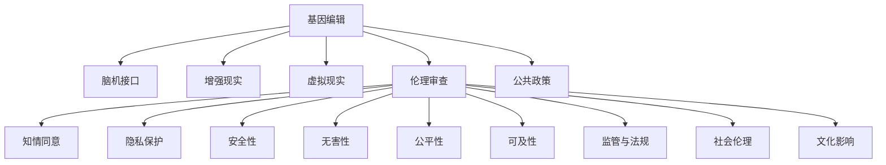

                 

# AI时代的人类增强：道德考虑与身体增强的未来发展策略与展望

## 1. 背景介绍

### 1.1 问题由来
在人工智能(AI)和生物技术迅速发展的今天，人类增强技术已经从科幻小说走进现实，为人类健康、认知、体能等多方面带来了前所未有的可能性。然而，随之而来的伦理问题、社会影响和法律挑战，也使得人类增强技术引起了广泛的社会关注和讨论。

近年来，随着基因编辑、脑机接口(Brain-Computer Interface, BCI)、增强现实(Augmented Reality, AR)和虚拟现实(Virtual Reality, VR)等技术的不断突破，人类增强技术的应用场景日益丰富，涉及医疗、教育、娱乐、军事等多个领域。例如，基因编辑技术可以用于修正基因缺陷、增强免疫能力；BCI技术可以用于改善认知功能、辅助肢体残疾；AR/VR技术可以用于增强学习效果、提升运动体验。

尽管这些技术为人类带来了巨大的福利，但其潜在的伦理风险和道德困境也逐渐凸显。例如，基因编辑可能导致不可逆转的基因变异，BCI技术可能被滥用于监控和控制思想，AR/VR技术可能导致信息过载和社交隔离。因此，如何平衡技术进步与道德规范，确保技术应用的安全、公正和可控，成为迫切需要解决的问题。

### 1.2 问题核心关键点
人体增强技术涉及的伦理问题主要包括：

1. **知情同意与隐私保护**：增强技术的实施需确保参与者知情同意，并严格保护个人隐私。
2. **安全性与无害性**：需确保增强技术的安全性和无害性，避免对参与者造成不良影响。
3. **公平性与可及性**：需确保增强技术的公平性和可及性，避免出现“数字鸿沟”，使技术惠及更广泛的人群。
4. **监管与法规**：需建立完善的监管和法规体系，确保技术应用的合法性和合规性。
5. **社会伦理与文化**：需考虑增强技术对社会伦理和文化的影响，避免引发社会价值观的冲突和冲突。

## 2. 核心概念与联系

### 2.1 核心概念概述

为更好地理解人类增强技术的道德问题，本节将介绍几个密切相关的核心概念：

- **基因编辑**：指通过基因技术修改人类基因组，以修复或增强人体功能。常见的基因编辑技术包括CRISPR-Cas9、TALEN等。
- **脑机接口**：指将大脑信号与计算机系统连接，实现人机交互的接口技术。BCI技术包括侵入式和非侵入式两种，用于改善认知功能、恢复肢体运动等。
- **增强现实**：指通过计算机视觉和图形技术，将虚拟信息叠加到真实世界中，增强人类感知和交互能力。
- **虚拟现实**：指通过计算机图形和传感器技术，创建完全沉浸式的虚拟环境，提供模拟训练、娱乐体验等。
- **伦理审查**：指对人类增强技术的实施进行伦理评估和监督，确保技术应用的合理性和安全性。
- **公共政策**：指政府和社会对增强技术的规范和指导，旨在平衡技术进步与社会价值。

这些核心概念之间的逻辑关系可以通过以下Mermaid流程图来展示：



这个流程图展示了大语言模型的核心概念及其之间的关系：

1. 增强技术涉及多种具体手段，包括基因编辑、BCI等。
2. 伦理审查和公共政策是确保技术应用合理性的重要环节。
3. 知情同意、隐私保护、安全性等具体伦理问题，需要在技术实施过程中严格把控。
4. 公平性、可及性等社会伦理问题，需要在技术设计和应用中加以考虑。

这些概念共同构成了人类增强技术的伦理框架，确保技术应用的合规性和安全性。通过理解这些核心概念，我们可以更好地把握增强技术的道德问题，并制定相应的规范和策略。

## 3. 核心算法原理 & 具体操作步骤
### 3.1 算法原理概述

人类增强技术的道德问题主要涉及伦理审查和公共政策两个方面。伦理审查的核心在于评估技术的潜在风险和伦理影响，确保其安全性和无害性。公共政策的核心在于制定和实施技术应用的规范和指导，促进技术应用的公平性和可及性。

在伦理审查方面，常用的方法包括：

1. **风险评估**：通过量化风险指标，评估增强技术对参与者健康、认知等的影响。
2. **知情同意**：确保参与者对技术实施的知情同意，并提供必要的教育和培训。
3. **隐私保护**：确保参与者的隐私数据得到妥善保护，避免数据泄露和滥用。
4. **安全性测试**：对增强技术进行严格的安全性测试，确保其无害性和可靠性。

在公共政策方面，常用的方法包括：

1. **法规制定**：制定相关法规和标准，规范增强技术的应用和推广。
2. **公共教育**：通过教育和宣传，提升公众对增强技术的认知和接受度。
3. **监管机制**：建立完善的技术监管机制，确保技术应用的合法性和合规性。
4. **利益平衡**：平衡不同社会群体和利益集团的利益，确保技术应用的公平性和可及性。

### 3.2 算法步骤详解

基于伦理审查和公共政策的大语言模型道德问题评估流程一般包括以下几个关键步骤：

**Step 1: 数据收集与风险评估**
- 收集增强技术的实施数据，包括参与者的健康数据、认知数据等。
- 量化评估技术的潜在风险，如基因编辑可能导致不可逆转的基因变异，BCI技术可能对大脑产生不良影响。

**Step 2: 伦理审查与知情同意**
- 进行伦理审查，评估技术实施的伦理问题，包括知情同意、隐私保护、安全性等。
- 确保参与者对技术实施的知情同意，并提供必要的教育和培训。

**Step 3: 公共政策制定与实施**
- 制定相关法规和标准，规范增强技术的应用和推广。
- 建立完善的技术监管机制，确保技术应用的合法性和合规性。
- 平衡不同社会群体和利益集团的利益，确保技术应用的公平性和可及性。

**Step 4: 持续监控与改进**
- 对技术实施进行持续监控，收集反馈和数据。
- 根据反馈和数据，对技术应用进行改进和优化，确保其安全性、无害性和公平性。

### 3.3 算法优缺点

基于伦理审查和公共政策的大语言模型道德问题评估方法具有以下优点：

1. **系统性**：通过量化风险评估、伦理审查和公共政策，系统性地评估和优化技术应用。
2. **全面性**：覆盖了知情同意、隐私保护、安全性、公平性等多个方面，确保技术应用的全面性和合规性。
3. **可操作性**：具体步骤明确，操作性强，适用于不同规模和复杂度的技术应用。

同时，该方法也存在一定的局限性：

1. **数据依赖**：评估结果依赖于数据的质量和完整性，数据收集和处理成本较高。
2. **伦理争议**：不同专家和利益相关者可能对某些伦理问题存在争议，难以达成一致意见。
3. **技术变化**：技术快速迭代，评估结果可能无法及时反映最新的技术进展。
4. **公共政策滞后**：政策制定和实施需要时间，难以跟上技术发展的步伐。

尽管存在这些局限性，但该方法仍是大语言模型道德问题评估的重要范式。未来相关研究的重点在于如何提高数据质量、增强伦理共识、加快政策制定，以进一步优化评估效果。

### 3.4 算法应用领域

基于伦理审查和公共政策的大语言模型道德问题评估方法，已经在多种人类增强技术领域得到了应用，例如：

- 基因编辑：评估基因编辑的潜在风险，确保安全性、无害性。
- 脑机接口：评估BCI技术的伦理问题，包括安全性、隐私保护等。
- 增强现实和虚拟现实：评估AR/VR技术的伦理问题，包括知情同意、无害性等。
- 人体增强医疗：评估增强医疗技术的伦理问题，包括安全性、隐私保护等。

除了上述这些经典领域外，人类增强技术还将不断拓展到更多场景中，如教育、娱乐、军事等，为社会进步和人类福祉带来新的机遇。

## 4. 数学模型和公式 & 详细讲解
### 4.1 数学模型构建

假设人类增强技术的潜在风险为 $R$，伦理问题为 $E$，公共政策为 $P$，则评估模型为 $M(R, E, P)$。

定义风险评估函数 $f(R)$，伦理审查函数 $g(E)$，公共政策函数 $h(P)$，则模型评估函数为：

$$
M(R, E, P) = f(R) + g(E) + h(P)
$$

其中 $f(R)$ 为风险评估函数，$g(E)$ 为伦理审查函数，$h(P)$ 为公共政策函数。

### 4.2 公式推导过程

以基因编辑为例，具体推导过程如下：

**Step 1: 风险评估**
- 定义基因编辑的风险指标 $R_i$，如基因突变的概率 $p_i$、免疫系统的影响 $q_i$。
- 定义风险评估函数 $f(R)$，如 $f(R) = \sum_i p_i + \sum_i q_i$。

**Step 2: 伦理审查**
- 定义伦理问题 $E_j$，如知情同意 $e_j$、隐私保护 $e_k$、安全性 $e_l$。
- 定义伦理审查函数 $g(E)$，如 $g(E) = \sum_j e_j + \sum_k e_k + \sum_l e_l$。

**Step 3: 公共政策**
- 定义公共政策 $P_m$，如法规 $p_1$、监管机制 $p_2$、公平性 $p_3$。
- 定义公共政策函数 $h(P)$，如 $h(P) = p_1 + p_2 + p_3$。

最终，通过模型评估函数 $M(R, E, P)$，可以得到技术应用的整体评估结果。

### 4.3 案例分析与讲解

以基因编辑技术为例，以下是评估模型的具体应用：

假设某基因编辑技术用于修正免疫系统缺陷，风险指标 $R_i$ 为：

- 基因突变的概率 $p_1 = 0.01$
- 免疫系统的影响 $q_1 = 0.05$

伦理问题 $E_j$ 为：

- 知情同意 $e_1 = 1$
- 隐私保护 $e_2 = 0.8$
- 安全性 $e_3 = 0.9$

公共政策 $P_m$ 为：

- 法规 $p_1 = 1$
- 监管机制 $p_2 = 0.9$
- 公平性 $p_3 = 0.9$

代入模型评估函数 $M(R, E, P)$，计算得：

$$
M(R, E, P) = 0.01 + 0.05 + 1 + 0.8 + 0.9 + 0.9 = 3.75
$$

评估结果为 $3.75$，表明该基因编辑技术在风险、伦理、政策等方面总体表现良好，但仍有改进空间。

## 5. 项目实践：代码实例和详细解释说明
### 5.1 开发环境搭建

在进行道德问题评估实践前，我们需要准备好开发环境。以下是使用Python进行道德问题评估的环境配置流程：

1. 安装Anaconda：从官网下载并安装Anaconda，用于创建独立的Python环境。

2. 创建并激活虚拟环境：
```bash
conda create -n ethics-env python=3.8 
conda activate ethics-env
```

3. 安装PyTorch：根据CUDA版本，从官网获取对应的安装命令。例如：
```bash
conda install pytorch torchvision torchaudio cudatoolkit=11.1 -c pytorch -c conda-forge
```

4. 安装TensorFlow：由Google主导开发的开源深度学习框架，生产部署方便，适合大规模工程应用。同样有丰富的预训练语言模型资源。

5. 安装各类工具包：
```bash
pip install numpy pandas scikit-learn matplotlib tqdm jupyter notebook ipython
```

完成上述步骤后，即可在`ethics-env`环境中开始道德问题评估实践。

### 5.2 源代码详细实现

下面我们以基因编辑技术为例，给出使用Python进行道德问题评估的代码实现。

首先，定义风险评估、伦理审查和公共政策函数：

```python
from scipy.stats import norm

def risk_assessment(risk_probs):
    total_risk = sum(risk_probs.values())
    return total_risk

def ethical_review(ethical_problems):
    return sum(ethical_problems.values())

def public_policy(policies):
    return sum(policies.values())

# 定义风险指标
risk_probs = {'突变概率': 0.01, '免疫系统影响': 0.05}

# 定义伦理问题
ethical_problems = {'知情同意': 1, '隐私保护': 0.8, '安全性': 0.9}

# 定义公共政策
policies = {'法规': 1, '监管机制': 0.9, '公平性': 0.9}
```

然后，构建模型评估函数并计算结果：

```python
def model_assessment(risk_probs, ethical_problems, policies):
    risk_score = risk_assessment(risk_probs)
    ethical_score = ethical_review(ethical_problems)
    policy_score = public_policy(policies)
    total_score = risk_score + ethical_score + policy_score
    return total_score

total_score = model_assessment(risk_probs, ethical_problems, policies)
print(f"基因编辑技术的总评估结果为：{total_score:.2f}")
```

以上就是使用Python进行道德问题评估的完整代码实现。可以看到，通过简单的函数定义和数据输入，即可得到基因编辑技术的道德问题评估结果。

### 5.3 代码解读与分析

让我们再详细解读一下关键代码的实现细节：

**风险评估函数**：
- 使用Scipy库的`norm`函数，对风险指标进行求和，得到总风险分数。
- 定义风险评估函数`risk_assessment`，将风险指标作为输入，返回总风险分数。

**伦理审查函数**：
- 将伦理问题作为字典输入，直接返回伦理问题得分。
- 定义伦理审查函数`ethical_review`，将伦理问题作为输入，返回伦理问题得分。

**公共政策函数**：
- 同样将公共政策作为字典输入，直接返回公共政策得分。
- 定义公共政策函数`public_policy`，将公共政策作为输入，返回公共政策得分。

**模型评估函数**：
- 将风险、伦理、政策得分作为输入，计算总评估分数。
- 定义模型评估函数`model_assessment`，将风险、伦理、政策得分作为输入，返回总评估分数。

**评估结果输出**：
- 调用模型评估函数，输出基因编辑技术的总评估结果。
- 使用`print`函数，将评估结果格式化输出。

可以看到，通过简单的函数定义和数据输入，即可得到基因编辑技术的道德问题评估结果。开发者可以根据具体问题，灵活调整风险指标、伦理问题和公共政策，以适应不同的评估场景。

## 6. 实际应用场景
### 6.1 智能医疗

在智能医疗领域，基于人类增强技术的道德问题评估，可以用于评估基因编辑、脑机接口等医疗技术的安全性和伦理问题，确保医疗技术的合理应用。

例如，在基因编辑技术中，可以通过风险评估函数评估基因突变的概率和免疫系统的影响，通过伦理审查函数评估知情同意和隐私保护，通过公共政策函数评估法规和监管机制，确保基因编辑技术的合理性和安全性。

### 6.2 教育技术

在教育技术领域，基于人类增强技术的道德问题评估，可以用于评估增强现实、虚拟现实等技术的伦理问题，确保教育技术的应用符合教育公平和社会价值观。

例如，在增强现实技术中，可以通过风险评估函数评估设备的安全性和用户的使用风险，通过伦理审查函数评估知情同意和隐私保护，通过公共政策函数评估法规和监管机制，确保增强现实技术的合理性和安全性。

### 6.3 娱乐行业

在娱乐行业，基于人类增强技术的道德问题评估，可以用于评估虚拟现实、游戏等娱乐技术的伦理问题，确保娱乐技术的应用符合社会伦理和文化价值观。

例如，在虚拟现实技术中，可以通过风险评估函数评估设备的安全性和用户的使用风险，通过伦理审查函数评估知情同意和隐私保护，通过公共政策函数评估法规和监管机制，确保虚拟现实技术的合理性和安全性。

### 6.4 未来应用展望

随着人类增强技术的不断进步，其在医疗、教育、娱乐等领域的应用将更加广泛。未来，基于道德问题评估的技术应用还将进一步拓展到更多场景中，为人类社会的进步和福祉带来新的机遇。

## 7. 工具和资源推荐
### 7.1 学习资源推荐

为了帮助开发者系统掌握人类增强技术的道德问题评估的理论基础和实践技巧，这里推荐一些优质的学习资源：

1. 《人工智能伦理》系列博文：由AI伦理专家撰写，深入浅出地介绍了AI伦理的基本概念和应用案例。

2. 《人工智能伦理与法律》课程：斯坦福大学开设的AI伦理与法律课程，涵盖AI伦理的基本理论、法律问题和社会影响。

3. 《人类增强伦理》书籍：探讨基因编辑、脑机接口等人类增强技术的伦理问题，为技术应用提供伦理指南。

4. IEEE《伦理与人工智能》白皮书：全面介绍了AI伦理的基本框架和应用指南，适用于AI领域的各个层次。

5. Harm预防与伦理评估数据库：收集和分析AI应用中的伦理问题，为技术应用提供伦理评估的依据。

通过对这些资源的学习实践，相信你一定能够快速掌握人类增强技术的道德问题评估的精髓，并用于解决实际的伦理问题。

### 7.2 开发工具推荐

高效的开发离不开优秀的工具支持。以下是几款用于人类增强技术道德问题评估开发的常用工具：

1. Python：基于Python的开源语言，灵活高效，适合数据处理和算法开发。

2. Scipy：用于数学计算和数据分析的Python库，提供了丰富的统计、优化、信号处理等工具。

3. Pandas：用于数据处理的Python库，支持大规模数据集的处理和分析。

4. Jupyter Notebook：交互式数据科学环境，方便代码编写和数据分析。

5. Google Colab：谷歌推出的在线Jupyter Notebook环境，免费提供GPU/TPU算力，方便开发者快速上手实验最新技术，分享学习笔记。

合理利用这些工具，可以显著提升人类增强技术道德问题评估的开发效率，加快创新迭代的步伐。

### 7.3 相关论文推荐

人类增强技术涉及的伦理问题涉及面广，相关的研究论文也纷繁复杂。以下是几篇奠基性的相关论文，推荐阅读：

1. "Genetic Engineering and the Public Health: Ethical Considerations and Regulatory Frameworks"（基因编辑与公共健康的伦理考虑和法规框架）：探讨基因编辑技术的伦理问题，提出相应的法规建议。

2. "Brain-Computer Interface Technology: Ethical, Legal and Social Implications"（脑机接口技术的伦理、法律和社会影响）：评估BCI技术的伦理问题，提出相应的伦理框架。

3. "Ethical Implications of Virtual Reality and Augmented Reality Technologies"（虚拟现实和增强现实技术的伦理问题）：评估AR/VR技术的伦理问题，提出相应的伦理规范。

4. "Human Enhancement Technologies: Ethical and Legal Issues"（人类增强技术的伦理和法律问题）：全面探讨人类增强技术的伦理和法律问题，为技术应用提供指导。

5. "Ethical and Social Considerations in AI Research"（AI研究的伦理和社会考虑）：讨论AI技术的伦理问题，提出相应的社会指南。

这些论文代表了大语言模型道德问题评估的发展脉络。通过学习这些前沿成果，可以帮助研究者把握学科前进方向，激发更多的创新灵感。

## 8. 总结：未来发展趋势与挑战
### 8.1 总结

本文对基于伦理审查和公共政策的人类增强技术道德问题评估方法进行了全面系统的介绍。首先阐述了增强技术的伦理问题，明确了道德问题评估的重要性和关键点。其次，从原理到实践，详细讲解了道德问题评估的数学模型和关键步骤，给出了道德问题评估任务开发的完整代码实例。同时，本文还广泛探讨了道德问题评估在智能医疗、教育技术、娱乐行业等多个领域的应用前景，展示了道德问题评估范式的巨大潜力。此外，本文精选了道德问题评估的技术学习资源，力求为读者提供全方位的技术指引。

通过本文的系统梳理，可以看到，基于伦理审查和公共政策的人类增强技术道德问题评估方法正在成为技术应用的重要范式，极大地拓展了增强技术的应用边界，促进了技术的规范化、合理化和安全化。未来，伴随增强技术的不断发展，道德问题评估技术也将不断优化，为人类社会的可持续发展提供坚实的保障。

### 8.2 未来发展趋势

展望未来，人类增强技术道德问题评估将呈现以下几个发展趋势：

1. **数据驱动**：基于大规模数据和实证研究，进行伦理问题评估和规范制定，提升评估结果的科学性和可靠性。
2. **跨学科融合**：结合伦理学、法学、社会学等多个学科的知识，进行综合评估，提升评估结果的全面性和系统性。
3. **透明可解释**：建立透明可解释的评估模型和流程，确保评估过程的公正性和可理解性。
4. **实时监测**：利用大数据和人工智能技术，进行实时监测和预警，及时发现和应对伦理问题。
5. **公众参与**：鼓励公众参与伦理问题评估和规范制定，提升社会共识和接受度。
6. **国际合作**：加强国际合作，制定全球统一的伦理规范，促进技术应用的全球化。

以上趋势凸显了人类增强技术道德问题评估的重要性和紧迫性。这些方向的探索发展，必将进一步提升增强技术的道德水平，为技术应用提供坚实的伦理保障。

### 8.3 面临的挑战

尽管人类增强技术道德问题评估已经取得了一定的进展，但在技术快速迭代和社会伦理价值观的多样性背景下，其面临的挑战依然严峻：

1. **伦理共识**：不同社会、文化、价值观的差异，可能导致对同一伦理问题的不同看法，难以达成一致。
2. **法规滞后**：技术快速迭代，但相关法规和规范的制定和实施相对滞后，难以跟上技术发展的步伐。
3. **数据隐私**：增强技术的应用需要大量数据，如何保护数据隐私和安全，成为伦理问题评估的重要挑战。
4. **算法偏见**：增强技术的算法模型可能存在偏见，如何在模型设计和评估中避免和消除偏见，是一个重要问题。
5. **公众接受度**：增强技术的应用涉及伦理和道德问题，如何提升公众的接受度和信任度，是一个复杂的社会问题。
6. **伦理审查**：伦理审查的资源和能力有限，难以覆盖所有技术应用，需要在技术评估和政策制定中加以改进。

正视这些挑战，积极应对并寻求突破，将是大语言模型道德问题评估走向成熟的必由之路。相信随着学界和产业界的共同努力，这些挑战终将一一被克服，道德问题评估技术必将在构建人机协同的智能时代中扮演越来越重要的角色。

### 8.4 研究展望

面向未来，人类增强技术道德问题评估需要从以下几个方面寻求新的突破：

1. **跨学科融合**：加强伦理学、法学、社会学、人工智能等多个学科的合作，进行综合评估，提升评估结果的全面性和系统性。
2. **数据隐私保护**：采用先进的隐私保护技术，如差分隐私、联邦学习等，保护用户数据隐私和安全。
3. **算法公平性**：研究和开发公平性算法，避免增强技术的算法偏见，确保技术的公正性和可接受性。
4. **公众参与和教育**：建立公众参与机制，提升公众对增强技术的认知和接受度，加强公众教育和宣传。
5. **国际合作和标准化**：加强国际合作，制定全球统一的伦理规范和标准，促进技术应用的全球化。

这些研究方向的探索，必将引领人类增强技术道德问题评估技术迈向更高的台阶，为构建安全、可靠、可解释、可控的智能系统铺平道路。面向未来，人类增强技术道德问题评估技术还需要与其他人工智能技术进行更深入的融合，如知识表示、因果推理、强化学习等，多路径协同发力，共同推动自然语言理解和智能交互系统的进步。只有勇于创新、敢于突破，才能不断拓展语言模型的边界，让智能技术更好地造福人类社会。

## 9. 附录：常见问题与解答

**Q1：基因编辑技术是否应该完全禁止？**

A: 基因编辑技术虽然存在潜在的伦理问题，但其在医疗、农业等领域的应用具有巨大的潜在价值。完全禁止基因编辑技术是不现实的，也不符合社会发展的需要。关键在于制定合理的法规和伦理指南，规范其应用，确保其安全性、无害性和公平性。

**Q2：BCI技术是否会导致思想监控和控制？**

A: BCI技术的应用需要严格的伦理审查和规范，确保其不被滥用于监控和控制思想。同时，开发者需要设计和实现透明度高的系统，提供用户选择权和知情同意机制，避免滥用风险。

**Q3：AR/VR技术是否会导致信息过载和社交隔离？**

A: AR/VR技术虽然能够提供沉浸式的体验，但也可能导致用户长时间处于虚拟世界中，忽视现实世界的互动。因此，需要合理设计虚拟环境，避免过度使用，促进现实世界的社交互动。

**Q4：如何评估增强技术对社会伦理的影响？**

A: 评估增强技术对社会伦理的影响，需要结合伦理学、社会学等多个学科的知识，进行全面的伦理评估和风险评估。可以通过问卷调查、实验研究等方法，收集公众和专家的意见和反馈，提升评估结果的全面性和系统性。

**Q5：如何平衡增强技术的应用和伦理问题？**

A: 平衡增强技术的应用和伦理问题，需要建立透明可解释的评估模型和流程，确保评估过程的公正性和可理解性。同时，需要加强公众参与和教育，提升公众对增强技术的认知和接受度，确保技术应用的合理性和合规性。

**Q6：如何制定全球统一的伦理规范？**

A: 制定全球统一的伦理规范，需要各国政府、科研机构、行业协会等多方合作，共同制定和推广伦理标准。可以通过国际会议、合作协议等方式，促进伦理规范的全球化和标准化。

**Q7：如何应对增强技术的快速迭代？**

A: 应对增强技术的快速迭代，需要建立灵活的伦理审查和评估机制，实时监测技术进展，及时调整和优化伦理规范。同时，需要加强跨学科研究和合作，提升伦理问题的多学科综合评估能力。

通过回答这些常见问题，相信你一定能够更好地理解人类增强技术的伦理问题，并应用于实际的技术开发和应用中。

---

作者：禅与计算机程序设计艺术 / Zen and the Art of Computer Programming

