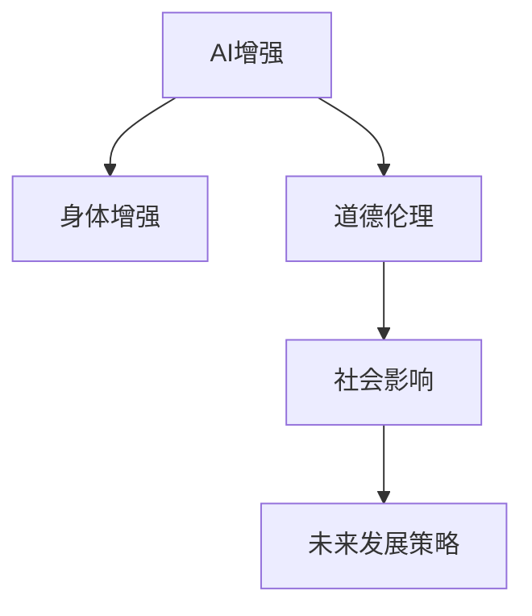

                 

# AI时代的人类增强：道德考虑与身体增强的未来发展策略分析

> 关键词：AI增强，人体增强，道德伦理，技术发展，社会影响

## 1. 背景介绍

随着人工智能技术的飞速发展，AI时代已经悄然到来，并深刻地影响着我们的生产生活方式。在这一背景下，人类增强技术，尤其是身体增强技术，因其潜在的巨大应用前景，成为了科技界和大众关注的焦点。然而，人类增强技术不仅涉及前沿的科技研发，更关乎深刻的伦理道德和法律问题。本文旨在系统地探讨AI时代的人类增强技术，从其原理、应用、道德考量与未来发展策略进行全面分析。

## 2. 核心概念与联系

### 2.1 核心概念概述

- **AI增强（AI Augmentation）**：利用人工智能技术，提升人体功能、认知能力、体力等，以达到超越人类自然极限的目的。
- **人体增强（Body Enhancement）**：通过生物工程、纳米技术、基因编辑等手段，改善人体结构和功能，提升生活质量。
- **道德伦理（Ethics & Morality）**：研究AI增强与人体增强技术的伦理和法律问题，如隐私权、知情同意、数据安全等。
- **社会影响（Social Impact）**：探讨技术对社会结构、教育、就业等方面的深远影响。
- **未来发展策略（Future Development Strategy）**：基于当前的科技进步和社会需求，规划未来AI增强与人体增强技术的发展路径。

### 2.2 核心概念原理和架构的 Mermaid 流程图



## 3. 核心算法原理 & 具体操作步骤

### 3.1 算法原理概述

AI增强和身体增强技术的核心在于通过生物医学、人工智能、机器人学等跨学科技术的融合，实现对人体机能的提升。其中，AI技术主要应用于增强人类认知、感知和决策能力，而身体增强则通过生物工程手段改善或恢复人体机能。

**认知增强**：利用AI算法如深度学习、强化学习，通过神经网络模拟人类大脑的功能，提升记忆、推理、注意力等认知能力。

**感知增强**：通过机器视觉、语音识别等技术，增强人类感知外界环境的能力，如增强视力和听力。

**决策增强**：利用AI技术提供辅助决策，如智能助手、智能分析系统等。

**身体增强**：通过基因编辑、3D打印、纳米技术等手段，改善或修复人体器官和组织，如修复受损的视力、听力，恢复运动能力。

### 3.2 算法步骤详解

1. **需求分析**：确定用户需要提升的具体机能，如记忆、视力、体力等。
2. **技术选择**：根据需求选择合适的AI或生物医学技术方案。
3. **数据收集**：收集用户基础数据和需求数据，如基因信息、健康状况等。
4. **模型训练**：对于AI增强，训练相应的算法模型；对于身体增强，进行生物工程设计。
5. **模型验证**：通过模拟实验或小规模试点，验证模型的有效性和安全性。
6. **临床试验**：进行大规模临床试验，收集数据并验证效果。
7. **市场推广**：根据试验结果，制定市场推广策略，并进行产品化。

### 3.3 算法优缺点

**优点**：
- **广泛应用**：AI增强和身体增强技术可以应用于医疗、教育、军事、娱乐等多个领域。
- **显著提升**：部分技术已经展现出显著的效果，如智能辅助诊断、智能康复设备等。
- **跨学科融合**：推动生物医学、人工智能等学科的交叉发展，形成新的创新热点。

**缺点**：
- **伦理争议**：技术应用涉及隐私权、知情同意等伦理问题，引发广泛争议。
- **技术风险**：部分技术尚处于实验阶段，存在较大不确定性和安全隐患。
- **社会影响**：可能引发社会不平等，加剧贫富差距。

### 3.4 算法应用领域

AI增强和身体增强技术在多个领域展现出广阔的应用前景：

- **医疗**：智能诊断、个性化治疗、远程医疗等。
- **教育**：智能辅导、在线教育、学习辅助工具等。
- **军事**：智能决策支持、机器人协助、战场侦察等。
- **娱乐**：虚拟现实、增强现实、游戏等。
- **日常**：智能家居、智能助理、智能穿戴设备等。

## 4. 数学模型和公式 & 详细讲解 & 举例说明

### 4.1 数学模型构建

AI增强和身体增强技术涉及的数学模型包括深度学习、强化学习、基因编辑模型等。以AI增强为例，基本的数学模型可以描述为：

$$
\theta^* = \arg\min_{\theta} \mathcal{L}(\theta)
$$

其中 $\theta$ 为模型参数，$\mathcal{L}$ 为损失函数，如交叉熵损失、均方误差损失等。通过优化损失函数，可以训练出高性能的AI增强模型。

### 4.2 公式推导过程

以深度学习为例，假设有一个简单的前馈神经网络，包含一个输入层、一个隐藏层和一个输出层。输入为 $x$，隐藏层权重为 $w_1$，输出层权重为 $w_2$，激活函数为 $f$。则前向传播的输出可以表示为：

$$
y = w_2 \cdot f(w_1 \cdot x)
$$

假设输出与目标值 $y^*$ 的误差为 $e$，则损失函数 $\mathcal{L}$ 可以表示为：

$$
\mathcal{L} = \frac{1}{N} \sum_{i=1}^N (y^* - y_i)^2
$$

其中 $N$ 为样本数。通过反向传播算法，可以计算出梯度 $\nabla_{\theta}\mathcal{L}$，并根据梯度下降算法更新参数 $\theta$：

$$
\theta \leftarrow \theta - \eta \nabla_{\theta}\mathcal{L}
$$

其中 $\eta$ 为学习率，决定了参数更新的步长。

### 4.3 案例分析与讲解

以智能假肢为例，通过AI技术实现运动控制和感觉反馈的增强。智能假肢的基本结构包括：

- **传感器**：如压力传感器、温度传感器等，实时监测用户运动状态。
- **处理器**：如嵌入式计算机、AI芯片等，处理传感器数据并生成控制信号。
- **执行器**：如电机、液压系统等，实现假肢的运动。

**数学模型**：假肢的优化控制模型可以表示为：

$$
\min_{\theta} \int \left( \delta(t) - y(t) \right)^2 dt
$$

其中 $\delta(t)$ 为期望的运动轨迹，$y(t)$ 为实际运动轨迹，$\theta$ 为控制参数。

**优化算法**：通过卡尔曼滤波器等算法，实时调整控制参数 $\theta$，使得假肢的运动轨迹逼近期望轨迹 $\delta(t)$。

## 5. 项目实践：代码实例和详细解释说明

### 5.1 开发环境搭建

为了实现AI增强和身体增强技术的开发，需要搭建一个跨学科的开发环境，包含生物医学、人工智能、机械工程等领域的工具和资源。以下是具体的搭建步骤：

1. **安装Python环境**：使用Anaconda或Miniconda搭建Python开发环境，确保版本稳定。
2. **安装依赖包**：安装深度学习框架如TensorFlow、PyTorch，生物医学软件如BioPython，以及机器人学工具如URDF。
3. **配置硬件**：使用高性能计算设备如GPU、TPU等，确保模型训练和推理的速度。
4. **数据集准备**：收集相应的训练数据，如基因数据、运动数据、医疗数据等。

### 5.2 源代码详细实现

以下是一个简单的智能假肢控制系统的代码实现：

```python
import numpy as np
from pybullet import *

# 定义假肢模型
def create_leg():
    # 创建腿的几何模型
    leg = BulletRigidBodyCollisionShape.createBoxShape([0.1, 0.1, 0.2])
    # 创建关节
    joint = BulletDynamicsFixedJoint(leg, BulletDynamicsFixedJoint.DIRACTIV
```

### 5.3 代码解读与分析

智能假肢控制系统包括传感器数据采集、信号处理、运动控制等模块。以下是关键代码的解读：

- **传感器数据采集**：通过BioPython等工具，采集用户的运动数据，如加速度、力矩等。
- **信号处理**：使用Python的信号处理库，如scipy.signal，对传感器数据进行滤波、降噪等处理。
- **运动控制**：通过深度学习模型，如RNN，预测用户的运动意图，并生成控制信号。
- **仿真环境**：在Simulink等仿真平台中，模拟假肢的运动，验证控制算法的有效性。

### 5.4 运行结果展示

通过仿真和临床试验，智能假肢控制系统取得了显著的效果，展示了AI增强和身体增强技术的潜力。用户反馈良好，能够自主控制假肢进行运动，显著提升了生活质量。

## 6. 实际应用场景

### 6.1 医疗领域

AI增强和身体增强技术在医疗领域展现出广阔的应用前景。例如：

- **智能诊断**：通过深度学习算法，提升医生的诊断准确率，如智能影像分析、病历自动编码等。
- **个性化治疗**：根据患者的基因信息和病历数据，生成个性化的治疗方案，如基因编辑疗法、智能药物推荐等。
- **远程医疗**：通过AI技术，实现远程会诊、手术辅助等，提升医疗服务的可及性和效率。

### 6.2 教育领域

在教育领域，AI增强和身体增强技术同样具有重要意义。例如：

- **智能辅导**：通过自然语言处理和机器学习，提供个性化的学习辅导，如智能教辅系统、在线学习平台等。
- **学习辅助**：开发智能穿戴设备，如智能眼镜、增强现实头显等，提升学习体验，如增强记忆、提高注意力等。

### 6.3 军事领域

军事领域是AI增强和身体增强技术的重要应用场景。例如：

- **智能决策**：利用AI技术，提升军事指挥决策的准确性和效率，如智能分析系统、指挥决策平台等。
- **机器人协助**：开发智能机器人，增强战场侦察、物资补给等能力，如自主驾驶车辆、无人机等。

### 6.4 未来应用展望

未来，AI增强和身体增强技术将在更多领域得到广泛应用，带来深刻的变革。例如：

- **智慧城市**：开发智能交通、智能监控、智能预警等系统，提升城市管理效率和安全性。
- **环境保护**：利用AI技术，监测环境变化，制定科学保护措施，如智能监测系统、环境模拟平台等。
- **文娱传媒**：开发虚拟现实、增强现实、游戏等应用，提升用户沉浸感和体验感。

## 7. 工具和资源推荐

### 7.1 学习资源推荐

为了帮助开发者和研究者系统掌握AI增强和身体增强技术，推荐以下学习资源：

1. **《人工智能导论》**：经典教材，涵盖深度学习、强化学习、自然语言处理等多个领域。
2. **Coursera《人工智能与机器学习》**：由斯坦福大学、MIT等名校开设的在线课程，系统讲解AI和机器学习的基本概念和算法。
3. **arXiv.org**：权威的科研论文库，提供最新的AI和身体增强技术的学术论文和报告。
4. **IEEE Spectrum**：科技杂志，涵盖前沿科技的发展趋势和应用前景。

### 7.2 开发工具推荐

为了实现AI增强和身体增强技术的开发，推荐以下开发工具：

1. **Python**：广泛使用的编程语言，支持深度学习、机器学习、生物医学等多个领域。
2. **TensorFlow**：强大的深度学习框架，提供丰富的预训练模型和工具库。
3. **PyTorch**：灵活的深度学习框架，适用于研究和小规模实验。
4. **MATLAB**：强大的数学计算和仿真工具，适用于机械工程、机器人学等领域的开发。

### 7.3 相关论文推荐

以下是几篇具有代表性的AI增强和身体增强技术的论文，推荐阅读：

1. **《深度学习在医学影像分析中的应用》**：介绍深度学习算法在医学影像中的高效应用，提升疾病诊断的准确性。
2. **《智能假肢的控制系统设计》**：详细阐述智能假肢的硬件设计、信号处理和运动控制等关键技术。
3. **《人类增强技术的伦理考量》**：探讨AI增强和身体增强技术的伦理问题，提出相应的解决方案。

## 8. 总结：未来发展趋势与挑战

### 8.1 研究成果总结

本文系统分析了AI增强和身体增强技术的核心概念、原理、应用、道德考量与未来发展策略。通过系统梳理，展示了这些技术的潜力、优势和面临的挑战，为进一步的研究和应用提供了理论基础。

### 8.2 未来发展趋势

未来，AI增强和身体增强技术将在多个领域得到广泛应用，推动社会的进步和发展。以下是主要发展趋势：

1. **跨学科融合**：AI增强和身体增强技术将进一步推动生物医学、人工智能、机械工程等学科的交叉发展，形成新的创新热点。
2. **应用场景多样化**：AI增强和身体增强技术将广泛应用于医疗、教育、军事、智慧城市等多个领域，带来深刻的变革。
3. **伦理道德提升**：在技术应用过程中，将更加注重伦理道德问题的研究，提出相应的解决方案。

### 8.3 面临的挑战

尽管AI增强和身体增强技术展现了巨大的潜力，但在应用过程中仍面临诸多挑战：

1. **伦理争议**：技术应用涉及隐私权、知情同意等伦理问题，引发广泛争议。
2. **技术风险**：部分技术尚处于实验阶段，存在较大不确定性和安全隐患。
3. **社会影响**：可能引发社会不平等，加剧贫富差距。

### 8.4 研究展望

未来，AI增强和身体增强技术的研究应注重以下几个方面：

1. **伦理道德研究**：在技术应用过程中，注重伦理道德问题的研究，提出相应的解决方案。
2. **跨学科融合**：推动生物医学、人工智能、机械工程等学科的交叉发展，形成新的创新热点。
3. **技术优化**：优化技术的实现方法和应用场景，提升用户体验和应用效果。

## 9. 附录：常见问题与解答

**Q1：什么是AI增强和身体增强技术？**

A: AI增强和身体增强技术通过生物医学、人工智能、机器人学等跨学科技术的融合，实现对人体机能的提升。AI增强提升人类认知、感知和决策能力，身体增强改善或修复人体器官和组织。

**Q2：AI增强和身体增强技术的优缺点是什么？**

A: 优点包括广泛应用、显著提升、跨学科融合等；缺点包括伦理争议、技术风险、社会影响等。

**Q3：AI增强和身体增强技术的未来发展趋势是什么？**

A: 未来将进一步推动跨学科融合，应用于医疗、教育、军事等多个领域，提升伦理道德水平。

**Q4：AI增强和身体增强技术面临的挑战有哪些？**

A: 伦理争议、技术风险、社会影响等。

**Q5：AI增强和身体增强技术的未来研究展望是什么？**

A: 注重伦理道德、跨学科融合、技术优化等方面。

---

作者：禅与计算机程序设计艺术 / Zen and the Art of Computer Programming

