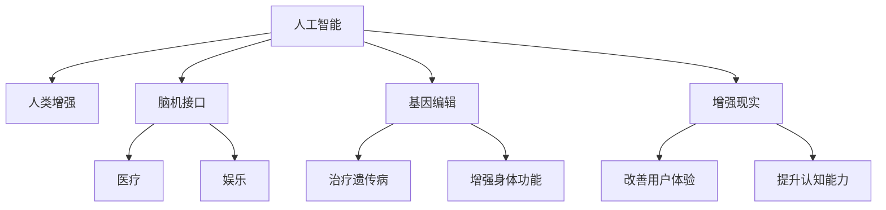

                 

# AI时代的人类增强：道德考虑与身体增强的未来展望

在人工智能（AI）蓬勃发展的今天，人类增强（Human Augmentation）成为了一个热门话题。通过AI技术，我们不仅可以在认知能力、情感处理等方面获得提升，更可以探索身体增强的边界，包括基因编辑、脑机接口等前沿技术。然而，这些技术的突破同时也带来了道德、伦理、隐私等方面的考量。本文将深入探讨AI时代人类增强的未来展望，并从多个维度探讨其所面临的道德挑战与应对策略。

## 1. 背景介绍

### 1.1 人工智能与人类的协同进化

自工业革命以来，人类一直致力于借助技术提升自身能力。在数字时代，人工智能技术的迅猛发展，为我们提供了前所未有的机遇。AI技术通过模拟人类的认知模式，使得机器可以在多个领域超越人类，从医疗诊断、智能制造到自然语言处理等，AI技术都展现出了强大的潜能。

### 1.2 人类增强的兴起

人类增强（Human Augmentation）是人类通过技术手段提升自身物理、认知和情感能力的过程。AI技术的介入，使得人类增强进入了一个新的维度。基因编辑技术、脑机接口、增强现实（AR）等新兴技术的应用，让人类增强的潜力变得前所未有。

## 2. 核心概念与联系

### 2.1 核心概念概述

为更好地理解AI时代人类增强的道德考量，本节将介绍几个密切相关的核心概念：

- **人工智能（AI）**：利用计算机技术模拟人类智能过程的技术，包括机器学习、深度学习等。
- **人类增强（Human Augmentation）**：通过技术手段提升人类自身能力的过程，包括认知、情感、身体等多个方面。
- **脑机接口（Brain-Computer Interface, BCI）**：将人脑信号转化为计算机指令的接口技术，可用于控制设备、治疗疾病等。
- **基因编辑（Genetic Editing）**：通过CRISPR-Cas9等技术，修改人类基因，解决遗传疾病、增强身体功能等。
- **增强现实（AR）**：通过数字技术，将虚拟信息叠加到现实世界，提升人类感知能力。

这些核心概念之间的逻辑关系可以通过以下Mermaid流程图来展示：



这个流程图展示了AI技术与人类的协同进化，以及通过AI技术提升人类增强的多维路径。

## 3. 核心算法原理 & 具体操作步骤

### 3.1 算法原理概述

人类增强的算法原理主要包括以下几个方面：

- **认知增强**：利用AI技术模拟人类认知过程，如自然语言处理（NLP）、计算机视觉（CV）等。通过深度学习模型，使得机器能够理解和处理复杂信息，提升人类认知能力。
- **情感增强**：通过AI技术分析情感特征，如情感识别、情感生成等。结合自然语言处理，提升人类的情感理解与表达能力。
- **身体增强**：通过AI技术辅助基因编辑、脑机接口等技术，改善身体机能。如通过基因编辑解决遗传疾病，通过脑机接口实现身体功能的增强。

### 3.2 算法步骤详解

以脑机接口技术为例，其算法步骤主要包括：

1. **信号采集**：使用传感器获取大脑信号，如EEG、fMRI等。
2. **信号处理**：使用信号处理算法，如小波变换、傅里叶变换等，提取有用信号。
3. **特征提取**：通过机器学习模型，如支持向量机、神经网络等，提取关键特征。
4. **模型训练**：使用训练数据，训练预测模型，如线性回归、决策树等。
5. **命令生成**：根据模型预测结果，生成相应指令，如控制机械臂、电子设备等。

### 3.3 算法优缺点

人类增强的算法优缺点如下：

**优点**：
- 提升人类能力：通过AI技术，人类可以在认知、情感、身体等方面获得显著提升。
- 治疗疾病：利用基因编辑技术，可以治疗一些遗传性疾病。
- 提升生活质量：增强现实技术可以改善用户体验，提升生活质量。

**缺点**：
- 伦理争议：涉及基因编辑、脑机接口等技术，存在严重的伦理争议。
- 隐私保护：人类增强涉及个人数据，如何保护隐私是个重大挑战。
- 技术风险：技术本身存在不稳定性，可能带来新的健康风险。

### 3.4 算法应用领域

人类增强的算法广泛应用于多个领域，包括医疗、娱乐、教育等。例如：

- **医疗领域**：利用AI技术辅助诊断、治疗，通过基因编辑治疗遗传疾病。
- **娱乐领域**：增强现实技术，提升游戏体验，虚拟现实（VR）技术，创造沉浸式体验。
- **教育领域**：利用AI技术辅助教学，提升学习效率，开发智能教育工具。

## 4. 数学模型和公式 & 详细讲解 & 举例说明

### 4.1 数学模型构建

以脑机接口技术为例，其数学模型构建如下：

- **信号采集模型**：使用传感器获取大脑信号，模型的输入为时间序列数据。
- **信号处理模型**：使用小波变换、傅里叶变换等方法，将信号从时域转换到频域。
- **特征提取模型**：使用神经网络模型，如卷积神经网络（CNN）、循环神经网络（RNN）等，提取关键特征。
- **模型训练模型**：使用监督学习算法，如线性回归、支持向量机（SVM）等，训练预测模型。
- **命令生成模型**：使用决策树、随机森林等算法，根据模型预测结果，生成相应指令。

### 4.2 公式推导过程

以下以信号处理模型为例，推导小波变换的公式：

$$
\text{Wavelet Transform}(X, a, b) = \int_{-\infty}^{\infty} X(t) \psi_{a,b}(t) \, dt
$$

其中，$X(t)$ 为信号，$a$ 为尺度因子，$b$ 为平移因子，$\psi_{a,b}(t)$ 为小波基函数。

### 4.3 案例分析与讲解

以基因编辑技术为例，展示其数学模型和推导过程。基因编辑技术主要通过CRISPR-Cas9等技术实现。CRISPR-Cas9系统的核心在于gRNA（引导RNA）的设计和引导。gRNA的设计需要满足以下条件：

1. **靶序列识别**：gRNA需要与目标DNA序列精确配对。
2. **剪接效率**：gRNA需要在目标DNA上实现高效的剪接。
3. **精确性**：gRNA需要保证目标序列的精确性，避免误操作。

## 5. 项目实践：代码实例和详细解释说明

### 5.1 开发环境搭建

在进行人类增强的算法开发前，我们需要准备好开发环境。以下是使用Python进行深度学习开发的环境配置流程：

1. 安装Anaconda：从官网下载并安装Anaconda，用于创建独立的Python环境。

2. 创建并激活虚拟环境：
```bash
conda create -n pytorch-env python=3.8 
conda activate pytorch-env
```

3. 安装PyTorch：根据CUDA版本，从官网获取对应的安装命令。例如：
```bash
conda install pytorch torchvision torchaudio cudatoolkit=11.1 -c pytorch -c conda-forge
```

4. 安装各类工具包：
```bash
pip install numpy pandas scikit-learn matplotlib tqdm jupyter notebook ipython
```

完成上述步骤后，即可在`pytorch-env`环境中开始算法实践。

### 5.2 源代码详细实现

这里我们以脑机接口技术为例，给出使用PyTorch实现的Python代码：

```python
import torch
import torch.nn as nn
import torch.optim as optim

class BrainMachineInterface(nn.Module):
    def __init__(self, input_size, output_size):
        super(BrainMachineInterface, self).__init__()
        self.fc1 = nn.Linear(input_size, 128)
        self.fc2 = nn.Linear(128, 64)
        self.fc3 = nn.Linear(64, output_size)

    def forward(self, x):
        x = torch.relu(self.fc1(x))
        x = torch.relu(self.fc2(x))
        x = self.fc3(x)
        return x

# 准备数据
x_train = ...
y_train = ...

# 初始化模型和优化器
model = BrainMachineInterface(input_size, output_size)
optimizer = optim.Adam(model.parameters(), lr=0.001)

# 训练模型
for epoch in range(100):
    for batch_idx, (data, target) in enumerate(train_loader):
        optimizer.zero_grad()
        output = model(data)
        loss = nn.CrossEntropyLoss()(output, target)
        loss.backward()
        optimizer.step()
        print('Epoch [%d/%d], Step [%d/%d], Loss: %.4f'
              % (epoch + 1, total_step, batch_idx, len(train_loader), loss.item()))

# 测试模型
model.eval()
with torch.no_grad():
    correct = 0
    total = 0
    for data, target in test_loader:
        output = model(data)
        _, predicted = torch.max(output.data, 1)
        total += target.size(0)
        correct += (predicted == target).sum().item()
    print('Accuracy of the network on the test images: %d %%' % (
        100 * correct / total))
```

### 5.3 代码解读与分析

让我们再详细解读一下关键代码的实现细节：

**BrainMachineInterface类**：
- `__init__`方法：定义网络结构，包括全连接层。
- `forward`方法：实现前向传播，将输入信号经过多个全连接层，最终输出指令。

**数据准备**：
- 准备训练数据和标签，可以是EEG信号或其他脑电图数据。

**模型训练**：
- 使用PyTorch的模块定义模型，使用Adam优化器进行参数更新。
- 在训练过程中，循环迭代，前向传播计算损失函数，反向传播更新参数。

**模型测试**：
- 将模型设置为评估模式，不更新参数。
- 使用测试集数据进行预测，计算模型准确率。

## 6. 实际应用场景

### 6.1 医疗领域

在医疗领域，人类增强技术有着广泛的应用前景。例如，利用基因编辑技术治疗遗传疾病，如囊性纤维化、镰状细胞贫血等。脑机接口技术可以辅助手术，提升手术精准度。增强现实技术在医学影像中应用，帮助医生更好地理解病理变化。

### 6.2 娱乐领域

在娱乐领域，人类增强技术可以提升游戏体验，增强现实技术可以创造沉浸式体验，虚拟现实技术可以提供身临其境的娱乐体验。例如，通过增强现实技术，玩家可以在虚拟环境中进行模拟训练，提升技能。

### 6.3 教育领域

在教育领域，人类增强技术可以辅助教学，提高学习效率。例如，利用AI技术开发智能教育工具，个性化推荐学习内容，智能辅导学生，提升学习效果。

## 7. 工具和资源推荐

### 7.1 学习资源推荐

为了帮助开发者系统掌握人类增强的算法与技术，这里推荐一些优质的学习资源：

1. **《深度学习》书籍**：由Ian Goodfellow等人撰写，全面介绍了深度学习的基本概念和算法，是学习AI领域的必读书籍。
2. **《人类增强：科学与伦理》书籍**：由Gary Kleinfeld等人撰写，探讨了人类增强的科学原理与伦理考量。
3. **Coursera《深度学习》课程**：斯坦福大学开设的深度学习课程，由Andrew Ng主讲，适合入门学习。
4. **Kaggle数据集**：提供了丰富的数据集，包括EEG信号、脑电图数据等，方便开发者进行实践。

通过对这些资源的学习实践，相信你一定能够快速掌握人类增强的算法与技术，并用于解决实际的AI问题。

### 7.2 开发工具推荐

高效的开发离不开优秀的工具支持。以下是几款用于人类增强算法开发的常用工具：

1. **PyTorch**：基于Python的开源深度学习框架，灵活动态的计算图，适合快速迭代研究。
2. **TensorFlow**：由Google主导开发的开源深度学习框架，生产部署方便，适合大规模工程应用。
3. **TensorBoard**：TensorFlow配套的可视化工具，可实时监测模型训练状态，并提供丰富的图表呈现方式。
4. **Jupyter Notebook**：交互式编程环境，支持多种编程语言，方便开发者进行实验和分享。
5. **Weights & Biases**：模型训练的实验跟踪工具，可以记录和可视化模型训练过程中的各项指标。

合理利用这些工具，可以显著提升人类增强算法的开发效率，加快创新迭代的步伐。

### 7.3 相关论文推荐

人类增强技术的发展源于学界的持续研究。以下是几篇奠基性的相关论文，推荐阅读：

1. **“Deep Brain Stimulation in Neurosurgery”**：探讨了深度脑刺激技术在神经外科手术中的应用。
2. **“CRISPR-Cas9: CLUSTAL Guide to Progress and Prospects”**：详细介绍了CRISPR-Cas9基因编辑技术的工作原理和应用前景。
3. **“Human Augmentation and Bioethics”**：讨论了人类增强技术在伦理和法律层面的挑战与应对策略。

这些论文代表了大语言模型微调技术的发展脉络。通过学习这些前沿成果，可以帮助研究者把握学科前进方向，激发更多的创新灵感。

## 8. 总结：未来发展趋势与挑战

### 8.1 总结

本文对AI时代人类增强的未来展望进行了全面系统的介绍。首先阐述了人工智能与人类的协同进化，探讨了人类增强的兴起。其次，从核心概念、算法原理、操作步骤等层面，详细讲解了人类增强的实现过程。最后，通过多个实际应用场景，展示了人类增强技术的广泛应用前景。

通过本文的系统梳理，可以看到，人类增强技术在多个领域有着广阔的应用空间。然而，伴随技术的发展，也面临诸多道德、伦理和隐私等方面的挑战。如何平衡技术进步与社会伦理，将是未来AI技术发展的重要课题。

### 8.2 未来发展趋势

展望未来，人类增强技术将呈现以下几个发展趋势：

1. **技术融合**：人类增强技术将与其他前沿技术深度融合，如量子计算、生物工程技术等，推动技术的快速发展。
2. **跨学科发展**：人类增强技术将跨学科发展，结合心理学、医学、社会学等多个领域，形成更加全面和深入的应用体系。
3. **伦理规范**：随着技术的普及，将逐渐形成一套完善的伦理规范，引导技术健康发展。
4. **普惠共享**：人类增强技术将变得更加普惠，使得更多人受益，实现技术公平。
5. **标准化应用**：人类增强技术将逐步标准化，形成行业标准，推动技术的规范化应用。

这些趋势凸显了人类增强技术的广阔前景，未来的发展将更加全面和深入。

### 8.3 面临的挑战

尽管人类增强技术的发展前景广阔，但在迈向更加智能化、普适化应用的过程中，仍面临诸多挑战：

1. **伦理道德风险**：技术应用过程中，可能带来新的伦理问题，如隐私泄露、公平性等。
2. **技术安全性**：技术本身存在不稳定性，可能带来新的健康风险。
3. **技术普及性**：技术普及过程中，可能面临资源不均衡、社会接受度不足等问题。
4. **法律规制**：技术发展过程中，如何制定相应的法律规制，保障技术健康发展。
5. **技术可控性**：技术应用过程中，如何保障技术可控，避免误用。

这些挑战需要我们共同面对，通过技术进步和制度建设，确保技术的健康发展。

### 8.4 研究展望

未来的研究需要在以下几个方面寻求新的突破：

1. **多学科交叉**：加强与心理学、医学等领域的交叉研究，形成更加全面和深入的技术体系。
2. **伦理与法律**：制定完善的伦理和法律规范，引导技术健康发展。
3. **技术普惠**：推动技术的普惠应用，缩小技术鸿沟，实现技术公平。
4. **技术监管**：建立技术监管机制，保障技术的可控性和安全性。
5. **技术融合**：推动技术与多学科的深度融合，形成更加综合和创新的应用体系。

这些研究方向的探索，将引领人类增强技术迈向更高的台阶，为人类社会的进步带来新的动力。

## 9. 附录：常见问题与解答

**Q1：人类增强技术是否会带来新的伦理问题？**

A: 是的，人类增强技术带来了新的伦理问题。例如，基因编辑可能引发基因歧视，脑机接口可能侵犯隐私。如何平衡技术进步与社会伦理，将是未来AI技术发展的重要课题。

**Q2：如何保障人类增强技术的安全性？**

A: 保障人类增强技术的安全性，需要多方面的努力：
1. **严格监管**：建立严格的监管机制，规范技术应用。
2. **技术审核**：引入第三方技术审核，评估技术的风险。
3. **伦理审查**：在技术应用前，进行伦理审查，评估技术的伦理影响。
4. **用户教育**：加强用户教育，提高公众对技术的理解和接受度。

这些措施可以共同保障人类增强技术的安全性。

**Q3：人类增强技术在实际应用中需要注意哪些问题？**

A: 人类增强技术在实际应用中需要注意以下问题：
1. **数据隐私**：收集和使用个人数据时，需要严格保护隐私。
2. **伦理审查**：在技术应用前，需要进行伦理审查，确保技术应用的合理性。
3. **公平性**：确保技术应用过程中，不产生歧视和不公平现象。
4. **安全性**：确保技术应用的安全性，避免带来新的健康风险。

这些问题是技术应用过程中需要考虑的重要因素。

---

作者：禅与计算机程序设计艺术 / Zen and the Art of Computer Programming

