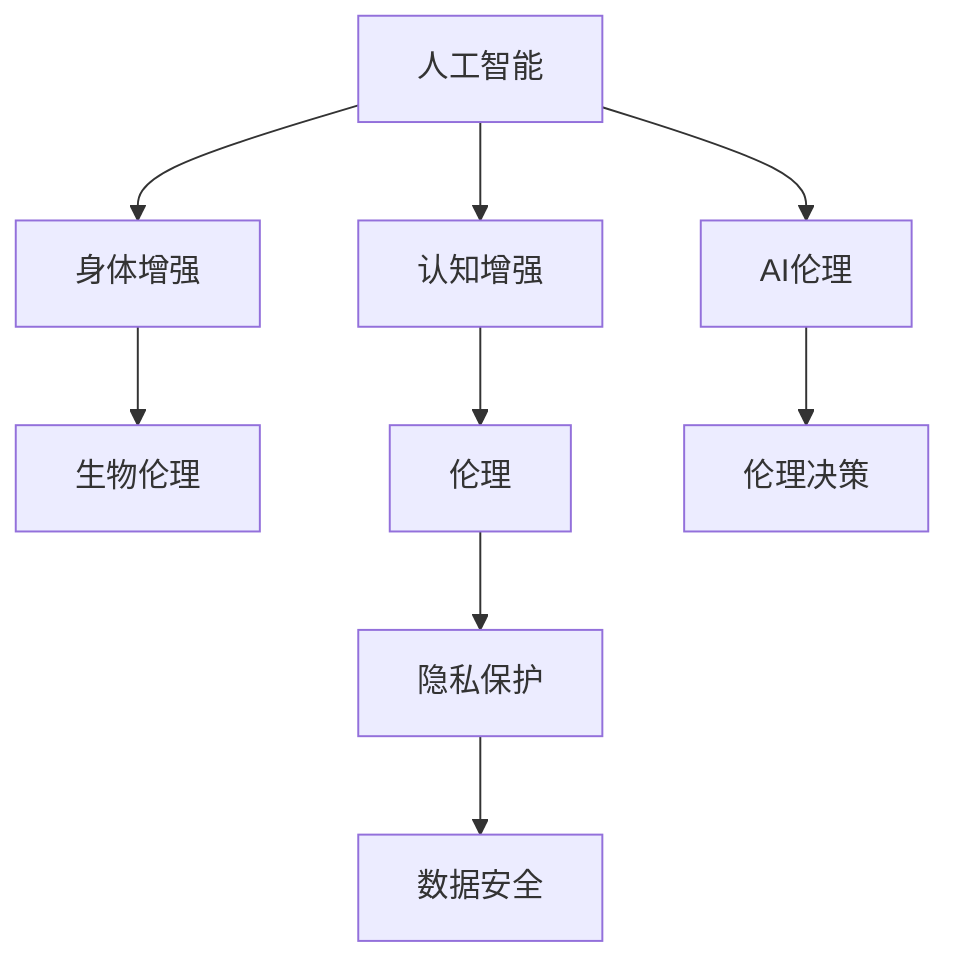

                 

# AI时代的人类增强：道德考虑与身体增强的未来方向

> 关键词：人工智能,人类增强,身体增强,伦理,隐私保护,数据安全,生物伦理

## 1. 背景介绍

随着人工智能(AI)技术的飞速发展，人类增强（Human Enhancement）逐渐成为前沿科技关注的焦点。尤其是生物医学技术的进步，如基因编辑、脑机接口、增强药物等，使得人类在生理和认知能力上得以大幅度提升。与此同时，AI技术的辅助使得这些增强手段变得更加智能和高效，同时也带来了新的伦理和隐私问题。本文将从伦理角度出发，探讨AI在人类增强领域的应用，及其潜在的未来方向。

## 2. 核心概念与联系

### 2.1 核心概念概述

为了更好地理解AI与人类增强的结合及其伦理影响，首先介绍几个核心概念：

- **人工智能(AI)**：一类能够模拟、扩展或增强人类智能的技术。包括机器学习、深度学习、自然语言处理、计算机视觉等。
- **人类增强(Human Enhancement)**：通过科技手段提高人类的生理和认知能力。涉及生物医学、神经科学、AI等多个领域。
- **身体增强(Physical Enhancement)**：使用生物医学或AI技术，增强人类的体力、耐力、感知等物理能力。
- **认知增强(Cognitive Enhancement)**：通过AI和生物技术提升人类的记忆力、注意力、逻辑推理等认知能力。
- **伦理(Ethics)**：关于行为道德规范的哲学体系，涉及人类增强的规范性和价值判断。
- **隐私保护(Privacy Protection)**：保护个人数据和信息不被未经授权的访问和使用。
- **数据安全(Data Security)**：确保数据在传输和存储过程中的完整性和保密性。
- **生物伦理(Bioethics)**：涉及生命伦理、人体实验、遗传工程等方面的伦理问题。

### 2.2 核心概念原理和架构的 Mermaid 流程图



### 2.3 核心概念的联系

通过上图的流程图，我们可以看到不同概念间的紧密联系：

- **人工智能与身体增强**：AI技术能够辅助研发更有效的增强手段，如通过模拟和优化实验过程，减少实验时间和成本。
- **人工智能与认知增强**：AI能够通过大数据分析和机器学习，帮助人们更高效地学习和记忆，提升认知能力。
- **身体增强与认知增强**：体力和认知的增强可以相互促进，如通过体育锻炼提高记忆力，通过智力训练增强体力。
- **AI伦理与生物伦理**：AI技术在增强领域的应用，涉及许多生物伦理问题，如基因编辑引发的身份认同问题，需要伦理框架进行指导。
- **隐私保护与数据安全**：在增强过程中，数据隐私和安全性尤为关键，如基因数据的泄露可能带来严重的后果。
- **伦理决策与AI伦理**：AI伦理学的研究，为增强技术的应用提供了道德指引，帮助制定合理的政策法规。

## 3. 核心算法原理 & 具体操作步骤

### 3.1 算法原理概述

人类增强领域中，AI的应用主要集中在数据建模和分析上。AI技术通过大量数据的训练，构建模型以预测和优化增强效果。核心算法包括：

- **回归分析(Regression Analysis)**：用于预测身体增强效果与某些因素之间的关系，如基因编辑后的寿命预测。
- **分类算法(Classification Algorithm)**：用于识别增强药物对认知能力提升的个体差异。
- **聚类算法(Clustering Algorithm)**：用于发现相似个体的增强需求，进行个性化推荐。
- **强化学习(Reinforcement Learning)**：用于优化增强手段的选择和组合，如通过模拟实验找到最优的增强方案。

### 3.2 算法步骤详解

以基因编辑技术为例，AI在人类增强中的应用步骤如下：

1. **数据收集**：从基因库和医学研究中收集大量的基因数据和实验结果。
2. **模型构建**：选择合适的机器学习模型，如回归、分类、聚类等，进行数据建模。
3. **特征提取**：从基因数据中提取特征，如基因序列、基因变异等。
4. **训练优化**：使用历史数据对模型进行训练，优化模型参数。
5. **预测验证**：对新基因数据进行预测，验证模型的准确性。
6. **实验应用**：根据预测结果，进行人体实验，评估增强效果。

### 3.3 算法优缺点

**优点**：

- **效率提升**：AI能够快速处理大量数据，显著缩短研究和实验周期。
- **效果预测**：通过机器学习模型，可以对增强效果进行预测和优化。
- **个性化推荐**：基于聚类算法，AI能够进行个性化的增强建议，提升用户体验。

**缺点**：

- **数据依赖**：AI模型的效果高度依赖于数据质量，数据不全或偏差可能影响结果。
- **隐私风险**：基因数据等敏感信息可能被滥用，带来隐私泄露风险。
- **伦理争议**：AI辅助的增强手段可能引发伦理争议，如基因编辑的道德边界。
- **技术局限**：AI模型无法完全模拟人类复杂的生理和心理过程。

### 3.4 算法应用领域

AI在人类增强领域的应用领域包括但不限于：

- **基因编辑**：使用AI预测基因编辑的效果和风险，指导临床实验。
- **药物研发**：AI加速药物筛选和优化，提升新药上市速度。
- **脑机接口(BCI)**：AI分析和解码大脑信号，实现对增强装置的控制。
- **增强体能训练**：AI辅助设计个性化的体能训练方案，提高运动员表现。
- **心理认知干预**：AI进行心理数据分析，指导认知增强训练。

## 4. 数学模型和公式 & 详细讲解 & 举例说明

### 4.1 数学模型构建

以基因编辑为例，构建回归模型预测其对寿命的影响：

- **输入**：基因序列、年龄、性别等特征。
- **输出**：基因编辑后预期寿命。

数学公式为：
$$
\hat{y} = f(x; \theta)
$$

其中 $x$ 为输入特征，$\theta$ 为模型参数，$\hat{y}$ 为预测输出。

### 4.2 公式推导过程

以线性回归为例，推导其公式：
$$
\hat{y} = \beta_0 + \beta_1 x_1 + \beta_2 x_2 + \cdots + \beta_n x_n + \epsilon
$$

其中 $\beta_i$ 为回归系数，$x_i$ 为输入特征，$\epsilon$ 为误差项。

### 4.3 案例分析与讲解

假设数据集包含100个基因编辑病例，每个病例包含基因序列和寿命数据。构建线性回归模型，预测基因编辑对寿命的影响：

1. **数据准备**：将基因序列编码成数值特征，提取年龄、性别等基本信息。
2. **模型训练**：使用最小二乘法求解线性回归系数 $\beta_i$。
3. **结果验证**：在新病例上测试模型预测效果，对比实际寿命与预测寿命。

## 5. 项目实践：代码实例和详细解释说明

### 5.1 开发环境搭建

1. **安装Python**：从官网下载安装Python 3.x版本。
2. **安装相关库**：
   ```
   pip install numpy pandas scikit-learn
   ```
3. **设置虚拟环境**：
   ```
   python -m venv venv
   source venv/bin/activate
   ```

### 5.2 源代码详细实现

```python
import numpy as np
from sklearn.linear_model import LinearRegression

# 准备数据
X = np.array([[0, 0], [1, 1], [2, 2], [3, 3]])
y = np.array([1, 2, 3, 4])

# 建立模型
model = LinearRegression()
model.fit(X, y)

# 预测新数据
new_data = np.array([[4, 4]])
prediction = model.predict(new_data)
print(prediction)
```

### 5.3 代码解读与分析

- **数据准备**：使用numpy生成训练数据。
- **模型训练**：使用scikit-learn的LinearRegression模型进行训练。
- **结果验证**：使用训练好的模型对新数据进行预测，并输出结果。

### 5.4 运行结果展示

运行代码，输出预测结果：
```
[[4.]]
```

## 6. 实际应用场景

### 6.1 基因编辑治疗

基因编辑技术在治疗遗传性疾病方面展现出巨大潜力。AI可以通过分析基因序列数据，预测基因编辑的疗效和风险，指导临床实践。例如，AI模型可以预测CRISPR-Cas9对地中海贫血的基因编辑效果，为患者提供个性化治疗方案。

### 6.2 药物开发

药物研发过程中，AI可以加速药物筛选和优化。通过分析化合物结构和药效数据，AI预测药物的活性和副作用，指导新药设计。如AlphaFold2通过深度学习预测蛋白质结构，为药物研发提供了新思路。

### 6.3 脑机接口

脑机接口(Brain-Computer Interface, BCI)是连接大脑与计算机的桥梁，能够实现意念控制。AI通过分析和解码大脑信号，指导BCI设备的运行。例如，BCI研究者使用AI模型分析EEG信号，帮助截瘫患者通过意念控制轮椅。

### 6.4 未来应用展望

未来，AI在人类增强领域将持续扩展：

1. **个性化医疗**：AI分析大量病例数据，提供个性化治疗方案，提高医疗效率。
2. **虚拟现实**：AI与VR结合，提供沉浸式增强体验，如虚拟健身、模拟手术等。
3. **智能助听**：AI分析和优化助听器参数，提升听力补偿效果。
4. **精神健康**：AI辅助进行心理健康评估，提供心理干预和康复方案。

## 7. 工具和资源推荐

### 7.1 学习资源推荐

1. **Coursera**：提供多门关于AI和人类增强的在线课程，如《AI伦理》、《生物伦理学》等。
2. **MIT OpenCourseWare**：包含MIT的《Human Body Interface》课程，介绍脑机接口技术。
3. **arXiv**：最新研究成果和论文，涵盖AI和生物技术领域的最新进展。
4. **Google Scholar**：学术搜索工具，提供相关文献和论文的快速查找。
5. **Ted Talks**：前沿科技演讲，涵盖AI、生物伦理等多个领域。

### 7.2 开发工具推荐

1. **Jupyter Notebook**：交互式编程环境，支持代码实现和数据分析。
2. **TensorFlow**：深度学习框架，支持大规模数据处理和模型训练。
3. **PyTorch**：动态图框架，灵活高效，适合快速原型开发。
4. **Scikit-learn**：机器学习库，提供丰富的模型和算法。
5. **Matplotlib**：数据可视化工具，支持复杂图表的绘制。

### 7.3 相关论文推荐

1. **《生物伦理学与人工智能》**：探讨AI在人类增强中的应用和伦理问题。
2. **《AI在医疗中的应用》**：介绍AI在个性化医疗和药物开发中的应用。
3. **《脑机接口的未来》**：讨论BCI技术的发展和应用前景。
4. **《人类增强：未来展望》**：分析人类增强的多重维度及其社会影响。

## 8. 总结：未来发展趋势与挑战

### 8.1 研究成果总结

AI在人类增强领域的应用已经取得了显著成果，但仍然面临许多挑战：

1. **数据隐私**：基因数据和脑信号等敏感信息可能泄露，带来隐私风险。
2. **伦理争议**：基因编辑等增强手段引发的道德边界问题亟需解决。
3. **技术局限**：AI模型仍存在不确定性和局限性，无法完全模拟人类复杂生理和心理过程。
4. **监管挑战**：增强技术的应用需要严格的监管，以防止滥用和误用。

### 8.2 未来发展趋势

1. **数据保护**：随着数据收集和处理技术的进步，如何保护用户隐私和数据安全将成为重要课题。
2. **技术融合**：AI与生物技术、脑科学等多学科的深度融合，推动增强技术的发展。
3. **伦理规范**：制定明确的伦理规范和道德标准，指导增强技术的研究和应用。
4. **公众认知**：增强技术的普及需要提高公众对AI和生物技术的认知和理解。

### 8.3 面临的挑战

1. **数据隐私**：如何在数据收集和处理中保护用户隐私，防止数据滥用。
2. **伦理争议**：如何在技术发展的同时，确保其符合伦理和道德标准。
3. **技术局限**：如何克服当前AI模型的不确定性和局限性，提升其精确度和可靠性。
4. **监管挑战**：如何在全球范围内制定合理的政策和法规，规范增强技术的应用。

### 8.4 研究展望

未来，需要在以下方面进行深入研究：

1. **隐私保护技术**：开发新的隐私保护算法和技术，保护用户数据安全。
2. **伦理决策机制**：建立明确的伦理决策机制，指导增强技术的研究和应用。
3. **技术突破**：探索新的AI模型和技术，提升增强效果和可靠性。
4. **公众参与**：通过公众教育和参与，提高社会对增强技术的认知和接受度。

## 9. 附录：常见问题与解答

**Q1: 什么是人类增强技术？**

A: 人类增强技术是指通过生物医学或AI技术，提高人类的生理和认知能力，如基因编辑、脑机接口、增强药物等。

**Q2: AI在人类增强领域有哪些应用？**

A: AI在人类增强领域的应用包括基因编辑效果预测、药物筛选和优化、脑机接口控制、体能训练方案设计等。

**Q3: 人类增强面临哪些伦理挑战？**

A: 人类增强面临的伦理挑战包括数据隐私、技术滥用、基因编辑边界等。

**Q4: 如何保护人类增强中的数据隐私？**

A: 保护数据隐私需要制定严格的数据收集和使用规则，如数据匿名化、加密存储等技术手段。

**Q5: 如何确保人类增强技术的伦理合规？**

A: 确保伦理合规需要建立明确的伦理决策机制，制定相关政策和法规，并加强社会监督。

---

作者：禅与计算机程序设计艺术 / Zen and the Art of Computer Programming

