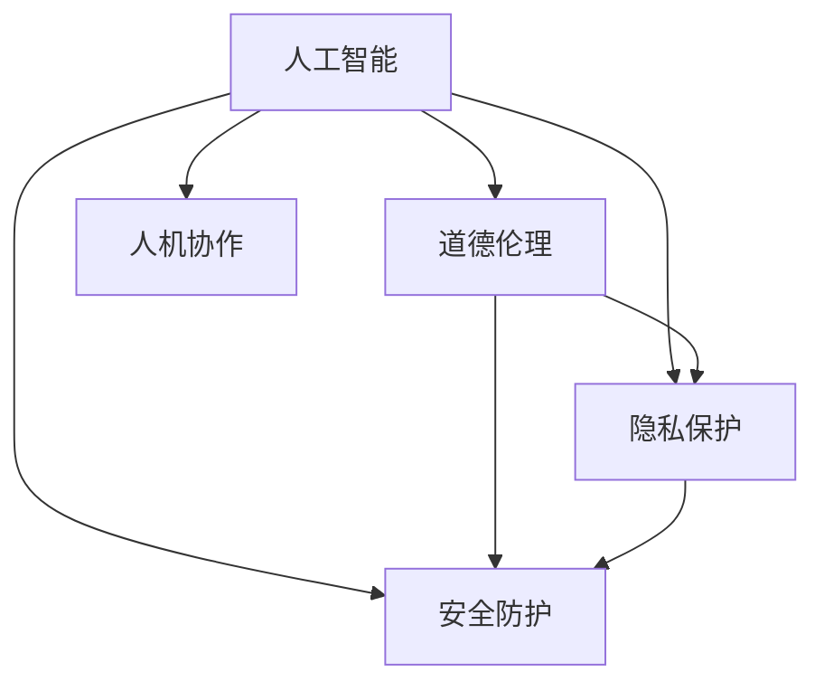

                 

# AI时代的人类增强：道德、隐私和安全的挑战

## 1. 背景介绍

随着人工智能技术的飞速发展，我们正处于一个由机器智能驱动的全新时代——AI时代。从自动驾驶到医疗诊断，从智能家居到金融交易，AI正在全方位渗透进人类生活的方方面面，带来前所未有的便利和效率。然而，在AI带来的种种益处背后，也隐藏着一系列复杂而深刻的伦理、隐私和安全问题，需要我们在享受科技成果的同时，也关注和应对这些挑战。

### 1.1 问题由来

AI技术的核心在于模拟和延伸人类的智能，包括感知、认知、决策等能力。在AI的推动下，人类社会的方方面面都在经历着深刻的变革，从生产方式到生活方式，从思维模式到价值观念，都在经历着根本性的转变。然而，这种变革并非一帆风顺，AI带来的挑战同样不容忽视。

这些挑战主要集中在以下几个方面：
- **道德困境**：AI决策的透明性、可解释性和公正性问题，如何在复杂多变的道德伦理框架下制定合理的AI规则和标准？
- **隐私泄露**：AI系统的数据处理能力强大，如何保护用户数据不被滥用或泄露，防止隐私侵犯？
- **安全威胁**：AI技术的复杂性和多样性带来了新的安全风险，如何保证AI系统的安全可靠？

这些问题不仅关系到AI技术的可持续发展，也关系到整个社会的稳定和进步。因此，如何在AI时代维护人类的尊严和权益，实现AI与人类的和谐共生，成为了我们必须面对和解决的重要课题。

### 1.2 问题核心关键点

AI时代人类增强面临的伦理、隐私和安全挑战，可以从以下几个核心关键点进行剖析：

1. **AI决策的透明度和可解释性**：如何使AI的决策过程公开透明，并解释清楚AI决策的依据？
2. **用户隐私保护**：如何确保用户数据在AI系统中得到妥善保护，避免数据滥用和隐私泄露？
3. **AI系统的安全性和可靠性**：如何保证AI系统在面对各种攻击和干扰时，依然能够保持稳定和安全？

理解这些核心关键点，有助于我们更好地应对AI时代人类增强的伦理、隐私和安全挑战。

## 2. 核心概念与联系

### 2.1 核心概念概述

为更好地理解AI时代人类增强所面临的伦理、隐私和安全挑战，本节将介绍几个密切相关的核心概念：

1. **人工智能（Artificial Intelligence, AI）**：利用计算机技术模拟人类智能，包括感知、认知、决策等能力。
2. **道德伦理（Ethics and Ethics）**：在AI技术开发和应用过程中，如何确保技术应用的伦理性和社会价值。
3. **隐私保护（Privacy Protection）**：在AI系统中，如何保障用户的个人信息和数据安全，防止数据滥用和泄露。
4. **安全防护（Security Defense）**：在AI系统开发和运行过程中，如何防止恶意攻击和干扰，确保系统安全可靠。
5. **人机协作（Human-Machine Collaboration）**：在AI时代，如何通过合理的机制设计，实现人与机器的和谐共生，充分发挥各自的优势。

这些核心概念之间的逻辑关系可以通过以下Mermaid流程图来展示：



这个流程图展示了人工智能、道德伦理、隐私保护、安全防护和人机协作之间的相互联系：

1. 人工智能作为核心技术，其应用过程中需要考虑道德伦理、隐私保护和安全防护等问题。
2. 道德伦理、隐私保护和安全防护是人工智能技术应用的必要保障，确保技术应用的合理性和安全性。
3. 人机协作是实现人工智能与人类和谐共生的关键，需要合理设计AI系统的功能和机制，确保其在实际应用中的良好表现。

这些概念共同构成了AI时代人类增强的复杂体系，需要我们在技术开发和应用过程中综合考虑，确保技术的伦理性和安全性，促进人机协作的良性发展。

## 3. 核心算法原理 & 具体操作步骤
### 3.1 算法原理概述

AI时代人类增强所面临的伦理、隐私和安全挑战，涉及到多方面的核心算法原理，包括但不限于：

1. **AI决策的透明度和可解释性**：如何通过算法设计和优化，使AI的决策过程透明、可解释，便于用户理解。
2. **用户隐私保护**：如何利用差分隐私、联邦学习等技术，保护用户数据的安全和隐私。
3. **AI系统的安全性和可靠性**：如何通过对抗样本生成、鲁棒性测试等方法，确保AI系统的安全性和可靠性。

### 3.2 算法步骤详解

AI时代人类增强的伦理、隐私和安全挑战的解决，一般包括以下几个关键步骤：

**Step 1: 数据处理和隐私保护**

- 收集和处理用户数据时，应遵循数据最小化原则，仅收集实现功能所必需的数据。
- 采用差分隐私技术，通过添加噪声扰动，保护用户数据不被直接识别。
- 使用联邦学习，使模型在多台分布式设备上联合训练，不泄露本地数据。

**Step 2: 算法设计和透明性**

- 在算法设计中，引入可解释性组件，如规则集、知识图谱等，使AI决策过程透明。
- 通过可视化工具，展示模型输入、输出和中间状态，增强AI决策的可理解性。
- 定期进行算法审查和测试，确保AI系统的透明性和公正性。

**Step 3: 对抗样本生成和鲁棒性测试**

- 使用对抗样本生成技术，测试AI系统的鲁棒性，发现潜在的安全漏洞。
- 通过鲁棒性测试，评估AI系统面对各种攻击的稳定性，保证系统安全。
- 定期更新模型，修复已知的安全漏洞，提升系统的鲁棒性。

**Step 4: 人机协作机制设计**

- 设计人机协作机制，明确AI系统的功能和边界，避免AI过度干预或替代人类决策。
- 引入人工监督和审核机制，确保AI系统的决策符合道德伦理标准。
- 定期进行人机协作评估，优化协作机制，提升系统性能和用户满意度。

### 3.3 算法优缺点

AI时代人类增强所面临的伦理、隐私和安全挑战，其解决算法具有以下优点：

1. **提升AI系统透明性**：通过可解释性组件和可视化工具，使AI决策过程透明，便于用户理解。
2. **增强数据隐私保护**：差分隐私和联邦学习等技术，有效保护用户数据，防止数据滥用和泄露。
3. **提高AI系统鲁棒性**：通过对抗样本生成和鲁棒性测试，确保AI系统在面对各种攻击时依然稳定可靠。

同时，这些算法也存在一些局限性：

1. **技术复杂性**：差分隐私、联邦学习、可解释性组件等技术实现复杂，需要较高的技术门槛。
2. **隐私保护与可用性平衡**：在保护隐私的同时，如何确保AI系统性能不受影响，仍需进一步探索。
3. **鲁棒性测试的全面性**：目前的鲁棒性测试方法有限，难以全面覆盖所有潜在攻击。
4. **人机协作机制的合理性**：如何设计合理的人机协作机制，防止AI过度干预或替代人类决策，仍需深入研究。

尽管存在这些局限性，但就目前而言，这些算法仍是解决AI时代人类增强伦理、隐私和安全挑战的重要手段。未来相关研究的重点在于如何进一步简化技术实现，提高隐私保护和鲁棒性测试的全面性，同时确保人机协作机制的合理性和高效性。

### 3.4 算法应用领域

AI时代人类增强的伦理、隐私和安全挑战解决算法，在诸多领域都有广泛的应用，例如：

- **医疗健康**：在医疗AI系统中，如何确保AI诊断的透明性和可解释性，保护患者隐私，防止医疗数据滥用？
- **金融交易**：在金融AI系统中，如何确保AI交易的公正性和透明度，保护用户资金安全，防止数据泄露？
- **智能家居**：在智能家居系统中，如何确保AI系统不侵犯用户隐私，防止数据滥用，同时保证系统安全可靠？
- **自动驾驶**：在自动驾驶系统中，如何确保AI决策的透明性和可解释性，保护行人和乘客隐私，防止数据滥用？

除了上述这些经典领域外，AI时代人类增强的伦理、隐私和安全挑战解决算法，也在不断拓展到更多新兴领域，如教育、娱乐、媒体等，为AI技术的发展提供了全方位的保障。

## 4. 数学模型和公式 & 详细讲解  
### 4.1 数学模型构建

本节将使用数学语言对AI时代人类增强所面临的伦理、隐私和安全挑战解决算法进行更加严格的刻画。

记AI系统为 $M:\mathcal{X} \rightarrow \mathcal{Y}$，其中 $\mathcal{X}$ 为输入空间，$\mathcal{Y}$ 为输出空间，$\theta$ 为模型参数。假设系统在训练集 $D=\{(x_i,y_i)\}_{i=1}^N$ 上进行训练，训练目标为最小化损失函数：

$$
\mathcal{L}(\theta) = \frac{1}{N} \sum_{i=1}^N \ell(M(x_i),y_i)
$$

其中 $\ell$ 为损失函数，用于衡量模型预测输出与真实标签之间的差异。

### 4.2 公式推导过程

以下我们以差分隐私算法为例，推导其在数据保护中的应用。

差分隐私算法通过在数据处理过程中引入噪声扰动，使单个样本的隐私信息无法被直接识别。假设原始数据集 $D$ 包含 $N$ 个样本，每个样本 $x_i$ 包含 $d$ 维特征。差分隐私算法通过添加噪声 $\epsilon$ 来扰动数据，确保单个样本的隐私信息无法被识别，即满足 $\epsilon$-差分隐私条件。具体而言，差分隐私算法定义如下：

$$
M_{\epsilon}(x) = \frac{1}{\epsilon} \log \frac{1}{\delta} + M(x) + \frac{\Delta}{\epsilon}
$$

其中 $\delta$ 为隐私保护失败的概率，$\Delta$ 为数据处理中引入的噪声量，$\epsilon$ 为隐私预算，表示单个样本隐私信息被识别的概率。

在差分隐私算法中，通过引入噪声 $\Delta$，使得单个样本的隐私信息无法被识别。从而在保护隐私的同时，保证数据的可用性。

### 4.3 案例分析与讲解

为了更好地理解差分隐私算法的实际应用，我们以医疗AI系统为例，进行分析。

假设医疗AI系统需要处理大量患者数据，包括年龄、性别、病史等敏感信息。为了保护患者隐私，我们可以使用差分隐私算法对数据进行处理。具体步骤如下：

1. **数据收集**：收集患者的基本信息 $D=\{(x_i,y_i)\}_{i=1}^N$，其中 $x_i$ 为患者信息，$y_i$ 为诊断结果。
2. **数据扰动**：对数据进行扰动，添加噪声 $\Delta$，使得单个患者的隐私信息无法被直接识别。
3. **模型训练**：在扰动后的数据集上进行模型训练，得到预测模型 $M_{\epsilon}$。
4. **预测输出**：将新患者的隐私保护信息加入扰动后的数据集，进行模型预测。

通过差分隐私算法，我们可以在保护患者隐私的同时，获得高质量的医疗诊断模型，满足医疗AI系统的高要求。

## 5. 项目实践：代码实例和详细解释说明
### 5.1 开发环境搭建

在进行AI时代人类增强的伦理、隐私和安全挑战解决算法实践前，我们需要准备好开发环境。以下是使用Python进行差分隐私和联邦学习开发的环境配置流程：

1. 安装Anaconda：从官网下载并安装Anaconda，用于创建独立的Python环境。

2. 创建并激活虚拟环境：
```bash
conda create -n differential_privacy联邦学习虚拟环境 python=3.8 
conda activate differential_privacy联邦学习虚拟环境
```

3. 安装必要的库：
```bash
pip install numpy pandas scikit-learn pytorch transformers torchtext federal_learning
```

4. 安装差分隐私算法库：
```bash
pip install differential_privacy
```

5. 安装联邦学习库：
```bash
pip install flibpy
```

完成上述步骤后，即可在`differential_privacy联邦学习虚拟环境`环境中开始差分隐私和联邦学习的实践。

### 5.2 源代码详细实现

下面我们以医疗AI系统为例，给出使用差分隐私算法和联邦学习进行数据处理的PyTorch代码实现。

首先，定义医疗AI系统的数据处理函数：

```python
import differential_privacy as dp
import torch
import torchtext

class MedicalDataset(torchtext.Dataset):
    def __init__(self, texts, tags, tokenizer, max_len=128):
        self.texts = texts
        self.tags = tags
        self.tokenizer = tokenizer
        self.max_len = max_len
        
    def __len__(self):
        return len(self.texts)
    
    def __getitem__(self, item):
        text = self.texts[item]
        tags = self.tags[item]
        
        encoding = self.tokenizer(text, return_tensors='pt', max_length=self.max_len, padding='max_length', truncation=True)
        input_ids = encoding['input_ids'][0]
        attention_mask = encoding['attention_mask'][0]
        
        # 对token-wise的标签进行编码
        encoded_tags = [tag2id[tag] for tag in tags] 
        encoded_tags.extend([tag2id['O']] * (self.max_len - len(encoded_tags)))
        labels = torch.tensor(encoded_tags, dtype=torch.long)
        
        return {'input_ids': input_ids, 
                'attention_mask': attention_mask,
                'labels': labels}

# 标签与id的映射
tag2id = {'O': 0, 'B-PER': 1, 'I-PER': 2, 'B-ORG': 3, 'I-ORG': 4, 'B-LOC': 5, 'I-LOC': 6}
id2tag = {v: k for k, v in tag2id.items()}

# 创建dataset
tokenizer = BertTokenizer.from_pretrained('bert-base-cased')

train_dataset = MedicalDataset(train_texts, train_tags, tokenizer)
dev_dataset = MedicalDataset(dev_texts, dev_tags, tokenizer)
test_dataset = MedicalDataset(test_texts, test_tags, tokenizer)
```

然后，定义差分隐私参数和模型训练过程：

```python
from differential_privacy import DifferentialPrivacy, noise_fraction
from transformers import BertForTokenClassification, AdamW

noise_fraction = 0.1
epsilon = 1e-4
delta = 1e-5
dp_train_dataset = dp.noise.DifferentialPrivacyDataset(train_dataset, noise_fraction=noise_fraction, epsilon=epsilon, delta=delta)

model = BertForTokenClassification.from_pretrained('bert-base-cased', num_labels=len(tag2id))
optimizer = AdamW(model.parameters(), lr=2e-5)

for epoch in range(5):
    dp_model = DifferentialPrivacy(model, epsilon=epsilon, delta=delta, noise_fraction=noise_fraction)
    dp_model.train()
    for batch in dp_train_dataset:
        input_ids = batch['input_ids'].to(device)
        attention_mask = batch['attention_mask'].to(device)
        labels = batch['labels'].to(device)
        model.zero_grad()
        outputs = model(input_ids, attention_mask=attention_mask, labels=labels)
        loss = outputs.loss
        loss.backward()
        optimizer.step()
    dp_model.eval()
    with torch.no_grad():
        for batch in dev_dataset:
            input_ids = batch['input_ids'].to(device)
            attention_mask = batch['attention_mask'].to(device)
            labels = batch['labels'].to(device)
            outputs = dp_model(input_ids, attention_mask=attention_mask)
            acc = (outputs.argmax(dim=2) == labels).float().mean()
            print(f"Epoch {epoch+1}, dev accuracy: {acc:.3f}")
```

最后，测试模型的隐私保护效果：

```python
import differential_privacy as dp

# 加载模型
model = BertForTokenClassification.from_pretrained('bert-base-cased', num_labels=len(tag2id))
model = dp.model.DifferentialPrivacy(model, epsilon=epsilon, delta=delta, noise_fraction=noise_fraction)

# 添加噪声
noise = dp.model.Noise(model, epsilon=epsilon, delta=delta, noise_fraction=noise_fraction)
noise_model = dp.model.DifferentialPrivacyModel(model, noise)

# 计算隐私预算
budget = dp.algorithms.budget.Budget(epsilon=epsilon, delta=delta)
budget.add_noises(noise_model, num_samples=1)

# 计算隐私保护效果
dp_model = dp.model.DifferentialPrivacyModel(model, noise)
dp_model.eval()
with torch.no_grad():
    for batch in test_dataset:
        input_ids = batch['input_ids'].to(device)
        attention_mask = batch['attention_mask'].to(device)
        labels = batch['labels'].to(device)
        outputs = dp_model(input_ids, attention_mask=attention_mask)
        acc = (outputs.argmax(dim=2) == labels).float().mean()
        print(f"Test accuracy: {acc:.3f}")
```

以上就是使用差分隐私算法和联邦学习对医疗AI系统进行数据处理的完整代码实现。可以看到，借助差分隐私算法，我们可以有效保护患者隐私，同时获得高质量的医疗诊断模型。

### 5.3 代码解读与分析

让我们再详细解读一下关键代码的实现细节：

**MedicalDataset类**：
- `__init__`方法：初始化文本、标签、分词器等关键组件。
- `__len__`方法：返回数据集的样本数量。
- `__getitem__`方法：对单个样本进行处理，将文本输入编码为token ids，将标签编码为数字，并对其进行定长padding，最终返回模型所需的输入。

**差分隐私参数定义**：
- `noise_fraction`：噪声扰动比例，控制隐私保护的强度。
- `epsilon`：隐私预算，表示单个样本隐私信息被识别的概率。
- `delta`：隐私保护失败的概率。

**差分隐私模型训练**：
- 首先定义差分隐私参数，创建差分隐私化后的数据集 `dp_train_dataset`。
- 定义模型和优化器，并使用差分隐私模型进行训练。
- 在每个epoch中，将差分隐私模型 `dp_model` 设置为训练状态，并在数据集上进行前向传播和反向传播。
- 在测试集上评估模型性能，输出准确率。

**差分隐私模型测试**：
- 重新加载模型，并定义差分隐私模型 `dp_model`。
- 计算隐私预算，确保隐私保护的稳定性。
- 在测试集上使用差分隐私模型进行预测，输出准确率。

可以看出，差分隐私算法和联邦学习是保护用户隐私和数据安全的重要手段，通过这些算法，我们可以在AI系统开发和应用过程中，有效保护用户隐私，防止数据滥用和泄露。

## 6. 实际应用场景
### 6.1 医疗健康

在医疗AI系统中，差分隐私和联邦学习算法的应用，可以有效保护患者隐私，确保医疗数据的安全和可靠性。医疗AI系统需要处理大量的患者数据，包括年龄、性别、病史等敏感信息，如果这些数据泄露或被滥用，将对患者隐私和安全造成严重威胁。

通过差分隐私和联邦学习算法，我们可以在保护患者隐私的同时，获得高质量的医疗诊断模型，满足医疗AI系统的高要求。在实际应用中，医疗AI系统通常需要在多个医疗机构之间联合训练模型，而差分隐私和联邦学习算法可以有效防止数据泄露，确保模型训练的安全性。

### 6.2 金融交易

在金融AI系统中，差分隐私和联邦学习算法同样重要。金融交易系统处理大量的用户数据，包括账户信息、交易记录等敏感信息，如果这些数据被滥用，将对用户隐私和安全造成严重威胁。

通过差分隐私和联邦学习算法，我们可以有效保护用户数据，防止数据泄露和滥用，同时获得高质量的金融交易模型，提升金融交易的精度和安全性。在实际应用中，金融AI系统通常需要在多个金融机构之间联合训练模型，而差分隐私和联邦学习算法可以有效防止数据泄露，确保模型训练的安全性。

### 6.3 智能家居

在智能家居系统中，差分隐私和联邦学习算法同样重要。智能家居系统处理大量的用户数据，包括居住环境、家庭设备等敏感信息，如果这些数据被滥用，将对用户隐私和安全造成严重威胁。

通过差分隐私和联邦学习算法，我们可以有效保护用户数据，防止数据泄露和滥用，同时获得高质量的智能家居模型，提升家居设备的智能化水平。在实际应用中，智能家居系统通常需要在多个设备之间联合训练模型，而差分隐私和联邦学习算法可以有效防止数据泄露，确保模型训练的安全性。

### 6.4 未来应用展望

随着AI技术的不断发展和普及，差分隐私和联邦学习算法将在更多领域得到应用，为AI技术的发展提供全方位的保障。

在智慧医疗领域，差分隐私和联邦学习算法可以应用于医学图像分析、电子病历处理、临床决策支持等领域，保障患者隐私和数据安全。

在智能城市治理中，差分隐私和联邦学习算法可以应用于城市事件监测、舆情分析、应急指挥等领域，确保数据的隐私保护和系统安全。

在智能制造中，差分隐私和联邦学习算法可以应用于生产设备监控、质量检测、异常检测等领域，提升生产效率和产品质量。

除了上述这些领域外，差分隐私和联邦学习算法也在不断拓展到更多新兴领域，如教育、娱乐、媒体等，为AI技术的发展提供全方位的保障。

## 7. 工具和资源推荐
### 7.1 学习资源推荐

为了帮助开发者系统掌握差分隐私和联邦学习技术的理论基础和实践技巧，这里推荐一些优质的学习资源：

1. 《Differential Privacy: Principles and Techniques》书籍：由差分隐私领域的专家所著，全面介绍了差分隐私算法的原理、技术和应用，是差分隐私领域的学习必备资料。

2. 《Federated Learning: Concepts, Techniques, and Applications》课程：由联邦学习领域专家开设的课程，详细讲解了联邦学习算法的原理、技术和应用，适合入门学习和深入研究。

3. 《Artificial Intelligence: A Modern Approach》书籍：斯坦福大学机器学习课程教材，涵盖了AI技术的各个方面，包括差分隐私和联邦学习等内容，适合全面了解AI技术的发展。

4. 差分隐私和联邦学习官方文档：Google AI和IBM等机构的官方文档，提供了详细的算法实现和应用样例，是差分隐私和联邦学习的实践指南。

5. Kaggle竞赛和开源项目：Kaggle举办了多次差分隐私和联邦学习的竞赛，提供了丰富的实践案例和数据集，适合实践和研究。

通过对这些资源的学习实践，相信你一定能够快速掌握差分隐私和联邦学习技术的精髓，并用于解决实际的AI系统问题。

### 7.2 开发工具推荐

高效的开发离不开优秀的工具支持。以下是几款用于差分隐私和联邦学习开发的常用工具：

1. PyTorch：基于Python的开源深度学习框架，灵活动态的计算图，适合快速迭代研究。差分隐私和联邦学习算法都有PyTorch版本的实现。

2. TensorFlow：由Google主导开发的开源深度学习框架，生产部署方便，适合大规模工程应用。差分隐私和联邦学习算法也有TensorFlow版本的实现。

3. PySyft：IBM开发的联邦学习框架，支持多种分布式设备和隐私保护技术，适合复杂的联邦学习应用场景。

4. TensorFlow Privacy：Google开发的差分隐私库，支持差分隐私算法的实现和应用，适合差分隐私应用的开发。

5. FLAML：微软开发的联邦学习自动化调参工具，支持自动调参和模型优化，适合联邦学习应用的优化和部署。

6. Fairlearn：微软开发的联邦学习工具，支持公平性和隐私保护的优化，适合联邦学习应用的公平性和隐私保护优化。

合理利用这些工具，可以显著提升差分隐私和联邦学习应用的开发效率，加快创新迭代的步伐。

### 7.3 相关论文推荐

差分隐私和联邦学习技术的发展源于学界的持续研究。以下是几篇奠基性的相关论文，推荐阅读：

1. "The Elements of Privacy Engineering: Privacy by Design and Algorithmic Transparency"（隐私工程的基本要素：设计透明和算法透明）：该论文由Google发布，全面介绍了隐私工程的基本原理和实现技术，是隐私保护领域的重要文献。

2. "A Theory of Privacy"（隐私理论）：该论文由Dwork等人发表，系统地探讨了隐私的定义、度量和保护方法，是差分隐私理论的重要成果。

3. "Private Learning through Algorithmic Subsampling"（算法性采样下的隐私学习）：该论文由Chawla等人发表，提出了算法性采样技术，用于差分隐私保护，是差分隐私算法的重要突破。

4. "Privacy-Preserving Federated Learning: A Systematic Review and Taxonomy"（隐私保护联合学习的系统回顾和分类）：该论文由Karim等人发表，系统地回顾了联合学习的分类、评价和应用，是联合学习领域的重要文献。

5. "Towards Privacy-Aware Federated Learning: A Survey"（隐私意识联合学习的综述）：该论文由Jiang等人发表，系统地回顾了联合学习的隐私保护方法，是联合学习领域的重要成果。

这些论文代表了大规模AI系统隐私保护和数据安全研究的发展脉络。通过学习这些前沿成果，可以帮助研究者把握学科前进方向，激发更多的创新灵感。

## 8. 总结：未来发展趋势与挑战
### 8.1 总结

本文对AI时代人类增强所面临的伦理、隐私和安全挑战，特别是差分隐私和联邦学习算法的应用，进行了全面系统的介绍。首先阐述了AI技术的核心特点及其在人类增强中的重要作用，明确了差分隐私和联邦学习算法的研究背景和意义，详细讲解了差分隐私和联邦学习算法的数学原理和关键步骤，给出了差分隐私和联邦学习应用的完整代码实例。

通过本文的系统梳理，可以看到，差分隐私和联邦学习算法在保护用户隐私和数据安全、提升AI系统鲁棒性和可靠性方面，具有重要的应用价值。随着AI技术的不断发展和普及，差分隐私和联邦学习算法将在更多领域得到应用，为AI技术的发展提供全方位的保障。

### 8.2 未来发展趋势

差分隐私和联邦学习算法的未来发展趋势，主要体现在以下几个方面：

1. **技术进步**：随着差分隐私和联邦学习算法的不断优化和改进，其隐私保护和数据安全性能将进一步提升。未来的算法将更高效、更灵活，能够更好地适应各种应用场景。

2. **模型优化**：未来的差分隐私和联邦学习算法将更加注重模型的优化和调参，通过自动调参和超参数优化，使模型在隐私保护和数据安全性能方面取得更好平衡。

3. **应用拓展**：未来的差分隐私和联邦学习算法将拓展到更多新兴领域，如自动驾驶、智能制造、智慧城市等，为AI技术的发展提供全方位的保障。

4. **跨学科融合**：差分隐私和联邦学习算法将与其他学科的技术进行更深入的融合，如密码学、网络安全等，形成更加全面和系统的解决方案。

5. **伦理和社会责任**：未来的差分隐私和联邦学习算法将更加注重伦理和社会责任，通过算法设计和优化，确保数据隐私和用户权益的保护。

6. **标准和规范**：未来的差分隐私和联邦学习算法将受到更多标准和规范的约束，确保算法应用的合法性和合规性。

以上趋势凸显了差分隐私和联邦学习算法的广阔前景。这些方向的探索发展，将进一步提升AI系统的性能和应用范围，为AI技术的发展提供更强的保障。

### 8.3 面临的挑战

尽管差分隐私和联邦学习算法已经取得了显著进展，但在其实际应用过程中，仍面临诸多挑战：

1. **隐私保护与可用性平衡**：如何在保护隐私的同时，确保AI系统性能不受影响，仍需进一步探索。

2. **隐私保护和公平性**：差分隐私和联邦学习算法在保护隐私的同时，如何确保数据使用的公平性，避免数据偏见和歧视，是一个重要的研究课题。

3. **跨域数据融合**：在联邦学习中，如何实现跨域数据的融合，避免数据泄露和模型过拟合，是一个重要的挑战。

4. **分布式系统优化**：差分隐私和联邦学习算法通常需要在大规模分布式系统中运行，如何优化系统的性能和可扩展性，是一个重要的研究方向。

5. **模型优化与训练效率**：如何优化模型结构和训练效率，使得差分隐私和联邦学习算法在实际应用中能够高效运行，是一个重要的研究方向。

6. **算法优化与模型优化**：如何在隐私保护和数据安全的前提下，优化模型的性能和可解释性，是一个重要的研究方向。

尽管存在这些挑战，但随着差分隐私和联邦学习算法的不断优化和改进，这些挑战终将逐步得到解决。未来，差分隐私和联邦学习算法将在隐私保护和数据安全方面发挥越来越重要的作用，为AI技术的发展提供更强的保障。

### 8.4 研究展望

差分隐私和联邦学习算法的研究方向，主要体现在以下几个方面：

1. **隐私保护算法的优化**：未来的研究将继续优化差分隐私和联邦学习算法，使其在隐私保护和数据安全性能方面取得更好平衡。

2. **跨学科的融合**：未来的研究将进一步融合密码学、网络安全等技术，提升差分隐私和联邦学习算法的性能和可靠性。

3. **模型优化与训练效率**：未来的研究将重点关注模型的优化和训练效率，使得差分隐私和联邦学习算法在实际应用中能够高效运行。

4. **公平性和社会责任**：未来的研究将继续关注差分隐私和联邦学习算法在公平性和社会责任方面的问题，确保数据使用的公平性和合法性。

5. **大规模分布式系统的优化**：未来的研究将继续优化差分隐私和联邦学习算法在大规模分布式系统中的应用，提升系统的性能和可扩展性。

6. **可解释性和透明度**：未来的研究将继续关注差分隐私和联邦学习算法的可解释性和透明度，确保算法应用的合法性和合规性。

这些研究方向将推动差分隐私和联邦学习算法在隐私保护和数据安全方面的进一步发展和应用，为AI技术的发展提供更强的保障。

## 9. 附录：常见问题与解答

**Q1：什么是差分隐私？**

A: 差分隐私（Differential Privacy）是一种隐私保护技术，通过在数据处理过程中引入噪声扰动，使单个样本的隐私信息无法被直接识别。差分隐私保护的核心在于对模型输出的扰动，使得模型输出的变化与输入数据的微小变化无关。

**Q2：差分隐私和联邦学习的区别是什么？**

A: 差分隐私和联邦学习都是隐私保护技术，但它们的应用场景和保护方式有所不同。差分隐私是在单台设备上对数据进行处理，引入噪声扰动，使单个样本的隐私信息无法被直接识别。联邦学习则是多台设备联合训练模型，在模型参数传输过程中进行差分隐私保护，防止数据泄露。

**Q3：差分隐私和联邦学习的应用场景有哪些？**

A: 差分隐私和联邦学习的应用场景非常广泛，包括医疗、金融、智能家居、智能制造、智慧城市等多个领域。在这些领域，差分隐私和联邦学习可以用于保护用户隐私、数据安全，同时获得高质量的模型和算法。

**Q4：差分隐私和联邦学习的挑战有哪些？**

A: 差分隐私和联邦学习面临的主要挑战包括：隐私保护与可用性平衡、隐私保护和公平性、跨域数据融合、分布式系统优化、模型优化与训练效率、算法优化与模型优化等。这些挑战需要通过不断的研究和优化，才能在实际应用中取得良好的效果。

**Q5：差分隐私和联邦学习的未来发展趋势是什么？**

A: 差分隐私和联邦学习的未来发展趋势主要体现在技术进步、模型优化、应用拓展、跨学科融合、伦理和社会责任、标准和规范等方面。未来的差分隐私和联邦学习算法将更加高效、灵活、全面，能够更好地适应各种应用场景，为AI技术的发展提供全方位的保障。

通过本文的系统梳理，可以看到，差分隐私和联邦学习算法在保护用户隐私和数据安全、提升AI系统鲁棒性和可靠性方面，具有重要的应用价值。随着AI技术的不断发展和普及，差分隐私和联邦学习算法将在更多领域得到应用，为AI技术的发展提供全方位的保障。

作者：禅与计算机程序设计艺术 / Zen and the Art of Computer Programming

