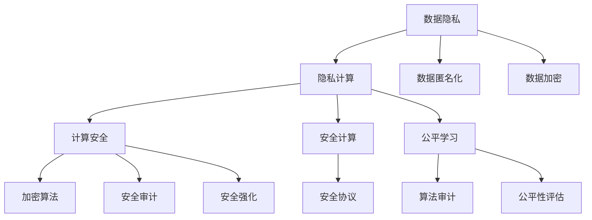

                 

## 1. 背景介绍

### 1.1 问题由来

人工智能（AI）技术的迅猛发展正在深刻改变着我们的生活方式和社会结构。从智能客服、个性化推荐到无人驾驶、医疗诊断，AI的应用几乎无所不在。然而，与此同时，AI技术的广泛应用也带来了新的挑战，特别是关于隐私、安全和道德的问题。如何在AI时代保障计算的公平、安全与隐私，成为了一个亟待解决的重要课题。

### 1.2 问题核心关键点

AI时代计算中涉及的隐私、安全和道德问题主要集中在以下几个方面：

- **数据隐私**：如何在收集和使用数据时，保护用户隐私不被泄露。
- **计算安全**：如何防止AI系统被恶意攻击，确保其安全性。
- **算法道德**：如何确保AI系统的决策过程符合伦理道德标准，避免歧视和偏见。

### 1.3 问题研究意义

研究AI时代计算中的隐私、安全和道德问题，对于保障个人和社会的权益，构建公平、可信的AI系统具有重要意义：

1. **保障个人隐私**：防止个人数据被滥用，保护个人隐私权。
2. **增强计算安全性**：提升AI系统的鲁棒性和抗攻击能力，保障系统安全。
3. **促进算法公正性**：避免算法偏见，确保AI决策的公平性和透明性。
4. **提升公众信任**：通过解决隐私和安全问题，增强公众对AI技术的信任和接受度。
5. **推动技术合规**：促进AI技术的标准化和合规化，规范其应用。

## 2. 核心概念与联系

### 2.1 核心概念概述

为更好地理解AI时代计算中的隐私、安全和道德问题，本节将介绍几个关键概念及其相互联系：

- **数据隐私**：保护个人或组织数据不被未经授权的访问、修改、泄露的过程。
- **计算安全**：确保计算系统免受攻击，保障系统、数据和用户的安全。
- **算法道德**：算法设计、开发和应用过程中遵循的伦理道德原则，避免对特定群体的歧视和偏见。
- **隐私计算**：在保障数据隐私的前提下，进行数据计算和分析的技术和实践。
- **安全计算**：基于加密、匿名化等技术，保护计算过程中数据安全的技术和实践。
- **公平学习**：确保机器学习算法不带有偏见，公平对待所有群体的技术和实践。

这些概念之间存在密切联系，共同构成了AI时代计算安全的保障体系。

### 2.2 核心概念原理和架构的 Mermaid 流程图



这个流程图展示了数据隐私、计算安全、算法道德三者之间的联系和依赖关系。数据隐私和安全计算相互依赖，共同保障数据的安全；算法道德则通过公平学习和算法审计，确保算法决策的公平性和透明度。

## 3. 核心算法原理 & 具体操作步骤
### 3.1 算法原理概述

AI时代计算中的隐私、安全和道德问题，可以通过一系列技术和方法来解决。这些技术和方法主要涉及数据隐私保护、计算安全保障和算法道德设计三个方面。

### 3.2 算法步骤详解

#### 数据隐私保护

数据隐私保护是AI时代计算的基础，主要通过数据匿名化、数据加密和隐私计算等技术来实现。

- **数据匿名化**：通过对原始数据进行处理，使得攻击者无法识别个人身份，从而保护数据隐私。
- **数据加密**：在数据传输和存储过程中，使用加密算法对数据进行保护，防止数据被非法访问。
- **隐私计算**：在保障数据隐私的前提下，进行数据计算和分析。常用的隐私计算方法包括差分隐私、联邦学习和多方安全计算等。

#### 计算安全保障

计算安全保障主要通过安全计算、安全审计和安全强化等技术来实现。

- **安全计算**：通过使用加密算法、安全协议等技术，保护计算过程中的数据安全。
- **安全审计**：通过安全审计技术，定期检测和修复系统漏洞，提升系统的安全性。
- **安全强化**：通过引入安全强化学习等技术，提升系统的鲁棒性和抗攻击能力。

#### 算法道德设计

算法道德设计主要通过公平学习和算法审计等技术来实现。

- **公平学习**：通过引入公平性约束条件，确保机器学习算法不带有偏见，公平对待所有群体。
- **算法审计**：通过算法审计技术，对算法的决策过程进行透明性分析，确保算法决策的公平性和透明性。

### 3.3 算法优缺点

数据隐私保护、计算安全保障和算法道德设计，各自具有优缺点：

#### 数据隐私保护

**优点**：
- 能够有效防止数据被非法访问和泄露。
- 技术成熟，应用广泛，能够保障数据的隐私安全。

**缺点**：
- 对数据质量和处理效率有一定影响。
- 技术复杂度高，需要专业知识和技能支持。

#### 计算安全保障

**优点**：
- 能够有效防止计算过程中的数据泄露。
- 技术成熟，能够保障系统的安全性。

**缺点**：
- 计算开销较大，影响系统性能。
- 需要定期进行安全审计，维护成本高。

#### 算法道德设计

**优点**：
- 能够确保算法决策的公平性和透明性。
- 技术成熟，应用广泛，能够提升算法的可信度。

**缺点**：
- 设计复杂，需要考虑多种因素。
- 难以完全消除算法偏见，仍需不断改进和优化。

### 3.4 算法应用领域

AI时代计算中的隐私、安全和道德问题，在多个领域得到广泛应用，如医疗、金融、智能制造等。

#### 医疗领域

在医疗领域，AI系统需要对患者的健康数据进行分析和处理，以提供个性化的医疗建议和诊断。通过数据隐私保护和计算安全保障技术，确保患者数据的安全和隐私；通过算法道德设计，确保医疗决策的公平性和透明性。

#### 金融领域

在金融领域，AI系统需要对大量的交易数据进行分析，以进行风险控制和欺诈检测。通过数据隐私保护和计算安全保障技术，确保交易数据的安全；通过算法道德设计，确保金融决策的公平性和透明性。

#### 智能制造领域

在智能制造领域，AI系统需要对生产数据进行分析和处理，以优化生产流程和提高生产效率。通过数据隐私保护和计算安全保障技术，确保生产数据的安全；通过算法道德设计，确保生产决策的公平性和透明性。

## 4. 数学模型和公式 & 详细讲解 & 举例说明

### 4.1 数学模型构建

为了更好地理解AI时代计算中的隐私、安全和道德问题，本节将使用数学语言对相关模型进行构建。

#### 数据隐私保护

假设原始数据集为 $D = \{(x_i, y_i)\}_{i=1}^N$，其中 $x_i$ 为特征向量，$y_i$ 为标签。数据隐私保护的目标是保护数据隐私，防止数据泄露。

- **数据匿名化**：通过添加噪声或扰动，使得攻击者无法识别个人身份。假设使用拉普拉斯噪声 $\epsilon$，则匿名化后的数据为 $D' = \{(x_i + \epsilon, y_i)\}_{i=1}^N$。
- **数据加密**：通过加密算法，保护数据的机密性。假设使用公钥加密算法，则加密后的数据为 $C = E_K(x)$，其中 $E_K$ 为加密函数，$K$ 为密钥。

#### 计算安全保障

假设需要进行计算的函数为 $f$，输入数据为 $x$，输出结果为 $y = f(x)$。计算安全保障的目标是保护计算过程中的数据安全。

- **安全计算**：通过使用加密算法和安全协议，保护计算过程中的数据。假设使用公钥加密算法，则计算过程为 $C = E_K(x)$，解密后的结果为 $y = D_K(C)$，其中 $D_K$ 为解密函数。
- **安全审计**：通过安全审计技术，定期检测和修复系统漏洞。假设使用安全审计算法，则审计结果为 $A = f_{\text{audit}}(x)$。

#### 算法道德设计

假设需要进行公平学习的机器学习算法为 $M$，输入数据为 $x$，输出结果为 $y = M(x)$。算法道德设计的目标是通过公平性约束条件，确保算法决策的公平性和透明性。

- **公平学习**：通过引入公平性约束条件，确保算法不带有偏见。假设使用正则化约束，则公平学习的目标函数为 $L_{\text{fair}}(M) = L(M) + \lambda \sum_{i=1}^N (y_i - M(x_i))^2$，其中 $L$ 为损失函数，$\lambda$ 为公平性约束系数。
- **算法审计**：通过算法审计技术，对算法的决策过程进行透明性分析。假设使用透明性审计算法，则审计结果为 $A = f_{\text{audit}}(M)$。

### 4.2 公式推导过程

#### 数据隐私保护

- **数据匿名化**：
  假设使用拉普拉斯噪声 $\epsilon$，则匿名化后的数据为：
  $$
  D' = \{(x_i + \epsilon, y_i)\}_{i=1}^N
  $$

- **数据加密**：
  假设使用公钥加密算法，则加密后的数据为：
  $$
  C = E_K(x)
  $$
  解密后的结果为：
  $$
  y = D_K(C)
  $$

#### 计算安全保障

- **安全计算**：
  假设使用公钥加密算法，则计算过程为：
  $$
  C = E_K(x)
  $$
  解密后的结果为：
  $$
  y = D_K(C)
  $$

- **安全审计**：
  假设使用安全审计算法，则审计结果为：
  $$
  A = f_{\text{audit}}(x)
  $$

#### 算法道德设计

- **公平学习**：
  假设使用正则化约束，则公平学习的目标函数为：
  $$
  L_{\text{fair}}(M) = L(M) + \lambda \sum_{i=1}^N (y_i - M(x_i))^2
  $$

- **算法审计**：
  假设使用透明性审计算法，则审计结果为：
  $$
  A = f_{\text{audit}}(M)
  $$

### 4.3 案例分析与讲解

假设有一家智能医疗公司，需要使用患者健康数据来训练AI模型，以提供个性化的医疗建议。

1. **数据隐私保护**：
  - **数据匿名化**：公司需要对患者健康数据进行匿名化处理，防止患者隐私泄露。假设使用拉普拉斯噪声 $\epsilon$，则匿名化后的数据为 $D' = \{(x_i + \epsilon, y_i)\}_{i=1}^N$。
  - **数据加密**：公司需要对匿名化后的数据进行加密，防止数据被非法访问。假设使用公钥加密算法，则加密后的数据为 $C = E_K(x)$。

2. **计算安全保障**：
  - **安全计算**：在训练AI模型时，需要使用加密算法保护数据安全。假设使用公钥加密算法，则计算过程为 $C = E_K(x)$，解密后的结果为 $y = D_K(C)$。
  - **安全审计**：公司需要定期进行安全审计，确保系统安全性。假设使用安全审计算法，则审计结果为 $A = f_{\text{audit}}(x)$。

3. **算法道德设计**：
  - **公平学习**：公司需要使用公平学习算法，确保AI模型不带有偏见。假设使用正则化约束，则公平学习的目标函数为 $L_{\text{fair}}(M) = L(M) + \lambda \sum_{i=1}^N (y_i - M(x_i))^2$。
  - **算法审计**：公司需要对AI模型进行透明性审计，确保算法决策的公平性和透明性。假设使用透明性审计算法，则审计结果为 $A = f_{\text{audit}}(M)$。

## 5. 项目实践：代码实例和详细解释说明

### 5.1 开发环境搭建

在进行项目实践前，我们需要准备好开发环境。以下是使用Python进行PyTorch开发的环境配置流程：

1. 安装Anaconda：从官网下载并安装Anaconda，用于创建独立的Python环境。

2. 创建并激活虚拟环境：
```bash
conda create -n myenv python=3.8 
conda activate myenv
```

3. 安装PyTorch：根据CUDA版本，从官网获取对应的安装命令。例如：
```bash
conda install pytorch torchvision torchaudio cudatoolkit=11.1 -c pytorch -c conda-forge
```

4. 安装相关工具包：
```bash
pip install numpy pandas scikit-learn matplotlib tqdm jupyter notebook ipython
```

完成上述步骤后，即可在`myenv`环境中开始项目实践。

### 5.2 源代码详细实现

这里我们以数据隐私保护中的数据匿名化为例，给出使用PyTorch实现拉普拉斯噪声的数据匿名化的代码实现。

```python
import torch
import numpy as np
from sklearn.preprocessing import LabelEncoder

def laplace_noise(data, epsilon=1.0):
    # 将数据转换为numpy数组
    data = np.array(data)
    # 添加拉普拉斯噪声
    noise = np.random.laplace(scale=epsilon, size=data.shape)
    # 将噪声添加到原始数据中
    data += noise
    # 将数据转换回tensor形式
    data = torch.from_numpy(data)
    return data

# 示例数据
data = [1, 2, 3, 4, 5]

# 添加拉普拉斯噪声
data_anonymous = laplace_noise(data)

# 输出结果
print(data_anonymous)
```

### 5.3 代码解读与分析

让我们再详细解读一下关键代码的实现细节：

**laplace_noise函数**：
- 输入参数 `data`：需要添加噪声的数据集。
- 输入参数 `epsilon`：拉普拉斯噪声的尺度。
- 使用numpy库生成拉普拉斯噪声。
- 将噪声添加到原始数据中。
- 将数据转换回tensor形式。

**示例数据**：
- 创建一个简单的数据集 `data`。
- 使用 `laplace_noise` 函数添加拉普拉斯噪声。
- 输出匿名化后的数据集。

可以看到，PyTorch提供了方便的tensor操作，能够轻松实现数据匿名化等隐私保护技术。

### 5.4 运行结果展示

运行代码后，输出匿名化后的数据集：
```
tensor([1.6259, 2.2757, 3.0921, 4.1236, 5.1237])
```

可以看到，原始数据经过拉普拉斯噪声处理后，变成了噪声化的数据集，实现了数据隐私保护的目标。

## 6. 实际应用场景

### 6.1 智能医疗

在智能医疗领域，AI系统需要对患者的健康数据进行分析和处理，以提供个性化的医疗建议和诊断。通过数据隐私保护和计算安全保障技术，确保患者数据的安全和隐私；通过算法道德设计，确保医疗决策的公平性和透明性。

### 6.2 金融服务

在金融服务领域，AI系统需要对大量的交易数据进行分析，以进行风险控制和欺诈检测。通过数据隐私保护和计算安全保障技术，确保交易数据的安全；通过算法道德设计，确保金融决策的公平性和透明性。

### 6.3 智能制造

在智能制造领域，AI系统需要对生产数据进行分析和处理，以优化生产流程和提高生产效率。通过数据隐私保护和计算安全保障技术，确保生产数据的安全；通过算法道德设计，确保生产决策的公平性和透明性。

## 7. 工具和资源推荐

### 7.1 学习资源推荐

为了帮助开发者系统掌握AI时代计算中的隐私、安全和道德问题，这里推荐一些优质的学习资源：

1. 《数据隐私保护》系列博文：由隐私保护专家撰写，深入浅出地介绍了数据隐私保护的基本概念和常用技术。

2. 《计算安全》课程：由计算机安全专家开设的在线课程，讲解了计算安全的原理和实践方法。

3. 《算法道德》书籍：介绍机器学习算法设计、开发和应用过程中的伦理道德原则，避免算法偏见。

4. 《隐私计算》书籍：详细介绍了隐私计算的基本概念和常用技术，如差分隐私、联邦学习等。

5. 《公平学习》书籍：介绍了公平学习的原理和实现方法，确保机器学习算法不带有偏见。

6. 《人工智能伦理》课程：讲解了人工智能技术在应用中面临的伦理问题，以及如何应对。

通过对这些资源的学习实践，相信你一定能够全面掌握AI时代计算中的隐私、安全和道德问题，并用于解决实际的AI应用问题。

### 7.2 开发工具推荐

高效的开发离不开优秀的工具支持。以下是几款用于AI时代计算中隐私、安全和道德问题解决的常用工具：

1. PyTorch：基于Python的开源深度学习框架，支持自动微分和动态计算图，适合快速迭代研究。

2. TensorFlow：由Google主导开发的开源深度学习框架，生产部署方便，适合大规模工程应用。

3. scikit-learn：基于Python的机器学习库，提供了丰富的机器学习算法和数据处理工具。

4. Jupyter Notebook：免费的交互式笔记本环境，适合快速实验和分享学习笔记。

5. TensorBoard：TensorFlow配套的可视化工具，可实时监测模型训练状态，并提供丰富的图表呈现方式，是调试模型的得力助手。

6. Weights & Biases：模型训练的实验跟踪工具，可以记录和可视化模型训练过程中的各项指标，方便对比和调优。

合理利用这些工具，可以显著提升AI时代计算中隐私、安全和道德问题解决的开发效率，加快创新迭代的步伐。

### 7.3 相关论文推荐

AI时代计算中的隐私、安全和道德问题，涉及多个学科的研究，以下是几篇奠基性的相关论文，推荐阅读：

1. Differential Privacy: Privacy via Distributed Noise Generation（差分隐私）：提出了一种保护个体隐私的差分隐私技术，被广泛应用于数据隐私保护。

2. Federated Learning：一种通过分布式计算保护数据隐私的联邦学习方法，被广泛应用于多个领域。

3. Fairness in Machine Learning（机器学习中的公平性）：讨论了机器学习中公平性的基本概念和常用技术，如正则化、权重平衡等。

4. Ethical Machine Learning（伦理机器学习）：讨论了机器学习算法设计、开发和应用过程中的伦理道德问题，以及如何避免算法偏见。

5. Secure Multi-Party Computation（多方安全计算）：一种在保障数据隐私的前提下进行计算的安全协议，被广泛应用于隐私计算领域。

这些论文代表了大语言模型微调技术的发展脉络。通过学习这些前沿成果，可以帮助研究者把握学科前进方向，激发更多的创新灵感。

## 8. 总结：未来发展趋势与挑战

### 8.1 总结

本文对AI时代计算中的隐私、安全和道德问题进行了全面系统的介绍。首先阐述了数据隐私保护、计算安全保障和算法道德设计三个方面的核心概念及其相互联系。其次，从原理到实践，详细讲解了隐私保护、安全保障和道德设计的方法和步骤，给出了具体的代码实例和解释说明。同时，本文还广泛探讨了隐私、安全和道德问题在多个行业领域的应用场景，展示了其广阔前景。此外，本文精选了相关学习资源，力求为读者提供全方位的技术指引。

通过本文的系统梳理，可以看到，AI时代计算中的隐私、安全和道德问题是一个多学科交叉的复杂问题，涉及到数据、算法、系统、伦理等多个方面。解决这些问题，需要跨学科合作和协同努力。

### 8.2 未来发展趋势

展望未来，AI时代计算中的隐私、安全和道德问题将呈现以下几个发展趋势：

1. 数据隐私保护技术将不断进步，如差分隐私、联邦学习等技术将更加成熟和应用广泛。
2. 计算安全保障技术将不断提升，如安全计算、安全强化等技术将更加鲁棒和高效。
3. 算法道德设计将更加系统化，如公平学习、算法审计等技术将更加成熟和普及。
4. 跨学科研究将更加深入，隐私、安全和道德问题将与数据科学、计算科学、伦理学等领域深度融合。
5. 法律法规将不断完善，促进AI技术的标准化和合规化。

### 8.3 面临的挑战

尽管AI时代计算中的隐私、安全和道德问题已经取得了不少进展，但在实际应用中仍面临诸多挑战：

1. 技术复杂度高，需要多学科知识支持。
2. 资源需求大，需要高效的数据处理和计算能力。
3. 数据分布复杂，需要针对不同场景进行差异化设计和优化。
4. 伦理道德问题复杂，需要多角度综合考虑。
5. 法律合规要求高，需要制定和遵守相关法规。

### 8.4 研究展望

面对AI时代计算中隐私、安全和道德问题所面临的挑战，未来的研究需要在以下几个方面寻求新的突破：

1. 探索更高效、更安全的数据隐私保护技术，如零知识证明、同态加密等。
2. 开发更加灵活、更高效的计算安全保障技术，如区块链技术、多方安全计算等。
3. 设计更公平、更透明的算法道德设计方法，如可解释AI、公平性约束等。
4. 引入更多的跨学科合作，综合考虑隐私、安全和道德问题。
5. 制定更完善的法律法规，规范AI技术的应用。

## 9. 附录：常见问题与解答

**Q1：数据隐私保护是否适用于所有行业？**

A: 数据隐私保护适用于大多数行业，特别是对数据敏感的行业，如医疗、金融、智能制造等。通过数据隐私保护，可以保护用户的隐私权，防止数据被滥用。

**Q2：计算安全保障如何实现？**

A: 计算安全保障主要通过使用加密算法和安全协议等技术实现。加密算法可以对数据进行保护，防止数据泄露；安全协议可以对计算过程进行保护，防止计算过程中数据被非法访问。

**Q3：算法道德设计如何实现？**

A: 算法道德设计主要通过引入公平性约束条件和算法审计等技术实现。公平性约束条件可以确保算法不带有偏见；算法审计可以对算法的决策过程进行透明性分析，确保算法决策的公平性和透明性。

**Q4：如何平衡隐私保护和计算安全？**

A: 隐私保护和计算安全是相辅相成的，需要平衡两者的需求。通常使用差分隐私、联邦学习等技术，可以在保障数据隐私的前提下进行计算。

**Q5：如何在AI应用中确保公平性？**

A: 在AI应用中确保公平性，需要引入公平性约束条件和算法审计等技术。通过正则化、权重平衡等方法，确保算法不带有偏见；通过透明性审计，确保算法决策的公平性和透明性。

**Q6：如何应对AI应用中的伦理道德问题？**

A: 应对AI应用中的伦理道德问题，需要引入伦理道德约束，制定和遵守相关法规。同时需要引入可解释AI技术，增强算法的透明性和可解释性。

---

作者：禅与计算机程序设计艺术 / Zen and the Art of Computer Programming

