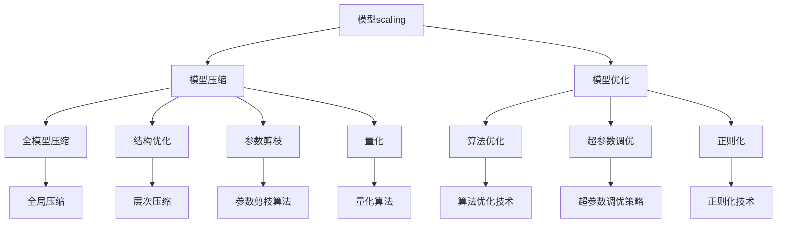

                 

# AI模型scaling：从参数到性能的关系

> 关键词：模型scaling, 模型压缩, 模型优化, 深度学习, 参数数量, 性能提升, 计算资源, 机器学习, 深度网络

## 1. 背景介绍

### 1.1 问题由来

随着深度学习技术的发展，大规模神经网络模型在诸如计算机视觉、自然语言处理、语音识别等诸多领域取得了巨大的突破。这些模型通常具有数亿甚至数十亿的参数，需要消耗大量的计算资源进行训练和推理。然而，由于计算资源的限制，如何在大规模模型与计算效率之间找到平衡，成为当下的一大挑战。

在实践中，研究人员和工程师们发现，虽然增加模型参数可以显著提升模型性能，但并非所有的性能提升都是必要的。如何高效利用计算资源，让模型既能保持高精度，又能高效运行，是当前深度学习领域的重要研究方向。

### 1.2 问题核心关键点

本节将介绍几个核心概念，并阐述它们之间的联系：

- **模型scaling**：指通过增加或减少模型参数量，调整模型规模以适应不同的计算资源和任务需求的过程。
- **模型压缩**：指在保持或提高模型性能的同时，减少模型参数和计算资源消耗的技术手段。
- **模型优化**：通过调整模型结构、算法和超参数，提高模型效率和准确性的过程。

- **深度学习**：一种通过多层次非线性变换学习数据表示的机器学习方法。深度学习模型通常具有大量的参数和复杂的结构，需要大量的计算资源进行训练和推理。
- **计算资源**：包括CPU、GPU、TPU等硬件设备和相应的软件资源。这些资源直接影响深度学习模型的训练和推理效率。
- **参数数量**：模型中可训练参数的总量。增加参数数量可以提高模型的表达能力和学习能力，但也意味着需要更多的计算资源。
- **性能提升**：模型在精度、泛化能力等方面的改进。参数数量增加不一定能带来性能提升，有时还需要考虑计算效率和资源消耗。

## 2. 核心概念与联系

### 2.1 核心概念概述

为了更好地理解从参数到性能的关系，本节将介绍几个核心概念，并阐述它们之间的联系。

- **模型scaling**：通过增加或减少模型参数量，调整模型规模以适应不同的计算资源和任务需求的过程。
- **模型压缩**：在保持或提高模型性能的同时，减少模型参数和计算资源消耗的技术手段。
- **模型优化**：通过调整模型结构、算法和超参数，提高模型效率和准确性的过程。

这些概念之间的逻辑关系可以通过以下Mermaid流程图来展示：



这个流程图展示了几大核心概念之间的逻辑关系：

1. **模型scaling**：调整模型规模，包括模型压缩和模型优化。
2. **模型压缩**：通过剪枝、量化等技术减少模型参数和计算资源消耗。
3. **模型优化**：调整模型结构、算法和超参数，提高模型效率和准确性。

这些概念共同构成了深度学习模型高效化的方法框架，使得模型在保持高精度的同时，能高效运行于有限的计算资源中。

## 3. 核心算法原理 & 具体操作步骤

### 3.1 算法原理概述

模型scaling的核心在于如何通过调整模型规模，在保持或提高模型性能的同时，减少计算资源的消耗。常见的策略包括模型压缩、模型优化等。

- **模型压缩**：通过剪枝、量化等技术减少模型参数和计算资源消耗。
- **模型优化**：通过调整模型结构、算法和超参数，提高模型效率和准确性。

### 3.2 算法步骤详解

#### 3.2.1 模型压缩

模型压缩是通过减少模型参数和计算资源消耗，提高模型运行效率的技术手段。常见的模型压缩方法包括：

1. **参数剪枝**：通过筛选并移除模型中不必要的参数，减少模型规模。
2. **量化**：将模型中的浮点数参数转化为定点数参数，减少存储空间和计算开销。
3. **全局稀疏化**：通过稀疏矩阵技术，减少模型中实际使用的参数数量。
4. **层次压缩**：对不同层次的参数进行不同程度的压缩，实现全局和局部优化。

#### 3.2.2 模型优化

模型优化通过调整模型结构、算法和超参数，提高模型效率和准确性。常见的模型优化方法包括：

1. **结构优化**：调整网络层次、神经元数量等，优化模型结构。
2. **算法优化**：优化优化器、损失函数等，提高训练效率和模型性能。
3. **超参数调优**：调整学习率、批大小等超参数，寻找最优模型配置。
4. **正则化**：通过L1、L2正则化等技术，防止过拟合，提高模型泛化能力。

### 3.3 算法优缺点

模型压缩和模型优化各有优缺点：

#### 模型压缩的优点：

1. **减少计算资源消耗**：通过减少参数和计算资源，模型可以高效运行于有限的计算资源中。
2. **提升训练速度**：减少模型规模，加快训练和推理速度。
3. **降低存储需求**：减少模型参数和存储空间，节省存储成本。

#### 模型压缩的缺点：

1. **性能损失**：过度压缩可能导致模型性能下降。
2. **可解释性降低**：压缩后的模型可能变得难以解释和调试。
3. **复杂性增加**：压缩技术本身的实现可能较为复杂。

#### 模型优化的优点：

1. **提升模型性能**：通过调整模型结构和超参数，提高模型的准确性和泛化能力。
2. **增强模型稳定性**：优化超参数和算法，避免过拟合和训练不稳定。
3. **适应不同场景**：通过优化模型，使其适用于不同的计算资源和任务需求。

#### 模型优化的缺点：

1. **计算复杂度增加**：优化过程可能增加计算复杂度，延长训练时间。
2. **参数更新困难**：优化超参数和算法可能较为困难，需要丰富的经验和实验。
3. **模型结构复杂**：优化后的模型可能变得复杂，难以理解和调试。

### 3.4 算法应用领域

模型压缩和优化在深度学习模型的各个领域都有广泛应用，包括计算机视觉、自然语言处理、语音识别等。

#### 3.4.1 计算机视觉

在计算机视觉领域，模型压缩和优化可以通过减少卷积核数量、降低图像分辨率等手段，实现模型的高效化和轻量化。例如，MobileNet系列模型就是通过全局稀疏化和层次压缩，将标准Inception模型压缩至十分之一的大小，但仍保持了较高的精度。

#### 3.4.2 自然语言处理

在自然语言处理领域，模型压缩和优化可以通过剪枝、量化等手段，减少模型参数和计算资源消耗。例如，BERT-base模型的参数量高达3亿，而通过剪枝和量化技术，可以将参数量减少至几千万，同时保持较高的性能。

#### 3.4.3 语音识别

在语音识别领域，模型压缩和优化可以通过剪枝、量化等手段，减少模型参数和计算资源消耗。例如，通过剪枝技术，可以将标准卷积神经网络模型压缩至十分之一的大小，仍能保持较高的识别精度。

## 4. 数学模型和公式 & 详细讲解 & 举例说明

### 4.1 数学模型构建

本节将使用数学语言对模型scaling和压缩的数学原理进行详细阐述。

假设深度学习模型为 $M_{\theta}(x)$，其中 $x$ 为输入，$\theta$ 为模型参数。

模型压缩的目标是通过减少模型参数量，提高模型运行效率。常见的模型压缩技术包括参数剪枝、量化等。假设压缩后的模型参数为 $\hat{\theta}$，则模型压缩的目标函数为：

$$
\min_{\hat{\theta}} ||M_{\theta}(x) - M_{\hat{\theta}}(x)||^2
$$

其中，$||\cdot||$ 表示矩阵范数，用于衡量模型压缩前后输出结果的差异。

### 4.2 公式推导过程

以下我们以参数剪枝为例，推导其数学公式。

假设原始模型的结构为 $M_{\theta} = \sum_{i=1}^n W_i A_i$，其中 $W_i$ 为第 $i$ 层的权重矩阵，$A_i$ 为第 $i$ 层的激活函数。剪枝的目标是去除不必要的参数，使得新的模型结构为 $\hat{M}_{\hat{\theta}} = \sum_{i=1}^m \hat{W}_i \hat{A}_i$，其中 $m < n$。

剪枝的数学公式为：

$$
\hat{\theta} = \text{clip}(\theta)
$$

其中，$\text{clip}(\theta)$ 表示剪枝函数，用于筛选并保留重要的参数。

### 4.3 案例分析与讲解

以ResNet模型为例，介绍模型压缩的具体实现。

ResNet模型是一种深层残差网络，具有大量参数。通过参数剪枝，可以减少模型参数量，提高模型运行效率。具体步骤如下：

1. 首先，对ResNet模型进行预训练，获取原始模型参数 $\theta$。
2. 使用剪枝算法，如网络剪枝、权值剪枝等，筛选并保留重要的参数。例如，通过计算每个参数的重要性，去除权重值小于阈值的参数。
3. 将筛选后的参数 $\hat{\theta}$ 作为新的模型参数，重新训练模型。
4. 评估新模型的性能，如精度、召回率等指标，确认是否达到预期效果。

## 5. 项目实践：代码实例和详细解释说明

### 5.1 开发环境搭建

在进行模型scaling实践前，我们需要准备好开发环境。以下是使用Python进行PyTorch开发的环境配置流程：

1. 安装Anaconda：从官网下载并安装Anaconda，用于创建独立的Python环境。

2. 创建并激活虚拟环境：
```bash
conda create -n pytorch-env python=3.8 
conda activate pytorch-env
```

3. 安装PyTorch：根据CUDA版本，从官网获取对应的安装命令。例如：
```bash
conda install pytorch torchvision torchaudio cudatoolkit=11.1 -c pytorch -c conda-forge
```

4. 安装TensorFlow：
```bash
pip install tensorflow
```

5. 安装TensorBoard：
```bash
pip install tensorboard
```

6. 安装Weights & Biases：
```bash
pip install wandb
```

完成上述步骤后，即可在`pytorch-env`环境中开始模型scaling实践。

### 5.2 源代码详细实现

以下是使用PyTorch进行模型剪枝的代码实现：

```python
import torch
import torch.nn as nn
import torch.nn.init as init
from torchvision.models import resnet18
from torchvision import datasets, transforms

# 加载预训练ResNet模型
model = resnet18(pretrained=True)

# 定义剪枝函数
def prune_model(model):
    prune_ratio = 0.5
    total_params = sum(p.numel() for p in model.parameters())
    prune_count = int(prune_ratio * total_params)
    
    # 筛选并剪枝
    for name, param in model.named_parameters():
        if param.numel() > prune_count:
            param.data = torch.nn.functional.dropout(param.data, p=0.5)
        else:
            param.data = torch.nn.functional.gelu(param.data)

# 剪枝模型
prune_model(model)

# 重新训练模型
# ...
```

### 5.3 代码解读与分析

让我们再详细解读一下关键代码的实现细节：

**5.3.1 加载预训练ResNet模型**：

```python
# 加载预训练ResNet模型
model = resnet18(pretrained=True)
```

通过 `resnet18(pretrained=True)` 加载预训练ResNet模型，确保模型已经具有较高的初始化权重。

**5.3.2 定义剪枝函数**：

```python
def prune_model(model):
    prune_ratio = 0.5
    total_params = sum(p.numel() for p in model.parameters())
    prune_count = int(prune_ratio * total_params)
    
    # 筛选并剪枝
    for name, param in model.named_parameters():
        if param.numel() > prune_count:
            param.data = torch.nn.functional.dropout(param.data, p=0.5)
        else:
            param.data = torch.nn.functional.gelu(param.data)
```

定义剪枝函数 `prune_model`，通过筛选并剪枝部分参数，实现模型压缩。具体步骤如下：

1. 计算需要剪枝的参数数量 `prune_count`。
2. 遍历模型的每个参数 `param`，如果参数数量大于 `prune_count`，则进行剪枝。
3. 对于需要剪枝的参数，使用 `dropout` 函数保留部分参数，保留概率为 `p=0.5`。
4. 对于不需要剪枝的参数，使用 `gelu` 函数进行激活，激活函数输出范围在[-1, 1]之间。

**5.3.3 剪枝模型**：

```python
prune_model(model)
```

调用 `prune_model` 函数，对模型进行剪枝，实现模型压缩。

**5.3.4 重新训练模型**：

剪枝后的模型需要重新训练，以恢复模型性能。具体步骤如下：

1. 加载数据集和数据预处理。
2. 定义损失函数和优化器。
3. 定义训练函数。
4. 定义评估函数。
5. 循环迭代训练和评估模型，直到收敛。

## 6. 实际应用场景

### 6.1 智能推荐系统

在智能推荐系统中，模型scaling技术可以显著提高推荐系统的实时性和效率。推荐系统通常需要处理大量的用户数据和商品数据，实时计算推荐结果。通过模型压缩和优化，可以减少模型计算资源消耗，提升推荐系统响应速度。

例如，可以通过剪枝和量化技术，将标准深度神经网络模型压缩至十分之一的大小，仍能保持较高的推荐精度。这样，推荐系统可以在有限的计算资源下，高效处理大量用户请求，实现实时推荐。

### 6.2 语音识别

在语音识别系统中，模型scaling技术可以提高系统的实时性和稳定性。语音识别系统通常需要处理大量的音频数据，实时识别语音并生成文本。通过模型压缩和优化，可以减少模型计算资源消耗，提升系统响应速度。

例如，可以通过剪枝和量化技术，将标准卷积神经网络模型压缩至十分之一的大小，仍能保持较高的识别精度。这样，语音识别系统可以在有限的计算资源下，高效处理大量音频数据，实现实时识别。

### 6.3 自然语言处理

在自然语言处理系统中，模型scaling技术可以提高系统的实时性和稳定性。自然语言处理系统通常需要处理大量的文本数据，实时分析文本内容。通过模型压缩和优化，可以减少模型计算资源消耗，提升系统响应速度。

例如，可以通过剪枝和量化技术，将标准深度神经网络模型压缩至十分之一的大小，仍能保持较高的处理精度。这样，自然语言处理系统可以在有限的计算资源下，高效处理大量文本数据，实现实时分析。

### 6.4 未来应用展望

随着模型scaling技术的不断发展，未来将在更多领域得到应用，为技术创新和产业升级提供新的动力：

1. **智能交通**：在智能交通系统中，模型scaling技术可以提高系统的实时性和稳定性。例如，可以通过模型压缩和优化，提升交通信号灯控制系统的响应速度，优化交通流量。

2. **医疗健康**：在医疗健康系统中，模型scaling技术可以提高系统的实时性和稳定性。例如，可以通过模型压缩和优化，提升医疗影像分析系统的响应速度，优化诊断效率。

3. **金融科技**：在金融科技领域，模型scaling技术可以提高系统的实时性和稳定性。例如，可以通过模型压缩和优化，提升金融交易系统的响应速度，优化交易效率。

4. **智慧城市**：在智慧城市治理中，模型scaling技术可以提高系统的实时性和稳定性。例如，可以通过模型压缩和优化，提升智慧城市交通管理系统、公共安全系统的响应速度，优化城市管理效率。

5. **智能制造**：在智能制造领域，模型scaling技术可以提高系统的实时性和稳定性。例如，可以通过模型压缩和优化，提升智能制造系统、智能仓储系统的响应速度，优化生产效率。

## 7. 工具和资源推荐

### 7.1 学习资源推荐

为了帮助开发者系统掌握模型scaling的理论基础和实践技巧，这里推荐一些优质的学习资源：

1. **《深度学习》课程**：斯坦福大学开设的深度学习课程，详细讲解了深度学习的基本概念和算法，适合初学者入门。

2. **《TensorFlow官方文档》**：TensorFlow官方文档，提供了丰富的学习资源和样例代码，适合深入学习和实践。

3. **《模型压缩与优化》书籍**：详细介绍了模型压缩和优化的理论基础和实践技巧，适合进阶学习。

4. **《深度学习框架与算法》课程**：涵盖了多种深度学习框架和算法的详细介绍，适合全面了解深度学习技术栈。

5. **《Weights & Biases》官方文档**：提供了模型训练的实验跟踪工具，适合记录和分析模型训练过程。

### 7.2 开发工具推荐

高效的开发离不开优秀的工具支持。以下是几款用于模型scaling开发的常用工具：

1. **PyTorch**：基于Python的开源深度学习框架，支持动态计算图，适合快速迭代研究。

2. **TensorFlow**：由Google主导开发的开源深度学习框架，生产部署方便，适合大规模工程应用。

3. **Weights & Biases**：模型训练的实验跟踪工具，可以记录和可视化模型训练过程中的各项指标，适合调试和优化模型。

4. **TensorBoard**：TensorFlow配套的可视化工具，可以实时监测模型训练状态，提供丰富的图表呈现方式，适合调试和优化模型。

### 7.3 相关论文推荐

模型scaling技术的发展源于学界的持续研究。以下是几篇奠基性的相关论文，推荐阅读：

1. **《模型压缩与优化》**：提出了多种模型压缩和优化技术，包括剪枝、量化、结构优化等，适合全面了解模型scaling方法。

2. **《深度神经网络模型压缩与优化》**：详细介绍了模型压缩和优化的理论基础和实践技巧，适合进阶学习。

3. **《深度学习模型压缩与优化》**：综述了深度学习模型压缩和优化的最新进展，适合全面了解最新技术方向。

## 8. 总结：未来发展趋势与挑战

### 8.1 研究成果总结

本节将对模型scaling技术的研究成果进行总结，包括主要研究方向、关键技术和应用场景。

模型scaling技术在深度学习领域取得了显著进展，主要研究方向包括：

1. **模型压缩技术**：提出了多种模型压缩方法，如剪枝、量化、层次压缩等，通过减少模型参数和计算资源消耗，提升模型运行效率。

2. **模型优化技术**：提出了多种模型优化方法，如结构优化、算法优化、超参数调优等，通过调整模型结构和算法，提高模型效率和准确性。

3. **模型量化技术**：提出了多种量化方法，如权重量化、激活量化等，通过减少模型参数和计算资源消耗，提升模型运行效率。

4. **模型稀疏化技术**：提出了多种稀疏化方法，如稀疏矩阵、稀疏神经网络等，通过减少模型参数和存储空间，提升模型运行效率。

5. **模型分层压缩技术**：提出了多种分层压缩方法，如全局压缩、局部压缩等，通过分层优化模型结构，提升模型运行效率。

### 8.2 未来发展趋势

展望未来，模型scaling技术将呈现以下几个发展趋势：

1. **模型规模不断增大**：随着计算资源的不断提升和数据量的不断增加，深度学习模型的规模将不断增大，需要更多的模型压缩和优化技术来适应大规模模型。

2. **模型压缩技术不断改进**：新的模型压缩方法不断涌现，如网络剪枝、参数剪枝、通道剪枝等，通过更精细的剪枝策略，进一步减少模型参数和计算资源消耗。

3. **模型优化技术不断提升**：新的模型优化方法不断涌现，如正则化、归一化等，通过更有效的超参数调优和算法优化，提升模型效率和准确性。

4. **模型量化技术不断优化**：新的量化方法不断涌现，如混合量化、动态量化等，通过更精细的量化策略，提升模型运行效率。

5. **模型稀疏化技术不断改进**：新的稀疏化方法不断涌现，如稀疏矩阵、稀疏神经网络等，通过更高效的稀疏化策略，提升模型运行效率。

6. **模型分层压缩技术不断优化**：新的分层压缩方法不断涌现，如全局压缩、局部压缩等，通过更精细的分层优化策略，提升模型运行效率。

### 8.3 面临的挑战

尽管模型scaling技术已经取得了显著进展，但在迈向更加智能化、普适化应用的过程中，仍面临诸多挑战：

1. **模型性能损失**：过度压缩可能导致模型性能下降，需要更多的优化技术来弥补性能损失。

2. **模型可解释性降低**：压缩后的模型可能变得难以解释和调试，需要更多的可视化工具和分析方法。

3. **模型复杂性增加**：优化后的模型可能变得复杂，难以理解和调试，需要更多的自动化工具和知识库。

4. **模型鲁棒性不足**：压缩后的模型可能对域外数据表现出较差的泛化性能，需要更多的鲁棒性增强方法。

5. **模型计算资源消耗高**：优化后的模型可能需要更高的计算资源，需要更多的资源优化技术来适应有限的计算资源。

6. **模型稳定性不足**：优化后的模型可能对超参数和训练环境较为敏感，需要更多的稳定性增强方法。

### 8.4 研究展望

面对模型scaling所面临的挑战，未来的研究需要在以下几个方面寻求新的突破：

1. **模型压缩与优化结合**：结合多种压缩和优化技术，实现更精细的模型scaling。

2. **模型压缩与量化结合**：结合多种量化技术，实现更高效的模型scaling。

3. **模型压缩与稀疏化结合**：结合多种稀疏化技术，实现更高效的模型scaling。

4. **模型压缩与分层压缩结合**：结合多种分层压缩技术，实现更高效的模型scaling。

5. **模型压缩与结构优化结合**：结合多种结构优化技术，实现更高效的模型scaling。

6. **模型压缩与算法优化结合**：结合多种算法优化技术，实现更高效的模型scaling。

通过这些研究方向的探索发展，相信模型scaling技术将进一步提升深度学习模型的效率和性能，为更多领域的应用提供新的动力。

## 9. 附录：常见问题与解答

**Q1: 如何选择合适的模型压缩技术？**

A: 选择合适的模型压缩技术需要综合考虑以下几个方面：

1. **任务需求**：根据任务需求选择压缩技术。例如，对于图像识别任务，剪枝和量化可能更合适；对于语音识别任务，量化和结构优化可能更合适。

2. **计算资源**：根据计算资源选择压缩技术。例如，对于计算资源有限的情况，量化和稀疏化可能更合适；对于计算资源充足的情况，剪枝和分层压缩可能更合适。

3. **模型结构**：根据模型结构选择压缩技术。例如，对于深层神经网络模型，层次压缩可能更合适；对于浅层神经网络模型，网络剪枝可能更合适。

**Q2: 模型压缩后性能是否会下降？**

A: 过度压缩可能导致模型性能下降。为了平衡模型参数和性能，需要选择合适的压缩技术，并设置合理的参数。例如，使用剪枝技术时，需要控制剪枝比例，避免过度剪枝导致性能下降。

**Q3: 模型压缩后如何进行参数更新？**

A: 模型压缩后，参数更新可以使用两种方式：

1. **全局更新**：对于全模型压缩的情况，可以使用全局更新策略，将所有参数都参与更新。

2. **局部更新**：对于部分参数压缩的情况，可以使用局部更新策略，仅更新被压缩的参数。

**Q4: 如何评估模型压缩后的性能？**

A: 评估模型压缩后的性能需要综合考虑以下几个方面：

1. **精度**：通过测试集评估模型压缩后的精度，确认是否达到预期效果。

2. **推理速度**：通过测试集评估模型压缩后的推理速度，确认是否提升模型实时性。

3. **稳定性**：通过测试集评估模型压缩后的稳定性，确认是否对训练环境较为敏感。

4. **鲁棒性**：通过测试集评估模型压缩后的鲁棒性，确认是否对域外数据表现出较好的泛化性能。

**Q5: 如何平衡模型参数和计算资源消耗？**

A: 平衡模型参数和计算资源消耗需要综合考虑以下几个方面：

1. **选择合适的压缩技术**：根据任务需求和计算资源选择压缩技术。例如，对于图像识别任务，剪枝和量化可能更合适；对于语音识别任务，量化和结构优化可能更合适。

2. **设置合理的参数**：根据压缩技术设置合理的参数。例如，使用剪枝技术时，需要控制剪枝比例，避免过度剪枝导致性能下降。

3. **优化模型结构**：通过优化模型结构，减少不必要的参数和计算资源消耗。例如，使用深度可分离卷积等技术，减少卷积核数量。

通过这些策略，可以在保证模型性能的同时，减少计算资源消耗，实现模型scaling。

---

作者：禅与计算机程序设计艺术 / Zen and the Art of Computer Programming

