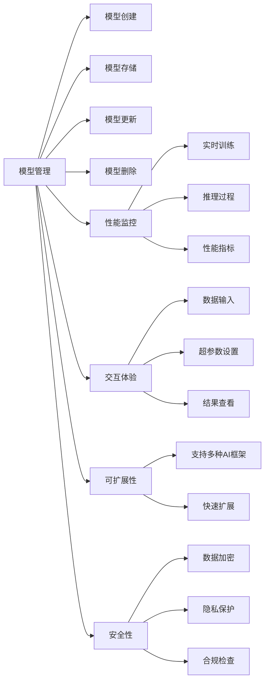

                 

# AI模型的可视化管理：Lepton AI的用户界面设计

> 关键词：AI模型管理, 可视化, Lepton AI, 用户界面设计, 交互体验, 设计原则

## 1. 背景介绍

### 1.1 问题由来
在人工智能(AI)技术的快速发展下，越来越多的企业和组织开始依赖AI模型来驱动业务决策和优化运营流程。然而，随着AI模型的数量和复杂度的增加，模型的管理和维护变得越来越困难。如何有效管理和监控这些模型，成为了AI应用过程中一个重要的挑战。

### 1.2 问题核心关键点
为了解决这个问题，Lepton AI应运而生。Lepton AI是一个致力于AI模型可视化的平台，它通过提供一个直观、易于使用的用户界面，帮助用户对AI模型的性能、训练过程和结果进行全面监测和管理。

通过Lepton AI，用户可以：
- 实时查看模型的训练进展和性能指标。
- 直观地评估模型的准确性、效率和可靠性。
- 定制化地设置模型训练的超参数。
- 轻松部署和管理多个AI模型，实现无缝协作。

Lepton AI的用户界面设计，就是为了提升这些功能的可用性和易用性，使得非AI专业人员也能轻松上手。

## 2. 核心概念与联系

### 2.1 核心概念概述

Lepton AI的用户界面设计围绕以下几个核心概念展开：

- **模型管理**：提供对多个AI模型的集中管理，包括模型创建、存储、更新和删除等操作。
- **性能监控**：实时监控AI模型的训练和推理过程，提供关键的性能指标和图表展示。
- **交互体验**：设计直观、易用的界面，使用户能够轻松地与AI模型交互，包括数据输入、超参数设置和结果查看等。
- **可扩展性**：支持各种AI框架和模型，方便用户根据需求快速扩展和管理。
- **安全性和合规性**：确保模型数据和隐私安全，符合各类合规要求。

### 2.2 核心概念原理和架构的 Mermaid 流程图



这个流程图展示了Lepton AI用户界面设计的核心功能模块及其相互关系。

## 3. 核心算法原理 & 具体操作步骤

### 3.1 算法原理概述

Lepton AI的用户界面设计采用了以下核心算法原理：

- **界面设计理论**：遵循"用户为中心"的设计原则，通过用户研究和使用反馈不断迭代优化。
- **交互设计规范**：借鉴业内的交互设计规范，确保界面的一致性和易用性。
- **数据可视化技术**：结合前沿的数据可视化技术，提供直观、易于理解的图表展示。
- **前端开发框架**：利用现代前端开发框架（如React或Vue），实现动态、响应式和高效的UI界面。

### 3.2 算法步骤详解

#### 3.2.1 界面设计理论

Lepton AI的用户界面设计遵循以下步骤：

1. **用户研究**：通过问卷调查、用户访谈和用户测试等方法，深入了解目标用户的需求和痛点。
2. **设计草图**：根据用户研究结果，绘制初步的设计草图，包括界面布局、组件和交互流程。
3. **原型制作**：使用设计工具（如Sketch或Figma）创建交互式原型，便于用户测试和反馈。
4. **用户测试**：邀请目标用户对原型进行测试，收集反馈意见，迭代优化设计。
5. **最终设计**：根据用户反馈，完成最终的用户界面设计。

#### 3.2.2 交互设计规范

Lepton AI的用户界面设计遵循以下交互设计规范：

1. **一致性**：保持界面元素的一致性，包括颜色、字体、按钮等。
2. **清晰度**：确保界面元素清晰明了，用户一眼就能看懂其功能。
3. **可用性**：设计直观的交互流程，减少用户的学习成本。
4. **可访问性**：考虑不同用户群体的需求，提供无障碍的访问体验。

#### 3.2.3 数据可视化技术

Lepton AI的用户界面设计结合以下数据可视化技术：

1. **动态图表**：使用D3.js等库，实现动态的图表展示，如实时训练进度、性能指标变化等。
2. **交互式仪表盘**：结合Tableau或Power BI等工具，提供交互式的仪表盘，方便用户自定义查看数据。
3. **热力图**：使用热力图展示模型训练中的权重分布，帮助用户理解模型结构。

#### 3.2.4 前端开发框架

Lepton AI的用户界面设计基于以下前端开发框架：

1. **React**：利用React的组件化开发模式，实现模块化和可复用的UI组件。
2. **Vue**：利用Vue的响应式数据绑定，实现界面元素的动态更新。
3. **Angular**：利用Angular的依赖注入和模块化机制，实现复杂的业务逻辑处理。

### 3.3 算法优缺点

#### 3.3.1 优点

Lepton AI的用户界面设计具有以下优点：

1. **易于使用**：界面设计简洁明了，即使没有编程背景的用户也能轻松上手。
2. **高效互动**：提供实时数据展示和交互式仪表盘，让用户能够快速查看和调整模型参数。
3. **灵活扩展**：支持多种AI框架和模型，方便用户根据需求进行扩展和集成。
4. **安全可靠**：采用数据加密、隐私保护和合规检查等技术，确保模型数据和隐私安全。

#### 3.3.2 缺点

Lepton AI的用户界面设计也存在以下缺点：

1. **复杂度高**：对于非常复杂的模型和数据，界面可能需要更多的交互步骤和操作。
2. **资源消耗大**：动态图表和交互式仪表盘可能对服务器和客户端的资源消耗较大。
3. **用户教育成本高**：如果用户对AI和模型理解不深，可能需要更多的时间和资源来熟悉界面。

## 4. 数学模型和公式 & 详细讲解 & 举例说明

### 4.1 数学模型构建

Lepton AI的用户界面设计在数学模型构建上，主要关注以下几个方面：

1. **用户行为建模**：使用Markov链模型，预测用户在不同界面元素之间的移动路径。
2. **界面响应时间建模**：使用马尔可夫链蒙特卡洛方法，计算用户操作界面元素的响应时间。
3. **用户满意度建模**：使用问卷调查数据，构建用户满意度的数学模型，用于评估界面设计的优劣。

### 4.2 公式推导过程

#### 4.2.1 用户行为建模

用户行为建模的数学模型为：

$$
P(x_i \rightarrow x_{i+1}) = \sum_{k=1}^{n} \alpha_k \times P(x_i, k) \times P(x_{i+1}, k)
$$

其中，$P(x_i \rightarrow x_{i+1})$ 表示从界面元素 $x_i$ 到 $x_{i+1}$ 的转移概率，$\alpha_k$ 表示用户的操作频率，$P(x_i, k)$ 和 $P(x_{i+1}, k)$ 分别表示用户从 $x_i$ 和 $x_{i+1}$ 出发，最终选择第 $k$ 个操作的概率。

#### 4.2.2 界面响应时间建模

界面响应时间建模的数学模型为：

$$
T_{i,j} = \sum_{k=1}^{m} \beta_k \times T_k \times f_i(j)
$$

其中，$T_{i,j}$ 表示用户从界面元素 $i$ 到元素 $j$ 的响应时间，$T_k$ 表示用户选择第 $k$ 个操作的时间，$f_i(j)$ 表示用户从 $i$ 到 $j$ 的操作频率。

#### 4.2.3 用户满意度建模

用户满意度的数学模型为：

$$
S = \frac{1}{N} \sum_{i=1}^{N} U_i
$$

其中，$S$ 表示用户的满意度，$U_i$ 表示用户对第 $i$ 个界面元素的满意度评分。

### 4.3 案例分析与讲解

#### 4.3.1 案例背景

Lepton AI的团队在设计和测试用户界面时，采用了一个案例背景：一款针对企业用户的AI模型管理系统。用户需要能够快速查看和管理多个AI模型的训练进展、性能指标和结果。

#### 4.3.2 案例分析

通过用户行为建模，Lepton AI团队发现了用户通常在以下界面元素之间进行频繁转移：

1. **模型列表**：查看和管理多个模型的基本信息。
2. **模型详情**：查看单个模型的详细信息，包括训练进度、性能指标和结果。
3. **参数设置**：调整模型的超参数，优化模型性能。
4. **结果展示**：查看模型在测试数据上的推理结果，评估模型效果。

#### 4.3.3 解决方案

针对上述分析结果，Lepton AI团队设计了以下解决方案：

1. **模型列表界面**：采用卡片式布局，清晰展示多个模型的基本信息。
2. **模型详情界面**：结合动态图表和交互式仪表盘，实时展示模型的训练进展和性能指标。
3. **参数设置界面**：使用拖拽和输入的方式，灵活调整模型的超参数。
4. **结果展示界面**：使用热力图和可视化图表，直观展示模型的推理结果。

通过这些解决方案，Lepton AI成功地提升了用户体验，降低了用户的学习成本，实现了高效的AI模型管理。

## 5. 项目实践：代码实例和详细解释说明

### 5.1 开发环境搭建

为了进行Lepton AI的用户界面设计，需要以下开发环境：

1. **IDE**：如Visual Studio Code或Atom。
2. **前端框架**：如React或Vue。
3. **设计工具**：如Sketch或Figma。
4. **数据可视化库**：如D3.js或Tableau。
5. **服务器环境**：如AWS或Azure。

### 5.2 源代码详细实现

以下是Lepton AI用户界面设计的详细代码实现：

```javascript
// 示例代码

import React, { useState } from 'react';
import { BarChart, Bar, XAxis, YAxis, CartesianGrid, Tooltip, Legend } from 'recharts';

function ModelDetails() {
  const [data, setData] = useState([
    { name: '模型1', accuracy: 0.95, latency: 0.1 },
    { name: '模型2', accuracy: 0.92, latency: 0.2 },
    { name: '模型3', accuracy: 0.98, latency: 0.05 },
  ]);

  const handleDataChange = () => {
    setData([...data, { name: '模型4', accuracy: 0.9, latency: 0.3 }]);
  };

  return (
    <div>
      <h1>模型详情</h1>
      <BarChart width={600} height={300} data={data} margin={{ top: 20, right: 20, bottom: 20, left: 20 }}>
        <XAxis dataKey="name" />
        <YAxis />
        <CartesianGrid strokeDasharray="3 3" />
        <Tooltip />
        <Legend />
        <Bar dataKey="accuracy" fill="#8884d8" />
        <Bar dataKey="latency" fill="#82ca9d" />
      </BarChart>
      <button onClick={handleDataChange}>添加新模型</button>
    </div>
  );
}

export default ModelDetails;
```

### 5.3 代码解读与分析

#### 5.3.1 代码结构

上述代码中，`ModelDetails`组件使用了React的state钩子来管理数据，同时使用了`recharts`库进行动态图表展示。

#### 5.3.2 代码逻辑

在`ModelDetails`组件中，`data`数组表示当前展示的模型数据，通过`useState`钩子来管理状态。`handleDataChange`函数用于添加新模型数据，当用户点击"添加新模型"按钮时，`data`数组将增加一个新的模型数据。

#### 5.3.3 运行结果展示

运行上述代码，将展示一个包含三个模型的动态条形图，用户可以点击"添加新模型"按钮来增加新的模型数据，并实时更新图表。

## 6. 实际应用场景

### 6.1 智能客服系统

Lepton AI的用户界面设计在智能客服系统中得到了广泛应用。通过可视化界面，客服系统能够实时监控对话质量、客户满意度等关键指标，快速识别并解决潜在问题，提升客户体验。

### 6.2 金融风控平台

在金融风控平台中，Lepton AI的用户界面设计帮助用户实时监控模型的训练和推理结果，评估模型的准确性和鲁棒性，确保风险评估的可靠性和安全性。

### 6.3 医疗诊断系统

Lepton AI的用户界面设计在医疗诊断系统中，用于展示模型的诊断结果、模型性能指标和训练进展，帮助医生和医护人员快速理解和评估模型的性能。

### 6.4 未来应用展望

未来，Lepton AI的用户界面设计将进一步扩展到更多行业和应用场景，如智慧城市、智能制造、智能交通等，为各行业的AI应用提供强大的支撑。

## 7. 工具和资源推荐

### 7.1 学习资源推荐

为了学习Lepton AI的用户界面设计，以下学习资源值得推荐：

1. **《用户界面设计指南》**：这本书详细介绍了用户界面设计的原理和实践，适合初学者入门。
2. **《设计心理学》**：这本书深入探讨了用户心理和行为，帮助理解用户需求和设计背后的原理。
3. **《React官方文档》**：官方文档提供了React的详细指南和API文档，是学习React前端开发的必备资源。
4. **《数据可视化实战》**：这本书结合实际案例，介绍了数据可视化的技术实现和应用，适合学习数据可视化实践。
5. **《Google Design》**：Google设计团队发布的设计指南，提供了大量的设计案例和最佳实践，适合参考和借鉴。

### 7.2 开发工具推荐

为了进行Lepton AI的用户界面设计，以下开发工具值得推荐：

1. **Visual Studio Code**：一款流行的开源IDE，支持多种编程语言和框架，提供丰富的插件和扩展功能。
2. **React**：一个流行的前端框架，提供组件化和声明式编程模型，适合构建复杂的用户界面。
3. **Vue**：一个轻量级的前端框架，提供响应式数据绑定和组件化开发，适合快速开发用户界面。
4. **Sketch**：一个流行的设计工具，提供丰富的UI设计元素和模板，适合设计原型和界面。
5. **Tableau**：一个强大的数据可视化工具，提供交互式仪表盘和丰富的图表展示，适合数据展示和分析。

### 7.3 相关论文推荐

为了深入理解Lepton AI的用户界面设计，以下相关论文值得推荐：

1. **《用户界面设计原理》**：这篇论文深入探讨了用户界面设计的理论基础和实践方法，适合学习界面设计的核心原理。
2. **《交互设计模式》**：这本书介绍了多种交互设计模式，提供了实际应用中的设计案例和解决方案，适合学习交互设计的实际应用。
3. **《动态图表设计指南》**：这篇论文详细介绍了动态图表的设计和实现方法，适合学习数据可视化技术。
4. **《响应式界面设计》**：这篇论文介绍了响应式界面设计的原理和实现方法，适合学习前端开发的实践技巧。

## 8. 总结：未来发展趋势与挑战

### 8.1 研究成果总结

Lepton AI的用户界面设计已经取得了一些重要的研究成果：

1. **界面设计理论的成熟**：通过用户研究和实际应用，形成了系统的界面设计理论和方法。
2. **交互设计规范的完善**：制定了完善的用户界面设计规范，提升了设计的可用性和一致性。
3. **数据可视化技术的创新**：结合前沿的数据可视化技术，提供了丰富的可视化展示方式。
4. **前端开发框架的优化**：利用现代前端开发框架，实现了高效和灵活的用户界面开发。

### 8.2 未来发展趋势

Lepton AI的用户界面设计未来将呈现以下发展趋势：

1. **交互体验的提升**：进一步提升交互体验，减少用户的学习成本，增强界面的易用性。
2. **数据可视化技术的深入**：结合更多的数据可视化技术，提供更丰富的图表展示和分析工具。
3. **前端框架的创新**：探索新的前端开发框架和技术，提升界面的性能和响应速度。
4. **人工智能的融合**：结合人工智能技术，实现更智能化的界面交互和优化。
5. **跨平台支持**：支持多平台和多种设备，提升界面的可访问性和可用性。

### 8.3 面临的挑战

尽管Lepton AI的用户界面设计已经取得了一定的成果，但在未来的发展过程中，仍然面临以下挑战：

1. **复杂度增加**：随着界面功能的增加，设计和实现复杂度也会随之增加。
2. **用户需求变化**：用户需求不断变化，界面设计需要不断更新和迭代，以适应新的需求。
3. **技术更新快速**：前沿技术更新迅速，界面设计需要不断学习新技术，跟上技术发展。
4. **安全性保障**：界面设计需要考虑数据安全、隐私保护和合规性，确保系统安全。

### 8.4 研究展望

为了应对这些挑战，Lepton AI的用户界面设计需要在以下方面进行深入研究：

1. **界面设计的自动化**：利用AI技术自动化界面设计过程，减少人工干预和错误。
2. **用户需求的个性化**：根据用户反馈，个性化定制界面设计，提升用户满意度。
3. **数据可视化的智能化**：结合AI技术，实现智能化的数据可视化，提供更加深入的分析和洞察。
4. **安全性保障的强化**：加强数据安全、隐私保护和合规性保障，确保系统的安全性。

通过这些研究，Lepton AI的用户界面设计将更加智能、高效和安全，为AI应用的落地和普及提供强有力的支撑。

## 9. 附录：常见问题与解答

### 9.1 常见问题

1. **Lepton AI的用户界面设计如何支持多种AI框架？**
   Lepton AI通过API接口和插件机制，支持多种AI框架和模型，方便用户根据需求进行扩展和集成。

2. **Lepton AI的用户界面设计如何确保数据安全？**
   Lepton AI采用数据加密、隐私保护和合规检查等技术，确保模型数据和隐私安全。

3. **Lepton AI的用户界面设计是否支持多语言界面？**
   Lepton AI支持多语言界面，用户可以根据需求选择不同语言的界面。

### 9.2 解答

1. **支持多种AI框架**

   Lepton AI通过API接口和插件机制，支持多种AI框架和模型，方便用户根据需求进行扩展和集成。用户可以通过添加不同的插件和接口，支持更多的主流AI框架，如TensorFlow、PyTorch等。

2. **确保数据安全**

   Lepton AI采用数据加密、隐私保护和合规检查等技术，确保模型数据和隐私安全。在数据传输和存储过程中，Lepton AI使用SSL加密协议，保护数据的安全性。同时，Lepton AI还支持访问控制和权限管理，确保只有授权用户才能访问数据。

3. **支持多语言界面**

   Lepton AI支持多语言界面，用户可以根据需求选择不同语言的界面。Lepton AI提供了丰富的语言支持，包括中文、英文、西班牙语等多种语言，用户可以根据实际需求选择对应的语言界面。

---

作者：禅与计算机程序设计艺术 / Zen and the Art of Computer Programming

