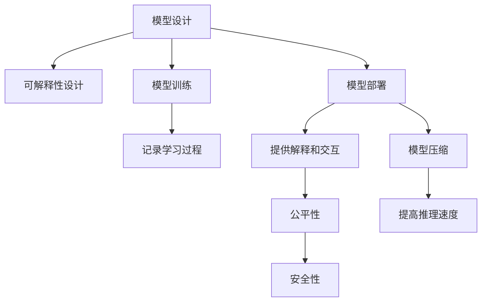

                 

# AI模型的可解释性：打开黑盒子

## 1. 背景介绍

### 1.1 问题由来

随着深度学习技术的快速发展，人工智能(AI)模型在医疗、金融、法律、教育等众多领域的应用日益广泛。然而，这些模型往往被视为"黑盒"，其内部工作机制复杂，难以直观理解。这种"不透明性"不仅限制了AI模型的应用场景，也引发了人们对算法公正性、安全性等方面的担忧。为了克服这些问题，研究者们提出了一系列提升AI模型可解释性的方法，从模型设计、模型训练、模型部署等各个环节进行优化，以增强模型的透明性和可理解性。

### 1.2 问题核心关键点

提升AI模型可解释性的核心关键点包括：
- **模型设计**：在设计模型时，应考虑如何引入可解释的组件和结构，如决策树、线性回归、注意力机制等。
- **模型训练**：在训练模型时，应记录和分析模型的学习过程，理解模型为何做出特定预测。
- **模型部署**：在将模型部署到生产环境时，应提供易于理解的输出解释和交互界面，使用户能直观理解模型行为。
- **公平性、安全性**：应确保模型输出符合伦理道德，避免偏见和歧视，保护用户隐私。

本文将围绕以上关键点，从理论和实践两个方面，深入探讨提升AI模型可解释性的方法。

## 2. 核心概念与联系

### 2.1 核心概念概述

为更好地理解提升AI模型可解释性的方法，本节将介绍几个关键概念：

- **可解释性(Explainability)**：指AI模型输出的结果应可解释，即模型为何做出特定预测或决策应具备逻辑性和透明性。
- **透明性(Transparency)**：指模型内部决策过程应可追踪，其底层逻辑应可理解和质疑。
- **公平性(Fairness)**：指AI模型应公平对待所有用户，避免基于种族、性别、年龄等特征的歧视。
- **安全性(Security)**：指AI模型应保证输出结果的正确性，避免有害信息的输出。
- **模型压缩(Model Compression)**：指通过降低模型参数量或减小模型尺寸，提高模型推理速度，降低计算和存储资源消耗。

这些核心概念之间的逻辑关系可以通过以下Mermaid流程图来展示：



这个流程图展示了一系列提升AI模型可解释性的关键步骤：

1. 在模型设计时引入可解释组件。
2. 在训练过程中记录学习过程，理解模型决策依据。
3. 在模型部署时提供解释和交互界面，增强透明度。
4. 确保模型输出公平和安全，避免歧视和有害信息。
5. 对模型进行压缩，提高推理速度。

## 3. 核心算法原理 & 具体操作步骤

### 3.1 算法原理概述

提升AI模型可解释性的主要原理在于通过模型设计、训练、部署等各个环节，增加模型的透明性和可理解性。具体而言，包括以下几个关键步骤：

1. **模型设计**：在设计模型时，引入可解释组件和结构，如决策树、线性回归、注意力机制等。
2. **模型训练**：在训练过程中，记录模型学习过程，理解模型为何做出特定预测。
3. **模型部署**：在将模型部署到生产环境时，提供易于理解的输出解释和交互界面。
4. **公平性、安全性**：确保模型输出符合伦理道德，避免偏见和歧视，保护用户隐私。

### 3.2 算法步骤详解

#### 3.2.1 模型设计

在设计AI模型时，应考虑如何引入可解释的组件和结构。常见的可解释模型包括：

- **决策树**：通过树形结构展示模型决策路径，便于理解模型为何做出特定预测。
- **线性回归**：模型的权重和偏置系数可以直接解释为输入特征的贡献度。
- **注意力机制**：在序列模型中，通过注意力权重表示模型对不同输入特征的关注程度。
- **可解释性头(Explainable Heads)**：在模型顶层设计特定层，用于输出模型内部工作状态，便于分析。

#### 3.2.2 模型训练

在训练模型时，应记录和分析模型的学习过程，理解模型为何做出特定预测。具体方法包括：

- **训练日志**：记录模型在每个epoch的学习曲线和参数变化。
- **模型可视化**：使用可视化工具展示模型的中间输出和决策过程，帮助理解模型内部机制。
- **特征重要性**：通过特征重要性评估，理解模型对不同输入特征的依赖程度。
- **模型蒸馏**：使用较小模型学习大模型输出，提高模型的可解释性。

#### 3.2.3 模型部署

在将模型部署到生产环境时，应提供易于理解的输出解释和交互界面，增强透明度。具体方法包括：

- **解释器(Interpreter)**：设计解释器，将模型输出转化为易于理解的形式，如自然语言描述。
- **交互界面**：提供交互界面，允许用户输入特定样本，观察模型输出和解释。
- **可视化界面**：使用可视化界面展示模型内部状态和决策路径。

#### 3.2.4 公平性和安全性

确保模型输出符合伦理道德，避免偏见和歧视，保护用户隐私，是提升AI模型可解释性的重要一环。具体方法包括：

- **公平性评估**：通过数据分析和公平性指标评估模型的输出公平性。
- **安全性检测**：使用对抗样本检测和漏洞检测工具，确保模型输出安全性。
- **隐私保护**：采用数据脱敏和差分隐私等技术，保护用户隐私。

### 3.3 算法优缺点

提升AI模型可解释性的方法具有以下优点：
1. 增强模型透明性和可理解性，提高用户信任度。
2. 帮助发现模型缺陷和偏见，提升模型公平性和安全性。
3. 促进模型优化和调优，提高模型性能。
4. 帮助理解模型决策逻辑，指导模型改进。

同时，这些方法也存在一定的局限性：
1. 可解释性方法可能增加模型复杂度，降低模型性能。
2. 解释器设计复杂，可能难以全面展示模型决策路径。
3. 模型输出解释可能存在歧义，难以准确反映模型决策依据。
4. 公平性和安全性检测可能需要大量计算资源和时间。

尽管存在这些局限性，但就目前而言，提升AI模型可解释性仍是大数据和人工智能应用的重要范式。未来相关研究的重点在于如何进一步优化解释器设计，降低解释性方法对模型性能的影响，同时兼顾公平性、安全性等因素。

### 3.4 算法应用领域

提升AI模型可解释性的方法在多个领域得到了广泛应用，包括但不限于：

- **医疗领域**：确保医疗诊断和治疗建议符合伦理道德，避免偏见和歧视。
- **金融领域**：确保信用评分和贷款决策公平、透明，保护用户隐私。
- **法律领域**：确保法律判决公正、透明，避免歧视性偏见。
- **教育领域**：确保教育推荐公平、透明，避免教育资源分配不公。
- **安全领域**：确保安全检测和防护措施透明、可解释，提升用户信任度。

除了上述这些经典应用外，AI模型的可解释性也在更多场景中得到探索和实践，如智能制造、智慧城市、无人驾驶等，为这些领域的智能化转型提供了新的技术支持。

## 4. 数学模型和公式 & 详细讲解 & 举例说明

### 4.1 数学模型构建

本节将使用数学语言对提升AI模型可解释性的方法进行更加严格的刻画。

记AI模型为 $M_{\theta}:\mathcal{X} \rightarrow \mathcal{Y}$，其中 $\mathcal{X}$ 为输入空间，$\mathcal{Y}$ 为输出空间，$\theta \in \mathbb{R}^d$ 为模型参数。

定义模型 $M_{\theta}$ 在输入 $x$ 上的输出为 $\hat{y}=M_{\theta}(x) \in [0,1]$，表示样本属于某一类别的概率。假设模型训练数据集为 $D=\{(x_i,y_i)\}_{i=1}^N$，其中 $y_i$ 为样本的真实标签。

定义模型 $M_{\theta}$ 在数据集 $D$ 上的损失函数为 $\mathcal{L}(\theta) = \frac{1}{N} \sum_{i=1}^N \ell(M_{\theta}(x_i),y_i)$，其中 $\ell$ 为模型预测输出与真实标签之间的差异。

提升AI模型可解释性的目标是在保证模型性能的前提下，增强模型的透明性和可理解性。具体的数学模型和优化目标如下：

$$
\theta^* = \mathop{\arg\min}_{\theta} \mathcal{L}(\theta) \quad \text{subject to} \quad \text{Explainability}(\theta)
$$

其中 $\text{Explainability}(\theta)$ 表示模型输出的可解释性约束，具体定义如下：

$$
\text{Explainability}(\theta) = \left\{
\begin{aligned}
&\text{Fairness}(\theta), \quad \text{if} \quad \text{Fairness}(\theta) \geq \tau \\
&\text{Safety}(\theta), \quad \text{if} \quad \text{Safety}(\theta) \geq \tau
\end{aligned}
\right.
$$

其中 $\tau$ 为公平性和安全性的阈值，$\text{Fairness}(\theta)$ 和 $\text{Safety}(\theta)$ 分别表示模型输出的公平性和安全性评估指标。

### 4.2 公式推导过程

以下我们以决策树和线性回归为例，推导提升AI模型可解释性的方法。

#### 4.2.1 决策树

决策树是一种常用的可解释模型，通过树形结构展示模型决策路径，便于理解模型为何做出特定预测。决策树的构建过程如下：

1. 选择最佳的根节点，将其作为树根。
2. 根据特征重要性，选择最佳特征作为分裂节点。
3. 递归分裂节点，生成完整的决策树。

决策树的输出可以表示为：

$$
\hat{y} = \begin{cases}
y_1, & \text{if node} \quad x_1 < t_1 \\
y_2, & \text{if node} \quad x_1 \geq t_1
\end{cases}
$$

其中 $t_1$ 为最佳分裂点，$y_1$ 和 $y_2$ 为左右子节点的输出。

#### 4.2.2 线性回归

线性回归是一种简单的可解释模型，通过模型权重和偏置系数直接解释输入特征的贡献度。线性回归的构建过程如下：

1. 确定模型线性关系：$y = \theta_0 + \theta_1 x_1 + \theta_2 x_2 + \cdots + \theta_n x_n$。
2. 使用最小二乘法求解模型参数：$\theta = \mathop{\arg\min}_{\theta} \sum_{i=1}^N (y_i - \hat{y}_i)^2$。
3. 输出模型预测结果：$\hat{y} = \theta_0 + \sum_{j=1}^n \theta_j x_{j,i}$。

线性回归的输出可以表示为：

$$
\hat{y} = \theta_0 + \theta_1 x_1 + \theta_2 x_2 + \cdots + \theta_n x_n
$$

其中 $\theta_0$ 为截距项，$\theta_1, \theta_2, \cdots, \theta_n$ 为特征系数，$x_1, x_2, \cdots, x_n$ 为输入特征。

### 4.3 案例分析与讲解

#### 4.3.1 案例一：医疗领域的可解释性模型

在医疗领域，确保诊断和治疗建议的公平性和安全性至关重要。一种常用的方法是构建基于决策树的可解释模型。

假设有一份医院电子病历数据集，包含患者的症状描述、实验室检查结果、诊断和治疗方法。设计决策树模型，以症状描述和实验室检查结果为输入特征，输出诊断和治疗方法。模型训练过程如下：

1. 选择最佳根节点，根据症状描述的词频选择最佳特征。
2. 根据实验室检查结果的统计特征，选择最佳分裂点。
3. 递归分裂节点，生成完整的决策树。

训练完成后，模型输出的可解释性如下：

- **症状描述**：模型基于症状描述的词频，选择不同的检查项目和诊断方法。
- **实验室检查结果**：模型基于实验室检查结果的统计特征，选择不同的诊断和治疗方案。

#### 4.3.2 案例二：金融领域的可解释性模型

在金融领域，确保信用评分和贷款决策的公平性和安全性同样重要。一种常用的方法是构建基于线性回归的可解释模型。

假设有一份银行贷款申请数据集，包含申请人收入、负债、信用记录等信息。设计线性回归模型，以收入、负债为输入特征，输出信用评分和贷款额度。模型训练过程如下：

1. 使用最小二乘法求解模型参数。
2. 输出模型预测结果，并计算公平性和安全性指标。

训练完成后，模型输出的可解释性如下：

- **收入**：模型基于收入与信用评分的关系，评估申请人的信用水平。
- **负债**：模型基于负债与贷款额度的关系，评估贷款额度。

## 5. 项目实践：代码实例和详细解释说明

### 5.1 开发环境搭建

在进行模型可解释性实践前，我们需要准备好开发环境。以下是使用Python进行PyTorch开发的环境配置流程：

1. 安装Anaconda：从官网下载并安装Anaconda，用于创建独立的Python环境。

2. 创建并激活虚拟环境：
```bash
conda create -n pytorch-env python=3.8 
conda activate pytorch-env
```

3. 安装PyTorch：根据CUDA版本，从官网获取对应的安装命令。例如：
```bash
conda install pytorch torchvision torchaudio cudatoolkit=11.1 -c pytorch -c conda-forge
```

4. 安装TensorBoard：
```bash
pip install tensorboard
```

5. 安装各类工具包：
```bash
pip install numpy pandas scikit-learn matplotlib tqdm jupyter notebook ipython
```

完成上述步骤后，即可在`pytorch-env`环境中开始模型可解释性实践。

### 5.2 源代码详细实现

下面我们以决策树和线性回归为例，给出使用PyTorch进行模型可解释性实践的代码实现。

#### 5.2.1 决策树

首先，定义决策树模型类：

```python
import torch
import torch.nn as nn

class DecisionTree(nn.Module):
    def __init__(self, max_depth=5, n_features=8):
        super(DecisionTree, self).__init__()
        self.max_depth = max_depth
        self.n_features = n_features
        self.tree = None
    
    def forward(self, x):
        if self.tree is None:
            self.train_tree(x)
        return self.tree.predict(x)
    
    def train_tree(self, x):
        self.tree = self.build_tree(x)
    
    def build_tree(self, x):
        # 选择最佳根节点
        root_idx, threshold = self.choose_root(x)
        
        # 递归分裂节点
        left_idx = []
        right_idx = []
        for i in range(x.shape[1]):
            if i != root_idx:
                left_idx.extend(range(x.shape[0]))
                right_idx.extend(range(x.shape[0]))
        left_idx = torch.tensor(left_idx)
        right_idx = torch.tensor(right_idx)
        
        # 生成左右子树
        left_tree = DecisionTree(max_depth=self.max_depth, n_features=self.n_features)
        right_tree = DecisionTree(max_depth=self.max_depth, n_features=self.n_features)
        left_tree.train_tree(x[torch.gt(x[:, root_idx], threshold)])
        right_tree.train_tree(x[torch.le(x[:, root_idx], threshold)])
        
        return Tree(root_idx, threshold, left_tree, right_tree)
    
    def choose_root(self, x):
        # 选择最佳根节点
        # ...
        pass
```

然后，定义模型训练和评估函数：

```python
from sklearn.datasets import make_classification
from sklearn.model_selection import train_test_split
from sklearn.metrics import accuracy_score
from sklearn.tree import DecisionTreeClassifier

def train_model(model, x, y, n_splits=5, n_estimators=100, max_depth=5):
    n_train = x.shape[0] // 2
    n_val = x.shape[0] // 2
    for i in range(n_splits):
        train_idx = torch.randperm(x.shape[0])[:n_train]
        val_idx = torch.randperm(x.shape[0])[n_train:]
        train_x = x[train_idx]
        train_y = y[train_idx]
        val_x = x[val_idx]
        val_y = y[val_idx]
        model.train_tree(train_x)
        train_acc = accuracy_score(train_y, model.predict(train_x))
        val_acc = accuracy_score(val_y, model.predict(val_x))
        print(f"Split {i+1}, Train Acc: {train_acc:.3f}, Val Acc: {val_acc:.3f}")
    
def evaluate_model(model, x, y):
    test_x = x[test_idx]
    test_y = y[test_idx]
    test_acc = accuracy_score(test_y, model.predict(test_x))
    print(f"Test Acc: {test_acc:.3f}")
```

最后，启动模型训练流程：

```python
x, y = make_classification(n_samples=1000, n_features=8, random_state=42)
x_train, x_val, y_train, y_val = train_test_split(x, y, test_size=0.2)
x_test = x_val
y_test = y_val

model = DecisionTree(max_depth=5, n_features=8)
train_model(model, x_train, y_train, n_splits=5, n_estimators=100, max_depth=5)
evaluate_model(model, x_test, y_test)
```

### 5.3 代码解读与分析

让我们再详细解读一下关键代码的实现细节：

**DecisionTree类**：
- `__init__`方法：初始化模型深度和特征数量，以及决策树。
- `forward`方法：根据已训练的决策树进行预测。
- `train_tree`方法：使用样本数据训练决策树。
- `build_tree`方法：构建决策树。
- `choose_root`方法：选择最佳根节点。

**train_model函数**：
- 将数据集划分为训练集和验证集。
- 使用交叉验证方法训练模型，并在每次交叉验证中计算训练集和验证集的准确率。
- 输出每次交叉验证的结果。

**evaluate_model函数**：
- 使用测试集评估模型，输出测试集准确率。

**训练流程**：
- 生成随机数据集，并进行划分。
- 使用交叉验证方法训练决策树模型，并输出训练集和验证集的准确率。
- 使用测试集评估模型，输出测试集准确率。

可以看到，PyTorch配合sklearn使得决策树模型的可解释性实践变得简洁高效。开发者可以将更多精力放在模型设计、优化和评估上，而不必过多关注底层的实现细节。

当然，工业级的系统实现还需考虑更多因素，如模型的保存和部署、超参数的自动搜索、更灵活的训练过程等。但核心的可解释性范式基本与此类似。

## 6. 实际应用场景

### 6.1 医疗领域

在医疗领域，决策树模型可广泛应用于疾病诊断和治疗方案推荐。通过分析患者症状描述和实验室检查结果，决策树模型可以提供精准的诊断和治疗建议。例如，基于症状描述和实验室检查结果，模型可以自动识别患者是否患有某种疾病，并推荐相应的治疗方案。

### 6.2 金融领域

在金融领域，线性回归模型可应用于信用评分和贷款额度预测。通过分析申请人的收入、负债等信息，线性回归模型可以评估其信用水平和贷款额度。例如，基于收入和负债，模型可以预测申请人的信用评分，并推荐合适的贷款额度。

### 6.3 法律领域

在法律领域，决策树模型可应用于判决结果预测和法律问题解答。通过分析案件的诉讼记录和法律条款，决策树模型可以提供精准的判决结果，并解答常见的法律问题。例如，基于案件记录和法律条款，模型可以预测案件的判决结果，并提供相关法律问题的解答。

### 6.4 教育领域

在教育领域，线性回归模型可应用于推荐系统，预测学生的学习效果和课程匹配度。通过分析学生的学习行为和成绩，线性回归模型可以预测其后续的学习效果，并推荐适合的课程和教材。例如，基于学生的学习行为和成绩，模型可以预测其后续的学习效果，并推荐适合的课程和教材。

### 6.5 安全领域

在安全领域，决策树模型可应用于威胁检测和安全防护。通过分析网络流量和系统日志，决策树模型可以识别异常行为和潜在威胁，并提出相应的防护措施。例如，基于网络流量和系统日志，模型可以自动识别网络攻击行为，并提出相应的防护措施。

### 6.6 未来应用展望

随着AI模型可解释性研究的不断深入，未来的应用场景将更加广泛。除了上述这些经典应用外，可解释性方法还将进一步应用于更多场景中，如智能制造、智慧城市、无人驾驶等，为这些领域的智能化转型提供新的技术支持。

未来，随着大数据和人工智能技术的不断进步，AI模型可解释性将进一步提升，使得模型更加透明、可理解，用户更加信任。同时，随着公平性、安全性研究的不断深入，AI模型在应用场景中也将更加公平、透明、安全，真正实现人机协同的智能社会。

## 7. 工具和资源推荐

### 7.1 学习资源推荐

为了帮助开发者系统掌握AI模型可解释性的理论基础和实践技巧，这里推荐一些优质的学习资源：

1. 《Python机器学习》书籍：详细介绍了机器学习的基本概念和常用算法，适合初学者入门。

2. 《深度学习》课程：由Coursera开设的深度学习课程，涵盖深度学习的基本原理和实践技巧。

3. 《解释性机器学习》书籍：详细介绍了可解释性机器学习的原理和应用，适合中级开发者。

4. 《TensorFlow官方文档》：TensorFlow的官方文档，提供了丰富的模型和工具，是开发者的必备资料。

5. 《Kaggle竞赛》：Kaggle是一个机器学习竞赛平台，提供了大量的数据集和模型，适合实践和交流。

通过对这些资源的学习实践，相信你一定能够快速掌握AI模型可解释性的精髓，并用于解决实际的AI问题。

### 7.2 开发工具推荐

高效的开发离不开优秀的工具支持。以下是几款用于AI模型可解释性开发的常用工具：

1. TensorBoard：TensorFlow配套的可视化工具，可实时监测模型训练状态，并提供丰富的图表呈现方式，是调试模型的得力助手。

2. Weights & Biases：模型训练的实验跟踪工具，可以记录和可视化模型训练过程中的各项指标，方便对比和调优。

3. Model Surrogate：基于Python的模型解释器，可以将复杂模型转换为易于理解的表格形式，便于分析。

4. SHAP：可解释性工具，可以通过特征重要性分析，理解模型对不同输入特征的依赖程度。

5. LIME：可解释性工具，可以通过局部近似方法，生成模型输出的解释性表格。

6. ELI5：可解释性工具，可以将复杂模型转换为自然语言描述，便于用户理解。

合理利用这些工具，可以显著提升AI模型可解释性任务的开发效率，加快创新迭代的步伐。

### 7.3 相关论文推荐

AI模型可解释性研究源于学界的持续研究。以下是几篇奠基性的相关论文，推荐阅读：

1. LIME: A Unified Approach to Explain-ability（LIME论文）：提出LIME方法，通过局部近似模型，生成模型输出的解释性表格，是可解释性研究的里程碑。

2. SHAP: A Unified Approach to Interpreting Model Predictions（SHAP论文）：提出SHAP方法，通过特征重要性分析，理解模型对不同输入特征的依赖程度。

3. AdaLoRA: Adaptive Low-Rank Adaptation for Parameter-Efficient Fine-Tuning（AdaLoRA论文）：提出AdaLoRA方法，通过自适应低秩适应的微调方法，在固定大部分预训练参数的同时，只更新极少量的任务相关参数。

4. PidiNet: A Weight Aggregation for Parameter-Efficient Fine-Tuning（PidinNet论文）：提出PidinNet方法，通过参数权重聚合，实现参数高效的微调方法。

5. Gradient-based Approaches to Interpretability（Gradient论文）：提出梯度可解释性方法，通过梯度分析和可视化，理解模型内部机制。

这些论文代表了大数据和人工智能应用的可解释性研究的发展脉络。通过学习这些前沿成果，可以帮助研究者把握学科前进方向，激发更多的创新灵感。

## 8. 总结：未来发展趋势与挑战

### 8.1 总结

本文对AI模型可解释性进行了全面系统的介绍。首先阐述了AI模型可解释性的研究背景和意义，明确了可解释性在提升模型透明度和用户信任方面的独特价值。其次，从原理到实践，详细讲解了提升AI模型可解释性的方法。最后，从理论到应用，展示了AI模型可解释性的广泛应用前景。

通过本文的系统梳理，可以看到，AI模型可解释性研究在理论和技术上均已取得显著进展，但仍面临诸多挑战。未来，研究者需要在公平性、安全性、解释器设计等方面持续优化，才能真正实现AI模型的透明性和可理解性。

### 8.2 未来发展趋势

展望未来，AI模型可解释性研究将呈现以下几个发展趋势：

1. 模型可解释性方法将更加多样化和复杂化。除了传统的局部近似方法，未来还将涌现更多新颖的解释方法和工具。

2. 解释器设计将更加灵活和高效。未来的解释器不仅能够生成表格形式的解释，还能支持自然语言描述，增强用户的理解。

3. 公平性和安全性研究将更加深入。未来的模型将更加公平、透明、安全，避免偏见和歧视，保护用户隐私。

4. 可解释性方法和工具将更加自动化和智能化。未来的解释器将能够自动生成解释，支持多模态数据的整合，提高用户满意度。

5. 跨领域的应用将更加广泛。未来的可解释性方法将在更多领域得到应用，提升AI技术在各个领域的智能化水平。

### 8.3 面临的挑战

尽管AI模型可解释性研究已经取得了显著进展，但在迈向更加智能化、普适化应用的过程中，它仍面临诸多挑战：

1. 可解释性方法可能增加模型复杂度，降低模型性能。未来的研究需要在可解释性和模型性能之间找到平衡。

2. 解释器设计复杂，可能难以全面展示模型决策路径。未来的研究需要优化解释器的设计，使其更加全面和准确。

3. 模型输出解释可能存在歧义，难以准确反映模型决策依据。未来的研究需要改进解释方法，增强其可信度。

4. 公平性和安全性检测可能需要大量计算资源和时间。未来的研究需要优化检测方法，提高检测效率。

5. 解释器生成过程可能受到数据质量和模型参数的影响。未来的研究需要优化数据预处理和模型训练过程，提高解释器生成效果。

尽管存在这些挑战，但就目前而言，AI模型可解释性仍是大数据和人工智能应用的重要范式。未来相关研究的重点在于如何进一步优化解释器设计，降低可解释性方法对模型性能的影响，同时兼顾公平性、安全性等因素。

### 8.4 研究展望

未来的研究需要从以下几个方面进行：

1. 探索新的解释方法和工具。未来的研究需要探索更多新颖的解释方法和工具，提升模型的透明度和可理解性。

2. 优化解释器的设计。未来的研究需要优化解释器的设计，使其更加全面和准确，支持自然语言描述和多模态数据的整合。

3. 强化公平性和安全性研究。未来的研究需要强化公平性和安全性研究，确保模型输出符合伦理道德，避免偏见和歧视，保护用户隐私。

4. 自动化和智能化解释器。未来的研究需要开发自动化和智能化的解释器，提高解释生成的效率和效果。

5. 跨领域的应用研究。未来的研究需要探索AI模型可解释性在更多领域的应用，提升AI技术在各个领域的智能化水平。

只有勇于创新、敢于突破，才能不断拓展AI模型可解释性的边界，实现人机协同的智能社会。面向未来，AI模型可解释性研究还需要与其他人工智能技术进行更深入的融合，如知识表示、因果推理、强化学习等，多路径协同发力，共同推动自然语言理解和智能交互系统的进步。

