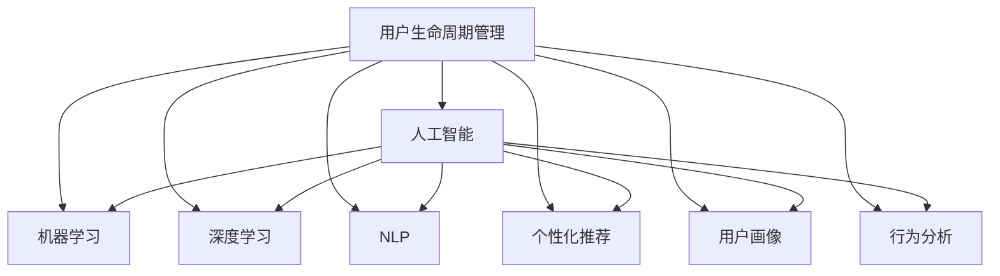
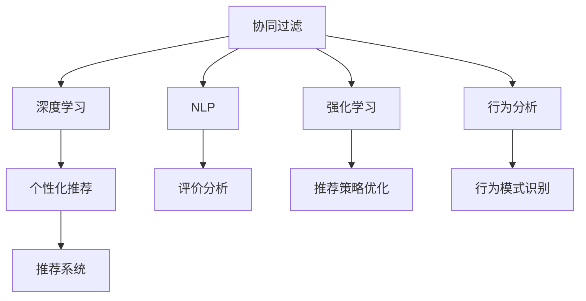

                 

# AI赋能的电商平台用户生命周期管理

## 1. 背景介绍

随着电商平台的快速发展，用户生命周期管理已成为各大电商企业的重要关注点。通过深入挖掘用户行为数据，制定个性化策略，提升用户粘性，从而实现商业价值的最大化。然而，传统的用户管理方法依赖于经验驱动和大量手动分析，效率低下，结果也难以保证。而人工智能（AI）技术的引入，为电商平台带来了全新的用户生命周期管理范式，大幅提升了数据处理效率和用户管理精度。

本文将介绍AI赋能的电商平台用户生命周期管理的相关理论和实践技术，深入分析当前存在的瓶颈，探讨未来发展方向，以期为电商平台提供科学有效的用户管理方案。

## 2. 核心概念与联系

### 2.1 核心概念概述

为更好地理解AI赋能的电商平台用户生命周期管理，本节将介绍几个关键概念：

- **用户生命周期管理（User Lifecycle Management, ULM）**：一种通过分析和优化用户行为，实现用户转化、留存和复购的策略方法。旨在最大化用户价值，提升商业收益。

- **人工智能（Artificial Intelligence, AI）**：通过算法和数据驱动，模拟人类智能过程，实现自主学习、推理、决策的技术。AI在电商领域的应用包括推荐系统、搜索排序、风险控制等。

- **机器学习（Machine Learning, ML）**：一种让机器通过数据学习规律，自动化地优化决策过程的技术。电商平台的推荐系统、价格优化、广告投放等均涉及机器学习算法。

- **深度学习（Deep Learning, DL）**：一种基于神经网络的机器学习方法，通过多层网络对数据进行复杂特征提取和模式识别。常见的深度学习应用包括图像识别、自然语言处理、语音识别等。

- **自然语言处理（Natural Language Processing, NLP）**：让机器能够理解、处理和生成人类语言的技术。在电商平台的评价分析、客户反馈、客服对话中广泛应用。

- **个性化推荐（Personalized Recommendation）**：根据用户行为数据和特征，推荐用户可能感兴趣的物品，提升用户体验和满意度。

- **用户画像（User Persona）**：通过对用户行为、兴趣、需求等信息的分析和建模，构建用户的虚拟身份，为个性化策略提供数据基础。

- **行为分析（Behavioral Analysis）**：对用户行为数据进行建模和分析，识别用户购买意图和行为模式。

这些核心概念之间的逻辑关系可以通过以下Mermaid流程图来展示：



这个流程图展示了大语言模型的核心概念及其之间的关系：

1. 用户生命周期管理通过人工智能技术，融合机器学习、深度学习、自然语言处理等技术，进行个性化推荐和用户画像构建。
2. 机器学习算法通过对用户行为数据建模，分析用户购买意图，提供个性化推荐。
3. 深度学习模型能够处理高维、非结构化数据，提升行为分析的准确性。
4. 自然语言处理技术处理用户评价、客服对话等文本数据，提供有价值的用户反馈信息。
5. 个性化推荐和用户画像在行为分析的基础上，进一步提升推荐系统的精准度和用户粘性。

这些概念共同构成了电商平台用户生命周期管理的核心技术框架，为其在个性化推荐、行为分析等方面的应用提供了数据和方法支持。

## 3. 核心算法原理 & 具体操作步骤

### 3.1 算法原理概述

AI赋能的电商平台用户生命周期管理，主要通过以下几个关键算法来实现：

- **协同过滤（Collaborative Filtering）**：利用用户行为数据进行推荐，相似用户之间进行协同学习。
- **深度学习（Deep Learning）**：通过多层神经网络，自动提取数据的高维特征，提升行为分析和推荐系统的准确性。
- **自然语言处理（NLP）**：通过文本分类、情感分析、关键词提取等技术，处理用户评价和客服对话，提取有价值的信息。
- **强化学习（Reinforcement Learning）**：通过奖惩机制，优化推荐策略，提升推荐效果。
- **行为分析（Behavioral Analysis）**：利用时序分析和关联规则挖掘等方法，分析用户行为数据，识别购买意图。

这些算法通过相互协作，形成了一个完整的用户生命周期管理框架，如图：



### 3.2 算法步骤详解

AI赋能的电商平台用户生命周期管理，主要包括以下几个关键步骤：

**Step 1: 数据准备**
- 收集用户行为数据，包括浏览、点击、购买、评价等行为记录。
- 收集用户画像数据，包括人口统计、兴趣偏好、行为特征等。
- 收集评价和客服对话数据，进行文本处理和分析。

**Step 2: 模型训练**
- 使用协同过滤算法，对用户行为数据进行建模，构建用户行为矩阵。
- 使用深度学习模型，对用户行为数据进行特征提取和模式识别，建立行为分析模型。
- 使用自然语言处理技术，对评价和客服对话数据进行文本分析和情感分析，提取用户反馈信息。
- 使用强化学习算法，优化推荐策略，提升推荐效果。

**Step 3: 推荐系统优化**
- 将协同过滤、深度学习、自然语言处理和行为分析等模型的输出融合，生成推荐结果。
- 利用强化学习算法，不断优化推荐策略，提升推荐精度和效果。
- 对推荐结果进行时序分析和关联规则挖掘，发现用户行为规律，优化推荐策略。

**Step 4: 用户行为分析**
- 对用户行为数据进行建模和分析，识别用户购买意图和行为模式。
- 利用深度学习模型，对行为数据进行特征提取和模式识别，提升分析准确性。
- 利用行为分析模型，提取用户行为特征，构建用户画像，进行个性化推荐。

**Step 5: 评价和优化**
- 对推荐结果进行评价和反馈，利用强化学习算法优化推荐策略。
- 不断收集用户行为数据和反馈信息，进行模型迭代和优化。

### 3.3 算法优缺点

AI赋能的电商平台用户生命周期管理算法，具有以下优点：

1. 精准推荐。通过深度学习、协同过滤等算法，能够精准分析用户行为数据，提供个性化的推荐结果。
2. 自动化优化。利用强化学习算法，不断优化推荐策略，提升推荐效果。
3. 实时性高。利用实时数据流处理技术，可以实时处理用户行为数据，快速响应用户需求。
4. 灵活性强。算法框架可以灵活扩展，支持多种推荐策略和数据源。

同时，该算法也存在以下局限性：

1. 数据质量要求高。数据量和质量直接决定了推荐系统的精度和效果，获取高质量数据成本较高。
2. 冷启动问题。对于新用户和新物品，缺乏足够的行为数据，推荐效果较差。
3. 计算资源消耗大。深度学习和协同过滤等算法需要大量计算资源，对硬件要求较高。
4. 模型复杂度高。算法框架复杂，需要专业知识才能进行优化和部署。
5. 隐私问题。用户数据和行为信息涉及隐私保护，需要采取严格的隐私保护措施。

### 3.4 算法应用领域

AI赋能的电商平台用户生命周期管理算法，广泛应用于以下领域：

- **个性化推荐**：根据用户行为和画像数据，推荐用户可能感兴趣的物品，提升用户体验和满意度。
- **行为分析**：分析用户行为数据，识别购买意图和行为模式，进行精准营销和广告投放。
- **风险控制**：通过异常行为检测和欺诈检测，防范恶意行为，保护用户和平台安全。
- **客户服务**：利用自然语言处理技术，处理用户评价和客服对话，提高客户服务效率和质量。
- **销售优化**：通过用户行为分析，优化商品定价和库存管理，提升销售效率和盈利能力。

## 4. 数学模型和公式 & 详细讲解 & 举例说明

### 4.1 数学模型构建

本节将使用数学语言对AI赋能的电商平台用户生命周期管理算法进行更加严格的刻画。

设用户集合为 $U$，物品集合为 $I$，用户行为数据矩阵为 $X \in \mathbb{R}^{N \times M}$，其中 $N$ 为用户数，$M$ 为物品数。用户行为矩阵 $X$ 中每个元素 $X_{ui}$ 表示用户 $u$ 对物品 $i$ 的行为数据，如点击次数、评分等。

定义协同过滤算法中的用户相似度矩阵为 $S \in \mathbb{R}^{N \times N}$，其中每个元素 $S_{uv}$ 表示用户 $u$ 和用户 $v$ 之间的相似度，利用余弦相似度等方法计算。

定义深度学习模型的行为分析模型为 $F: \mathbb{R}^{N \times M} \rightarrow \mathbb{R}^{C}$，其中 $C$ 为行为分析模型的输出维度，可以是行为类型、评分等。

定义自然语言处理技术中的文本分类模型为 $G: \mathbb{R}^{K} \rightarrow \mathbb{R}^{C'}$，其中 $K$ 为评价和客服对话的特征维度，$C'$ 为文本分类的类别数。

定义强化学习算法中的推荐策略优化模型为 $H: \mathbb{R}^{C} \rightarrow \mathbb{R}^{M}$，其中每个元素 $H_j$ 表示物品 $j$ 的推荐得分。

### 4.2 公式推导过程

以下我们以协同过滤推荐系统为例，推导协同过滤算法的核心公式。

设用户 $u$ 对物品 $i$ 的行为数据为 $X_{ui}$，利用协同过滤算法，计算用户 $u$ 对物品 $j$ 的推荐得分 $Y_{uj}$，公式如下：

$$
Y_{uj} = \sum_{k=1}^M \alpha_k \omega_{uk} \omega_{kj}
$$

其中 $\alpha_k$ 为物品 $k$ 在用户 $u$ 行为数据中的权重，$\omega_{uk}$ 为物品 $k$ 在用户 $u$ 的行为数据中的评分，$\omega_{kj}$ 为用户 $u$ 对物品 $k$ 的评分和用户 $v$ 对物品 $j$ 的评分之间的相似度权重。

根据余弦相似度的定义，$S_{uv}$ 可以表示为：

$$
S_{uv} = \frac{\sum_{k=1}^M \omega_{uk} \omega_{vk}}{\sqrt{\sum_{k=1}^M \omega_{uk}^2} \sqrt{\sum_{k=1}^M \omega_{vk}^2}}
$$

将其带入推荐得分公式，得：

$$
Y_{uj} = \sum_{k=1}^M \frac{\alpha_k}{\sqrt{\sum_{k=1}^M \omega_{uk}^2} \sqrt{\sum_{k=1}^M \omega_{vk}^2}} \omega_{uk} \omega_{vk}
$$

该公式表示用户 $u$ 对物品 $j$ 的推荐得分，为所有物品 $k$ 的加权平均，其中权重为物品 $k$ 在用户 $u$ 行为数据中的评分和用户 $u$ 和用户 $v$ 的相似度。

在得到推荐得分后，即可按照评分高低对物品进行排序，得到最终推荐列表。

### 4.3 案例分析与讲解

考虑一个电商平台的数据，如表所示：

| 用户ID | 物品ID | 评分 | 购买次数 | 浏览次数 |
|--------|--------|------|----------|----------|
| 1001   | 1      | 5    | 0        | 10       |
| 1001   | 2      | 4    | 1        | 8        |
| 1002   | 1      | 3    | 0        | 5        |
| 1002   | 3      | 2    | 0        | 3        |
| ...    | ...    | ...  | ...      | ...      |

假设有两个用户 $u=1001$ 和 $v=1002$，协同过滤算法通过计算它们的相似度 $S_{uv}=0.9$，然后利用物品 $i=1$ 在用户 $u$ 中的行为数据 $X_{ui}=5$，推荐物品 $j=2$ 给用户 $v$，推荐得分 $Y_{v2}=5.4$。

通过计算，得到用户 $v$ 对物品 $2$ 的推荐得分 $Y_{v2}=5.4$，与用户 $v$ 的实际购买评分 $5$ 相近，说明推荐算法取得了较好的效果。

## 5. 项目实践：代码实例和详细解释说明

### 5.1 开发环境搭建

在进行AI赋能的电商平台用户生命周期管理开发前，我们需要准备好开发环境。以下是使用Python进行TensorFlow开发的环境配置流程：

1. 安装Anaconda：从官网下载并安装Anaconda，用于创建独立的Python环境。

2. 创建并激活虚拟环境：
```bash
conda create -n tf-env python=3.8 
conda activate tf-env
```

3. 安装TensorFlow：根据CUDA版本，从官网获取对应的安装命令。例如：
```bash
pip install tensorflow==2.6
```

4. 安装TensorFlow Addons：用于增强TensorFlow的功能，安装命令如下：
```bash
pip install tensorflow-addons
```

5. 安装TensorBoard：TensorFlow配套的可视化工具，用于监测模型训练过程，安装命令如下：
```bash
pip install tensorboard
```

6. 安装Pandas：用于数据处理和分析，安装命令如下：
```bash
pip install pandas
```

完成上述步骤后，即可在`tf-env`环境中开始开发。

### 5.2 源代码详细实现

下面我们以协同过滤推荐系统为例，给出使用TensorFlow实现协同过滤算法的PyTorch代码实现。

首先，定义协同过滤算法的输入和输出：

```python
import tensorflow as tf
from tensorflow.keras.layers import Input, Embedding, DotProduct, Dense

# 定义用户和物品的输入张量
user_input = Input(shape=(num_users,), name='user_input')
item_input = Input(shape=(num_items,), name='item_input')

# 定义物品嵌入层
item_embedding = Embedding(num_items, embed_dim, input_length=num_items, name='item_embedding')

# 定义用户嵌入层
user_embedding = Embedding(num_users, embed_dim, input_length=num_users, name='user_embedding')

# 定义物品和用户的向量点乘层
dot_product = DotProduct(axes=1, name='dot_product')

# 定义全连接层
dense = Dense(1, activation='sigmoid', name='dense')

# 定义推荐得分输出
output = dense(dot_product(item_embedding(item_input), user_embedding(user_input)))
```

然后，定义协同过滤算法的训练和预测函数：

```python
from tensorflow.keras.optimizers import Adam

# 定义损失函数
loss_fn = tf.keras.losses.BinaryCrossentropy()

# 定义优化器
optimizer = Adam(learning_rate=0.001)

# 定义训练函数
def train_epoch(model, data, batch_size):
    for batch in data.batch(batch_size):
        user_ids, item_ids = batch[0], batch[1]
        labels = batch[2]
        
        with tf.GradientTape() as tape:
            predictions = model(tf.convert_to_tensor(user_ids, dtype=tf.int32), tf.convert_to_tensor(item_ids, dtype=tf.int32))
            loss = loss_fn(labels, predictions)
        
        gradients = tape.gradient(loss, model.trainable_variables)
        optimizer.apply_gradients(zip(gradients, model.trainable_variables))
        
        yield loss

# 定义预测函数
def predict(model, user_ids, item_ids):
    user_ids = tf.convert_to_tensor(user_ids, dtype=tf.int32)
    item_ids = tf.convert_to_tensor(item_ids, dtype=tf.int32)
    predictions = model(user_ids, item_ids)
    return predictions.numpy()
```

最后，启动训练流程并在测试集上评估：

```python
# 定义训练数据和测试数据
train_data = ...
test_data = ...

# 定义模型
model = tf.keras.Sequential([
    user_input,
    user_embedding,
    item_input,
    item_embedding,
    dot_product,
    dense
])

# 编译模型
model.compile(optimizer=optimizer, loss=loss_fn, metrics=['accuracy'])

# 训练模型
model.fit(train_data, epochs=10)

# 评估模型
test_loss = model.evaluate(test_data)

print(f"Test loss: {test_loss:.4f}")
```

以上就是使用TensorFlow实现协同过滤推荐系统的完整代码实现。可以看到，TensorFlow通过Keras API提供了简单易用的接口，开发者只需关注核心算法，即可实现高效的推荐系统。

### 5.3 代码解读与分析

让我们再详细解读一下关键代码的实现细节：

**输入和嵌入层**：
- `Input`层定义用户和物品的输入张量。
- `Embedding`层将用户和物品的ID映射到高维向量空间中，得到用户和物品的嵌入向量。

**向量点乘层**：
- `DotProduct`层计算用户和物品的向量点乘，得到推荐得分。

**全连接层**：
- `Dense`层对推荐得分进行非线性变换，得到最终推荐结果。

**训练函数**：
- `train_epoch`函数定义了模型的训练过程，包括前向传播、损失计算、反向传播和参数更新等步骤。
- 使用`tf.GradientTape`计算梯度，`Adam`优化器进行参数更新。
- 在每个epoch结束时，返回平均损失值。

**预测函数**：
- `predict`函数定义了模型的预测过程，包括前向传播和结果解码等步骤。
- 将用户和物品的ID转换成张量，进行前向传播，得到推荐得分。

通过以上代码，我们实现了基于协同过滤算法的推荐系统，可以处理高维稀疏矩阵，生成高质量的推荐结果。

## 6. 实际应用场景

### 6.1 电商平台个性化推荐

在电商平台上，个性化推荐系统是提升用户体验和销售的重要手段。通过AI赋能的推荐算法，可以实时分析用户行为数据，生成精准的推荐结果。

例如，某电商平台需要对用户进行个性化推荐，首先收集用户行为数据，包括浏览记录、购买历史、评价等。然后，利用深度学习模型对行为数据进行特征提取和分析，得到用户画像和行为特征。最后，通过协同过滤算法生成推荐列表，并结合强化学习算法不断优化推荐策略，提升推荐效果。

### 6.2 用户行为分析

用户行为分析是电商平台优化用户留存和复购的重要工具。通过AI技术，可以深入挖掘用户行为数据，识别购买意图和行为模式，制定个性化营销策略。

例如，某电商平台需要对用户行为进行分析，首先收集用户的行为数据，包括浏览路径、点击记录、购买行为等。然后，利用深度学习模型对行为数据进行特征提取和模式识别，得到用户行为特征。最后，通过行为分析算法识别购买意图，生成用户画像，制定个性化推荐和营销策略，提升用户粘性。

### 6.3 风险控制

电商平台的交易环境复杂多变，风险控制是保障平台安全的重要手段。通过AI技术，可以实时监控交易行为，识别异常行为，防范欺诈和风险。

例如，某电商平台需要对交易行为进行风险控制，首先收集交易数据，包括用户ID、商品ID、交易金额等。然后，利用深度学习模型对交易数据进行特征提取和分析，得到交易行为特征。最后，通过异常检测算法识别异常行为，生成风险预警，防范欺诈和风险。

## 7. 工具和资源推荐

### 7.1 学习资源推荐

为了帮助开发者系统掌握AI赋能的电商平台用户生命周期管理的相关理论和实践技术，这里推荐一些优质的学习资源：

1. 《深度学习入门：基于Python的理论与实现》：介绍深度学习基本概念和实现方法，适合初学者学习。

2. 《TensorFlow实战》：介绍TensorFlow框架的原理和使用方法，涵盖推荐系统、自然语言处理等多个领域的实际应用。

3. 《Python深度学习》：介绍深度学习算法和框架，涵盖协同过滤、强化学习等多个领域的实际应用。

4. Coursera《机器学习》：斯坦福大学开设的机器学习课程，涵盖深度学习、协同过滤等多个领域的理论知识和实践技术。

5. Udacity《深度学习专项》：涵盖深度学习基本概念和实现方法，适合深入学习。

通过对这些资源的学习实践，相信你一定能够快速掌握AI赋能的电商平台用户生命周期管理的精髓，并用于解决实际的电商问题。

### 7.2 开发工具推荐

高效的开发离不开优秀的工具支持。以下是几款用于AI赋能的电商平台用户生命周期管理开发的常用工具：

1. TensorFlow：由Google主导开发的深度学习框架，生产部署方便，适合大规模工程应用。

2. PyTorch：基于Python的开源深度学习框架，灵活动态的计算图，适合快速迭代研究。

3. Keras：高层次的深度学习框架，简化了模型构建和训练过程，适合快速原型开发。

4. TensorBoard：TensorFlow配套的可视化工具，实时监测模型训练状态，可视化模型性能。

5. Weights & Biases：模型训练的实验跟踪工具，记录和可视化模型训练过程中的各项指标，方便对比和调优。

6. Jupyter Notebook：交互式编程环境，支持代码编辑、运行和交互式调试。

合理利用这些工具，可以显著提升AI赋能的电商平台用户生命周期管理任务的开发效率，加快创新迭代的步伐。

### 7.3 相关论文推荐

AI赋能的电商平台用户生命周期管理技术的发展得益于学界的持续研究。以下是几篇奠基性的相关论文，推荐阅读：

1. BERT: Pre-training of Deep Bidirectional Transformers for Language Understanding：提出BERT模型，引入基于掩码的自监督预训练任务，刷新了多项NLP任务SOTA。

2. Attention is All You Need：提出Transformer结构，开启了NLP领域的预训练大模型时代。

3. Collaborative Filtering for Recommender Systems：介绍协同过滤算法的原理和实现方法，成为推荐系统领域的重要基础。

4. Reinforcement Learning for Recommender Systems：利用强化学习算法优化推荐策略，提升推荐效果。

5. Behavioral Modeling for Recommender Systems：利用时序分析和关联规则挖掘，分析用户行为数据，识别购买意图。

这些论文代表了大语言模型微调技术的发展脉络。通过学习这些前沿成果，可以帮助研究者把握学科前进方向，激发更多的创新灵感。

## 8. 总结：未来发展趋势与挑战

### 8.1 总结

本文对AI赋能的电商平台用户生命周期管理的相关理论和实践技术进行了全面系统的介绍。首先，介绍了用户生命周期管理和大数据技术在电商领域的应用背景和意义。其次，深入讲解了基于协同过滤、深度学习、自然语言处理等技术的核心算法和操作步骤，提供了完整的代码实现。同时，本文还探讨了当前存在的数据质量、冷启动、计算资源等瓶颈，提出了相应的解决方案。

通过本文的系统梳理，可以看到，AI赋能的电商平台用户生命周期管理技术正在成为电商行业的重要工具，大幅提升了电商平台的个性化推荐和用户管理能力。未来，随着AI技术的不断发展，用户生命周期管理的智能化水平将进一步提升，为电商平台带来更高效、精准的运营策略。

### 8.2 未来发展趋势

展望未来，AI赋能的电商平台用户生命周期管理技术将呈现以下几个发展趋势：

1. 个性化推荐精度提升。深度学习、协同过滤等算法的不断优化，将提升推荐系统的精度和效果。

2. 行为分析能力增强。时序分析和关联规则挖掘等方法的应用，将增强用户行为分析的准确性。

3. 自动化优化水平提高。强化学习算法在推荐策略优化中的应用，将提升算法的自动化水平。

4. 多模态融合应用。将文本、图像、语音等多种数据源融合，提升推荐系统的综合能力。

5. 实时性提升。通过流处理和分布式计算技术，将提升推荐系统的实时性。

6. 跨平台协同。将不同平台的用户数据和行为信息融合，提升推荐系统的全局协同能力。

这些趋势将推动AI赋能的电商平台用户生命周期管理技术迈向更高的台阶，为电商行业带来更智能化、个性化、高效的运营体验。

### 8.3 面临的挑战

尽管AI赋能的电商平台用户生命周期管理技术已经取得了瞩目成就，但在迈向更加智能化、普适化应用的过程中，它仍面临着诸多挑战：

1. 数据质量和隐私问题。数据质量和隐私保护是影响推荐系统效果和用户信任的关键因素，需要采取严格的数据清洗和隐私保护措施。

2. 冷启动问题。对于新用户和新物品，缺乏足够的行为数据，推荐效果较差，需要采取多种策略进行优化。

3. 计算资源消耗。深度学习和协同过滤等算法需要大量计算资源，对硬件要求较高，需要优化资源使用效率。

4. 模型复杂度高。算法框架复杂，需要专业知识才能进行优化和部署，需要降低模型复杂度，提高易用性。

5. 可解释性不足。推荐系统“黑盒”特性较强，缺乏可解释性，需要引入更多可视化工具和解释方法。

6. 知识整合能力不足。现有算法局限于数据本身，难以灵活吸收和运用外部知识，需要结合知识图谱、规则库等专家知识，提升推荐系统的智能水平。

正视这些挑战，积极应对并寻求突破，将是大语言模型微调走向成熟的必由之路。相信随着学界和产业界的共同努力，这些挑战终将一一被克服，AI赋能的电商平台用户生命周期管理技术必将在构建人机协同的智能时代中扮演越来越重要的角色。

### 8.4 研究展望

面向未来，AI赋能的电商平台用户生命周期管理技术还需要与其他人工智能技术进行更深入的融合，如知识表示、因果推理、强化学习等，多路径协同发力，共同推动自然语言理解和智能交互系统的进步。只有勇于创新、敢于突破，才能不断拓展语言模型的边界，让智能技术更好地造福人类社会。

## 9. 附录：常见问题与解答

**Q1：如何优化协同过滤算法的推荐效果？**

A: 协同过滤算法的推荐效果可以通过以下方式进行优化：

1. 增加用户和物品的嵌入维度。较高的嵌入维度可以提升特征提取能力，提升推荐效果。

2. 使用矩阵分解技术。通过矩阵分解，可以将高维用户-物品行为矩阵分解为低维用户和物品的嵌入向量，降低计算复杂度。

3. 引入正则化项。通过L2正则化等方法，防止过拟合，提升推荐系统泛化能力。

4. 利用时间序列分析。通过时间序列分析，可以捕捉用户行为的时序特征，提升推荐效果。

5. 融合多模态数据。将文本、图像、语音等多种数据源融合，提升推荐系统的综合能力。

6. 利用深度学习模型。通过深度学习模型，对用户和物品的嵌入向量进行优化，提升推荐效果。

**Q2：如何使用深度学习模型提升推荐系统的效果？**

A: 深度学习模型可以通过以下方式提升推荐系统的效果：

1. 特征提取能力。通过深度学习模型，可以对用户和物品的原始特征进行非线性变换，提取高维特征。

2. 隐式用户画像。通过深度学习模型，可以学习到用户的隐式特征，提升推荐效果。

3. 用户行为预测。通过深度学习模型，可以对用户行为进行预测，提升推荐系统的前瞻性。

4. 异常检测。通过深度学习模型，可以检测用户行为中的异常行为，防范欺诈和风险。

5. 个性化推荐。通过深度学习模型，可以对用户行为进行建模，生成个性化推荐结果。

6. 风险控制。通过深度学习模型，可以对用户行为进行风险预测，防范欺诈和风险。

**Q3：如何处理冷启动问题？**

A: 冷启动问题可以通过以下方式进行解决：

1. 利用物品属性。通过物品的属性信息，可以弥补用户行为数据的不足。

2. 利用用户行为预测。通过深度学习模型，可以对新用户的行为进行预测，生成初步推荐结果。

3. 利用物品关联。通过物品之间的关联关系，可以生成初始推荐结果。

4. 利用协同过滤。通过协同过滤算法，利用相似用户的推荐结果，生成新用户的推荐结果。

5. 利用标签信息。通过标签信息，可以补充用户的行为数据，提升推荐效果。

6. 利用混合推荐。通过将协同过滤、基于内容的推荐、基于用户的推荐等方法结合，生成初始推荐结果。

**Q4：如何保证推荐系统的可解释性？**

A: 推荐系统的可解释性可以通过以下方式进行保证：

1. 使用简单模型。使用简单模型，如线性模型，可以降低模型的复杂度，提高可解释性。

2. 引入可视化工具。通过可视化工具，可以将推荐系统的决策过程展示出来，提升可解释性。

3. 利用解释性算法。利用解释性算法，如LIME、SHAP等，可以生成模型的解释性结果，提升可解释性。

4. 引入领域专家。通过引入领域专家，可以生成模型的解释性结果，提升可解释性。

5. 利用用户反馈。通过用户反馈，可以生成模型的解释性结果，提升可解释性。

6. 利用规则系统。通过规则系统，可以生成模型的解释性结果，提升可解释性。

通过以上措施，可以提升推荐系统的可解释性，增强用户信任和满意度。

**Q5：如何处理推荐系统中的知识整合问题？**

A: 推荐系统中的知识整合问题可以通过以下方式进行解决：

1. 利用知识图谱。通过知识图谱，可以整合领域知识，提升推荐系统的效果。

2. 利用规则系统。通过规则系统，可以整合领域知识，提升推荐系统的效果。

3. 利用自然语言处理技术。通过自然语言处理技术，可以提取领域知识，提升推荐系统的效果。

4. 利用数据增强技术。通过数据增强技术，可以生成更多的领域知识，提升推荐系统的效果。

5. 利用协同过滤技术。通过协同过滤技术，可以整合领域知识，提升推荐系统的效果。

6. 利用混合推荐技术。通过混合推荐技术，可以整合领域知识，提升推荐系统的效果。

通过以上措施，可以提升推荐系统的知识整合能力，提升推荐系统的效果和用户满意度。

---

作者：禅与计算机程序设计艺术 / Zen and the Art of Computer Programming

