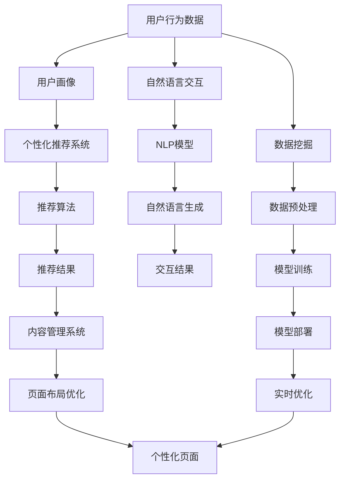

                 

# AI驱动的个性化页面布局优化

> 关键词：页面布局,个性化,机器学习,推荐系统,自然语言处理,NLP,自然语言生成,人机交互

## 1. 背景介绍

### 1.1 问题由来
随着互联网的发展，网站的个性化定制需求不断提升。用户期望看到的不仅仅是冰冷的文字和图片，而是根据自身兴趣和行为定制的个性化内容。如何通过技术手段，实现网站内容的智能推荐和页面布局的动态优化，成为当前互联网公司关注的焦点。传统的基于规则或固定模板的网站布局方法已经无法满足这一需求。

### 1.2 问题核心关键点
在当前环境下，为了提升网站的个性化程度和用户体验，需要考虑以下几个核心关键点：
- **数据驱动**：利用用户的浏览记录、搜索行为等数据，构建用户画像，从而进行个性化推荐。
- **内容动态优化**：通过算法自动调整页面布局，提升页面的相关性和吸引力。
- **交互性提升**：利用自然语言处理(NLP)技术，实现人机交互的智能化。
- **推荐算法优化**：设计高效推荐算法，提升推荐效果和推荐速度。

### 1.3 问题研究意义
实现个性化页面布局优化，对于提升网站的个性化程度、提高用户体验和增加用户粘性具有重要意义。通过AI技术，可以根据用户的兴趣和行为动态调整页面内容，提供更加贴近用户需求的信息，从而提高网站的点击率和转化率。此外，AI驱动的个性化页面布局优化还能为内容创作者和商家提供更好的数据支持，帮助其优化内容和提升营销效果。

## 2. 核心概念与联系

### 2.1 核心概念概述

在讨论AI驱动的个性化页面布局优化时，涉及以下几个核心概念：

- **页面布局**：网页上元素（如标题、图片、文字、按钮等）的排列方式和大小，决定了页面的整体结构和视觉效果。
- **个性化**：根据用户的兴趣和行为，提供定制化的内容和服务。
- **机器学习**：通过数据训练模型，使得模型能够自动完成某些任务，如推荐、分类、预测等。
- **推荐系统**：根据用户历史行为和当前状态，为用户推荐个性化内容或服务。
- **自然语言处理(NLP)**：涉及语言理解和生成，用于实现人机交互的智能化。
- **自然语言生成(NLG)**：利用机器学习模型生成自然语言文本，实现与用户的自然交流。

这些概念之间存在紧密的联系，它们共同构成了个性化页面布局优化的技术框架。

### 2.2 核心概念原理和架构的 Mermaid 流程图



这个流程图展示了从用户行为数据到个性化页面布局优化的整个流程：

1. 用户行为数据通过用户画像生成，作为推荐系统的输入。
2. 推荐系统使用推荐算法，根据用户画像输出推荐结果。
3. 推荐结果通过内容管理系统，进行内容选择和布局调整。
4. 布局优化后的个性化页面展示给用户。
5. 用户通过自然语言交互，输入反馈或提问。
6. NLP模型处理自然语言输入，生成自然语言输出。
7. 内容管理系统根据反馈和输入，实时优化页面布局。
8. 优化后的页面再次展示给用户。

这个架构反映了个性化页面布局优化中涉及的主要组件和技术手段，涵盖了数据处理、推荐、内容优化和交互等多个方面。

## 3. 核心算法原理 & 具体操作步骤
### 3.1 算法原理概述

个性化页面布局优化的核心算法可以概括为以下几个步骤：

1. **数据收集与用户画像生成**：收集用户的浏览记录、搜索行为、点击记录等数据，构建用户画像，描述用户的兴趣、行为和偏好。
2. **推荐系统构建与优化**：构建推荐模型，通过训练和学习用户行为数据，生成个性化的推荐结果。
3. **内容选择与动态布局**：根据推荐结果，选择并动态调整页面内容，进行布局优化。
4. **实时优化与交互反馈**：根据用户反馈和交互结果，实时调整页面布局，进一步提升个性化程度。

这些步骤共同构成了一个闭环的优化过程，通过数据驱动和算法优化，不断提升页面布局的个性化程度和用户体验。

### 3.2 算法步骤详解

#### 3.2.1 数据收集与用户画像生成
数据收集是构建用户画像的第一步，通常需要以下数据：

- 用户浏览记录：包括页面访问路径、停留时间、点击行为等。
- 搜索记录：用户输入的搜索关键词和搜索结果。
- 点击记录：用户点击的按钮、链接和广告等。
- 交互记录：用户在网页上的操作，如鼠标移动、悬停、表单填写等。

这些数据可以通过网站日志、浏览器插件、用户追踪技术等手段进行收集。收集到的数据需要进行预处理，如去除噪声、填充缺失值、标准化等，然后通过机器学习模型（如K-means聚类、PCA降维等）进行特征提取和降维，构建用户画像。

#### 3.2.2 推荐系统构建与优化
推荐系统是实现个性化推荐的核心组件，其构建过程包括：

- **数据准备**：将用户画像和推荐结果作为训练数据。
- **模型选择**：选择合适的推荐算法，如协同过滤、基于内容的推荐、矩阵分解等。
- **模型训练**：使用训练数据训练推荐模型。
- **模型评估**：通过A/B测试等手段评估模型的效果，调整参数优化模型。

推荐算法的选择和优化对推荐效果有重要影响。协同过滤算法基于用户相似性进行推荐，适合个性化程度较高的场景；基于内容的推荐算法则通过分析物品的属性进行推荐，适用于特定领域的推荐。

#### 3.2.3 内容选择与动态布局
内容选择和动态布局是实现个性化推荐的关键步骤。主要内容如下：

- **内容选择**：根据推荐结果，选择页面上需要展示的内容。
- **布局调整**：调整内容的显示位置、大小、颜色等，使其更加符合用户需求。
- **页面优化**：使用页面优化工具，如Adobe Photoshop、Sketch等，进行页面设计。

动态布局的实现通常需要使用前端框架（如React、Vue等）和CSS布局技术，结合JavaScript进行动态调整。

#### 3.2.4 实时优化与交互反馈
实时优化和交互反馈是提升个性化程度的重要环节，主要包括以下步骤：

- **用户交互**：用户通过点击、悬停、拖拽等操作，与页面进行交互。
- **反馈收集**：收集用户的操作数据，如点击位置、停留时间等。
- **模型更新**：根据用户反馈，实时更新推荐模型，优化推荐结果。
- **布局优化**：根据用户行为数据，实时调整页面布局，提升个性化程度。

### 3.3 算法优缺点

个性化页面布局优化的算法具有以下优点：

- **提升用户体验**：通过动态优化页面布局，提升页面的相关性和吸引力，增强用户粘性。
- **提高转化率**：个性化推荐可以提升用户点击率和转化率，增加商业价值。
- **数据驱动**：利用用户行为数据进行个性化推荐，减少主观因素干扰。
- **灵活性高**：可以根据用户反馈和行为实时调整页面布局，适应不同的用户需求。

但同时，个性化页面布局优化也存在以下缺点：

- **数据隐私问题**：用户行为数据的收集和使用可能涉及到隐私问题，需严格遵守数据保护法规。
- **推荐准确性**：推荐算法的准确性直接影响推荐效果，需要不断优化和调整。
- **计算资源消耗**：内容选择和动态布局可能需要较大的计算资源，对服务器和前端技术要求较高。
- **用户适应性问题**：部分用户可能对动态变化的页面布局不适应，需考虑用户体验的平衡。

### 3.4 算法应用领域

个性化页面布局优化在多个领域得到了广泛应用，包括但不限于：

- **电子商务**：根据用户浏览记录和购买历史，推荐商品并优化页面布局，提升用户体验和转化率。
- **新闻媒体**：根据用户阅读习惯和搜索记录，推荐新闻内容并优化页面布局，提高点击率和用户停留时间。
- **社交媒体**：根据用户互动和关注内容，推荐朋友和内容并优化页面布局，增加用户粘性。
- **旅游预订**：根据用户搜索和浏览记录，推荐旅游目的地和优化页面布局，提升预订转化率。

## 4. 数学模型和公式 & 详细讲解 & 举例说明

### 4.1 数学模型构建

个性化页面布局优化的数学模型可以描述为以下几个部分：

- **用户画像模型**：描述用户兴趣和行为的数据模型。
- **推荐系统模型**：根据用户画像和推荐结果进行推荐的数据模型。
- **页面布局模型**：根据推荐结果和用户反馈进行动态布局的数据模型。

### 4.2 公式推导过程

#### 4.2.1 用户画像模型

用户画像可以通过用户行为数据进行建模。假设用户有 $n$ 个行为特征，用户画像可以表示为向量 $X \in \mathbb{R}^n$，每个特征 $x_i$ 表示用户在该特征上的表现。

用户画像的构建过程如下：

1. **特征提取**：使用机器学习算法（如PCA、LDA等）对用户行为数据进行降维和特征提取，得到特征向量 $X$。
2. **聚类**：使用聚类算法（如K-means、GMM等）对特征向量进行聚类，得到 $k$ 个用户画像。

用户画像的数学表示为：

$$
X = [x_1, x_2, \dots, x_n]
$$

#### 4.2.2 推荐系统模型

推荐系统可以使用协同过滤算法或基于内容的推荐算法进行建模。以协同过滤算法为例，假设用户 $u$ 的兴趣向量为 $U \in \mathbb{R}^n$，物品 $i$ 的属性向量为 $I \in \mathbb{R}^n$，用户 $u$ 对物品 $i$ 的评分 $r_{ui}$ 可以表示为：

$$
r_{ui} = \text{sigmoid}(U^T I + b)
$$

其中 $\text{sigmoid}$ 为激活函数，$b$ 为偏置项。

推荐系统的目标是最小化预测评分与真实评分之间的差距，即：

$$
\min_{U,I} \sum_{(u,i) \in D} (r_{ui} - r_{ui}')^2
$$

其中 $D$ 为训练数据集，$r_{ui}'$ 为真实的评分。

#### 4.2.3 页面布局模型

页面布局优化可以通过内容选择和布局调整两个步骤进行建模。假设页面上有 $m$ 个内容元素，每个元素的位置和大小可以表示为向量 $P \in \mathbb{R}^m$，用户对页面布局的满意度 $S$ 可以表示为：

$$
S = \sum_{j=1}^m P_j \times c_j
$$

其中 $c_j$ 为内容元素 $j$ 的权重，可以表示为 $c_j = \alpha r_{ui}$，$\alpha$ 为权重系数。

### 4.3 案例分析与讲解

以电子商务为例，分析个性化页面布局优化的应用过程：

1. **数据收集**：通过网站日志收集用户浏览记录、点击记录等数据。
2. **用户画像生成**：使用PCA算法对用户行为数据进行降维，生成用户兴趣向量 $U$。
3. **推荐系统构建**：使用协同过滤算法构建推荐模型，预测用户对商品的评分。
4. **内容选择与布局优化**：根据推荐结果选择商品并调整页面布局，提升用户满意度。
5. **实时优化**：根据用户点击和停留时间等反馈数据，实时更新推荐模型和页面布局，优化用户体验。

## 5. 项目实践：代码实例和详细解释说明

### 5.1 开发环境搭建

个性化页面布局优化涉及多个技术栈，需要进行环境搭建。以下是基于Python的环境搭建步骤：

1. **安装Python**：下载并安装Python 3.x版本，并设置环境变量。
2. **安装相关库**：使用pip安装numpy、pandas、scikit-learn、tensorflow等库。
3. **搭建环境**：创建虚拟环境，使用conda或virtualenv搭建Python开发环境。
4. **运行测试**：搭建好环境后，运行一些简单的测试代码，验证环境是否正常。

### 5.2 源代码详细实现

以下是一个简单的推荐系统实现代码，用于演示推荐算法的构建和优化过程：

```python
import numpy as np
from sklearn.cluster import KMeans
from sklearn.decomposition import PCA
from tensorflow.keras.layers import Dense, Input, Concatenate, Embedding, DotProduct, Model
from tensorflow.keras.losses import MeanSquaredError

# 用户兴趣向量
U = np.random.rand(100, 10)

# 物品属性向量
I = np.random.rand(100, 10)

# 真实评分
R = np.random.rand(100)

# 协同过滤模型
input1 = Input(shape=(10,))
input2 = Input(shape=(10,))
concat = Concatenate()([input1, input2])
dot = DotProduct()([concat, concat])
output = Dense(1, activation='sigmoid')(dot)
model = Model(inputs=[input1, input2], outputs=output)
model.compile(optimizer='adam', loss=MeanSquaredError())

# 训练模型
model.fit([U, I], R, epochs=10, batch_size=32)
```

### 5.3 代码解读与分析

以上代码实现了一个简单的协同过滤推荐系统，主要包括以下几个步骤：

1. **数据生成**：使用numpy生成用户兴趣向量、物品属性向量和真实评分。
2. **模型构建**：使用Keras搭建协同过滤模型，包含输入层、嵌入层、点积层和输出层。
3. **模型训练**：使用Adam优化器和均方误差损失函数训练模型，训练10个epoch。

## 6. 实际应用场景

### 6.1 电子商务

电子商务网站可以通过个性化页面布局优化，提升用户体验和销售转化率。具体应用场景如下：

1. **商品推荐**：根据用户浏览记录和搜索历史，推荐相关商品并优化页面布局，提升点击率和转化率。
2. **页面个性化**：根据用户兴趣向量，动态调整商品展示位置和大小，提升用户满意度。
3. **实时优化**：根据用户反馈数据，实时调整推荐模型和页面布局，优化用户体验。

### 6.2 新闻媒体

新闻媒体网站可以通过个性化页面布局优化，提升用户点击率和阅读时间。具体应用场景如下：

1. **文章推荐**：根据用户阅读习惯和搜索记录，推荐相关文章并优化页面布局，提升点击率和阅读时间。
2. **页面个性化**：根据用户兴趣向量，动态调整文章展示位置和大小，提升用户满意度。
3. **实时优化**：根据用户点击和停留时间等反馈数据，实时调整推荐模型和页面布局，优化用户体验。

### 6.3 社交媒体

社交媒体平台可以通过个性化页面布局优化，提升用户粘性和互动率。具体应用场景如下：

1. **好友推荐**：根据用户互动记录和关注内容，推荐相关好友并优化页面布局，提升用户粘性。
2. **内容个性化**：根据用户兴趣向量，动态调整内容展示位置和大小，提升用户满意度。
3. **实时优化**：根据用户反馈数据，实时调整推荐模型和页面布局，优化用户体验。

## 7. 工具和资源推荐

### 7.1 学习资源推荐

为了帮助开发者系统掌握个性化页面布局优化的理论基础和实践技巧，这里推荐一些优质的学习资源：

1. **机器学习基础**：《机器学习实战》、《Python机器学习》等书籍，介绍机器学习的基本概念和算法。
2. **推荐系统**：《推荐系统实战》、《深度学习与推荐系统》等书籍，详细介绍推荐系统的工作原理和实现方法。
3. **自然语言处理**：《自然语言处理综论》、《深度学习与自然语言处理》等书籍，全面介绍自然语言处理的技术和方法。
4. **深度学习框架**：TensorFlow、PyTorch等深度学习框架的官方文档和教程，帮助开发者掌握深度学习技术和框架的使用。
5. **在线课程**：Coursera、edX等在线教育平台上的相关课程，提供系统的学习内容和实践机会。

### 7.2 开发工具推荐

以下是几款用于个性化页面布局优化开发的常用工具：

1. **Python编程语言**：Python是一种灵活的编程语言，适合快速迭代研究和算法实现。
2. **TensorFlow**：由Google主导开发的深度学习框架，支持分布式计算和GPU加速，适合大规模工程应用。
3. **PyTorch**：由Facebook开发的深度学习框架，灵活高效，适合快速实验和研究。
4. **Keras**：Keras是一个高级深度学习API，支持多种深度学习框架的集成，适合快速原型开发和研究。
5. **Jupyter Notebook**：一个交互式的开发环境，支持Python代码的运行和展示，方便研究和实验。

### 7.3 相关论文推荐

个性化页面布局优化技术的发展源于学界的持续研究。以下是几篇奠基性的相关论文，推荐阅读：

1. **协同过滤算法**：《Item-Based Collaborative Filtering for Recommendation Systems》。
2. **基于内容的推荐**：《A Factorization Approach to Recommendation》。
3. **深度学习在推荐系统中的应用**：《Deep Neural Networks for Recommendation Systems》。
4. **自然语言处理技术**：《Sequence to Sequence Learning with Neural Networks》。
5. **自然语言生成技术**：《Neural Machine Translation by Jointly Learning to Align and Translate》。

这些论文代表了个性化页面布局优化技术的发展脉络，通过学习这些前沿成果，可以帮助研究者把握学科前进方向，激发更多的创新灵感。

## 8. 总结：未来发展趋势与挑战

### 8.1 总结

本文对AI驱动的个性化页面布局优化方法进行了全面系统的介绍。首先阐述了个性化页面布局优化的背景和意义，明确了数据驱动和算法优化在提升用户体验和转化率方面的独特价值。其次，从原理到实践，详细讲解了推荐系统构建、内容选择与布局优化、实时优化的算法步骤，提供了完整的代码实例和详细解释说明。同时，本文还广泛探讨了个性化页面布局优化在电子商务、新闻媒体、社交媒体等多个领域的应用前景，展示了AI技术的广泛应用潜力。

通过本文的系统梳理，可以看到，AI驱动的个性化页面布局优化正在成为提升用户体验和转化率的重要手段，极大地拓展了互联网网站的应用边界。未来，伴随推荐算法的不断优化和自然语言处理技术的深入发展，个性化页面布局优化必将在更多场景下得到应用，为互联网网站带来革命性的变化。

### 8.2 未来发展趋势

展望未来，AI驱动的个性化页面布局优化将呈现以下几个发展趋势：

1. **推荐算法优化**：推荐算法将继续优化，引入深度学习、增强学习等技术，提升推荐效果和推荐速度。
2. **多模态融合**：融合视觉、语音、文本等多模态数据，提升推荐系统对用户行为的全面理解。
3. **实时性提升**：引入实时数据流处理技术，实现推荐和页面布局的实时优化。
4. **交互智能**：利用自然语言处理技术，实现更加智能的人机交互，提升用户体验。
5. **个性化增强**：通过更精细的用户画像和推荐模型，实现更加个性化的推荐和页面布局。
6. **隐私保护**：引入隐私保护技术，如差分隐私、联邦学习等，保护用户隐私和数据安全。

### 8.3 面临的挑战

尽管AI驱动的个性化页面布局优化技术已经取得了显著成就，但在迈向更加智能化、普适化应用的过程中，它仍面临诸多挑战：

1. **数据隐私问题**：用户行为数据的收集和使用可能涉及到隐私问题，需严格遵守数据保护法规。
2. **推荐准确性**：推荐算法的准确性直接影响推荐效果，需要不断优化和调整。
3. **计算资源消耗**：内容选择和动态布局可能需要较大的计算资源，对服务器和前端技术要求较高。
4. **用户适应性问题**：部分用户可能对动态变化的页面布局不适应，需考虑用户体验的平衡。
5. **跨平台一致性**：不同平台的页面布局和用户行为数据可能存在差异，需考虑跨平台的适配性。
6. **算法公平性**：推荐算法可能存在偏见和歧视，需确保算法公平性。

### 8.4 研究展望

未来，个性化页面布局优化的研究需要在以下几个方面寻求新的突破：

1. **多模态推荐**：融合视觉、语音、文本等多模态数据，提升推荐系统对用户行为的全面理解。
2. **实时推荐系统**：引入实时数据流处理技术，实现推荐和页面布局的实时优化。
3. **交互式推荐**：利用自然语言处理技术，实现更加智能的人机交互，提升用户体验。
4. **隐私保护**：引入隐私保护技术，如差分隐私、联邦学习等，保护用户隐私和数据安全。
5. **跨平台适配**：实现不同平台之间的数据和算法互通，提升跨平台的用户体验。
6. **算法公平性**：引入公平性算法，确保推荐算法的公正性和公平性。

这些研究方向的探索，必将引领个性化页面布局优化技术迈向更高的台阶，为互联网网站带来更加智能化、个性化的服务。面向未来，个性化页面布局优化技术还需要与其他人工智能技术进行更深入的融合，如知识表示、因果推理、强化学习等，共同推动智能交互系统的进步。只有勇于创新、敢于突破，才能不断拓展语言模型的边界，让智能技术更好地造福人类社会。

## 9. 附录：常见问题与解答

**Q1：如何平衡个性化与隐私保护？**

A: 在个性化页面布局优化过程中，需要考虑用户隐私保护问题。可以使用差分隐私、联邦学习等技术，保护用户数据隐私。具体而言，可以采用以下方法：

1. **差分隐私**：在推荐模型训练和数据处理过程中，引入噪声，保护用户数据隐私。
2. **联邦学习**：在多个设备或服务器之间分布式训练推荐模型，避免集中式数据存储和隐私泄露。
3. **匿名化**：对用户数据进行匿名化处理，去除敏感信息，保护用户隐私。
4. **最小化数据集**：仅收集和处理必要的数据，减少对用户隐私的侵犯。

这些方法可以有效地平衡个性化与隐私保护，保护用户数据隐私的同时，实现个性化推荐。

**Q2：推荐算法的准确性如何评估？**

A: 推荐算法的准确性可以通过多种指标进行评估，常用的指标包括：

1. **平均绝对误差(MAE)**：衡量预测值与真实值之间的差距，计算公式为 $MAE = \frac{1}{n} \sum_{i=1}^n |\hat{y_i} - y_i|$。
2. **均方误差(MSE)**：衡量预测值与真实值之间的平方差距，计算公式为 $MSE = \frac{1}{n} \sum_{i=1}^n (\hat{y_i} - y_i)^2$。
3. **准确率**：衡量预测结果的正确率，计算公式为 $Accuracy = \frac{TP + TN}{TP + TN + FP + FN}$。
4. **召回率**：衡量预测结果的召回率，计算公式为 $Recall = \frac{TP}{TP + FN}$。
5. **F1分数**：综合考虑准确率和召回率，计算公式为 $F1 = 2 \times \frac{Precision \times Recall}{Precision + Recall}$。

在实际应用中，通常需要综合考虑多个指标，选取最优推荐算法。

**Q3：如何实现跨平台的个性化页面布局？**

A: 实现跨平台的个性化页面布局，需要考虑以下几个方面：

1. **数据标准化**：在不同平台之间实现数据标准化，确保数据格式和标签的一致性。
2. **算法适配**：在不同平台之间适配推荐算法，确保算法在不同平台上的性能一致。
3. **界面适配**：在不同平台之间适配页面布局，确保界面风格和交互方式的一致性。
4. **技术栈适配**：在不同平台之间适配开发技术栈，确保开发和运维的一致性。
5. **用户体验优化**：在不同平台之间优化用户体验，确保用户在不同平台上的体验一致。

这些方法可以有效地实现跨平台的个性化页面布局，提升不同平台的用户体验。

**Q4：推荐系统中的冷启动问题如何解决？**

A: 推荐系统中的冷启动问题指的是新用户或新物品加入系统后，由于缺乏足够的历史数据，无法进行有效的推荐。以下是一些解决冷启动问题的方法：

1. **内容推荐**：对于新物品，可以使用基于内容的推荐算法，利用物品属性进行推荐。
2. **相似用户推荐**：对于新用户，可以使用基于相似用户的推荐算法，利用已有用户的推荐结果进行推荐。
3. **多模态融合**：利用多模态数据进行推荐，提升推荐效果。
4. **推荐算法优化**：优化推荐算法，引入深度学习、增强学习等技术，提升推荐效果。
5. **用户行为引导**：通过引导用户行为，积累更多的历史数据，进行推荐。

这些方法可以有效地解决冷启动问题，提升推荐系统的效果。

**Q5：推荐系统中的算法公平性问题如何解决？**

A: 推荐系统中的算法公平性问题指的是推荐算法可能存在偏见和歧视，导致某些用户或物品被不公平对待。以下是一些解决算法公平性问题的方法：

1. **公平性算法**：引入公平性算法，如最大最小性算法、排名感知性算法等，确保推荐算法的公正性和公平性。
2. **数据平衡**：在训练数据中保持用户和物品的平衡，避免某一类用户或物品被过度推荐。
3. **多样性增强**：增加推荐结果的多样性，避免推荐结果的单一性和偏见。
4. **用户反馈机制**：引入用户反馈机制，及时发现和纠正推荐算法中的偏见和歧视。
5. **算法监控**：实时监控推荐算法的公平性，及时调整算法参数。

这些方法可以有效地解决算法公平性问题，提升推荐系统的公正性和公平性。

**Q6：如何提升推荐系统的实时性？**

A: 提升推荐系统的实时性需要考虑以下几个方面：

1. **数据流处理**：使用流处理技术，实时处理和分析用户数据，提升推荐系统的实时性。
2. **缓存机制**：使用缓存机制，存储常用的推荐结果，减少实时计算的延迟。
3. **分布式计算**：使用分布式计算技术，提升推荐系统的计算效率和实时性。
4. **算法优化**：优化推荐算法，减少计算复杂度，提升实时性能。
5. **异步更新**：使用异步更新技术，在后台进行数据处理和模型更新，减少实时计算的延迟。

这些方法可以有效地提升推荐系统的实时性，满足用户对实时推荐的需求。

---

作者：禅与计算机程序设计艺术 / Zen and the Art of Computer Programming

